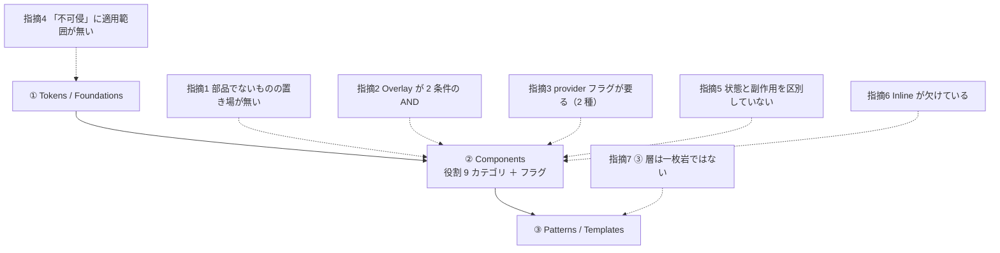

# OBS-0001: ③ 層は「層の性質」ではなく「置くための条件」だった

> 凡例：🟦 確定／根拠あり ・ 🟨 暫定／裁量 ・ 🟥 未確認・要本人確認

## 0. 一行サマリ【起票時必須】

思想③の「component の足し算では出ない」は**③ 層全体を説明する性質**だと読んでいたが、実装すると**③ 層に置いてよいかを判定する条件**だった。

## 1. きっかけ（何を見て・何に引っかかったか）【起票時必須】

手4 の Q4 で、思想③「コンポーネントの足し算だけではページにならない。組み合わせの定石はひとつ上の層になる」が本当かを確かめるため、
**先に仮説として 3 件を切り出してから**画面を組んだ（`ListDetail` / `AppShell` / `EmptyState`）。

書き終えて `EmptyState` を読み返したとき、**12 行しかなく、素材の `Empty` を薄く包んだだけ**だと気づいた。
「これは ③ 層に置く意味があるのか？」という違和感が起点。

## 2. 経緯と今の理解【起票時必須】

- **問い**: ③ 層に置いたもののうち、本当に「足し算では出ない」のはどれか。
- **観測**: 3 件のうち **1 件は足し算で書けた**（[DR-0039](../DR/DR-0039-pattern-layer-is-not-uniform.md)）。

  | | 足し算で出るか | 持っていたもの |
  |---|---|---|
  | `ListDetail` | 🟦 出ない | 状態の調整 ＋ DataDisplay × Overlay の突き合わせ |
  | `AppShell` | 🟨 微妙 | 構造は足し算。ただし「3 層の面の割り当て」は部品に書けない |
  | `EmptyState` | 🟥 **出る** | `Empty` を薄く包んだ 12 行 |

- **現在地**: 「足し算では出ない」を**層の説明**と読むと `EmptyState` が反例になるが、
  **層に入れるための条件**と読むと `EmptyState` は「そもそも ③ 層ではない」というだけになり、矛盾しない。
- **条件は 2 つに絞れた**（少なくとも一方を満たすもの）:
  1. **状態を持つ**
  2. **複数の役割カテゴリをまたぐ**

## 3. 知識の結びつき ★主目的

- **既に持っていた知識・経験**: 思想③（Nathan Curtis の component ≠ pattern ≠ template）。
  ② 層は「役割」でフラット分類し、粒度（Atomic Design）は採らないと決めてあった。
- **今回新しく得た・繋がった知識**: **② 層で「粒度で分けない」と決めたのに、③ 層は暗黙に「粒度が上」として定義されていた**。
  「ひとつ上の層」という言い方自体が粒度の語彙。
- **結びついて生まれた気づき（一般則）**:
  > **層の定義は「何が大きいか」ではなく「何を満たすか」で書くと、分類の例外が出なくなる。**
  > ② 層で Atomic Design を捨てた理由（境界が主観的で論争に正解が無い）は、**③ 層にもそのまま当てはまる。**

🟨 上記の「一般則」は実装 3 件からの帰納であり、**サンプルが少ない**。手5・手7 で ③ 層に部品が増えたら再検証する。

## 4. 結論と保留

- **今の結論**: 🟦 **③ 層は一枚岩ではない。**置くための条件を明記すれば、`EmptyState` のようなものは ② 層のラッパーへ降ろせる。
- **保留・未確認**: 🟨 `EmptyState` を実際に `Communication/EmptyState` へ移すかは**まだ動かさない**（2 回目の需要が出るまで。2 回ルール）。
  🟥 `AppShell` の判定（微妙）は決着していない。「面の割り当て」が条件 1・2 のどちらにも当たらないため。
- **この結論が変わる条件**: ③ 層に 5 件以上たまったとき、条件 1・2 で説明できないものが出たら見直す。

## 5. 却下した代替案

| 案 | 内容 | 却下理由 |
|---|---|---|
| `EmptyState` をすぐ ② 層へ移す | 条件を満たさないので移すのが筋 | **2 回ルール。**別の空状態パターンが出るまで必要性が 1 回しか証明されていない |
| 思想③を「足し算で出るものも含む」と読み替える | 反例を許容する読み方 | **層の意味が消える。**何を置いてよいかの判定ができなくなる |

## 6. DR への導線

- **DR 化**: 🟦 **済（finding として）** — [DR-0039](../DR/DR-0039-pattern-layer-is-not-uniform.md) が観測を記録している。
  本 OBS が持つのは**「層の定義は満たす条件で書く」という一般則**のほうで、これは**まだ決定ではない**。
- **関連する既存 DR**: DR-0039・DR-0015（思想への指摘 3 点）
- **PoC へ戻す候補か**: 🟦 戻す。`packages/ui` の層構成を決めるときに効く（DR-0039 の `poc_feedback`）。

## 7. 出典・関連ドキュメント

- 会話: 2026-07-26 第 3 セッション（手4 の実行 → 結果報告）
- 関連ドキュメント: [共通コンポーネント思想への指摘.md](../共通コンポーネント思想への指摘.md) 指摘 7 ／ [実行記録.md](../実行記録.md) §手4
- 🟨 図解（使い捨て）: [規定が細かい層ほど、実装すると例外が出る](https://claude.ai/code/artifact/e76b2e36-dcc5-44ac-93a4-43617a8278fd)
- 外部出典: Nathan Curtis「component ≠ pattern ≠ template」（思想③の出典）

## 8. 見直しログ

### 2026-07-26

起票（手4 完了時）。§3 まで埋めた状態で `connected`。`EmptyState` の移設と `AppShell` の判定は保留。

## 9. 図解アーカイブ

### 2026-07-26 思想の 3 層と指摘の分布

キャプション: 7 件のうち 5 件が ② に集まる。**規定が細かい層ほど実装で例外が出る**（[共通コンポーネント思想への指摘.md](../共通コンポーネント思想への指摘.md) §8）。
