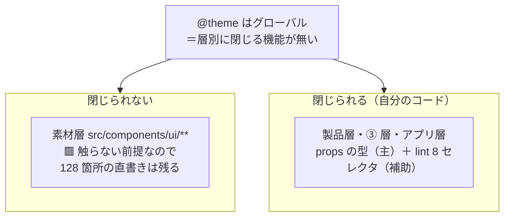

# OBS-0002: 枠は「禁止」では閉じず「型」で閉じた

> 凡例：🟦 確定／根拠あり ・ 🟨 暫定／裁量 ・ 🟥 未確認・要本人確認

## 0. 一行サマリ【起票時必須】

「定義した値しか使わせない」を lint（禁止）で実現しようとすると穴だらけになり、**実際に閉じたのは props の型（有限集合）だった**。

## 1. きっかけ（何を見て・何に引っかかったか）【起票時必須】

ユーザーの要求「**色や余白は基本的に定義したモノしか使いたくない。共通コンポーネントもアプリ側も同じ**」を
`tailwindcss/no-arbitrary-value: error` が既に満たしていると思っていた。
プローブを 6 個書いて実測したら、**止まったのは 3 個だけ**だった（`p-13` / `gap-7` / `w-99` が素通り）。

## 2. 経緯と今の理解【起票時必須】

lint 側の穴が**次々に出た**。

| # | 穴 | 出た手 |
|---|---|---|
| 1 | `no-arbitrary-value` は**角括弧しか見ない**。`p-13`(52px) / `w-99`(396px) は素通り（[DR-0028](../DR/DR-0028-token-frame-is-not-closed.md)） | 手3 |
| 2 | 検査する文脈は **className / cva / cn の 3 つだけ**。素の const と object literal は見ない（[DR-0038](../DR/DR-0038-arbitrary-value-rule-sees-three-contexts.md)） | 手3 |
| 3 | `@theme` はグローバルで**層別に閉じられない**。閉じると素材層が死ぬ（DR-0028） | 手3 |
| 4 | 自前セレクタを張っても **`cva` / 定数経由は抜ける** | 手3 |
| 5 | **層を足すと新ディレクトリが射程外**になる（[DR-0040](../DR/DR-0040-frame-leaks-when-a-layer-is-added.md)） | 手4 |

一方、**props で semantic 名だけを受ける形にしたら穴が無かった**（[DR-0032](../DR/DR-0032-layout-primitives-take-props-not-classname.md)）。
`className` を受け取らなければ、そもそも書ける場所が存在しない。

**手4 の実測**: チケット一覧を組んで、**`Box`（唯一の逃げ道）への逃げは 0 回**。製品層・③ 層・アプリ層の lint 赤も 0 件。

## 3. 知識の結びつき ★主目的

- **既に持っていた知識・経験**: PoC 側で `no-arbitrary-value: error` が「先に立っている」ことを地形図に描いており、
  **「守るための構造は既にある」**という前提で手0〜手2b を進めていた。
- **今回新しく得た・繋がった知識**: そのルールが禁じているのは「**書き方（角括弧）**」であって「**値の出どころ**」ではなかった。
  Tailwind v4 の spacing は `calc(var(--spacing) * n)` の動的生成で **n に上限が無い**——基数を 1 個定義した時点で無限個の段が定義済みになっている。
- **結びついて生まれた気づき（一般則）**:
  > **禁止（ブラックリスト）は、書き方の数だけ穴が開く。許可（型の有限集合）は、書ける場所そのものを無くす。**
  > **枠を作るなら、まず「書ける場所を減らす」設計をして、lint はその補助に置く。**

🟨 逆向きの代償もある。**逃げ道をゼロにすると語彙不足で詰む**ので、`Box` 1 つに集約した。
**「Box に何回逃げたか」が枠の健全性の指標**になる（手3・手4 とも 0 回）。

## 4. 結論と保留

- **今の結論**: 🟦 **props の型が主、lint は補助。**この順序で手3・手4 とも赤 0 件を維持できた。
- **保留・未確認**:
  - 🟥 **穴 5（層を足すと漏れる）への恒久対策は未決。**`files` を絞らず `ignores` で素材層だけ外す案があるが副作用未検証（DR-0040）。
  - 🟨 `Box` への逃げ回数は**まだ画面 1 枚**での観測。手7（Claude Design が組む）で増える可能性が高い。
- **この結論が変わる条件**: `Box` への逃げが増え始めたら、**語彙の不足か API 形の誤り**なので設計を見直す。

## 5. 却下した代替案

| 案 | 内容 | 却下理由 |
|---|---|---|
| `--spacing: initial` で枠を閉じる | Tailwind の名前空間を消して定義した段だけ残す | 🟥 **素材層 18 部品の余白 128 箇所が全部死ぬ。しかもビルドは緑のまま通る**（DR-0028） |
| `no-custom-classname` の whitelist | プラグインが持つ許可リスト機能 | **`p-13` は正当な Tailwind クラス**なので検出対象外（実測） |
| 逃げ道をゼロにする | `Box` にも className を持たせない | 語彙が足りないとき手が無くなり、**Q1 の観測指標も失われる** |

## 6. DR への導線

- **DR 化**: 🟦 **決定は済**（DR-0032・DR-0033）。本 OBS が持つのは**「禁止より型」という一般則**で、これは横断的な設計原則。
  🟨 **ADR 昇格候補として DR-0032 / DR-0033 に印が付いている**（起案はまだ）。
- **関連する既存 DR**: DR-0028・0032・0033・0038・0040
- **PoC へ戻す候補か**: 🟥 **戻す。**PoC も同じ lint を持ち、同じ穴がある。

## 7. 出典・関連ドキュメント

- 会話: 2026-07-26 第 3 セッション（D4 / D11 の調査 → 手3 の実装 → 手4 の実証）
- 関連ドキュメント: [デザイントークン設計.md](../デザイントークン設計.md) ／ [実行記録.md](../実行記録.md) §手3・§手4
- 外部出典: [Braid Design System](https://seek-oss.github.io/braid-design-system/)（上位部品は style 上書きを受けず Box だけが例外）

## 8. 見直しログ

### 2026-07-26

起票。手3 の設計判断と手4 の実証（Box 0 回・赤 0 件）が揃った時点で `connected`。

## 9. 図解アーカイブ

### 2026-07-26 層ごとに閉じ方が違う

キャプション: `@theme` では層別に閉じられないので、**閉じ方を層ごとに変えた**（DR-0033）。
