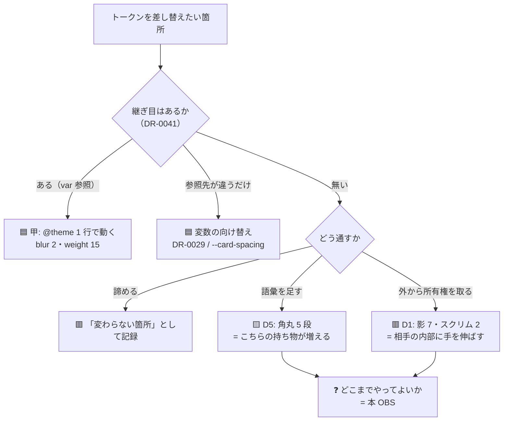

# OBS-0005: どこまで「無理をして通す」べきかの判断軸が無い

> 凡例：🟦 確定／根拠あり ・ 🟨 暫定／裁量 ・ 🟥 未確認・要本人確認

## 0. 一行サマリ【起票時必須】

トークンが素直に通らない箇所を「**外から無理やり通す**」ことは技術的にできると分かったが、
**どこまでやるのが正しいのかの判断軸が無い**。手5 の D1（影・スクリム）と D5（角丸の非線形 5 段）が同じ形の問いだった。

## 1. きっかけ（何を見て・何に引っかかったか）【起票時必須】

手5 の手順書 §2 を埋める段で、**D1 と D5 が独立した論点として並んでいたのに、実は同じ問いだった**ことに気づいた。

| # | 素直に通らない理由 | 通すために必要なこと |
| --- | --- | --- |
| **D1** 影 7 箇所・スクリム 2 箇所 | `shadow-*` は theme 変数を参照せずリテラルを焼き込む。`bg-black/10` は不透明度が焼き込み（[DR-0041](../DR/DR-0041-tailwind-v4-seams-differ-per-utility.md)） | **レイヤ外からプロパティの所有権を外が取る**（[DR-0042](../DR/DR-0042-layer-external-override-reaches-properties.md)） |
| **D5** 角丸 5 段 | tmp-admin は 8/12/18/28 の**非線形**、shadcn は単一基数 `--radius` からの比率派生 | **段ごとに `@theme inline` で上書き**＝ **語彙の追加** |

どちらも「**トークンの継ぎ目が無いところに、外から継ぎ目を作りにいく**」形。
そして**どちらも「やればできる」**——できるかどうかは実測で解決している。**残っているのは「やるべきか」だけ。**

🟥 **ここで手が止まった。**判断のための軸が無い。

## 2. 経緯と今の理解【起票時必須・「わからない」でもよい】

### 問い

**「部品を触らずにテーマを差し替えられる」という結論は、どこまで無理をして得たものなら価値があるのか。**

### 分かっていること（実測）

- 🟦 レイヤ外の上書きは**任意値にも届く**（[DR-0042](../DR/DR-0042-layer-external-override-reaches-properties.md)）。技術的な障害は無い
- 🟥 ただし上書きは**変異を潰す**。`data-[size=sm]` / `focus-visible:` / `hover:` は
  すべて `@layer utilities` の中にいるので、外から 1 規則書くと全部を平坦化する
- 🟥 上書きは**壊れ方が悪い**。shadcn が変数名を変えたら「効かなくなる」（気づける）が、
  shadcn が variant を足したら「**黙って潰す**」（気づけない）
- 🟦 語彙の追加は本 repo が既に何度もやっている（手2 で 15 語彙・手3 で +6・手4 で +8）。
  **語彙を足すこと自体は否定されていない**——[DR-0019](../DR/DR-0019-semantic-spacing-typography-vocabulary.md) がその方針

### 仮説（🟥 本人未確認）

**「無理の質」が 2 種類ある**のではないか。

| | 例 | 性質 |
| --- | --- | --- |
| 🟨 **語彙を足す無理** | D5 の角丸 5 段 | **こちらの持ち物が増える**。増えた分は自分で管理できる |
| 🟥 **相手の内部に手を入れる無理** | D1 のレイヤ外上書き | **相手の持ち物に外から手を伸ばす**。相手が変わると壊れる |

これが正しければ D5 と D1 は同列に扱えず、**D5 は通してよく D1 は慎重にすべき**ということになる。
🟥 **ただしこれは Claude の整理であって本人の見立てではない。**

### 何がわかれば解けそうか

- **手5 の 2 段測定の結果**（下記の今回の決定）。「無理をしたときに何がどれだけ壊れるか」が数字で出る
- **手9 の移送時に、どちらの無理が PoC で問題になるか**。上書きは PoC の shadcn 版が変われば壊れる

## 3. 知識の結びつき ★主目的【棚卸しで埋める】

🟥 **未記入。**棚卸しで埋める。

- 既に持っていた知識・経験：🟥
- 今回新しく得た・繋がった知識：🟥
- 結びついて生まれた気づき：🟥

## 4. 結論と保留

- **今の結論**：🟨 **手5 では「両方を順に測る」**（ユーザー判断 2026-07-26・推奨どおり）。
  1 周目は変数の向け替えと `@theme` だけで**素直な追従率**を出し、
  2 周目に上書きと語彙追加を重ねて**追従率と代償**（潰れた variant の件数・足した語彙の数・shadcn 内部への依存箇所）を出す。
  → **判断を先送りにしたのではなく、判断材料を作りにいく形にした。**
- **保留・未確認**：🟥 **「どこまでなら無理をしてよいか」の軸そのものは決まっていない。**
  今回は「両方測る」ことで決めずに済ませている
- **この結論が変わる条件**：手5 の 2 周目で代償が小さければ（潰れた variant が 0〜1 件程度なら）
  「上書きは実用的な手段」に寄る。逆に variant が広範に潰れるなら「素直に通る範囲までが成果」に寄る

## 5. 却下した代替案【任意】

| 案 | 内容 | 却下理由 |
| --- | --- | --- |
| **B** 素直に通るところまで | 変数向け替えと `@theme` だけ。影・スクリム・角丸の段は「変わらない」と記録して終わり | 🟨 却下ではなく **1 周目として採る**。ただしこれだけだと「どこまでなら通せたか」が分からないまま残る |
| **A** 最初から無理をして通す | 上書きと語彙追加を最初から使い、追従率を最大化する | 🟥 **比較対象が無くなる。**Q2（変異を潰さずに済むか）に before が無いと答えられない |

## 6. DR への導線【棚卸し時必須】

- **DR 化**：🟨 **判断保留。**手5 の 2 段測定の結果が出たら decision として起票できる見込み
- **関連する既存 DR**：[DR-0042](../DR/DR-0042-layer-external-override-reaches-properties.md)（可否は決着済み）・[DR-0043](../DR/DR-0043-recount-of-fifteen-unchanged-spots.md)・[DR-0029](../DR/DR-0029-component-token-overridable-outside-layer.md)
- **PoC へ戻す候補か**：🟥 **戻す。**PoC の OBS-0003（テーマ 2 層構造・案B）は
  「レイヤ外からの上書き」を手段として持つことになるが、**その代償を書かないと同じ判断で止まる**

## 7. 出典・関連ドキュメント

- 会話：2026-07-26（第 4 セッション）。手5 手順書 §2 の D1・D5 を決着させる場面。
  ユーザーの回答は「推奨で進めます、ただ判断軸が自分の中で十分ではないため OBS に残してください」
- 関連ドキュメント：[手5 手順書](../手順/手5_トークン差し替え実験.md) §2 ／ [トークンマッピング.md](../トークンマッピング.md) 2.3・§5

## 8. 見直しログ【棚卸しのたび追記。過去の記述は書き換えない】

### 2026-07-26

起票。**判断そのものは「両方測る」で進めるが、判断軸が無いことを観点として残した。**

## 9. 図解アーカイブ

### 2026-07-26 D1 と D5 が同じ形の問いであること

キャプション: 分岐の根拠は [DR-0041](../DR/DR-0041-tailwind-v4-seams-differ-per-utility.md)（継ぎ目の有無）と
[DR-0042](../DR/DR-0042-layer-external-override-reaches-properties.md)（上書きの可否と副作用）。
🟥 **「語彙を足す／所有権を取る」の 2 分は Claude の整理であって本人の見立てではない**（§2 の仮説）。
