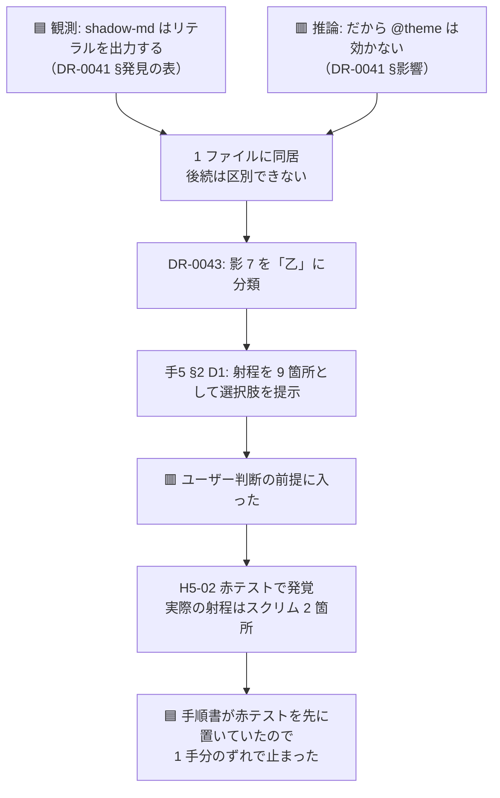

# OBS-0007: 発見に推論を混ぜると、後続の手が数を数え間違える

> 凡例：🟦 確定／根拠あり ・ 🟨 暫定／裁量 ・ 🟥 未確認・要本人確認

## 0. 一行サマリ【起票時必須】

[DR-0041](../DR/DR-0041-tailwind-v4-seams-differ-per-utility.md) の**観測は正しかったが、同じファイルに書いた推論が間違っていた**。
そして [DR-0043](../DR/DR-0043-recount-of-fifteen-unchanged-spots.md) は**その推論を前提に 15 件を数え直した**ので、内訳が 1 手分ずれた。

## 1. きっかけ（何を見て・何に引っかかったか）【起票時必須】

手5 の H5-02（赤テスト）で `@theme { --shadow-md: … }` を投入したら、**予測に反して `.shadow-md` が変わった**（[DR-0044](../DR/DR-0044-tailwind-resolves-tokens-at-build-time-too.md)）。

DR-0041 を読み返すと、**観測と推論が同じ文書の中で地続きになっていた**。

| DR-0041 の記述 | 種別 | 正しさ |
| --- | --- | --- |
| §発見の表「`shadow-md` は `--tw-shadow:0 4px 6px -1px …` を出力する」 | 🟦 **観測** | ✅ 正しい |
| §発見「🟥 動かない — `shadow-*` は theme 変数（`--shadow-md`）を**参照しない**」 | 🟨 観測と推論の混在 | △ 「参照しない」は実行時の話としては正しいが、**「動かない」は推論** |
| §影響「影は逆に確定した。theme 変数を参照しているかもしれないという望みは断たれた」 | 🟥 **推論** | ❌ **誤り** |

テンプレート（`docs/DR/_template.md`）には明記されている:

> 発見（finding）は「何が観測されたか」に徹する。対処は決定（decision）側で書く

**規律は書かれていた。守らなかったのは私（Claude）。**

## 2. 経緯と今の理解【起票時必須・「わからない」でもよい】

### 何が起きたか

```
DR-0041  観測（正）+ 推論（誤）を 1 ファイルに書いた
   ↓     後続は「影は動かない」を事実として読む
DR-0043  15 件を数え直すとき、影 7 箇所を「乙（上書きでしか解けない）」に分類
   ↓
手5 §2   D1 の射程を「影 7 + スクリム 2 = 9 箇所」として選択肢を組み立てた
   ↓     ユーザーに 9 箇所前提で判断を求めた
H5-02    赤テストで誤りが発覚 → 射程はスクリム 2 箇所だけだった
```

🟥 **誤りが 3 文書に伝播し、ユーザー判断の前提にまで入った。**

### なぜ混ざったか（🟥 仮説）

観測を書いた直後は**「この観測が何を意味するか」が頭の中で一番熱い**ので、そのまま書いてしまう。
分離するには「影響」節を書く前に**「これは見たことか、考えたことか」を一度問う**必要があるが、
**その問いを立てる場所がテンプレートに無い**（「§影響」という節名は、むしろ推論を誘っている）。

### 何が救ったか

🟦 **手順書が H5-02（赤テスト）を H5-03 より前に置いていたこと。**
表1 の流し込みを始める前に自分の推論を叩いたので、**1 手分のずれで止まった**。
これが無ければ、1 周目の差し替えを全部やってから「影が変わってしまった」形で発覚していた。

### 何が分かれば解けそうか

- **同じ形の混入が他の DR にもあるか。**特に [DR-0043](../DR/DR-0043-recount-of-fifteen-unchanged-spots.md) は
  🟥 **推論の塊**（16 行すべてが「この機構ならこう解けるはず」という判定）。
  手5 の実行そのものが、この DR の検算になる
- **テンプレートを変えるべきかどうか。**必要性はまだ 1 回目（2 回ルール）

## 3. 知識の結びつき ★主目的

- **既に持っていた知識・経験**：🟦 本 repo は「一次情報を実測で置き換える」を規律として持ち、
  DR-0006（公式 docs が古い）・DR-0022（3 層は実在した）・DR-0025（生成物は全文読む）・
  DR-0030（44px の出どころ）・DR-0031（lint 赤の中身）と **5 例積んできた**
- **今回新しく得た・繋がった知識**：🟦 **6 例目の対象が「外部の一次情報」ではなく「自分が 1 手前に書いた DR」だった。**
- **結びついて生まれた気づき（一般則の候補）**：
  🟨 **「一次情報を実測で置き換える」は、自分の台帳にも向けなければならない。**
  台帳は書いた瞬間に「一次情報」の顔をして後続の手に読まれるので、
  **観測と推論が同じファイルにあると、後続は区別できない。**
  → 🟥 **これは Claude の整理。本人の見立てかは要確認。**

## 4. 結論と保留

- **今の結論**：🟨 **DR-0041 の本文は書き換えず、[DR-0044](../DR/DR-0044-tailwind-resolves-tokens-at-build-time-too.md) で推論だけを訂正した**
  （[DR-0030](../DR/DR-0030-touch-target-provenance-corrected.md) が [DR-0023](../DR/DR-0023-real-conflict-is-touch-target.md) の発見 2 だけを訂正したのと同じ扱い）。
  **決定は不変に積む**（[DR-0004](../DR/DR-0004-document-system-and-git.md)）
- **保留・未確認**：
  - 🟥 **DR-0043 の 16 行が同じ病気を持っているか。**手5 の実行が検算になる
  - 🟥 **テンプレートに「これは見たことか、考えたことか」を問う欄を足すか。**必要性は**まだ 1 回目**なので**足さない**（2 回ルール）
- **この結論が変わる条件**：手5 の残りで **DR-0043 の判定がもう 1 件外れたら、2 回目の証明**になる。
  そのときテンプレート（`docs/DR/_template.md` の「§影響」の書き方）を変える候補にする

## 5. 却下した代替案【任意】

| 案 | 内容 | 却下理由 |
| --- | --- | --- |
| DR-0041 の本文を修正する | 誤った推論の段落を消す | 🟥 **決定は不変に積む**（DR-0004）。消すと「なぜ数がずれたか」の経緯が読めなくなる |
| DR-0041 を `superseded` にする | 全体を無効化する | 🟨 **観測（CSS 出力の表）は正しい**ので過剰。DR-0023 の前例（発見 2 だけ訂正）に合わせた |
| 今テンプレートを直す | 「§影響」に「観測 / 推論」のラベルを必須化する | 🟨 **却下ではなく保留。必要性が 1 回しか証明されていない**（2 回ルール） |

## 6. DR への導線【棚卸し時必須】

- **DR 化**：🟨 **判断保留。**「2 回目」が出たら、テンプレート改訂の decision として起票する
- **関連する既存 DR**：[DR-0041](../DR/DR-0041-tailwind-v4-seams-differ-per-utility.md)（当事者）・[DR-0044](../DR/DR-0044-tailwind-resolves-tokens-at-build-time-too.md)（訂正）・[DR-0043](../DR/DR-0043-recount-of-fifteen-unchanged-spots.md)（伝播先）・[DR-0004](../DR/DR-0004-document-system-and-git.md)（文書規律）
- **PoC へ戻す候補か**：🟨 **候補。**PoC も DR / OBS 台帳を持つので、**finding に推論を混ぜる問題は同型で起きる**

## 7. 出典・関連ドキュメント

- 会話：2026-07-26（第 4 セッション）。手5 の H5-02 実行直後。Claude 側からの申告
- 関連ドキュメント：[実行記録.md](../実行記録.md) §手5 H5-02 ／ [手順書 手5](../手順/手5_トークン差し替え実験.md) §5 ／ `docs/DR/_template.md`

## 8. 見直しログ【棚卸しのたび追記。過去の記述は書き換えない】

### 2026-07-26

起票。**手5 の残りが DR-0043 の検算になる**ので、手5 完了時の棚卸しで「2 回目が出たか」を見る。

### 2026-07-26（同日・H5-03 の後）

🟥 **同日中に材料が 1 件出た**（[DR-0045](../DR/DR-0045-opacity-modifiers-were-invisible-to-lint.md)）。
DR-0043 は**不透明度修飾 58 箇所を数えていなかった**。ただし §2 で想定した「推論が外れる」形ではなく、
**出発点（`pnpm lint` の赤）に載っていないものが視界に入らなかった**という別の形だった。

🟨 **これを「2 回目」と数えるかは本人判断。**Claude の見立てでは**根は同じ**——
DR-0043 の過剰（lint が赤くしたものを解くべきものとして数えた）と
DR-0045 の過少（lint が赤くしなかったものを数えなかった）は、**どちらも「lint の赤を母集団として使った」ことから来ている**。
🟥 **本人未確認。**棚卸しで確認する。

## 9. 図解アーカイブ

### 2026-07-26 誤りの伝播経路



キャプション: 経路の各段は実在する文書（DR-0041 → DR-0043 → 手5 §2 → 実行記録 §手5 H5-02）。
🟥 **「なぜ混ざったか」の理由（§2 の仮説）だけは Claude の推測。**
