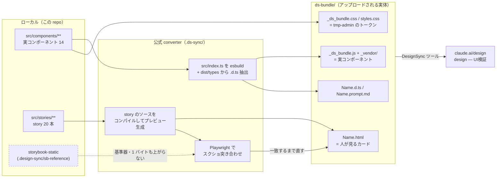
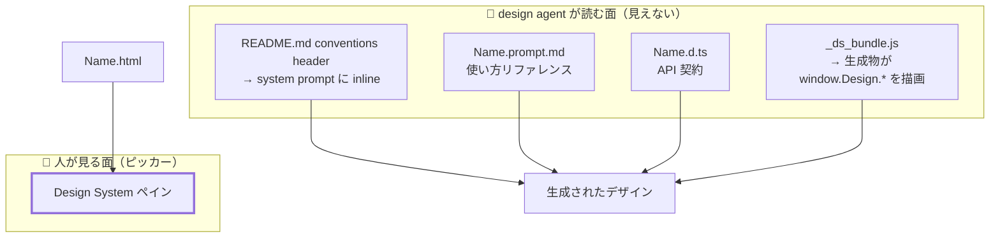

# OBS-0011: conventions header を英語で書いたのは決定ではなく既定値だった

> 凡例：🟦 確定／根拠あり ・ 🟨 暫定／裁量 ・ 🟥 未確認・要本人確認

## 0. 一行サマリ【起票時必須】

**`.design-sync/conventions.md`（＝ `ds-bundle/README.md` の conventions header）を英語で書いたことは、手6 §2 の判断 D1〜D8 のどこにも無い。**
このヘッダは **design agent の system prompt に inline される**ので、**手7 で「フラグ 5 種が効くか」を測るときの交絡変数になる。**

## 1. きっかけ（何を見て・何に引っかかったか）【起票時必須】

2026-08-01、ユーザーが Claude Design の `design — UI検証`（`3acbb737-85fe-4098-95f4-c99070168ba1`）を見て
**「あとなんで英語なんだ？」**と質問した。

実物を切り分けると、英語に見える面は 3 層あり、**選べたのは 1 つだけ**だった。

| 面 | 実例 | 英語の出どころ | 選べたか |
| --- | --- | --- | --- |
| 部品名・`group` 名 | `Button` / `Sidebar` / `action` / `datadisplay` / `layout` | `src/components/<英語フォルダ>` と `src/index.ts` の export 名。`@dsCard group="action"` に出る | ❌ コードが英語なので必然 |
| converter の生成文 | `Button.prompt.md` 1 行目 `Button from design. Use via \`window.Design.Button\`` / `Variants (see …)` | converter（`.ds-sync/lib/docs.mjs` 等）に埋め込まれたテンプレート | ❌ 選べない |
| **conventions header** | `ds-bundle/README.md` の `## Wrapping and setup` 以下すべて | 🟥 **前セッションの Claude が英語で書いた** | ⭕ **選べた** |

しかも**成果物は混在している**——`guidelinesGlob` で上げた 6 本（`共通コンポーネント思想.md` ほか）は日本語、
`Button.prompt.md` の Examples に写された story のコメントと `children: 'ボタン'` も日本語、プロジェクト名も `design — UI検証`。

## 2. 経緯と今の理解【起票時必須・「わからない」でもよい】

**問い:** conventions header の言語は、いつ・何を根拠に英語に決まったのか。

**実測（2026-08-01）:**

- 🟦 `docs/` 全体を `英語` / `English` で grep して**ヒット 0 件**。
- 🟦 [手6 手順書](../手順/手6_ClaudeDesignへの同期.md) §2 の判断 D1〜D8 に**言語の論点が無い**。
  D4（フラグ 5 種をどこに書くか）は「`.prompt.md` か conventions header か両方か」までしか割っていない。
- 🟦 H6-07（conventions header を書く工程）の記述も、載せる**中身**（役割 9 カテゴリ・フラグ 5 種・3 層）だけで、
  **書く言語には触れていない。**

**→ 現在地: 英語は判断ではなく既定値として滑り込んだ。**「決めた記録が無い」ことは確定していて、
「なぜそうなったか」は**書いた本人（前セッションの Claude）に確認できない**ので復元できない。

**🟨 後付けで立つ理由（当時そう考えた証拠は無い）:**
conventions header が名指しする語彙は `p-inset-md` / `gap-stack-sm` / `Stack` / `AppProviders` と**全部英語識別子**なので、
地の文も英語だと引用の境界が曖昧にならない。**これは推論であって根拠ではない。**

**何がわかれば解けそうか:**

1. 手7 で**フラグ 5 種が実際に効いたか**（未決 #10 の後半）。
   🟥 **効かなかった場合、原因候補が「書き方」と「言語」に割れて切り分けられない。**
   ヘッダが日本語の対照群を持っていないため。
2. 🟥 **design agent の応答言語**（生成されるデザインの中の文言が英語になるか日本語になるか）。
   手6 では観測していない。ユーザーがピッカーを見ただけの時点では未測定。

## 3. 知識の結びつき ★主目的【棚卸しで埋める。insight は起票時から】

- 既に持っていた知識・経験：🟥 要確認
- 今回新しく得た・繋がった知識：🟥 要確認
- 結びついて生まれた気づき：🟥 要確認

🟨 **Claude の仮説（本人未確認・確定として扱わない）:**
これは「[DR-0018](../DR/DR-0018-design-sync-takes-preview-html.md) → [DR-0057](../DR/DR-0057-design-sync-uploads-compiled-code-not-just-html.md) と同型の抜け方」かもしれない。
DR-0057 は「**ツールの仕様は読んだが、それを使う skill を読んでいなかった**」。
今回は「**何を書くかは §2 で割ったが、どう書くかは割らなかった**」。
どちらも**論点が立たなかったので判断が発生しなかった**型で、赤にも警告にもならない。

## 4. 結論と保留

- **今の結論**：🟨 **1 周目は英語のまま固定して手7 を回す。**いま日本語化すると、
  手6 で得た「14/14・全 20 story `match`」の状態を、**効き目を測る前に動かすことになる。**
- **保留・未確認**：🟥 **交絡が実際に問題になるかは手7 の結果次第。**
  フラグが全部効いたなら言語は論点にならず、この観点はそのまま `closed`。
- **この結論が変わる条件**：🟥 手7 で **design agent がフラグを使い分けなかった**とき。
  そのとき初めて「ヘッダを日本語にした 2 周目」が対照実験として意味を持つ。

## 5. 却下した代替案【任意】

| 案 | 内容 | 却下理由 |
|---|---|---|
| A | いま conventions header を日本語に書き直す | 🟥 **効き目を測る前に検体を動かすことになる。**手6 の完了状態（`match` 14/14）を根拠に手7 を回せなくなる |
| B | 英日併記にする | 🟨 system prompt に inline される文書量が倍になる。**交絡は減らず「量」という別の変数が増える** |
| C | 起票せず進む | 🟥 手7 で効かなかったときに**原因候補として思い出せない。**台帳に出すこと自体が目的 |

## 6. DR への導線【棚卸し時必須】

- **DR 化**：🟨 **判断保留。**手7 の結果が出るまで `decision` にも `finding` にもならない。
  効かなかった場合は「conventions header は言語を選ぶ」が `finding` になりうる。
- **関連する既存 DR**：[DR-0057](../DR/DR-0057-design-sync-uploads-compiled-code-not-just-html.md)（載せ場所が 2 つあると特定した発見）／
  [DR-0018](../DR/DR-0018-design-sync-takes-preview-html.md)（superseded）
- **PoC へ戻す候補か**：🟥 未確認。**日本語の repo から Claude Design へ渡す全案件に効く**ので、
  手7 の結果次第で `architecture.md` 側の材料になりうる。

## 7. 出典・関連ドキュメント

- 会話：2026-08-01（第 6 セッション）。ユーザーが Claude Design の同期結果を見て
  「そもそも design system とは何か／Claude Design はどう使うのか／**なぜ英語なのか**」の 3 問を出した回
- 関連ドキュメント：
  - [手6 手順書](../手順/手6_ClaudeDesignへの同期.md)（§2 D1〜D8・H6-07）
  - [.design-sync/NOTES.md](../../.design-sync/NOTES.md)
  - `.design-sync/config.json` の `readmeHeader` / `guidelinesGlob`
  - [handoff 未決 #10](../handoff.md)（書けるか＝手6／効くか＝手7）
- 外部出典：<https://claude.ai/design/p/3acbb737-85fe-4098-95f4-c99070168ba1>

## 8. 見直しログ【棚卸しのたび追記。過去の記述は書き換えない】

### 2026-08-01

起票。**ユーザーの「なんで英語なんだ？」への回答を切り分ける過程で、判断の記録が無いことが分かった。**
§3 は本人の確認が要るので 🟥 のまま。§0〜§2 と §4〜§7 は実測と会話から埋めた。

## 9. 図解アーカイブ【会話で図を作ったら転記。無ければ「なし」】

### 2026-08-01 Claude Design 同期の全体像（Q1 への回答）

キャプション: [DR-0057](../DR/DR-0057-design-sync-uploads-compiled-code-not-just-html.md) の対応表と、実物の `ds-bundle/` / `.design-sync/config.json` から起こした。
**Storybook は「入力形式」かつ「fidelity oracle」であって、向こうのランタイムではない。**

### 2026-08-01 読み手が 2 つに割れる（この観点の中心）

キャプション: **この観点が問題にしているのは左下の `CONV` 1 箇所。**
人が見た面（`PICK`）には conventions header は出ないので、**言語の選択は目視では気づけない。**
