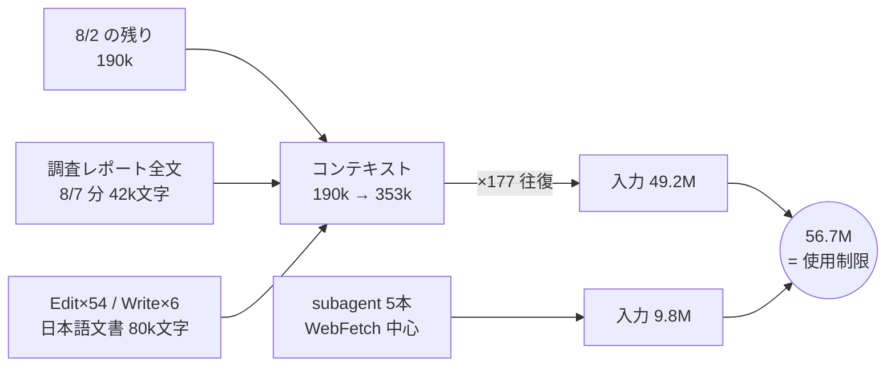

# OBS-0012: セッション再開と subagent 結果の取り込み方を仕組み化するか

> 凡例：🟦 確定／根拠あり ・ 🟨 暫定／裁量 ・ 🟥 未確認・要本人確認

## 0. 一行サマリ【起票時必須】

**使用制限に 2 回当たった**（2026-08-02・2026-08-07）。原因は [DR-0073](../DR/DR-0073-context-replay-not-payload-burned-the-limit.md) で確定したが、
**対処を「毎回気をつける」で済ませるか、仕組みにするか**が決まっていない。

## 1. きっかけ（何を見て・何に引っかかったか）【起票時必須】

2026-08-07 午前、手8c の設計作業中に使用制限へ到達。原因調査で
`~/.claude/projects/.../*.jsonl` を集計したところ、
**8/2 の subagent 2 本が `You've hit your session limit · resets 10:10pm (Asia/Tokyo)` で落ちていた**ことが分かった。
**同じ壁が 2 回目。**PARADIGM の 2 回ルール（同じ依頼・指摘が 2 回目だと気づいたら仕組み化候補として指摘する）に該当する。

## 2. 経緯と今の理解【起票時必須・「わからない」でもよい】

**問い** — 何を仕組みにすれば止まるのか。

**分かっていること（DR-0073）**

- 🟦 支配要因は `往復回数 × その時点の文脈量`。取得情報の量ではない（比で 4,700 倍の開き）
- 🟦 セッションを跨ぐ再開で初期コストが 28k → 190k（6.8 倍）
- 🟦 長コンテキストのモデルでは auto-compact が発火しない（353k まで伸びた）
- 🟦 subagent の結果は通知に**全文**が乗り、本体の文脈に永久に残る（10 件で 82,344 文字）
- 🟦 投げた subagent が届くとは限らない。不着でも消費は発生する（8/7 だけで 5.1M）

**候補として出た対処（効果の大きい順・🟨 まだ選んでいない）**

| # | 対処 | 効きどころ | 性質 |
| --- | --- | --- | --- |
| 1 | 手を跨いだら新セッション。再開は `docs/handoff.md` から | 初期 190k → 28k | **作法**（人の運用） |
| 2 | 長コンテキスト前提で、区切りごとに `/clear` | 353k まで伸びるのを止める | **作法** |
| 3 | 調査 subagent にはレポートを**ファイルへ書かせ**、本体は要約だけ受ける | 通知 82k 文字を本体に入れない | **プロンプトの型**（skill 化しうる） |
| 4 | 調査 subagent を 5 本並列で張らない | 1 本 1〜4M | **作法** |
| 5 | 長文書の編集フェーズを別セッションに切る | 往復 97 回のうち Edit 54 回 | **作法** |

**何がわかれば解けそうか**

- 🟥 **1〜5 のうち、どれが「作法」で止まり、どれが「仕組み」を要るか。**
  この repo の規律は CLAUDE.md（読ませる）と hook（止める）の 2 段しかない。
  作法は CLAUDE.md に 1 行足せば済むが、**足す＝毎回コンテキストを食う**ので 2 回ルールが逆向きに効く。
- 🟥 **そもそもこれは design repo の持ち物か、AISY（PARADIGM / skill）の持ち物か。**
  UI 検証の知見ではなく、**セッション運用の知見**なので、器の所属が決まっていない。

## 3. 知識の結びつき ★主目的【棚卸しで埋める。insight は起票時から】

- 既に持っていた知識・経験：🟥 要確認
- 今回新しく得た・繋がった知識：🟥 要確認
- 結びついて生まれた気づき（できれば 1 行の一般則まで）：🟥 要確認

🟨 **Claude 側の仮説（本人未確認）**：
「**コンテキスト長は余裕ではなく請求書**」——長いモデルほど何も起きないまま伸び、
救済（auto-compact）が効かない分だけ高くつく。これは
[OBS-0003](OBS-0003_対象0件で緑が5回出た.md)（「対象 0 件で緑」＝機械ゲートは射程を語らない）と同型で、
**「何も起きていないこと」が安全のサインに見えてしまう**構図。

## 4. 結論と保留

- **今の結論**：🟥 未決。原因（DR-0073）は確定したが、対処は 1 つも選んでいない
- **保留・未確認**：上表 1〜5 の採否／器の所属（design repo か AISY か）
- **この結論が変わる条件**：3 回目に当たったら、選ぶ前に止まっている理由そのものが答えになる

## 5. 却下した代替案【任意】

| 案 | 内容 | 却下理由 |
|---|---|---|

🟥 まだ検討していない（起票時点で代替案の比較をしていない）。

## 6. DR への導線【棚卸し時必須】

- **DR 化**：🟥 判断保留。**原因側は [DR-0073](../DR/DR-0073-context-replay-not-payload-burned-the-limit.md) で `finding` として済んでいる。**
  ここに残っているのは「どう対処すると決めるか」＝ `decision` 側。決めたら昇格する
- **関連する既存 DR**：DR-0073
- **PoC へ戻す候補か**：🟨 戻す候補。PoC も subagent と長寿命セッションを使う（DR-0073 の `poc_feedback` に記載）

## 7. 出典・関連ドキュメント

- 会話：2026-08-07（手8c の作業中に使用制限へ到達 → 原因調査）
- 関連ドキュメント：[DR-0073](../DR/DR-0073-context-replay-not-payload-burned-the-limit.md)
- 実測元：`~/.claude/projects/-Users-takumi-conductor-workspaces-design-amman/*.jsonl`

## 8. 見直しログ【棚卸しのたび追記。過去の記述は書き換えない】

### 2026-08-07

起票。原因調査の結果を DR-0073 に切り出し、**未決の「対処を選ぶ」部分だけをここに残した。**

### 2026-08-07（同日・[DR-0077](../DR/DR-0077-abolish-the-two-occurrence-rule.md) を受けて）

🆕 **2 回ルールが廃止された**（ユーザー判断）。本件の §1「同じ壁が 2 回目だから該当する」も
§4 の「**足す＝毎回コンテキストを食うので 2 回ルールが逆向きに効く**」も、**もう規律を根拠にできない。**
🟦 **結論は変わらない**——**足すかどうかは「毎回コンテキストを食う代償に見合うか」という中身の比較**で決める。
（タイトルの「2 回ルール成立」も**由来の記録**として残す。本文は書き換えない規律。）

## 9. 図解アーカイブ【会話で図を作ったら転記。無ければ「なし」】

### 2026-08-07 使用制限に到達したトークンの流れ

キャプション：数値は `~/.claude/projects/.../ *.jsonl` の `.message.usage` を
UTC 2026-08-06T23:00 以降で集計したもの（DR-0073 §根拠）。
`G` は cache_read の合計であって課金重みではない——**cache_read は割引されるが、割引後でも支配的**。
