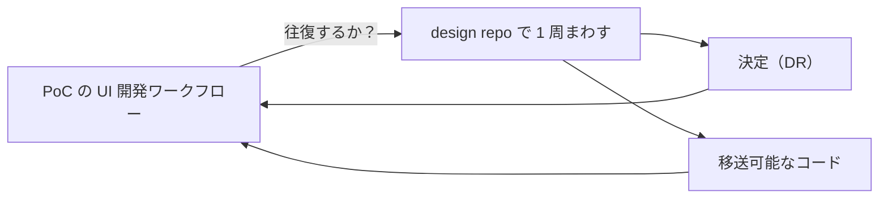
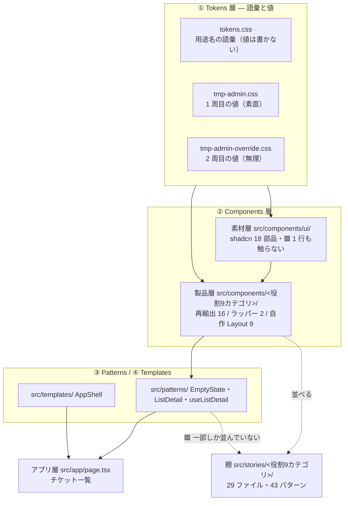
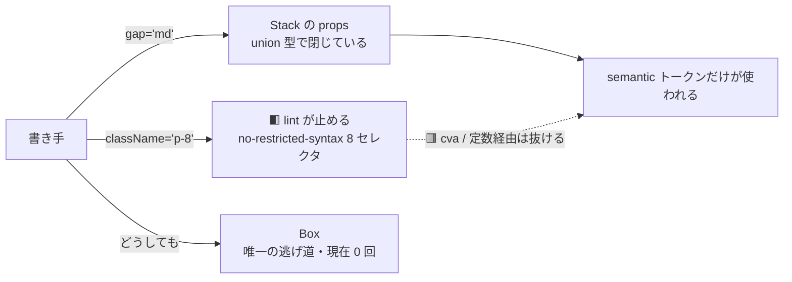
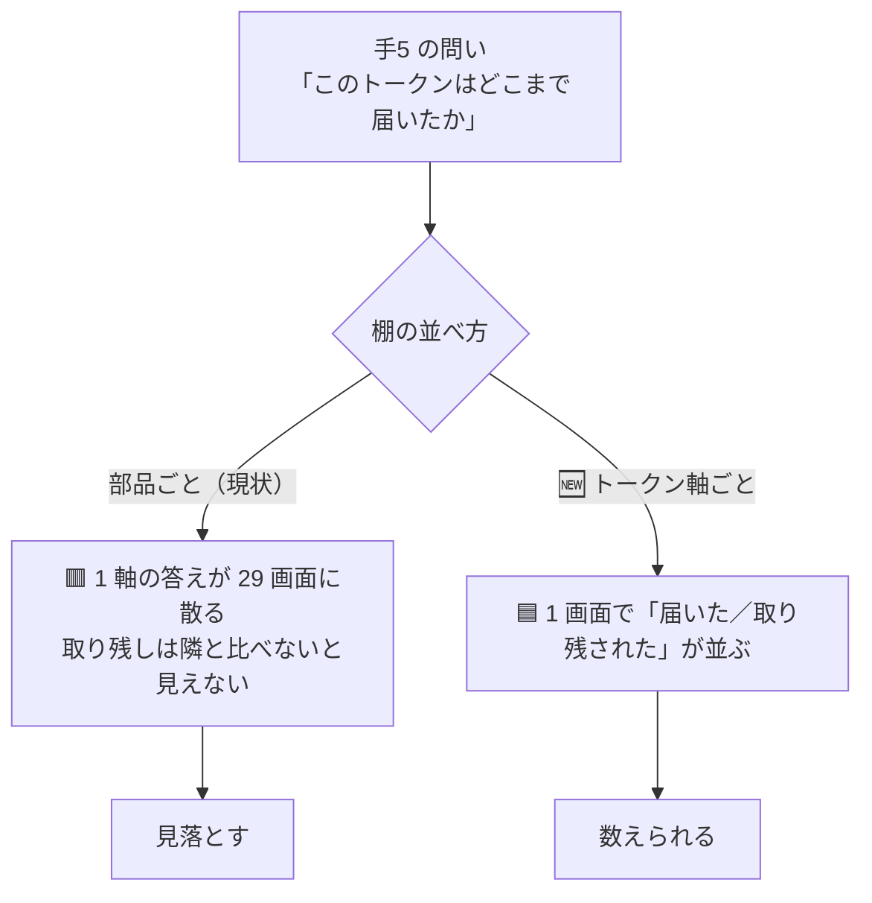
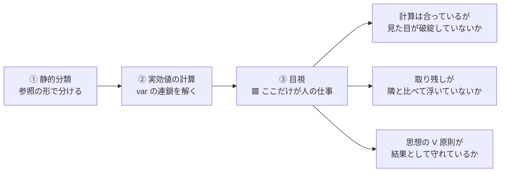

# Storybook の設計と、手5 で目視レビューすべき観点

> 目的は 2 つ。**① 今どういう思想で何を作っているかを 1 枚で掴めるようにする ② 目視レビューの観点を確定させる。**
> レビュー用の一覧（触って進めるチェックリスト）は HTML アーティファクト側にある（§7 にリンク）。

---

## 1. そもそも何を検証しているのか（ゴール）

**この repo の成果物は部品ではない。「通った／通らなかった」の観測。**（[DR-0001](DR/DR-0001-repo-role-and-deliverable.md)）

検証対象は**画面ではなく 3 層**（[DR-0002](DR/DR-0002-verify-three-layers-not-screens.md)）。
チケット一覧 1 画面は「**部品を洗い出させるための口実**」であって、画面の完成度は成果ではない。

### 手5 だけのゴール

> **トークンを差し替えたとき、部品を 1 行も触らずに見た目が変わるか。**

🟥 **「変わったら成功」ではない。**変わらなかった箇所を**全件列挙する**のが成果
（[DR-0010](DR/DR-0010-shadcn-invents-values.md)。判定は二値にできない）。

---

## 2. どういう思想で部品を作っているか

### 2.1 三層 + 棚

### 2.2 境界の引き方（手3 D1 = (c)）

| 層 | 何を置くか | 触ってよいか |
| --- | --- | --- |
| **素材層** `src/components/ui/` | shadcn が生成した 18 部品 | 🟥 **1 行も触らない**（手5 の前提そのもの） |
| **製品層** `src/components/<役割>/` | ① 素材の**再輸出** 16 ② **既定値ラッパー** 2 ③ shadcn に**無いものの自作** 9 | 🟦 自由 |
| **③ Patterns** `src/patterns/` | 「状態を持つ」か「複数の役割カテゴリをまたぐ」もの（[DR-0039](DR/DR-0039-pattern-layer-is-not-uniform.md)） | 🟦 自由 |

**画面は製品層しか見ない**（D3=B）。手4 で実証済み——素材層への直 import **0 件**。

### 2.3 枠の閉じ方（[DR-0032](DR/DR-0032-layout-primitives-take-props-not-classname.md)）

**主は props、lint は補助。**Layout プリミティブは `className` を受け取らない。

### 2.4 層タグ（手5 のための仕掛け）

story に `tags` を打ってある。**目視で「どちらの由来か」を切り分けるため。**

| タグ | 数 | 意味 | 手5 での期待 |
| --- | --- | --- | --- |
| `vendor` | 16 | 素材そのまま（窓口を 1 本にするためだけに通している） | 🟨 追従は shadcn の書き方次第 |
| `wrapped` | 2 | 既定値だけ上書きしたラッパー（Button・Sidebar） | 🟦 追従するはず |
| `own` | 10 | 自作（Layout 9 + StatusPill ほか） | 🟦 **必ず追従するはず**（semantic 語彙しか使っていない） |

---

## 3. Storybook をどう設計しているか（現状）

| 設計 | 中身 | 根拠 |
| --- | --- | --- |
| 位置づけ | **手5 の判定装置**。カタログであると同時に「変わったか」を見る計測器 | [DR-0017](DR/DR-0017-storybook-as-catalog.md) |
| 範囲 | **描画のみ**（+ `addon-a11y`）。テストランナーは入れない | [DR-0024](DR/DR-0024-storybook-render-only-and-gate.md) |
| 階層 | `title` は **役割 9 カテゴリ**（Atomic Design は採らない） | [DR-0002](DR/DR-0002-verify-three-layers-not-screens.md) |
| 置き場 | `src/stories/` （`src/components/ui/` に置くと `.prettierignore` で整形ゲートの外に出る） | 手2b D5 |
| ゲート | `pnpm build-storybook` を機械ゲートに追加（6 本目） | [DR-0024](DR/DR-0024-storybook-render-only-and-gate.md) |
| 判定の固定 | **Storybook 側で判定する**（本体は hex+lab、Storybook は oklch で出力形式が違う） | [DR-0026](DR/DR-0026-two-css-pipelines-differ.md) |

### 棚の穴（2026-07-27 に 2 件を塞いだ）

| # | 穴 | 状態 |
| --- | --- | --- |
| 1 | ③ 層の `ListDetail` に story が無い | ✅ **塞いだ**（`Patterns/ListDetail` — Default / Empty） |
| 2 | ④ テンプレの `AppShell` に story が無い | ✅ **塞いだ**（`Templates/AppShell` — `layout: 'fullscreen'`） |
| 3 | パターン数が薄い（1 ファイル平均 1.5） | 🟨 **判定軸カタログ 6 本で代替した**（下記 §4） |

→ **story は 29 → 37 ファイル。**`AppShell` が棚に乗ったので、
**サイドバー込みの全体像も Storybook だけで見られる**（本体アプリを開く必要は無くなった）。

### 🆕 lint の枠は story を見ていない

`no-restricted-syntax`（数値の段・パレット色の禁止）の `files` は
`src/components/**` `src/app/**` `src/patterns/**` `src/templates/**` の 4 つで、
**`src/stories/**` は入っていない。**

🟨 **判定用の目盛りには生値が要る**（「狙いの 8px」と「実効 7.2px」を並べる等）ので、
本 repo では**そこだけ inline `style` で書き、コメントで「トークンではなく物差し」と明記した**。
🟥 ただし**規約として決めた覚えは無く、単に射程外だっただけ**。
[DR-0040](DR/DR-0040-frame-leaks-when-a-layer-is-added.md)「枠は層を足すたびに漏れる」の 3 例目にあたる。

---

## 4. 🆕 カタログの設計をどうするか（SPA でやっていた形との接続）

### 4.1 これまでの経験（SPA）と、この repo の違い

> 「Default で export して Storybook 用のカタログを作り、それでパターンを目視確認していた」

これは **部品ごとに全 variant を 1 画面に並べる**やり方（本書では **AllVariants 型**と呼ぶ）。
実は本 repo にも既に入っている——`Button.stories.tsx` の `Variants` / `Sizes` がそれ。

🟥 **ただし手5 の問いには、この形だけでは足りない。**

| | AllVariants 型（部品ごと） | 🆕 判定軸型（トークンごと） |
| --- | --- | --- |
| 並べる軸 | **1 部品の全 variant** | **1 トークン軸を使う全部品** |
| 答える問い | 「この部品は正しく作れているか」 | 「**このトークンは全部に届いたか**」 |
| SPA での用途 | ✅ 部品開発・デグレ確認 | — |
| **手5 での用途** | 🟨 補助 | ✅ **本命** |

**手5 の問い（Q1〜Q3）は全部「トークン軸」で立っている。**
「角丸は 27 箇所届いて 7 箇所取り残された」を確かめたいのに、
部品ごとに 29 画面を回ると**取り残しの 7 箇所が別々の画面に散る**ので、比較にならない。

### 4.2 設計案（3 つ・順位つき）

| # | 案 | 追加する story | 効く先 | 判定 |
| --- | --- | --- | --- | --- |
| **1** | 🟦 **穴を塞ぐ**——`ListDetail`（③）と `AppShell`（④）の story を足す | **2 本** | 目視の射程が ③④ 層に届く。**手6 以降もずっと効く** | ✅ **実施した**（2026-07-27） |
| **2** | 🟦 **判定軸カタログ `Review/*` を足す** | **6 本** | 手5 の目視が 1 画面 1 軸で終わる | ✅ **実施した**（2026-07-27） |
| 3 | 🟨 **部品ごとに `AllVariants` を足す**（SPA でやっていた形） | **最大 27 本** | 部品開発・デグレ確認 | 🟥 **保留。**🆕 **理由は回数ではない**（[DR-0077](DR/DR-0077-abolish-the-two-occurrence-rule.md)）——**案 2 の `Review/*` が内容をほぼ含んでおり、27 本を足しても見えるものが増えない**（§4.3） |

### 🆕 実際に足したもの（2026-07-27）

| story | 観点 | 中身 |
| --- | --- | --- |
| `Review/A 状態面` | **A** ★ | 不透明度修飾 17 種 60 箇所を実物で。**tmp-admin の狙い（自作 StatusPill）を先頭に置いて濃さを見比べる**形にした |
| `Review/B 角丸` | **B** ★ | ① 狙いの物差し（8/12/18/28px の実寸） ② 届いた段 6 ③ 取り残し 4 ④ 動かない生値 2 を**縦に並べて上下で比較**できる |
| `Review/C 影` | **C** | 潰した 3 段 → 2 段の比較と、実際に使う 7 箇所。**DropdownMenu だけが 2 段階を使い分けている**ので、そこを明示した |
| `Review/D タイポ` | **D** | 500（inline style で固定した参照）と 600 を隣に置いた。用途名タイポ 5 段と等幅の桁揃えも |
| `Review/E·F オーバーレイ` | **E・F** | 背後にテキストを敷いた状態で Dialog / Sheet を開く。**blur とスクリムはトレードオフなのでセットで見る** |
| `Review/I 層の比較` | **I** ★ | `vendor` / `wrapped` / `own` を**同じ画面に 3 段**で。**wrapped がどちら寄りかを見る**のが眼目 |

**共通部品は `src/stories/Review/_spec.tsx`。**`_` 始まりなので
`**/*.stories.@(ts|tsx)` の glob に拾われず、story として並ばない。

### 4.3 なぜ案 3 を今やらないか

> 🆕 **2026-08-07 に理由を差し替えた**（[DR-0077](DR/DR-0077-abolish-the-two-occurrence-rule.md) で 2 回ルールを廃止）。
> ~~必要性が 2 回証明されるまで足さない~~ → **下の「案 2 と内容が重なる」1 本が理由。**

手3 で「story の雛形はスクリプト生成できた」と分かっているので**作れることは分かっている**。
🟨 **足さないのは、案 2 の `Review/*` が実質的に同じものを見せているから**（下記）。
**「variant の一覧が無いと選べない」が実際に起きたら足す**——そのときは**回数ではなく、`Review/*` で足りなかったという中身が理由**になる。

🟨 **ただし案 3 は案 2 と排他ではない。**案 2 の `Review/*` は
「トークン軸 × 全部品」なので、**結果的に AllVariants の内容をほぼ含む。**
先に案 2 をやると、案 3 の必要性がそもそも消えるかもしれない。

---

## 5. 目視で見るべき観点（手5）

### 5.1 観点は「部品」ではなく「トークン軸 × tmp-admin の V 原則」で並べる

静的分類と実効値計算（判定の 1・2 段目）は**済んでいる**。
目視（3 段目）で見るのは **「計算では出ない食い違い」**だけ。

### 5.2 観点表（★ = 特に見てほしい）

| # | 軸 | 何が起きているはず | 🟥 目で確かめたいこと | 対応 Q |
| --- | --- | --- | --- | --- |
| **A** ★ | **状態面の色**（不透明度修飾 **60 箇所**） | 色は tmp-admin を追ったが**不透明度は shadcn のまま固定** | **「色は合っているのに濃さが違う」が見えるか。**tmp-admin は専用 tint 色（`--fill-danger` 等）で作る設計なので、**機構ごと食い違っている**（[DR-0045](DR/DR-0045-opacity-modifiers-were-invisible-to-lint.md)） | Q3 |
| **B** ★ | **角丸** | 素の 27 箇所は apple の非線形 5 段に一致。**variant 付き 7 箇所は取り残し**（うち 2 がずれ） | **kbd の角丸 7.2px**（狙い 8px）と **sidebar inset の 16.8px**（狙い 18px）が、隣と比べて浮くか | Q2 |
| **C** | **影** | apple の 2 段（`--shadow-1/2`）に置き換わった。shadcn は 3 段なので**多:1 で潰した** | **段の区別が失われて平坦に見えないか**（dropdown と popover が同じ影になっている） | Q1 |
| **D** | **weight** | `font-medium` **15 箇所**が 500 → **600** | **V3「強調は 600 ⇔ 400 のコントラスト」**が出ているか。太くなりすぎて**うるさくないか** | Q1 |
| **E** | **blur** | Dialog / Sheet の overlay から blur が消えた（`--blur-xs: 0`） | **V1「blur を使わない。奥行きは 3 層の面で作る」**が成立しているか。**のっぺりして階層が読めなくなっていないか** | Q1 |
| **F** | **スクリム** | `bg-black/10`(10%) → `--color-scrim`(**40%**) | **暗くなりすぎていないか。**blur を消した（E）ぶん、スクリムだけで階層を作ることになる | Q2 |
| **G** ★ | **塗り CTA の形**（V2） | 色は守れている（`--primary` は黒のまま・ブランド青は `--ring` に隔離） | 🟥 **「塗り CTA という形」は残っている**（表3 #1）。**V2「ブランドは濃紺の面で出す」に照らして、これは許容できるか** | Q8 |
| **H** | **サイドバー**（V5） | on-dark が `--sidebar-*` に隔離され、紺 `#003a63` + 空色 `#009fe8` に | **V5「on-dark は名前空間に隔離」**が成立しているか。**本文側に濃紺が漏れていないか** | Q1 |
| **I** ★ | **層タグの差** | `own` 10 は semantic 語彙しか使っていない | **`vendor` と `own` で追従の質に差が出るか。**出なければ「製品層を作った意味」の再検討材料 | Q6 |
| **J** | **当たり判定 44px** | 見た目 32px / 当たり判定 44px（`pointer: coarse` 限定） | 🟥 **DevTools の device emulation を有効にして**`Button` の `::after` を実測（**しないと 32px のまま見える**） | Q7 |

### 5.3 🟥 見るときの注意（罠）

| 罠 | 中身 |
| --- | --- |
| **緑を信用しない** | ゲート 6 本は**全部緑**。しかし手5 の中で「書いたのに効いていない」が **3 回**起きている（[DR-0046](DR/DR-0046-theme-swap-loses-to-source-order.md)）。**緑は何も保証していない** |
| **本体アプリと Storybook は色の出力形式が違う** | 本体は hex+lab、Storybook は oklch。**値は等価**だが、並べて比べない（[DR-0026](DR/DR-0026-two-css-pipelines-differ.md)） |
| **`a11y` パネルの緑を 44px の根拠にしない** | axe-core の `target-size` は **24px（AA）**しか見ない。44px は測らない（[DR-0034](DR/DR-0034-touch-target-visual-32-hit-44.md)） |
| **before/after は切り替えて見る** | `globals.css` の `@import './tmp-admin.css'` / `'./tmp-admin-override.css'` の **2 行をコメントアウト**すれば素の shadcn に戻る |

---

## 6. 今どこにいるか

| 手 | 状態 |
| --- | --- |
| 手0〜手4 | ✅ 完了（`main` にマージ済み） |
| **手5** | 🟨 **進行中。**Q1〜Q5 は回答済み・**棚の準備は完了**。**残りは Q6・Q7・Q8 と目視** |
| 手6〜手9 | ⬜ 未着手 |

**目視の入口**: `pnpm storybook` → サイドバーの **`Review`** グループ。A→B→C→D→E·F→I の順に見れば、
[レビュー用チェックリスト](https://claude.ai/code/artifact/6e100f82-a3fc-42e1-b050-28f2920ece3c)の観点と 1:1 で対応する。
**J（44px）だけは DevTools が要る**ので `Action/Button — Sizes` で行う。

### 手5 でここまでに分かったこと（目視の前提）

| | |
| --- | --- |
| 「本当に変わらない」箇所 | 🟦 **1 件**だけ（`--sidebar-width` のモバイル）。当初 15 件と見積もっていた（[DR-0043](DR/DR-0043-recount-of-fifteen-unchanged-spots.md)） |
| 1 周目「素直」で動いた | 実効変数 **58 件** |
| 2 周目「無理」の増分 | **+29 箇所**（角丸 27・スクリム 2） |
| 🟥 その代償 | 取り残し **7** / 語彙 **+6** / shadcn 内部への依存 **+9**（[DR-0047](DR/DR-0047-cost-of-forcing-the-swap-through.md)） |
| 素材層の diff | 🟦 **0 行**（5 回連続） |

---

## 7. 関連

- **レビュー用チェックリスト（HTML アーティファクト）**: §5.2 の観点を Storybook を見ながら 1 件ずつ潰す形にしたもの → [手5 目視レビュー](https://claude.ai/code/artifact/6e100f82-a3fc-42e1-b050-28f2920ece3c)
- 手順書: [手5](手順/手5_トークン差し替え実験.md) §5 H5-07
- [実行記録.md](実行記録.md) §手5
- [部品カタログ.md](部品カタログ.md) — 素材 18 部品の役割分類
- [共通コンポーネント思想.md](共通コンポーネント思想.md) — 分類の正本（⚠ ユーザーの持ち物）
