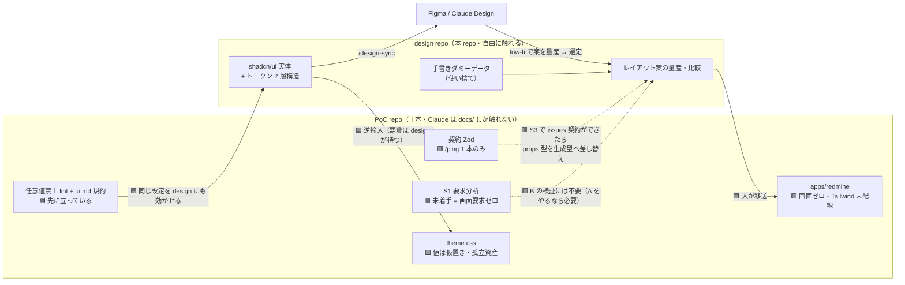
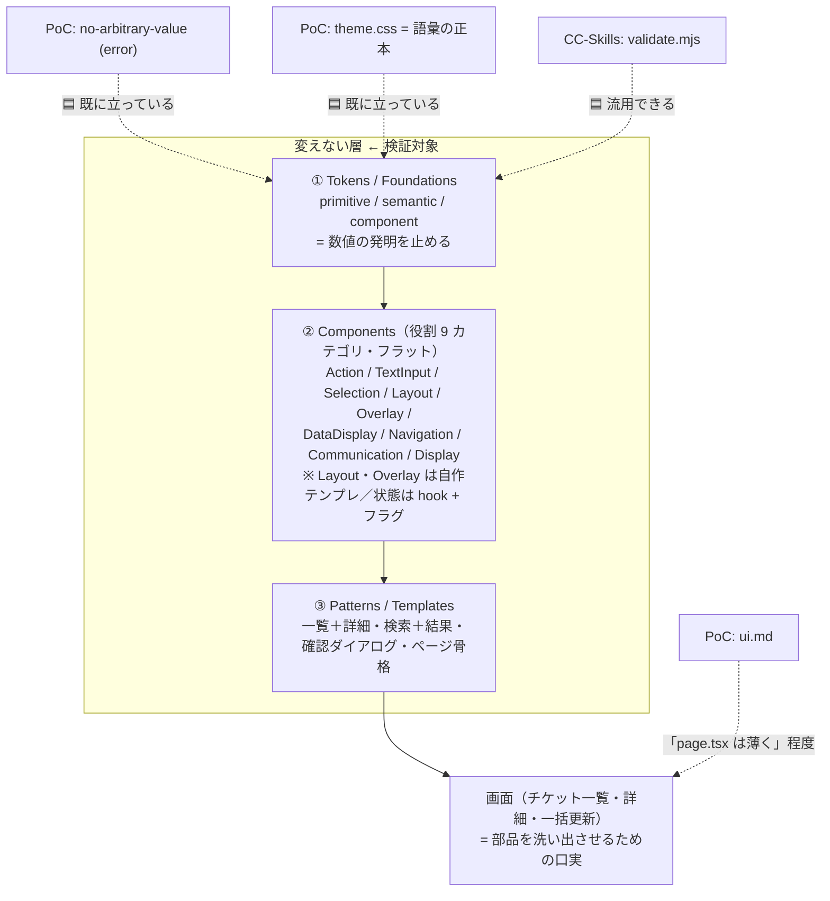
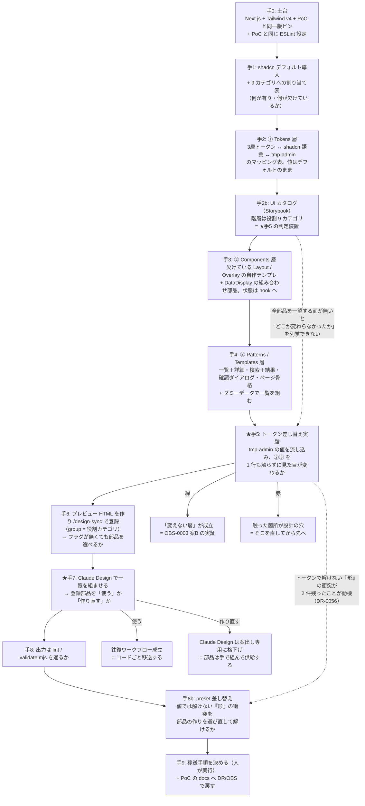

# UI 検証の位置づけと段取り

> 作成日: 2026-07-26 ／ 最終更新: 2026-07-26 ／ 本 repo（`~/git/design`）が何をする場所かの正本。
> 関連: [共通コンポーネント思想](共通コンポーネント思想.md)（**部品分類の正本**）／ [shadcn/ui × Claude Design 連携 調査まとめ](../ClaudeDesignShadcnIntegration.md)（先行調査）／ 前回の検証 `~/git/CC-Skills` ／ PoC 本体 `~/git/PoC`

## 0. 結論（4 行）

- 本 repo は **「UI 開発ワークフローが往復するか」を実測する場**であり、成果物は**決定 + PoC へ移送可能なコード**。
- 検証対象は**画面ではなく、その下の 3 層**（Tokens / Components / Patterns・Templates）。画面は部品を洗い出させるための口実。
- 検証の核心は 2 点：①**トークンを差し替えたとき、部品を 1 行も触らずに見た目が変わるか** ②**Claude Design は登録した共通部品を「使う」のか「作り直す」のか**。
- PoC 側で未着手の Tailwind 配線・shadcn 導入・トークン 2 層化を、hook に縛られない本 repo で**先に踏む**。ここは Claude Design の成否と無関係に価値が残る。

---

## 1. なぜ別 repo なのか

PoC（`~/git/PoC`）では **Claude が `apps/` `packages/` を編集できない**（hook でブロック。`CLAUDE.md`「Claude は差分を提案し、人が適用する」）。
`shadcn add` は「コンポーネントのコードを自分の repo に実体として置く」行為なので、PoC 内では全工程が人の手作業になる。

→ **Claude と一緒に UI を高速で試行できる場所は、構造上ここしかない。**これが本 repo の存在理由。

### ⚠ 自覚しておくこと：規約の抜け道になり得る

本 repo で Claude が書いたコードを丸ごと PoC へ移送すると、PoC の「成果物は人が作る」規約は事実上素通りされる。
**線の引き場所：repo 内では自由、境界を越える移送の瞬間だけ人が実行する。**（手8 で明文化する）

---

## 2. 調査でわかった PoC 側の現状（2026-07-26 実測）

| # | 事実 | 根拠 |
|---|---|---|
| 1 | UI は実質ゼロ。`page.tsx` は `<main>redmine UI（S0）</main>` の 1 行 | `apps/redmine/src/app/page.tsx` |
| 2 | 🟥 **Tailwind がアプリに配線されていない**。`apps/` に CSS ファイル 0 件・tailwind 依存なし・CSS import なし | find / grep 実測 |
| 3 | `theme.css`（トークン語彙の正本）は存在するが**誰も import していない孤立資産**。値も「S0-12 で確定」の仮置きのまま | `packages/tailwind-config/theme.css` |
| 4 | 🟦 一方で **`tailwindcss/no-arbitrary-value: error` は先に立っている**。`bg-[#xxx]` は書いた瞬間 lint が落ちる | `packages/eslint-config/next.js` L84 |
| 5 | **shadcn/ui は技術スタック表に名前があるだけ**。`components.json` も `packages/ui` も無い | `docs/inputs/技術スタック.md` |
| 6 | テーマ 2 層構造（案A: `@theme` 直値 / 案B: `@theme inline` + `data-theme`）の判断が **open のまま**。shadcn は案B が前提 | `docs/OBS/OBS-0003` |
| 7 | 🟥 **契約は `/ping` 1 本だけ**。orval 生成の MSW handlers / faker も `/ping` のみ＝**使えるダミーデータがゼロ** | `apps/redmine-api/src/contract/paths/redmine.ts` |
| 8 | PoC は **S0（基盤構築）の途中**で S1（要求分析）未着手＝**画面の要求が 1 本も無い** | `docs/handoff.md` |
| 9 | UI 規約は既にある：`page.tsx` は薄く / Server Actions 禁止 / 任意値禁止 / 文言ハードコード禁止 / フォーム検証は生成 Zod | `docs/framework/templates/00_agent_config/rules/ui.md` |
| 10 | ビジュアル回帰（ADR-0009）は `proposed`、判断条件が**「UI が固まってから」** | `docs/adr/0009-visual-regression-adoption.md` |

**読み取れる地形：PoC 側は「守るための構造」だけが先に立っていて、中身が空。**

---

## 3. 地形図

---

## 3.5 検証する層（[共通コンポーネント思想](共通コンポーネント思想.md)の 3 層）

**守る機構が下の層に集中している＝そこが検証すべき層**、という形で思想と PoC の構造が一致している。
思想の「数値直書きの禁止は lint で検知できるはず」は、PoC 側で**既に実装済み**（`packages/eslint-config/next.js` L84）。
思想の「semantic token だけを UI が使う」は、PoC 側 OBS-0003 の「意味トークン運用」と**独立に同じ結論**に着いている。

### shadcn とぶつかる点（＝作業の実体）

| # | 摩擦 | 意味 |
|---|---|---|
| 1 | shadcn は役割で並んでいない（アルファベット順のフラット一覧） | 9 カテゴリへの割り当て表を自分で作る。整備の最初の実務 |
| 2 | Layout カテゴリが shadcn にほぼ無い（Card はあるが Box/Stack/Grid/Container/Spacer/Section が無い） | 🟦 思想の「Layout/Overlay は自作テンプレ」と shadcn の欠落が**同じ場所を指す**。理由は違うが作る場所は一致 |
| 3 | 🟥 **状態の置き場が食い違う** | shadcn の Overlay 部品は Radix 由来で `open`/`onOpenChange` を自分で持つ。思想は「開閉は `useXxxModal()` へ」。思想を通すなら**ラッパー層が要り、shadcn の素の使い方から一段ずれる**＝判断が要る |
| 4 | ~~トークンの層数が違う~~ → **層は揃っていた**（手2 で訂正） | ~~思想＝3 層、shadcn＝実質 semantic 1 層（component token 無し）~~ → 🟦 **実測では 3 層とも実在する**（primitive 419 = Tailwind ／ semantic 色 18 ／ component 11 = `--sidebar-*`・`--card-spacing`）。**欠けているのは層ではなく semantic 層のうち spacing / typography だけ**（[DR-0022](DR/DR-0022-shadcn-has-component-tokens.md)）。マッピング表は [トークンマッピング.md](トークンマッピング.md) に完成 |
| 5 | DataDisplay の Table | shadcn の Table は素のマークアップのみ。DataGrid 相当は TanStack Table との組み合わせ＝自前の組み合わせ部品 |

---

## 4. 確定事項

| 論点 | 決定 | 根拠 |
|---|---|---|
| 本 repo の成果物 | **決定 + PoC へ移送可能なコード** | ユーザー判断 2026-07-26 |
| 検証の主語 | **B：UI 開発ワークフローの検証**（A：画面設計そのものは後） | PoC 全体の目的が「方式が通るか」であり型が揃う。A は S1 未着手で入力が無い |
| 土台 | **PoC と同じ Next.js App Router + 同一バージョン（catalog ピン準拠）** | 環境が違うと「移送できたか」の判定が信用できない。Vite の軽さより移送可能性を取る |
| 任意値禁止 lint | **design 側にも効かせる** | これが B の検証そのもの。効かない環境で作ったコードは実測にならない |
| トークン語彙の正本 | **design 側が持ち、PoC へ逆輸入する** | shadcn 標準語彙を土台に PoC の意味色（danger/warning/success）を接続。`theme.css` は現状孤立資産で値も仮置き＝壊すコストが低い |
| 検証スコープ | **チケット一覧 1 画面のみ**。ただし**画面は成果物ではなく、部品を洗い出させるための口実** | 部品の密度が十分で、赤なら早く割れる |
| 部品分類 | **[共通コンポーネント思想](共通コンポーネント思想.md)の 3 層 + 役割 9 カテゴリに従う**（Atomic Design は採らない） | 既に固まった思想で、今回変わっていない（ユーザー確認 2026-07-26） |
| 部品の粒度 | **① Tokens 全部 + ② Components 9 カテゴリ（Layout/Overlay は自作テンプレ）+ ③ Patterns/Templates の骨格まで** | Claude Design が「使うか作り直すか」は、この粒度の部品が無いと判定できない |
| トークンの値 | **CC-Skills の `tmp-admin` 哲学を引き継ぐ**（`~/git/CC-Skills/web-design-mock/_philosophies/aux-admin/aux-admin.md`） | `status: approved`・D4 汎化検証済みで `validated_screens` に「管理画面一覧／データテーブル」があり射程が一致。ゼロから決め直す理由がない |
| トークン投入の順序 | **shadcn デフォルトのまま組み切ってから、後で流し込む**（2 段階） | 差し替え自体を検証行為にするため。最初から自分の値で組むと「部品を触らずに変えられたか」が判定できなくなる |
| 検証の出口 | PoC の `docs/` へ DR / OBS として戻す | 副産物として **OBS-0003（案A/案B）** と **ADR-0009（ビジュアル回帰）** の判断材料が埋まる |

### 仮置き（覆せる）

- **ダミーデータは使い捨ての手書き**とする。PoC の S3 を先取りして issues の Zod 契約を design 側で書くと**契約の正本が 2 箇所に割れ**、PoC の「正本 1 つ・残りは導出」原則に反するため。
  ただし**コンポーネントの props 型は、後で生成型に差し替わる前提**で組む。手3 の時点で覆せる。

---

## 5. 段取り

🟨 **手8b は「やらない」を選べる手**（[DR-0056](DR/DR-0056-preset-swap-is-its-own-step.md)）。
対象は**形の衝突 2 件だけ**（塗り CTA・`h-8`）なので、手7・手8 の結果次第では
**「動機が薄いので実施しない」も結論になる**——それも記録すれば成果になる。

### 各手の詳細な実行計画は `docs/手順/` に置く

段取り（本ファイル）は「何を・なぜ・どの順で」までを持ち、**その手で答えを出す問い・判断ポイント・作業手順は手順書側**に持つ。
形式の正本は [docs/手順/_template.md](手順/_template.md)。実測結果は書かず、[実行記録.md](実行記録.md) に分ける。

| 手 | 手順書 | 状態 |
|---|---|---|
| 手0 | （無し。フォーマット確定前に実行した） | ✅ done |
| 手1 | [手1_shadcn導入と役割分類.md](手順/手1_shadcn導入と役割分類.md) | ✅ done |
| 手2 | [手2_トークン層マッピング.md](手順/手2_トークン層マッピング.md) | ✅ done |
| 手2b | [手2b_UIカタログStorybook.md](手順/手2b_UIカタログStorybook.md) | ✅ done |
| 手3 | [手3_Components層と製品層の分離.md](手順/手3_Components層と製品層の分離.md) | ✅ done |
| 手4 | [手4_PatternsTemplates層と一覧.md](手順/手4_PatternsTemplates層と一覧.md) | ✅ done |
| 手5 | [手5_トークン差し替え実験.md](手順/手5_トークン差し替え実験.md) | ✅ done |
| 手6 | [手6_プレビューHTMLとdesign-sync登録.md](手順/手6_プレビューHTMLとdesign-sync登録.md) | 🟨 **planned**（§2 の D1〜D7 が未決） |
| 手7・手8・**手8b**・手9 | 未作成 | ⬜ |

> 進捗と次の一手の正本は [handoff.md](handoff.md)。本表は索引。

⚠ **手1 の観測で手5 の設計が変わった。**shadcn 自身が任意値（純粋な生値 8 件）を含むため、
「箱を触らずテーマだけ変える」は**最初から部分的にしか成立しない**（[DR-0010](DR/DR-0010-shadcn-invents-values.md)）。
手5 の判定は「変わったか/変わらなかったか」の二値ではなく、**「どこが変わらなかったか」を列挙する形**にする。

**着手の順序は「手順書を書く → 問いを確定させる → 実行する」。**
問いの立っていない手は実行しない——本 repo の成果物は部品ではなく「通った／通らなかった」の観測であるため。

### 2 つの★の役割が違う

| | 手5（トークン差し替え） | 手7（Claude Design） |
|---|---|---|
| 問い | **自分の設計**は「変えない層」を成立させられたか | **Claude Design** はその層に乗ってくれるか |
| 赤のとき | 設計の穴が特定できる（触った箇所がそれ）→ 直して進む | 方式が割れる。Claude Design を案出し専用に格下げ |
| 独立性 | 手7 より前に済ませる。**独立変数を分ける**——部品側が不安定なまま Claude Design を試すと、赤の原因が切り分けられない | |

- **手0〜手5 は Claude Design の成否と無関係に価値が残る**（PoC 側で未着手の配線・部品層をここで先に踏むため）。手6 以降が失敗しても投資は無駄にならない。
- 実測は**手5 後・手7 後・手8 後**で区切る（PoC の「gate を 3 回に割る」作法に倣う。波及範囲が桁で違うものを 1 回にまとめると赤の原因が切り分けられない）。

### カタログは 2 つある（用途が違う）

[DR-0018](DR/DR-0018-design-sync-takes-preview-html.md) により、**1 つで両方は賄えない**ことが確定した。

| | 用途 | 形 | いつ |
|---|---|---|---|
| **開発カタログ** | 部品を作りながら目視／**手5 の判定装置**（どこが変わらなかったかを一望する） | **Storybook 10.5**（[DR-0017](DR/DR-0017-storybook-as-catalog.md)） | **手2b** |
| **受け渡しプレビュー** | Claude Design へ渡す | `<!-- @dsCard group="…" -->` 付きの **HTML**。バリアントを並べる | 手6 |

**どちらも階層は役割 9 カテゴリで揃える**（Storybook は `title: 'Action/Button'`、プレビューは `group="Action"`）。
こうすると [部品カタログ.md](部品カタログ.md) の表・Storybook・Claude Design のペインが**同じ構造**になる。

- 手6 の観測点は**書き換わった**。当初の「役割カテゴリとフラグは渡るか」は、**役割カテゴリ = 渡る（`group`）／フラグ = 渡らない**が先に判明した（DR-0018）。
  → 実際の問いは **「フラグが渡らないとき、Claude Design はどこまで正しく部品を選べるか」**。
  思想の「AI が辞書引きできるようにする」の受け手は、**Claude Code 側（skill / rules）になる可能性が高い**。

### 仕組み化はまだしない（2 回ルール）

CC-Skills の `web-design-mock` / `distill` は**単一ファイル HTML 出力が前提**で、「同じことを React/shadcn で」は同じ需要の 2 回目にあたる。
ただし**いま仕組みを作るのは早い**——1 回目（HTML）で通った手順が React/shadcn でもそのまま通るかは未検証で、通らない箇所が分かってからでないと何を仕組み化すべきか決まらない。
**今回は手で 1 周し、通った/通らなかった箇所を記録する。**記録先だけ先に決めておけば足りる（→ 手9）。

---

## 6. PoC への接続点（この検証が埋めるもの）

| PoC 側の未決 | 本検証が供給する材料 |
|---|---|
| OBS-0003（テーマ 2 層構造 案A/案B） | 手2 で案B を実測 → 判断材料 |
| S0 の Tailwind 未配線 | 手0〜手1 の配線知見（PoC 側の手順書が書ける） |
| shadcn/ui 未導入（技術スタック表にあるだけ） | 手1 の実体と `components.json` |
| ADR-0009（ビジュアル回帰・「UI が固まってから」） | 手7 以降、UI が固まった時点で判断条件が満たされる |
| `packages/ui`（architecture.md にあるが PoC には未作成） | 手3〜手4 の部品群が、そのまま中身の候補になる |
| story を単一ソースにする方針（architecture.md §3.6） | 共通部品の整備 ＝ story を書くこと。loading/error/empty を 1 回書けば Storybook / Vitest portable stories で使い回せる |
| S1 の画面要求（未着手） | 🟥 本検証は供給しない（B の検証は要求ゼロで回る）。A をやるなら PoC 側で S1 を先に回す |

---

## 7. 前回の検証（`~/git/CC-Skills`）から引き継ぐもの

| 資産 | 状態 | 扱い |
|---|---|---|
| `tmp-admin` 哲学（`web-design-mock/_philosophies/aux-admin/aux-admin.md`） | **`status: approved`**・D4 汎化検証済み（同型で不足ゼロ・盲検 same-family 93） | 🟦 トークン値の出発点。手2 でマッピング、手5 で流し込む |
| `validated_screens` | 「エンタープライズ管理画面(一覧)」「データテーブル / 時系列ログ一覧」 | 🟦 Redmine チケット一覧は射程内 |
| 確定した原則 | 3 層の不透明な面（navy chrome / gray canvas / white card）／brand-via-chrome／accent は状態のみ・塗り CTA なし | 🟨 **shadcn 既定（primary の塗り CTA）と真逆**。衝突の解き方自体が手2 の検証項目 |
| レイアウト決定 | サイドバー 2 セクション・選択状態 neutral・thead 白・ページャ 3 案（未決） | 🟦 ③ Patterns/Templates 層にほぼそのまま持ち込める |
| 20+ の HTML モック（`current_phase: detail-design` で停止） | 詳細設計フェーズ | 🟨 **見た目の正解として参照。コードは引き継がない**（HTML → React は別作業） |
| `validate.mjs` / `anti-slop.mjs` | 依存ゼロの Node スクリプト | 🟦 design repo でも効かせる（lint と二重の網）→ 手8 |
| `web-design-mock` / `distill` skill | 単一ファイル HTML 出力が前提 | 🟨 今回は使わない。React/shadcn 版の仕組み化は 1 周してから判断（上記「2 回ルール」） |

**引き継げないのは語彙。** shadcn は `background`/`foreground`/`primary`/`destructive` …、CC-Skills は Apple 系（`--space-7`/`--shadow-1`/`--color-accent`）。
**この語彙のマッピングが「デザイントークン差し替え」の実務的な中身**であり、手2 の成果物になる。
