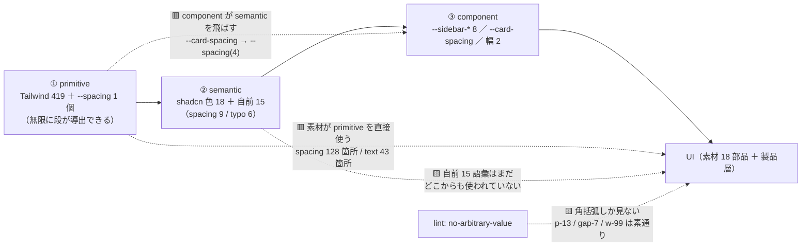
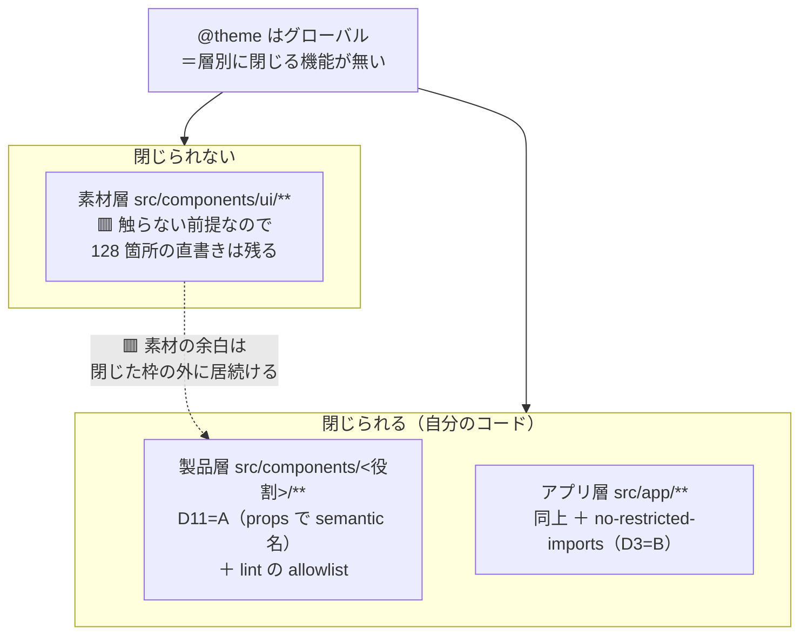

# デザイントークン設計（調査1）

> 手3 の **D4 / D8 / D11** の前段。[手順書 §2.5](手順/手3_Components層と製品層の分離.md) の調査ブロック 1。
> **事実を集めて構造化するところまで。**設計判断はしない（判断は手順書 §2 へ戻す）。
> 🟨 図解（**使い捨て**）: [枠は、まだ閉じていない](https://claude.ai/code/artifact/7eb624ca-3695-45d8-ae73-3e0476d19145)
> — クラス名を入れて枠の穴を触れる検査器と、カスケード上の位置の実寸マップ。**本文が正本。**

---

## 0. 答えを出す問い

ユーザーの要求（2026-07-26）:

> **色や余白は基本的に定義したモノしか使いたくない。これは共通コンポーネントもそうだし、共通を使ったアプリ側も同じ。**

これは**命名の問題ではなく、強制の問題**である。分解すると 3 つになる。

| # | 問い | 本書のどこ |
|---|---|---|
| ① | **いまの枠は閉じているか**（定義していない値は書けないか） | §1 |
| ② | **閉じようとすると何が起きるか** | §2 |
| ③ | **層をまたいで値を通す正しい形は何か** | §3・§4 |

**結論を先に**: いまの枠は**閉じていない**。閉じると**素材層（shadcn）が壊れる**。
したがって「定義したものしか使わせない」は**層ごとに違う手段で実現するしかない**（§6）。

---

## 1. 🟥 実測① — いまの枠は閉じていない

**プローブ**: 定義していない段と任意値を 6 つ書き、生成 CSS と lint を突き合わせた（2026-07-26・`pnpm build-storybook` + `eslint`）。

```tsx
<div className="p-13 gap-7 m-[13px] text-[13px] rounded-[3px] w-99" />
```

| 書いたもの | 生成された CSS | 実効値 | `no-arbitrary-value` |
|---|---|---|---|
| `p-13` | `padding:calc(var(--spacing) * 13)` | **52px** | 🟦 **通る** |
| `gap-7` | `gap:calc(var(--spacing) * 7)` | **28px** | 🟦 **通る** |
| `w-99` | `width:calc(var(--spacing) * 99)` | **396px** | 🟦 **通る** |
| `m-[13px]` | `margin:13px` | 13px | 🟥 止まる |
| `text-[13px]` | `font-size:13px` | 13px | 🟥 止まる |
| `rounded-[3px]` | `border-radius:3px` | 3px | 🟥 止まる |

> 🟥 **6 個書いて、lint が止めたのは 3 個。**
> `no-arbitrary-value` は「**角括弧が書かれているか**」を見ているだけで、「**定義されていない値か**」を見ていない。

**なぜこうなるか**: Tailwind v4 の spacing は**動的生成**である。`--spacing: 0.25rem` という基数が 1 つあるだけで、
`p-N` は `calc(var(--spacing) * N)` に展開される。**N に上限は無い。**
つまり `--spacing` を 1 個定義した時点で、**無限個の段が定義済みになっている**。

これは [トークンマッピング §1](トークンマッピング.md) の「`--spacing` は primitive」という仕分けの、実務上の意味そのもの——
**primitive を 1 個置くと、そこから無限の値が導出できてしまう。**

---

## 2. 🟥 実測② — 枠を閉じると素材層が死ぬ（しかもゲートは緑）

Tailwind v4 は名前空間ごとに既定を消せる（`--spacing: initial` / `--color-*: initial` / 全消しは `--*: initial`）。
**実際に閉じてみた**（`src/app/tokens.css` の `@theme` に `--spacing: initial;` を 1 行足して `pnpm build-storybook`）。

| クラス | 閉じる前 | 閉じた後 | 誰が使っているか |
|---|---|---|---|
| `p-4` | 生成される | 🟥 **0 件** | shadcn 部品 |
| `gap-2` | 生成される | 🟥 **0 件** | shadcn 部品 |
| `px-3` | 生成される | 🟥 **0 件** | shadcn 部品 |
| `h-8` | 生成される | 🟥 **0 件** | shadcn 部品（Button 既定） |
| `p-inset-md` | 生成される | 🟦 **1 件** | 自前の用途名 |

**shadcn の素材 18 部品は spacing を 128 箇所直書きしており、使っている段は 11 種**（`0 / 0.5 / 1 / 1.5 / 2 / 2.5 / 3 / 4 / 6 / 7 / 8`）。
枠を閉じると**この 128 箇所が全部無効になる**——余白がゼロになった部品が並ぶ。

> 🟥 **そして `pnpm build-storybook` は緑のまま完走した。**
> CSS は「存在しないクラスを無視する」だけなので、**壊れたことを機械は一切報告しない**。
> これは本 repo が繰り返し踏んでいる「**対象 0 件で緑**」の 4 例目にあたる
> （手0 の赤テスト／[DR-0025](DR/DR-0025-storybook-init-is-not-selectable.md) の `.storybook/**`／[DR-0021](DR/DR-0021-tailwind-scans-docs-markdown.md) の docs 走査）。

**含意**: 「定義したものしか使わせない」を `@theme` だけで実現することはできない。
`@theme` は**グローバル**であり、**ディレクトリ単位・層単位で閉じる機能を持たない**。

---

## 3. 🟦 実測③ — 部品を触らずに component token を向け替えられる（D8 の答え）

### まず `--card-spacing` とは何か

`src/components/ui/card.tsx` の実測:

```
[--card-spacing:--spacing(4)]                    ← Card のルート要素で定義
data-[size=sm]:[--card-spacing:--spacing(3)]     ← size=sm のとき 3 に切り替え
```

そして同じファイル内で **5 箇所が参照**している（`gap-(--card-spacing)` / `py-` / `px-` ×2 / `p-`）。

つまりこれは **Card 専用の「余白の窓口」**であり、Material Design 3 でいう `md.comp.*`（component token）に相当する。
**この 1 個を変えると Card の余白が全部動く。**

### 🟥 いまの参照方向は semantic を飛ばしている

```
--card-spacing  →  --spacing(4)   ＝ primitive を直接指している
```

3 層トークンの規約（§4）では **component は semantic を指し、primitive を直接指さない**。
いまは semantic 層（`--spacing-inset-md`）が存在するのに**飛ばされている**。

### 🟦 外から向け替えられる（実測）

`src/app/tokens.css` の末尾（`@theme` の**外**）に 1 規則足して `pnpm build-storybook` した結果:

```css
[data-slot='card'] {
  --card-spacing: var(--spacing-inset-lg);
}
```

生成 CSS 内の位置を機械的に確認した:

| 宣言 | 生成 CSS 内の位置 | カスケードレイヤ |
|---|---|---|
| shadcn の `[--card-spacing:--spacing(4)]` | 26,278 文字目 | 🟨 **`@layer utilities` の内側**（7,533〜61,371） |
| shadcn の `data-[size=sm]` 版 | 43,640 文字目 | 🟨 同上 |
| **自前の `[data-slot=card]` 上書き** | 63,324 文字目 | 🟦 **レイヤの外** |

**CSS のカスケードでは、レイヤに属さない宣言がレイヤ内の宣言に勝つ。**
したがって **`card.tsx` を 1 行も触らずに、Card の余白を semantic 層へ載せ替えられる。**

> 🟦 **これは Card 固有の話ではない。**shadcn は全部品に `data-slot="…"` を付けているので、
> **同じ手口が component token 全般（`--sidebar-*` ほか）に使える可能性がある。**
> [DR-0022](DR/DR-0022-shadcn-has-component-tokens.md) が「部品を触らず semantic 層へ載る唯一の接続点」と呼んだものは、
> **接続「点」ではなく接続「方式」だった**——手5 の観測点が変わる。

> 🟨 **ただし副作用が 1 つある。**上の書き方は `data-[size=sm]` の 3（12px）も潰す。
> **バリアントを保つなら、上書き側も `[data-slot=card][data-size=sm]` を書き分ける必要がある**（宣言が 2 つあることは実測で確認済み）。

---

## 4. 業界の 3 層は「名前」ではなく「参照方向」の規約

思想が「業界標準は 3 層トークン」と書いているものの実体を、一次情報で確認した。

| 出所 | 層の呼び方 | 規約の中身 |
|---|---|---|
| **Material Design 3** | `md.ref.*` → `md.sys.*` → `md.comp.*` | **component は system（semantic）を指す。reference を直接指さない。**だから壁紙から生成した新しい reference を差し替えるだけで UI 全体が追従する |
| **Nathan Curtis（EightShapes）** | global → alias → component-specific | 名前は `namespace / object / base / modifier` の 4 レベルで組む。値 `#F1F1F1` → global `gray-100` → alias `color-primary` → component `button-primary-color-background-hover` |
| **DTCG（W3C Community Group）** | **層は規定しない** | **2025-10 に first stable（2025.10）に到達。**ただし **W3C 標準ではなく Community Group Report**。規定するのは*交換フォーマット*であって層構造ではない |

> **3 層の値打ちは「3 段階に分ける」ことではなく、「参照が下向きの一方通行になる」こと。**
> primitive を差し替えれば semantic が動き、semantic が動けば component が動く——この連鎖が成立して初めて
> 手5 の問い（**部品を触らずに見た目が変わるか**）が yes になり得る。
> 逆に **1 箇所でも層を飛ばすと、そこで連鎖が切れる**。§3 の `--card-spacing → primitive` がその実例。

---

## 5. 本 repo の現在の参照方向



**実線が「効いている経路」、点線が「切れている／漏れている経路」。**
いま実線だけで完結しているものは無い。

---

## 6. 層ごとに閉じ方が違う（D4 に効く構造）

`@theme` はグローバルなので**層別に閉じられない**（§2）。**閉じる手段は層ごとに変える**しかない。



| 層 | 触れるか | 閉じる手段 | 実現性 |
|---|---|---|---|
| **素材層** `src/components/ui/**` | ❌ 触らない（手5 の前提） | 🟥 **閉じられない。**128 箇所の直書きは残る | ❌ |
| **製品層** `src/components/<役割>/**` | ✅ 自分のコード | ① D11=A（props で semantic 名だけ受ける）＋ ② lint の allowlist | ✅ |
| **アプリ層** `src/app/**` | ✅ 自分のコード | 同上 ＋ `no-restricted-imports`（D3=B で確定済み） | ✅ |

> 🟥 **したがって D4（手5 の観測対象）は「素材層のみ」では足りない。**
> D1=(c) により製品層は値を持つので、**製品層も「トークンで変わるべき層」として観測する必要がある**。
> ただし**閉じ方は非対称**——素材層は開いたまま、製品層とアプリ層だけ閉じる。

### D11 に効く事実

| 案 | 枠は閉じるか | 根拠 |
|---|---|---|
| **A** props で semantic 名を受ける（`<Stack gap="md">`） | 🟦 **閉じる** | 取れる値が TypeScript の union で有限集合になる。className を書かせないので `gap-7` が入り込む余地が無い |
| **B** `className` パススルー（`<Stack className="gap-4">`） | 🟥 **閉じない** | §1 の実測どおり `gap-7` も `w-99` も lint を素通りする |
| **C** 両方許す | 🟥 **実質 B** | 逃げ道がある時点で枠ではない |

### D8 に効く事実

| 判断材料 | 内容 |
|---|---|
| 何の話か | Card 専用の余白の窓口（component token）を、primitive 直結から semantic 経由へ**参照方向を正す**作業 |
| 部品を触るか | 🟦 **触らずにできる**（§3 で実測。レイヤ外の 1 規則） |
| 副作用 | 🟨 `data-[size=sm]` のバリアントも潰れる。保つなら書き分けが要る |
| 波及 | 🟦 同じ手口が `--sidebar-*` ほかにも使える見込み。**手5 の観測点が「1 箇所」から「方式」に広がる** |

---

## 7. 出典

| 出典 | 取得 | 何を取ったか |
|---|---|---|
| `~/git/design` 実測（`build-storybook` ＋ `eslint` ＋ 生成 CSS の位置解析） | 2026-07-26 | §1・§2・§3 のすべて。**プローブは全て撤去し `git status` clean を確認済み** |
| [Tailwind CSS — Theme variables](https://tailwindcss.com/docs/theme) | 2026-07-26 | 名前空間の一覧／`--namespace-*: initial` と `--*: initial`／`@theme` と `@theme inline` / `static` の違い／テーマ変数は `:root` の CSS 変数として出る |
| [Tailwind CSS — Spacing scale](https://mintlify.wiki/tailwindlabs/tailwindcss/customization/spacing) | 2026-07-26 | v4 の spacing は動的生成（`calc(var(--spacing) * n)`）。→ **実測で裏を取った**（§1） |
| [Design tokens — Material Design 3](https://m3.material.io/foundations/design-tokens/overview) | 2026-07-26 | `md.ref` / `md.sys` / `md.comp` の 3 種と、**component は system を指す**という参照方向 |
| [Naming Tokens in Design Systems（Nathan Curtis / EightShapes）](https://medium.com/eightshapes-llc/naming-tokens-in-design-systems-9e86c7444676) | 2026-07-26 | `namespace / object / base / modifier` の命名 4 レベル／global → alias → component-specific |
| [Design Tokens specification reaches first stable version（DTCG）](https://www.w3.org/community/design-tokens/2025/10/28/design-tokens-specification-reaches-first-stable-version/) | 2026-07-26 | 2025.10 が first stable。**W3C 標準ではない**（Community Group Report） |
| [Design Tokens Format Module 2025.10](https://www.designtokens.org/tr/drafts/format/) | 2026-07-26 | 規定範囲は交換フォーマットであって層構造ではない |
| [Design Token-Based UI Architecture（martinfowler.com）](https://martinfowler.com/articles/design-token-based-ui-architecture.html) | 2026-07-26 | primitive / semantic / component の 3 層と、semantic 層が実務の主役という位置づけ |

> ⚠ **公式ドキュメントは 1 点で足りなかった。**Tailwind の theme ページは「spacing が動的生成されるか」を明記していない。
> **`p-13` / `w-99` が実際に生成されることは実測で確定させた**（§1）。一次情報を実測で置き換える規律の 4 例目
> （1 例目 [DR-0006](DR/DR-0006-shadcn-base-radix-preset-nova.md)／2 例目 [DR-0022](DR/DR-0022-shadcn-has-component-tokens.md)／3 例目 [DR-0025](DR/DR-0025-storybook-init-is-not-selectable.md)）。
