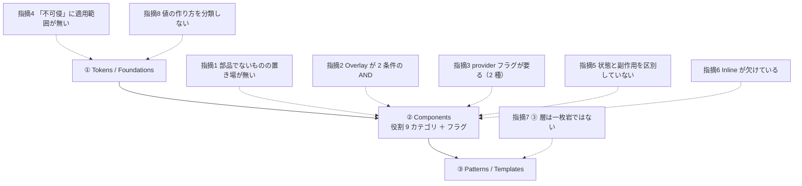

# 共通コンポーネント思想への指摘（8 件）

> ⚠ **[共通コンポーネント思想.md](共通コンポーネント思想.md) はユーザーの持ち物。書き換えない**（CLAUDE.md）。
> 本書は**実装したときに実際に起きたこと**だけを集めた指摘集で、**採否の判断はユーザー**。
> 🟨 図解（**使い捨て**）: [規定が細かい層ほど、実装すると例外が出る](https://claude.ai/code/artifact/e76b2e36-dcc5-44ac-93a4-43617a8278fd)
> — 7 件を層の上に置いた指摘マップと、③ 層の条件を触って確かめる判定器。**本文が正本。**
>
> 反映するかどうかの追跡は [OBS-0004](OBS/OBS-0004_思想への指摘を反映するか.md)。
>
> 指摘 1〜3 は [DR-0015](DR/DR-0015-findings-against-component-philosophy.md)（手1）が初出。4 以降は手3・手4・**手5** で追加。

---

## 0. 一覧

| # | 指摘 | 思想のどこに当たるか | 出た手 | 実装ではどうしたか |
|---|---|---|---|---|
| 1 | **「部品でないもの」の置き場が無い** | ② 役割 9 カテゴリ | 手1 | 🟦 製品層の直下に `providers.tsx` を置いた（[DR-0037](DR/DR-0037-providers-belong-to-product-layer.md)） |
| 2 | **Overlay の定義が 2 条件の AND** | ② 役割カテゴリの表 | 手1 | 🟨 暫定分類のまま（Accordion / Collapsible は未導入） |
| 3 | **フラグに `provider` が要る** | ② フラグ | 手1・手4 | 🟨 足していない。**種類が 2 つある**ことが手4 で判明 |
| 4 | **「不可侵」に適用範囲が無い** | ①（継承元 `apple.md`） | 手3 | 🟦 範囲を本 repo で決めた（[DR-0034](DR/DR-0034-touch-target-visual-32-hit-44.md)） |
| 5 | **「状態は hook へ」が状態と副作用を混ぜている** | ② 状態の扱い | 手3 | 🟦 切り出さないと決めた（[DR-0035](DR/DR-0035-sidebar-stays-as-vendor.md)） |
| 6 | **Layout の欠落リストに `Inline` が無い** | ② Layout カテゴリ | 手3 | 🟦 7 件目として自作した |
| 7 | **③ 層は一枚岩ではない** | ③ Patterns / Templates | 手4 | 🟦 条件を満たさない 1 件を特定（[DR-0039](DR/DR-0039-pattern-layer-is-not-uniform.md)） |
| 8 | 🆕 **トークンは「値」を分類するが「値の作り方」を分類しない** | ① Tokens / Foundations | 手5 | 🟥 **未解決。**58 箇所がトークンの外に残った（[DR-0045](DR/DR-0045-opacity-modifiers-were-invisible-to-lint.md)） |

**8 件のうち 5 件は実装側で答えを出した。**残る 3 件（指摘 2・3・**8**）は**分類表そのものの話**なので、思想を触らないと解けない。

---

## 1. 「部品でないもの」の置き場が無い

**思想の記述**: 役割 9 カテゴリは「Action / TextInput / … / Display」で、いずれも**画面に出るもの**。

**実装で起きたこと**: `Direction`（RTL/LTR をツリーに配るコンテキスト提供者）が**どのカテゴリにも入らなかった**（手1・[部品カタログ 表2](部品カタログ.md)）。
手2b では `TooltipProvider` と `SidebarProvider` が**実装でも配線を要求した**。手4 では `AppProviders` として実体になった。

**なぜ起きるか**: 分類の軸が「**画面上の役割**」なので、**画面に出ないもの**は原理的に入らない。
無理に入れると「Provider は Display か？」のような答えの無い問いが生まれる。

**提案**: 分類表に足すのではなく、**分類の外に「配線（wiring）」という置き場がある**と明記する。
> 実装では製品層の直下（`src/components/providers.tsx`）に置いた。**Provider は部品ではなく、部品が動くための前提条件**（DR-0037）。

---

## 2. Overlay の定義が 2 条件の AND になっている

**思想の記述**: `Overlay（重なり・開閉）`。

**実装で起きたこと**: `Accordion` と `Collapsible` が**どちらにも入らなかった**。
**開閉するが重ならない**ので Overlay ではなく、かといって Layout（Box / Stack / Grid / Container / Spacer / Card / Section）でもない。

**なぜ起きるか**: 「重なり」**かつ**「開閉」の 2 条件を AND で定義しているため、
**片方だけを満たす部品**（disclosure 系）の居場所が無い。

**提案**: **Overlay は「重なり」だけで定義し、開閉は `stateful` フラグで表す。**
思想自身が「状態を分類軸にせず、hook とフラグで表す」と決めているので、**その趣旨と一貫する。**

🟨 **未検証**: Accordion / Collapsible は導入していないので、実装では顕在化していない。

---

## 3. フラグに `provider` が要る（種類は 2 つある）

**思想の記述**: フラグは `stateful` / `behaviorHook` / `formBound` / `overlay` / `container` の 5 つ。

**実装で起きたこと**: `TooltipProvider` は **hook ではなく Provider で配線する**ので `behaviorHook` では表せない（手1）。
🆕 **手4 で、Provider には 2 種類あることが分かった**（[DR-0031](DR/DR-0031-sidebar-red-is-not-state.md)）。

| 部品 | 要求するもの | 種類 |
|---|---|---|
| `tooltip.tsx` | `TooltipProvider` | 🟦 **設定の配布**（`delayDuration` 等）。状態を持たない |
| `sidebar.tsx` | `SidebarProvider` | 🟨 **状態の配布** |

**提案**: `provider` フラグを足すなら、**値を `'config' | 'state'` の 2 種にする**。
🟨 ただし**必要性はまだ 1 度しか証明されていない**（Provider を要求する部品は 18 件中 2 件）。2 回ルールに照らすと**まだ足さなくてよい**。

---

## 4. 「不可侵」に適用範囲が書かれていない

**思想の記述**（継承元の `apple.md` §4.5「[公式・不可侵]」）: 「タッチターゲット **44×44px 以上**」。

**実装で起きたこと**: 本 repo は当初これを「**全コントロールの下限**」と読み、
shadcn nova の `h-8`(32px) を「不可侵の下限を割っている」と記録した（[DR-0023](DR/DR-0023-real-conflict-is-touch-target.md)）。
**一次情報を辿ると、tmp-admin が実際に適用しているのは `nav-item` の `min-height` 1 箇所だけ**だった（[DR-0030](DR/DR-0030-touch-target-provenance-corrected.md)）。

**なぜ起きるか**: 「44×44px 以上」とだけ書かれ、**何に適用するか**（全コントロールか／タッチ操作するものだけか／nav-item だけか）が規定されていない。
**値の話と範囲の話が分離されていない。**

**提案**: 「不可侵」を**値に対する宣言**と読み、**範囲は各 variant / 各プロジェクトが決める**と明記する。
> 実装ではさらに「**当たり判定に対する要求**」と読み替え、見た目 32px と両立させた（DR-0034）。
> Apple 自身が「タップできる面積であって見た目ではない」と定義しているので、この読み替えには根拠がある。

---

## 5. 「状態は hook へ」が状態と副作用を区別していない

**思想の記述**: 「状態は role の外に出し、開閉は `useXxxModal()` / `useXxxDrawer()` へ、入力値は RHF + Zod へ切り出す」。

**実装で起きたこと**: shadcn の `Sidebar` を調べると、**抱えていたのは「状態 1 つ」ではなく「関心事 4 つ」**だった。

| # | 関心事 | 種類 | 思想の射程 |
|---|---|---|---|
| 1 | 開閉状態（`useState` + 制御 props） | **状態** | 🟦 射程内 |
| 2 | 永続化（`document.cookie` に 7 日） | **副作用** | 🟥 射程外 |
| 3 | グローバルショートカット（`window` に Cmd/Ctrl+B） | **副作用** | 🟥 射程外 |
| 4 | レスポンシブ分岐（`useIsMobile` で Sheet に差し替え） | **方針** | 🟥 射程外 |

**なぜ起きるか**: 「状態を外に出す」だけでは、**副作用（永続化・グローバルキーバインド）と方針（レスポンシブ）の置き場が決まらない**。
`stateful` フラグも同じで、「状態を持つ」とだけ記録しても**何を持っているかが分からない**。

**提案**: 「状態」を **状態 / 副作用 / 方針**の 3 つに割ってから置き場を決める。
🟨 フラグを増やすなら `sideEffect` / `globalKeybinding` の軸が要るかもしれないが、**必要性はまだ 1 回**。

---

## 6. Layout の欠落リストに `Inline` が無い

**思想の記述**: Layout カテゴリは `Box, Stack, Grid, Container, Spacer, Card, Section`。

**実装で起きたこと**: Layout プリミティブを書いたとき、**`Stack`（縦積み）だけでは横並びが組めなかった**。
一覧の見出し行（件数 + 主要操作）を組むのに 7 件目として `Inline` が必要になった（手3）。

**なぜ起きるか**: `Stack` を「縦積み」と定義した時点で、**横方向の対が要る**。
Braid / Chakra / Grafana など実在の設計システムはいずれも `Stack` と `Inline`（または `HStack`）を対で持っている。

**提案**: Layout カテゴリに **`Inline`** を足す。**代替として `Stack` に `direction` prop を持たせる案もある**が、
「縦積み」という名前と食い違うので、別部品にするほうが名前と実体が一致する。

---

## 7. ③ 層は一枚岩ではない ★手4 の発見

**思想の記述**: 「コンポーネントの足し算だけではページにならない。**組み合わせの定石はひとつ上の層になる**」。

**実装で起きたこと**: 先に仮説として 3 件を切り出してから画面を組んだところ、**1 件は足し算で書けた**。

| 切り出したもの | 足し算で出るか | 持っていたもの |
|---|---|---|
| `ListDetail`（一覧 + 詳細シート） | 🟦 **出ない** | 状態の調整（`useListDetail`）＋ DataDisplay × Overlay の突き合わせ |
| `AppShell`（ページ骨格） | 🟨 微妙 | 構造は足し算だが「3 層の面の割り当て」は部品に書けない |
| `EmptyState`（空状態） | 🟥 **出る** | 素材の `Empty` を薄く包んだ 12 行 |

**なぜ起きるか**: 「足し算で出ない」は **③ 層全体の性質ではなく、③ 層に置くための条件**だった。
実装して分かった条件は 2 つで、**少なくとも一方を満たすものだけが ③ 層に属する。**

1. **状態を持つ**
2. **複数の役割カテゴリをまたぐ**

**提案**: 思想③に**置くための条件**を明記する。条件を満たさないものは ② 層のラッパーで足りる。

---

## 8. トークンは「値」を分類するが「値の作り方」を分類しない ★手5 の発見

**思想の記述**（① 層）: 3 層トークン（primitive / semantic / component）と、
「**UI はこれ（semantic）だけを使う**」「**数値直書きの禁止は lint で検知できるはず**」。

**実装で起きたこと**: 手5 でトークンを差し替えたところ、
**素材層の 17 種 60 箇所が、色は追従したのに濃さだけ動かなかった**（[DR-0045](DR/DR-0045-opacity-modifiers-were-invisible-to-lint.md)）。

```
bg-destructive/10   →  color-mix(in oklab, var(--destructive) 10%, transparent)
                        └─ トークン ────┘  └─ トークンではない ─┘
```

**`10` はクラス名に住んでいて、primitive でも semantic でも component でもない。**

**なぜ起きるか**: 3 層は**値の抽象度**で切った分類なので、
「**値をどう合成するか**」という軸を持たない。ところが状態面の作り方は**流派が 2 つある**。

| 流派 | 作り方 | トークンに載るもの | 手5 で起きたこと |
| --- | --- | --- | --- |
| shadcn | **合成する**（意味色 × 不透明度・3 段） | 色だけ。係数はクラス名 | 🟥 **色は追従・濃さは固定** |
| tmp-admin V4 | **合成しない**（合成済みの結果を専用トークンに） | `--fill-danger: rgba(255,59,48,.16)` | 🟦 丸ごと追従 |

**どちらも「semantic だけを使う」を守っている。**それでも**片方は枠が閉じ、片方は閉じない。**
→ 「semantic だけを使う」は**枠が閉じることの十分条件ではない。**

🟥 **併記されている「lint で検知できるはず」も、この形には効かない。**
`/10` は任意値（`[...]`）ではなく正規の Tailwind 構文なので、任意値禁止 lint は赤くしない。
**「トークン化されていない値」の集合は lint の赤では取れない**（[DR-0045](DR/DR-0045-opacity-modifiers-were-invisible-to-lint.md)）。

🟨 **同じ機構がリングにも出る。**`ring-destructive/20` と `ring-ring/50` は
**同じ `--tw-ring-color` を奪い合う**ので、エラー中の入力欄はフォーカスしても見た目が変わらない
（[DR-0054](DR/DR-0054-mock-specimens-cannot-reproduce-stacked-states.md)）。**合成の係数がトークンの外にある限り、この衝突は設計できない。**

**提案**: ① 層に**「合成をトークンの内側でやるか、外側でやるか」を決める**という項を足す。

- **内側**（tmp-admin 方式）＝ 状態面ごとに semantic トークンを持つ。**枠は閉じるが語彙が増える**
- **外側**（shadcn 方式）＝ 色トークン + 修飾子。**語彙は少ないが枠は閉じない**

🟥 **本 repo はまだ選んでいない。**概念の理解ごと [OBS-0009](OBS/OBS-0009_不透明度と状態面の概念を理解する.md) に積んである。

---

## 9. まとめ — 指摘が集まる場所には偏りがある



**8 件のうち 5 件が ② Components 層に集まっている。**
これは ② が**最も細かく規定されている層**（9 カテゴリ + 5 フラグ + 状態の扱い）だからで、
**規定が細かいほど、実装したときに例外が出る**という当たり前の帰結でもある。

🟦 **「① と ③ は規定が粗いので指摘が少ない」という読みは、実装するたびに崩れている。**
③ は手4 で初めて実装したところ**すぐに 1 件出た**（指摘 7）。
**① も、手5 で初めて値を流し込んだら 1 件出た**（指摘 8）。

🟨 **偏りの原因は「規定の細かさ」ではなく「使い込みの量」だったかもしれない。**
② が 5 件なのは、手1〜手4 の 4 手ぶん使い込んでいるから、とも読める。
🟥 **これは仮説で、確かめていない。**（指摘の件数を「手あたり」で正規化すれば見えるが、それは手9 の仕事）

---

## 10. 出典

| 出典 | 何を取ったか |
|---|---|
| [部品カタログ.md](部品カタログ.md) 表2・表3・表4 | 指摘 1・2・3・6（手1 の分類作業で出たもの） |
| [DR-0015](DR/DR-0015-findings-against-component-philosophy.md) | 指摘 1〜3 の初出 |
| [タッチターゲットとサイズ密度.md](タッチターゲットとサイズ密度.md) §5 | 指摘 4 |
| [状態とProviderの置き場.md](状態とProviderの置き場.md) §5 | 指摘 5 |
| [実行記録.md](実行記録.md) §手3 | 指摘 6（`Inline` が必要になった経緯） |
| [DR-0039](DR/DR-0039-pattern-layer-is-not-uniform.md) | 指摘 7 |
| [DR-0045](DR/DR-0045-opacity-modifiers-were-invisible-to-lint.md)・[DR-0054](DR/DR-0054-mock-specimens-cannot-reproduce-stacked-states.md) | 指摘 8（手5 の実測 58 箇所とリングの衝突） |
| `~/git/CC-Skills/.../apple.md` §4.5 | 指摘 4 の一次情報（「[公式・不可侵]」の記述） |
