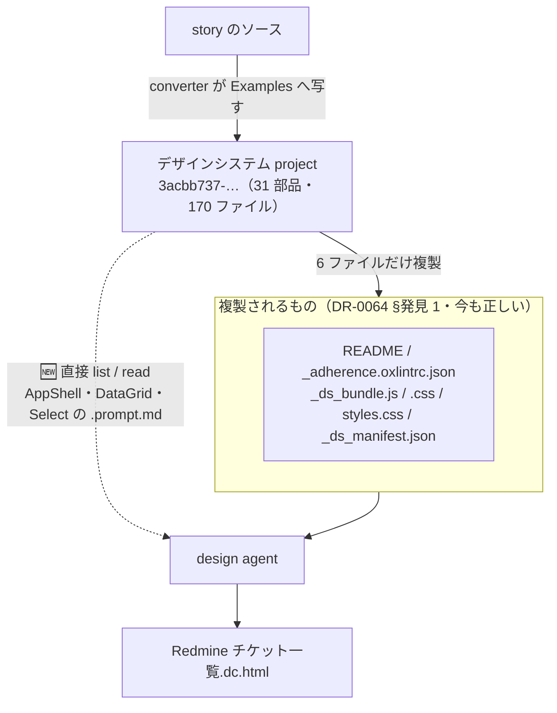

# 実行記録

> 段取りの正本は [UI検証の位置づけと段取り.md](UI検証の位置づけと段取り.md)、各手の計画は [docs/手順/](手順/)。
> **本ファイルは実測結果だけを積む**（計画は書かない ＝ 手順書との責務分離。→ [README](../README.md#文書の責務分離)）。
> 1 手 = 1 節。結果が PoC の DR / OBS に落ちるものは、ここに実測だけ書いて行き先を明記する。

---

## 手0 — 土台（2026-07-26・完了）

> ⚠ 手0 は**手順書を持たない**。フォーマット（[_template.md](手順/_template.md)）を確定させたのが手1 の計画時点だったため。
> 手1 以降は「手順書で問いを立ててから実行する」順序を守る。

### 作ったもの

単体の Next.js アプリ（monorepo にしない）。`src/` が PoC の `apps/redmine/src/` と 1:1 で対応する形にして、移送の写像を明快に保つ。

| ファイル | 内容 |
|---|---|
| `package.json` | 依存は**すべて PoC の catalog と同一値で厳密ピン**（`^` なし。ADR-0012 準拠） |
| `mise.toml` | node 24（PoC と同一） |
| `tsconfig.json` | PoC の `base.json` + `nextjs.json` をインライン統合 |
| `next.config.ts` | 最小（差分は下記） |
| `postcss.config.mjs` | **Tailwind v4 の配線。PoC 側では未着手のため、ここが初出** |
| `eslint.config.mjs` | PoC の `base.js` + `next.js` を 1 ファイルへ統合（差分は下記） |
| `.prettierrc.json` / `.prettierignore` / `.gitattributes` / `cspell.json` / `.gitignore` | PoC と同型 |
| `src/app/{layout,page}.tsx` / `globals.css` | 疎通確認のみ。トークンは手2、部品は手1 以降 |

**ピンした版**: next 16.2.10 / react 19.2.7 / typescript 6.0.3 / tailwindcss 4.3.3 / eslint 10.7.0 / typescript-eslint 8.64.0 / eslint-plugin-tailwindcss 4.2.0 / prettier 3.9.5 / cspell 10.0.1（実行環境: node 24.18.0・pnpm 10.28.1）

### 実測（3 ゲート + 赤テスト）

| 検査 | 結果 |
|---|---|
| `pnpm typecheck` | **緑** |
| `pnpm lint` | **緑** |
| `pnpm format:check` | **緑** |
| `pnpm build` | **緑**（`/` と `/_not-found` が静的生成） |
| `pnpm spell` | **緑**（未知語 5 件を辞書へ追加後） |

**赤テストで gate の発火を確認した**（PoC で「配線前は `pnpm lint` が対象 0 件で成功していた＝何も検査していなかった」事故があったため、緑を信用せず発火側を確かめた）。

| 赤テスト | 結果 |
|---|---|
| `className="bg-[#ff0000] p-[13px]"` | **2 件検出** — `tailwindcss/no-arbitrary-value`。**色と余白の両方**で発火 |
| 未 await の Promise | **1 件検出** — `@typescript-eslint/no-floating-promises`（＝型情報つき lint の配線も生きている） |

→ [共通コンポーネント思想](共通コンポーネント思想.md) ① Tokens 層の「数値直書きの禁止は lint で検知できるはず」は、**期待ではなく実装済み**であることを実測で確認した。しかも `p-[13px]`（余白）も捕まるので、「AI が margin/padding を発明する」という当初の課題に直接効く。

### PoC との差分（移送時に効く。手9 で解決する）

| # | 差分 | 理由 | 🟥 移送時の扱い |
|---|---|---|---|
| 1 | `tsconfig.json` に `paths: { "@/*": ["./src/*"] }` を追加 | **shadcn/ui が既定で要求する**（`components.json` の aliases） | PoC の `apps/redmine/tsconfig.json` に**エイリアスが無い**。PoC 側に足すか、移送時に相対パスへ書き換えるか |
| 2 | `next.config.ts` から `output: 'standalone'` と `outputFileTracingRoot` を落とした | monorepo でのコンテナ配布用。本 repo は単体アプリ | 移送先では PoC 側の設定が正。差分を持ち込まない |
| 3 | ESLint から **fetch 直書き禁止**と **`no-restricted-imports`** を落とした | 本 repo に守る対象（`src/lib/api/` の mutator・生成 hooks・`redmine-api`）が存在しない | **本 repo で lint が緑でも、PoC で緑とは限らない。**移送後に PoC 側で再走が要る |
| 4 | ESLint の **Server Actions 禁止は残した** | 部品層でも第 2 の経路を作らない趣旨は同じ | そのまま |
| 5 | shadcn が置く `src/components/ui/**` を **ignore しない** | orval のような生成物ではなく自分で編集する実体コード。ignore すると「shadcn の素のコードが strictTypeChecked と任意値禁止を通るか」（手1 の観測）ができなくなる | PoC 側でも同じ扱いにするかは手9 |

### この手から切り出した DR

| DR | 内容 |
|---|---|
| [DR-0003](DR/DR-0003-foundation-mirrors-poc.md) | 決定: 土台は PoC と同一版・同一 lint の単体 Next.js アプリ |
| [DR-0008](DR/DR-0008-poc-tailwind-not-wired.md) | 発見: PoC の Tailwind はアプリに配線されていない |
| [DR-0009](DR/DR-0009-nextjs-rewrites-tsconfig.md) | 発見: Next.js 16 は build 時に `tsconfig.json` を書き換える |

### 次

手1（shadcn デフォルト導入 + 役割 9 カテゴリへの割り当て表）。

---

## 手1 — shadcn 導入と役割分類（2026-07-26・完了）

> 計画: [手1_shadcn導入と役割分類.md](手順/手1_shadcn導入と役割分類.md)
> 成果物: [部品カタログ.md](部品カタログ.md)（表1〜表5）

### 実行した構成

`shadcn@4.15.0` / `base: radix` / `style: radix-nova` / `baseColor: neutral` / `cssVariables: true`
部品 **18 件**を追加（button・input・label・select・checkbox・badge・separator・table・pagination・skeleton・empty・dialog・sheet・dropdown-menu・tooltip・popover・card・sidebar）。

### 機械ゲートの結果

| 検査 | 結果 |
|---|---|
| `pnpm typecheck` | 🟥 **赤 1 件**（`dropdown-menu.tsx:94` / `exactOptionalPropertyTypes`） |
| `pnpm lint` | 🟥 **赤 33 件** |
| `pnpm build` | 🟥 **赤**（typecheck と同一原因） |
| `pnpm format:check` | 🟦 緑（D11 適用後） |
| `pnpm spell` | 🟦 緑 |

**lint 33 件の内訳**

| ルール | 件数 |
|---|---|
| `tailwindcss/no-arbitrary-value` | 24 |
| `@typescript-eslint/restrict-template-expressions` | 4 |
| `@typescript-eslint/no-confusing-void-expression` | 4 |
| `react-hooks/set-state-in-effect` | 1 |

**ファイル別**: `sidebar.tsx` **17**／`button.tsx` 4／`use-mobile.ts` 3／`card.tsx` 2／`tooltip.tsx` 2／その他 1 ずつ（badge・checkbox・dialog・dropdown-menu・select）
→ **過半が Sidebar 1 部品に集中している。**

### 問いへの答え

| # | 問い | 答え |
|---|---|---|
| **Q1** | 素のコードは `strictTypeChecked` を通るか | 🟨 **ほぼ通るが 1 件落ちる。**`exactOptionalPropertyTypes: true`（PoC の `base.json` が定めている）に `DropdownMenuCheckboxItem` の `checked` が非対応。**移送時に必ずぶつかる。**lint 側の型系は 9 件（うち `sidebar.tsx` 5・`use-mobile.ts` 3） |
| **Q2** | 素のコードは任意値禁止を通るか | 🟥 **通らない。24 件。**ただし性質が 4 つに割れる（[部品カタログ 表5](部品カタログ.md#表5-任意値の分類q2-の答え--手5-の判定に直結)）。**追従しない純粋な生値が 8 件**、部分追従が 6 件、実質トークン内が 4 件、**ルールの過剰検知が 6 件** |
| **Q3** | `init` は何を書き換えるか | 🟦 **`tsconfig.json` は無傷。`globals.css` の手書きコメントも残った。**書き換わったのは `globals.css`（追記）・`layout.tsx`（Geist フォント注入）・`package.json`。`components.json` は新規 |
| **Q4** | 9 カテゴリに素直に入らないものは | **2 件が分類不能**（Direction / Marker）、**8 件が迷い**。→ 思想への指摘 3 点（[部品カタログ 表2](部品カタログ.md#表2-分類できなかった迷ったものq4-の答え)） |
| **Q5** | Layout の欠落はどれだけか | 🟥 **Box / Stack / Grid / Container / Spacer / Section が全滅。**shadcn はレイアウトプリミティブを提供しない方針。**思想の「Layout は自作テンプレで持つ」判断は実装上も正しかった** |
| **Q6** | 状態の持ち方の食い違い | 🟦 **想定より小さい。**shadcn の Overlay 部品は Radix の薄い再輸出で、`open`/`onOpenChange` はパススルー、**自身は state を持たない**。思想の「開閉は `useXxxModal()` へ」はラッパー無しで成立する。**例外は Sidebar 1 つ**（useState + Context + Provider + cookie + キーボードショートカットを内包） |
| **Q7** | spacing / typography の semantic token はあるか | 🟥 **無い。**生成された `globals.css` の宣言は**色（background/foreground ペア・destructive・border・input・ring・chart-1..5・sidebar-\*）と `--radius` 系のみ**。フォントは `--font-sans` / `--font-heading` の 2 つだけでサイズ階調は無し。**余白トークンは 1 つも無い**。→ **思想①「gap/padding を semantic token に限定する」は shadcn だけでは成立せず、手2 で自前定義が必須** |

### 計画からの逸脱と、その場で決めたこと

| # | 何が起きたか | 決定 |
|---|---|---|
| **D1 / D6 / D7 の失効** | `shadcn init --help` の実測で、公式 docs が説明する `--base-color` フラグが存在せず、`--base`（プリミティブ実装）+ `--preset`（設計システム）の 2 軸だったと判明 | D9 = `radix`（ユーザー決定）／ D10 = `nova`。手順書 §2 に追記済み |
| ⚠ **上記の一部は誤りだった** | init 実行後の `components.json` には **`tailwind.baseColor: "neutral"` も `cssVariables: true` も実在した**（CLI が既定値として書き込む）。「論点ごと消滅」は言い過ぎで、正しくは**「CLI フラグとしては存在しないが設定キーとしては実在し、既定値が D1・D6 の決定と一致していた」** | 結果的に D1（neutral）・D6（true）は満たされている |
| **D11（新規）** | shadcn が置いたコードが prettier の整形と食い違い、`format:check` が赤になった | **`src/components/ui/` `src/hooks/` `src/lib/utils.ts` を `.prettierignore` へ。**整形すると「shadcn が吐いたそのもの」でなくなり手5 の証拠性が落ちる／`add`・`update` のたびに全行 diff になる。**編集禁止の意味ではない**（PoC の `src/generated/` とは性質が違う） |

### この手から切り出した DR

| DR | 内容 | 効く先 |
|---|---|---|
| [DR-0006](DR/DR-0006-shadcn-base-radix-preset-nova.md) | 決定: `base=radix` / `preset=nova`（CLI v4 の設定モデル） | — |
| [DR-0007](DR/DR-0007-shadcn-output-handling.md) | 決定: shadcn 出力は整形対象外・lint の赤は ignore しない | 以降すべて |
| [DR-0010](DR/DR-0010-shadcn-invents-values.md) | ⭐ 発見: shadcn 自身が任意値を発明している | **手5 の判定方法** |
| [DR-0011](DR/DR-0011-lint-rule-overdetects.md) | 発見: 任意値禁止ルールが「構文上の指定」まで弾く | PoC ADR-0019 |
| [DR-0012](DR/DR-0012-shadcn-supplies-no-layout-no-spacing.md) | ⭐ 発見: Layout も spacing / typography も供給されない | **手2・手3** |
| [DR-0013](DR/DR-0013-shadcn-holds-no-state-except-sidebar.md) | ⭐ 発見: state を持たない（例外は Sidebar 1 つ） | **手3** |
| [DR-0014](DR/DR-0014-exact-optional-property-types-incompatible.md) | ⭐ 発見: `exactOptionalPropertyTypes` と非互換 | **手3**・手9 |
| [DR-0015](DR/DR-0015-findings-against-component-philosophy.md) | 発見: 共通コンポーネント思想への指摘 3 点 | ユーザー判断 |
| [DR-0016](DR/DR-0016-shadcn-deps-are-caret-ranges.md) | 発見: 依存が `^` レンジ・preset の実体は CSS import 1 行 | 手5・手9 |

### 次

手2（① Tokens 層）。**作業範囲は手1 の観測で確定済み**——詳細は [handoff.md](handoff.md#次にやること手2)。

---

## 手2 — ① Tokens 層（2026-07-26・完了）

> 計画: [手2_トークン層マッピング.md](手順/手2_トークン層マッピング.md)
> 成果物: [トークンマッピング.md](トークンマッピング.md)（表1〜表4）／`src/app/tokens.css`

### 突き合わせた 4 者と件数

| # | 出所 | 実体 | 件数 |
|---|---|---|---|
| ① | 思想の 3 層 | [共通コンポーネント思想.md](共通コンポーネント思想.md) | primitive / semantic / component |
| ② | shadcn | `src/app/globals.css` | `:root` 32 ／ `.dark` 31 ／ `@theme inline` 40 |
| ②-b | shadcn preset の `@import` 先 | `shadcn/tailwind.css` 629 行 ／ `tw-animate-css` | **設計語彙 0 件** |
| ③ | Tailwind v4 | `tailwindcss/theme.css` | **419**（色 288 ／ 非色 131） |
| ④ | tmp-admin + apple | `aux-admin.md` の 23 を `apple.md` の 81 にマージ | **101**（うち 14 は意図して不使用 → 実効 87） |

**②-b は今回はじめて開いた。**手1 の棚卸し（H1-06）は `globals.css` 138 行だけを見ていた。
`shadcn/tailwind.css` が持つ変数 51 件は**すべて `--scroll-fade-*` / `--shimmer-*`**（`@utility` の実装変数）で、
設計語彙は 0 件。`tw-animate-css` も 0 件。→ **DR-0012 の結論は射程を広げても成立する。**

### 機械ゲートの結果（ベースライン比較）

| 検査 | 手1 完了時 | 手2 完了時 | 判定 |
|---|---|---|---|
| `pnpm typecheck` | 🟥 赤 1 | 🟥 **赤 1** | 変化なし |
| `pnpm lint` | 🟥 赤 33 | 🟥 **赤 33** | 変化なし（内訳も同一） |
| `pnpm build` | 🟥 赤 | 🟥 **赤** | 同一原因（typecheck） |
| `pnpm format:check` | 🟦 緑 | 🟦 緑 | 一度 `tokens.css` で赤 → `prettier --write` で解消 |
| `pnpm spell` | 🟦 緑 | 🟦 緑 | 一度赤 5 件 → 辞書に `largetitle` / `noto` / `rgba` を追加 |

**新しい赤はゼロ。**トークンの語彙を足しただけでは、lint も typecheck も動かない。

### 赤テスト（緑を信用しない）

`page.tsx` に用途名クラスを一時的に書いてビルドし、生成 CSS を直接検査した。

| クラス | 結果 |
|---|---|
| `p-inset-lg` `gap-stack-lg` `gap-inline-sm` `text-body` `font-emphasis` | ✅ **生成された** |
| `p-inset-nonexistent` `text-nonexistent`（定義していない用途名） | ✅ **生成されなかった** |

生成された中身は `padding:var(--spacing-inset-lg)` のように**すべて参照**で出た。
`:root` 側も `--spacing-inset-lg:calc(var(--spacing) * 6)` / `--text-body:var(--text-sm)` と参照のまま。
→ **手5 の差し替えは「参照先を向け替えるだけ」で成立する見込み**（D5 の狙いどおり）。

### 問いへの答え

| # | 問い | 答え |
|---|---|---|
| **Q1** | 思想の 3 層は載るか | 🟦 **3 層とも載る。**primitive 419（Tailwind）／ semantic 色 18（shadcn）／ **component 11**（`--sidebar-*` 8・`--card-spacing`・幅 2）。**「shadcn は semantic 1 層」という段取り §3.5 の前提は誤りだった**（→ DR-0022）。欠けているのは層ではなく **semantic 層のうち spacing と typography だけ** |
| **Q2** | tmp-admin を写したときの対応 | 1:1 **17** ／ 多:1 **8** ／ 1:多 **1** ／ 🟥 **無し 22**。**約半分は「語彙の追加」が要る**＝手5 は値の差し替えだけでは終わらない |
| **Q3** | accent 衝突はトークンだけで解けるか | 🟦 **色は解ける。**`preset=nova` の `--primary` は `oklch(0.205 0 0)` ＝ **ほぼ黒の無彩色**でブランド色ではない。accent を入れなければ V2 は守れ、accent の行き先は `--ring`（tmp-admin 4.5 と完全一致）。🟥 **残るのは「塗り CTA という形」だけで、これは部品を触らないと消えない。**そして**本当に重い衝突は accent ではなく touch-min 44px だった**（→ DR-0023） |
| **Q4** | Tailwind の `--spacing` / `--text-*` は semantic か | 🟥 **primitive。**`--spacing` は 0.25rem が 1 個あるだけで段の名前すら無い。`--text-xs..9xl` はサイズ名。tmp-admin は用途名（body / subhead / footnote）を持ち 4.3 で使い分けを規定しているので、**写す先が無い** → DR-0019 で自前定義を決定 |
| **Q5** | shadcn の部品は自前 semantic 層を使うか | 🟥 **使わない。**素の部品は spacing を **132 箇所**（`gap-2` 11・`py-1` 10・`gap-1.5` 10…）、text サイズを **43 箇所**（`text-sm` 29・`text-xs` 10・`text-base` 4）直書きしている。**semantic 層が効くのは手3 で自作する Layout テンプレの内側だけ** |
| **Q6** | トークンを足すと任意値 24 件は減るか | 🟥 **減らない（33 件のまま）。**部品を書き換えない限り 1 件も動かない。→ DR-0010 の対処3（トークンを足して部品を書き換える）は**「足す」だけでは成立せず、必ず「書き換える」が要る** |
| **Q7** | 自前トークンは `shadcn add` で生き残るか | 🟦 **生き残る。**`shadcn@4.15.0 add tabs` を流したが `globals.css` も `tokens.css` も**差分ゼロ**（作られたのは `tabs.tsx` のみ）。`components.json` の `tailwind.css` は `src/app/globals.css` を指しており、**CLI が `tokens.css` を触る経路が無い**。→ D1（別ファイル）は有効。**観測後 tabs は revert 済み**（ベースラインを汚さないため） |

### 計画からの逸脱と、その場で決めたこと

| # | 何が起きたか | 決定 |
|---|---|---|
| **D9（新規）** | H2-04 の赤テスト中、**使っていないはずの `.p-inset-md` / `.gap-inset-md` が生成 CSS に現れた**。出所は**手順書のコード例のコメント**。Tailwind v4 の自動コンテンツ検出が `docs/**.md` まで走査していた | **`globals.css` に `@source not '../../docs'` を 1 行。**手5 は生成 CSS の差分で「どこが変わらなかったか」を読む手なので、**文章の編集で観測が動く**状態を先に潰す。仕組みの追加ではなく**観測装置の較正**（→ DR-0021） |
| **Q1 の分岐が発火** | 手順書 H2-02 の「判断」欄が予告していたとおり、`--sidebar-*` が component 層に落ちた。加えて `card.tsx` の `[--card-spacing:--spacing(4)]` を発見 | §2 へは追記せず、**発見として DR-0022 に切り出した**（手順書が「その場合は §2 に追記」としていたが、これは**判断ではなく観測**なので DR が正しい置き場） |

### この手から切り出した DR

| DR | 内容 | 効く先 |
|---|---|---|
| [DR-0019](DR/DR-0019-semantic-spacing-typography-vocabulary.md) | 決定: semantic な spacing / typography は**用途名で自前定義**（3 案の比較つき） | 手3・手5 |
| [DR-0020](DR/DR-0020-dark-mode-out-of-scope.md) | 決定: dark はトークン差し替えの**対象外** | 手5・手2b |
| [DR-0021](DR/DR-0021-tailwind-scans-docs-markdown.md) | ⭐ 発見: Tailwind v4 が `docs/**.md` を走査し**文章中のクラス名を本番 CSS に生成する** | **手5**・PoC |
| [DR-0022](DR/DR-0022-shadcn-has-component-tokens.md) | ⭐ 発見: **3 層とも実在する**（component token は有る）。欠けているのは spacing / typography だけ | 手3・段取りの訂正 |
| [DR-0023](DR/DR-0023-real-conflict-is-touch-target.md) | ⭐ 発見: 本当の衝突は accent ではなく**タッチターゲット 44px** | **手3**・手9 |

### 次

手2b（UI カタログ = Storybook 10.5）。方針は [DR-0017](DR/DR-0017-storybook-as-catalog.md) で確定済み。

---

## 手2b — UI カタログ（Storybook 10.5）（2026-07-26・完了）

> 計画: [手2b_UIカタログStorybook.md](手順/手2b_UIカタログStorybook.md)
> 成果物: `.storybook/` ／ `src/stories/`（19 ファイル = 18 部品 + Foundations）

### 実行した構成

`storybook@10.5.4` / `@storybook/nextjs-vite@10.5.4` / `vite@8.1.5`。**すべて厳密ピン**（D2）。
addon は **`addon-a11y` と `addon-docs` の 2 つだけ**（D10）。story は `src/stories/<役割カテゴリ>/`（D5）。

| 役割カテゴリ | 部品 | 件数 |
|---|---|---|
| Foundations | Tokens（色 26・角丸 7・余白 9・タイポ 6） | 1 |
| Action | Button | 1 |
| TextInput | Input | 1 |
| Selection | Checkbox, Select | 2 |
| Layout | Card | 1 |
| Overlay | Dialog, Sheet, DropdownMenu, Popover, Tooltip | 5 |
| DataDisplay | Table | 1 |
| Navigation | Pagination, Sidebar | 2 |
| Communication | Badge, Empty, Skeleton | 3 |
| Display | Label, Separator | 2 |
| **計** | | **19 ファイル**（部品 18） |

### 機械ゲートの結果（**6 本になった**）

| 検査 | 手2 完了時 | 手2b 完了時 | 判定 |
|---|---|---|---|
| `pnpm typecheck` | 🟥 赤 1 | 🟥 **赤 1** | 変化なし |
| `pnpm lint` | 🟥 赤 33 | 🟥 **赤 33** | 変化なし |
| `pnpm build` | 🟥 赤 | 🟥 **赤** | 同一原因 |
| `pnpm format:check` | 🟦 緑 | 🟦 緑 | |
| `pnpm spell` | 🟦 緑 | 🟦 緑 | |
| 🆕 `pnpm build-storybook` | — | 🟦 **緑** | D4 で追加 |

**新しい赤はゼロ。**ただし**途中で一度 41 件まで増えた**（init 直後）。内訳と対処は下表。

### 依存の増分（Q5）

| 項目 | 値 |
|---|---|
| init が入れた devDependency | **13 件**（Playwright のブラウザバイナリのダウンロードを含む） |
| 削った後の増分 | **6 件**（storybook / nextjs-vite / addon-a11y / addon-docs / eslint-plugin-storybook / vite） |
| 依存の合計 | 22 → **28** |
| `pnpm-lock.yaml` | **+1,991 行** |
| `^` レンジ | **7 件のまま**（すべて shadcn 由来。Storybook 側は全件厳密ピン） |
| 🟨 peer の不整合 | `tsconfck@3.1.6` が `typescript: ^5.0.0` を要求（本 repo は 6.0.3）。`@storybook/nextjs-vite` → `vite-plugin-storybook-nextjs` → `vite-tsconfig-paths` 経由。**警告のみで動作はする** |

### 問いへの答え

| # | 問い | 答え |
|---|---|---|
| **Q1** | Storybook と本体は同じ CSS を生成するか | 🟨 **値は等価だが形式が違う。**本体（Next 16 / lightningcss）は oklch を **hex + `@supports` の lab** に展開し、Storybook（Vite 8）は **oklch のまま**出す。角丸・余白・タイポ（参照で書いたもの）は**完全に一致**。→ DR-0026。🟦 手2 の `@source not '../../docs'` は **Vite 側でも効いた**（両方 0 件） |
| **Q2** | 部品本体を触らずに story を書けるか | 🟦 **書けた。`src/components/ui/**` は 1 行も触っていない**（`git status` で確認）。手5 の前提は保たれている |
| **Q3** | 配線が要る部品はどう置かれるか | 🟨 **`Tooltip` と `Sidebar` の 2 つが Provider を要求した。**どちらも story 内 / `meta.decorators` で解決でき、部品は触っていない。**`preview.tsx` の decorator で全 story に配る手は採らなかった**——Provider を要求する部品は 18 件中 2 件だけで、全体に配ると「どの部品が配線を要求しているか」が story から読めなくなる。→ [部品カタログ 表2](部品カタログ.md) の指摘 1・3（「部品でないもの」の置き場が無い・`provider` フラグが要る）が**実装でも同じ形で顕在化した** |
| **Q4** | 描画のみで判定装置として足りるか | 🟦 **足りた。**予行演習は**生成 CSS の静的分類と実効値の計算だけ**で完了し、ブラウザ実行（addon-vitest / Playwright）は要らなかった。→ 未決 #8 の答え（DR-0024） |
| **Q5** | 本体の厳密ピンは壊れるか | 🟦 **壊れない。**Storybook 側は全件厳密ピンにでき、`^` は shadcn 由来の 7 件のまま。🟥 ただし**依存 +6・lock +1,991 行**は移送コストとして残る（PoC の catalog に storybook / vite は 1 つも無い） |
| **Q6** | ゲートは story と `.storybook/**` を検査するか | 🟥 **story は検査していたが、`.storybook/**` は射程外だった。**`tsconfig.json` の `include` が `src/**/*` と `*.config.ts` だけで、typecheck は対象外・lint は `Parsing error` で 2 件落ちる状態。**D14 で `include` に足して両方を射程に入れた**（意図的な型エラーで発火を確認）。→ DR-0025 |
| **Q7** | ★ 判定装置は本当に機能するか | 🟦 **機能する。ただし方法は想定と違った。**「生成 CSS の diff」では**1 行しか動かない**（すべて `var()` 参照のため）。正しくは **① 参照の形で静的分類 ② 実効値の計算 ③ 目視で裏取り**の 3 段。DR-0010 が (C)(B) として分類していた箇所が**そのまま現れた**。→ **手5 の判定方法が確定**（未決 #5 の答え）。DR-0027 |

### 予行演習の結果（H2B-07・`--radius` 10px → 24px）

🟥 **確認後に `git checkout` で復元済み**（`git status` が空に戻ることを確認）。

| 対象 | 式 | 10px 時 | 24px 時 | 判定 |
|---|---|---|---|---|
| `rounded-sm` 〜 `4xl` 7 段 | `calc(var(--radius) * n)` | 6〜26px | 14.4〜62.4px | 🟦 全段追従 |
| Button `xs` / `icon-xs` | `min(var(--radius-md), 10px)` | 8px | **10px** | 🟨 頭打ち |
| Button `sm` / Select `sm` | `min(var(--radius-md), 12px)` | 8px | **12px** | 🟨 頭打ち |
| **Checkbox** | `rounded-[4px]` | 4px | **4px** | 🟥 変わらない |
| **Tooltip** | `rounded-[2px]` | 2px | **2px** | 🟥 変わらない |

**事前に「変わらない」と特定していた 2 件が、実験で本当に変わらなかった**＝装置は機能する。

### 計画からの逸脱と、その場で決めたこと

| # | 何が起きたか | 決定 |
|---|---|---|
| **D10** | `init --yes` が **13 依存**（Playwright 含む）を入れた。「描画のみ」を選ぶ経路が無い | **描画 + a11y + docs に削る。**`addon-a11y` だけ例外で残す——DR-0023 の **touch-min 44px（未決 #11）を機械で測る手段**になり、axe-core のみでブラウザバイナリを引かないため |
| **D11** | `@storybook/addon-mcp` が入っていた | **外す。**Storybook を MCP で AI に露出する addon で、**手7 の別経路になりうる**が手2b の目的とは無関係。→ 未決へ |
| **D12** | init が `eslint.config.mjs` に **import 行だけ**足し、config 配列に追加していなかった（＝プラグインが効いていない） | **正しく配線する**（`storybook.configs['flat/recommended']` を追加）。story は自分で書くコードなので検査対象に入れる |
| **D13** | init が `src/stories/` に Example 一式（独自コンポーネント + 生 CSS）を生成した | **消す。**本 repo の規約（トークン以外の値を書かない）と反し、D5 の置き場とも構造が衝突する |
| **D14** | 🟥 **`.storybook/**` がどのゲートの射程にも入っていなかった**（H2B-03 の赤テストで判明） | **`tsconfig.json` の `include` に足す。**「対象 0 件で緑」の事故と同型なので ignore では逃げない |

> **H2B-03（ゲートの射程を story より前に確かめる）を手順に置いておいて助かった。**
> 先に 19 ファイル書いてから「検査されていなかった」と分かると、全部を検査し直すことになっていた。

### この手から切り出した DR

| DR | 内容 | 効く先 |
|---|---|---|
| [DR-0024](DR/DR-0024-storybook-render-only-and-gate.md) | 決定: 描画のみ（+ a11y）で導入し `storybook build` をゲートに追加（3 案の比較つき） | 未決 #8・#9 を閉じた |
| [DR-0025](DR/DR-0025-storybook-init-is-not-selectable.md) | ⭐ 発見: `init` は描画のみを選べず、eslint 設定を壊し、`.storybook/**` はゲート射程外だった | **手9（移送）**・PoC |
| [DR-0026](DR/DR-0026-two-css-pipelines-differ.md) | 発見: 本体と Storybook は同じトークンを別形式で出力する（oklch ↔ hex+lab） | **手5**・PoC |
| [DR-0027](DR/DR-0027-token-swap-not-detectable-by-css-diff.md) | ⭐ 発見: **CSS の diff では判定できない**。静的分類 + 実効値計算の 2 本立て | **手5 の判定方法が確定**（未決 #5） |

### 次

手3（② Components 層）。Layout プリミティブの自作と、未決 #1（`exactOptionalPropertyTypes`）・#2（Sidebar の state）・#11（touch-min 44px）・#12（`--card-spacing` の接続）の決着。

---

## 手3 — ② Components 層 / 素材層と製品層の分離（2026-07-26・完了）

> 計画は [手3 手順書](手順/手3_Components層と製品層の分離.md)。判断の根拠は [DR-0032〜0037](DR/index.md)、
> 判断の前段に置いた調査は [デザイントークン設計](デザイントークン設計.md) / [状態とProviderの置き場](状態とProviderの置き場.md) / [タッチターゲットとサイズ密度](タッチターゲットとサイズ密度.md)。

### 作ったもの

| 実体 | 件数 | 内容 |
|---|---|---|
| `src/components/<役割カテゴリ>/` | **9 ディレクトリ** | 🟦 **役割 9 カテゴリがコード上に初めて実在した**（それまでは story の `title` 文字列だけ） |
| 素通しの再輸出 | **16** | 中身は素材のまま。窓口を 1 本にするためだけに通す |
| 既定値ラッパー | **2** | `Action/Button`（当たり判定 44px）／`Navigation/Sidebar`（nav-item の min-height 44px） |
| 自作 Layout プリミティブ | **7** | Box / Stack / **Inline** / Grid / Container / Spacer / Section |
| `src/components/Layout/tokens.ts` | 1 | props で取れる値の union（**枠の実体**） |
| `src/components/providers.tsx` | 1 | `AppProviders`（D10=A の置き場。中身は手4 で増える） |
| story | **+7 / 既存 18 に層タグ** | `own` 7 ／ `wrapped` 2 ／ `vendor` 16 |
| `tokens.css` の語彙 | 15 → **21** | `touch-min` `hit-expand` `container-content` `container-wide` `gutter` を新設、`--card-spacing` の向け替え 2 規則 |
| `eslint.config.mjs` | — | `no-restricted-imports`（D3=B）＋ `no-restricted-syntax` 8 セレクタ（D4=B′） |

### §0 の問いの答え

| # | 問い | 答え |
|---|---|---|
| **Q1** | Layout は semantic 語彙だけで組み切れるか | 🟨 **組み切れたが、語彙を 3 つ足す必要があった。**`Container` を書こうとして**最大幅の語彙が無い**ことが判明（`--container-content` / `--container-wide` / `--spacing-gutter` を新設）。[トークンマッピング 2.4](トークンマッピング.md) が「手3 の Layout テンプレで持つ」と予告していた箇所と一致。🟦 **`Box` への逃げは 0 回**（現時点） |
| **Q2** | 素材層を 1 行でも触るか | 🟦 **触っていない。**`git diff --stat main -- src/components/ui/` が空 |
| **Q3** | touch-min 44px は素材層を触らずに解けるか | 🟦 **② 製品層のラッパーで解けた。**生成 CSS に `@media (pointer:coarse){…inset:calc(var(--spacing-hit-expand) * -1)}`（-6px → 32+12=44px）と `min-height:var(--spacing-touch-min)`（44px）を確認。🟥 **目視での裏取りは未実施**（`addon-a11y` は 24px の AA しか測らない＝ DR-0034） |
| **Q4** | Sidebar の state を切り出すと赤はいくつ減るか | 🟦 **切り出さないと決めた**（D6=A・DR-0035）ので観測を打ち切った。事前実測では**最大 5 件**（17 件中 11 件は任意値） |
| **Q5** | `exactOptionalPropertyTypes` は素材層を触らずに解けるか | 🟨 **解いていない。設定を弱めた**（D5=A）。🟥 **借金として `tsconfig.json` にコメントで明記**。手9 で必ず赤が復活する |
| **Q6** | 素材の story と自作の story が二重に並ぶか | 🟦 **並ぶ。タグで解いた。**`tags: ['vendor' / 'wrapped' / 'own']` を全 story に付け、手5 でどちらの由来か切り分けられるようにした |
| **Q7** | `--card-spacing` の向け替えで Card は変わるか | 🟦 **参照は繋がった**（レイヤ外の 2 規則が `@layer utilities` の宣言に勝つことを位置解析で確認）。🟨 **見た目は変わらない**——`--spacing-inset-md` の実効値が shadcn の `--spacing(4)` と同値（16px）だから。**動くのは手5 で値を向け替えたとき** |
| **Q8** | 自作部品の story は雛形に型が取れるか | 🟦 **取れた。**7 件とも `meta` + `Default` + `render` の同型で書け、**スクリプトで生成できた**。素材 18 件では型が取れなかった（手2b 申し送り）のと対照的で、理由は**自分で API を決められるから**。→ **2 回目の需要が証明された**（手9 の仕組み化候補） |

### 🟥 機械ゲートのベースラインが動いた

| ゲート | 手2b 完了時 | **手3 完了時** | 理由 |
|---|---|---|---|
| `pnpm typecheck` | 🟥 赤 1 | 🟦 **緑** | 🟥 **D5=A で設定を弱めたから。解決ではない** |
| `pnpm lint` | 🟥 赤 33 | 🟥 **赤 33** | 内訳も同一（任意値 24 / 型系 9）。**新しい赤ゼロ** |
| `pnpm build` | 🟥 赤 | 🟦 **緑** | typecheck と同一原因 |
| `pnpm format:check` | 🟦 緑 | 🟦 緑 | |
| `pnpm spell` | 🟦 緑 | 🟦 緑 | 辞書に 6 語追加（第 3 セッション） |
| `pnpm build-storybook` | 🟦 緑 | 🟦 緑 | |

> 🟥 **緑が 2 本増えたが、これは前進ではなく借金。**次セッションはこの数字を「良くなった」と読まないこと。

### 実測で分かったこと（計画に無かったもの）

1. 🟥 **`tailwindcss/no-arbitrary-value` が見る文脈は 3 つだけ**（`className` 属性 / `cva()` / `cn()`）。
   **素の `const` と object literal は見ない**——プローブで確認した。
   → 自前の `no-restricted-syntax` も**同じ 3 文脈に揃えた**（穴の位置を一致させるため）。→ DR-0038。
2. 🟥 **アプリ層の既存コードが新ルールで 3 行落ちた。**`page.tsx` が `p-8` / `mt-2` / `text-gray-600` を直書きしていた。
   → **Layout プリミティブで書き直し、製品層とアプリ層の赤を 0 件にした**。これが枠が閉じたことの最初の実証。
3. 🟨 **色も枠に入れる必要があった。**当初は数値の段だけを禁じたが、`text-gray-600` は Tailwind パレット 288 色の 1 つで用途を言っていない＝ primitive。
   ユーザー要求は「**色と余白**は定義したものだけ」なので、パレット色の禁止セレクタを足した。
4. 🟨 **思想の欠落リストに `Inline` が無かった。**[部品カタログ 表3](部品カタログ.md) は Box/Stack/Grid/Container/Spacer/Section の 6 件だが、
   **`Stack` だけでは横並びが組めず**、実装中に 7 件目が必要になった。→ **思想への指摘 6 件目**（書き換えず記録）。
5. 🟥 **`rm -rf` でプローブを消したときに、同じディレクトリの成果物（`Layout/Card.tsx`）も消していた。**
   typecheck が拾って気づいた。**プローブは成果物と同じディレクトリに置かない**——次から `_probe/` を切る。

### PoC へ戻すもの

| 内容 | 行き先 |
|---|---|
| `no-arbitrary-value` は 3 文脈しか見ない／`p-13`・`w-99` は素通り | 🟥 OBS 候補（DR-0028・DR-0038） |
| 製品層・アプリ層を閉じる `no-restricted-syntax` 8 セレクタ | ui.md の材料（DR-0033） |
| 上位部品は `className` を受けない規約（逃げ道は Box 1 つ） | ui.md の材料（DR-0032） |
| a11y のタッチターゲットは「当たり判定」に対して書く | ui.md の材料（DR-0034） |
| 🟥 `exactOptionalPropertyTypes` を false にした借金 | **移送時に必ず出る**（DR-0014） |

---

## 手4 — ③ Patterns / Templates 層と一覧（2026-07-26・完了）

> 計画は [手4 手順書](手順/手4_PatternsTemplates層と一覧.md)。新しい発見は [DR-0039](DR/DR-0039-pattern-layer-is-not-uniform.md)・[DR-0040](DR/DR-0040-frame-leaks-when-a-layer-is-added.md)。

### 作ったもの

| 実体 | 件数 | 内容 |
|---|---|---|
| `src/lib/fixtures/issues.ts` | 1 | ダミーデータ（D1=A・使い捨て）。**型を 1 つに閉じた** |
| `src/patterns/` | 3 | `ListDetail` / `useListDetail` / `EmptyState` |
| `src/templates/` | 1 | `AppShell`（3 層の面の割り当て） |
| `src/components/DataDisplay/DataGrid.tsx` | 1 | TanStack Table との組み合わせ部品（D2） |
| `src/components/DataDisplay/StatusPill.tsx` | 1 | 🟥 **自作。**Badge に success / warning と色ドットが無い |
| `src/app/page.tsx` / `layout.tsx` | 2 | チケット一覧 ／ `AppProviders` の配線（[DR-0037](DR/DR-0037-providers-belong-to-product-layer.md)） |
| story | +3 | `StatusPill` / `DataGrid` / `EmptyState`（層タグ `own`） |
| `tokens.css` の語彙 | 21 → **29** | 意味色 2・状態 tint 4・行高 1・状態ドット 1 |

### §0 の問いの答え

| # | 問い | 答え |
|---|---|---|
| **Q1** | 製品層だけで組み切れるか | 🟦 **組み切れた。**素材層への直 import **0 件**／**`Box` への逃げ 0 回**／製品層・③ 層・アプリ層の lint 赤 **0 件** |
| **Q2** | 素材層を触るか | 🟦 **触っていない**（`git diff --stat main -- src/components/ui/` が空）。手3 に続き 2 回連続 |
| **Q3** | tmp-admin の一覧仕様は語彙で書けるか | 🟨 **書けたが語彙を 8 足した。**意味色 `success`/`warning`（shadcn は `destructive` のみ）・状態 tint 4・`--spacing-row`（行高 60px）・`--spacing-dot`（色ドット）。🟥 **すべて既定への参照で、値は書いていない**（[DR-0005](DR/DR-0005-token-ownership-and-two-stage.md) 決定3） |
| **Q4** | ③ 層は component の足し算で出ないものか | 🟨 **混ざっていた。**`ListDetail` は出ない／`AppShell` は微妙／**`EmptyState` は出る**。→ **③ 層は一枚岩ではない**（[DR-0039](DR/DR-0039-pattern-layer-is-not-uniform.md)） |
| **Q5** | 生成型に差し替えられる形か | 🟦 **なっている。**`export interface Issue` 1 つが差し替え点で、画面・Pattern・DataGrid はこの型しか見ない |
| **Q6** | TanStack Table の移送コスト | 🟦 **安い。**依存 10 → 11（+1・厳密ピン）／`pnpm-lock.yaml` +22 行。**Storybook（+6 依存・+1,991 行）と桁違い**。🟨 ただし `react-hooks/incompatible-library` の**警告が 1 件**増えた（React Compiler が DataGrid の最適化をスキップする） |
| **Q7** | Cmd/Ctrl+B は衝突するか | 🟦 **衝突していない**（現時点。一覧で他のキーバインドを使っていない）。→ [DR-0035](DR/DR-0035-sidebar-stays-as-vendor.md) の A は維持 |
| **Q8** | 当たり判定は実際に 44px か | 🟨 **実効値計算までで、目視は未実施。**`--spacing` 4px × 1.5 = 6px、`h-8` 32px なので **32 + 6×2 = 44px** は静的に確定。🟥 **ブラウザでの実測は未了**（[DR-0027](DR/DR-0027-token-swap-not-detectable-by-css-diff.md) の 3 段目） |

### 機械ゲート

| ゲート | 手3 完了時 | **手4 完了時** | 差分 |
|---|---|---|---|
| `pnpm typecheck` | 🟦 緑 | 🟦 緑 | — |
| `pnpm lint` | 🟥 **error 33** | 🟥 **error 33 ／ 🆕 warning 1** | **error はゼロ増**。warning は TanStack Table 由来（Q6） |
| `pnpm build` | 🟦 緑 | 🟦 緑 | — |
| `pnpm format:check` / `pnpm spell` / `pnpm build-storybook` | 🟦 緑 | 🟦 緑 | — |

🟦 **error 33 はすべて素材層**（`src/components/ui/**` と `src/hooks/`）。製品層・③ 層・アプリ層は 0 件。

### 実測で分かったこと（計画に無かったもの）

1. 🟥 **③ 層が lint の射程外だった**（[DR-0040](DR/DR-0040-frame-leaks-when-a-layer-is-added.md)）。
   H4-01 の赤テストで**書く前に**捕まえた。**「対象 0 件で緑」の 5 例目。**
   → **層を足すたびに `files` を更新する運用が要る。**必要性は 2 回目（手2b・手4）なので、仕組み化は手9 で判断。
2. 🟥 **`Badge` では状態 pill が組めなかった。**variant は default / secondary / destructive / outline / ghost / link の 6 つで、
   **success / warning が無く色ドットも持たない**。→ `StatusPill` を自作。
   🟦 ただし形は shadcn の `destructive`（`bg-destructive/10 text-destructive`）に揃えられた——
   [トークンマッピング 表3 #8](トークンマッピング.md)「発想は一致」を実装で確かめた形になる。
3. 🟨 **ジェネリック部品は story の `meta` に `component:` を置けなかった。**
   `DataGrid<TData, TValue>` の型引数が `unknown` に潰れて args が合わない。`render` で書いた。
   → **手3 Q8 で「型が取れた」とした雛形の例外 1 件目。**
4. 🟨 **`EmptyState` は ③ 層の条件を満たしていない**（状態を持たず、1 カテゴリに閉じている）。
   移すなら `Communication/EmptyState`。**2 回目の需要が出るまで動かさない**（2 回ルール）。

### PoC へ戻すもの

| 内容 | 行き先 |
|---|---|
| ③ 層は一枚岩ではない（置く条件は「状態を持つ」or「複数カテゴリをまたぐ」） | OBS 候補（DR-0039） |
| ディレクトリ単位の規約は層を足すたびに漏れる | 🟥 OBS 候補（DR-0040） |
| TanStack Table の移送コスト（+1 依存・lock +22 行・React Compiler 警告 1） | catalog に追加（DR-0024 と同じ扱い） |

---

## 手5 — ★ トークン差し替え実験（2026-07-26・**進行中**）

> 計画は [手順書 手5](手順/手5_トークン差し替え実験.md)。**本節は実測だけ。**
> 判定は Storybook 側に固定（[DR-0026](DR/DR-0026-two-css-pipelines-differ.md)）＝ `storybook-static/assets/iframe-*.css` を読む。

### H5-01 ベースラインの確認 — ✅ 一致

`git status --porcelain` 空。ゲート 6 本を実行し、[handoff.md](handoff.md) の表と突き合わせた。

| ゲート | 手4 完了時（表） | **手5 開始時（実測）** | 判定 |
| --- | --- | --- | --- |
| `pnpm typecheck` | 🟦 緑 | 🟦 緑 | ✅ 一致 |
| `pnpm lint` | 🟥 error 33 / warning 1 | 🟥 **error 33 / warning 1** | ✅ 一致 |
| `pnpm build` | 🟦 緑 | 🟦 緑 | ✅ 一致 |
| `pnpm format:check` | 🟦 緑 | 🟦 緑 | ✅ 一致 |
| `pnpm spell` | 🟦 緑 | 🟦 緑 | ✅ 一致 |
| `pnpm build-storybook` | 🟦 緑 | 🟦 緑 | ✅ 一致 |

lint の内訳（`eslint . -f json` の集計）:

```
tailwindcss/no-arbitrary-value                    24
@typescript-eslint/restrict-template-expressions   4
@typescript-eslint/no-confusing-void-expression    4
react-hooks/set-state-in-effect                    1
react-hooks/incompatible-library                   1  （warning）
```

**新しい赤はゼロ。**ベースライン CSS は 70,700 bytes（`iframe-DTvsWoWh.css`）。

### H5-02 赤テスト — 🟥 **予測が 1 件外れた**

`src/app/tokens.css` の末尾に `@theme` を追記 → `pnpm build-storybook` → 生成 CSS を grep、の 2 回。
撤去は毎回 `git checkout src/app/tokens.css`（**`rm -rf` は使っていない**＝手3 の事故を踏まえて）。

#### (1)(2) 影と weight — 1 回のビルドで同時に測った（触る utility が互いに素なので）

投入: `@theme { --shadow-md: 0 0 0 4px red; --font-weight-medium: 900; }` → `build-storybook` exit **0**

| 観測 | ベースライン | プローブ後 | 予測 | 結果 |
| --- | --- | --- | --- | --- |
| `.shadow-md` | `--tw-shadow:0 4px 6px -1px var(--tw-shadow-color,#0000001a), …` | `--tw-shadow:0 0 0 4px var(--tw-shadow-color,red)` | 🟥 変わらないはず | 🟥 **外れ。変わった** |
| `.shadow-lg`（**対照**） | `0 10px 15px -3px …` | **同一** | 変わらないはず | ✅ 段ごとに独立 |
| `:root` の `--shadow-md` | 出ない | **出ない** | — | 🟦 **実行時の継ぎ目は無い**＝ビルド時解決 |
| `:root` の `--font-weight-medium` | `500` | `900` | 変わるはず | ✅ |
| `.font-medium` | `font-weight:var(--font-weight-medium)` | **同一** | 参照は保たれるはず | ✅ |

🟥 **「`var()` を出さない」と「`@theme` が効かない」は別物だった。** → [DR-0044](DR/DR-0044-tailwind-resolves-tokens-at-build-time-too.md)

#### (3) `--spacing: initial` — 予測どおり「対象 0 件で緑」

投入: `@theme { --spacing: initial; }` → `build-storybook` exit **0**

| 観測 | ベースライン | プローブ後 |
| --- | --- | --- |
| `.p-4` の生成 | 1 | **0** |
| `.gap-2` の生成 | 1 | **0** |
| `.px-3` の生成 | 1 | **0** |
| CSS 全体 | 70,700 bytes | **60,942 bytes（−9,758）** |

🟥 **素材 18 部品の余白が全部消えてもビルドは緑。**→ [OBS-0003](OBS/OBS-0003_対象0件で緑が5回出た.md) の **6 例目**。
**Q5 の答え: 赤くなる仕組みは無い。**判定はすべて生成 CSS と目視で行う。

#### H5-02 が動かしたもの

| 何が動いたか | 前 | 後 |
| --- | --- | --- |
| [DR-0043](DR/DR-0043-recount-of-fifteen-unchanged-spots.md) の甲 | 2 件（17 箇所） | **3 件（24 箇所）**（影 7 が乙から移動） |
| 同 乙 | 6 件 | **5 件** |
| 同 **丙** | **1 件** | **1 件**（変わらず） |
| 手5 §2 **D1 の射程** | 影 7 + スクリム 2 ＝ 9 箇所 | **スクリム 2 箇所のみ** |

🟦 **H5-02 を H5-03 より前に置いた判断が効いた。**この誤りは、そうでなければ
**1 周目の差し替えを全部やってから「影が変わってしまった」形で発覚していた。**

**プローブはすべて撤去済み。`git status --porcelain` が空であることを確認した。**

### H5-03 第 0 段：継ぎ目の全件棚卸し — 🟥 **Q3 は yes。58 箇所が漏れていた**

[DR-0044](DR/DR-0044-tailwind-resolves-tokens-at-build-time-too.md) により「生成 CSS がリテラルか `var()` か」では
② ビルド時解決 と ③ 解決しない を区別できないと分かったので、**手口を「クラス名の形で分類する」に変えた。**

`src/components/ui/*.tsx` の全文字列リテラルからクラスを抽出 → variant 接頭辞を除去
（**`[ ]` の外の `:` だけを区切りとみなす**）→ デザイン値を運ぶ接頭辞に絞って分類。

#### 結果

| 分類 | 種 | 延べ | [DR-0043](DR/DR-0043-recount-of-fifteen-unchanged-spots.md) の 16 行に載っていたか |
| --- | --- | --- | --- |
| 🟥 純粋な生値 | 8 | 8 | ✅ 載っていた |
| 🟦 任意値だが `var()` を含む | 9 | 12 | ✅ 載っていた |
| ⬜ 分数（`left-1/2` `w-3/4`） | 4 | 5 | ⬜ 構造（DR-0011 の (D)） |
| 🟨 **不透明度修飾** | **17** | **60** | 🟥 **`bg-black/10` の 2 箇所のみ。残る 58 箇所は不可視** |
| | **38** | **85** | |

デザイン値ユーティリティは延べ **752**（🟨 `w-full` / `h-svh` を含む緩い上限なので率には使わない）。

#### 🟦 検算に成功した — 純粋な生値 8 種が [DR-0010](DR/DR-0010-shadcn-invents-values.md) の (C) と完全一致

```
max-w-[calc(100%-2rem)]  min-w-[96px]  ring-[3px]  rounded-[2px]
rounded-[4px]  text-[0.8rem]  translate-y-[calc(-50%_-_2px)]  w-[2px]
```

**手1 は lint の JSON から、H5-03 はクラス名の形から、独立に同じ 8 件へ到達した。**
→ **事前特定の「方法」は正しかった。穴は「分類の語彙」にあった。**

#### 🟨 不透明度修飾 17 種 60 箇所（新規）

| クラス | 箇所 | クラス | 箇所 |
| --- | --- | --- | --- |
| `bg-muted/50` | 7 | `ring-destructive/20` | 7 |
| `ring-destructive/40` | 7 | `ring-foreground/10` | 6 |
| `bg-destructive/20` | 5 | `ring-ring/50` | 5 |
| `bg-input/30` | 4 | `border-destructive/50` | 4 |
| `bg-destructive/10` | 3 | `bg-input/50` | 3 |
| `bg-black/10` | 2 | `bg-primary/80` | 2 |
| `bg-destructive/30` / `bg-input/80` / `bg-secondary/80` / `border-destructive/40` / `text-sidebar-foreground/70` | 各 1 | | |

生成 CSS（2 規則ずつ出る。フォールバック + `color-mix`）:

```
.bg-destructive\/10{background-color:var(--destructive)}
.bg-destructive\/10{background-color:color-mix(in oklab, var(--destructive) 10%, transparent)}
.bg-muted\/50{background-color:color-mix(in oklab, var(--muted) 50%, transparent)}
```

🟨 **色は `var()` を追う。不透明度はクラス名側にあって焼き込まれる。**
→ 甲でも丙でもない**第 5 の状態「丁（部分追従）」**。[DR-0045](DR/DR-0045-opacity-modifiers-were-invisible-to-lint.md)

#### なぜ漏れたか

**出発点が `pnpm lint` の赤（任意値 24 件）だったから。**`bg-destructive/10` は角括弧を含まない正当な
Tailwind クラスなので `no-arbitrary-value` は赤くしない。

🟥 **[DR-0043](DR/DR-0043-recount-of-fifteen-unchanged-spots.md) が指摘した誤りの裏返し。**
あちらは「lint が赤くしたものを、そのまま解くべきものとして数えた」（過剰）。
こちらは「lint が赤くしなかったものを数えなかった」（過少）。**根は同じ。**

### H5-04 / H5-06 1 周目「素直」— 🟥 **書き方を 2 回間違えた。どちらもビルドは緑**

手5 §2 D2=B に従い `src/app/tmp-admin.css` を新設し、`globals.css` から `@import` した。
値の出どころは `~/git/CC-Skills`（base `apple.md` / delta `aux-admin.md`）。

#### 3 回のビルド

| 回 | 書き方 | 実効変数の変化 | ビルド | 判定 |
| --- | --- | --- | --- | --- |
| 1 | `@theme { --color-* }` ／ import は上部 | **31 件**（🟥 意味色 18 と `--radius` が動かず） | 🟦 exit 0 | 🟥 半分だけ効いた |
| 2 | `@theme` ／ **import を末尾へ** | **0 件**（🟥 import ごと破棄） | 🟦 exit 0 | 🟥 全部消えた |
| 3 | **`:root:root`** ＋ `@theme` ／ import は上部 | 🟦 **58 件** | 🟦 exit 0 | ✅ |

🟥 **3 回とも `pnpm build-storybook` は exit 0。**警告も出ない。→ [DR-0046](DR/DR-0046-theme-swap-loses-to-source-order.md)

**検出は grep が速かった。**`grep -c "003a63"` が **0** なら届いていない。ビルドの成否より確実。

#### 3 回目（採用）で動いた 58 件の内訳

| 群 | 件数 | 例 |
| --- | --- | --- |
| 意味色（shadcn semantic） | 18 | `--primary` → `#000` ／ `--ring` → `#005fa2` ／ `--destructive` → `#ff3b30` |
| サイドバー（component） | 8 | `--sidebar` → `#003a63` ／ `--sidebar-primary` → `#009fe8` |
| 自前 spacing 語彙 | 13 | `--spacing-inset-md` → `16px` ／ `--spacing-row` → `60px` |
| 自前タイポ語彙 | 5 | `--text-body` → `17px` ／ `--text-label` → `13px` |
| 意味色・状態 tint（手4 の語彙） | 6 | `--color-success` → `#34c759` ／ `--color-fill-danger` → `#ff3b3029` |
| レイアウト幅 | 2 | `--container-content` → `980px` |
| 角丸の基数 | 1 | `--radius` → `12px` |
| 🆕 weight / blur / 等幅 | 4 | `--font-weight-medium` → **600** ／ `--blur-xs` → **0px** |
| （影は `:root` に出ないので別枠） | — | 下記 |

#### 🟦 Q1 の答え — 甲 24 箇所は**すべて追従した**

| 甲 | 箇所 | 機構 | 結果 |
| --- | --- | --- | --- |
| blur（V1「blur を使わない」） | 2 | `--blur-xs: 4px → 0px` | ✅ |
| weight 500 → 600（V3） | 15 | `--font-weight-medium: 500 → 600` | ✅ |
| 影（apple `--shadow-1/2`） | 7 | `@theme` の `--shadow-*`（ビルド時解決） | ✅ |

影は生成 CSS の**規則そのもの**が書き換わった:

```
base  .shadow-md{--tw-shadow:0 4px 6px -1px …}   .shadow-lg{--tw-shadow:0 10px 15px -3px …}
lap1  .shadow-md{--tw-shadow:0 1px 3px …}        .shadow-lg{--tw-shadow:0 8px 30px …}
```

`shadow-sm` は素の `.shadow-sm` ではなく `group-data-[variant=floating]:shadow-sm` /
`md:peer-data-[variant=inset]:shadow-sm` として出ており、**両方とも追従した**（sidebar の 2 箇所）。

#### 🟦 規則 diff は 4 件だけ — そしてそれが「ビルド時解決」の全件だった

規則単位で base と比べると **707 件中 4 件しか変わらない**（新規 0 / 消滅 0）。
その 4 件は `shadow-md` / `shadow-lg` / `group-data-…:shadow-sm` / `md:peer-data-…:shadow-sm`。

🟦 **[DR-0027](DR/DR-0027-token-swap-not-detectable-by-css-diff.md) と [DR-0044](DR/DR-0044-tailwind-resolves-tokens-at-build-time-too.md) が同時に裏づけられた。**
規則 diff に現れるのは**ビルド時解決のものだけ**で、実行時参照のものは `:root` の値だけが動く。
→ **「@theme を動かして規則 diff を取る」と、ビルド時解決カテゴリを機械で全件列挙できる。**

#### 🟨 D5 の 1 周目（A）— 角丸の非線形 5 段は再現できない

`--radius: 0.625rem → 12px` で 7 段すべてが比率どおり動いた。

| shadcn の段 | 実効値 | apple | 一致 |
| --- | --- | --- | --- |
| sm | 7.2px | — | |
| md | 9.6px | s 8px | ✕ |
| lg | **12.0px** | **m 12px** | ✅ |
| xl | 16.8px | — | |
| 2xl | 21.6px | l 18px | ✕ |
| 3xl | 26.4px | — | |
| 4xl | 31.2px | xl 28px | ✕ |

🟨 **基数を合わせた 1 段（lg = m = 12px）しか一致しない。**予告どおり非線形は再現できない。
→ 2 周目（D5=B）で段ごとに上書きし、**語彙を何個足せば再現できるか**を数える。

#### 🟦 Q4 — 素材層の diff は **0 行**

`git diff --stat -- src/components/ui/` が空。**4 回目の観測も維持。**

#### ゲート（1 周目・全 6 本）

| ゲート | ベースライン | 1 周目 | 判定 |
| --- | --- | --- | --- |
| `pnpm typecheck` | 🟦 緑 | 🟦 緑 | ✅ |
| `pnpm lint` | 🟥 error 33 / warning 1 | 🟥 **error 33 / warning 1** | ✅ ゼロ増 |
| `pnpm build` | 🟦 緑 | 🟦 緑 | ✅ |
| `pnpm format:check` | 🟦 緑 | 🟦 緑 | ✅ |
| `pnpm spell` | 🟦 緑 | 🟦 緑 | ✅ |
| `pnpm build-storybook` | 🟦 緑 | 🟦 緑 | ✅ |

**新しい赤はゼロ。**🟥 ただし上表のとおり**ゲートは 3 回とも緑だった**ので、緑は何も保証していない。

### H5-05b / H5-06b / H5-07b 2 周目「無理」— 代償の実測

1 周目（`tmp-admin.css`）は消さず、`src/app/tmp-admin-override.css` を重ねた（手5 §2 D1=D / D5=B）。

#### 🟥 角丸は `@theme` では届かなかった — DR-0046 の一般形

手順書 §2 の D5=B は「段ごとに `@theme inline` で上書きする」と書いていたが、**効かない**。

```
lap2 の 1 回目:  @theme { --radius-md: 8px; … }
生成 CSS:        .rounded-md{border-radius:calc(var(--radius) * .8)}   ← 変わらず
```

**`globals.css` の `@theme inline` が `--color-*` 31 + `--radius-*` 7 = 38 キーを握っており、
それが `@import` より後ろにあるので、先に import した `@theme` は必ず負ける。**

| 対象 | 迂回先 | 結果 |
| --- | --- | --- |
| 意味色 18・サイドバー 8 | shadcn 自身の変数名（`--primary` 等）を `:root:root` で | 🟦 1 周目で成功 |
| **角丸の段 7** | **迂回先が無い**（段は `--radius` から導出される計算式そのもので、段ごとの元変数が存在しない） | 🟥 **ユーティリティクラスを外から上書きするしかない** |

→ **“無理”のレベルが 1 段上がった。**

| | やること | 性質 |
| --- | --- | --- |
| 色 | shadcn の変数名に書く | 🟨 **構造に乗る** |
| 角丸の段 | `.rounded-md { … }` をレイヤ外で潰す | 🟥 **構造を無視する** |

#### 追従の増分

| 対象 | 1 周目 | 2 周目 | 増分 |
| --- | --- | --- | --- |
| 角丸（素材層・variant なし） | 比率派生のみ | **27 箇所**が apple の非線形 5 段に一致 | **+27** |
| スクリム | `bg-black/10`（10%） | **2 箇所**が `--color-scrim`(40%) に | **+2** |
| | | | **+29 箇所** |

レイヤ外に落ちたことの確認（`@layer utilities` は 7,732〜62,960）:

```
@ 15440 in-layer=True   .rounded-md{border-radius:calc(var(--radius) * .8)}
@ 65782 in-layer=False  .rounded-sm,.rounded-md{border-radius:var(--radius-apple-s)}   ← 勝つ
[data-slot=dialog-overlay],[data-slot=sheet-overlay]{background-color:var(--color-scrim)}
```

🟨 Lightning CSS が同値の規則を統合した（`.rounded-sm,.rounded-md` / `.rounded-xl,.rounded-2xl`）。
書いた 7 規則が出力では 5 規則になっている。**「書いた数」と「出力の数」は一致しない。**

#### 🟥 代償の実測（Q2 の答え）

| 代償 | 1 周目 | 2 周目 | 中身 |
| --- | --- | --- | --- |
| ① **取り残された variant** | 0 | 🟥 **7 箇所**（うち**ずれたのは 2**） | 下表 |
| ② **足した語彙** | `--radius` 1 個 | 🟥 **+6 個** | `--radius-apple-{s,m,l,xl,pill}` 5 ＋ `--color-scrim` 1 |
| ③ **shadcn 内部への依存** | 2（`--card-spacing` の data-slot） | 🟥 **+9** | `data-slot` 名 **2** ＋ ユーティリティクラス名 **7** |

**代償① の内訳** — レイヤ外上書きは `.rounded-lg` にしか当たらず、
`in-data-[slot=button-group]:rounded-lg` は**別のクラス**なので届かない。variant 側は比率派生のまま残る。

| variant 付きクラス | 実効値 | 狙い | 判定 |
| --- | --- | --- | --- |
| `group-data-[variant=floating]:rounded-lg` | 12.0px | 12px | ✅ たまたま一致 |
| `in-data-[slot=button-group]:rounded-lg` | 12.0px | 12px | ✅ たまたま一致 |
| `**:data-[slot=kbd]:rounded-sm` | **7.2px** | 8px | 🟥 **ずれた** |
| `md:peer-data-[variant=inset]:rounded-xl` | **16.8px** | 18px | 🟥 **ずれた** |
| `data-[size=sm]:rounded-*`（select）／ `*:[img:first-child]:rounded-t` `:rounded-b`（card） | — | — | 🟨 方向指定・実効値未算出 |

🟦 **一致した 2 件は偶然。**`--radius` の基数を apple の `m`(12px) に合わせたので、
`* 1.0` の段だけが結果的に合っただけ。**基数を変えたら両方ずれる。**

🟦 **スクリムの代償① は 0。**`background-color` だけを上書きし、
`data-open:fade-in-0` 等のアニメーションは `--tw-enter-opacity` を使うので無傷だった。

#### ゲート（2 周目）

`typecheck` 🟦 ／ `lint` 🟥 **error 33 / warning 1**（ゼロ増）／ `build` 🟦 ／
`format:check` 🟦 ／ `spell` 🟦 ／ `build-storybook` 🟦。**素材層 diff は 0 行**（Q4・5 回目）。

### H5-07 判定 3 段目（目視）— 🆕 Playwright を計測器として入れた

**人が見た印象と、実際に描画された値を突き合わせる**ため、Claude 側でも見られるようにした
（ユーザー要望 2026-07-27）。🟥 **これはゲートではない**——`@storybook/addon-vitest`（未決 #14）とは別物。

#### 環境（🟥 再現に要る）

| 項目 | 内容 |
| --- | --- |
| 依存 | `playwright@1.58.0`（厳密ピン・devDependency。**依存 29 → 30**） |
| ブラウザ | `pnpm exec playwright install chromium`（110.9 MiB） |
| 🟥 システムライブラリ | WSL2 の Ubuntu 24.04 に `libnspr4` / `libnss3` / `libnssutil3` / `libasound2t64` が無い。**`sudo` にパスワードが要る**ので、`apt-get download` + `dpkg-deb -x` でローカル展開し `LD_LIBRARY_PATH` で通した |
| 🟥 日本語フォント | headless Chromium に CJK が無く**全部豆腐になった**。`fonts-noto-cjk`（61.2 MB）を同じ手口で `~/.fonts` へ入れて解決 |
| 計測器 | `tools/visual-probe.mjs`（依存を増やさないため静的サーバは自前実装） |

#### 🟥 発見 1 — `AppShell` の story が壊れていた。ビルドは緑

Playwright で開いた 3 検体すべてが「要素が見つからない」になり、スクリーンショットに
`useSidebar must be used within a SidebarProvider` のエラー画面が写っていた。

**`pnpm build-storybook` は exit 0。**→ [DR-0048](DR/DR-0048-build-storybook-does-not-render.md)。
[OBS-0003](OBS/OBS-0003_対象0件で緑が5回出た.md) の **9 例目**で、**手5 だけで 4 例目**。
`SidebarProvider` の decorator を足して解決（本体アプリでは `AppProviders` が配っていた）。

#### 🟥 発見 2 — 当たり判定 44px は `default` サイズでしか成立していない

`hasTouch: true` の文脈（`pointer: coarse` が true）で 4 サイズを実測。

| size | 見た目 | `::after` の inset | 当たり判定 | 44px |
| --- | --- | --- | --- | --- |
| `xs` | 24px | -6px | **36px** | 🟥 未達 |
| `sm` | 28px | -6px | **40px** | 🟥 未達 |
| `default` | 32px | -6px | **44px** | 🟦 到達 |
| `lg` | 36px | -6px | 48px | 🟦 到達 |

**拡張量が全サイズ一律**なので「見た目 + 12px」にしかならない。
[DR-0034](DR/DR-0034-touch-target-visual-32-hit-44.md) の「32 + 6×2 = 44px」は `default` についてだけ正しかった。
→ [DR-0049](DR/DR-0049-hit-area-reaches-44px-only-at-default-size.md)。**未決 #23 が閉じた。**

#### 実測値 — 期待と一致（`getComputedStyle`）

| 軸 | 検体 | 期待 | 実測 |
| --- | --- | --- | --- |
| B 角丸 | `.rounded-sm` / `-md` | 8px | **8px** / **8px** |
| | `.rounded-lg` | 12px | **12px** |
| | `.rounded-xl` / `-2xl` | 18px | **18px** / **18px** |
| | `.rounded-4xl` | 980px | **980px** |
| A 状態面 | `bg-destructive/10` | destructive 10% | `oklab(0.654 0.204 0.111 / 0.1)` |
| | `bg-destructive/20` | 20% | 同色 `/ 0.2` |
| | **StatusPill danger（自作）** | `--color-fill-danger` | **`rgba(255, 59, 48, 0.16)`** |
| C 影 | `shadow-sm` と `shadow-md` | apple `--shadow-1`・**同一になるはず** | **完全一致**（`0 1px 3px rgba(0,0,0,.06), 0 1px 2px rgba(0,0,0,.04)`） |
| | `shadow-lg` | apple `--shadow-2` | `0 8px 30px rgba(0,0,0,.1)` |
| D タイポ | `font-medium` | 600 | **600** |
| | `text-body` / `-table` / `-label` | 17 / 15 / 13px | **17px** / **15px** / **13px** |
| I 層 | Checkbox（vendor・生値） | 4px のまま | **4px** |
| | Button（wrapped） | 12px / 32px | **12px** / **32px** |
| | Card（own） | 16px | **16px** |
| E·F | dialog overlay の背景 | `rgba(0,0,0,.4)` | **`rgba(0, 0, 0, 0.4)`** |
| | dialog overlay の blur | blur(0px) | **`blur(0px)`** |
| | dialog content の角丸 | 18px | **18px** |
| ④ | sidebar の面 | `#003a63` | **`rgb(0, 58, 99)`** |
| | sidebar の前景 | `rgba(255,255,255,.92)` | **`rgba(255, 255, 255, 0.92)`** |
| | nav-item の `min-height` | 44px | **44px** |

🟦 **計算値と実測値は全件一致した。**H5-07 の 1・2 段目（静的分類・実効値計算）に誤りは無かった。

#### Claude 側の所見（🟥 これは印象であって観測ではない）

| 軸 | 見えたこと |
| --- | --- |
| **A** | 🟥 `/10` `/20` `/30` の 3 段が **StatusPill の 16% を挟んで前後に散る**。「濃さがずれている」というより **shadcn は 3 段、tmp-admin は 1 段**という段数の不一致 |
| **B** | 🟨 **7.2px と 8px の差は目では分からなかった。**16.8px と 18px も同様。取り残し 7 箇所の実害は小さい可能性がある |
| **C** | 🟦 `sm` と `md` が**完全に同一**になった。DropdownMenu の 2 段階は潰れている |
| **G** | 🟥 **`--primary` が純黒なので CTA が真っ黒**。V2「ブランドは濃紺の面で出す」に照らすと、accent は避けられたが**黒の塊**という別の重さが出ている |
| **I** | 🟦 Badge（vendor）が **pill 980px** で完全な楕円に。StatusPill（own）は淡い tint + ドットで tmp-admin V4 の意図どおり。**並べると彩度差がはっきり出る** |
| **E·F** | 🟨 blur は消えている（文字が鮮明）。**スクリム 40% は管理画面としてかなり重い**印象 |

### H5-07 続 — 棚を「認識合わせの装置」に組み替えた（2026-07-27）

ユーザーの 4 指摘（テンプレートが薄い／層で分かれていない／Review に集約したい／
**認識をできるだけ合わせたい**）を受けて調査・設計・実装した。設計は [DR-0051](DR/DR-0051-storybook-organized-by-layer-with-viewpoint-cards.md)。

#### 調査 — 認識合わせを妨げていた 5 つ

| # | 障害 | 実測での裏づけ |
| --- | --- | --- |
| 1 | 観点と検体が別の場所 | 観点＝HTML アーティファクト／検体＝Storybook |
| 2 | 実測値が Storybook に無い | Claude だけが `getComputedStyle` を見ていた |
| 3 | 層で歩けない | 全 37 story の `title` を集計 → **層は第 1 階層に 1 件も出ていない**。層は `tags` にしか無く、**tags はサイドバーを分けない** |
| 4 | 観点の書式が揃っていない | Review 6 本は手書きで形がばらばら |
| 5 | テンプレートが薄い | `AppShell` に中身が無い |

#### 実装

| やったこと | 数 |
| --- | --- |
| `title` の第 1 階層を層にした（役割 9 カテゴリは第 2 階層に残す） | **37 story 全部** |
| `<Viewpoint obs="X" />` 観点カードを Review 6 本の先頭に入れた | 6 |
| probe が `src/stories/Review/_measured.json` を書くようにした | **31 検体 / 8 観点** |
| `AppShell` に実データを詰めた story を足した | **1 → 4 パターン** |
| Review の tag を層タグ流用から `review` へ | 6 |

#### 🟥 テンプレートを充実させた瞬間に欠陥が 1 件出た

`④ Templates/AppShell — CardSurfaces` で面の色を実測した。

| 面 | 実測 |
| --- | --- |
| 面 1 chrome | `rgb(0, 58, 99)` 🟦 |
| **面 2 キャンバス** | `rgb(255, 255, 255)` |
| **面 3 カード** | `rgb(255, 255, 255)` 🟥 **同色** |

**tmp-admin §4.1「面は 3 層」が 2 層に潰れていた。**→ [DR-0050](DR/DR-0050-three-surfaces-collapsed-into-two.md)。
apple の base では `--color-bg` も `--color-surface` も `#FFFFFF` なので、**1:1 で写した結果**。

🟦 **部品単位のカタログでは絶対に見つからない種類の欠陥。**`Layout/Card` を単体で見ても
白いカードが白い背景に乗っているだけで、「面の階層が無い」とは判定できない。
**ユーザーの「テンプレートは充実させたい」は好みではなく、検出できる欠陥の種類が変わる話だった。**

#### ゲート

`typecheck` 🟦 ／ `lint` 🟥 **error 33 / warning 1**（ゼロ増）／ `build` 🟦 ／
`format:check` 🟦 ／ `spell` 🟦 ／ `build-storybook` 🟦。**素材層の diff は 0 行。**

### H5-07 判定 3 段目（目視）— ユーザーの判定（2026-07-27）

| 観点 | 判定 | ユーザーの所見 | 対応 |
| --- | --- | --- | --- |
| **A** 状態面 | 🟨 気になる | 「色は合っているのに濃さが違うに見える」🟦 予測どおり。「エラー時のフォーカスリングもブランド色で表現されているように見える」🟥 **要確認** | **概念の理解を [OBS-0009](OBS/OBS-0009_不透明度と状態面の概念を理解する.md) に起票**（学習用）。フォーカスリングは実物の `Input` で測り直す |
| **B** 角丸 | 🟨 気になる | 「7.2px と 8px は目視では分からない。**16.8px と 18px は少し違う気がする**。でも**そもそも届かないものは使わないでいい**」 | → **[DR-0052](DR/DR-0052-unreachable-spots-are-avoided-by-not-using-them.md)（decision・🔺 ADR 昇格候補 4 件目）** |
| **C** 影 | 🟥 要検討 | 「影は正直**見にくくて微妙**。**sm と md はほぼ同じに見える**。lg は影がついていると思う」 | 🟦 **予測が当たった。**3 段 → 2 段の潰れが目視で確認された |
| **D** weight | 🟦 問題なし | 「うるさくなっていない」→ **600 のまま進める**（ユーザー確認済み） | 意図を ADR に残す |
| **E·F** オーバーレイ | 🟦 問題なし | 「背景はぼやけてません、問題ないと思います」 | V1「blur を使わない」成立 |
| **I** 層の比較 | ⬜ 未判定 | 「**観点が理解できていない**」 | 🟥 **観点の書き方が悪かった。**組み替えた（下記） |

#### 🟥 観点 I が伝わらなかった原因と対処

**3 群をただ並べただけで「どれとどれを、どのプロパティで比べるか」を名指ししていなかった。**

→ **比較ペア 4 つ**に組み替えた。各ペアは**左が vendor・右が own**で、
見るプロパティ（`border-radius` / `background-color` / `padding` / 複数）を見出しに出し、
「🟥 ここを見る」を具体的に書く。`_spec.tsx` に `<Pair>` を足して**テンプレート化**した。

| ペア | 見るプロパティ | vendor 側 | own 側 |
| --- | --- | --- | --- |
| 1 | `border-radius` | Checkbox（生値 4px） | Card（12px へ追従） |
| 2 | `background-color` | Badge destructive（`/20` 固定） | StatusPill danger（tint 直参照） |
| 3 | `padding` | Table のセル（直書き） | Card / Stack（用途名の語彙） |
| 4 | 複数 | Button の中身（素材のまま） | Button が足した 1 点（semantic 参照） |

解説アーティファクト: <https://claude.ai/code/artifact/6646b4ea-43f5-433a-89c3-5305f42ecbc0>

🟨 **教訓: 観点は「何を見るか」ではなく「どれとどれを、どのプロパティで比べるか」まで書かないと伝わらない。**

### H5-07 続 — 観点 I の比較ペアをユーザーが検証し、私のラベル 3 箇所の誤りが出た（2026-07-27）

| ペア | ユーザーの所見 | 結果 |
| --- | --- | --- |
| 1 角丸 | 「チェックボックスだけ角が立って見える」 | 🟦 **観点として機能した** |
| 2 状態面 | 「そこまで明確な違いが分からない。でも確かに **OWN のほうが全体的に濃い赤**な気がする」 | 🟥 **私のラベルが逆だった。**ユーザーの目視が正しい |
| 3 余白 | 「ちゃんと理解できていない。**カードの inset-md は左右の余白がない**けどこれは合ってるの？」 | 🟥 **実装のバグを射抜かれた** |
| 4 wrapped | 「**足した一点がこの Storybook では実測できない**んじゃないかな？」 | 🟥 **観点として自己矛盾していた** |

#### 実物で測り直した結果（それまでは素の `div` を測っていた）

| 検体 | 私が書いたラベル | **実測** |
| --- | --- | --- |
| Card の角丸 | `rounded-lg` → 12px | 🟥 **`rounded-xl` → 18px** |
| Badge destructive の面 | `bg-destructive/20` | 🟥 **`bg-destructive/10`（10%）** |
| StatusPill danger の面 | 16% | 🟦 `rgba(255, 59, 48, 0.16)` |
| Card の padding | 16px | 🟥 `paddingTop: 16px` / **`paddingLeft: 0px`** |
| Table セルの padding | 直書き | 🟦 `8px` / `8px` |

🟥 **10% と 16% なので own のほうが濃い。**「vendor(20%) のほうが濃い」と書いたのは私の誤り。

🟥 **`card.tsx` の root は `py-(--card-spacing)` だけで `px-` を持たない。**
横の余白は `CardContent` が持つので、素の children を直接入れると左右がゼロになる。
→ **`CardContent` を通すのが正しい。**（`④ AppShell — CardSurfaces` も同じ誤りをしている・未修正）

#### 対処

- ペア 1・2・3 のラベルを実測値に直した
- ペア 3 の demo を `<CardContent>` 経由に直し、観点の説明を「左右の余白の有無を見る」に具体化
- 🆕 **ペア 4 を `<MachineOnly>` に変えた。**目では答えられない観点は比較ペアに入れず、
  **機械側が実測から結論まで出し、人は「その読みに同意するか」だけ判断する**形にした
- → [DR-0053](DR/DR-0053-viewpoints-must-be-answerable-by-eye.md)

🟥 **[OBS-0007](OBS/OBS-0007_発見に推論を混ぜると後続が数え間違える.md)「発見に推論を混ぜる」の 3 例目。**
今回は台帳ではなく**認識合わせのために作った道具**に、確かめていない値を載せていた。

#### ペア 2・3 の最終確認（2026-07-27）

ラベルを実測値に直したうえで再度見てもらった。

| ペア | ユーザーの確定所見 |
| --- | --- |
| 2 状態面 | 🟦 **「確かに OWN のほうが背景色が濃い気がします」** — 実測（vendor 10% / own 16%）と一致 |
| 3 余白 | 🟦 **OK**（`CardContent` 経由に直し、観点を「左右の余白の有無」に具体化したもので伝わった） |

🟦 **観点 A・B・C・D・E·F・I のすべてで、ユーザーの目視と機械の実測が一致した。**
ずれたのは**私が書いたラベルだけ**で、実測値そのものは 1 件も外れていない。
→ **認識合わせの仕掛け（観点カード + 実測値）は機能した。**残る問題は「載せる値を確かめる」運用の側。

---

### H5-08 持ち越した宿題 2 件の消化（2026-08-01）

#### 1. 🟦 フォーカスリングを実物の `Input` で測り直した — **予測どおり赤が勝った**

目視で出た所見「エラー時のフォーカスリングもブランド色に見える」を、実物で測った。

| 検体 | ring（`boxShadow` から） | `borderColor` |
| --- | --- | --- |
| `Input`（通常・フォーカス時） | `oklab(0.475881 -0.0470812 -0.122347 / 0.5)` ＝ **ブランド青 50%** | `rgba(60, 60, 67, 0.29)` |
| `Input aria-invalid`（フォーカス無し） | `oklab(0.654224 0.203716 0.111346 / 0.2)` ＝ **赤 20%** | `rgb(255, 59, 48)` |
| **`Input aria-invalid` ＋ フォーカス** | **上と同一（赤 20%）** | `rgb(255, 59, 48)` |

🟦 **フォーカスの有無でリングが変わらない**＝ `focus-visible` 側が完全に負けている。
勝敗は**詳細度ではなくソース順**（両者とも (0,2,0) で、同じ `--tw-ring-color` に書き込む）。

🟥 **所見がずれた原因は検体の作りだった。**素の `div` にクラスを 1 つ当てた模型は
「状態が重なったときの勝敗」を再現しない。→ 群 4 として実物の `Input` を置いた（[DR-0054](DR/DR-0054-mock-specimens-cannot-reproduce-stacked-states.md)）。

🟨 **副産物**: リングは `--tw-ring-color` 1 つで描くので**2 本出せない**。
「フォーカス中」と「エラー」を**同時に色で伝えられない**——エラー行ではフォーカス位置が見えなくなる。🟥 対処は未判断。

#### 2. 🟦 `④ AppShell — CardSurfaces` を `CardContent` 経由に直した

| 検体 | 実測 |
| --- | --- |
| `[data-slot="card"]`（root） | `paddingLeft: 0px` / `paddingTop: 16px` — **変わらない**（`card.tsx` は `py-` だけ） |
| 🆕 `[data-slot="card-content"]` | **`paddingLeft: 16px` / `paddingRight: 16px`** |

#### 3. 🆕 計測器を 2 つ強くした（`tools/visual-probe.mjs`）

| # | 何を足したか | なぜ |
| --- | --- | --- |
| 1 | `measure` に **`focus` オプション** | 状態は当てないと読めない。`getComputedStyle` の前に `el.focus()` する |
| 2 | 🟥 **story id の実在チェック**（`index.json` と突き合わせ・無ければ `exit 1`） | **誤った id は全検体 `null` になるだけで止まらず、「要素が取れなかった」と区別がつかない。**実際に踏んだ（`CardSurfaces` を kebab に割らずに書いた） |

**赤テストで確認済み。**誤った id に戻して回すと `exit 1` で止まる。

🟨 **運用上の注意が 1 つ増えた。**観点カードは `_measured.json` を**ビルド時に取り込む**ので、
**probe → 再ビルドの 2 周を回さないと新しい実測値が画面に出ない。**

---

## 手5 の締め — §0 の問い Q1〜Q8 への答え（2026-08-01）

| # | 問い | 答え | 出典 |
| --- | --- | --- | --- |
| **Q1** | 甲の 24 箇所は本当に追従するか | 🟦 **yes。**blur 2・weight 15・影 7 とも追従した。ただし**影は「ビルドし直せば変わる」型**で実行時には切り替わらない | [DR-0044](DR/DR-0044-tailwind-resolves-tokens-at-build-time-too.md)・H5-06 |
| **Q2** | 乙の接続で部品側の変異を潰さずに済むか | 🟨 **半分。**1 周目「素直」＝ 実効 58 変数まで**変異を保ったまま**届いた。2 周目「無理」で **+29 箇所**通したが、代償は取り残し 7・語彙 +6・shadcn 内部への依存 +9 | [DR-0047](DR/DR-0047-cost-of-forcing-the-swap-through.md) |
| **Q3** | 16 行に無い場所で追従しないものが出るか | 🟥 **yes。58 箇所**（不透明度修飾）。**穴は方法ではなく分類語彙**——出発点に lint の赤を使ったため見えていなかった | [DR-0045](DR/DR-0045-opacity-modifiers-were-invisible-to-lint.md) |
| **Q4** | 素材層を 1 行でも触るか | 🟦 **0 行。**`src/components/ui/**` の diff はゼロ（**6 回連続**） | `git diff` |
| **Q5** | トークンを壊したとき赤くなる仕組みがあるか | 🟥 **無い。**手5 だけで「対象 0 件で緑」が **4 例**（通算 9 例目） | [DR-0044](DR/DR-0044-tailwind-resolves-tokens-at-build-time-too.md)・[DR-0046](DR/DR-0046-theme-swap-loses-to-source-order.md)・[DR-0048](DR/DR-0048-build-storybook-does-not-render.md) |
| **Q6** | 層タグで層ごとの合否を切り分けられるか | 🟨 **タグだけでは足りなかった。**下記 | [DR-0051](DR/DR-0051-storybook-organized-by-layer-with-viewpoint-cards.md) |
| **Q7** | 当たり判定は実際に 44px か | 🟥 **4 サイズ中 2 つが未達**（xs 36 / sm 40 / default 44 / lg 48）。拡張量が全サイズ一律のため | [DR-0049](DR/DR-0049-hit-area-reaches-44px-only-at-default-size.md) |
| **Q8** | ① Tokens 層にも思想への指摘が出るか | 🟥 **yes。1 件出た**（8 件目）。下記 | [指摘 §8](共通コンポーネント思想への指摘.md) |

### Q6 の答え — **タグは「絞る」には効き、「歩く」には効かなかった**

| 用途 | タグで足りたか |
| --- | --- |
| 由来の**記録**（この story は vendor か own か） | 🟦 **足りた。**37 story すべてに `vendor` 16 / `wrapped` 2 / `own` 10 / `review` 6 が付いている |
| 由来ごとの**判定**（素材だけ見る・自作だけ見る） | 🟥 **足りない。**`tags` は Storybook のサイドバーを分けない。層は**どこにも表示されない** |

🟦 **対処として `title` の第 1 階層を層にした**（[DR-0051](DR/DR-0051-storybook-organized-by-layer-with-viewpoint-cards.md)）。
役割 9 カテゴリは第 2 階層に残るので、[DR-0017](DR/DR-0017-storybook-as-catalog.md) の分類は否定していない。

🟨 **タグを打った意味が無かったわけではない。**タグは
`_measured.json` の突き合わせや grep での集計には使えている。**足りなかったのは「人が歩く」経路だけ。**

### Q8 の答え — **① 層に指摘が 1 件出た（8 件目）**

**「3 層トークンは値を分類するが、値の"作り方"を分類しない。」**

手5 で実測した 58 箇所の不透明度修飾は、**どのトークン層にも存在しない**。
`bg-destructive/10` の `10` はクラス名に住んでいて、primitive でも semantic でも component でもない。
詳細は [指摘 §8](共通コンポーネント思想への指摘.md)。

🟨 **§8「まとめ」の予想が当たった。**指摘集は「① も、手5 で値を流し込むと同じことが起きる可能性がある」と書いていた。
**規定が粗い層でも、初めて本気で使うと指摘が出る**——③ 層（手4）と同じ経路。

---

## 手6 — `/design-sync` で Claude Design へ同期（2026-08-01・**進行中**）

> 計画は [手順/手6_ClaudeDesignへの同期.md](手順/手6_ClaudeDesignへの同期.md)。
> 🟥 **§2 の D1〜D6 は未決。**H6-01 は「着手前に潰しておく不確定要素」なので、決着を待たずに回した。

### 着手前 — 手順書を 1 度捨てて書き直した

初稿（`2bc7d22`）は「**プレビュー HTML を自前で作る手**」として設計していた。
ユーザーの指摘（**「Claude 公式が提供しているコマンドがあったはず。それは Playwright を使う訳ではないと思う」
「手書きもよく分からない」**）を受けて一次情報を取りに行った結果、**前提が崩れた**。

`/design-sync` skill は `~/.claude/skills/` にもプラグインにも実体が無く、**Claude Code バイナリ（`2.1.220`）に
埋め込まれていた**。`strings` で抽出して skill 本体と storybook サブスキルを全文読解した。
→ [DR-0057](DR/DR-0057-design-sync-uploads-compiled-code-not-just-html.md)。[DR-0018](DR/DR-0018-design-sync-takes-preview-html.md) は `superseded` にした。

| 初稿の前提（DR-0018 由来）              | 実際（DR-0057）                                                              |
| --------------------------------------- | ---------------------------------------------------------------------------- |
| 渡るのはプレビュー HTML だけ            | 🟥 **コンパイル済みの実コンポーネント**（`_ds_bundle.js`）＋ 型 ＋ `.prompt.md` |
| story も React も渡らない               | 🟥 **Storybook が入力かつ「正解合わせの基準器」**                             |
| プレビューは自分で作る                  | 🟥 **公式 converter が生成する**                                              |
| Playwright でプレビューを吸い出す（D2=B）| 🟥 **Playwright は必須だが「変換」ではなく compare ループ＝検証のため**       |
| フラグ 5 種は載せる場所が無い           | 🟥 **2 つある**——`<Name>.prompt.md` と conventions header（**design agent の system prompt に inline される**） |

🟨 **「一次情報を実測で置き換える」規律の 6 例目。**今回は新しい抜け方だった——
**ツール（`DesignSync`）の仕様は読んだが、それを使う skill を読んでいなかった。**

### H6-01 — 射程と認証を確かめた（🟦 通った）

**目的**: 認証が通らないまま変換を回すと全部空振りになるので、先に潰す。

```
DesignSync({method: 'list_projects'})
→ {"method":"list_projects","projects":[]}
```

| 確認点                                  | 結果                                                                     |
| --------------------------------------- | ------------------------------------------------------------------------ |
| 認証が通るか                            | 🟦 **通った**（ユーザーが `/design-login` を実施）。エラーではなく正常応答 |
| 書き込み可能な design-system プロジェクト | 🟦 **0 件**                                                              |
| → first sync の形                       | 🟦 **新規プロジェクト作成になる**（skill §1 の既定と一致。既存を汚す経路が無い） |

🟨 **`projects: []` は「失敗」ではなく「期待どおり」。**手順書 H6-01 の期待結果に
「**0 件でもよい。エラーにならないことが確認点**」と先に書いておいたので、空配列を見て迷わずに済んだ。

### 🟥 まだ通っていないもの（H6-02 以降の前に片付ける）

| # | 事実（実測）                                                                        | 効く先          |
| - | ------------------------------------------------------------------------------------- | --------------- |
| 1 | 🟥 **`/design-sync` は skill 一覧に出ない。**バイナリには実体があるが、**`/design` のサブコマンド＝人が打つスラッシュコマンド**として登録されている | **D6**・Q1      |
| 2 | 🟥 **ライブラリとしてのビルドが無い。**`package.json` は `build: next build` / `exports` 無し / `dist/` 無し。converter は**ビルド済み `dist/` エントリ**を要求する | **D1**・**Q1**  |
| 3 | 🟨 **chromium バイナリが未導入。**`playwright` 1.58.0 は devDependency にあるがブラウザは別 | H6-06           |

🟦 **環境の穴が 1 つ塞がった。**前回「`trace` plugin が未インストールで frontmatter の hook が動いていない」と
記録したが、**本セッションで `trace:dr` / `trace:obs` / `trace:handoff` / `trace:commit` / `trace:adr` が使えるようになった。**
→ **DR-0057 と本節以降は機械検査つきで書ける。**

### H6-02〜H6-08 — converter を通してアップロードまで（2026-08-01）

#### Q1 — ライブラリビルドは「不要」ではなく「宣言だけ必要」だった

`[NO_DIST]` から始めて、**documented knob だけで 3 段**必要だった。

| 段 | やったこと | これが無いとどうなるか |
| --- | --- | --- |
| ① | `cfg.entry = "src/index.ts"` | `[NO_DIST]` で停止。**bundler は tsconfig の `paths` を解決するプラグインを持つので TS ソースのまま通る** |
| ② | `pnpm build:types`（`tsconfig.dts.json` → `dist/types`・`package.json` の `types`） | 🟥 **`exported PascalCase symbols: 0` になり、緑のまま部品 0 件で完走する。**converter は公開部品を `.d.ts` の PascalCase 値 export から数える |
| ③ | `tools/dts-alias.mjs`（`.d.ts` の `@/` を相対指定子へ） | 🟥 **`tsc` は `paths` を出力に書き戻さず、converter 側の ts-morph にも `paths` が無い。**②だけでは解決できず、やはり 0 件 |

🟥 **②③ はどちらも「対象 0 件で緑」だった**——`exit 0` で `✓ wrote ./ds-bundle` まで出る。
**通算 11・12 例目**（[OBS-0003](OBS/OBS-0003_対象0件で緑が5回出た.md)）。気づけたのは**ログの `components: 0` を読んだから**で、終了コードでは分からない。

#### Q5 — 役割 9 カテゴリはそのまま `group` になった

`lib/common.mjs` の `titleParts` が **`group` をタイトルの 1 つ手前のセグメントから作る**。
本 repo の story title は `② 製品層・自作/Layout/Stack` の形なので、**役割カテゴリが自動的に `group` に落ちた。**

| 出荷された `group` | 部品 |
| --- | --- |
| `action` | Button |
| `datadisplay` | DataGrid / StatusPill |
| `layout` | Box / Container / Grid / Inline / Section / Spacer / Stack |
| `navigation` | Sidebar |
| `patterns` | EmptyState / ListDetail |
| `templates` | AppShell |

🟦 **[DR-0051](DR/DR-0051-storybook-organized-by-layer-with-viewpoint-cards.md) で棚を層×役割に組み替えた投資が、そのまま境界の向こうで効いた。**

#### Q7 — `thin` / `variantsIdentical` に弾かれた部品はゼロ

`.render-check.json` の集計は **total 14 / bad 0 / thin 0 / variantsIdentical 0**。
🟦 **story 1 本しか無い Layout プリミティブ（`Spacer` / `Box` / `Container`）も弾かれなかった。**
手順書で「バリアントを持たない部品は構造的に登録できない可能性がある」と書いた懸念は**外れた。**

#### Q2 — Storybook は基準器として使えた（compare 14/14 `match`）

`0 with factual failures`（`sb-error` / `unpaired` / `error` セルがゼロ）。
`close` も `skip` も 1 件も無く、**全 20 story が `match`。**
overlay 2 件（`Sidebar` / `AppShell`）は validate が `[GRID_OVERFLOW]` を出したので
`cfg.overrides.<Name>.cardMode: "single"` を当てて解消した（skill が用意している口）。

#### 🟥 conventions header の validate 工程が実装の穴を掘り当てた

skill は「**存在しない名前を書くのは書かないより悪い**」として、書いた名前を成果物に突き合わせる工程を必須にしている。
実際に回すと **3 件が誤りだった。**

| # | 書いた内容 | 実物 |
| --- | --- | --- |
| 1 | `AppShell nav={nav} current="/issues"` | `current` は存在しない。props は `brand` / `nav`（`{key,label,active?}[]`） |
| 2 | `StatusPill tone="progress"` | tone は `success \| warning \| danger \| neutral` |
| 3 | `ListDetail` の使い方 | 🟥 **`useListDetail` を `src/index.ts` から export し忘れていた**＝ `state` を作れず**組み立て不能** |

🟥 **3 は実装の穴。**`ListDetail` は `state` を hook から受ける設計なのに hook を公開していなかった。
**Storybook では story 内で hook を直接呼べるので露見せず、機械ゲート 6 本も通っていた。**
→ `src/index.ts` に `useListDetail` と `ListDetailState` を追加。
最終検証は **class 20 / component 14 / bundle export 4 の全件実在**を確認済み。

#### §4d の締め（driver 実行）

```
resync.mjs → ok: true / pendingGrade: [] / learningsUnmerged: []
14 component(s) — 14 carried forward unchanged, 0 captured, 0 awaiting grade
```

🟦 **全件 `carried forward` で `grade cleared` ゼロ**＝ skill が「次回同期が速いことの証明」と呼ぶ状態。

#### アップロード（incremental path の close-out）

sentinel → 共有ベース 13 → 部品 70 → 突き合わせ削除（**残骸 0・driver の `deletePaths: []` と一致**）
→ sentinel 張り直し → **`_ds_sync.json` を単独で最後**。`report_validate` も送信済み。

| 上げたもの | 件数 |
| --- | --- |
| 部品（`.html` / `.jsx` / `.d.ts` / `.prompt.md`） | **14 × 4 = 56** |
| コンパイル済みプレビュー `_preview/` | 14 |
| `_vendor/`（React ランタイム） | 2 |
| guidelines | 6 ＋ index |
| 共有（`_ds_bundle.js` / `.css` / `styles.css` / `README.md`） | 4 |
| 錨 `_ds_sync.json` ／ sentinel | 2 |

#### Q6 — 素材層の diff は 0 行（7 回連続）

`git diff --stat main -- src/components/ui/` が空。

🟥 **ただしゲートの射程は漏れた。**生成物（`.design-sync/sb-reference` 12,739 ／ `ds-bundle` 1,307 ／ `.ds-sync` 6）を
lint が拾い **error 33 → 14,047**。ソースは 34 件のままだった。
→ `eslint.config.mjs` / `.prettierignore` / `.gitignore` に生成物 4 集合を追加。
**[DR-0040](DR/DR-0040-frame-leaks-when-a-layer-is-added.md)（層を足すたびに射程が漏れる）の 3 例目。**
🟦 `.design-sync/` は丸ごと外さず**生成物だけ**を外した（`previews/` と config/NOTES は検査対象に残す）。

---

## 手7 — Claude Design にチケット一覧を組ませる（2026-08-01・**進行中**）

> 計画は [手順/手7_ClaudeDesignに一覧を組ませる.md](手順/手7_ClaudeDesignに一覧を組ませる.md)。
> 🟦 **§2 の D1〜D7 は着手前に全件決着**（推奨どおり・ユーザー判断 2026-08-01）。手6 と違い、決めてから回している。

### 着手前 — 受け手側を先に実測した（手順書を書く前）

**手7 の測定条件を決める前に「受け手側で何が観測できるか」を確かめた。**
理由は D3（生成物の持ち帰り経路）と D4（判定基準）が、受け手から何を読めるかに依存するため。

```
DesignSync({method:'list_projects'})
  → 2 件。"Modernist"(37ffb46e-3995-4caa-b922-647d10e54098・updatedAt 2026-08-01T08:53:04.434872Z)
           "design — UI検証"(3acbb737-85fe-4098-95f4-c99070168ba1・updatedAt 2026-08-01T14:27:55.729138Z)
DesignSync({method:'list_files', projectId:'3acbb737-…'})  → 110 パス
DesignSync({method:'get_file',  path:'_adherence.oxlintrc.json'})  → 全文（truncated: false）
```

🟥 **アップロードしていないファイルが 2 つあった。**→ [DR-0059](DR/DR-0059-receiver-generates-its-own-adherence-lint.md)

| パス | ローカル `ds-bundle/` | リモート |
| --- | --- | --- |
| `_ds_manifest.json` | 無い | 🟦 有り（`@dsCard` からカード索引） |
| `_adherence.oxlintrc.json` | 無い | 🟦 **有り。`.d.ts` から導出された oxlint 設定** |

**手7 の設計が 2 箇所変わった。**

| 変わった点 | 内容 |
| --- | --- |
| **Q1 の判定** | `react/forbid-elements` が禁じるのは **`<button>` 1 本だけ**。`x-omelette.components` の `replaces` を持つのは `Button` のみで残り 13 件は `[]` → 🟥 **`<div className="flex">` での迂回は検出されない。**判定に**素の HTML 要素の数**を入れた（§2.4） |
| **Q3 の性質** | `no-restricted-syntax` は生 hex と `\d+px` の**リテラル**のみ → 🟥 **`p-4` / `text-gray-600` は素通り。**禁止語彙は**散文だけの担保**になった |

🟥 **副産物 2 件。**
① `x-omelette.tokens` にパレット色 8 語がトークンとして載っている（`--color-gray-600` ほか）。
うち emerald / amber / red / neutral は **`src/app/tokens.css` 59〜65 行が semantic を参照で定義しているため**（`--color-gray-600` の出どころは 🟥 未特定）。
**conventions header の「パレット色を書くな」と食い違う。**
② **デザインシステムが 2 件ある。**`Modernist` の由来は 🟥 **未確認**（H6-01 の時点では `list_projects` は `[]` だった）。

### H7-01 前半 — 参照先の型を確かめた（🟦 通った）

```
DesignSync({method:'get_project', projectId:'3acbb737-85fe-4098-95f4-c99070168ba1'})
→ {"name":"design — UI検証","type":"PROJECT_TYPE_DESIGN_SYSTEM","canEdit":true}
```

| 確認点 | 結果 |
| --- | --- |
| 型 | 🟦 **`PROJECT_TYPE_DESIGN_SYSTEM`**（作成時に固定・変更不可） |
| 書き込み権限 | 🟦 `canEdit: true` |
| `Modernist` を触っていないか | 🟦 `updatedAt` は `08:53:04` のまま（読み取りのみ） |

🟥 **後半は人が実行する。**claude.ai/design でデザインプロジェクトを 1 つ作り、参照 DS に `design — UI検証` を選ぶ。
その projectId で `list_files` が通るかが **D3=A の可否**（🟥 `list_projects` はデザインシステム型しか返さないので、ID は人が URL から取る）。

### H7-02 — §2 の D1〜D7 を決めた（🟦 全件決着）

推奨どおり **D1=C / D2=A / D3=A→C / D4=B+C / D5=B / D6=C / D7=A**。

🟦 **手6 との違い: 決めてから回す形になった。**手6 は D1〜D6 未決のまま H6-01 を回した（不確定要素の潰しだったので許容）。

### H7-03 — 1 周目の依頼文を確定した

**デザインシステムに一切言及しない**依頼文を 1 本に固定（全文は [手順書 H7-03](手順/手7_ClaudeDesignに一覧を組ませる.md)）。
2 周目の差分は**末尾の 1 文だけ**。

🟨 **1 つ曖昧さを自覚して残した。**要件の「サイドバー」は一般的な UI 名詞だが、**部品名 `Sidebar` と綴りが重なる。**
外すと ④ Templates が試せないので残し、**`Sidebar` の使用を Q1 の根拠に単独では使わない**ことにした。

### 機械ゲート（着手時・docs のみの変更）

| ゲート | 結果 | 備考 |
| --- | --- | --- |
| `lint` | 🟥 **error 33 / warning 1** | 🟦 **ベースラインと一致・ゼロ増** |
| `format:check` | 🟦 緑 | |
| `spell` | 🟦 緑 | `oxlint` / `oxlintrc` / `worktree` を辞書に追加。🟦 **未知語で `exit 1` になる赤テストで発火を確認** |
| `typecheck` | 🟦 緑 | |
| `build` / `build-storybook` | ⬜ **未実行** | docs のみの変更。Tailwind の docs 走査は [DR-0021](DR/DR-0021-tailwind-scans-docs-markdown.md) で塞いである |

🟥 **赤テストを 1 度打ち直した。**最初は `/tmp` のファイルを渡したため **`Files checked: 0` で緑**になった。
**「対象 0 件で緑」の 13 例目**（[OBS-0003](OBS/OBS-0003_対象0件で緑が5回出た.md)・Q7 の 1 件目）。repo 配下に置き直して `exit 1` を確認した。

### H7-05 — 生成物を持ち帰った（🟦 D3=A が通った）

ユーザーがデザインプロジェクト `6fc6fc00-b78c-4753-ae54-17b110fc9295` を作り、[H7-03 の依頼文](手順/手7_ClaudeDesignに一覧を組ませる.md)をそのまま打った。

```
DesignSync({method:'list_files', projectId:'6fc6fc00-…'})  → 11 パス
DesignSync({method:'get_file',  path:'RedmineIssueList.dc.html'})  → truncated: false
```

🟦 **D3=A が成立した。**デザイン側（`PROJECT_TYPE_DESIGN_SYSTEM` ではない方）も読めた。**C（手コピー）は不要。**

🆕 **デザインプロジェクトの中身が分かった。**

| パス | 中身 |
| --- | --- |
| `RedmineIssueList.dc.html` | 生成物 1 本 |
| `support.js` / `.thumbnail` | ランタイムと見出し画像 |
| `_ds/design-ui-3acbb737-…/` | **DS の複製 6 ファイル**——`README.md`（conventions header）／`_adherence.oxlintrc.json`／`_ds_bundle.js`／`_ds_bundle.css`／`styles.css`／`_ds_manifest.json` |

🟥 **複製に `components/**` は入っていない。**`.d.ts` も `.prompt.md` も**プレビューカードもデザイン側には来ない。**
デザイン側に来るのは**ランタイム＋規約＋lint 設定**だけ。

🟥 **成果物の形は JSX ではなかった。**`x-import component-from-global-scope="Design.<Name>"` のマークアップと、
`class Component extends DCLogic` の `<script type="text/x-dc">` という **Claude Design 独自の `.dc.html` 形式**。
**手8（出力は lint / validate.mjs を通るか）の前提が動く**——この形式は本 repo の ESLint がそのままでは読めない。

スナップショット: `artifacts/h7/RedmineIssueList.dc.html`。
🟥 **これは remote の手写しであり、正本はリモート側**（`get_file` の出力をファイルへ直接落とす経路が無いため）。

### H7-06 — 数え上げた（★ Q1 は 🟦 「使う」）

🟦 **先に赤テストを打った。**`<div class="p-4 text-gray-600"><button style="color:#ff0000">` を含む断片を
同じ grep にかけ、**4 パターンとも発火することを確認**してから本番の数字を読んだ。

#### Q1 — 🟦 **使った。しかも「言わずに」使った**

| 部品 | 出現 | | 素の要素 | 出現 |
| --- | --- | --- | --- | --- |
| `Design.Inline` | 3 | | `<span>`（マークアップ側） | 3 |
| `Design.Button` | 3 ＋ `D.Button` 1 | | `h('span')`（スクリプト側） | 5 |
| `Design.Stack` / `Section` / `DataGrid` / `Box` / `AppShell` / `AppProviders` | 各 1 | | 🟦 **`<div>`** | **0** |
| `D.EmptyState` | 2 | | 🟦 **`<button>`** | **0** |
| `D.StatusPill` | 1 | | 🟦 **`<table>` / `<tr>` / `<td>`** | **0** |

**層ごとの判定（D4=B）**

| 層 | 判定 | 根拠 |
| --- | --- | --- |
| ④ Templates | 🟦 **使った** | `AppShell` に `brand` / `nav` を渡している。骨格の手組みなし |
| ③ Patterns | 🟦 **使った** | `EmptyState` を `title` / `description` / `action` で構成。`ListDetail` は一覧単独の画面なので出番なし |
| ② 製品層・自作（Layout） | 🟦 **使った** | `Section` / `Inline` / `Stack` / `Box`。🟥 **`<div className="flex …">` は 0 件**（受け手の lint が見ない箇所なのに迂回しなかった） |
| ② 製品層・ラッパー | 🟦 **使った** | `Button`。`<button>` は 0 件 |
| ② 製品層・DataDisplay | 🟦 **使った** | `DataGrid` に `data` / `columns` / `empty`、セルで `StatusPill` |

**使われた 9 / 14**（Button・DataGrid・StatusPill・Box・Inline・Section・Stack・EmptyState・AppShell）＋ **`AppProviders`**。
未使用 5（`Sidebar` は `AppShell` 経由で間接使用・`Container` / `Grid` / `Spacer` / `ListDetail` は出番なし）。

🟦 **`<span>` 8 個は「部品が無い場所」に限られている**——表セルの文字装飾と、フィルタ行のラベル。
**部品で置き換えられる場所を素の要素で書いた箇所は無い。**

#### Q2 — 🟦 **効いた。conventions header が単独で証明された**

★ **最も強い証拠は `AppProviders`。**これは **14 部品に入っていない**（`componentSrcMap` に無く、カードも `.prompt.md` も `.d.ts` も無い）。
**存在を知る経路は conventions header の散文 1 箇所だけ**だったのに、**最外に 1 回だけ**正しく置かれ、二重ネストも無い。
→ 🟦 **「design agent の system prompt に inline される」は実際に効いている**（未決 #10 の後半に答えが出た）。

| フラグ | 判定 | 根拠 |
| --- | --- | --- |
| `stateful` / provider | 🟦 **効いた** | `AppProviders` を最外に 1 回。ネスト 0 |
| `container`（children を取るか） | 🟦 **効いた** | children を渡したのは Box / Stack / Inline / Section / AppShell / Button。**`DataGrid` と `EmptyState` は props のみ**——header の「configured by props only」どおり |
| `behaviorHook` | ⬜ **測れず** | `ListDetail` に出番が無く `useListDetail` を呼ぶ場面が無かった |
| `overlay` / `formBound` | ⬜ **測れず** | 該当部品が画面に出てこない |

#### Q3 — 🟨 **禁止語彙は 0 件。ただし「宣言した完全な語彙」の外に 4 語出た**

| 検査 | 結果 |
| --- | --- |
| 数値の段（`p-4` `gap-7` …） | 🟦 **0 件** |
| Tailwind パレット色（`text-gray-600` …） | 🟦 **0 件** |
| 生 hex | 🟦 **0 件** |
| 生 px | 🟨 **5 箇所あるが全部 `hint-size`**（Claude Design のキャンバス寸法メタデータ。スタイルではない） |

🟥 **conventions header は語彙表を「They are the complete vocabulary」と書いたが、その外の 4 語が使われた。**

| 使われた語 | 素性 | 実在するか |
| --- | --- | --- |
| `rounded-md` | 角丸 | 🟦 実在（`border-radius:calc(var(--radius) * .8)`） |
| `border` | 境界 | 🟦 実在（`border-width:1px`） |
| `tabular-nums` | 数字の等幅 | 🟦 実在 |
| `font-emphasis` | 太さ | 🟦 実在（`font-weight:var(--font-weight-emphasis)`）。🟥 **header が挙げたのは `text-emphasis`** |
| `bg-card` | 面の色 | 🟦 実在。header は色を「部品が既に持つ semantic 色」と書いており**例示に入っていないだけ** |

🟦 **架空のクラスは 1 つも無かった**（5 語とも `_ds_bundle.css` に実体があり、全部トークン参照）。
→ **「発明された値」ではなく「宣言し忘れた語彙」の問題。**

#### Q4 — 🟥 **素材層を渡していない実害が 2 箇所に出た**

「足りない」と**言葉では言われていない**が、**手で埋めた跡が 2 つ**残っている。

| 埋めた跡 | 本来あるべき部品 | 渡していない理由 |
| --- | --- | --- |
| 🟥 `Box inset="md" class-name="bg-card rounded-md border"` で**カード面を手組み** | `Card`（② 素材層） | 手6 D2＝製品層のみ |
| 🟥 フィルタを **`Button` の `variant` 切り替えでチップ風に**代用 | `Badge` / `Select` / トグル系（② 素材層） | 同上 |

🟦 **Q3 で「語彙の外」に出た 4 語のうち 3 語（`bg-card` / `rounded-md` / `border`）は、この 1 箇所目に集中している。**
→ **語彙を外れた原因は agent の逸脱ではなく、部品の欠落。**

#### Q5 — 🟦 **層と役割が `group` 1 本に潰れた影響は出なかった**

`layout` と `patterns` が兄弟に見える構造だが、**構造は `Section` / `Stack` / `Inline`（layout）、空状態は `EmptyState`（patterns）**と
正しく選び分けている。🟨 **[指摘 9](共通コンポーネント思想への指摘.md) の懸念は、この 1 画面では顕在化しなかった。**

#### Q6 — 🟨 **英語の規約 → 日本語の成果物。言語は障害にならなかった**

conventions header は英語、依頼文は日本語。**生成物の UI 文言・ダミーデータは全部日本語**で、
規約（英語）は守られている。🟨 **ファイル名だけ英語**（`RedmineIssueList.dc.html`。表示名は「Redmine チケット一覧」）。

#### Q7 — 🟦 **この工程では出なかった**（13 例目は着手時の赤テストで既出）

`get_file` は `truncated: false`。grep は 4 パターンとも赤テストで発火を確認済み。

#### 🟥 ゲートの射程がまた漏れた（[DR-0040](DR/DR-0040-frame-leaks-when-a-layer-is-added.md) の **4 例目**）

生成物のスナップショットを `artifacts/h7/` に置いた瞬間、**prettier と cspell が拾った。**

| ゲート | 何が起きたか | 対処 |
| --- | --- | --- |
| `format:check` | 🟥 `artifacts/h7/RedmineIssueList.dc.html` を整形対象にした | `.prettierignore` に `artifacts/` を追加。**整形すると「design agent が吐いたそのもの」でなくなり、Q1〜Q3 の証拠性が落ちる**（`ds-bundle/` と同じ扱い） |
| `spell` | 🟥 ダミーデータのチケット ID 接頭辞を 5 件検出 | `cspell.json` の `ignorePaths` に `artifacts` を追加。🟥 **辞書には足さない**——生成物の中の造語であって固有名詞ではない。**この記録にも綴りを書かない**（第 4・第 5 セッションと同じ扱い） |
| `lint` | 🟦 **漏れなかった**（`.html` は ESLint の対象外） | 何もしない。**必要性が証明されていないので先回りで ignores を足さない** |

🟦 **除外が効きすぎていないことを赤テストで確認した。**`docs/DR/index.md` に未知語を 1 語入れて cspell を回し、
**検出されること**（`Issues found: 1`）を確かめてから元に戻した。

1 例目は手2b の `.storybook/**`、2 例目は手4 の ③ 層、3 例目は手6 の生成物 4 集合。
🟨 **4 例目の性質が違う。**これまでは「**作ったものが漏れた**」だが、今回は「**証拠として保存したものが漏れた**」。
**射程の穴は生成物だけでなく証跡にも開く。**

### 機械ゲート（H7-06 時点）

| ゲート | 結果 | ベースラインとの差 |
| --- | --- | --- |
| `lint` | 🟥 error 33 / warning 1 | 🟦 **ゼロ増** |
| `format:check` | 🟦 緑 | `artifacts/` を除外して復帰 |
| `spell` | 🟦 緑 | `artifacts` を `ignorePaths` に追加して復帰 |
| `typecheck` | 🟦 緑 | — |
| docs-meta | 🟦 ERROR 0 / warn 27 | 既存の retrofit 未了分のみ |

### H7-07' — 素材層 16 件を足して再同期の準備をした（D5 を B → A へ変更）

🟦 **ユーザー判断（2026-08-02）: 事前登録の 2 周目ではなく「素材層を足して再同期」で進める。**
→ D5 を **B → A** へ変更し、その帰結として **D8=B**（末尾 1 文の 2 周目は打たない）・**D9=A**（16 件全部）。

★ **変数を 1 つだけ動かす。**依頼文も conventions header の語彙表も**1 文字も変えていない。**

#### 触ったもの

| ファイル | 変更 | 理由 |
| --- | --- | --- |
| `src/index.ts` | `export *` を **16 行追加** | 🟥 **import 元は製品層の再輸出**（`@/components/<役割>/…`）。`@/components/ui/**` は直接出さない＝窓口は 1 本のまま（手3 D2=A） |
| `.design-sync/config.json` | `componentSrcMap` に 16 件追加／`titleMap` の `null` 16 件を削除 | 同期範囲 14 → **30** |
| `.design-sync/config.json` | `buildCmd` に `&& pnpm build:types` を追加 | 🟥 **NOTES の Re-sync risk #1 への対処。**入れる前は「型が古いまま緑で完走」しうる状態だった |
| `.design-sync/conventions.md` | 役割一覧に 5 語追加（`communication` / `display` / `overlay` / `selection` / `textinput`）＋ **2 段（composed / base）の説明**を追加 | 🟦 **語彙表（`p-inset-*` 等の「complete vocabulary」）は 1 文字も変えていない**——変えると Q3 の測定が壊れる |
| `.design-sync/NOTES.md` | 2 周目の予測 5 件を追記 | 打つ前に書いた |

#### 🟦 ローカルで確認したこと

| 確認 | 結果 |
| --- | --- |
| 名前衝突 | 🟦 **無し**（`tsc --noEmit` 緑）。`Empty`（素材）と `EmptyState`（③ 層）も共存した |
| `dist/types/index.d.ts` | 🟦 `export *` **17 本**（素材層 16 ＋ Sidebar）。素材層が全部出ている |
| `.d.ts` の `@/` 残存 | 🟦 **0 件**（`dts-alias` が 21/56 ファイル・70 指定子を書き換え） |
| `lint` | 🟥 **error 33 / warning 1 のまま。ゼロ増**（素材層は元から赤の出どころで、export しても件数は動かない） |
| `typecheck` / `format:check` / `spell` | 🟦 全部緑 |

🟨 **`overrides` に Overlay 5 件を先回りで足していない。**`[GRID_OVERFLOW]` が出るかどうかも観測点にした
（出たら `cardMode: "single"`。`Sidebar` / `AppShell` と同じ手当て）。

🟥 **ここから先は人が実行する。**`/design-sync` は Claude 側から起動できない（手6 D6 と同じ）。

### H7-07 — `/design-sync` を打ち直した（14 → 30 部品・2026-08-02）

**ユーザーが `/design-sync` を実行し、私が skill に従って回した。**re-sync（`projectId` + `pkg` が実行前から config にある）＝ **atomic path**。

#### 環境（この Mac 固有・NOTES へ転記済み）

| 項目 | 実測 |
| --- | --- |
| `pnpm` | 🟥 **PATH に無い。**`~/Library/pnpm/.tools/pnpm/10.0.0/bin` に 10.0.0。**`corepack pnpm` は 11 系を解決し `node_modules` の purge を要求して失敗する** |
| chromium | 🟦 導入済み（`~/Library/Caches/ms-playwright/chromium-1234`） |
| 参照 Storybook | 🟦 建て直した（DS ソースが変わったため）。story entries **55** / titles **37** |
| アンカー | 🟦 ローカルの `_ds_sync.json` が remote と一致（`bundleSha12: ee156d13f34a`）。**`finalize_plan` 直前に再取得しても動いていなかった**＝並行同期なし |

🟥 **`buildCmd` は converter が実行しない。**`lib/common.mjs` の設定キー一覧にあるだけで実行経路が無い。
→ **[NOTES の Re-sync risk #1（`dist/types` の鮮度）は塞がっていない。**手で回すしかない。**予測 5 は外れ。**

#### ドライバを 3 周回した

| 周 | 結果 |
| --- | --- |
| 1 | build / diff / validate 🟦 → **capture 🟥 exit 1**（採点待ち 21）。`[GRID_OVERFLOW]` 2 件・`Dialog.Open` が `sb-error` |
| 2 | override を当てて再走。`ok: true`・factual failure **0** |
| 3 | 採点を書いてから**締めの受領証**（`--render-sample 0`）。🟦 **`ok: true` / `pendingGrade` 0 / `learningsUnmerged` 0 / `grade cleared` 0 / `carried forward` 17** |

#### ★ 予測との突き合わせ（[手順書 §2.9](手順/手7_ClaudeDesignに一覧を組ませる.md) / NOTES に事前記載）

| # | 予測 | 結果 |
| --- | --- | --- |
| 2 | カードが 14 → 30 | 🟦 **的中**（`componentCount: 30`／`window.Design` **129 export** のうち部品 30／manifest も 30 カード） |
| 4 | Overlay **5 件**で `[GRID_OVERFLOW]` | 🟨 **外れ（過大）。出たのは `Dialog` と `Tooltip` の 2 件だけ。**`DropdownMenu` / `Popover` / `Sheet` は**閉じた状態の story しか持たない**ので flag されない。🟥 **「Overlay だから」ではなく「開いた状態の story があるか」で決まる** |
| 5 | `buildCmd` に `build:types` を入れて risk #1 が塞がる | 🟥 **外れ。converter は `buildCmd` を実行しない** |
| 1・3 | `Card` の手組みが消えるか等 | ⬜ **未判定**（design agent 側の観測。もう 1 周打ってから数える） |

#### 🆕 実行中に出た事実 3 件

1. 🟥 **`Dialog` の `Open` story は storybook 側でも描画されない**（`sb-error: no storybook root content`）。
   preview の問題ではないので `cfg.overrides.Dialog.skip` に入れた。
2. 🟥 **`Tooltip` の `Always Open` は「参照側が足りない」形の差になる。**
   storybook のショットは `#storybook-root` だけを撮るので**portal されたツールチップが枠外に落ちて写らず**、preview 側にだけ出る。
   ルーブリックの「**gated な参照より preview が多く描くのは `close` ではない**」に従い `match`。
3. 🟨 **`[REFERENCE_STALE?]` は config だけ変えた再ビルドでも出る**（空振り）。`AppShell` は 3 周とも `[SPOT_CHECK]` に出た（`render_churn`・grades 保持）。

#### 採点 — 🟦 30/30 全件 `match`

`close` **0** ／ `mismatch` **0** ／ factual failure **0**。`bad` 0 / `thin` 0 / `variantsIdentical` 0（`report_validate` 送信済み）。

🟦 **シートで判断が付かなかった 3 件は raw PNG まで開いた。**
`Checkbox` Default（破線に見えた＝縮小アーティファクト）／`Separator` Vertical（縦罫が消えて見えた＝同）／`Tooltip` Always Open（上記 2）。

#### conventions header の検証（§7 step 5）— 🟦 ドリフト無し

**既存ファイルなので書き換えていない。**新しいビルドに対して名前を突き合わせただけ。

| 検査 | 結果 |
| --- | --- |
| group 11 件 | 🟦 全部 `components/<group>/` に実在 |
| 名指しした部品 29 件 | 🟦 全部 `components/<group>/<Name>/` に実在 |
| 部品フォルダを持たない 4 件（`AppProviders` / `TooltipProvider` / `SidebarProvider` / `useListDetail`）| 🟦 bundle に実在 |
| compound の部分 4 件（`CardHeader` / `DialogContent` / `SelectItem` / `TableRow`）| 🟦 bundle に実在 |
| 「complete vocabulary」16 クラス ＋ semantic 色 4 件 | 🟦 全部コンパイル済み CSS に実在 |

🟥 **一度、誤検出しかけた。**`bg-destructive` を「CSS に無い」と読みかけたが、実体は `.bg-destructive,.bg-destructive\/10{…}` で
**セレクタが `,` で終わっていた**だけだった。**検査パターンが厳しすぎたのであって、成果物の欠落ではない。**
→ パターンを直し、`bg-destructive-zzz` のような**近い綴りが NG になること**まで確かめてから結論を出した。
🟨 **「緑を信用しない」の裏返し——「赤も信用しない」。検査器の側を先に疑う。**

#### アップロード（atomic path）

`finalize_plan` → **sentinel → 本体 164 → sentinel 再武装 → `_ds_sync.json` 最後**の順で実行。削除は **0 件**（diff の `deletePaths` が空）。

| 上げたもの | 件数 |
| --- | --- |
| 部品（`.html` / `.jsx` / `.d.ts` / `.prompt.md`） | **30 × 4 = 120** |
| コンパイル済みプレビュー `_preview/` | 30 |
| guidelines | 6 ＋ index |
| 共有（`_ds_bundle.js` / `.css` / `styles.css` / `README.md`） | 4 |
| `_vendor/` | 2 |
| sentinel ／ アンカー | 2 |
| **計** | **165** |

🟦 **`list_files` で 30 部品すべての存在を確認済み。**`_ds_manifest.json` はサーバ側が組み直し、
`cardMode: "single"` の 4 件（`Sidebar` / `Dialog` / `Tooltip` / `AppShell`）に `viewport: "900x700"` が付いた。

🟨 **`localDir` は絶対パスで渡す必要があった。**直前の `cd ds-bundle` が効いていて `./ds-bundle` が二重解決された。

### H7-07b / H7-06b — 2 周目（素材層あり・依頼文は同一）を数えた

生成物: `artifacts/h7/redmine-issue-list.dc.html`（プロジェクト `8e79eedd-972c-41b9-923a-928b2846618b`）。
🟦 **変数は「DS の中身」1 つだけ**——依頼文も conventions header の語彙表も 1 文字も変えていない。

#### ★ 予測との突き合わせ

| # | 予測 | 結果 |
| --- | --- | --- |
| **1 / 3** | ★ `Box` + `bg-card rounded-md border` の手組みが消え `Card` が使われる | 🟦 **的中。**`Design.Card` ＋ `Design.CardContent` になり、**`Box` も 3 クラスも消えた** |
| **2** | フィルタが `Button` の variant 切り替えから `Badge` / `Select` に変わる | 🟦 **的中。**`Select` ＋ `SelectTrigger` / `SelectValue` / `SelectContent` / `SelectItem`、ラベルは `Label` |
| **5** | 素の `<span>` 8 個は減らない | 🟥 **外れ。8 → 5 に減った。**減った 3 つのうち 2 つは**フィルタ行のラベルが `Label` になった**分＝**素材層に受け皿があった** |

#### 数え上げ（1 周目 ⇔ 2 周目）

| | 1 周目（14 部品） | 2 周目（30 部品） |
| --- | --- | --- |
| 使った部品の**種類** | 10 | 🟦 **17**（＋`Card` `CardContent` `Select` `SelectTrigger` `SelectValue` `SelectContent` `SelectItem` `Label`、−`Box`） |
| 素の `<span>` | 3（本文）＋ 5（script）＝ **8** | 1 ＋ 4 ＝ **5** |
| `<div>` / `<button>` / `<table>` | 🟦 **0** | 🟦 **0** |
| 🟥 **数値の段**（`p-4` 等） | 🟦 **0 件** | 🟥 **`w-48` が 2 件**（`SelectTrigger` の `class-name`） |
| パレット色 / 生 hex | 🟦 0 / 0 | 🟦 0 / 0 |

#### ★ Q3 は「直った」のではなく「別の形で悪化した」

**カード手組みに集中していた逸脱 3 語（`bg-card` / `rounded-md` / `border`）は消えた。**
🟥 **代わりに、1 周目には 1 件も無かった「数値の段」が 2 件出た。**

- 出た場所は **`SelectTrigger` の `class-name="w-48"`**。
- 🟦 `.w-48` は `_ds_bundle.css` に**実在する**（架空クラスではない）。**描画は壊れない。**
- 🟥 だが conventions header は `p-4` / `w-99` を名指しで禁止しており、**本 repo の `no-restricted-syntax` なら赤になる**。→ **手8 で必ず出る。**
- 🟨 **残った宣言語彙外**: `tabular-nums` / `font-emphasis`（1 周目から継続）。🟦 新規の `text-destructive` / `text-warning` は**実在する semantic 色**で、header が「部品が既に持つ semantic 色を使え」と許した範囲。

🟥 **なぜ `w-48` が出たか（観測から言えること）**——
`SelectTrigger` は**素材層**なので `className` を受け取る。**幅を決める手段が `className` しか無い。**
[DR-0032](DR/DR-0032-layout-primitives-take-props-not-classname.md)（枠は props で閉じる）は**製品層の Layout にしか掛かっていない。**
🟦 **素材層を渡すと、枠の外側が一緒に渡る。**

#### 2 周目で確かめたこと（全部実在）

`Card` / `CardContent` / `Select` / `SelectTrigger` / `SelectValue` / `SelectContent` / `SelectItem` / `Label` は bundle に実在。
`w-48` / `text-label` / `text-muted-foreground` / `text-emphasis` / `tabular-nums` / `font-emphasis` / `text-destructive` / `text-warning` は
**全部コンパイル済み CSS に実在**（`w-999` / `text-nonexistent` が NG になる赤テスト済み）。**架空のクラスは 2 周ともゼロ。**

---

## 手7 の締め — §0 の問い Q1〜Q8 への答え

| # | 問い | 答え |
| --- | --- | --- |
| **Q1** | ★ 使うか作り直すか | 🟦 **使う。**明示なしの 1 周目から `<div>` `<button>` `<table>` ゼロ。**部品を足せば足しただけ使う**（10 → 17 種類）。層別にも全部 🟦 |
| **Q2** | ★ フラグ 5 種は効くか | 🟦 **効いた**（未決 #10 の後半に答え）。最強の証拠は **`AppProviders`**——カードにも `.d.ts` にも `.prompt.md` にも無く、**conventions header の散文だけが存在を伝えていた**のに 2 周とも最外に 1 回。`container`（props only）も遵守。⬜ `behaviorHook` / `overlay` / `formBound` は画面に出番が無く**測れず** |
| **Q3** | ★ 禁止語彙を書かないか | 🟥 **半分。**パレット色・生値は 2 周とも **0**。🟥 **数値の段は 1 周目 0 → 2 周目 2 件**（`w-48`）。**部品を増やすと違反も増えた** |
| **Q4** | 素材層を渡していないと何が起きるか | 🟥 **手組みが出る**（`Card` 相当を `Box` ＋ 3 クラスで）。🟦 **渡すと消える。**「足りない」と**言葉では言われず、跡だけが残る** |
| **Q5** | 層と役割が `group` 1 本に潰れた影響 | 🟦 **2 周とも出なかった。**layout / patterns / overlay / selection を正しく選び分けた |
| **Q6** | conventions header の言語 | 🟨 **障害にならなかった。**英語の規約 → 日本語の UI。[OBS-0011](OBS/OBS-0011_規約ヘッダの言語は決定ではなく既定値だった.md) は `closed` にできる |
| **Q7** | 「対象 0 件で緑」13 例目 | 🟥 **出た。**cspell の**赤テスト自体**が `/tmp` 参照で `Files checked: 0` の緑になった |
| **Q8** | 思想への指摘 10 件目 | 🟨 **候補が 1 件**（下記）。**起票はユーザー判断** |

### 🟨 思想への指摘 10 件目の候補（**未起票・要判断**）

**「枠を props で閉じる」は層ごとに成否が違うのに、思想はそれを層の属性として書いていない。**

- 製品層の Layout は `className` を受けないので枠が閉じる（[DR-0032](DR/DR-0032-layout-primitives-take-props-not-classname.md)）
- 🟥 **素材層は `className` を受ける。**幅を決める手段が `className` しか無いので、**渡した瞬間に枠の外側も渡る**
- 実測: `w-48` は**素材層の `SelectTrigger` にだけ**付いた。製品層の部品には 2 周とも 1 つも付いていない

### H7-08 — フィールド幅の語彙を足した（手7 D10 = A のみ）

**ユーザーの問い**:「素材層が props でパラメータを受けない構成だから、Claude Design 側で px やスタイルを直当てしているのか。
そうなら素材層のコンポーネント設計を腰を据えてやりたい。それ以外にも問題がありそうか」

#### 🟥 前提を 2 つ訂正した（[DR-0060](DR/DR-0060-vocabulary-leaks-from-four-surfaces.md)）

1. **px の直当ては起きていない。**生 px / 生 hex / インライン `style` は **2 周とも 0 件**。
   出たのは `w-48` ＝ `.w-48{width:calc(var(--spacing) * 48)}` で**トークン由来**。
   （生成物中の px は `hint-size` だけで、これは Claude Design のキャンバス寸法メタデータ）
2. **逸脱の出どころは 4 面あり、素材層はその 1 つ。**

| 面 | 経路 | 1 周目 | 2 周目 |
| --- | --- | --- | --- |
| ① | 素材層の `className`（`SelectTrigger`） | — | 🟥 `w-48` × 2 |
| ② | `Box` の `className`（設計どおりの逃げ道） | 🟥 `bg-card rounded-md border` | 🟦 消えた |
| ③ | **`DataGrid.columns[].cell` の任意 JSX**（製品層・自作） | 🟥 `font-emphasis` `tabular-nums` | 🟥 `tabular-nums` `text-emphasis` |
| ④ | **`<style>` への生 CSS** | `html, body` のみ | 🟥 `a { color: var(--primary) }` が増えた |

🟥 **③ は素材層と無関係。**素材層 16 件を全部ラッパーで包んでも ③ ④ は残る。

#### ★ 根因は「props が無い」より「代替語彙が無い」

語彙表の幅の族は `max-w-content` / `max-w-wide` の 2 つだけで**どちらもページ幅**。
`Container` の `width` も `content|wide|full`。**フィールド幅を表す語が DS 全体に無かった。**
→ **禁止だけして代替を与えていない語彙は破られる。**
🟥 **仮に素材層に `width` prop を生やしても、渡す値の語彙が無いので同じことが起きる。**

#### 決定と実装（D10 = A のみ・B と C は手8 の数字待ち）

```css
/* src/app/tokens.css — 値は書かず --spacing への参照（DR-0005 決定3）*/
--container-field-sm: calc(var(--spacing) * 32); /* 128px */
--container-field-md: calc(var(--spacing) * 48); /* 192px 🟦 agent が w-48 で求めた幅そのもの */
--container-field-lg: calc(var(--spacing) * 80); /* 320px */
```

conventions header に **control width** の族を追記し、`SelectTrigger` の実例（`w-field-md` ／ not `w-48`）を 1 つ載せた。

#### 🟥 実装中に穴が 1 つ出た — 宣言しただけでは出荷されない（[DR-0062](DR/DR-0062-shipped-vocabulary-needs-safelist.md)）

Tailwind は「**この repo が使ったクラス**」しか生成しない。`w-field-*` は**移送先の agent が書く語彙**で
本 repo の部品は使わないので、**トークンを定義し header に書いても CSS に載らない。**
ビルドも validate も緑のまま、**agent が正しく書いても何も効かない。**

→ `src/app/globals.css` に `@source inline('{w,max-w}-field-{sm,md,lg}');` を 1 行。

**赤テスト（Tailwind 4.3.3）**

| 段 | 結果 |
| --- | --- |
| safelist 前の成果物に `.w-field-md` があるか | 🟦 **0 件**（＝足す前は無い） |
| safelist 後に参照 Storybook を建て直す | 🟦 exit 0。`.w-field-sm/md/lg` と `.max-w-field-md` が出た |
| 生成規則がトークンを参照しているか | 🟦 `.w-field-md{width:var(--container-field-md)}` ／ `--container-field-md:calc(var(--spacing) * 48)` |
| 宣言していない段は出ないか | 🟦 `.w-field-xl` は **0 件**（safelist の範囲だけ） |

🟨 **[OBS-0003](OBS/OBS-0003_対象0件で緑が5回出た.md) と同型だが方向が逆。**
これまでは「**検査の射程が 0 件**」。今回は「**出荷物の射程が 0 件**」＝ **書けたのに届かない。**

#### 🟥 まだ言えないこと

**agent が実際に `w-field-md` を選ぶかは未検証。**2 周目で分かったのは「**部品**を足したら使った」で、
「**語彙**を足したら使う」は別の命題。→ **3 周目は「語彙だけを変えた 1 変数の実験」**になる。

### H7-09 — 語彙を足して再同期した（3 周目の準備）

**変えたのは `tokens.css`（3 トークン）＋ `globals.css`（safelist 1 行）＋ conventions header だけ。部品の API は不変。**

#### 準備で 1 つ引っかかった

🟥 **`src/app/tokens.css` が参照 Storybook より新しかった**（prettier の整形が後に入った・`calc()` の折り返しだけで CSS の意味は同じ）。
**「迷ったら建て直す」**規律に従って参照を再ビルドした。**`[REFERENCE_STALE?]` を空振りで受け取らないため。**

🟨 staged scripts は**前回と別ハッシュの skill base dir** から再コピーした（古い converter で回さないため）。

#### ドライバの判定 — 🟦 期待どおりの形

| 項目 | 結果 |
| --- | --- |
| `ok` / stages | 🟦 **true** / build・diff・validate・capture すべて ok |
| `unchanged` / `changed` / `added` / `removed` | 🟦 **30 / 0 / 0 / 0** |
| `pendingGrade` | 🟦 **0 件** |
| `upload` | 🟦 **`styling: true` / `aux: true` / `bundle: false` / `components: []` / `deletePaths: []`** |
| canary | 🟨 5 件（`trigger: reference_drift`。参照を建て直したため）。**grades 保持** |

🟦 **`bundle: false` が効いている**——部品のコードを 1 行も触っていないので `bundleSha12` は `885501a517c3` のまま。
動いたのは `styleSha` だけ（`a16e0da4…` → `e4a94100…`）。**「css / fonts / tokens の変更は grades が carry する」規則どおり。**

🟦 **canary 5 件（`AppShell` / `Container` / `Inline` / `DropdownMenu` / `Sheet`）はシートを開いて記録済み grade と一致を確認した。**

#### ★ conventions header の検証 — 今回の要点

| 検査 | 結果 |
| --- | --- |
| **今回 header に足した語彙**（`w-field-sm/md/lg` ＋ `max-w-field-sm/md/lg`） | 🟦 **6 件とも出荷ビルドに実在** |
| 実体 | 🟦 `.w-field-md{width:var(--container-field-md)}` ／ `--container-field-md:calc(var(--spacing) * 48)` |
| 既存語彙 20 件 | 🟦 **全件実在**（部品を減らしていない） |
| 赤テスト | 🟦 `w-field-xl` / `p-inset-zzz` はどちらも NG になる |
| README が header を載せているか | 🟦 `control width` の行と `SelectTrigger className="w-field-md"` の実例が入っている |

🟦 **[DR-0062](DR/DR-0062-shipped-vocabulary-needs-safelist.md) の穴が塞がったことを、出荷物の側で確認できた。**

#### アップロード（atomic path）

`finalize_plan` → sentinel → 本体 163 → sentinel 再武装 → `_ds_sync.json` 最後。削除 **0 件**。
`report_validate`: total 30 / bad 0 / thin 0 / variantsIdentical 0 / iterations 1。

### H7-10 — 3 周目を数えた（語彙だけを変えた 1 変数の実験）

生成物: `artifacts/h7/RedmineIssueList-r3.dc.html`（プロジェクト `3cea8e25-8013-46c2-80cc-c8f508de76ab`）。

#### ★ 予測との突き合わせ

| # | 予測 | 結果 |
| --- | --- | --- |
| **1** | ★ `class-name="w-48"` → **`w-field-md`** になる | 🟦 **的中。`w-field-md` × 2。`w-48` は 0 件** |
| **2** | `tabular-nums` / `font-emphasis` は残る | 🟨 **半分。**`tabular-nums` は残ったが、🟦 **`font-emphasis` は消えて宣言語彙の `text-emphasis` に置き換わった** |
| **3** | `<style>` への生 CSS はまた出る | 🟥 **的中（2 例目）。**`a{color:var(--primary)}a:hover{opacity:.8}` |

#### 3 周の並び

| 観測 | 1 周目（14 部品） | 2 周目（30 部品） | 3 周目（30 部品 ＋ 語彙） |
| --- | --- | --- | --- |
| 使った部品の**種類** | 10 | 17 | 🟦 **18**（＋`Container`） |
| 🟥 数値の段 | 0 | 🟥 **`w-48` × 2** | 🟦 **0** |
| `w-field-*` | — | — | 🟦 **`w-field-md` × 2** |
| 宣言語彙**外**の実在クラス | 5（`bg-card` `border` `rounded-md` `font-emphasis` `tabular-nums`） | 2（`font-emphasis` `tabular-nums`） | 🟦 **1（`tabular-nums`）** |
| 宣言語彙**どおり** | `text-label` | `text-label` `text-emphasis` | 🟦 **`text-label` `text-emphasis` `text-table`** |
| 素の `<span>`（コード上の箇所） | 8 | 5 | 🟦 **2** |
| パレット色 / hex / px / inline style | 0 | 0 | 🟦 **0** |

★ **禁止文は 3 周とも 1 文字も変えていない。**減らし方は「**部品を足す**」（2 周目）と「**語彙を足す**」（3 周目）の 2 つだけ。
→ [DR-0063](DR/DR-0063-forbidding-without-an-alternative-fails.md)

🟨 **数え方の限界を 1 つ明示する。**素の `<span>` の「8 → 5 → 2」は**コード上の出現箇所**。
3 周目は agent が `const cell = (v, cls) => React.createElement('span', …)` と**ヘルパーに畳んだ**ため 1 箇所に見えるが、
**実行時には 6 列ぶんのノードが出る。**「span が減った」は**書き方の変化であって DOM の変化ではない。**

#### 🆕 ユーザーからの情報 — 3 周とも 401 の報告が出ていた

> ファイル名を ASCII の `RedmineIssueList.dc.html` に変更しました（日本語ファイル名が原因でリソースが 401 になっていました）

**3/3 で同じ報告。**成果物のファイル名は 3 周とも ASCII に落ち着いている。
→ 🟥 **我々が上げた guidelines 6 本は全部日本語ファイル名。**

#### 🆕 デザインプロジェクトの中身を 3 周ぶん数えた（[DR-0064](DR/DR-0064-design-project-receives-runtime-only.md)）

| 周 | `_ds/design-ui-<DS の id>/` の中身 |
| --- | --- |
| 1・2 周目 | `README.md` / `_adherence.oxlintrc.json` / `_ds_bundle.js` / `_ds_bundle.css` / `_ds_manifest.json` / `styles.css`（**6**） |
| 3 周目 | 🟥 **`_ds_bundle.js` / `_ds_bundle.css` / `styles.css` の 3 つだけ** |

🟥 **`components/**` も `guidelines/**` も 3 周とも来ていない。**
🟦 **それでも conventions header は効いている**——3 周目は `README.md` すら無いのに
`AppProviders` も `w-field-md` も守られた。**header はファイルではなく system prompt へ inline されて届いている。**

🟥 **header の `guidelines/docs/共通コンポーネント思想.md` 参照は、agent から見て宛先が無い。**
skill 自身が「存在しないものを名指しする conventions ファイルは無いより悪い」と書いている条件に当たる。
**165 ファイル上げても、デザイン側に届くのはランタイム 3 ファイル ＋ header だけ。**

---

## ★ 手7 の締め（確定版）— §0 の問い Q1〜Q8 への答え（2026-08-02）

> 🟨 上の「手7 の締め」は **1 周目を終えた時点**で書いたもの。**2・3 周目で Q3 と Q8 が動いた。**
> **本節が確定版。**（過去の記述は書き換えない）

| # | 問い | 答え |
| --- | --- | --- |
| **Q1** | ★ 使うか作り直すか | 🟦 **使う。**明示なしの 1 周目から `<div>` `<button>` `<table>` **0 件**。**足せば足すだけ使う**（種類 10 → 17 → 18）。→ **[DR-0065](DR/DR-0065-claude-design-uses-the-registered-components.md)。段取り §5 の分岐は「使う」側に決した** |
| **Q2** | ★ フラグ 5 種は効くか | 🟦 **効いた**（未決 #10 の後半に答え）。**`AppProviders`** が証拠——30 部品に入っておらず、3 周目は `README.md` すら複製されていないのに**3 周とも最外に 1 回**。⬜ `behaviorHook` / `overlay` / `formBound` は画面に出番が無く**測れず** |
| **Q3** | ★ 禁止語彙を書かないか | 🟨 **半分だが、動かし方が分かった。**数値の段 **0 → 2 → 0**。宣言語彙外の実在クラス **5 → 2 → 1**。🟥 **ゼロにはならない**（`tabular-nums` が残る）。→ **[DR-0063](DR/DR-0063-forbidding-without-an-alternative-fails.md)** |
| **Q4** | 素材層を渡していないと何が起きるか | 🟥 **手組みが出る**（`Card` 相当を `Box` ＋ 3 クラスで）。🟦 **渡すと消える。**「足りない」と**言葉では言われず跡だけが残る** |
| **Q5** | 層と役割が `group` 1 本に潰れた影響 | 🟦 **3 周とも出なかった。**layout / patterns / overlay / selection を正しく選び分けた。**[指摘 9](共通コンポーネント思想への指摘.md) の懸念はこの画面では顕在化せず** |
| **Q6** | conventions header の言語 | 🟦 **障害にならなかった。**英語の規約 → 日本語の UI が 3 周とも成立。→ **[OBS-0011](OBS/OBS-0011_規約ヘッダの言語は決定ではなく既定値だった.md) を `closed`** |
| **Q7** | 「対象 0 件で緑」13 例目 | 🟥 **出た。**cspell の**赤テスト自体**が `/tmp` 参照で `Files checked: 0` の緑になった。**検証装置も検証しないと信用できない** |
| **Q8** | 思想への指摘 10 件目 | 🟥 **yes。10 件目**——[「枠を props で閉じる」は層ごとに成否が違うのに、思想はそれを層の属性として書いていない](共通コンポーネント思想への指摘.md) |

### 手7 で出た DR — 7 本

| DR | 中身 |
| --- | --- |
| [DR-0059](DR/DR-0059-receiver-generates-its-own-adherence-lint.md) | 受け手が `.d.ts` から独自の lint 設定を自動生成していた |
| [DR-0060](DR/DR-0060-vocabulary-leaks-from-four-surfaces.md) | 語彙の逸脱は 4 面から出る。px の直当ては起きていない |
| [DR-0061](DR/DR-0061-field-width-vocabulary.md) | フィールド幅の semantic 語彙を足す（D10 = A） |
| [DR-0062](DR/DR-0062-shipped-vocabulary-needs-safelist.md) | 出荷する語彙は safelist しないと CSS に載らない |
| [DR-0063](DR/DR-0063-forbidding-without-an-alternative-fails.md) | ★ 禁止だけでは破られ、代替語彙を与えると守られた |
| [DR-0064](DR/DR-0064-design-project-receives-runtime-only.md) | デザイン側に届くのはランタイムだけ。header は system prompt で効く |
| [DR-0065](DR/DR-0065-claude-design-uses-the-registered-components.md) | ★ Q1 の答え。使う |

### 🟥 手8 へ送るもの（手7 では潰さない・ユーザー判断 2026-08-02）

| # | 送るもの | 手8 で何になるか |
| --- | --- | --- |
| 1 | **header の `guidelines/docs/…` 参照に宛先が無い**（[DR-0064](DR/DR-0064-design-project-receives-runtime-only.md)） | 直すなら「参照を削る」か「要点を header 本文へ畳む」。**届く経路に合った形へ** |
| 2 | **`<style>` への生 CSS が 2 例目**（2・3 周目） | [2 回ルール](../CLAUDE.md)は成立している。header に 1 文足すのが最小 |
| 3 | **`tabular-nums`（`DataGrid.columns[].cell` 経由）** | 🟦 **赤の内訳として持っていく。**手8 の問いが「通るか」→「**受け手の lint と我々の lint はどこで食い違うか**」に具体化される |

### 機械ゲート（手7 完了時）

| ゲート | 結果 | ベースラインとの差 |
| --- | --- | --- |
| `typecheck` | 🟦 緑 | — |
| `lint` | 🟥 error 33 / warning 1 | 🟦 **ゼロ増**（全部素材層） |
| `build` | 🟦 緑 | — |
| `format:check` | 🟦 緑 | `artifacts/` を除外 |
| `spell` | 🟦 緑 | `oxlint` / `oxlintrc` / `worktree` / `textinput` / `safelist` を追加 |
| `build-storybook` | 🟦 緑 | 参照 Storybook を 3 回建て直した |
| docs-meta | 🟦 ERROR 0 / warn 27 | 既存の retrofit 未了分のみ |

🟥 **手7 は本 repo のコードをほぼ触らない手のはずだったが、2 箇所触った**——
`src/index.ts`（素材層 16 件の export）と `src/app/tokens.css` / `globals.css`（語彙 3 件 ＋ safelist）。
**どちらも観測の結果として必要になったもので、計画外ではあるが §2 に D9 / D10 として追記してから実行している。**

---

## 手8 — 出力は機械ゲートを通るか（2026-08-02・**進行中**）

> 手順書 → [手8_出力は機械ゲートを通るか.md](手順/手8_出力は機械ゲートを通るか.md)（ブランチ `step/h8-output-passes-gates`）
> **この手は「境界の両側の網目を突き合わせる手」。**

### H8-01 — 射程の赤テスト（★ Q1 は 🟥 「6 本中 0 本」）

**わざと違反する `.dc.html`（`p-4` / `text-gray-600` / `w-[192px]` / `style="width:192px"` / `<button style="color:#3b82f6">` / `<div class="flex gap-8 bg-slate-200">` / `<table>` ＋ `<script>` 内の `className: 'p-4 text-gray-600'` と `'16px'`）**を
`artifacts/_probe/red-test.dc.html` に置き、ゲート 6 本を回した。

| ゲート | 予測 | 実測 | 何を見ていないか |
| --- | --- | --- | --- |
| `typecheck` | ⬜ 見ない | ⬜ **見ない** | `tsconfig` の `include` は `src/**` ほか。`.html` は入らない |
| `lint` | ⬜ 見ない | ⬜ **見ない** | 名指しすると `File ignored because no matching configuration was supplied` |
| `build` | ⬜ 見ない | ⬜ **見ない** | — |
| `format:check` | ⬜ 見ない | ⬜ **見ない** | `.prettierignore` の `artifacts/`。🟦 **ignore を外すと `[warn]` を出す**＝ prettier 自体は読める |
| `spell` | ⬜ 見ない | ⬜ **見ない** | `cspell.json` の `ignorePaths` に `artifacts`。名指しすると **`Files checked: 0`** |
| `build-storybook` | ⬜ 見ない | ⬜ **見ない** | — |

🟥 **予測は 6 本とも当たり、答えは「6 本中 0 本」。**
🟨 **手7 完了時の「`format:check` 🟦 緑」「`spell` 🟦 緑」は、「見た上で緑」ではなく「見ていないから緑」だった。**

> 🟥 **さらに 2 段深い穴が `spell` にあった。**きれいなディレクトリに置き直すと cspell は `.dc.html` を
> **読む**（`Files checked: 2`）。**それでも `Issues found: 0`**——cspell は**綴りしか見ない**ので、
> `p-4` も `text-gray-600` も `#3b82f6` も**そもそも検出対象ではない。**
> → **「射程外だから 0」と「射程内だが規則が無いから 0」が重なっていた。**

🟥 **これが「対象 0 件で緑」の 14 例目。**通算 13 例のどれよりも広い——**生成物はどのゲートにも 1 文字も見られていない。**

### H8-02 — 受け手側を読み直した（★ Q2 は 🟥 「当たらないどころか、設定が読み込めない」）

`DesignSync(list_files / get_file)` で `_adherence.oxlintrc.json` を再取得（`truncated: false`）。

| 観測 | [DR-0059](DR/DR-0059-receiver-generates-its-own-adherence-lint.md)（14 部品版・2026-08-01） | **今回（30 部品版・2026-08-02）** |
| --- | --- | --- |
| ファイルの存在 | 有り | 🟦 **有り**（🟨 デザインプロジェクト側の `_ds/` から消えたのは [DR-0064](DR/DR-0064-design-project-receives-runtime-only.md) の話で、**DS 側には残っている**） |
| `react/forbid-elements` | 🟥 **`button` 1 本だけ** | 🟦 **6 本**（`button` / `input` ×2 / `dialog` / `select` / `table`）＝**素材層 16 件を足したことで増えた** |
| `no-restricted-imports` | 14 部品の内部 | 🟦 **30 部品の内部** |
| `no-restricted-syntax` | 生 hex ＋ `\d+px` ＋ props/union | 🟦 **56 エントリ**（生 hex ／ `\d+px` ／ **30 部品ぶんの props と union**） |
| `replaces` を持つ部品 | **1**（`Button`） | 🟦 **6**（＋`Checkbox` / `Dialog` / `Input` / `Select` / `Table`）。🟥 **`Box` / `Stack` / `Inline` / `Grid` は依然 `[]`＝ `<div>` は禁止されない** |
| トークン一覧のパレット色 | 8 語 | 🟥 **8 語のまま**（食い違いは解消していない） |
| 🆕 `--container-field-*` | — | 🟦 **載った**（[DR-0061](DR/DR-0061-field-width-vocabulary.md) の語彙が届いている）。🟥 **ただし `tokenKinds` で `"color"` に分類されている**（幅の語彙が色扱い） |

#### ★ 設定は oxlint で読み込めない

```
$ npx oxlint@1.76.0 -c _adherence.oxlintrc.json <検体>
Failed to parse oxlint configuration file.
  x Rule 'no-restricted-syntax' not found in plugin 'eslint'
```

- 🟥 **`no-restricted-syntax` は oxlint 1.76.0（最新）に存在しない。**個別に試しても同じ
- 🟥 **1 ルールが未実装なだけで設定ファイル全体が parse エラーになる**ので、
  **実装されている 2 本（`react/forbid-elements` / `no-restricted-imports`）まで巻き添えで死ぬ**
- 🟨 **旧版の oxlint に存在したかは未確認。**ルールは足されるもので消えるものではないので、**存在しなかったと見るのが自然**（🟥 推論）
- 🟥 **`.dc.html` を直接食わせると `No files found to lint`**——oxlint はファイルとして認識すらしない

### H8-04 — CC-Skills を取り寄せた（★ Q4 は 🟥 「測れない」）

```
$ gh repo clone yatami0/CC-Skills
$ git log --oneline   → d620737 Initial commit
$ ls                  → README.md のみ（本文は "# sdd"）
```

🟥 **不確定要素 #1 の「🟦 GitHub に public で残っている」は誤りだった。**
`web-design-mock` も `_philosophies/aux-admin` も `validate.mjs` / `anti-slop.mjs` も**一度も push されていない。**

| | |
| --- | --- |
| 🟦 **失われていない** | `tmp-admin` のトークン値（手5 で `src/app/tmp-admin.css` へ移送済み） |
| 🟥 **失われた** | `validate.mjs` / `anti-slop.mjs` の**実装**。本 repo は「依存ゼロの Node スクリプト」「🟦 流用できる」としか記録しておらず、**中身を一度も写していない** |

→ **段取り §7 の「🟦 design repo でも効かせる（lint と二重の網）→ 手8」は実行不能。**D5 は A → **B**（§2 D9=A）。

### H8-05 — 翻訳した（D2=A・D3=C）

`artifacts/h7/*.dc.html` の **1 周目と 3 周目**を、手順書 §2.2 の 5 規則で `artifacts/h8/*.tsx` へ機械翻訳。

**検証（翻訳で赤を消していないこと）**: 元と訳で禁止語彙・宣言語彙の**出現数を全件突き合わせた**。

| 語 | r1 元 → 訳 | r3 元 → 訳 |
| --- | --- | --- |
| `tabular-nums` | 2 → **2** | 2 → **2** |
| `font-emphasis` | 2 → **2** | 0 → **0** |
| `text-emphasis` | 0 → **0** | 1 → **1** |
| `text-muted-foreground` | 7 → **7** | 4 → **4** |
| `text-label` | 3 → **3** | 1 → **1** |
| `text-table` | 0 → **0** | 6 → **6** |
| `w-field-md` | 0 → **0** | 2 → **2** |
| `bg-card` / `rounded-md` | 1 / 1 → **1 / 1** | 0 / 0 → **0 / 0** |
| `var(--primary)` | 0 → **0** | 1 → **1** |
| `hint-size`（D10 で落とす） | 12 → **0** | 30 → **0** |

> 🟥 **この検証スクリプトを 1 度書き損ねて、全項目が「ok : 0」で緑になった。**
> `set -- $pair` の語分割が zsh で効かず、**grep がファイルを開けていなかった。**
> **「対象 0 件で緑」が検証スクリプト側で出たのは手7 の cspell 赤テストに続いて 2 例目**——
> 🟥 **数字が全部 0 で揃ったら、まず「見えているか」を疑う。**書き直して存在しない語で 0 が出ることも確認した。

### H8-06 — 我々の機械ゲートに通した（★ Q3 は 🟦 「ESLint は 0 件」）

`eslint.config.mjs` に検体用の block、`tsconfig.json` の `include` に `artifacts/h8/**/*.tsx` を足して測った。

| ゲート | 検体からの増分 | 内訳 |
| --- | --- | --- |
| **`lint`** | 🟦 **0 件** | error 33 / warning 1 のまま＝**ベースラインと完全一致** |
| **`typecheck`** | 🟥 **7 件** | 下表 |

#### typecheck 7 件の内訳（★ 本物は 2 件）

| # | 種別 | 件数 | 判定 |
| --- | --- | --- | --- |
| 1 | **TS2769** `React.createElement(StatusPill, { tone })` が**必須 `children` を満たさない** | **2**（r1・r3 各 1） | 🟥 **本物。**生成物は children を `createElement` の**第 3 引数**で渡すが、TS の型はそれを props の `children` として数えない。**JSX なら通る形が、`createElement` だと通らない** |
| 2 | TS4114 `override` 修飾子が要る | 4 | 🟨 **翻訳由来。**私が `React.Component` を継承する形に書いたため（原本は `DCLogic` を継承） |
| 3 | TS2322 `columns[].cell` の型が `CellContext` と合わない | 1（r1 のみ） | 🟨 **翻訳由来。**私が `getValue(): string` と注釈したため。🟦 **ただし本質は残る**——**生成物の JS には型が無いので、移送時に `columns` へ型を当てる作業が要る** |

★ **`tabular-nums` は我々の ESLint でも捕まらなかった。**
`NUMERIC_STEP`（数値の段）にも `PRIMITIVE_COLOR`（パレット色）にも `no-arbitrary-value`（角括弧）にも当たらない。
🟥 **[DR-0063](DR/DR-0063-forbidding-without-an-alternative-fails.md) が「宣言語彙の外に 1 語残った」と数えたものは、我々の機械ゲートでも検出できない。**

### H8-06b — 受け手のセレクタを、それを実装している ESLint で走らせた

**oxlint では走らないが、走ったら何を捕まえたか**は測れる（`no-restricted-syntax` は ESLint が実装している）。
受け手の 56 セレクタをそのまま ESLint の使い捨て設定に載せ、**赤テストで発火を確認してから**検体にかけた。

赤テスト（`<button style={{color:'#3b82f6'}}>` / `<Stack gap="huge" bogusProp>` / `<Button onClick>` / `title="16px"`）→ **5 件発火。**

| 検体 | 件数 | 内容 |
| --- | --- | --- |
| **r1** | **2** | `<Button onClick={…}>` ×2 —「`<Button>` doesn't accept that prop」 |
| **r3** | **3** | `<Select onValueChange={…}>` ×2 ／ `<Button onClick={…}>` ×1 |

★ **5 件すべてが偽陽性。**
`Button` は `React.ComponentProps<'button'>` を継承しているので `onClick` は正当、
`Select` は Radix の `onValueChange` を持つ。**同じ検体を我々の typecheck に通しても、この 5 件は 1 件も出ない。**

🟥 **受け手が `.d.ts` から props を機械抽出するとき、継承した props（HTML 属性・Radix の props）が落ちている。**
[DR-0059](DR/DR-0059-receiver-generates-its-own-adherence-lint.md) §影響 3 は「`.d.ts` の質が受け手の lint の質を決める」と書いたが、
**質の問題ではなく抽出の欠陥だった**——型は正しく、抽出が浅い。

### Q5 — 借金は顕在化するか（対照実験）

`exactOptionalPropertyTypes` を **false → true** にして typecheck を回し、戻した。

| | 件数 | 内訳 |
| --- | --- | --- |
| `false`（現行） | 7 | 全部 H8-06 の検体由来 |
| **`true`** | **9** | 検体 7（**増分ゼロ**）＋ 🟥 **本 repo から 2 件** |

🟥 **新しく出た 2 件は生成物からではなく、我々のコードから出た。**

| ファイル | 層 | 内容 |
| --- | --- | --- |
| `src/components/ui/dropdown-menu.tsx` (94) | ① 素材層 | `checked: CheckedState \| undefined` |
| **`src/templates/AppShell.tsx` (52)** | 🟥 **④ Templates（自作）** | `isActive: boolean \| undefined` |

→ **[DR-0014](DR/DR-0014-exact-optional-property-types-incompatible.md) の「手9 の移送時に必ず赤が復活する」は正しいが、件数は 2 で、うち 1 件は自分たちのコード。**
🟦 **生成物は借金を 1 件も増やさない。**

### ★ H8-07 — 食い違い表

**セルは 3 値**: 🟦 **捕まえる** ／ ⬜ **規則が無い**（見てはいる） ／ 🟥 **射程外**（そもそも見ていない）。

| 規約 | 我々の ESLint | 我々の typecheck | 受け手（実際に走る形） | 受け手（走ったと仮定） | 検体での実例 |
| --- | --- | --- | --- | --- | --- |
| 生 hex | ⬜ 規則なし | ⬜ | 🟥 **設定が parse 不能** | 🟦 捕まえる | 0 件（3 周とも出ていない） |
| 生 px リテラル | ⬜ 規則なし | ⬜ | 🟥 同上 | 🟦 捕まえる | 0 件 |
| 数値の段（`p-4`） | 🟦 **捕まえる** | ⬜ | 🟥 同上 | ⬜ **規則なし**（[DR-0059](DR/DR-0059-receiver-generates-its-own-adherence-lint.md) §4） | 0 件（3 周目） |
| パレット色（`text-gray-600`） | 🟦 **捕まえる** | ⬜ | 🟥 同上 | ⬜ **規則なし。**🟥 むしろ**トークンとして 8 語提示している** | 0 件 |
| 任意値（`w-[192px]`） | 🟦 **捕まえる** | ⬜ | 🟥 同上 | ⬜ 規則なし | 0 件 |
| 🟥 **宣言語彙外の実在クラス**（`tabular-nums`） | ⬜ **規則なし** | ⬜ | 🟥 同上 | ⬜ **規則なし** | 🟥 **r1 2 / r3 2**——**どの網にも掛からない** |
| 素材層への直 import | 🟦 捕まえる | ⬜ | 🟥 同上（実装はある） | 🟦 捕まえる | 0 件（`@/index` から） |
| props の union 値 | ⬜ 規則なし | 🟦 **捕まえる** | 🟥 同上 | 🟦 捕まえる | 0 件 |
| 未宣言の props | ⬜ 規則なし | 🟦 **捕まえる** | 🟥 同上 | 🟥 **5 件——全部偽陽性** | `onClick` 3 / `onValueChange` 2 |
| `<button>` → `<Button>` | ⬜ 規則なし | ⬜ | 🟥 同上（実装はある） | 🟦 捕まえる | 0 件（3 周とも） |
| `<style>` への生 CSS | ⬜ 規則なし | ⬜ | ⬜ 規則なし | ⬜ 規則なし | 🟥 **r3 に `a{color:var(--primary)}`** |
| **`.dc.html` 原本そのもの** | 🟥 **射程外** | 🟥 射程外 | 🟥 **ファイルとして認識されない** | 🟥 同左 | 全部 |

### H8-09 — conventions header の宛先無し参照を直した（D4=C）

🟥 **[DR-0064](DR/DR-0064-design-project-receives-runtime-only.md) は宛先無しを 1 件と数えていたが、全件洗うと 4 件だった。**

| 参照 | 届くか | 対処 |
| --- | --- | --- |
| `styles.css` / `_ds_bundle.css` | 🟦 届く | そのまま |
| `<Name>.prompt.md`（L74・L95 の 2 箇所） | 🟥 **届かない** | 削り、L74 は「upstream shadcn/ui と同じ命名に従え」へ置き換え |
| `<Name>.d.ts` | 🟥 **届かない** | 削る |
| `guidelines/docs/共通コンポーネント思想.md` | 🟥 **届かない** | 削り、**「この文書自体が分類の正本」と書き換えた** |

**あわせて「Where the truth lives」を書き換え、届くものと届かないものを明示した**（「探しに行くな」と名指しする形）。
🟨 **手7 が送った 3 件のうち 2 件をここで潰した**——**`<style>` への生 CSS の禁止**（2 例目が出たので header に 1 文）と、
**「CSS に存在することは使ってよいことを意味しない」**（`tabular-nums` を名指し）。

🟥 **効き目は測っていない。**測るには 4 周目の同期と生成が要る（D4=A を採らなかった）。→ **手9 か、次に同期するとき。**

---

## ★ 手8 の締め — §0 の問い Q1〜Q8 への答え（2026-08-02）

| # | 問い | 答え |
| --- | --- | --- |
| **Q1** | ★ 我々の 6 本は `.dc.html` を見ているか | 🟥 **6 本中 0 本。**予測どおり全滅。🟨 **`spell` だけは「射程外」と「規則が無い」が重なっていた**（きれいなディレクトリなら読むが、綴りしか見ない） |
| **Q2** | ★ 受け手の lint は成果物の形に当たるか | 🟥 **当たらないどころか、設定が読み込めない。**`no-restricted-syntax` が oxlint 1.76.0 に存在せず、**1 ルールの不在で設定ファイル全体が parse エラー**になる。動く 2 本を切り出しても検体に 0 件。`.dc.html` は**ファイルとして認識すらされない** |
| **Q3** | ★ 翻訳したら何件赤くなるか | 🟦 **ESLint 0 件** ／ 🟥 **typecheck 7 件（本物は 2 件）。**本物は `React.createElement` ＋ 必須 `children` の型不整合。🟥 **`tabular-nums` はどちらにも捕まらない** |
| **Q4** | `validate.mjs` は ESLint を補うか | 🟥 **測れない。**CC-Skills の GitHub は空（`Initial commit` の README 1 枚）で、**実物が存在しない。**段取り §7 の「二重の網」は実行不能 |
| **Q5** | 借金は顕在化するか | 🟨 **する。ただし生成物からではない。**`exactOptionalPropertyTypes: true` で増える赤は **2 件**（`ui/dropdown-menu.tsx` ＝素材層／🟥 **`templates/AppShell.tsx` ＝自作 ④ 層**）。**検体からの増分はゼロ** |
| **Q6** | 手7 が送った 3 件は直すと赤が減るか | 🟨 **2 件を header で潰したが、効き目は未測定**（4 周目が要る）。🟥 **`tabular-nums`（3 件目）は「赤にならない」ことが分かった**——どの網にも規則が無い |
| **Q7** | 「対象 0 件で緑」14 例目 | 🟥 **出た。しかも 2 つ。**① Q1 そのもの（**通算 14 例目・これまでで最も広い**）② 🟥 **私が書いた検証スクリプトが全項目「ok : 0」で緑になった**（**通算 15 例目**。手7 の cspell 赤テストに続き**検証装置側では 2 例目**） |
| **Q8** | 思想への指摘 11 件目 | 🟨 **候補あり・未起票**（下記） |

### 🟨 思想への指摘 11 件目の候補（**未起票・要判断**）

> **思想は「定義したものだけを使う」（許可リスト）で語るが、機械の網は両側とも禁止リストしか持てない。**
>
> `tabular-nums` は **CSS に実在し、宣言語彙の外**にある。我々の ESLint も受け手の oxlint も
> 「**禁止する語を列挙する**」形なので、**列挙し忘れた実在クラスは全部素通りする。**
> 🟥 **許可リストを機械で強制する手段が、境界のどちら側にも無い。**
> [DR-0063](DR/DR-0063-forbidding-without-an-alternative-fails.md)（禁止と代替の対）の一段先——
> **代替を与えても、許可リストを閉じない限り「宣言していない実在クラス」は残る。**

### ★ 一番の収穫

🟥 **「食い違い」ではなく「どちらも見ていない」だった。**

手7 は手8 の問いを「通るか」から「**どこで食い違うか**」へ具体化したが、
測ってみると**食い違う以前に、両側とも生成物を検査していない。**

| | 我々 | 受け手 |
| --- | --- | --- |
| `.dc.html` 原本 | 🟥 6 本中 0 本 | 🟥 ファイルとして認識されない |
| TSX へ翻訳したもの | 🟦 ESLint 0 件 ／ 🟥 typecheck 本物 2 件 | 🟥 設定が parse 不能。仮に走っても **5 件全部が偽陽性** |

🟦 **これは「品質が高いから赤が出ない」ではない。**手7 の Q1 が示したとおり生成物の質は実際に高いが、
**それを機械で確認する手段が、境界のどちら側にも成立していない。**

---

## 手8（続）— DR の整理と Q8・Q6（2026-08-02）

### 台帳の整理 — 4 件の綻びを直した

| # | 綻び | 直したこと |
| --- | --- | --- |
| 1 | [DR-0059](DR/DR-0059-receiver-generates-its-own-adherence-lint.md) の §推論と §影響 3 が [DR-0066](DR/DR-0066-neither-side-lints-the-generated-output.md) で覆っていたのに、本文に印が無かった | 冒頭に訂正注記（2 点）。**観測部は維持**と明記。索引の訂正一覧にも追加 |
| 2 | [DR-0064](DR/DR-0064-design-project-receives-runtime-only.md) §3 が宛先無しを **1 件**と数えていた | **実際は 4 件**（H8-09）。冒頭に更新注記 |
| 3 | 🟥 **[指摘集](共通コンポーネント思想への指摘.md)の一覧表が指摘 10 を取りこぼしていた**（手7 で本文だけ足された） | 10 と 11 を揃え、まとめの件数（9 → 11 / 6 → 8）と mermaid も更新 |
| 4 | 未決 #20 の ADR 昇格候補が 4 件のままだった | **6 件**へ。🟥 **性質が 2 種類に割れていることを索引に明記した**（下記） |

#### 🟥 ADR 昇格候補は 2 種類に割れた（未決 #20）

| 種別 | 候補 | 起案でやること |
| --- | --- | --- |
| **decision がそのまま候補** | DR-0032 / DR-0033 / DR-0034 / DR-0052 | 決定文があるので **MADR の形へ移すだけ** |
| 🟨 **finding から規則を導く必要がある** | 🆕 **DR-0063**（禁止と代替の対）／ 🆕 **DR-0066**（規約と検査の射程はセット） | 🟥 **起案の前に「決定」を 1 本書く工程が要る** |

🟥 **混ぜて起案すると、後者は根拠だけあって決定文が無い ADR になる。**判定はここまでで、**起案はしていない。**

### ★ Q8 — 思想への指摘 11 件目を起票した

> **思想は「定義したものだけを使う」（許可リスト）で語るが、機械の網は両側とも禁止リストしか持てない。**

[指摘 11](共通コンポーネント思想への指摘.md) として起票。4 つの網（我々の 2 本・受け手の 2 本）を並べ、
**`tabular-nums` がどれにも掛からないこと**を表にした。

🟥 **指摘 11 だけ性質が違う。**指摘 2・3・9・10 は「分類の書き方」の話だが、
**11 は「分類を機械で守らせる方法が存在しない」**——**思想の文言を直しても解けない。**

🟨 **未決 #25 の材料が 2 つ増えた。**「初めて使った面から 1 件ずつ出る」が **5 手連続**（手4・手5・手6・手7・手8）。
🟥 **n は 3 → 5 になったが、率は依然として数えていない**——
**「初めて使った面」の数え方が観測ごとに違う**（層／分類の外出し／素材層の外出し／強制方法）ので**分母が定義できない。**

### Q6 — 4 周目の準備をした（D14=A・🟥 実行は人）

**変数が 1 つだけ動くことを確認した。**

```
$ git diff --stat 5c36b88..HEAD -- src/ .design-sync/
 .design-sync/conventions.md | 21 ++++++++++++++++-----
```

🟦 **`src/**` は 1 行も変わっていない**（`tsconfig.json` の差分はコメント 5 行のみ）。
→ **部品も語彙も依頼文も不変。動くのは conventions header だけ。**

**手順と、打つ前の予測 4 件は手順書 [H8-10](手順/手8_出力は機械ゲートを通るか.md) に登録した。**

### マージの打ち方を決めた（未決 #26 → [DR-0068](DR/DR-0068-merge-through-pull-requests.md)）

🟦 **PR に揃える**（ユーザー判断）。`CLAUDE.md` §git を書き換え、未決 #26 を閉じた。
🟨 手5・手6 の `--no-ff` マージコミットは**そのまま残す**（履歴は書き換えない）。

### H8-10 step 1 — `/design-sync` を回した（人が起動・2026-08-02）

**ユーザーが `/design-sync` を打ち、conventions header の変更をデザインシステム側へ届けた。**
再同期（`projectId` + `pkg` が既にある）なので **§7 のドライバ経路・アトミックアップロード**。

#### 🟥 まず環境を揃える必要があった（Conductor の worktree ＝ フレッシュ clone）

`.ds-sync/` `dist/types` `.design-sync/sb-reference` `.design-sync/.cache` は**全部 gitignore なので存在しなかった。**
→ 手順は [NOTES.md](../.design-sync/NOTES.md) に書き足した。🟦 **`pnpm` を経由せず `./node_modules/.bin/` を直接叩けば通る。**

#### ★ ドライバの判定 — 予測どおり「aux だけが動く」

| 項目 | 結果 |
| --- | --- |
| `ok` / `anchor` / `learningsUnmerged` | 🟦 `true` / `ok` / `[]` |
| stages | 🟦 build ✓ / diff ✓ / validate ✓ / capture は `empty_worklist` |
| 検証 | 🟦 **30 件すべて `verified-by-upload`（carried forward）。**`changed` / `added` / `removed` / `pendingGrade` **すべて 0** |
| upload | 🟦 `bundle: false` ／ `styling: false` ／ **`aux: true`** ／ `deletePaths: []` |
| render check | 🟦 **30/30 clean**（最終レポート用に `--render-sample 0` で全件） |

🟦 **手順書 §2.12 の「変数は 1 つだけ動く」が機械の側からも確認された**——
ドライバ自身が「部品もスタイリングも動いていない、動いたのは aux だけ」と判定した。

#### ★ conventions header の実在検証 — ドリフト 0 件

skill は「既存の header は書き換えず、**新しいビルドに対して名前が実在するか検証しろ**」と定めている。
**H8-09 で私が書き換えた直後なので、この検証がそのまま H8-09 の検算になった。**

| 検証した対象 | 件数 | 結果 |
| --- | --- | --- |
| ユーティリティクラス（語彙表 ＋ 意味色） | 26 | 🟦 **全件 CSS に実在**（赤テスト: `p-inset-zzz` / `w-field-xxl` は正しく「無い」） |
| 部品・Provider・hook・複合部品の名前 | 40 | 🟦 **全件実在。**🟨 **`window.Design` は grep ではなく vm で実際にロードして 129 export を列挙した**（赤テスト付き） |
| props と union 値 | 12 組 | 🟦 全件 `.d.ts` と一致（`StatusPill` に `info` が無いことも確認） |
| Layout が `className` を受けないこと | 7 | 🟦 6 件は `className` 無し・`Box` だけ有り |
| 否定の主張 | 3 | 🟦 `Container` に `inset` 無し／`AppShell` に `current` 無し／`tabular-nums` は**実在する**（header の主張どおり） |

#### 🟥 検証が本物の欠陥を 2 件掘り当てた

**① 出荷している `.d.ts` は型検査を通らない（26 件）**

`package-validate.mjs` の「all .d.ts parse cleanly」は **parse であって typecheck ではない。**
`ds-bundle/components/**/*.d.ts` を `tsc --strict --noEmit` にかけた実測:

| エラー | 件数 | 内容 |
| --- | --- | --- |
| `TS2314` `Generic type 'Ref' requires 1 type argument` | **18** | converter が `React.Ref` を型引数なしで出す |
| `TS2304` `Cannot find name` | 5 | `CSSProperties` ×2（`React.` が付いていない）／`ColumnDef`・`ListDetailState`・`NavItem`（**import されていない**） |
| `TS2314` 総称型に型引数なし | 2 | `ComponentType<DataGridProps>` / `<ListDetailProps>` |

🟥 **これは [DR-0066](DR/DR-0066-neither-side-lints-the-generated-output.md) §4 の続き。**
受け手は**この `.d.ts` から lint 規則を生成する**。「継承した props が落ちている」と書いたが、
**落ちているどころか、型として成立していない。**🟥 **「対象 0 件で緑」ではなく「別のものを検査して緑」の形。**

🟨 **前回のアップロードとバイト同一**（diff が `unchanged` と判定）なので**今回の退行ではない。**手6 から入っていた。

**② README の自動生成部が header と矛盾していた**

header は「`guidelines/` は届かないから探すな」と書いたのに、
**生成部（`## Where things are`）が `guidelines/` を「読め」と書いていた**（README:156）。

→ 🟦 **header 側に打ち消しの 1 段落を足して再ビルド**（ドライバを回し直して `ok: true` を再確認）。
🟨 **これも [DR-0064](DR/DR-0064-design-project-receives-runtime-only.md) の宛先無し参照と同型**だが、
**出どころが我々ではなく converter** なので、header で上書きするしか手が無い。

#### アップロード（アトミック経路）

sentinel → 内容 163 ファイル（3 チャンク）→ sentinel 再武装 → `_ds_sync.json` を最後。
削除は **0 件**（diff の `deletePaths` が空）。`list_files` で **165 ＋ 受け手生成の 2 件**を確認、孤児なし。

`report_validate`: **total 30 / bad 0 / thin 0 / variantsIdentical 0 / iterations 3。**

🟥 **残りは H8-10 の step 2〜4（人が claude.ai/design で 4 周目を打つ）。**予測 4 件は手順書に登録済み。

### H8-10 step 2〜4 — 4・5 周目を打ち、🟥 ロールバックした（2026-08-02）

**ユーザーが claude.ai/design で 2 周打った。**部品も語彙も依頼文も不変で、動いたのは conventions header だけ。

#### 予測の答え合わせ — 禁止した 2 件は的中した

| # | 予測 | 4 周目 |
| --- | --- | --- |
| 1 | `<style>` の生 CSS が消える | 🟦 **的中。**`<style>` ブロックごと 0 |
| 2 | `tabular-nums` が消える | 🟦 **的中。**2 → **0** |
| 3 | 部品の使い方は 3 周目と変わらない | 🟥 **外れ。**`Label` / `Stack` が消えた |
| 4 | 「探しに行く」挙動は測れない | 該当（Q6 に数えない） |

#### 🟥 ところが、予測していなかった場所が壊れていた

| markup の数え上げ | 3 周目 | 4 周目 | 5 周目 |
| --- | --- | --- | --- |
| `Container`（最大幅・左右の余白） | 1 | 1 | 🟥 **0** |
| `Section`（見出しと縦の間隔） | 1 | 1 | 🟥 **0** |
| `DataGrid`（製品層の表） | 1 | 1 | 🟥 **0** |
| `Table` 系を**素材層で手組み** | 0 | 0 | 🟥 **17** |
| `Label` / `Stack` | 2 / 2 | 🟥 0 / 0 | 2 / 3 |
| `x-import` に `class=` | 0 | 🟥 2 | 🟥 **5** |
| `<style>` 生 CSS | 1 | 🟦 0 | 🟥 **1**（戻った） |

🟥 **[DR-0065](DR/DR-0065-claude-design-uses-the-registered-components.md)（Q1 =「使う」）が崩れ始めた**——5 周目は製品層の `DataGrid` を捨てて素材層で表を手組みした。

#### ★ 「崩れて見える」の実体はランタイムの変換規則だった（実測）

`support.js` の `collectProps` を読んだ:

```js
if (kind !== "dom") {                                   // x-import（部品）
  if (key.includes("-") && …) key = kebabToCamel(key);  // class-name → className 🟦
} else {                                                // 素の HTML 要素
  if (key === "class") key = "className";               // ← dom のときだけ
}
```

→ **`class="w-field-md"` はハイフンが無いので変換されず、`class` のまま渡って React が捨てる。**
**フィールド幅の語彙が一切当たらない。**
🟨 **`onValueChange` / `onClick` は問題なし**（`encodeCamelAttrs` が camelCase を退避・復元する）。**最初の見立ては外れたので訂正した。**

#### 🟥 ロールバックした（ユーザー判断）

```bash
git show 5c36b88:.design-sync/conventions.md > .design-sync/conventions.md   # 差分 0 行・6,832 バイト
```

ドライバ → DS へ再アップロード。**remote の README が手7 の内容に戻ったことを `get_file` で確認済み。**

> 🟥 **ロールバックの途中で罠を 1 つ踏んだ。**戻した直後のドライバが **`upload.any: false`** と言った。
> 手元の `remote-sync.json` が**アップロード前に取った古いアンカー**だったため、
> 「ローカル（手7 版）＝アンカー（手7 版）」で一致してしまっていた。
> 🟥 **remote には H8-09 版が載ったままなのに「アップロード不要」と出た。**
> → アンカーを取り直す（`auxSha` が `367315010740011b` → `103ec56cc85c3d5e`）と `aux: true` になった。
> **§7 step 6「`finalize_plan` の直前にサイドカーを取り直せ」は、この形を防ぐためにある。**

#### ★ この手の教訓 — 予測表だけ見れば「成功」だった

🟥 **予測は「禁止した箇所が直るか」しか見ていなかった。**その 2 点は的中したので、
**予測表だけを読むと 4 周目は成功に見える。**壊れたのは**予測していなかった場所**で、
**2 周ともユーザーの目視でしか見つからなかった**（[DR-0069](DR/DR-0069-adding-prohibitions-to-the-header-degraded-the-output.md)）。

→ **禁止を足す実験では「禁止した箇所」だけでなく「触っていない箇所」も数える。**

🟥 **Q6 は「効いた／効かない」では答えられない形になった。**
**禁止した 2 件には効き、同時に別の 2 件（骨格・製品層の選択）を壊した。**
**確定には 6 周目（ロールバック後の対照）が要る。**

### H8-10 step 5 — ★ 6 周目（対照）で全部戻った。[DR-0069](DR/DR-0069-adding-prohibitions-to-the-header-degraded-the-output.md) の因果が確定した

**ヘッダを手7 の状態に戻しただけ。**部品・語彙・依頼文はすべて不変。

| markup の数え上げ | 3 周目（旧 header） | 4 周目 | 5 周目 | **★ 6 周目（戻した）** |
| --- | --- | --- | --- | --- |
| `Container` | 1 | 1 | 🟥 0 | 🟦 **1** |
| `Section` | 1 | 1 | 🟥 0 | 🟦 **1** |
| `DataGrid` | 1 | 1 | 🟥 0 | 🟦 **1** |
| `Table` 系を素材層で手組み | 0 | 0 | 🟥 17 | 🟦 **0** |
| `Label` | 2 | 🟥 0 | 2 | 🟦 **2** |
| `x-import` に `class=`（効かない） | 0 | 🟥 2 | 🟥 5 | 🟦 **0** |
| `class-name=`（正しい） | 2 | 🟥 0 | 🟥 0 | 🟦 **2** |

★ **3 周目と完全に同じ形に戻った。**

🟥 **`class=` もヘッダ由来だった。**[DR-0069](DR/DR-0069-adding-prohibitions-to-the-header-degraded-the-output.md) 起票時は「n=1 なので断定できない」としたが、**対照で決まった。**
🟨 **禁止を外したので、禁止していたものも戻った**（想定内）——`<style>` 1 / `tabular-nums` 2 / `font-emphasis` 1。

#### ★ Q6 の答え（確定）

> **conventions header は効く。ただし「効く」と「壊す」が同時に起きる。**

| | |
| --- | --- |
| 禁止した 2 件 | 🟦 **消えた**（`<style>` 生 CSS ／ `tabular-nums`） |
| 禁止していない箇所 | 🟥 **壊れた**（骨格 3 部品 ／ DSL の綴り） |
| 戻すと | 🟦 **両方とも戻った**＝ **因果は header** |

#### 6 周目に残っている逸脱を [DR-0060](DR/DR-0060-vocabulary-leaks-from-four-surfaces.md) の 4 面で分類した

| 面 | 6 周目 | 宣言語彙の内 / 外 |
| --- | --- | --- |
| **①** 素材層の `class-name` | `SelectTrigger class-name="w-field-md"` × 2 | 🟦 **内**（正しい語を使っている） |
| **②** `Box` の `className` | 🟦 **0**（`Card` が使われた） | — |
| **③** `columns[].cell` の任意 JSX | `tabular-nums` × 2 ／ `font-emphasis` × 1 ／ `text-table` × 4 | 🟥 **語彙表の外はここだけ（3 件）** |
| **④** `<style>` への生 CSS | `a{color:var(--primary)}` ほか | 🟥 **外** |

★ **語彙表の外に出ているのは 3 件で、全部 ③（`DataGrid.columns[].cell`）から出ている。**
①（素材層）は**正しい語彙を正しく使えている**——**残っているのは「props ではなく className 経由である」という形だけ。**

---

## 手8c — 製品層に何を作るべきかの調査設計（2026-08-07・進行中）

> ⚠ **日付の訂正**: 本節の初稿は前セッションの handoff（最終更新 08-02）を引きずって 2026-08-02 と記していたが、**本セッションの実施日は 2026-08-07**。本文中の「2026-08-02」の作業日表記は 08-07 に読み替える（DS 調査の実フェッチ日も全件 08-07）。

> 手順書 → [手8c_製品層に何を作るべきかの調査設計.md](手順/手8c_製品層に何を作るべきかの調査設計.md)（ブランチ `hand8-design-investigation`）
> **この手は「作る手」ではなく「何を作るべきかを決める手」。**部品は 1 つも実装しない。

### H8C-02 — §2 の D1〜D8 を決着させた

D1=C ／ D2=B ／ **D3=C**（🟨 推奨 B より広い）／ D4=C ／ D5=A ／ D6=B ／ D7=A ／ **D8=B**（🟨 推奨 A より広い）。
根拠は手順書 §2 に記入済み。ユーザー指示（2026-08-02「**詳細な調査から設計が重要です**」）を受け、
**推奨を基本に、調査の広さだけ広い側**を採った。調査対象 8 本 = 直系 2（shadcn/ui・Radix）＋
二層 3（Base UI↔MUI・React Aria↔Spectrum・Ark↔Chakra）＋ 大手 3（Primer・Polaris・Carbon）。

### H8C-01 — 実測の棚卸し（6 周の逸脱 → 「欠けている prop / 部品」）

`artifacts/h7/`（r1〜r3）＋ `artifacts/h8/`（r4〜r6）の 6 検体を grep で数え直した（2026-08-02）。

| 面 | r1 | r2 | r3 | r4※ | r5※ | r6（対照） | 欠けているもの |
| --- | --- | --- | --- | --- | --- | --- | --- |
| **①** `SelectTrigger` の幅 | `class-name="w-48"`×2 | 0 | `class-name="w-field-md"`×2 | 🟥 `class=`×2（DSL 事故） | 🟥 `class=`×2 | `class-name="w-field-md"`×2 | **`Select`（Trigger）の `width` prop** |
| **②** `Box` の `className` | 0 | 🟥 `class-name="bg-card rounded-md border"`×1 | 0 | 0 | 0 | 0 | —（`Card` 追加で消えた＝**部品を足すと閉じる**の実証） |
| **③** `columns[].cell` 内 | `tabular-nums`2・`font-emphasis`1 | `tabular-nums`2・`font-emphasis`2 | `tabular-nums`2・`text-table`6 | 0（禁止で消えた） | 0 | `tabular-nums`2・`font-emphasis`1・`text-table`4 | **`DataGrid` の宣言的な列オプション** |
| **④a** document reset | `html, body{margin:0…}` | 同左 | 同左 | 🟦 0 | 同左 | 同左 | **document shell**（`AppShell` は自称 "page skeleton" のみ） |
| **④b** リンク色 | `a{color:var(--primary)}` | 0 | 同左 | 0 | 同左 | 同左 | **`Link` 部品**（`src/index.ts` に無い） |

※ r4・r5 は禁止 header の周（[DR-0069](DR/DR-0069-adding-prohibitions-to-the-header-degraded-the-output.md)）。**別の場所（骨格 3 部品・DSL 綴り）が壊れたので、消えた数字を「解決」とは数えない。**

**回数の確定**: ① **6/6 周**（毎回同じ 2 箇所）／ ③ **6/6 周**（禁止の 2 周を除けば 4/4）／
④a **5/6 周**（🟥 手順書 §1 の「6 周中 4 回」は数え損ない——`html, body`（スペース入り）を `html,body` の grep が落としていた）／
④b **4/6 周**／ ② **1/6 周**（r2 のみ）。素材層 15 件のラッパー需要は **0/6 周**のまま。

#### 🟥 棚卸しで新しく分かったこと 2 件

1. **面①は「逸脱」ではなく「指示に従った結果」だった。**conventions header 自身が
   `<SelectTrigger className="w-field-md">   {/* not className="w-48" */}` と**書き方を教えている**（conventions.md L53）。
   → 設計で `width` prop に置き換えるなら、**header の教え文も対で書き換わる**（部品と散文の同時更新）。
2. **`font-emphasis` は実在する utility で、我々自身が `AppShell` の brand 表示に使っている**
   （`tokens.css` L102 `--font-weight-emphasis` → Tailwind が `font-emphasis` を生成）。
   だが header の語彙表（type 行）は `text-*` 5 語だけで **`font-emphasis` が載っていない**。
   → **「CSS に実在するが宣言外」は `tabular-nums` だけではなかった。**語彙表と tokens.css の突き合わせが要る。

#### 面③の根本原因は設計自身にあった

`DataGrid.tsx` の実装コメント（手4）が「**密データ（ID・日時）は呼び出し側が等幅・tabular-nums で描く**」と書いている。
→ **面③は design agent の発明ではなく、我々の設計が呼び出し側へ押し出した仕様**。
6 周とも同じ場所から出るのは当然で、**列オプションとして部品側へ引き取るのが設計の答え**になる（H8C-06 で確定させる）。

### H8C-03/04 — DS 8 本のソース調査（2026-08-07・並列エージェント 8 本）

**D3=C・D8=B の 8 本**（shadcn/ui・Radix・Base UI↔MUI・React Aria↔Spectrum・Ark↔Chakra・Primer・Polaris・Carbon）を
並列調査エージェントが GitHub のソース（props の型・実装）と公式 docs で読んだ。**全出典に URL・取得日・ファイルパス付き。**
結果は [二層構造の設計.md](二層構造の設計.md)（調査1: Q1/Q3/Q6）と[製品層の抽象化の軸.md](製品層の抽象化の軸.md)（調査2: Q4/Q7）へ。

🟥 **初回 8 本中 3 本がセッション上限で落ちた**（React Aria↔Spectrum・Ark↔Chakra・Polaris）。再走して全数到着。
🟥 **取得日の誤指示 1 件**——エージェントへの指示文に「今日は 2026-08-02」と書いてしまい（前セッションの handoff の日付を引きずった）、
7 本が取得日を 08-02 と表記した。**実フェッチは全件 08-07**（Ark 担当だけが自力で訂正した）。両調査文書の冒頭に注記済み。

**主要な確定事実**（詳細と原文は調査文書）:

| 問い | 確定したこと |
| --- | --- |
| Q1（境界） | headless 二層を持つ 4 本（Radix・Base UI・Ark・React Aria）は**全て「見た目の管轄権」で層を切る**。「単純な API は上層で作る」は Radix（Custom APIs 節）・shadcn（data-table はガイド）の**公式パターン**＝我々の製品層はその「使う側」の位置 |
| Q3（逃げ道） | **className を型から消した DS が 2 本実在**（Polaris・Spectrum・7 年以上運用）。理由は両者一致——「className は強すぎて内部変更で壊れる上書きを許す」。**2 本とも部品の外に出口を対で持つ**（トークン props の Box／UNSAFE_＋許可リスト）。逆に開けた側の管理コストも実測あり（**Primer は sx を導入→v38 で完全廃止**）。**S2 style macro は許可リストを型で機械化**＝指摘 11 の実装例が実在 |
| Q4（軸） | 部品一覧の役割分類は Material UI・Polaris・RAC/Spectrum のカタログに実在（**分類として特殊ではない**）。ただし**コード構造に現れる DS は 8 本中 0 本**——分類は索引。「何を作るか」を決めるのは合成の仕組みと上位の Patterns 文書層 |
| Q6（依存の型） | パッケージ境界を保つ DS は**全て選別（Omit）か出し直し**（MUI 再輸出・Ark/Chakra の prefix 改名・Spectrum の `extends Omit<…>`）。**素通しは shadcn だけで、コード所有モデルとセット** |

### H8C-05/06 — 突き合わせと設計（2026-08-07）

★ [製品層の部品設計.md](製品層の部品設計.md) に **判定規則（Q1）・作る部品 4 件＋語彙 1 件＋散文 1 件（Q2・全件に実測回数）・props シグネチャ（D6=B）・逃げ道の扱い（Q3）・依存の型の規則（Q6）**を書いた。

- **判定規則**: 境界は「見た目の管轄権」。手順は ① 2 回以上出たか → ② トークン語彙の有限集合で表せるか → ③ 誰の責務か（→ [DR-0070](DR/DR-0070-product-layer-boundary-rule.md)）
- **作る**: `Select` の `width` prop（6/6 周）／`DataGrid` の宣言的列オプション `DataGridColumn`（6/6 周・`ColumnDef` は公開 API から消す→ [DR-0072](DR/DR-0072-no-passthrough-of-dependency-types.md)）／`AppShell` の document shell 責務（5/6 周）／`Link` 部品（4/6 周）
- **作らない**: 素材層 15 件の予防的ラッパー（0/6 周・規則①で棄却）
- 🟥 **部品のコードは 1 行も書いていない**（D6=B。実装は次の手）

### H8C-07 — 検算（2026-08-07）

**6 周ぶんの逸脱 9 種を書き換え後の形で実際に書いた**（[製品層の部品設計.md §6](製品層の部品設計.md) の対応表）。**全件が設計のどこかに対応づいた。**
「残す」と明記したのは 2 つ——`DataGrid.accessor` の ReactNode（部品合成に必要・書式語彙を対で与える）と、素材層 16 件の `className`（上流の設計・需要 2 回で個別に閉じる）。

🟦 副産物: r4/r5 の `class=` 事故（DSL の kebab→camel 変換の罠）は、`width` prop 化で**ハイフン属性を書く必要ごと消える**。
🟦 未決 #28（`React.createElement` ＋ 必須 `children` の型不整合）も、列オプション化で cell 関数が生成物から消える方向。

### H8C-09 — 🆕 D9=B で設計の確定範囲を広げた（2026-08-07・ユーザー指示）

ユーザー指示「**実装は設計が完了したらやりたい。設計そのものが終わったらマージします。ゴールは今回の共通コンポーネント設計を固めること**」により、
**初版の設計（逸脱駆動の増分 4 件）は「確定した設計」ではない**と判定した。手順書 §2.10 に **D9=B** として追記してから広げた
（§2 に無い選択肢はその場で決めない、の 9 度目）。

| D9 の 4 項目 | やったこと | 結果 |
| --- | --- | --- |
| ① **全部品の API 方針表** | `src/index.ts` の公開部品 **33 件**に判定規則を一巡させた（[製品層の部品設計 §2.5](製品層の部品設計.md)） | 🟦 **動くのは 4 件・残り 29 件は「現状維持」を明示的に決めた**（未決ではなく決定）。素通し 15 件は「需要が 2 回証明された部品から個別に昇格」——`Select` がその 1 件目 |
| ② **語彙の全量突き合わせ** | `tokens.css` の **32 変数**を 1 件ずつ header 語彙表と突き合わせた（[§7](製品層の部品設計.md)） | 🟥 **宣言漏れ 1**（`--font-weight-emphasis`）／🟨 **方針未定だった 6**（semantic 色）→ **StatusPill 経由のみ**と決めた／🟦 **宣言対象外 6**（内部配線）を**初めて明文化**。header の "complete vocabulary" は**これまで検算されていなかった** |
| ③ **document shell の器の確定** | D10-(i) の先例調査 ＋ 手元の実測（下記 H8C-10） | 🟦 **器は A（配布 CSS の base レイヤ）。AppShell は CSS を持たず宣言だけ**。🟥 **前提に未検証が 1 つ残る**ので赤テストを実装前に打つ |
| ④ **合成方針の明文化** | 「単一部品＋union props を正とする」ほか **5 条**（[§8](製品層の部品設計.md)） | 🟦 指摘 12（思想は合成の規則を持たない）の**我々側の答え**を固定。`asChild` / render prop は**需要 0 回なので導入しない** |

### H8C-10 — D10 の追加調査 2 本（2026-08-07）

D3（調査対象は着手前に固定する）の**明示した例外**として、**手順書 §2.10 に D10 を追記してから**2 本だけ足した。

**(i) document reset を styled DS はどの器で届けるか** — 一次情報 4 本（取得日 2026-08-07）

| DS | 器 |
| --- | --- |
| MUI | **木の中の部品** `<CssBaseline />`（局所版 `<ScopedCssBaseline>` もある） |
| Chakra v3 | **system 設定** `createSystem(defaultConfig, { preflight: false })`（v2 の `resetCss` prop を置き換え） |
| Tailwind v4 | **CSS の base レイヤ** `@import "tailwindcss/preflight.css" layer(base)` |
| React Spectrum | **root の Provider が必須**だが、配るのは**テーマ変数**で html/body への言及は無い |

🟥 **調査の途中で前提が 1 つ崩れた（この手で一番大きい発見）。**
`node_modules/tailwindcss/index.css` を読むと **Preflight は `@import 'tailwindcss'` の時点で `@layer base` に展開済み**で、
`*, ::after, ::before, ::backdrop, ::file-selector-button { box-sizing:border-box; margin:0; padding:0; border:0 solid }` が入っている。
**`*` は html にも body にも当たる。**
→ **agent が 5 周書いていた `html,body{margin:0;padding:0}` は、我々の CSS が届いている限り既に効いていた。**
**面④a は「欠けている責務」ではなく「保証が宣言されていない」問題だった**——手順書 §1 の見立て（document shell を誰も持っていない）は**半分外れ**。

🟦 **副産物: 面④b の根本原因が確定した。**Preflight は `a { color: inherit; text-decoration: inherit }` で
**リンクの見た目を意図的に剥がす**（"Reset links to optimize for opt-in styling instead of opt-out"）。
→ ④b の `a{color:var(--primary)}` は「**剥がされた見た目を誰も返していない**」ことへの反応で、④a とは**原因が正反対**。
🟥 **同じ `<style>` の 2 行を「document reset が無い」で一括りにしていた。**形が同じでも原因は違う。

🟥 **確定に未検証の前提が 1 つ残る**——「`_ds_bundle.css` に Preflight が載っているか」は**まだ grep していない**（`.design-sync/` の生成物は gitignore で手元に無い）。
**7 周目の再同期直後に赤テストを打つ**（載っていなければ器は B＝`AppProviders` へ倒れる）。**「たぶん載っている」で実装に入らない。**

**(ii) 宣言的な列 API の先例**（MUI X / Polaris / Spectrum / Carbon / TanStack）— **初版の API を 2 箇所直した**

| 初版 | 先例の実態 | 直した後 |
| --- | --- | --- |
| `numeric?: boolean` | 🟥 **boolean 宣言は 5 件中 0 件**。MUI X `GridColDef.type: 'number'` ／ Polaris `columnContentTypes: ['text','numeric']` と**enum が多数派** | `kind?: 'text' \| 'numeric'`（Polaris と同語彙・`'date'` 等を後から足せる） |
| `size?: 'table' \| 'label'` | 🟥 **列ごとの typography 指定は 0 件**（どの DS も列 props は寸法のみ） | **削除。**`DataGrid` がセル `text-table` / ヘッダ `text-label` を**既定で当てる**（r3/r6 の cell 内 `text-table` ×10 は「既定が無い」ことへの反応） |

🟦 `kind` の考え方（宣言 → 部品が書式を当てる）には先例 2 件。🟨 `emphasis` は先例が無く**我々の実測 4 周が唯一の根拠**（最接近は TanStack `meta`＝利用者定義フラグの公式置き場）。
🟨 **寄せ（`align`）は足さない**——MUI は numeric に右寄せを束で当てるが、6 周の逸脱に寄せは **0 件**で tmp-admin §4.4 にも規定が無い（規則①）。

### ★ 手8c の締め — §0 の問い Q1〜Q8 への答え（2026-08-07）

> 🟨 **この締めは一度書いてから開き直した**（H8C-09）。ユーザーが「設計そのものが終わったらマージする」と範囲を示したため、
> **初版（増分 4 件）を「確定した設計」とは認めない**判断になった。下表は **D9=B の追加分（H8C-09・H8C-10）を織り込んだ最終形**。

| # | 問い | 答え |
| --- | --- | --- |
| **Q1** | ★ 境界は何で決まるか。規則として書けるか | 🟦 **書けた**——「見た目の管轄権」＋ 3 段の判定手順（[DR-0070](DR/DR-0070-product-layer-boundary-rule.md)）。6 周の逸脱が全件分類でき、「ケースバイケース」を排せた |
| **Q2** | ★ 製品層に足すべき部品は何か | 🟦 **4 件＋語彙 1＋散文 3 箇所**（全件に実測回数）。0 回の部品は入っていない——素材層 15 件のラッパーは棄却。🆕 **D9=B で公開部品 33 件の全量に一巡させ、残り 29 件も「現状維持」と明示的に決めた**（H8C-09） |
| **Q3** | ★ 逃げ道を持たない製品層は成立するか | 🟦 **成立する**（Polaris・Spectrum の 7 年超・[DR-0071](DR/DR-0071-closed-product-layer-is-viable.md)）。ただし**部品の外の出口と対**。我々の Box ＋語彙 props は 3 条件（絞る・名指す・代替と対）を満たし**維持でよい** |
| **Q4** | 抽象化の軸は役割 9 カテゴリでよいか | 🟨 **「探す軸」としては維持でよい**（Polaris 11 カテゴリとほぼ重なる・特殊ではない）。**「何を作るか」の軸にはならない**——それは判定規則（DR-0070）の仕事。→ 指摘 12 |
| **Q5** | 設計は 6 周の実測を説明できるか | 🟦 **全件対応づいた**（H8C-07）。🟥 机上の検算であり、実際に消えるかは 7 周目。🆕 **説明の内容が 1 件変わった**——面④a は「責務の欠落」ではなく「保証の未宣言」だった（H8C-10） |
| **Q6** | 依存の型を公開 API にする扱い | 🟦 **規則化した**——素通ししない・Omit で選別し自層の名前で出す（[DR-0072](DR/DR-0072-no-passthrough-of-dependency-types.md)）。素通しはコード所有モデル限定 |
| **Q7** | 思想への指摘 12 件目が出るか | 🟥 **出た**——**思想は分類表であって合成の規則を持たない**（[指摘 12](共通コンポーネント思想への指摘.md)）。「初めて使った面から 1 件」は **6 手連続**（未決 #25 の材料） |
| **Q8** | 「対象 0 件で緑」16 例目が出るか | 🟨 **ゲートでは出ていない**（この手は docs のみ）。🟥 **同型の穴は 3 つ踏んだ**——① 調査エージェント 3 本が落ちたまま「5 本で結論」を書きかけた（再走で全数到着させた）② 取得日の誤指示（08-02）にエージェント 7 本が従い、1 本だけが実日付で訂正した ③ 🆕 **「document reset が欠けている」を 6 周ぶんの生成物だけで確定していた**——CSS 側を読んだら Preflight が既に当てていた（H8C-10）。**逸脱の出力だけを見て原因を決めていた**＝入力側が観測範囲の外だった |

### 台帳の更新（2026-08-07）

- **DR 3 件起票**: [DR-0070](DR/DR-0070-product-layer-boundary-rule.md)（decision・境界の判定規則・🔺昇格候補）／[DR-0071](DR/DR-0071-closed-product-layer-is-viable.md)（finding・閉じた製品層は成立する）／[DR-0072](DR/DR-0072-no-passthrough-of-dependency-types.md)（decision・依存の型・🔺昇格候補）
- **指摘 12 を起票**（D5=A・思想は触っていない）。一覧・まとめ・mermaid・件数を 12 件に揃えた
- **ADR 昇格候補は 8 件**になった（decision 系 6: DR-0032/0033/0034/0052/0070/0072 ／ finding 系 2 は据え置き: DR-0063/0066/0069）。起案はしていない（判定と起案を分ける）

### 機械ゲート（2026-08-07・締め）

| ゲート | 結果 |
| --- | --- |
| `tsc --noEmit` | 🟦 緑 |
| `eslint .` | 🟥 **error 33 / warning 1 ＝ ベースラインと完全一致**（ゼロ増） |
| `next build` | 🟦 緑 |
| `prettier --check .` | 🟦 緑 |
| `cspell` | 🟦 緑。🟨 **一度 赤 3 件**（`Segun` ×1 / `Adebayo` ×2・調査で引用した設計者の人名）→ **固有名詞なので辞書へ**（`dodds` / `martinfowler` と同じ扱い） |
| `storybook build` | 🟦 緑（story 37 本・増減なし） |
| `docs-meta --check` | 🟦 **ERROR 0**（warn 32 は既存 retrofit 分＋新規 docs の `id` 推奨欠け＝既存手順書と同種） |

環境メモ: フレッシュ worktree で `pnpm install` → **予告どおりプレースホルダ `pnpm-workspace.yaml` が生えたので消した**（handoff「環境の再現」①の 2 例目）。

---

## 手8d — 製品層の部品実装（2026-08-07）

> 計画は [手8d_製品層の部品実装.md](手順/手8d_製品層の部品実装.md)。設計の正本は [製品層の部品設計.md](製品層の部品設計.md)（PR #3 でマージ＝確定）。
> **この手は「何を作るか」を決める手ではない。決まった設計をコードにして機械ゲートまで通す手。**

### H8D-00 — §2 の決着（2026-08-07）

ユーザー判断は **D1=A（新しい手 手8d）／ D6=A（代理検体）／ D8=A+B+C+D（header 全量）** の 3 件。
残り 6 件は推奨で確定。**推奨と異なる決定は 0 件。**

### ★ H8D-01 — 赤テスト: Preflight は配布 CSS に載っているか（Q1）

検体は **ローカル `storybook build` の出力**（D6=A の代理検体。🟥 **本物の `_ds_bundle.css` ではない**——
`.design-sync/` の生成物は gitignore で手元に無い。本物での確認は 7 周目）。

| # | 打ったこと | 結果 |
| --- | --- | --- |
| ① | CSS 検体の数 | 🟦 **1 件**（`assets/iframe-*.css`・78,029 バイト）。**0 件で緑にはなっていない** |
| ② | Preflight の指紋 `::file-selector-button` | 🟦 **1 件** |
| ③ | `*` セレクタの `margin:0` | 🟦 **命中**——`*,:after,:before,::backdrop{box-sizing:border-box;border:0 solid;margin:0` |
| ④ | 当たらないはずの文字列（対照） | 🟦 **0 件**（grep 自体は壊れていない） |

★ **4 項目とも期待どおり。器は A（配布 CSS の base レイヤ）で確定。**
→ `AppShell` は **CSS を 1 行も持たず、保証の名乗りだけ**（H8D-07）。

🟦 **副産物: 面④b の原因も実物で確認できた。**同じ CSS に
`a{color:inherit;-webkit-text-decoration:inherit;text-decoration:inherit}` が載っていた。
**Preflight がリンクの見た目を剥がしている**——手8c は `node_modules` の原本で確認していたが、
**配布される側の CSS でも同じ**であることが確かめられた。**同じ `<style>` の 2 行が正反対の原因**（設計 §3.4）が実物で裏づいた。

### H8D-02 — 着手前のベースライン

| ゲート | 結果 | handoff の表と |
| --- | --- | --- |
| `tsc --noEmit` | 🟦 緑 | 一致 |
| `eslint .` | 🟥 error 33 / warning 1 | 一致 |
| `next build` | 🟦 緑 | 一致 |
| `prettier --check .` | 🟦 緑 | 一致 |
| `cspell` | 🟦 緑（231 ファイル検査） | 一致 |
| `storybook build` | 🟦 緑 | 一致 |

🟨 フレッシュ worktree だったので `pnpm install` が要り、**予告どおりプレースホルダ `pnpm-workspace.yaml` が生えたので消した**（手8c に続き 3 例目）。

### H8D-04〜07 — 実装（4 件）

| # | 変えたもの | 実測 |
| --- | --- | --- |
| **①** | `Select` を素通し → **`SelectTrigger` だけラッパー**（`width?: 'sm'\|'md'\|'lg'`・`className` は Omit） | `export *` を **9 パーツの明示列挙に割った**（D3=A）。`FIELD_WIDTH` の置き場は **`Layout/tokens.ts`**（union を 1 箇所に集める） |
| **②** | `DataGrid` の列 API を **`DataGridColumn`** へ（`ColumnDef` は公開 API から消滅） | 書式フラグは **TanStack の `meta`**（module augmentation で型を足した）。呼び出し **4 箇所**（`page.tsx` ＋ story 3 本）を書き換え |
| **③** | `AppShell` に **document reset の保証を名乗らせた** | 🟦 **props 0 変更・CSS 0 行**。増えたのは `.d.ts` に載るコメントだけ |
| **④** | **`Link` 新設**（`tone` / `external`・`className` と `style` は Omit） | `src/index.ts` に `Link` / `LinkProps` / `LinkTone` を追加。story 3 本（D7=B） |

★ **`ColumnDef` の残存は 0 件**（`DataGrid.tsx` 内の実装と、index.ts のコメント 1 行を除く）。

### 🟥 H8D-04/05 の副産物 — 我々自身が生成物と同じ逸脱を書いていた

| 場所 | 書いていたもの | 面 |
| --- | --- | --- |
| `src/stories/Selection/Select.stories.tsx` | **`<SelectTrigger className="w-48">`** | **面①と 1 文字も違わない**（r1 の逸脱と同じ） |
| `src/app/page.tsx` L57 / L74 | `<span className="font-mono">` ／ `font-mono tabular-nums` | **面③と同型** |

🟦 **`w-48` は、ラッパー化した瞬間に `tsc` が自動で見つけた**（型エラー 1 件・我々が探しに行ったのではない）。
→ **[DR-0074](DR/DR-0074-we-wrote-the-same-deviations-ourselves.md) に起票**（finding）。

### H8D-08 — conventions header の対更新（D8 全量・6 箇所）

| # | 変更 | 種別 |
| --- | --- | --- |
| 1 | L53 の実例 `<SelectTrigger className="w-field-md">` → **`width="md"`**、本文も「prop で幅を渡す」へ | 訂正 |
| 2 | `DataGrid` の説明: `TanStack ColumnDef[]` → **`DataGridColumn[]` ＋ `kind` / `emphasis` の説明** | 依存の型名の除去 |
| 3 | **document reset は配布 CSS が保証する**と 1 文 | 宣言 |
| 4 | 語彙表 type 行に **`font-emphasis`** | 語彙の追加 |
| 5 | 状態色は **`StatusPill` が持つ**と明記 | 出口の名指し |
| 6 | Composed 一覧に **`Link`** を追加。Base の「className を受ける」に **`SelectTrigger` の例外**を 1 節 | 部品の追加 |

🟦 **禁止文は 1 文も足していない**（[DR-0069](DR/DR-0069-adding-prohibitions-to-the-header-degraded-the-output.md) の再演防止）。6 件とも訂正・宣言・追加。

**7 周目の予測（先に登録する）**: ① 面① `class-name` は消える（prop になったので綴りの口が無い）
② 面③ `tabular-nums` / `font-emphasis` は消える ③ 面④a の `html,body` reset は減る（保証を明文化したため）
④ 面④b は `<Link>` に置き換わる ⑤ 🟥 **header を 6 箇所動かしたので、予測していない所が壊れる可能性がある**（DR-0069 の形）。

### H8D-09 — ゲート 6 本と検算

| ゲート | 結果 | 判定 |
| --- | --- | --- |
| `tsc --noEmit` | 🟦 緑 | 新しい赤なし |
| `eslint .` | 🟥 **error 33 / warning 1** | **ベースラインと完全一致**（内訳も同一: `tailwindcss/no-arbitrary-value` 24 ／ `restrict-template-expressions` 4 ／ `no-confusing-void-expression` 4 ／ `set-state-in-effect` 1 ／ warning は DataGrid の `react-hooks/incompatible-library`） |
| `next build` | 🟦 緑 | |
| `prettier --check .` | 🟦 緑（3 ファイルを `--write` で整形後） | |
| `cspell` | 🟦 緑（233 ファイル検査・**辞書は 1 語も足していない**） | |
| `storybook build` | 🟦 緑（story **41 本**＝ 37 + Select `Widths` + Link 3） | |

**閉じたことの赤テスト**（意図的に書いた検体で `tsc` が赤になるか）:

```
src/app/_red-test.tsx(6,53): error TS2353: 'cell' does not exist in type 'DataGridColumn<…>'
src/app/_red-test.tsx(12,22): error TS2322: Property 'className' does not exist on type '… & SelectTriggerProps'
```

🟦 **2 種類とも赤になり、検体を消したら緑に戻った**（`tsc=0`）。**閉じている。**

**検算の grep**:

| 見たもの | 期待 | 実測 |
| --- | --- | --- |
| `ColumnDef`（`DataGrid.tsx` 以外） | 0 | 🟦 **0**（index.ts のコメント 1 行のみ） |
| 一覧の cell 由来の書式クラス | 0 | 🟦 **0**（`page.tsx` の 2 箇所が消えた） |
| `<Box` の使用箇所 | 0 | 🟦 **0**（**7 手連続**・未決 #21） |
| `src/components/ui/**` の diff | 0 行 | 🟦 **0 行**（**8 回連続**） |

🟥 **1 件だけ残った**——`src/app/page.tsx` L129 の**詳細シート**に `text-body font-mono tabular-nums` がある。
**表の外なので `DataGridColumn` の受け皿が無い。**設計の射程（面③ = `columns[].cell`）どおりであり、
**表の外で密データ書式を書いた実測は 1/6 周（我々のコードだけ・生成物は 0 回）＝規則①で不成立**なので**部品は作らない**。
→ **残すと明記し、監視対象に載せる**（設計 §4 の逃げ道表と同じ扱い）。

### 実行中に §2 へ追記した判断（Q2 の実測）

| # | 論点 | 決定 |
| --- | --- | --- |
| **D10** | `kind:'numeric'` に `font-mono` を含めるか | **(b) 含める**——現物が使っており、(a) だと**見た目の退行**。部品の内部に閉じるので利用側の語彙は増えない |
| **D11** | `Link` の下線オフセット | **(b) 当てない**——`underline-offset-4` は数値の段だが **lint の正規表現に `underline-offset` が入っておらず通ってしまう**。🟥 **通ることと正しいことは別** |
| **D12** | `Select` の棚と層タグ | **(c) タグを `vendor` ＋ `wrapped` の 2 つに**——10 パーツ中 9 つは素材、1 つは製品層。**どちらか一方だと棚が嘘をつく** |

★ **設計そのものの変更は 0 件。**3 件とも**設計が書いていなかった粒度**（内部実装の中身・棚の分類）で、
**props シグネチャは 1 つも変わらなかった**。→ Q2 の答え。

### ★ 手8d の締め — §0 の問い Q1〜Q8 への答え（2026-08-07）

| # | 問い | 答え |
| --- | --- | --- |
| **Q1** | 配布 CSS に Preflight は載っているか | 🟦 **載っている**（4 項目の赤テストが全部期待どおり）。**器は A で確定**し、AppShell は CSS 0 行。🟥 **代理検体**なので 7 周目に本物で打ち直す |
| **Q2** | 設計はそのまま実装できたか。§2 追記は何件か | 🟦 **できた。追記 3 件（D10〜D12）だが、props シグネチャの変更は 0 件。**追記はすべて「設計が書いていなかった粒度」だった＝**props シグネチャまで書く**という粒度は妥当（1 例目） |
| **Q3** | `ColumnDef` を消すと呼び出し側は何行変わるか。我々の逸脱は消えるか | 🟦 **4 箇所・約 30 行**で、**書式クラスは表の中から全部消えた**。🟥 **表の外に 1 件残る**（詳細シート）——設計の射程外で、実測 1/6 周なので部品は作らない |
| **Q4** | 新しい赤が出るか | 🟦 **出ていない。**6 本ともベースラインと一致（lint は内訳まで同一） |
| **Q5** | 素材層の diff は 0 行か | 🟦 **0 行（8 回連続）。**ラッパー化は**素材層に最も近い変更**だったが、`export *` を明示列挙に割るだけで足りた |
| **Q6** | `Box` への逃げは 0 回か | 🟦 **0 回（7 手連続）。**新 API を足した直後でも増えていない |
| **Q7** | 「対象 0 件で緑」16 例目が出るか | 🟦 **出ていない。**赤テストを**当たる/当たらないの対**で打ったため（① 検体 1 件・④ 対照 0 件を毎回確認） |
| **Q8** | 思想への指摘 13 件目が出るか | 🟥 **出た**——[指摘 13](共通コンポーネント思想への指摘.md)。**層タグは部品単位でしか付けられないのに、昇格はパーツ単位で起きた** |

🟥 **この手では「生成物の逸脱が消えたか」は測っていない**（D9=A）。それは再同期と生成が要る **7 周目**。

---

## 手8e — 7 周目のための再同期（2026-08-07・`/design-sync` を人が打った）

> **この節は「同期は通ったか」までの実測。**生成物の逸脱が消えたかは、この後の 7 周目で測る。
> 手順書は未作成（**再同期は skill が手順を持っているので、この repo 側の手順書は要らないと判断した**）。

### H8E-01 — 環境の再現（Conductor の worktree は 3 回目）

🟥 **NOTES.md のフレッシュ clone 手順に 1 段足りなかった**——`node_modules` が無い。
`./node_modules/.bin/tsc` が存在せず、`pnpm i --frozen-lockfile` を先に打つ必要があった。
**`pnpm i` は穴 ①（`pnpm <script>` の依存チェック）には当たらない**が、
🟥 **副作用のプレースホルダ `pnpm-workspace.yaml` は生えるので消した**（cspell の赤を出さないため）。
→ `.design-sync/NOTES.md` の手順に 1 行足した。

揃えたもの: `node_modules` → `.ds-sync/`（skill のスクリプト＋ esbuild / ts-morph / playwright / chromium）
→ `dist/types`（`tsc -p tsconfig.dts.json` ＋ `tools/dts-alias.mjs`。**21/57 ファイル・74 指定子を書き換え**）
→ `.design-sync/sb-reference`（`storybook build`）。

### H8E-02 — config の変更は 1 行だけ

`cfg.componentSrcMap` に `"Link": "src/components/Navigation/Link.tsx"`。
**`titleMap` も `overrides` も触っていない**（story title の末尾が `Link` なので自動で当たる）。

### H8E-03 — ドライバの判定

```
node .ds-sync/resync.mjs --config .design-sync/config.json --node-modules ./node_modules \
  --entry src/index.ts --out ./ds-bundle --remote .design-sync/.cache/remote-sync.json
```

| 観測 | 結果 |
| --- | --- |
| 判定 | 🟦 `ok: true` / `anchor: ok` / `learningsUnmerged: []` / `canary: null`（build・diff・validate・capture の 4 ステージとも exit 0） |
| 検証の内訳 | `unchanged` **26**（verified-by-upload）／ `changed` **4**（`AppShell` `DataGrid` `ListDetail` `Select`）／ `added` **1**（`Link`）／ `removed` **0** |
| 採点 | 🟦 **13 story 全件 `match`**（`close` 0・`mismatch` 0・factual failure 0）。**5 件ともシートの全 story を画像判定**した（sibling-trusted は使っていない） |
| render check | 🟦 **31/31 clean**（`bad` 0 / `thin` 0 / `variantsIdentical` 0 / `gridOverflow` 0）。bundle も styling も動いたので **full tier** |
| アップロード | `bundle: true` / `styling: true` / `aux: true`・**`deletePaths: []`**。169 ファイル ＋ `_ds_sync.json` を最後に |
| 出なかった警告 | `[GRID_OVERFLOW]` 0 ／ `[SPOT_CHECK]` 0 ／ `[REFERENCE_STALE?]` 0 |

🟦 **`[REFERENCE_STALE?]` と `[SPOT_CHECK]` が 2 回連続で出なかった。**
前回「参照 Storybook を同じセッションで建て直したためではないか」と書いた読みが**2 例目で裏づいた**
（NOTES の re-sync risk #14）。

🟦 **カードは 30 → 31。**`window.Design` は 129 → **130 export**（うち部品 31）。

### ★ H8E-04 — 手8d が登録した赤テストの打ち直し（代理検体 → 本物）

**手8d の H8D-01 はローカル `storybook build` の CSS を代理検体にしていた。**本物で打ち直した。

| 見たもの | 期待 | 実測（`ds-bundle/_ds_bundle.css`） |
| --- | --- | --- |
| Preflight の reset | 載っている | 🟦 **載っている**——`@layer base{*,:after,:before,::backdrop{box-sizing:border-box;border:0 solid;margin:0;padding:0}` |
| 面④b の原因 | 同じファイルにある | 🟦 **ある**——`a{color:inherit;text-decoration:inherit}` |
| `html` / `body` の規則 | reset ではない | 🟦 `html{font-family:var(--font-sans)}` ／ `body{background-color:…;color:…}` のみ |

★ **器 A（配布 CSS の base レイヤ）は本物でも成立した。**
conventions header の「document reset は配布 CSS が保証する」は嘘ではなく、**`AppProviders` へ倒す必要は無かった**。
🟦 **「同じ `<style>` の 2 行が正反対の原因」という手8c の読みも、代理ではなく移送物そのもので裏づいた。**

🟨 **読み違えを 1 回した（記録しておく）。**Preflight の綴りは `*,:after,:before,::backdrop` で
**コロン 1 つ・`:after` が先**。`::after,::before` で grep すると**実在するのに「無い」と読める**。
最初この形で引いて「載っていない」と判定しかけた。**綴りを仮定した grep は赤テストにならない。**

### 🟥 H8E-05 — `.d.ts` の解決不能は解けていない（NOTES risk #11 の更新）

`tsc --strict --noEmit` を `ds-bundle/components/**/*.d.ts`（31 ファイル）にかけると **27 エラー**（前回 26）。

| 内訳 | 手8 | 手8e |
| --- | --- | --- |
| `Generic type 'Ref' requires 1 type argument` | 18 | **20**（部品が 1 件増えたぶん） |
| `Cannot find name 'CSSProperties'` | 2 | 2 |
| `Cannot find name 'ColumnDef'` | 1 | 🟦 **0**（[DR-0072](DR/DR-0072-no-passthrough-of-dependency-types.md) が効いた） |
| `Cannot find name 'DataGridColumn'` | — | 🟥 **1**（**名前が替わっただけ**） |
| `NavItem` ／ `ListDetailState` | 各 1 | 各 1 |
| 総称型に型引数なし（`DataGridProps` / `ListDetailProps`） | 2 | 2 |

★ **依存の型を公開 API から消す目的（DR-0072）は達成された。**
🟥 **が、`.d.ts` の抽出は自層の型も出さないので、受け手から見た解像度は変わっていない。**
[DR-0059](DR/DR-0059-receiver-generates-its-own-adherence-lint.md)（受け手は `.d.ts` から lint 規則を生成する）の
経路で見ると、**`ColumnDef` を消したことは受け手には見えていない。**

### 🟥 H8E-06 — `SelectTrigger` の `width` は `.d.ts` に載らない（新しい発見）

converter は**部品 1 件につき `.d.ts` 1 枚**しか出さず、`Select.d.ts` に入るのは根（`SelectProps`）だけ。
**複合部品のパーツ（`SelectTrigger` / `CardHeader` / `DialogContent` …）の props はどこにも出ない。**

→ 手8d で `width` prop を作って `className` を型で閉じたのに、
🟥 **受け手の `_adherence.oxlintrc.json` はそれを知りようがない。**
`Select.prompt.md` には実例として載っているが、[DR-0064](DR/DR-0064-design-project-receives-runtime-only.md) により
**デザイン側には届かない**。**面①が消えるとしたら、それは lint ではなく「型で書けなくなった」ことによる。**

### H8E-07 — conventions header の実在検証（再同期のたびに回す工程）

**ドリフト 0 件。**手8d が動かした 6 箇所を全件実測して裏が取れた。

| 手8d の変更 | 実測 |
| --- | --- |
| L53 の実例を `width="md"` へ | 🟦 `SelectTrigger` は bundle の export（130 中）。`Select.prompt.md` の実例も `width="md"` |
| `DataGridColumn` ＋ `kind` / `emphasis` | 🟦 `DataGrid.d.ts` が `columns: DataGridColumn<TData>[]`。prompt.md に `kind`/`emphasis` の説明 |
| document reset の宣言 | 🟦 **H8E-04 で本物を確認** |
| 語彙表に `font-emphasis` | 🟦 `_ds_bundle.css` に実在（`--font-weight-emphasis` も） |
| 状態色は `StatusPill` が持つ | 🟦 `--color-success` / `--color-warning` が実在。`StatusPillProps.tone` は `success\|warning\|danger\|neutral` |
| Composed に `Link` | 🟦 `LinkProps` は `href` / `tone: primary\|muted` / `external`。`@replaces a` つき |

そのほか**クラス 27 語**・**否定の主張**（`Container` に `inset` が無い／Layout プリミティブは `className` を受けない／
`Box` だけが受ける）・**children を取る/取らない**の一覧も全件突き合わせた。**`window.Design` は vm で実際にロードして列挙**（grep ではない）。

### H8E-08 — 7 周目に測るもの（予測は [H8D-08](#h8d-08--conventions-header-の対更新d8-全量6-箇所) に登録済み）

**再同期は通った。**次は人が claude.ai/design で**同じ依頼文**を打ち、生成物を `artifacts/h8e/` に持ち帰って数える。
🟥 **動かした変数は「DS の中身（部品 4 件 ＋ header 6 箇所）」の 1 つだけ**——依頼文も語彙表も 1 文字も変えていない。

### ★★ H8E-09 — 7 周目を数えた（2026-08-07・ユーザーが claude.ai/design で打った）

デザインプロジェクト `89a4410e-3876-41ad-a7c0-452e190d095f`。
生成物: `artifacts/h8e/RedmineIssueList-r7.dc.html`（**remote の手写し。正本はリモート側**）。
🟨 **数え上げは `get_file` で取った原本に対して行った**ので、手写しの誤りが数字に影響することはない。

**変数は 1 つ**——依頼文（H7-03 ＋ 末尾 1 文）も conventions header の語彙表も 1 文字も変えていない。
動いたのは **DS の中身（部品 4 件 ＋ header 6 箇所）**だけ。

#### 予測との突き合わせ（予測は [H8D-08](#h8d-08--conventions-header-の対更新d8-全量6-箇所) に登録済み）

| # | 予測 | 結果 |
| --- | --- | --- |
| **①** | 面① `class-name` は消える | 🟦 **的中。**`class-name` **0 件**／`SelectTrigger width="md"` **×2** |
| **②** | 面③ `tabular-nums` / `font-emphasis` は消える | 🟦 **的中。**書式クラス（`tabular-nums` / `font-mono` / `font-emphasis` / `text-table`）**全部 0**。`kind: 'numeric'` ×2 ＋ `emphasis: true` ×1 に置き換わった |
| **③** | 面④a の `html,body` reset は減る | 🟦 **的中。`<style>` ブロックごと 0。** |
| **④** | 面④b は `<Link>` に置き換わる | 🟨 **半分。**生 CSS は 0 だが **`Link` も 0**。題名列をリンクにするのをやめ、`emphasis: true` の素テキスト＋行クリック（`on-row-select`）にした＝**リンクを作る場面が消えた**。`Link` はまだ 1 度も選ばれていない |
| **⑤** | 🟥 header を 6 箇所動かしたので予測していない所が壊れるかもしれない | 🟦 **骨格は壊れていない**（`AppShell` / `Container` / `Section` / `Inline` / `DataGrid` 健在・DSL の `class=` 事故 0）。**[DR-0069](DR/DR-0069-adding-prohibitions-to-the-header-degraded-the-output.md) の再演は無し**——今回は禁止文を 1 文も足していない |

#### 面ごとの数（6 周目 → 7 周目）

| 面 | 6 周目 | 7 周目 |
| --- | --- | --- |
| **①** 素材層の `class-name` | `w-field-md` ×2 | 🟦 **0**（`width="md"` ×2） |
| **②** `Box` の `className` | 0 | 🟦 **0**（`Box` 自体 0 回・**8 手連続**） |
| **③** 列の中の書式クラス | `tabular-nums`2 `font-emphasis`1 `text-table`4 | 🟦 **0** |
| **④a** document reset | `html, body{margin:0…}` | 🟦 **0** |
| **④b** リンク色の生 CSS | `a{color:var(--primary)}` | 🟦 **0**（🟥 ただし `Link` 由来ではない） |

★ **宣言語彙の外に出たクラスは 0 件。**使われたのは `text-label` / `text-muted-foreground` ×2 / `gap-stack-sm` ×2 で、
**全部が語彙表か header が名指しした semantic 色**。6 周目は 3 件外に出ていた。

#### 🟥 代わりに新しい面が出た（[OBS-0013](OBS/OBS-0013_部品があるのにインラインスタイルで組んだ.md)）

```html
<div class="gap-stack-sm" style="display:flex;flex-direction:column">
```

**×2 箇所**（`Label` ＋ `Select` を縦に並べたところ）。**`Stack gap="sm"` で書ける。部品は在るのに使われなかった。**
`gap-stack-sm` は語彙の内だが **`style="display:flex;flex-direction:column"` は語彙の外**。

🟥 **conventions header はインラインスタイルをどこでも禁止していない**（止めているのは数値の段とパレット色だけ）。
🟨 **[DR-0060](DR/DR-0060-vocabulary-leaks-from-four-surfaces.md) の 4 面はすべてクラスか生 CSS で定義されている**ので、
**クラスを使わない逸脱は面の外側に落ちていた**可能性がある（🟥 Claude の仮説・本人確認前）。
→ 🟦 **実測 1 回なので何もしない**（[DR-0070](DR/DR-0070-product-layer-boundary-rule.md) の規則①「同じ場所から 2 回」で不成立）。**OBS に積んで 8 周目を待つ。**

#### 部品の使われ方

| 指標 | r1 | r2 | r3 | **r7** |
| --- | --- | --- | --- | --- |
| 部品の種類 | 10 | 17 | 18 | **15** |
| 素の要素 | — | — | `<span>` 8（r6） | **`<div>` 2 ＋ `<span>` 2 = 4** |
| `<table>` / `<button>` / `<a>` | 0 | 0 | 0 | 🟦 **0** |
| `AppProviders` を最外に 1 回 | 🟦 | 🟦 | 🟦 | 🟦 **（4 周連続）** |

新 API は **3/4 が選ばれた**——`width` 🟦 ／ `kind` 🟦 ／ `emphasis` 🟦 ／ `Link` 🟥。
`x-import` は 30 要素・部品 13 種、script 側が `StatusPill` / `EmptyState` / `Button` の 3 種で**合計 15 種**。

### ★★ H8E-10 — 予測に無かった観測: デザイン側は `.prompt.md` を読んでいた（[DR-0075](DR/DR-0075-design-side-reads-the-design-system-directly.md)）

ユーザーが共有した生成中のツールトレース:

```
Listing files _ds
Listing files 3acbb737-85fe-4098-95f4-c99070168ba1   ← デザインシステム側の projectId
Reading AppShell.prompt.md
Reading DataGrid.prompt.md
Reading Select.prompt.md
Searching _ds_bundle.js
```

**複製は今も 6 ファイルのまま**（デザイン側の `list_files` で確認。`components/**` も `guidelines/**` も無い）。
にもかかわらず `.prompt.md` を 3 本読んでいる＝**デザインシステムプロジェクトを直接読む経路がある。**

🟥 **[DR-0064](DR/DR-0064-design-project-receives-runtime-only.md) を superseded にした。**
覆ったのは §影響「観測から直接言えること」1・2——**「届くのはランタイム 3 ファイル ＋ header だけ」は観測ではなく推論**だった。
**[OBS-0007](OBS/OBS-0007_発見に推論を混ぜると後続が数え間違える.md)（発見に推論を混ぜると後続が数え間違える）の形の 2 例目。**

🟦 **読みに行った 3 部品は、手8d で API を動かした 3 部品ちょうど。**
🟦 **[DR-0074](DR/DR-0074-we-wrote-the-same-deviations-ourselves.md) の推論が確定した**——`.prompt.md` の `## Examples` は
**story のソースをコメントごとそのまま写している**（`Select.prompt.md` に `{/* 🟦 以前はここが … */}` が入っている）。
**story → `.prompt.md` → agent の経路が両端とも実測で埋まった。**

🟥 **H8E-06 の結論は誤りだった**——「`SelectTrigger.width` は `.d.ts` に載らないので受け手は知りようがない」と書いたが、
**`.prompt.md` 経由で知れる。**ただし [DR-0059](DR/DR-0059-receiver-generates-its-own-adherence-lint.md) の lint 規則は `.d.ts` から生成されるので、
**「agent が知れる」と「lint が見張れる」は別のまま。**



🟨 **生成が速かった**（ユーザー所感）。**全部を読まず 3 本に絞ったから**と思われるが測っていない。
🟥 **何をきっかけに 3 本を選んだのかは 1 周では区別できない。8 周目のトレースを取れば分かる。**

### H8E-11 — 観測の様式を広げた（ユーザー判断・2026-08-07）

7 周目の締めで、**判断を動かした観測が 3 回とも装置の射程の外から来ていた**ことを指摘した。

| いつ | 何が出たか | どこにあったか | 拾ったのは |
| --- | --- | --- | --- |
| r4・r5 | 骨格 3 部品が消えた（[DR-0069](DR/DR-0069-adding-prohibitions-to-the-header-degraded-the-output.md)） | 成果物の中・**面の定義の外** | 🟥 ユーザーの目視（2 周とも） |
| r7 | インラインスタイル ×2（[OBS-0013](OBS/OBS-0013_部品があるのにインラインスタイルで組んだ.md)） | 成果物の中・**面の定義の外** | 🟥 全文を通しで読んだから |
| r7 | `.prompt.md` を読んでいた（[DR-0075](DR/DR-0075-design-side-reads-the-design-system-directly.md)） | 🟥 **成果物の外＝生成の過程** | 🟥 ユーザーが共有したツールトレース |

★ **形は「対象 0 件で緑」の測定版。**予測を登録した時点で数え方（grep の対象）が予測のコピーになるので、
**予測の外にあるものは「0 件」ですらなく、数字の欄そのものが無い。**
今回、登録した grep だけを回していれば報告は「**面①〜④ すべて 0 件・完全に解けた**」になっていた。

🟨 **Claude は「まだ足さない」を推した**（3 例で証明されたのは「予測の外から来る」ことであって、
手段としての「トレースを毎回取る」は 1 例しか証拠が無いため）。
→ 🟦 **ユーザー判断で足した**（「普通に足したほうがいいね」）。[DR-0076](DR/DR-0076-capture-the-run-not-just-the-output.md) として起票。

**8 周目から 3 点**: ① **ツールトレースを人が `artifacts/h<N>/` へ持ち帰る** ② 成果物を 1 回通しで読む
③ 予測表に「**予測していない箇所**」の行を置く（DR-0069 の「触っていない箇所も数える」の実行手段）。

🟥 **6 周ぶんの過程は失われている。**遡って取れないので、`.prompt.md` の経路が
**7 周目に生えたのか 1 周目からあったのかは永久に判定できない。**
🟥 **DR-0076 の ① は 1 例の証拠で選んだ手段**なので、8 周目で何も出なければ落とす（**具体は使い捨て**）。

## 工程0 — 役割の確定（2026-08-07・記録だけ・コードは 0 行）

ブランチ `step/p0-factory-role`。手順書は作らない（問い Q1/Q2・判断 D1〜D5 は [工場の段取り.md §工程0](工場の段取り.md) が持つ）。

### P0-01 — ユーザー指示（工程0 の入力・2026-08-07）

> 「自分の UI 工場としてこのリポジトリを運用していきたい」
> 「題材は Redmine の UI、これを作りながらコンポーネントを作っていく。これを他のリポジトリでも使えるように Claude Design にデザイントークンとして残すイメージ」
> 「Redmine 用のデザインを作りながらそれをコアデザインシステムとして抽象化して自分用のスーパーセットみたいなのを作っていきたい」
> 「特にレイアウトとかもコアのコンポーネントとして整備できれば、あとは今後作るサイトは全部パズルみたいな感じで行けるんじゃないか」

この指示が工程0 の D1（目的の主従）・D4（配布形態）・未決 #2（`/design-sync` 継続）を直接決めた。

### P0-02 — Q1: PoC 前提が成立しなくなる決定の棚卸し（実測・DR 全 77 件）

subagent が全ファイルを読んで分類（superseded の DR-0018 / 0064 / 0070 は除外）:

- **PoC の存在・移送を前提にしている現役 DR は 22 件** —— DR-0001 / 0002 / 0003 / 0005 / 0008 / 0009 / 0010 / 0014 / 0016 / 0017 / 0019 / 0023 / 0024 / 0025 / 0046 / 0047 / 0048 / 0057 / 0062 / 0065 / 0066 / 0068
- 🟦 **決定の本体まで崩れるのは 3 件だけ**（DR-0001 役割そのもの・DR-0002 検証目的の枠・DR-0003 同一版の理由）→ **supersede した**（DR-0078・DR-0080）
- 🟦 **残り 19 件は「宛先の喪失」型**——観測・決定の内容は有効なまま、「手9 で PoC へ」「PoC の catalog へ」という出口だけが消えた。
  例: DR-0014（`exactOptionalPropertyTypes` の借金）は「移送時に赤が復活する」という返済期限を失ったが借金は残る／
  DR-0065（往復ワークフロー成立）は「packages/ui を設計してよい」の宛先が PoC から本 repo 自身へ変わる
- → **19 件は一括 supersede しない。**宛先の向け直しは `poc_feedback` の読み替え（DR-0081）で一括処理

### P0-03 — Q2: `poc_feedback` の集計（実測・grep 全 77 ファイル）

| 集計 | 件数 |
| --- | --- |
| フィールドを持つ DR | **77 件**（全件） |
| 値が非 null | **64 件** |
| null | 13 件（DR-0001 / 0002 / 0003 / 0004 / 0006 / 0007 / 0012 / 0013 / 0015 / 0018 / 0020 / 0031 / 0035） |

代表例 3 件の全文確認: DR-0019（theme.css へ逆輸入する語彙の形）・DR-0025（storybook init の手順を渡す）・DR-0065（packages/ui の設計方針の材料）。
🟦 **3 件とも PoC 固有なのは宛先だけで、内容は工場の規約の材料としてそのまま成立する**——D3（フィールド読み替え・値は書き換えない）の根拠。

### P0-04 — D1〜D5 の決着と成果物

D1〜D5 は全件決着（決定の中身は [工場の段取り.md §工程0](工場の段取り.md) の表と DR-0078〜0081）。
**D1・D4 と未決 #2 はユーザー指示（P0-01）が直接決めた。D2・D3・D5 は推奨案どおり（Claude 判断・事後承認待ち）。**

変更したファイル（コードは 0 行・すべて記録）:

| 何を | どうした |
| --- | --- |
| DR | 🆕 **DR-0078〜0081 の 4 本**（役割変更／出荷口／厳密ピンの理由／poc_feedback 読み替え） |
| DR-0001 / 0002 / 0003 | status を `superseded` に（本文は不変・related に置き換え先を追記） |
| `docs/DR/index.md` | 新 4 行＋superseded 3 行の更新。末尾の表の宛先を「工場の規約」へ読み替え |
| `.claude/trace.config.mjs` | `step` 語彙に `工程[0-9]` を追加。コミット形式を `<type>(P<N>) [工程N]` へ。`poc_feedback` のコメントを読み替え |
| `CLAUDE.md` | 工場仕様へ書き換え（正本ポインタの地図を [工場の段取り.md](工場の段取り.md) へ・PoC は「参照のみ」へ） |
| [工場の段取り.md](工場の段取り.md) | §0b「コアと題材」を新設（P0-01 の反映）。工程0 の判断表を決着で更新。未決 #1 #2 #5 を閉じ、#6（コア/固有の判定規則）#7（規約の起草時機）を追加 |
| `docs/handoff.md` | 現在地・次の一手（→ 工程1）・進捗ボードを更新 |

🟥 **旧地図・旧手順書（手N）・実行記録の過去の節は 1 文字も書き換えていない**（検証期の記録として凍結）。

## 工程1 — 土台の入れ替え（Next → Vite）（2026-08-07）

手順書: [工程1](手順/工程1_NextからViteへの土台入れ替え.md)。§2 は D1〜D10 を推奨どおり（Claude 判断・事後承認待ち）＋ D11 を実行中に追記して決着。

### P1-01 — 旧ゲートの射程の赤テスト（K1・next build がまだ在るうちに）

| 網 | 検体 K1（`Stack.tsx` に型エラー 1 行） | exit |
| --- | --- | --- |
| `next build` | 🟥 赤。`src/components/Layout/Stack.tsx:43:7` を指した | **1** |
| `tsc --noEmit` | 🟥 赤。同一行 TS2322 | **2** |
| 戻して両方 | 🟦 緑 | 0 |

🟥 **工程0 の「next build は src/app の 2 ファイルしか見ていない」は狭すぎた**——バンドルの射程は 2 ファイルだが、**型検査は全体に及んでいた**。ただし同じ検体を `tsc` が同一行で拾うので、置き換えで失われる網は無い（Q1）。

### P1-02 — 依存の入れ替え（すべて厳密ピン・版は `pnpm view` で実測）

追加 4: `@vitejs/plugin-react@6.0.5` / `vite-plugin-dts@5.0.3` / `@tailwindcss/vite@4.3.3` / `@storybook/react-vite@10.5.4`。削除 3: `next` / `@storybook/nextjs-vite` / `@tailwindcss/postcss`（`sharp` は next と共に消滅）。
🟨 穴 ① は 2 回とも再現（`ERR_PNPM_IGNORED_BUILDS` → `pnpm-workspace.yaml` のプレースホルダを都度削除）。

### P1-03 — vite.config.ts と新ゲートの赤テスト（K1・K2）

| 検体 | `vite build` | 実測 |
| --- | --- | --- |
| K1（型エラー） | 🟥 **exit 0 で通った**——ただし vite-plugin-dts が `error TS2322` を**ログに赤く印字**し、dist は最後まで生成された | → **[DR-0082](DR/DR-0082-vite-build-prints-type-errors-but-exits-zero.md)**。§0.1 の予想（dts は赤になるはず）は**外れ**。型の網は `tsc` 1 本と確定 |
| K2（実在しない import） | 🟥 exit 1（TS2882・dts の診断で停止） | 予想どおり |
| 素の状態 | 🟦 exit 0・**56 modules transformed**・`dist/design.mjs` 61.36 kB | ログの数字で確認 |

🟨 **§2 に D11 を追記**——`vite-plugin-dts@5.0.3` は `outDir: 'dist/types'` 指定を無視して `dist/` 直下へ共置した。プラグインと戦わず共置を採り、`package.json` の `types` を `dist/index.d.ts` へ追随。

### P1-04 — Storybook を react-vite へ

- `@storybook/nextjs-vite` → `@storybook/react-vite` の機械置換 **40 ファイル**（story 38 ＋ `.storybook/` 2。部品層は 0）
- 1 回目の build は 🟥 赤——`postcss.config.mjs` が削除済みの `@tailwindcss/postcss` を参照。D5 どおり削除して 🟦 緑
- **external 漏れの検査**: `storybook-static/assets/*.js` に裸の `from "react"` は **0 件**（lib の external は漏れていない。D10=A 成立）
- **描画検証**（Playwright・chromium-headless-shell 1208 を新規取得）: ① Tokens ／ ② 素材層 Select ／ ② 自作 DataGrid ／ ③ ListDetail ／ ④ AppShell ／ ★ Review A の 6 階層すべて **empty=false・pageerror 0**
- 🟥 **検証装置のバグを 1 つ踏んだ**——自作の静的サーバが URL の percent-encoding をデコードせず、日本語ファイル名の chunk（`状態面.stories`）だけ 404 → story が空白に見えた。**decodeURIComponent を入れて全件描画を確認**（「検証装置も検証する」の 2 例目）
- 🟨 story id を推測で書いて空白を 2 回引いた（`・` を `-` と書いた等）。**index.json から実在 id を引き直して解決**（DR-0053 の教訓の再演）

### P1-05 — src/app の始末

- CSS 4 本を `git mv` で `src/styles/` へ。`components.json`（css パス・`rsc: false`=D3）と `.storybook/preview.tsx` を追随
- `layout.tsx`・`page.tsx` を削除（D6）。🟥 **page.tsx L129 の詳細シート（書式管轄の残り 1 件・handoff 監視中）は画面ごと消滅**——監視対象消滅で終了
- `@source` の対照実験: 正=`w-field-md` 生成 CSS に **1 件**（`@source inline` は効いている）／負=docs にだけある `p-7`（13 ファイル）は **0 件**（`@source not '../../docs'` は移設後も効いている）
- 🟥 負の対照の 1 候補目（`text-gray-600`）と `p-13` は**生成 CSS に在った**——出どころは `eslint.config.mjs` のコメント → **[DR-0084](DR/DR-0084-comments-in-config-files-leak-into-shipped-css.md)**（工程1 の新規発生ではない可能性が高い）

### P1-06 — scripts と ignore 群の掃除

`package.json`（`dev`→storybook・`build`→`vite build`・`start`/`build:types` 削除・`types`→`dist/index.d.ts`）／`tsconfig.json`（next plugin・`.next` include 削除・`types` に `vite/client` 追加）／`tsconfig.dts.json`・`tools/dts-alias.mjs`・`postcss.config.mjs`・`next.config.ts` を削除／`.gitignore`・`.prettierignore`・`cspell.json`・`eslint.config.mjs` から `.next` 系を削除／`.design-sync/config.json` の `buildCmd` → `pnpm i --frozen-lockfile && pnpm build`（D9）。

🟥 **ignore を消したら残骸が射程に入った**——ディスク上の `.next/`（P1-01 のビルド残骸）を eslint が読み **3,462 error**・prettier が 86 ファイル警告。`rm -rf .next` で解消（DR-0040 の裏形＝「射程を広げるときは残骸を先に消す」）。
🟥 `next-env.d.ts` を消すと `.storybook/preview.tsx` の CSS import が TS2882——**Next の型宣言が CSS side-effect import を支えていた**。`tsconfig` の `types` に `vite/client` を足して解決。

### P1-07 — ゲート 6 本 → 新ベースライン（Q5）

| ゲート | 結果 | 備考 |
| --- | --- | --- |
| `tsc --noEmit` | 🟦 緑 | 借金（`exactOptionalPropertyTypes: false`・DR-0014）は**未返済のまま**（返済試行は工程1 ではやらない——変数を増やさない） |
| `eslint .` | 🟥 **error 33 / warning 1** | **内訳まで旧ベースラインと完全一致**（`no-arbitrary-value` 24 ／ `restrict-template-expressions` 4 ／ `no-confusing-void-expression` 4 ／ `set-state-in-effect` 1 ／ warning `react-hooks/incompatible-library` 1）。🟦 page.tsx 削除でも件数が動かない＝**33 件は全部素材層**の再確認 |
| `vite build`（旧 next build） | 🟦 緑 | 56 modules・dist 61.36 kB。🟥 **型は見ない**（DR-0082） |
| `prettier --check .` | 🟦 緑 | `cspell.json` は sed 後に `--write` で再整形 |
| `cspell` | 🟦 緑 | **241 ファイル**・辞書追加 0 語 |
| `storybook build` | 🟦 緑 | story **38 ファイル／index.json の story 60 件**（旧表の「41 本」と数え方が違う可能性があるため両方記録）。描画は P1-04 の Playwright 検証で担保 |

### P1-08 — converter 入力条件の検証（K3・Q3・Q4）

- `buildCmd`（`pnpm i --frozen-lockfile && pnpm build`）をそのまま 1 回通して **exit 0**（ログの数字も確認）
- **K3: `dist` の `.d.ts` に `@/` 残存 0 件** → **Q3 = yes（継ぎ木は消えた）**。`.d.ts` ツリーは **56 ファイル**
- `componentSrcMap` **31 件全件**が `.d.ts` ツリーで解決（`export *` の追跡込み。素材層は `Badge.d.ts → export * from '../ui/badge'` の形——旧ツリーと同型で、`@/` が既に相対化されている分だけ素直）
- 🟥 **実同期は人が打つ**——Q4 の最終確認は次回の `/design-sync` で取れる

### 工程1 の答え（Q1〜Q5）

| # | 答え |
| --- | --- |
| **Q1** | 🟦 **取りこぼし無し**——ただし前提が 1 つ訂正された（next build の型検査は全体に及んでいた）。同じ検体を `tsc` が拾うことを赤テストで確認してから消した。🟥 **新表の注記: 型を止めるのは `tsc` 1 本だけ**（DR-0082） |
| **Q2** | 🟦 **yes。部品 33 件の diff は 0 行**（`git diff --stat` 空）。動いたのは story の型 import 38 ファイルと配線だけ |
| **Q3** | 🟦 **yes。消えた**（`tsconfig.dts.json`・`dts-alias.mjs` 削除・`@/` 残存 0 件）。ただし置き場は D11 で `dist/` 共置へ |
| **Q4** | 🟨 **入力条件は全件成立**（buildCmd 緑・31/31 解決・Storybook 緑）。実同期は人の操作待ち |
| **Q5** | **上表**。eslint は内訳まで不変。🟥 「緑が 1 本増えた」ように見えるが `vite build` は型を見ていない（DR-0082）——**この緑を前進と読まないこと** |

---

## 工程2 — データの器（MSW ＋ データモデル）（2026-08-07）

> 計画は [手順書](手順/工程2_データの器_MSWとデータモデル.md)。**本節は実測のみ。**
> 成果物のうちデータモデルは [docs/データモデル.md](データモデル.md) が正本（Q1 の答えは同 §4）。

### P2-01 — 現況の射程を撮る（塞ぐ前に）

- 新しい worktree なので `pnpm install` から。🟥 **穴 ① は健在**——`ERR_PNPM_IGNORED_BUILDS`（`esbuild@0.28.1`）で
  `pnpm-workspace.yaml` のプレースホルダが生えた（消した）。🆕 **msw を入れた後は ignored builds が 2 件になる**（`esbuild` ＋ `msw@2.15.0`）
- `vite build` → **dist 57 ファイル**（`design.mjs` 61.36 kB ＋ `.d.ts` 56）
- 🟥 **撮った時点で既に漏れがあった**——`dist/lib/fixtures/issues.d.ts` は `src/index.ts` から
  export していないのに宣言だけ出ている（**工程1 から続いていた**。工程2 が作った問題ではない）
- ゲート: `tsc` 🟦 緑 ／ `eslint` 🟥 **error 33 / warning 1（内訳まで一致）** ／ `prettier` 🟦 緑 ／ `cspell` 🟦 緑（244 ファイル）

### P2-02 — データモデルの調査（★ Q1）

- 公式 wiki 4 本を一次情報として引いた（Issues / TimeEntries / IssueRelations / Versions・2026-08-07 取得）
- ★★ **`include` の許容値が端点で違うことを逐語で確認**——一覧は `attachments` / `relations` の **2 値**、単票は **7 値**（`journals` を含む）
- → **Q1 の答えは「欠落 5 件」**（[データモデル §4](データモデル.md)）。★ **[DR-0086](DR/DR-0086-redmine-has-no-baseline-for-evm.md)**
- 🟦 **ガントに必要なものは全部あった**（開始 / 期限 / 進捗 / 親子 / `precedes`+`delay` / マイルストーン）

### P2-03 — 依存の追加と worker の生成

- `msw@2.15.0`（peer は `typescript >= 4.8`）／`msw-storybook-addon@3.0.0`（peer は `msw>=2` / `storybook>=9`）を**厳密ピン**で追加
- `msw init public/ --save` → `public/mockServiceWorker.js` **361 行**・`package.json` に `msw.workerDirectory` が追記された

#### ★ K5 — 生成物を置いた状態でゲートを回した（ignore に足す**前**の実測）

| ゲート | 新しい赤 | 中身 |
| --- | --- | --- |
| `prettier` | **2 件** | `public/mockServiceWorker.js`（vendor コード）／ `package.json`（`msw` フィールド追記で整形崩れ） |
| `cspell` | **6 件** | worker 由来 **4 語**（vendor コード中の綴り。🟨 **語そのものはここに書き写さない**——書くと cspell の赤が 1 件増える。第 5 セッションの教訓）＋ 自分が書いた文書 2（`firstname` / `lastname`） |
| `eslint` | **warning 1 件** | ★ **「Unused eslint-disable directive」**——**生成物が自分で書いた `/* eslint-disable */` が赤を作った** |

→ **[DR-0040](DR/DR-0040-frame-leaks-when-a-layer-is-added.md)（層を足すたびに射程が漏れる）の再演。**
対処: worker を `.prettierignore` / `cspell.ignorePaths` / `eslint.ignores` へ（🟥 **`.gitignore` には入れない**——版が worker の版と結びつくので repo に置く）。
`package.json` は `prettier --write`。文書由来の 2 語（`firstname` / `lastname`）は **Redmine の実フィールド名**なので辞書へ（`datadisplay` と同じ扱い）。

### P2-04・P2-05 — 題材の層と器の実装

- `src/redmine/`（`types` / `model` / `convert` / `client`）＋ `src/mocks/`（`random` / `data` / `db` / `handlers`）
- 🟨 **`msw-storybook-addon` は 3.0.0 で API が変わっていた**——2.x の `initialize` / `mswLoader` は**エクスポートされていない**。
  CSF 3.0 の口は `mswLoader(setup?)`（`msw-storybook-addon/csf3`）で、worker の起動オプションは setup 関数で渡す。
  **README（同梱）を読んで確定**（[DR-0006](DR/DR-0006-shadcn-base-radix-preset-nova.md) の「公式ドキュメントも古くなる」の逆パターン: **記憶していた API のほうが古かった**）
- 🟥 **モックが実 API より親切にならないよう 3 点を写した**: ① 一覧は `journals` を返さない ② `limit` は **100 で頭打ち** ③ `status_id` の既定は `open`

#### 決定論の検証（D5）

`createData()` を 2 回呼んで `JSON.stringify` 一致 → **`true`**。

| 量 | 値 |
| --- | --- |
| チケット | **60**（open **41** / closed **19**） |
| 作業時間 | **187 件・404.3 h**（`spent_on` 2026-06-01 → 2026-08-07） |
| 変更履歴（journals） | 109 ／ 依存関係 9 ／ バージョン 6 ／ 利用者 6 |
| 期間 | 2026-05-31 → 2026-09-11 ／ `estimated_hours` が null: 4 件 |

🟥 **AC を全期間引くだけで 187 件 > `limit` 上限 100**——**ページングは EVM の前提**（工程7 へ）。

### ★ D12 の赤テスト — 戻した 2 ルールが本当に発火するか

| 検体 | 結果 |
| --- | --- |
| `Button.tsx` に `fetch('/redmine/issues.json')` を 1 行 | 🟥 **赤**（`no-restricted-syntax`）→ 戻して緑 |
| `EmptyState.tsx` に `import { getDb } from '@/mocks/db'` | 🟥 **赤**（`no-restricted-imports`）→ 戻して緑 |
| 🟦 **正の対照**: `src/redmine/client.ts` の `fetch` 3 箇所 | **緑のまま**（例外が効いている） |

→ **[DR-0087](DR/DR-0087-fetching-belongs-to-the-subject-layer.md)**。ルール追加後のベースラインは **error 33 / warning 1 で内訳まで不変**。

### P2-06・P2-07 — 配線と赤テスト（K1・K2）／ 往復（Q2）

検証は `storybook build` → 静的サーバ → Playwright（chromium）で `iframe.html` を開く形。

| 検体 | 期待 | 実測 |
| --- | --- | --- |
| **K1** ハンドラを 1 本も登録しない | 赤 | 🟥 **赤**。`[MSW] Error: intercepted a request without a matching request handler` ＋ story が描画失敗 |
| **K2** パスを 1 文字違える（`/issues.json` → `/issue.json`） | 赤 | 🟥 **赤**（同上・`GET /redmine/issues.json` が未処理） |
| **`storybook build` の終了コード** | 🟨 緑のまま | 🟨 **exit 0・"build completed successfully"**——**2 story が描画で落ちているのに緑**。[DR-0048](DR/DR-0048-build-storybook-does-not-render.md) の再演 |

🟨 **未処理リクエストの落ち方は 2 段だった**——MSW が error を出したうえで**素通し**し、静的サーバの **404** を
`client.ts` の `res.ok` 検査が拾って例外にした。**`res.ok` を見ない書き方をしていたら、404 の HTML を
JSON として読もうとして落ちるか、黙って 0 件になっていた**（＝「対象 0 件で緑」の入口）。

#### 正常系（Q4・Q2）

| 観測 | 実測 |
| --- | --- |
| MSW の介在 | 🟦 `[MSW] Mocking enabled` ／ `GET /redmine/issues.json (200 OK)` |
| 一覧 | **総件数 41 件**（60 件中 open のみ＝既定挙動が効いている）・10 件を描画 |
| **Q2 の往復** | 🟦 `PUT /redmine/issues/1060.json (204 No Content)` → 取り直しで **件名（+（編集済み））／状態（新規 → 進行中）／進捗（0% → 95%）／変更履歴（0 → 1）** が全部動いた |
| 既存 story（AppShell） | 🟦 **不変**（手書き 6 件・`REDMINE-1042` のまま）。部品の story は props 直渡し |

### P2-08 — 出荷物の純度（★ K4）

`dist` を**足す前後で差分**した。

| | 前 | 後（塞ぐ前） | 差 |
| --- | --- | --- | --- |
| ファイル数 | 57 | **66** | **+9** |
| `design.mjs` | 61.36 kB | **61.36 kB** | 🟦 **0**（JS には 1 バイトも入っていない） |
| 増えたもの | — | `dist/mocks/*.d.ts` 4 ／ `dist/redmine/*.d.ts` 4 ／ **`dist/mockServiceWorker.js`** | 🟥 |

★★ **入口が 3 本あることが分かった**（JS = entry からの到達可能性 ／ `.d.ts` = dts の `include` ／ 静的 = `publicDir` の丸ごとコピー）。
→ **[DR-0085](DR/DR-0085-three-independent-scopes-decide-what-ships.md)**。
対処（D9・D13）後に撮り直して **工程1 時点の 57 ファイルと `diff` が空**（完全一致）。

### P2-09 — ゲート 6 本（締め）

| ゲート | 結果 | 備考 |
| --- | --- | --- |
| `tsc --noEmit` | 🟦 緑 | |
| `eslint .` | 🟥 **error 33 / warning 1** | **内訳まで不変。**🟦 ルールを 2 本足したうえで新しい赤ゼロ |
| `vite build` | 🟦 緑 | **dist 57 ファイル・61.36 kB**（工程1 と完全一致＝器は出荷面を 1 バイトも動かしていない） |
| `prettier --check .` | 🟦 緑 | |
| `cspell` | 🟦 緑 | **257 ファイル**。辞書に 6 語追加（`firstname` / `lastname` ＋ 生成データの姓 4 語）・worker は ignorePaths |
| `storybook build` | 🟦 緑 | story **39 ファイル／index.json の story 62 件**（+1 ファイル・+2 story＝検体 2 本） |

### 工程2 の答え（Q1〜Q5）

| # | 答え |
| --- | --- |
| **Q1** | ★ **欠落 5 件**（ベースライン／進捗の日次履歴／単価／稼働可能時間・非稼働日／表示用のトーン）。**ガントは揃っている**。→ [DR-0086](DR/DR-0086-redmine-has-no-baseline-for-evm.md)・[データモデル §4](データモデル.md) |
| **Q2** | 🟦 **yes。残る**（`PUT` 204 → 取り直しで 4 項目が全部変化）。story ごとに `resetDb()` を呼ぶ形で干渉も断てる |
| **Q3** | 🟨 **設計としては「① BASE_URL ② 認証ヘッダ ③ convert.ts」の 3 点だけ**に閉じた。🟥 **検証は工程3 以降**——画面が snake_case を 1 度でも直接読んだら破れる |
| **Q4** | ★★ **題材の層（`src/redmine`）が持つ。コアは知らない。**しかも**文書ではなく lint 2 本で守る**（赤テスト済み）。→ [DR-0087](DR/DR-0087-fetching-belongs-to-the-subject-layer.md) |
| **Q5** | 🟥 **漏れた。**射程は検査側（DR-0040 の再演・prettier 2 / cspell 6 / eslint warning 1）と出荷側（DR-0085 の 3 本・9 ファイル）の**両方**で漏れ、どちらも**塞ぐ前に測ってから塞いだ** |

---

## 工程3 — 共通シェル（2026-08-08）

> 計画は [手順書](手順/工程3_共通シェル.md)。**本節は実測のみ。**
> 実行環境: Conductor worktree `spokane`・ブランチ `p3-review-and-fixes`（手順書のレビュー修正 `3cfbddc` の上）。

### P3-01 — 現況の射程を撮る ＋ 予測の登録

- 🟥 **穴 ① は今回も再現**——`pnpm run <script>` が verify-deps で `pnpm install` を勝手に走らせ、
  `ERR_PNPM_IGNORED_BUILDS`（`esbuild@0.28.1` / `msw@2.15.0`）で **exit 1**・`pnpm-workspace.yaml` のプレースホルダが生えた（消した）。
  🟨 **工程2 の「末尾で出すが通る」より悪化している**（スクリプト実行自体が落ちる）。→ 本工程のゲートは
  **package.json の scripts と同一コマンドを `./node_modules/.bin/` 直叩き**で回す（`tsc --noEmit` / `eslint .` / `vite build` /
  `prettier --check .` / `cspell --no-progress --gitignore "**"` / `storybook build`）。未決 #27 の判断材料がまた 1 つ増えた
- ゲート 6 本: `tsc` 🟦 緑 ／ `eslint` 🟥 **error 33 / warning 1（内訳まで一致**: no-arbitrary-value 24 / restrict-template-expressions 4 /
  no-confusing-void-expression 4 / set-state-in-effect 1 / warning は incompatible-library**）** ／ `vite build` 🟦 緑
  （**dist 57 ファイル・`design.mjs` 61,360 B**）／ `prettier` 🟦 緑 ／ `cspell` 🟦 緑（**258 ファイル** = 257 + 工程3 手順書）／
  `storybook build` 🟦 緑（**story 39 ファイル・index.json 62 件**）——**全部ベースラインどおり**
- `find dist -type f | sort` を before として保存（K5 用）。`git status` はクリーン

#### 予測の登録（★ 測る前に書く・DR-0076）

| # | 予測 | 結果（実測後に記入） |
| --- | --- | --- |
| 予1 | `shadcn add tabs breadcrumb calendar` で**既存 18 件は 1 行も変わらない**（Q3） | ✅ **的中**（diff 0 行・button は "Skipped"） |
| 予2 | K6 の eslint は **error 33 → 43 前後（+10）**。内訳は `no-arbitrary-value` が大半で、**calendar が 8 割を占める**（react-day-picker ラッパーはブラケット記法が多い）。tabs / breadcrumb は各 0〜1 | 🟨 **半分**——件数は **+7**（予測 +10 に近い）が**構成が逆**（tabs 4 / calendar 3 / breadcrumb 0） |
| 予3 | 題材（画面・story・`src/redmine/**`）は dist に **1 バイトも出ない**（K5。JS・`.d.ts`・静的の 3 本とも） | ✅ **的中**（3 本とも 0 件） |
| 予4 | `useIssues` の実装で `set-state-in-effect` が **1 → 2** になる（D8 の申し送りどおり） | ❌ **外れ**——「取得中」を key 比較で**導出**する形を選んだら 0 増（最小形なら +1 だった。予測は形の選択に依存していた） |
| 予5 | ★ **予測していない箇所が 1 件以上出る**（DR-0076 ③ の様式） | ✅ **的中・4 件**——① 穴 ① が `shadcn add` を**中断させた**（D12 へ） ② `design.mjs` が一度 **179.56 kB** に跳ねた（external 追随漏れ） ③ Provider 欠落で story が落ちても **build は exit 0**（DR-0048 再演） ④ FilterBar story は必須 props の `args` が要った（tsc が捕捉） |

### P3-02 — shadcn 追加（★ Q3・K6）

- 🟥 **穴 ① の新しい顔: `shadcn add` が部品を書く前に exit 1 で中断した**——pnpm 11 は `allowBuilds` 未宣言の
  build script を**ハードエラー**にする。CLI は内部で install を打つため、**依存（date-fns / react-day-picker）だけ入って
  部品ファイル 0 件**で終わった。「生えたら消す」の回避は install を内包するコマンドには**効かない**。
  → **D12=B（§2 へ追記してから実行）**: `pnpm-workspace.yaml` に `allowBuilds: esbuild/msw = false` を明示して commit
  ＝**未決 #27 ① を決着**（「走らせない」の固定。8 手＋工程0〜2 が未実行のまま全緑だった実測が根拠）。
  以後 `pnpm install` は exit 0。cspell が yaml の `esbuild` を拾うので辞書へ 1 語
- `shadcn@4.15.0`（repo にピン済みの CLI。`pnpm dlx` は使わない）で `add tabs breadcrumb calendar --yes`
  → **新規 3 ファイル**（tabs 88 行 / breadcrumb 122 行 / calendar 222 行）。`button.tsx` は **"Skipped"（identical）**
- 🟨 CLI が書いた `date-fns` / `react-day-picker` は `^` 付きだった → **厳密ピンに書き直した**（`4.4.0` / `10.0.1`・DR-0080）
- ★ **Q3 の答え: 既存 18 件・hooks・lib の diff は 0 行**（`git diff --stat` 空）。上書きも巻き込みも無し（予1 ✅）
- **K6（ignore を足す前のゲート 6 本）**: `tsc` 🟦 緑 ／ `eslint` 🟥 **error 40 / warning 1（+7）**——
  **tabs 4 / calendar 3 / breadcrumb 0・全部 `no-arbitrary-value`**（`p-[3px]` `h-[calc(100%-1px)]` `focus-visible:ring-[3px]`
  `after:bottom-[-5px]` ／ `text-[0.8rem]` ×2 `ring-[3px]`）。型系の新しい赤は 0 ／ `vite build` 🟦 緑 ／
  `prettier` 🟦 緑 ／ `cspell` 🟦 緑（262 ファイル） ／ `storybook build` は P3-09 で（部品を配線してから）
- 🟨 **予2 は半分外れ**——件数は「+10 前後」に対し **+7** で近いが、**構成が逆**（calendar 8 割と予測 → 実際は tabs が最多 4 件。
  calendar は `text-[0.8rem]` 系のみで、`--cell-size` は CSS 変数記法なので任意値 lint に当たらない）
- 🟥 **dist に `.d.ts` 3 件が即座に増えた**（tabs / breadcrumb / calendar。まだ entry から 1 行も import していないのに）
  ＝ **[DR-0085](DR/DR-0085-three-independent-scopes-decide-what-ships.md) の入口 ②（dts の include）は entry と無関係に効く**ことの再確認。
  この 3 件はコアとして出荷予定なので問題にしない（P3-03 で export に載せる）
- **新ベースライン（暫定）**: eslint **error 40 / warning 1**（素材層 +7。ignore はしない・DR-0007）

### P3-03 — 製品層のラッパー ＋ PageHeader（D5）＋ K3

- 素通しの再輸出 2 件: `Navigation/Tabs.tsx`（**明示列挙**。🟨 `tabsListVariants` は通さない——cva の実体を出すと
  className の逃げ道になる）／ `Navigation/Breadcrumb.tsx`（7 パーツ）。`Selection` の calendar は**ラッパーを作らない**
  （PeriodSelect の内部実装。出荷面にも出さない——手順書 成果物欄のとおり）
- `patterns/PageHeader.tsx` 新設（title / breadcrumb / actions の 3 props。見出しは `text-heading font-emphasis`）。
  **`AppShell` は 1 行も触っていない**（D5=C）
- `src/index.ts` に export 3 件 ＋ 型 1 件。story 3 本（Tabs / Breadcrumb は `② 素材層`・vendor タグ＝ Pagination の先例に揃えた。
  PageHeader は `③ Patterns`）
- **K3（赤 → 戻して緑）**: story に `@/components/ui/tabs` の直 import → 🟥 **赤 1 件**（`no-restricted-imports`・
  **禁止先パターン `@/components/ui/*` が新部品にも自動で効いた**＝「規則の書き方を直す」は不要）→ 戻して緑。
  patterns 側（PageHeader に直 import）も 🟥 赤 1 件 → 戻して緑
- `tsc` 🟦 緑 ／ 新規 6 ファイルの eslint 🟦 0 件

### P3-04 — 期間セレクタ（★ Q2・D3）＋ K4

- **§2 に 2 件追記してから実装**（手順書の規律）——**D13=A**（`custom` の範囲入力は部品に内蔵。
  外に出すと「語彙は部品・逃げ道は画面」に割れる）／**D14=B**（一覧では期間を **`updated_on`**（実 API に在る絞り込み・
  `><` 演算子記法）で取得に繋ぐ。見た目だけ置くのは K1 が守ろうとしている形そのもの）
- `Selection/PeriodSelect.tsx` 新設——`value` は **union 4 語**（thisWeek / thisMonth / thisQuarter / custom）＋
  `range` は**別 props**。🟥 **実行時にも語彙を閉じた**（Radix は string で返すので type guard で語彙外を落とす）。
  `custom` を選ぶと Popover ＋ Calendar（素材・内部実装）が横に現れる
- `redmine/period.ts` 新設（**対応表**）——「今週」の起点（月曜）・四半期の定義（暦の四半期）・
  **Redmine の `><YYYY-MM-DD|YYYY-MM-DD` 記法**はここだけが知る。`IssueQuery` に `updated_on?: string` を追加
- ★ **Q4 の検体が 2 例目になった**——コア（語彙 4 語）と題材（起点・記法の対応表）が**狙いどおりに割れた**
- **K4（赤 → 戻して緑）**: `value="fortnight"` → 🟥 **`tsc` 赤**（TS2322・union が効いている）→ 戻して緑 ／
  自作部品の中に `w-[220px]` → 🟥 **eslint 赤**（`no-arbitrary-value`・新しく作ったファイルが射程に入っている）→ 戻して緑
- `tsc` 🟦 緑 ／ 新規・変更ファイルの eslint 🟦 0 件。story は `② 製品層・自作/Selection/PeriodSelect`（Default / Custom）

### P3-05 — フィルタ帯（★ Q1・D2）

- `patterns/FilterBar.tsx` 新設——**器 2 つだけ**。`FilterBar`（並び・間隔・折返し＝ `Inline gap="md" align="end" wrap`）＋
  `FilterField`（ラベルの付き方＝上・`text-label text-muted-foreground`・`Stack gap="sm"`）。
  **「何で絞るか」は 1 語も入っていない**（選択肢・ラベル文字列は children で画面から来る）
- story は**中身が違う 2 例**（ステータス＋キーワード ／ 担当者＋プロジェクト）を `③ Patterns/FilterBar` に並べた。
  **帯側の見た目の指定は 2 例で同一**（語彙は gap / align / wrap / text-label のみ。任意値 0・primitive 0）
- 🟨 **Q1 の判定は P3-07 へ持ち越し**——器だけで足りたかは、実際の画面（IssueList）で
  「画面側に見た目の指定が漏れなかったか」を数えて締める
- `tsc` 🟦 緑 ／ eslint 🟦 0 件

### P3-06 — handlers の `sort` ＋ `updated_on` ＋ クエリの証拠出力

- `sort` を実装（**一覧画面が使う分だけ**: `id` / `updated_on` × `:desc`。未指定の既定は id 降順＝工程2 と同じ）
- **D14=B の受け側**: `updated_on` は **`><YYYY-MM-DD|YYYY-MM-DD`（period.ts が組む形）だけ**を解釈。
  実 API が受ける `>=` 単独などは**足さない**（「モックは実 API より親切にならない」・工程2 の規律）。
  解釈できない形は絞らず素通し（実 API の挙動に合わせた）
- **K1 の証拠出力**: 一覧ハンドラの先頭で `console.info('[msw] GET /issues.json' + url.search)`——
  「絵が変わった」ではなく「**このクエリが飛んだ**」を残す
- 🟨 書きかけで `as string` を 2 つ使いかけて捨てた（K2 が警戒している形を自分で書くところだった）。
  optional chain ＋ undefined ガードで書き直し
- `tsc` 🟦 緑 ／ eslint 🟦 0 件。既存の絞り込み（status / assignee / project）は 1 行も動かしていない

### P3-07 — 一覧画面（D1・D8・D11）＋ K7・K2・K1

#### ★ K7 — lint の射程の穴 3 つを「実証 → 塞ぐ → 戻す」の 3 段で

| 段 | 実測 |
| --- | --- |
| ① 穴の実証（塞ぐ**前**） | `src/redmine/screens/_k7.tsx`（素材直 import ＋ `p-4 text-gray-600` ＋ `fetch` 直書き）が 🟥 **eslint 全緑**＝3 つとも射程外。**Q6 の 1 件目が「層を足す前から漏れていた射程」として確定** |
| ② 塞いで赤 | **D11=B**: `repo/subject-screens-frame` 新設（素材直 import 禁止＋ primitive 禁止）＋ `repo/fetch-lives-here` の files を **`src/redmine/**` 全体 → `client.ts` 1 ファイル**に絞る → 検体が 🟥 **4 赤**（import 1 ／ fetch 1 ／ primitive 2） |
| ③ 戻して緑 | 検体削除 → 全体 **error 40 / warning 1**（P3-02 後のベースラインに一致）。🟦 **正の対照: `client.ts` の fetch は緑のまま** |

#### K2 — 「3 点だけ」は型で守られているか

- **K2a**: 画面に `row.assigned_to` → 🟥 **`tsc` 赤**（TS2339）→ 戻して緑。**model の camelCase 型が効いている**
- **K2b**: `raw as unknown as Issue` → 🟨 **予告どおり型でも lint でも止まらなかった**。
  → 手順書の指示どおり **§2 へ D15 を追記して決めた**: **画面層だけ `@typescript-eslint/no-unsafe-type-assertion` を error に**
  （repo 全体だと `handlers.ts` の `request.json() as {…}`——外界入力に型を当てる唯一の正当な口——まで止まる）。
  検体で 🟥 **赤 1 件を確認 → 消して緑**
- 🟨 **Q2 の発見: 語彙に「絞らない」が無かった**——最初の利用者（一覧）の既定は「期間で絞らない」なのに、
  union は thisWeek / thisMonth / thisQuarter / custom の 4 語だった。**`all`（全期間）を足して 5 語に**
  （EVM / 稼働表でも「全期間」として意味を持つ）。**語彙は使う側が 1 人現れた時点で 1 語増えた**

#### 実装

- `redmine/useIssues.ts`（D8=B・読み取りだけ）——🟨 **「取得中」を setState ではなく key 比較で導出**したら
  **`set-state-in-effect` は増えなかった**（**予4 は外れ**——「最小形なら +1」だったが、形を選べば 0。ベースライン不変のほうを採った）。
  params は camelCase（model の語）で受け、snake_case への翻訳は hook 内部
- `redmine/screens/IssueList.tsx`（D1=A）——AppShell > PageHeader（Breadcrumb）> FilterBar（ステータス＋期間）> DataGrid > Pagination。
  **ステータスの選択肢（未完了=open の対応表）と列定義が画面の持つ題材知識の全量**
- story `⑤ 題材（Redmine）/チケット一覧`（D9=B・第 1 階層を新設）。
  🟥 **DR-0048 を今工程でも踏んだ**——`SidebarProvider` を忘れて story が描画で落ちたのに **`storybook build` は exit 0**。
  Playwright で開いて初めて分かった（AppShell story の既知の穴と同型。`AppProviders` の decorator で解決）

#### ★ K1 — フィルタは取得に効いているか（Playwright・URL を証拠に）

| 操作 | 飛んだ URL（console 実測） | 画面 |
| --- | --- | --- |
| 初期表示 | `GET /issues.json?status_id=open&sort=updated_on:desc&offset=0&limit=10` | 10 行・先頭 #1017（進行中） |
| ステータス → 完了 | `…?status_id=closed&sort=…` | 10 行・**先頭 #1001（却下）に変わった** |
| 期間 → 今月 | `…?status_id=closed&updated_on=><2026-08-01\|2026-08-31&…` | 🟦 **4 行**（closed × 8 月更新の複合絞り込みが効いた） |

🟥 **17 例目にはならなかった**——UI・URL・結果の 3 つが揃って動いた。`sort=updated_on:desc` も既定で載っている（P3-06 の受け側）。

#### Q1 の判定（P3-05 から持ち越し）

**画面側の見た目の指定: `className` 0 件・任意値 0 件。**唯一書いたのは `SelectTrigger width="md"`（語彙 prop・手8d が作った口）1 箇所。
→ **Q1 = yes（フィルタ帯は部品になった）。**帯の管轄（並び・間隔・折返し・ラベル）はコアに閉じ、画面は「何で絞るか」だけを書いた。

### P3-08 — ★ 判定規則の起草と検算（Q4・D7）

- **固有物の全量**: 追加・変更ファイルを 1 本ずつ見て **11 件**拾った（一覧は [DR-0088](DR/DR-0088-core-subject-boundary-is-decided-by-two-questions.md) の検算表）
- ★★ **Q4 の答え: 候補「コアは語彙、題材は対応表」は前半しか裁けなかった**——
  当たったのは 5 件（ステータス選択肢・期間の実体・`><` 記法・snake_case 翻訳・列の書式）で、**全部「語彙 ↔ 対応表」の対に割れた**。
  🟥 **当たらなかった 6 件**（どの列を出すか・画面の合成・ナビ・既定値・文言・モックの模倣）は**対応表ですらない「本文」**で、
  実際に裁いていたのは「**出荷して他所で意味が通るか**」＝ D1 のディレクトリ判断だった
- → **規則は「判定の 2 問」に確定**（[DR-0088](DR/DR-0088-core-subject-boundary-is-decided-by-two-questions.md)・decision）——
  ① 他所で意味が通るか（→ 通らないなら題材） ② 有限の語で言えるか（→ 語彙 or 器）。
  付則: 対応表は常に題材へ／語彙は題材の需要で 1 語ずつ昇格（`all` の実例）
- 既存の判定規則（DR-0070・見た目の管轄権）とは**衝突しなかった**——FilterBar で両方を同時に使えた（別の軸）
- 段取り 未決 #6 を決着・データモデル §6 に決着の追記・DR index 更新。docs-meta --check は ERROR 0

### P3-09 — 出荷面（K5・D6・D10）とゲート 6 本の締め

#### K5 — dist の before / after（3 本別々に見る）

| 入口 | 差分 | 判定 |
| --- | --- | --- |
| JS（entry 到達可能性） | `design.mjs` **61.36 → 73.75 kB** | 🟦 コア 6 部品ぶん。🟥 **一度 179.56 kB に跳ねた**——新依存 2 件（date-fns / react-day-picker）を `rollupOptions.external` に**追随させ忘れた**（設定コメントの「dependencies と 1:1」の規約どおり追加して復帰）。**予5（予測していない箇所）の 1 件** |
| `.d.ts`（dts の include） | **+8 / −1**＝ 57 → **64 ファイル** | 🟦 +8 は全部コアの新部品（ui 3 ＋ 窓口 2 ＋ PeriodSelect ＋ FilterBar ＋ PageHeader）。**−1 は `dist/lib/fixtures/issues.d.ts`＝工程2 からの申し送りを D6 で塞いだ** |
| 静的（publicDir） | 0 件 | 🟦 `copyPublicDir: false` のまま |

🟥 **題材（screens / useIssues / period / mocks）は 3 本とも 0 件**（予3 ✅）。`src/index.ts` の題材参照 0。

#### D10 — 出荷口 2 本目

- `componentSrcMap` **31 → 37 件**（Tabs / Breadcrumb / PeriodSelect / FilterBar / FilterField / PageHeader。
  🟨 FilterField は FilterBar.tsx と同居——**同じファイルを 2 キーが指す初めての形**。converter がどう扱うかは次回同期（人）の観測項目）
- 🟥 同期を打つのは人。**題材の story（⑤）がカードに湧かないか**も同時に見る（D9 の申し送り）

#### ゲート 6 本（締め）

| ゲート | 結果 | 工程2 比 |
| --- | --- | --- |
| `tsc --noEmit` | 🟦 緑 | — |
| `eslint .` | 🟥 **error 40 / warning 1** | **+7 は全部新素材の `no-arbitrary-value`**（tabs 4 / calendar 3）。内訳: no-arbitrary-value **31** / restrict-template-expressions 4 / no-confusing-void-expression 4 / set-state-in-effect 1 / warning は incompatible-library。**自作の新規コード（部品 6・題材 4・story 6）の赤は 0**。ルールは 3 本増えた（D11 の 2 種 ＋ D15）のに新しい赤ゼロ |
| `vite build` | 🟦 緑 | dist **64 ファイル・73.75 kB**（上記 K5） |
| `prettier --check .` | 🟦 緑 | 🟨 `.design-sync/config.json` を jq 加工した後の整形崩れ 1 件を `--write` で復帰（コード実体の差分なし） |
| `cspell` | 🟦 緑 | **277 ファイル**（+15: 新部品・story・DR ほか）。辞書は工程3 で `esbuild` の 1 語だけ（D12） |
| `storybook build` | 🟦 緑 | story **45 ファイル / index.json 71 件**（+6 ファイル・+9 story）。🟥 **緑は描画を保証しない**を今工程も踏んだ（P3-07・Provider 欠落が exit 0）——描画の確認は Playwright（K1 と同時に実施済み） |

### 工程3 の答え（Q1〜Q6）

| # | 答え |
| --- | --- |
| **Q1** | 🟦 **部品になった。**帯の管轄（並び・間隔・折返し・ラベルの付き方）は器 2 つ（`FilterBar` / `FilterField`）に閉じ、**画面の見た目指定は `className` 0 件・任意値 0 件**（唯一の指定は `width="md"` の語彙 prop 1 箇所）。「何で絞るか」だけが画面に残った |
| **Q2** | 🟨 **閉じられた——ただし語彙は 2 回動いた。**① `custom` の逃げ道は**部品に内蔵**（D13=A・DR-0063 の適用） ② 最初の利用者が「絞らない」を要求して **`all` が 1 語昇格**（union 4 → 5 語）。**有限語彙 ＋ 内蔵の逃げ道 ＋ 題材の対応表（起点・`><` 記法）**の 3 点セットで成立。工程7/8 の時間軸はこの形を使う |
| **Q3** | 🟦 **無変更で入った。**既存 18 件・hooks・lib の diff **0 行**（`rsc: false` 後も降ってくる中身は素のまま・依存の button は "Skipped"）。🟥 ただし**降ってくる前に D12 が要った**——pnpm 11 の `allowBuilds` 未宣言が `shadcn add` を**部品を書く前に中断**させた（未決 #27 ① を決着） |
| **Q4** | ★★ **判定規則は「2 問」で立った**（[DR-0088](DR/DR-0088-core-subject-boundary-is-decided-by-two-questions.md)）——① 他所で意味が通るか ② 有限の語で言えるか。**候補「コアは語彙、題材は対応表」は前半しか裁けず**（固有物 11 件中 5 件）、**当たらなかった 6 件（本文）が規則の形を決めた**。未決 #6 決着 |
| **Q5** | 🟦 **保たれた。**画面は snake_case を 1 度も読んでいない（K2a: 書いたら `tsc` 赤）。🟥 **`as unknown as` は型でも既存 lint でも素通り**＝「3 点だけ」は as 1 個で破れる——**D15 で画面層だけ `no-unsafe-type-assertion` を機械化**（赤テスト済み） |
| **Q6** | 🟥 **漏れていた——ただし層を足す前から。**lint の 3 穴（素材直 import / primitive 値 / fetch 迂回）は**手順書レビューで発見 → K7 で「緑 → 塞いで赤 → 戻して緑」の 3 段で封鎖**（D11）。出荷面は無傷（K5: 題材 0 件・fixtures の漏れも塞いだ）。ほかに DR-0048 再演 1 件（Provider 欠落でも build 緑）と external 追随漏れ（JS が一時 3 倍）——**どちらも diff と Playwright が捕まえ、ゲートは捕まえなかった** |

### P3-10 — 締め

- 手順書 status `planned → done`・handoff（現在地・ベースライン表・次にやること）更新・段取り 未決 #6 決着済み（P3-08）
- 🟨 **未決 #7（規約文書の起草時機）を締めで 1 度問うた（手順書 P3-10 の判断）**——**答えは「まだ起草しない」。**
  理由: 使い回し先が 0 のまま・DR の参照に不便もまだ出ていない（起草の条件はどちらも未成立）。
  ただし [DR-0088](DR/DR-0088-core-subject-boundary-is-decided-by-two-questions.md) の検算表は規約「境界判定の 2 問」の 1 ページ目の材料になる。工程4 の締めで再度問う
- PR は `p3-review-and-fixes` から `gh pr create --base main`（🟥 マージは人）

## Select の位置決めと語彙クラス（2026-08-08・工程に属さない・ブランチ `fix/select-overlay-and-field-width`）

**発端はユーザーの指摘**「Select のボタンと開くリストの大きさが揃わない」。
**手順書は起こしていない**（工程ではない。問いは 2 本だけで、着手前に実測で確定させた）。

### 問い（実測で確定させたもの）

| # | 問い | 答え |
| --- | --- | --- |
| ① | `position="popper"` にするとリスト高さがトリガ高さ（32px）に潰れるか（素材層 L81 の `h-(--radix-select-trigger-height)`） | 🟦 **潰れない。**規則は実在するが Radix が inline で当てる `flex: 1 1 0%` に無効化されている（flex アイテムの主軸サイズは flex-basis が決める） |
| ② | `align` を `start` にするとトリガとリストの左端が一致するか | 🟦 **一致する（0px）。**上流既定の `center` は popper で **−6px はみ出す** |

### 実測 1 — 位置決め（`tmp/select-position-probe.mjs`・Playwright・1280×800）

| 検体 | 重なり | 左端のずれ | リスト幅 | リスト高 |
|---|---|---|---|---|
| `item-aligned` + `center`（上流既定） | 🟥 **縦 30px**（トリガ 32px の 30/32 を隠す） | +5px | 187px | 112px |
| `popper` + `start`（採用） | 🟦 0 | 🟦 0px | 192px | 112px |
| `popper` + `center` | 0 | −6px ※ | 192px | 112px |
| `popper` + 項目 24 件 | 0 | 0px | 192px | 672px（`max-height` 742px でスクロール） |

※ [DR-0090](DR/DR-0090-token-classes-were-silently-dropped-by-tailwind-merge.md) を塞ぐ前の値。塞いだ後は幅が一致するため `center` と `start` の差が消える。
🟥 **幅が偶然一致すると `align` の誤りが見えなくなる**ので、検体としては塞ぐ前の値を残した。

### 🟥 実測 2 — 計測中に釣れたもの: `width` prop が一度も効いていなかった

トリガの実寸を撮ったら `width="md"`（＝192px のはず）が **106.64px** だった。

| story | 指定 | 塞ぐ前 | あるべき | 塞いだ後 |
|---|---|---|---|---|
| `Widths` sm | `w-field-sm` | 112.31px | 128px | — |
| `Widths` md | `w-field-md` | 113.59px | 192px | 🟦 **192px** |
| `Widths` lg | `w-field-lg` | 104.88px | 320px | — |

🟥 **`sm` > `lg` の逆転**＝値は placeholder の文字数なり（`w-fit` のまま）。原因は 3 段:
① 素材層が `cn("… w-fit …", className)` ② twMerge が `w-field-md` を幅クラスと判定できず `w-fit` を落とさない
③ 同じ詳細度なので CSS の出力順で `w-fit` が勝つ。

対照（`tailwind-merge` 3.6.0 を直接叩いた）:

```
twMerge('w-fit w-full')     -> 'w-full'            ← 畳む
twMerge('w-fit w-48')       -> 'w-48'              ← 畳む
twMerge('w-fit w-[192px]')  -> 'w-[192px]'         ← 畳む
twMerge('w-fit w-field-md') -> 'w-fit w-field-md'  ← 🟥 畳まない
```

**ユーティリティ側は正しい**——DOM に素の `<div class="w-field-md">` を挿すと 192px。**壊れていたのは合成**。

### 実測 3 — 塞ぐ前 / 塞いだ後（[tools/dead-class-scan.mjs](../tools/dead-class-scan.mjs)・全 76 story の全要素）

| | 該当要素 | 内訳 |
|---|---|---|
| 塞ぐ前（`cn` を戻して測った） | 🟥 **11 件** | `w-fit` が `w-field-md` に勝つ 8 ／ `w-field-lg` 2 ／ `w-field-sm` 1 |
| 塞いだ後 | 🟦 **0 件** | — |

該当 story は 6 本（`③ Patterns/FilterBar`・`⑤ 題材（Redmine）/チケット一覧`・`② 製品層・自作/Selection/PeriodSelect`・`② 素材層/Selection/Select`）。
🟦 **死んでいた語彙は `--container-field-*` の 3 語だけ**——`--spacing-*` / `--text-*` / `--color-*` 由来は 0 件（素材層の既定と正面衝突する形で渡された語彙が他に無かった）。

### 変更（3 ファイル）

| ファイル | 変更 |
|---|---|
| `src/lib/tw-merge.ts` | 🆕 新設。`@theme` の用途名 31 語を twMerge に教える。🟥 **`extend: { theme: … }` の形でないと効かない**（トップレベルに `theme` を渡す形は無言で無視されることを実測） |
| `src/lib/utils.ts` | **import 1 行のみ**（`tailwind-merge` → `@/lib/tw-merge`）。🟥 **素材層で唯一書き換えた行** |
| `src/components/Selection/Select.tsx` | `SelectContent` を素通し再輸出から**ラッパーへ昇格**。`position="popper"` / `align="start"` 固定・**両方を型から消した**（prop は 0 個） |

🟦 **`src/components/ui/**` の diff は 0 行**（連続記録は途切れていない）。呼び出し側（IssueList・PeriodSelect・FilterBar story）は **1 文字も変えていない**。

### 機械ゲート（6 本・工程3 のベースラインと比較）

| ゲート | 結果 | 工程3 との差 |
|---|---|---|
| `pnpm typecheck` | 🟦 緑 | — |
| `pnpm lint` | 🟥 error 40 ／ warning 1 | 🟦 **内訳まで完全一致**（新しい赤ゼロ） |
| `pnpm build` | 🟦 緑 | dist **65 ファイル**（+1 = `dist/lib/tw-merge.d.ts`）・`design.mjs` **74.41 kB**（+0.66 kB） |
| `pnpm format:check` | 🟦 緑 | — |
| `pnpm spell` | 🟦 緑 | **280 ファイル**（+3 = DR 2 本 ＋ `tw-merge.ts`）・辞書 +0 語 |
| `pnpm build-storybook` | 🟦 緑 | story **71 件**（±0。計測用の一時 story は削除済み） |

### 🟥 残したもの・やっていないこと

- **語彙の写しが `tokens.css` と `tw-merge.ts` の 2 箇所になった**（二重管理）。**機械で守っていない**——語彙を足して `tw-merge.ts` を忘れると、効かない prop が静かに増える
- **`DropdownMenu` / `Popover` / `Tooltip` は測っていない。**DR-0089 の規定は掛かるはずだが未確認
- 手8d の `width` prop が効いていなかったことが **7 周の周回実験の読みに影響するか**は切り分けていない（[DR-0090](DR/DR-0090-token-classes-were-silently-dropped-by-tailwind-merge.md) §推論）
