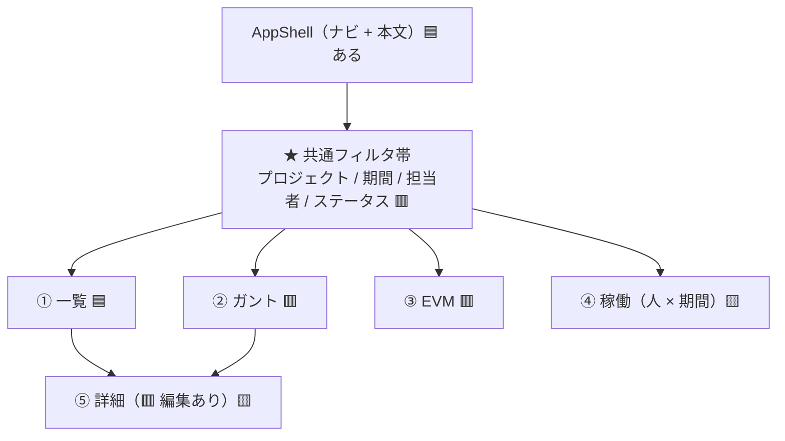
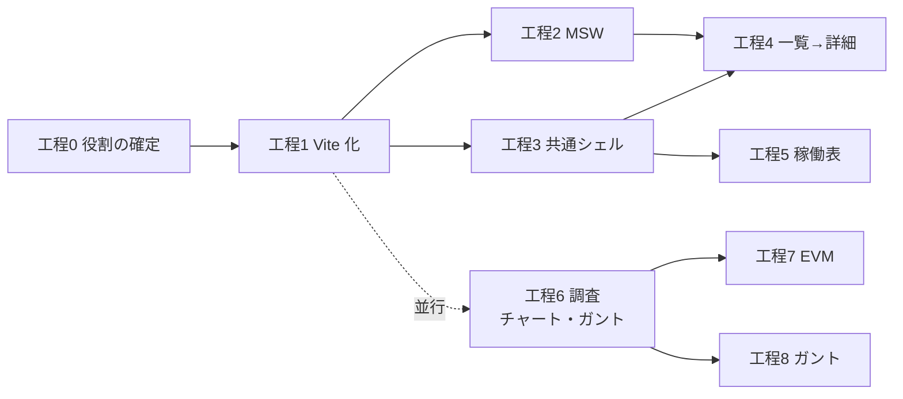

# UI 工場の段取り

> 作成日: 2026-08-07 ／ **本 repo が何をする場所かの新しい正本。**
> 🟥 **[UI検証の位置づけと段取り.md](UI検証の位置づけと段取り.md)（手0〜手9）を置き換える。**
> 旧地図は**検証の記録**として残す（手0〜手8e は完了済み・DR 77 件の出どころ）。

## 0. 結論（6 行）

- 本 repo は **「他の開発でも使い回せる UI を作る工場」**になる。成果物は**部品と画面**、および**その作り方の決定**。
- 🆕 ★ **最終目的は「自分用コアデザインシステム」**（ユーザー判断 2026-08-07・[DR-0078](DR/DR-0078-repo-becomes-a-ui-factory-for-a-core-design-system.md)）——
  Redmine 固有の実装から抽象化した、複数 repo で使い回すスーパーセット。**Redmine の 5 画面は題材**（部品の需要を洗い出す役）。
- **PoC への移送（旧・手9）は捨てる。**PoC と切り離すので Next.js である理由も消える → **React + Vite のライブラリ**にする。
- 作る画面は **Redmine の 5 画面**（一覧 / 詳細 / ガント / EVM / 稼働表）。🟥 **閲覧だけでなく編集もある。**
- データは **MSW ＋ Storybook のカタログ**で整備する（実 API には繋がない）。
- **チャートとガントは素材源の調査工程を挟む**（shadcn 以来 2 つ目の外部依存を入れる判断になるため）。

### 0b. コアと題材 — 何が資産で何が口実か（🆕 2026-08-07・ユーザー指示）

```
コア（使い回す資産・スーパーセット）        題材（Redmine 固有）
① Tokens ── ② 部品 ── レイアウト・共通シェル   5 画面・Redmine のデータモデル・画面の組み立て
        ▲ 抽象化して昇格                     │ 部品の需要を供給
        └──────────────────────────────────┘
```

- **レイアウトもコアに含める**——共通シェル・フィルタ帯・Layout プリミティブなど「画面の骨格」を Redmine 固有にしない。
  コアが揃えば「今後作るサイトは全部パズル」がユーザーの狙い（🟥 仮説。検証は工程3〜8 と **2 つ目の使い回し先**で）。
- 出荷口は **git 依存（コード）＋ Claude Design（トークン・部品）**の 2 経路（[DR-0079](DR/DR-0079-ship-via-git-dependency-and-claude-design.md)）。
- 🟥 **「Redmine 固有 / コア」の判定規則はまだ無い**（既存の判定規則は素材層/製品層の境界用）。
  工程3 以降で固有物が最初に現れたときに立てる。

## 1. 検証から持ち越すもの・捨てるもの

| | 中身 | 扱い |
| --- | --- | --- |
| 🟦 **持ち越す** | ① Tokens 層（tmp-admin の値まで流し込み済み）／ 素材層 shadcn 18 件／ 製品層 15 件（Layout 7・DataGrid・StatusPill・Select・Link・Button・Sidebar）／ ③④（ListDetail・EmptyState・AppShell・AppProviders） | **1 行も書き直さない。**`src/components/**` は Next に依存していない（`next/` の import が 0 件） |
| 🟦 **持ち越す** | Storybook 41 story ＋ 観点カード ＋ 層の棚（[DR-0051](DR/DR-0051-storybook-organized-by-layer-with-viewpoint-cards.md)） | **画面カタログの器としてそのまま使う。**MSW もここに載る |
| 🟦 **持ち越す** | **Claude Design への同期経路**（31 部品登録済み・7 周実測済み） | ★ **工場の 3 番目の出荷口。**他所にない資産 |
| 🟦 **持ち越す** | DR 77 件・OBS 13 件・機械ゲート・trace の作法 | 🟥 ただし全 DR の `poc_feedback` の**行き先を決め直す**（工程0） |
| ✂ **捨てる** | 旧・**手8f**（8 周目・手順書だけ書いて 1 周も打っていない）／ 旧・**手8b**（preset 差し替え）／ 旧・**手9**（PoC への移送） | **周回実験をやめるので、床の測定（手8f Q1）も不要になった** |
| ✂ **捨てる** | Next.js（`src/app/**`・`next build` ゲート）／ `tools/dts-alias.mjs` ＋ `tsconfig.dts.json` の継ぎ木 | 🟦 **継ぎ木は Vite の lib モードで消える**（工程1） |

### なぜ Vite なのか（実測 4 件）

1. **部品は Next に 1 行も依存していない**——`src/components/**` の `next/` import が **0 件**
2. **Storybook はもう Vite で動いている**——`@storybook/nextjs-vite` ＋ `vite` が既に入っている
3. ★ **`/design-sync` の converter は `dist/` を要求していて `next build` の成果物を一切見ていない**——
   `.design-sync/config.json` の `buildCmd` は `pnpm build:types` だけ。
   🟥 **手6 でここが原因の「対象 0 件で緑」を 2 回踏み**、対処に `dts-alias.mjs` を自作した＝**Next アプリのままライブラリのふりをするための継ぎ木**
4. ★ **`next build` はゲート 6 本の中で `src/app/` の 2 ファイルしか見ていない**——部品 33 件を検査しているのは `tsc` と `eslint`

## 2. 作る画面と、そこから逆算した部品



★ **4 ビューは同じチケットデータの別の見方**。だから**共通シェル＋フィルタ帯＋期間セレクタが最大の再利用資産**で、
ここを先に作ると 4 画面が同時に立ち上がる。後回しにすると同じものを 4 回書く。

### 足りない部品は性質が 3 種類に割れる

| 種別 | 中身 | 判断の重さ |
| --- | --- | --- |
| **(a) shadcn にある** | Tabs / Textarea / Calendar / Form / Avatar / Progress / Breadcrumb / Sonner / RadioGroup / Switch | 🟦 **入れるだけ**（手1 と同じ手口） |
| **(b) 🟥 外部ライブラリが要る** | **チャート**（EVM）・**ガント** | 🟥 **shadcn 以来 2 つ目の素材源を入れる判断。**工程6 で調査する |
| **(c) 自作の製品層** | 共通フィルタ帯 / 期間セレクタ / DescriptionList / Timeline / 稼働ピボット / 指標タイル | 🟨 [判定規則](製品層の部品設計.md) にかける（① 語彙で表せるか → ② 誰の責務か） |

🟥 **(b) が一番重い。**shadcn は「コードを自分の repo に持つ」モデルなので素材層 18 件を無変更で抱えられているが、
チャートライブラリは**コードを持たない依存**なので [DR-0072](DR/DR-0072-no-passthrough-of-dependency-types.md)（依存の型を公開 API に素通ししない）が効く。

## 3. 工程（全 9）

> **`step` の語彙は `手0`〜`手9`（＋ 1 文字の枝番）に固定されている**（`.claude/trace.config.mjs`）。
> **工程0 で `工程N` を語彙に足す**（1 行の設定変更）。それまでの文書は `step: '-'` で書く。

| # | 工程 | 重さ | 効く画面 | 前提 |
| --- | --- | --- | --- | --- |
| **0** | **役割の確定**（記録だけ・コードは触らない） | 軽 | — | いま |
| **1** | **土台の入れ替え**（Next → Vite） | 中 | 全部 | 工程0 |
| **2** | **データの器**（MSW ＋ データモデル） | 中 | 全部 | 工程1 |
| **3** | ★ **共通シェル**（Tabs・フィルタ帯・期間セレクタ・Breadcrumb） | 中 | **4 画面** | 工程1 |
| **4** | **一覧 → 詳細**（🟥 編集を含む） | 重 | ①⑤ | 工程2・3 |
| **5** | **稼働表**（ピボット） | 中 | ④ | 工程3 |
| **6** | **調査 — チャートとガントの素材源** | 中 | ②③ | 🟦 **工程3〜5 と並行できる** |
| **7** | **EVM** | 重 | ③ | 工程6 |
| **8** | **ガント** | 最重 | ② | 工程6 |



★ **最短で画面が見えるのは工程3 の終わり**——新しい土台の上でチケット一覧が動く。

---

### 工程0 — 役割の確定（記録だけ）

**目的**: repo の役割が変わったことを記録し、宙に浮く決定を始末する。**コードは 1 行も触らない。**

| 答えを出す問い | |
| --- | --- |
| **Q1** | 旧地図が前提にしていた決定のうち、**何件が成立しなくなるか** |
| **Q2** | 全 DR（77 件）の `poc_feedback` の行き先をどうするか（PoC が消えるので**77 件全部の出口が無くなる**） |

**成果物**: 新 DR 2〜3 本（役割変更・DR-0002 の supersede・DR-0003 の supersede）／ `CLAUDE.md` の書き換え／
`.claude/trace.config.mjs` の `step` 語彙に `工程N` を追加／ 本書を正本ポインタの先頭へ／ handoff の更新。

**判断ポイント**（✅ **全件決着・2026-08-07**。詳細は [実行記録 §工程0](実行記録.md)）

| # | 論点 | 決定 |
| --- | --- | --- |
| D1 | [DR-0002](DR/DR-0002-verify-three-layers-not-screens.md)「検証対象は画面ではなく 3 層。画面は口実」をどうするか | ✅ **supersede した**（[DR-0078](DR/DR-0078-repo-becomes-a-ui-factory-for-a-core-design-system.md)）。ただし**単純な反転ではない**——ユーザー指示により**目的はコアデザインシステム**で、画面は「出荷物になった題材」。**資産の主が 3 層であることは残る** |
| D2 | [DR-0003](DR/DR-0003-foundation-mirrors-poc.md)「PoC と同一版・同一 lint」——依存を厳密ピンする根拠が消える | ✅ **ピンは残し理由を書き直した**（[DR-0080](DR/DR-0080-strict-pins-stay-for-reproducibility.md)・推奨どおり） |
| D3 | `poc_feedback` フィールドの行き先 | ✅ **「工場の規約へ」に読み替え**（[DR-0081](DR/DR-0081-poc-feedback-redirected-to-factory-conventions.md)・推奨どおり）。フィールド名・既存 77 件は書き換えない |
| D4 | 配布形態（npm publish / git 依存 / Claude Design のみ） | ✅ **git 依存 ＋ Claude Design**（[DR-0079](DR/DR-0079-ship-via-git-dependency-and-claude-design.md)）。ユーザー指示「他のリポジトリでも使えるように Claude Design にデザイントークンとして残す」と推奨が一致。publish は使い回し先が 1 つ出てから |
| D5 | 🟥 画面をどこに置くか（Storybook の ④ Templates だけ / ＋ Vite の playground SPA） | ✅ 🟨 **まず Storybook だけ**（推奨どおり・Claude 判断）。複数画面の行き来が要ると分かった時点で playground を足す |

---

### 工程1 — 土台の入れ替え（Next → Vite）

**目的**: `next` を外し、**Vite のライブラリ（lib モード）** にする。部品は 1 行も書き直さない。

| 答えを出す問い | |
| --- | --- |
| **Q1** | 🟥 ★ **`next build` が持っていた検査の射程を、新しいゲートが全部持つか。**取りこぼしはどこか |
| **Q2** | **部品 33 件を 1 行も触らずに移行できるか**（`'use client'` ディレクティブ・`components.json` の `rsc: true`） |
| **Q3** | 🟦 **`build:types` ＋ `dts-alias.mjs` の継ぎ木は本当に消えるか**（`vite-plugin-dts` 等で `@/` が解決されるか） |
| **Q4** | **`/design-sync` は移行後も通るか**（converter が要求するのは `dist/` なので**むしろ素直になるはず**） |
| **Q5** | 機械ゲートの**新しいベースライン**は何件になるか |

🟥 **この工程の最大のリスクは「ゲートが緑になったのに、実は何も見ていない」**——
本 repo は「対象 0 件で緑」を **16 例**踏んでいる。**赤テストを先に置く**（わざと壊した部品で `vite build` と `tsc` が赤くなることを確認してから移行する）。

**成果物**: `vite.config.ts`（lib モード）／ `package.json` の scripts 入れ替え／ `.storybook/main.ts` を `react-vite` へ／
`src/app/**` の始末（`globals.css` / `tokens.css` の置き場を決める）／ **新しいゲートのベースライン表**。

**判断ポイント**

| # | 論点 | 推奨 |
| --- | --- | --- |
| D1 | ゲートの構成（`next build` を何に置き換えるか） | **`vite build`（lib）＋ `tsc --noEmit` ＋ 型出力。**6 本の本数は維持 |
| D2 | `src/app/globals.css` / `tokens.css` の移動先 | **`src/styles/` へ。**shadcn の `components.json` の `css` も追随させる |
| D3 | `components.json` の `"rsc": true` | **false へ。**🟥 ただし**追加インストールの挙動は実測する**（部品が変わって降ってくる可能性） |
| D4 | `'use client'` ディレクティブを剥がすか | **残す。**将来 Next で使い回すときに要る。Vite では無害 |
| D5 | Tailwind の配線（`@tailwindcss/postcss` → `@tailwindcss/vite`） | **vite プラグインへ。**🟥 [DR-0026](DR/DR-0026-judge-on-storybook-side.md)（本体と Storybook で CSS パイプラインが 2 本）が**1 本に揃う**ので、判定基準を見直す |

---

### 工程2 — データの器（MSW ＋ データモデル）

**目的**: 5 画面ぶんのデータを **MSW のハンドラ**として持ち、Storybook から使えるようにする。

| 答えを出す問い | |
| --- | --- |
| **Q1** | ★ **EVM とガントに必要なデータの形は何か**（🟥 **これが決まらないと画面の作りが決まらない**） |
| **Q2** | 🟥 **編集（POST / PUT）のモックで、Storybook 上に状態が残るか。**残らないなら編集の見た目しか作れない |
| **Q3** | Redmine の実 API に将来繋ぐとき、**ハンドラのどこが書き換わるか**（＝ 実 API 非依存に作れているか） |

**成果物**: `src/mocks/`（handlers・データ生成）／ `msw-storybook-addon` の配線／
**データモデルの文書**（チケット・プロジェクト・ユーザ・作業時間・EVM 系列・依存関係）。

**判断ポイント**（✅ **全件決着・2026-08-07**。D4 以降は[手順書 §2](手順/工程2_データの器_MSWとデータモデル.md) で 13 件まで増えた）

| # | 論点 | 決定 |
| --- | --- | --- |
| D1 | データモデルを Redmine の実スキーマに寄せるか、画面から必要な形だけ作るか | ✅ **寄せる ＋ 2 層に割った**（API 表現 = snake_case ／ 画面の型 = camelCase、境界に変換関数 1 本）。**Q3 を測れる形にするための設計** |
| D2 | EVM の計算をどこでやるか（モック側で計算済みを返す / 画面側で計算する） | ✅ **先送り（推奨どおり）。**ただし**素材が取れる形になっていること**までは確認した。🟥 PV は Redmine に無いので**モックは返さない**（[DR-0086](DR/DR-0086-redmine-has-no-baseline-for-evm.md)） |
| D3 | 編集の状態保持（MSW のインメモリ / Storybook の `play` で完結） | ✅ **インメモリ（推奨どおり）。Q2 = yes** で実測済み（PUT → 取り直しで 4 項目が動いた） |
| ★ D4 | 🆕 **取得の層を誰が持つか**（手順書で追加。**この工程の本体**） | ✅ **題材の層だけが持つ。コアは知らない**（[DR-0087](DR/DR-0087-fetching-belongs-to-the-subject-layer.md)）。lint 2 本で機械化・赤テスト済み |

---

### 工程3 — 共通シェル ★ ここが工場の芯

**目的**: **4 画面に同時に効く**シェルを作る。Tabs・フィルタ帯・期間セレクタ・Breadcrumb。

| 答えを出す問い | |
| --- | --- |
| **Q1** | ★ **フィルタ帯は「部品」になるか、「画面ごとの組み立て」になるか**（判定規則の ①→②） |
| **Q2** | **期間セレクタの語彙は何か**（今週 / 今月 / 四半期 / 任意範囲）。**トークン語彙と同じ形で閉じられるか** |
| **Q3** | 🟦 **新しく足した (a) の shadcn 部品は、既存 18 件と同じく無変更で入るか**（8 手連続 0 行の記録が続くか） |

**成果物**: shadcn 追加（Tabs ほか）／ 製品層の新部品／ story ／ **チケット一覧が新土台で動く**。

---

### 工程4 — 一覧 → 詳細（🟥 編集を含む）

**目的**: 詳細画面を作る。**閲覧と編集の両方。**

| 答えを出す問い | |
| --- | --- |
| **Q1** | 🟥 ★ **編集の状態管理を誰が持つか**（部品 / 画面 / hook）。**工場としてここを決めないと、使い回すたびに違う形になる** |
| **Q2** | **バリデーションの語彙をどこに置くか**（型 / スキーマ / 部品の props） |
| **Q3** | **DescriptionList と Timeline は部品になるか**（判定規則） |
| **Q4** | 🟨 **編集で「見た目の選択」がどれだけ増えるか**——閲覧専用だった 7 周では出なかった逸脱が出るはず |

🟥 **この工程が一番重い。**フォーム・バリデーション・保存の状態は、**部品ライブラリの設計思想が最も割れるところ**。

**判断ポイント（先に決める）**

| # | 論点 | 推奨 |
| --- | --- | --- |
| D1 | フォームの土台（shadcn の `Form` ＝ react-hook-form ＋ zod / 自前） | 🟨 **shadcn の Form。**ただし**外部依存 2 件（rhf・zod）が増える**ので (b) と同じ判断が要る |
| D2 | 楽観更新をやるか | **やらない**（MSW なので即時。実 API で必要になってから） |
| **D3** | 🆕 🟥 **`/design-sync` の `cfg.entry` を `src/index.ts` → `dist/design.mjs` に倒すか**（`.design-sync/NOTES.md` 見張り #19） | 🟨 **倒さない（据え置き）を推奨。**理由は下記 |

**D3 の背景**（2026-08-08 の同期で立った・[実行記録 §/design-sync 再同期（工程3 後）](実行記録.md)）

工程1 で `dist/design.mjs` が実在するようになり、**converter に「本物の dist」を渡す選択肢が生まれた**。
skill は「顧客がビルドした dist を出せ」と言うが、現状は `src/index.ts` を converter 側がバンドルしている。

🟥 **これは出荷物の由来が変わる判断**で、[DR-0091](DR/DR-0091-claude-design-is-a-fourth-shipping-entrance.md)（Claude Design は 4 本目の出荷入口）と噛み合う:

- 倒すと、4 本目の入口が **3 本目までと同じ `dist` を見る**ことになる＝**入口が 4 本から実質 2 系統に減る**
- 🟥 **ただし判定軸は `title` のまま**（何がカードになるかは story が決める）。**「dist を渡す」と「境界が守られる」は別**
- 🟥 **倒すと `'use client'` が消える問題（[DR-0083](DR/DR-0083-lib-build-silently-strips-use-client.md)）を出荷物に持ち込む**。今は converter が src からバンドルするので回避できている
- 🟨 **倒すと `pnpm build` が同期の前提になる**（今は不要）。手順が 1 本増える

**この工程で決める理由**: 工程4 は編集を入れるので**題材 story が増え**、[DR-0091](DR/DR-0091-claude-design-is-a-fourth-shipping-entrance.md) の手当て（`titleMap`）が実際に要る最初の工程になる。
**出荷面の話をこの工程で 1 度に片付ける**（D3 と `titleMap` の機械化を同じ場所で判断する）。

---

### 工程5 — 稼働表（ピボット）

**目的**: 人 × 期間の表。**DataGrid の延長で届くか、別部品かを決める。**

| 答えを出す問い | |
| --- | --- |
| **Q1** | ★ **`DataGrid` を拡張するか、`PivotTable` を新設するか**（列が動的に生える形は既存 API で表せるか） |
| **Q2** | **濃淡（ヒートマップ）はトークン語彙で表せるか**——[指摘 8](共通コンポーネント思想への指摘.md)（① 層は「値の作り方」を分類しない）が再び出るはず |

---

### 工程6 — 調査: チャートとガントの素材源（C=挟む）

**目的**: 🟥 **shadcn 以来 2 つ目の素材源を入れる判断を、調査に基づいて行う。**手8c と同じ形。

| 答えを出す問い | |
| --- | --- |
| **Q1** | ★ **チャートは何を採るか**（Recharts / visx / ECharts / D3 直 / 自作 SVG）。**判定軸はトークンで色と書式を支配できるか** |
| **Q2** | ★ **ガントは既製品か自作か。**既製品なら見た目の管轄権を渡すことになる（[DR-0070](DR/DR-0070-product-layer-boundary-rule.md) の原理と正面衝突する） |
| **Q3** | 🟥 **コードを持たない依存を、`/design-sync` の converter は運べるか**（バンドルに入るか・`.d.ts` が出るか） |
| **Q4** | **既存 DS 8 本はチャートをどう扱っているか**（手8c の調査対象がそのまま使える） |

**成果物**: 調査文書 ＋ 選定の DR ＋ **部品の設計（props シグネチャまで）**。手8c と同じ粒度。

🟥 **Q2 が本質的に難しい。**ガントの既製品は見た目を自分で持つので、
「素材層は見た目を決めない層」という**この repo の層の原理が成立しなくなる**可能性がある。

---

### 工程7 — EVM ／ 工程8 — ガント

工程6 の設計に従って実装する。**問いは工程6 で立てる**ので、ここでは手順書を書く段になってから定義する。

🟨 **ガントを最後に置くのは、他の 4 画面と共有部品が 1 つも無いから。**
時間軸ヘッダ・バー・依存線・横スクロール同期・今日線は、ガント専用。

## 4. 規律（検証から引き継ぐもの）

- **手順書を書く → 問いを確定させる → 実行する。**問いが立っていない工程は実行しない
- **緑を信用しない。**赤テストでゲートが発火することを確かめる（「対象 0 件で緑」は通算 **16 例**）
- **赤は ignore で消さない。**内訳がベースライン
- **実行中に手順書 §2 に無い選択肢が出たら、その場で決めずに §2 へ追記してから進む**
- 🆕 **「まだ作らない」と決めるときは理由を書く。回数は理由にならない**（[DR-0077](DR/DR-0077-abolish-the-two-occurrence-rule.md)）
- **`docs/共通コンポーネント思想.md` はユーザーの持ち物。**指摘は DR / OBS へ

## 5. 未決（この段取りを書いた時点）

| # | 論点 | いつ決めるか |
| --- | --- | --- |
| ~~1~~ | ~~工程0 の D1〜D5~~ | ✅ **決着**（2026-08-07・[DR-0078](DR/DR-0078-repo-becomes-a-ui-factory-for-a-core-design-system.md)〜0081。上表） |
| ~~2~~ | ~~`/design-sync` を今後も回すか~~ | ✅ **決着——回し続ける**（[DR-0079](DR/DR-0079-ship-via-git-dependency-and-claude-design.md)・ユーザー指示 2026-08-07）。🟥 **工程1 Q4（converter が Vite 移行後も通るか）は「確認」から「出荷経路の維持条件」に格上げ** |
| 3 | 🟥 **ガントの既製品は層の原理と衝突しうる**（工程6 Q2）。衝突したら「素材層の定義」を広げるか、自作するか | 工程6 |
| 4 | 編集の状態管理の置き場（工程4 Q1）——**工場の思想に直結する** | 工程4 の着手前 |
| ~~5~~ | ~~旧 DR 77 件の `poc_feedback` の一括書き換えをやるか~~ | ✅ **決着——書き換えない**（[DR-0081](DR/DR-0081-poc-feedback-redirected-to-factory-conventions.md)） |
| ~~6~~ | ~~🟥 **「Redmine 固有 / コア」の判定規則**（§0b）~~ | ✅ **決着**（2026-08-08・工程3・[DR-0088](DR/DR-0088-core-subject-boundary-is-decided-by-two-questions.md)）。**判定は 2 問**（① 他所で意味が通るか ② 有限の語で言えるか）。候補「コアは語彙、題材は対応表」は**前半しか裁けなかった**（固有物 11 件の検算表が DR にある） |
| 7 | 🆕 **工場の規約文書（ui.md / architecture.md 相当）の起草時機**——材料は `poc_feedback` 非 null 64 件（[DR/index.md](DR/index.md) 末尾の表） | 使い回し先が 1 つ出たとき／DR の参照に不便が出たとき。工程3〜4 の締めで 1 度ずつ問う |
