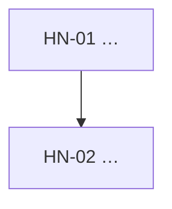

<!-- ============================================================
     手順書テンプレート（フォーマットの正本）

     出自: PoC の `docs/procedures/_template.md`（ステップの型・完了条件の機械ゲート・
           判断ポイント → 記録の導線）と、CC-Skills の phase ファイル（frontmatter の
           status / next_action による再開、リサーチ出典節）を合成したもの。

     PoC との違い（本 repo 固有）:
       1. 実行者が Claude（PoC は「人が手で実行し Claude は代行しない」）
       2. **§0「この手で答えを出す問い」が最上位** — 本 repo の目的は成果物ではなく観測。
          問いが無い手は、そもそもやる必要がない
       3. DR の仕組みを持たない（まだ 1 回目）。判断は §2 と各ステップの「判断」欄に書き、
          横断で読みたくなったら実行記録へ集める
       4. 実測は書かない。**手順書 = 計画と観測項目の定義／実行記録 = 実測結果**で責務を分ける
          （二重管理を避ける。結果は docs/実行記録.md 側にだけ置く）
     ============================================================ -->

# 手N — {手の名前}

> 段取り上の位置づけ: [UI検証の位置づけと段取り.md](../UI検証の位置づけと段取り.md) §5
> 実測の記録先: [実行記録.md](../実行記録.md) §手N

## 0. この手で答えを出す問い（観測項目）★最重要

> **ここが空なら、その手はやらなくてよい。**本 repo の成果物は部品ではなく「通った／通らなかった」の観測。
> 各問いは **yes/no か、有限個の選択肢に落ちる形**で書く（「うまくいくか」は問いではない）。

| # | 問い | なぜ効くか（どの判断が変わるか） |
|---|---|---|
| Q1 | | |
| Q2 | | |

## 1. 前提

- 直前の手: {手N-1 が done であること／その成果物}
- 版・ツール: {固定するバージョン}
- 参照: {思想・調査文書・外部ドキュメント}

## 2. 着手前に決めること（判断ポイント）

> **戻しにくい決定はここに全部出す。**実行中に気づくと手戻りになる。
> 決めずに進めてよいのは「後で覆せる」と明記できるものだけ。

| # | 論点 | 選択肢 | 決定 | 根拠 | 戻せるか |
|---|---|---|---|---|---|
| D1 | | | | | 🟦 戻せる / 🟥 不可逆 |

## 3. 成果物

- {この手が終わったとき、リポジトリに何が増えているか}

## 4. 作業フロー



## 5. 手順

### HN-01 {ステップ名}

- **目的**:
- **実行**:
  ```bash
  ```
- **期待結果**: {成功時に見えるもの。ファイル・出力・差分}
- **検証**: {何を確認したら次へ進んでよいか}
- **観測**: {§0 のどの問いに答える材料が出るか。Q番号で紐づける}
- **判断**: {ここで選択肢が生じるなら書く。無ければ「なし」}
- **詰まったら**: {既知の失敗と対処}

## 6. 完了条件

- [ ] 機械ゲート: `pnpm typecheck` / `pnpm lint` / `pnpm build` / `pnpm spell` が緑
      （**赤で終わってもよい。その場合は内訳と扱いが実行記録に書かれていること**）
- [ ] §0 の問いすべてに答えが出ている
- [ ] §2 の判断がすべて決着し、根拠が書かれている
- [ ] 実行記録に §手N の節が追加されている
- [ ] コミット済み（`<type>(HN): 要約 [手N]`）

## 7. 出典

- {一次情報の URL・取得日。二次情報しか無いものはそう明記する}
