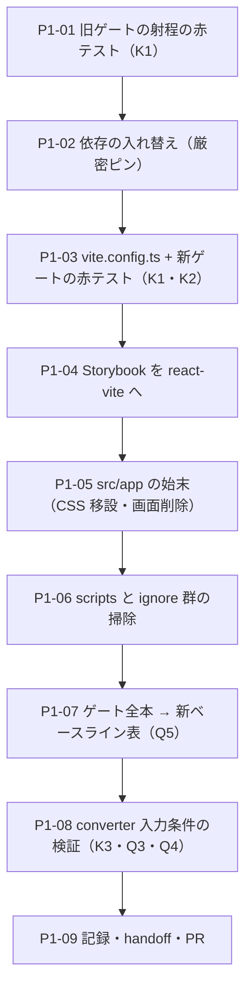

# 工程1 — 土台の入れ替え（Next → Vite）

> 段取り上の位置づけ: [工場の段取り.md](../工場の段取り.md) §工程1（工程0 の次・工程2 の前）
> 直前の工程: 工程0 done（**PR #7 マージ済み** `b7e9d3b`・[実行記録 §工程0](../実行記録.md)）
> 実測の記録先: [実行記録.md](../実行記録.md) §工程1

**この工程は部品を 1 行も書き直さない。**`next` を外し、**Vite のライブラリ（lib モード）**にする。
出荷口が git 依存 ＋ Claude Design に確定した（[DR-0079](../DR/DR-0079-ship-via-git-dependency-and-claude-design.md)）ので、
この repo に要るのは「アプリのビルド」ではなく**「ライブラリのビルド ＋ カタログ（Storybook）」**である。

🟥 **最大のリスクは「ゲートが緑になったのに、実は何も見ていない」**——本 repo は「対象 0 件で緑」を
**16 例**踏んでいる。しかも今回は**ゲートそのものを入れ替える**ので、新しいゲートの検査能力を
**先に赤テストで確定してから**移行する（§0.1）。とくに 🟥 **`vite build` は型検査をしない**（esbuild 変換のみ）
という公式仕様があり、**「next build を vite build に替えたら型の赤が消えて緑になった」は前進ではなく欠落**。

---

## 0. この工程で答えを出す問い（観測項目）★最重要

| # | 問い | なぜ効くか（どの判断が変わるか） |
| --- | --- | --- |
| **Q1** | 🟥 ★ **`next build` が持っていた検査の射程を、新しいゲートが全部持つか。取りこぼしはどこか** | ゲート構成（D1）の妥当性。工程0 の実測は「`next build` はゲート 6 本の中で `src/app/` の 2 ファイルしか見ていない」だが、**これは削除前に赤テストで確かめ直す**（P1-01）——`src/app` の外の型エラーを `next build` が拾うなら射程の見積もりが違っていたことになる。**取りこぼしが出たら新ゲートを足してから移行する** |
| **Q2** | **部品 33 件を 1 行も触らずに移行できるか**（`'use client'` ディレクティブ・`components.json` の `rsc: true`） | 「部品は Next 非依存」（工程0 の実測: `next/` の import 0 件）の**最終検証**。触らずに通れば、**git 依存の出荷物は Next でも Vite でも使える**ことの 1 例目になる。触ったら、その 1 行が**移植性の境界**の実測値 |
| **Q3** | 🟦 **`build:types` ＋ `dts-alias.mjs` の継ぎ木は本当に消えるか**（`vite-plugin-dts` 等で `@/` が解決されるか） | 手6 の継ぎ木（`tsconfig.dts.json` ＋ 後処理スクリプト）は**converter のためだけの二重ビルド**。消えれば「ビルド 1 本で JS も `.d.ts` も出る」が成立。判定は `grep -r "@/" dist/types` = **0 件** |
| **Q4** | 🟥 **`/design-sync` は移行後も通るか**（converter が要求するのは `dist/` なので**むしろ素直になるはず**） | **出荷経路の維持条件**（段取り 未決 #2 の決着で「確認」から格上げ）。converter の入力条件は実測済み——`buildCmd`（`.design-sync/config.json`）が通ること・`.d.ts` ツリーの PascalCase 値 export・Storybook ビルド。🟥 **実同期は人が打つ**ので、この工程で機械的に検証できるのは**入力条件まで**（P1-08）。同期本番は工程1 の完了条件に入れない |
| **Q5** | 機械ゲートの**新しいベースラインは何件になるか** | 次工程以降の「新しい赤」判定の基準。🟥 **旧ベースラインと突き合わせ、増減の 1 件ずつに説明を付ける**（説明できない減少は「対象 0 件で緑」の疑い） |

> **Q1 と Q5 が本体。**Q2・Q3 は移行の副検証、Q4 は出荷経路の維持条件。
> 🟥 **この工程では部品も語彙も動かさない。**工程3 以降の材料になる気づきは OBS へ。

### 0.1 赤テストの設計（🟥 移行スイッチを入れる前に打つ）

検体は 3 種。**網ごとに「赤になるはず／緑でも構わない」を先に宣言し、外れたら Q1 の答えに数える。**

| 検体 | 中身 | `next build`（旧・P1-01） | `tsc --noEmit` | `vite build`（新・P1-03） | `vite-plugin-dts` |
| --- | --- | --- | --- | --- | --- |
| **K1** | 部品（`src/app` の外）に型エラー 1 行 | 🟨 **予想: 赤**（Next は build 時に全体を型検査する）——緑なら工程0 の「2 ファイルしか見ていない」がさらに狭かった証拠 | 🟥 赤になるはず | 🟨 **予想: 緑**（esbuild は型を見ない）——**緑でも欠落ではない**。型の網は `tsc` が持つと D1 で宣言する | 🟥 **赤になるはず**（宣言が出せない）。🟨 緑なら型の網は `tsc` 1 本だけ＝ベースライン表に明記 |
| **K2** | 部品に実在しない import 1 行 | — | 🟥 赤になるはず | 🟥 **赤になるはず**（バンドルが解決できない） | — |
| **K3** | （移行後）`dist/types` に `@/` が残っていないか | — | — | — | 🟥 `grep -r "from '@/" dist/types` **0 件**。1 件でもあれば継ぎ木は消えていない（Q3 = no） |

🟥 **各検体は「赤を確認 → 戻して緑を確認」まで 1 セット。**戻し忘れ防止に `git status` で終了確認する。
🟥 **`vite build` の緑は必ずログの数字で読む**（モジュール数・出力ファイル）——手6 の converter は
`exit 0` のまま `components: 0` を 2 回やっている（「対象 0 件で緑」11・12 例目）。

---

## 1. 前提

- **直前の工程**: 工程0 done（[実行記録 §工程0](../実行記録.md)・DR-0078〜0081）
- **ブランチ**: 現ワークスペースの作業ブランチ（Conductor）。完了したら `gh pr create --base main`。
  🟥 **マージは人**（[DR-0068](../DR/DR-0068-merge-through-pull-requests.md)）
- **依存は厳密ピン**（[DR-0080](../DR/DR-0080-strict-pins-stay-for-reproducibility.md)）。🟥 **新規依存も同じ**——版は
  推測で書かず `pnpm view <pkg> version` で実測してからピンする
- **環境の穴 2 つ**（[handoff §環境の再現](../handoff.md)）: ① `pnpm install` が `pnpm-workspace.yaml` の
  プレースホルダを生やす（**生えたら消す**。cspell の赤 1 件を実測済み）② mise が非対話シェルで効かない
  （`export PATH="$HOME/.local/share/mise/installs/node/24.18.1/bin:$PATH"`）

### 現況の配線（2026-08-07 実測。移行で動く箇所の全量）

| 箇所 | 現況 | 動かし先 |
| --- | --- | --- |
| `package.json` scripts | `dev`/`build`/`start` が next・`build:types` が継ぎ木 | D1・D8 |
| `src/app/**` | `layout.tsx`＋`page.tsx`（🟥 **`next/font` 参照はコメントのみ**・実 import 0）＋ CSS 4 本（`globals` / `tokens` / `tmp-admin` / `tmp-admin-override`） | D2・D6 |
| `src/components/**` ほか部品 33 件 | **`next/` の import 0 件**（工程0 実測・grep で再確認済み） | 触らない（Q2） |
| `.storybook/main.ts` | framework `@storybook/nextjs-vite` | D7 |
| story ほか **40 ファイル** | `import ... from '@storybook/nextjs-vite'`（型 import） | P1-04 で機械置換 |
| `.storybook/preview.tsx` | `import '../src/app/globals.css'` | D2 に追随 |
| `postcss.config.mjs` | `@tailwindcss/postcss` 1 プラグイン | D5 で廃止 |
| `components.json` | `rsc: true`・`css: src/app/globals.css` | D3・D2 |
| `.design-sync/config.json` | `buildCmd: "pnpm i --frozen-lockfile && pnpm build:types"` | D9 |
| `tsconfig.dts.json` ＋ `tools/dts-alias.mjs` | converter 用の宣言ビルド（継ぎ木） | Q3 で消す |
| `eslint.config.mjs` ほか ignore 群 | `**/.next/**` を除外 | P1-06 で掃除 |
| `src/app/globals.css` の `@source` | `@source not '../../docs'`（[DR-0021](../DR/DR-0021-tailwind-scans-docs-markdown.md)）——`src/styles/` へ移しても**相対の深さが同じ**なので書き換え不要の見込み。🟥 移設後に実測 | P1-05 |

## 2. 着手前に決めること（判断ポイント）

> D1〜D5 は [工場の段取り §工程1](../工場の段取り.md) の論点（推奨つき）。D6〜D10 は手順書起こしの実測で増えた分。
> 🟨 **決定はすべて推奨どおりの Claude 判断（事後承認待ち）**——全件 🟦 戻せる（git revert で戻る）ため。
> 異議があれば言ってほしい。実行中に §2 に無い選択肢が出たら、**その場で決めずにここへ追記してから進む**。

| # | 論点 | 選択肢 | 決定 | 根拠 | 戻せるか |
| --- | --- | --- | --- | --- | --- |
| D1 | ゲートの構成（`next build` の後継） | A: `vite build`（lib・dts 込み）に置き換え、6 本維持 ／ B: `vite build` ＋ 型出力を別ゲートに分けて 7 本 | **A** | 段取りの推奨。`vite-plugin-dts` を build に同居させれば「JS＋宣言」が 1 本で出る。🟥 ただし **`vite build` は型を見ない**ので、**型の網は `tsc --noEmit` ＋ dts が持つ**ことをベースライン表に明記する（K1 の実測が根拠になる） | 🟦 |
| D2 | CSS 4 本の移動先 | A: `src/styles/` ／ B: `src/app/` のまま残す | **A** | 段取りの推奨。`src/app` は Next の予約語なので、Next を捨てた repo に残すと**由来の分からないディレクトリ**になる。`components.json` の `css` と `.storybook/preview.tsx` を追随させる | 🟦 |
| D3 | `components.json` の `rsc` | A: false へ ／ B: true のまま | **A（false）** | 段取りの推奨。🟥 **追加インストールの挙動（部品が変わって降ってくるか）はこの工程では測れない**——この工程は shadcn add を打たないため。**工程3 Q3（新しい shadcn 部品の追加）で実測する**と申し送る | 🟦 |
| D4 | `'use client'` ディレクティブ | A: 残す ／ B: 剥がす | **A（残す）** | 段取りの推奨。将来 Next で使い回すときに要る（git 依存の出荷先は Next かもしれない）。Vite では無害。🟥 ただし **lib ビルドで Rollup が「module level directive」警告を出す可能性**があり、出たら**握りつぶさず件数をベースライン表に載せる** | 🟦 |
| D5 | Tailwind の配線 | A: `@tailwindcss/vite` プラグイン ／ B: `@tailwindcss/postcss` のまま | **A** | 段取りの推奨。[DR-0026](../DR/DR-0026-two-css-pipelines-differ.md)（CSS パイプラインが本体と Storybook で 2 本）が **1 本に揃う**——「見た目の正本は Storybook」の判定基準を見直す材料。`postcss.config.mjs` は廃止 | 🟦 |
| D6 | `src/app/layout.tsx`・`page.tsx`（一覧画面）の始末 | A: 削除（一覧は Storybook の story が持つ） ／ B: playground として残す | **A（削除）** | 工程0 D5 で「**画面はまず Storybook だけ**」と決着済み。一覧の形は `④ Templates/AppShell` story が持っており、工程3 で新土台の一覧を組み直す。🟥 **副作用が 1 つ**——`page.tsx` L129 の詳細シート（書式管轄の残り 1 件・handoff が監視中）が**画面ごと消える**。監視は「対象消滅で終了」と実行記録に書き、handoff の当該行を閉じる | 🟨 履歴には残るが、監視対象は消える |
| D7 | Storybook の framework | A: `@storybook/react-vite`（同版 10.5.4） ／ B: `nextjs-vite` のまま | **A** | `nextjs-vite` は next を peer に持つ側の framework。next を消す以上残せない。story 40 ファイルの型 import は**機械置換**（P1-04）。🟥 置換は部品ではなく story なので Q2 の「触らない」には抵触しない | 🟦 |
| D8 | `dev` script の行き先 | A: `storybook dev` に向ける ／ B: 削除 | **A** | 「開発サーバ＝カタログ」を scripts の形でも宣言する（D6 と同じ決定の反映）。`start` は削除 | 🟦 |
| D9 | converter の `buildCmd`（`.design-sync/config.json`） | A: `pnpm build` に書き換え、`build:types` を削除 ／ B: `build:types` の名前を残し中身だけ差し替え | **A** | 継ぎ木を消すのが Q3 の趣旨なのに、**名前だけ残すと「なぜこの alias があるのか」が次の読者に説明できない**。config.json は同期のたびに読まれるので、書き換えの検証は P1-08（入力条件の機械検証）で行う | 🟦 |
| D10 | `vite.config.ts` を Storybook と共有するか | A: 1 本を共有（react-vite は `vite.config.*` を自動で読む） ／ B: Storybook 用に viteFinal で分離 | **A で始める** | 設定 2 本はドリフトの温床（DR-0026 の教訓）。🟥 **lib モードの `build.lib` が storybook build に漏れて干渉したら**、その実測を書いてから B へ切り替える | 🟦 |

## 3. 成果物

- `vite.config.ts`（lib モード・react・tailwindcss・dts）
- `package.json`: scripts 入れ替え（`dev`/`build` の後継・`start`/`build:types` の削除）・依存の入れ替え（すべて厳密ピン）
- `.storybook/main.ts` = `@storybook/react-vite`・story 40 ファイルの型 import 置換
- `src/styles/`（CSS 4 本の新居）・`src/app/**` の削除・`components.json` 追随
- `tsconfig.dts.json`・`tools/dts-alias.mjs`・`postcss.config.mjs` の削除
- `.design-sync/config.json` の `buildCmd` 更新
- **新しいゲートのベースライン表**（handoff）＋ [実行記録 §工程1](../実行記録.md)

## 4. 作業フロー

## 5. 手順

### P1-01 旧ゲートの射程の赤テスト（🟥 next build がまだ在るうちに）

- **目的**: 「`next build` は `src/app/` の 2 ファイルしか見ていない」（工程0 実測）を、**捨てる前に**検体で確かめる。
- **実行**: K1（`src/components/` の部品 1 つに型エラー 1 行）を入れて `./node_modules/.bin/next build`。赤/緑と、赤ならどのファイルを指すかを記録。戻して緑確認。
- **観測**: Q1。🟥 **ここで「next build が src/app の外も型検査していた」と出たら、D1 の「型の網は tsc ＋ dts」宣言が正しいことを K1 の新ゲート側（P1-03）で必ず確認してから消す**。
- **判断**: なし（観測のみ）。

### P1-02 依存の入れ替え

- **目的**: 新規 4 件を厳密ピンで入れ、next 系 3 件を消す。
- **実行**:
  1. `pnpm view` で実測: `@vitejs/plugin-react`・`vite-plugin-dts`（最新）・`@tailwindcss/vite`（tailwindcss 4.3.3 と同版があるか）・`@storybook/react-vite`（10.5.4）
  2. `pnpm add -D -E` で追加 → `pnpm remove next @storybook/nextjs-vite @tailwindcss/postcss`
  3. 🟥 **穴 ① の確認**: `pnpm-workspace.yaml` が生えていたら消す
- **期待結果**: lockfile 差分が追加 4 件・削除 3 件とその推移的依存だけ。
- **詰まったら**: `@tailwindcss/vite` に 4.3.3 が無い場合は **tailwindcss 本体と同版に揃う版**を選び、根拠を実行記録へ。

### P1-03 vite.config.ts と新ゲートの赤テスト

- **目的**: lib モードの配線と、**新しい網の検査能力の確定**（§0.1）。
- **実行**: `vite.config.ts` を作成——`build.lib`（entry `src/index.ts`・ESM）・`external`（react / react-dom / 依存パッケージ）・`plugins: [react(), tailwindcss(), dts()]`（dts は `tsconfigPath` で `@/` 解決・`outDir: dist/types`）。K1・K2 を打つ（表 §0.1 の宣言と突き合わせ）。
- **期待結果**: K2 で `vite build` 赤。K1 で dts 赤（緑なら D1 の注記をベースライン表へ）。**緑の確認はログのモジュール数と `ls dist` で行う**。
- **観測**: Q1・Q3 の前半。
- **詰まったら**: `vite-plugin-dts` が `@/` を解決しない場合は `resolve.alias` ＋ dts の `pathsToAliases` を実測。**それでも残るなら Q3 = no として旧継ぎ木を残す**（消すのを諦める判断も答え）。

### P1-04 Storybook を react-vite へ

- **目的**: framework の付け替え。story の描画を落とさない。
- **実行**: `.storybook/main.ts` の framework 変更 → 40 ファイルの `@storybook/nextjs-vite` → `@storybook/react-vite` を機械置換（`grep -rl | xargs sed`）→ `storybook build`。
- **期待結果**: build 緑・story 数 41 のまま。🟥 **緑は描画を保証しない**（[DR-0048](../DR/DR-0048-build-storybook-does-not-render.md)）ので、`storybook dev` で `④ Templates/AppShell` と `★ Review` を目視 1 周（豆腐・素の HTML 化がないか）。
- **観測**: Q2（部品 diff 0 行のまま通るか）。

### P1-05 src/app の始末

- **目的**: CSS 4 本を `src/styles/` へ、画面 2 ファイルを削除。
- **実行**: `git mv src/app/*.css src/styles/` → `.storybook/preview.tsx` と `components.json` のパス追随・`rsc: false`（D3）→ `git rm src/app/layout.tsx src/app/page.tsx` → `@source` の効きを実測（docs 由来のクラスが CSS に混入しないこと・`w-field-*` が出続けること。[実行記録 §H7-08](../実行記録.md) の赤テストを再演）。
- **観測**: Q2。D6 の副作用（監視対象の消滅）を実行記録に書く。

### P1-06 scripts と ignore 群の掃除

- **目的**: `package.json`・`eslint.config.mjs`・`.gitignore`・`.prettierignore`・`cspell` から Next の痕跡を消す。
- **実行**: scripts（`dev`→storybook・`build`→`vite build`・`start`/`build:types` 削除）→ `tsconfig.json` の Next plugin/`.next` 参照を掃除 → `tsconfig.dts.json`・`tools/dts-alias.mjs`・`postcss.config.mjs` 削除 → `.design-sync/config.json` の `buildCmd` を `pnpm i --frozen-lockfile && pnpm build` へ（D9）→ ignore 群の `.next` 行を削除。
- **検証**: `grep -rn "next" package.json tsconfig.json eslint.config.mjs` で残存 0（コメント内の経緯記述は残してよい）。

### P1-07 ゲート全本 → 新ベースライン表

- **目的**: Q5。
- **実行**: 6 本を直接叩く（環境の穴 ② に注意）: `tsc --noEmit` / `eslint .` / `vite build` / `prettier --check .` / `cspell --no-progress --gitignore "**"` / `storybook build`。lint は内訳まで取る（handoff のコマンド）。
- **期待結果**: 🟥 **旧表との差分 1 件ずつに説明を付ける。**とくに lint error 33 の増減（`src/app/page.tsx` が消えると任意値の内訳が動くはず）と、`exactOptionalPropertyTypes` の借金（DR-0014）が**この工程で返せるか**を確認する——Next の制約で false にした設定なら、Next が消えた今 true に戻せるかを試し、結果だけ記録する（戻すかどうかは別判断）。
- **観測**: Q1・Q5。

### P1-08 converter 入力条件の検証

- **目的**: Q3・Q4 の機械側。実同期（人）の前に、converter が読む入力がすべて揃っていることを検証する。
- **実行**: ① `pnpm build` で `dist/` 再生成 → ② K3（`grep -r "from '@/" dist/types` = 0 件）→ ③ `.d.ts` ツリーの PascalCase 値 export を数え、`componentSrcMap` の 33 件と突き合わせ → ④ `buildCmd` をそのまま 1 回通す → ⑤ `storybook build` が `storybookConfigDir: .storybook` で通ること（P1-07 で済んでいれば省略）。
- **期待結果**: export 33 件一致・`@/` 0 件・buildCmd exit 0（🟥 **数字まで読む**）。
- **観測**: Q3・Q4。🟥 **実同期は工程1 の完了条件に入れない**（人の操作。次の同期時に Q4 の最終確認が取れる）。

### P1-09 記録・handoff・PR

- **目的**: 責務分離どおりに書き分けて締める。
- **実行**: 実行記録 §工程1（実測のみ）→ handoff（現在地・ベースライン表・「環境の再現」の起動コマンド・次にやること＝工程2）→ 本手順書 status を done → DR が要る発見があれば `/dr` → `gh pr create --base main`。
- **判断**: 🟥 **マージは人**。

## 6. 完了条件

- [ ] §0 の Q1〜Q5 に答えが出ている（Q4 は「入力条件まで」で可・実同期は人）
- [ ] 赤テスト K1〜K3 が「赤 → 戻して緑」まで記録されている
- [ ] ゲート 6 本の新ベースライン表が handoff にあり、旧表との差分に全件説明が付いている
- [ ] 部品 33 件の diff が 0 行（Q2 = yes の場合）。0 行でないなら、その行が実行記録に書かれている
- [ ] `src/app/**`・`tsconfig.dts.json`・`tools/dts-alias.mjs`・`postcss.config.mjs` が消えている
- [ ] 実行記録 §工程1 が追加され、本手順書は計画のまま（実測を書き込まない）
- [ ] PR 作成済み（マージは人）

## 7. 出典

- Vite lib モード: <https://vite.dev/guide/build#library-mode>（取得 2026-08-07）
- `vite build` が型検査をしないこと: <https://vitejs.dev/guide/features#typescript>（transpile only の明記。取得 2026-08-07）
- vite-plugin-dts: <https://github.com/qmhc/vite-plugin-dts>（取得 2026-08-07）
- @tailwindcss/vite: <https://tailwindcss.com/docs/installation/using-vite>（取得 2026-08-07）
- @storybook/react-vite: <https://storybook.js.org/docs/get-started/frameworks/react-vite>（取得 2026-08-07）
- 🟥 **上記はいずれも二次情報になり得る**（公式ドキュメントも古くなる——実例 [DR-0006](../DR/DR-0006-shadcn-base-radix-preset-nova.md)）。版・挙動は P1-02／P1-03 の実測が正。
