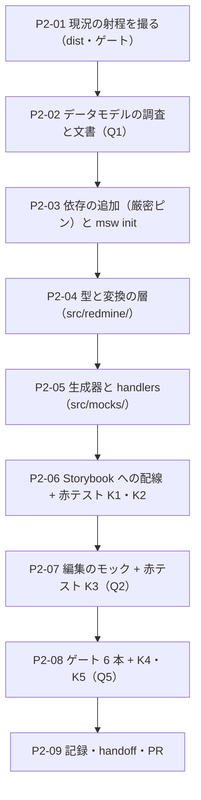

# 工程2 — データの器（MSW ＋ データモデル）

> 段取り上の位置づけ: [工場の段取り.md](../工場の段取り.md) §工程2（工程1 の次・工程3/4 の前）
> 直前の工程: 工程1 done（**PR #8 マージ済み** `c8fefc6`・[実行記録 §工程1](../実行記録.md)）
> 実測の記録先: [実行記録.md](../実行記録.md) §工程2

**この工程は 5 画面ぶんのデータを「器」として用意する。**部品（33 件）は 1 行も触らない。

🟥 **着手前に効いている事実が 1 つある**——**この repo には取得（fetch）が 1 件も無い。**
`src/**` の `fetch(` は 0 件、`useEffect` は `use-mobile.ts` と shadcn の `sidebar.tsx` だけ。
部品はすべて props で受ける純表示で、唯一のデータは `src/lib/fixtures/issues.ts`（**6 行・6 フィールド**、
手4 D1=A の「使い捨ての手書き」）を story が直接 import している。
**つまり MSW を入れるとは「モックを足す」ことではなく、この repo に無かった「取得の層」を新設すること。**
その層がコア（出荷物）なのか題材（Redmine 固有）なのかは決まっていない（[段取り 未決 #6](../工場の段取り.md)）。
→ **§0 Q4 がこの工程の本体になる。**

---

## 0. この工程で答えを出す問い（観測項目）★最重要

| # | 問い | なぜ効くか（どの判断が変わるか） |
| --- | --- | --- |
| **Q1** | ★ **EVM とガントに必要なデータの形は何か。Redmine の実スキーマから導出できない項目はどれか** | 🟥 **これが決まらないと画面の作りが決まらない**（段取り §工程2 Q1）。答えの本体は**欠落の一覧**——EVM の PV（計画価値）は「日次の計画」を要求するが、Redmine のチケットが持つのは `start_date` / `due_date` / `estimated_hours` / `done_ratio` の 4 つで、**日次系列も基準計画（ベースライン）も無い**。導出規則を工程2 で決めるか工程7 へ送るかが、工程6（チャート素材源）の調査項目にも波及する |
| **Q2** | 🟥 **編集（POST / PUT）のモックで Storybook 上に状態が残るか** | 残らないなら**編集の「見た目」しか作れない**（段取り §工程2 Q2）。工程4（一覧 → 詳細・編集あり）が最重の工程なので、ここが no だと工程4 の設計が変わる（play 関数で完結させる形になる） |
| **Q3** | **実 API に将来繋ぐとき、ハンドラのどこが書き換わるか**（＝ 実 API 非依存に作れているか） | 答えを「**変換関数 1 本だけ**」に設計できるかの検証（D1）。書き換え箇所が画面側に散るなら、モックは実 API の練習になっていない |
| **Q4** | 🆕 ★★ **取得の層を誰が持つか。そしてそれはコアか題材か** | **工場の思想に直結する。**部品 33 件は 8 手連続で「props だけ」を守ってきた（素材層の diff 0 行が 6 回連続）。ここで取得をコアに入れると、**出荷物が Redmine の URL 形状を知ることになる**。🟥 [段取り 未決 #6](../工場の段取り.md)（「Redmine 固有 / コア」の判定規則）は「工程3 以降・固有物が最初に現れたとき」に立てる予定だったが、**固有物はこの工程で現れる**（データモデルそのもの）。工程2 で**暫定規則**を置き、本規則の起草は工程3 に残す |
| **Q5** | 🆕 **MSW を足すとゲートの射程は漏れるか／出荷物 `dist/` に題材が混ざるか** | ① [DR-0040](../DR/DR-0040-frame-leaks-when-a-layer-is-added.md)（層を足すたびに射程が漏れる）の再演を数える——`msw init` が置く `public/mockServiceWorker.js` は**数千行の生成物**で、cspell / prettier / eslint の射程に入る。②🟥 **`vite.config.ts` の dts は `include: ['src']` で閉じており、JS バンドルの「entry からの到達可能性」とは射程が違う。**`src/mocks/**` を作ると **JS には入らないのに `.d.ts` だけ `dist/` に出る**はず（未実測・P2-01 で測る） |

> **Q1 と Q4 が本体。**Q2 は工程4 への前提、Q3 は設計の検証、Q5 は工場の衛生。
> 🟥 **この工程では部品も語彙も動かさない。**画面を組むのは工程3 以降。

### 0.1 赤テストの設計（🟥 配線する前・した直後に打つ）

**本 repo は「対象 0 件で緑」を通算 16 例踏んでいる。**MSW は**その形が最も出やすい道具**——
ハンドラが当たらなくても、多くの画面は**「0 件」を静かに描画して緑になる**。
**検体ごとに「赤になるはず／緑でも構わない」を先に宣言し、外れたら Q5 の答えに数える。**

| 検体 | 中身 | 期待 | 外れたときの意味 |
| --- | --- | --- | --- |
| **K1** | ハンドラを **1 本も登録しない**まま取得する story を開く | 🟥 **赤になるはず**（`onUnhandledRequest: 'error'`） | 緑なら **worker が起動していない**＝ story はネットワークに出ていないか、MSW が素通ししている。**17 例目** |
| **K2** | パスを 1 文字だけ間違えたハンドラ（`/issues.json` → `/issue.json`） | 🟥 **赤になるはず**（K1 と同じ経路で未処理リクエストになる）。🟨 **`storybook build` は緑のまま**のはず（[DR-0048](../DR/DR-0048-build-storybook-does-not-render.md)） | build が赤なら DR-0048 の射程が変わったことになる。**描画の確認は build ではなく `storybook dev` の目視か Playwright probe で行う** |
| **K3** | 編集（POST / PUT）を打ってから一覧を取り直す | 🟥 **値が変わるはず**（インメモリ db・D3） | 変わらなければ **Q2 = no**。D3 の方式を「play 関数で完結」へ替える |
| **K4** | 🟥 `dist/` に題材が混ざっていないか | `grep -rln "mockServiceWorker\|from 'msw'" dist` = **0 件**。🟨 **`.d.ts` は出る可能性がある**（dts の `include: ['src']`・Q5②） | `.mjs` に混ざっていたら external / entry の設計ミス。`.d.ts` だけなら **射程が 2 つある**という発見（dts の exclude を足す判断） |
| **K5** | 生成物を置いた状態でゲート 6 本 | 🟥 **新しい赤が出るはず**（cspell が `mockServiceWorker.js` の識別子を拾う・prettier が整形を要求する） | **ignore に足す前に件数と内訳を記録する。**これが DR-0040 の再演の実測値（例数は実行記録で数え直す） |

🟥 **各検体は「赤を確認 → 戻して緑を確認」まで 1 セット。**戻し忘れ防止に `git status` で終了確認する。
🟥 **緑はログの数字で読む。**MSW は起動時に `[MSW] Mocking enabled` を console に出す——**出ていない緑は緑ではない。**

---

## 1. 前提

- **直前の工程**: 工程1 done（[実行記録 §工程1](../実行記録.md)・DR-0082〜0084）
- **ブランチ**: 現ワークスペースの作業ブランチ（Conductor）。完了したら `gh pr create --base main`。
  🟥 **マージは人**（[DR-0068](../DR/DR-0068-merge-through-pull-requests.md)）
- **依存は厳密ピン**（[DR-0080](../DR/DR-0080-strict-pins-stay-for-reproducibility.md)）。版は `pnpm view <pkg> version` で実測してから書く
- **環境の穴 2 つ**（[handoff §環境の再現](../handoff.md)）: ① `pnpm install` が `pnpm-workspace.yaml` の
  プレースホルダを生やす（**生えたら消す**）② mise が非対話シェルで効かない
  （`export PATH="$HOME/.local/share/mise/installs/node/24.18.1/bin:$PATH"`）
- **ゲートのベースライン**: `tsc` 緑 ／ `eslint` **error 33 / warning 1** ／ `vite build` 緑 ／ `prettier` 緑 ／
  `cspell` 緑（243 ファイル）／ `storybook build` 緑（story 38 ファイル・index.json 60 件）

### 現況の配線（2026-08-07 実測。この工程で動く箇所の全量）

| 箇所 | 現況 | 動かし先 |
| --- | --- | --- |
| **取得** | 🟥 **存在しない。**`src/**` の `fetch(` **0 件** | D4 で新設 |
| `src/lib/fixtures/issues.ts` | **6 行 × 6 フィールド**の手書き（`id` / `subject` / `status` / `priority` / `assignee` / `updatedAt`）。🟥 **Redmine のスキーマではない**（`status` は `'new' \| 'inProgress' \| …` の自作 union） | D1・D5 |
| story 4 本（AppShell / ListDetail / DataGrid ほか） | fixtures を**直接 import**して props に渡す | D7（一部だけ載せ替え） |
| `src/index.ts` | 出荷面（converter が読む entry）。fixtures は **export していない** | 🟥 **mocks も足さない**（D4） |
| `vite.config.ts` | `build.lib.entry = src/index.ts` ／ dts は `include: ['src']`・`exclude` は story と `src/app` | Q5②・K4 |
| `.storybook/preview.tsx` | CSS の import と decorator のみ。**loader は無い** | D6 |
| `.storybook/main.ts` | addons 2 件（a11y・docs）。**`staticDirs` の指定が無い** | D6 |
| `public/` | 🟥 **存在しない**（`msw init` の置き場を新設することになる） | D6・D8 |
| `.prettierignore` / `.gitignore` / `eslint.config.mjs` / `cspell.json` | 生成物 4 集合を除外済み（`.design-sync` ほか） | D8（**先にゲートを回してから**足す） |

## 2. 着手前に決めること（判断ポイント）

> D1〜D3 は [工場の段取り §工程2](../工場の段取り.md) の論点（推奨つき）。D4 以降は手順書起こしの実測で増えた分。
> 🟨 **決定はすべて推奨どおりの Claude 判断（事後承認待ち）**——全件 🟦 戻せる。
> 異議があれば言ってほしい。実行中に §2 に無い選択肢が出たら、**その場で決めずにここへ追記してから進む**。

| # | 論点 | 選択肢 | 決定 | 根拠 | 戻せるか |
| --- | --- | --- | --- | --- | --- |
| D1 | データモデルを Redmine の実スキーマに寄せるか、画面から必要な形だけ作るか | A: 寄せる ／ B: 画面から逆算 | **A（寄せる）＋ 2 層に割る** | 段取りの推奨。🟥 ただし**丸ごと寄せると画面が snake_case を知ることになる**ので、**ハンドラが返す JSON は Redmine の生の形（`assigned_to` / `due_date` / `done_ratio`）、画面が使う型は変換後**の 2 層にし、境界に**変換関数 1 本**を置く。**Q3 の答えを「変換関数だけが書き換わる」に設計する**——この形にしないと Q3 は測れない | 🟦 |
| D2 | EVM の計算をどこでやるか（モックが計算済みを返す / 画面が計算する） | A: 先送り ／ B: いま決める | **A（先送り・素材だけ揃える）** | 段取りの推奨（工程6 の調査結果に依存）。🟥 **ただし「計算しない」と「素材が無い」は違う。**この工程では **PV / EV / AC の素材**（見積時間・進捗率・実績時間の日次）が**ハンドラから取れる形になっていること**まで確認する。系列化は工程7 | 🟦 |
| D3 | 編集の状態保持 | A: MSW のインメモリ db ／ B: Storybook の `play` で完結 | **A（インメモリ）** | 段取りの推奨。K3 で実測し、no なら B へ倒す | 🟦 |
| D4 | 🆕 ★★ **取得の層をどこに置くか**（Q4） | A: 部品に取得を持たせる ／ B: 題材側の薄いクライアント＋画面が呼ぶ ／ C: コア側に汎用の取得 hook | **B** | **A は却下**——部品は 8 手連続で「props だけ」を守ってきた。取得を入れると story が全部ネットワーク依存になり、**見た目の検証装置（Storybook）が壊れる**。**C は時期尚早**——汎用 hook は「2 つ目の使い回し先」が無いと形が決まらない（[DR-0077](../DR/DR-0077-abolish-the-two-occurrence-rule.md) の言い方に合わせれば、**回数ではなく「抽象化の材料が 1 種類しかない」のが理由**）。→ **`src/redmine/` を新設し、題材（Redmine 固有）をそこに閉じる。`src/index.ts` からは 1 つも export しない。** 判定は暫定的に**ディレクトリ境界**で行い、**規則の起草は工程3 に残す**（未決 #6） | 🟦（export していないので出荷面は無傷） |
| D5 | 🆕 フィクスチャを手書きで増やすか、生成するか | A: 手書きを増やす ／ B: 決定論的な生成器（seed 固定・自前） ／ C: faker を入れる | **B** | ガント・EVM・稼働表は**期間の広がりと件数**が要る（6 件では EVM の線が引けない）。🟥 **C は外部依存を増やす判断**なので (b) 相当の重さがあり、この工程では負わない。🟥 **`Date.now()` / `Math.random()` を使わない**——story が日ごとに変わると[観測が揺れる](../DR/DR-0076-capture-the-run-not-just-the-output.md)。**基準日を定数で固定**し、乱数は seed 付き LCG を自前で 10 行書く | 🟦 |
| D6 | 🆕 MSW の配線方式 | A: `msw-storybook-addon`（3.0.0・peer は `storybook >=9` / `msw >=2`） ／ B: `preview.tsx` で自前に `worker.start()` | **A** | peer が現行（storybook 10.5.4 ／ msw 2.15.0）と一致する。自前起動は**起動待ちの取りこぼし**を自分で書くことになり、[DR-0048](../DR/DR-0048-build-storybook-does-not-render.md)（緑は描画を保証しない）の穴を広げる。🟥 **`onUnhandledRequest: 'error'` を明示する**（既定は warn＝**まさに「対象 0 件で緑」の形**） | 🟦 |
| D7 | 🆕 既存 story を MSW に載せ替えるか | A: 全部載せ替え ／ B: 画面 story だけ ／ C: 載せ替えない | **B** | D4 の反映——**部品の story は props 直渡しのまま**（部品は取得を持たない）。`④ Templates/AppShell` **1 本だけ**を MSW 経由に替え、**Q2・Q4 の検体**にする。🟥 **既存 story の見た目が変わってはいけない**（同じデータを返すハンドラにする） | 🟦 |
| D8 | 🆕 `public/mockServiceWorker.js`（生成物）の扱い | A: 生成して commit し ignore へ ／ B: postinstall で生成（commit しない） | **A** | B は「環境の再現」の穴を 3 つ目にする（既に 2 つある）。🟥 **ignore に足すのは、ゲートを 1 度回して赤の件数を記録してから**（K5・DR-0040 の再演を数えるため）。`.gitignore` には**入れない**（生成物だが**版が worker の版と結びつく**ので、再現性のために repo に置く） | 🟦 |
| D9 | 🆕 `.d.ts` が `dist/` に漏れる件（Q5②）の扱い | A: 実測してから決める ／ B: 先に `exclude` へ足す | **A → 実測後「塞ぐ」で決着** | 🟥 **先に塞ぐと「漏れていたこと」が観測できない。**P2-01 で撮り、追加後に差分で見た結果 **`.d.ts` が 8 件漏れていた**ので dts の `exclude` に `src/mocks/**` `src/redmine/**` を足した。🟨 **`dist/lib/fixtures/issues.d.ts` は残す**——工程1 から在った漏れで、fixtures の整理は工程3（story の載せ替え）と同時にやる方が安全。→ [DR-0085](../DR/DR-0085-three-independent-scopes-decide-what-ships.md) | 🟦 |
| D10 | 🆕（P2-02 で追記）**EVM の PV をどう作るか**——ベースライン（計画の凍結）が Redmine に無いことが確定した（[データモデル §4 ①](../データモデル.md)） | A: PV は「**現在の計画からの按分**」で始める ／ B: 工場側でベースラインを持つ（スナップショット resource を作る） | **A** | 🟥 **B はモックが実 API に無いものを返すことになる**——繋いだ日に消える。この工程の規律「モックは Redmine が返せるものしか返さない」に反する。**凍結が要るという判断そのものが工程7 の成果**であるべきなので、いま作らない。🟨 代償は SV が構造的に 0 に寄ること——**これは欠落の実演**なので、工程7 の材料として残す | 🟦 |
| D11 | 🆕（P2-06 の実装形）D7=B の「AppShell 1 本を載せ替え」をどう実装するか | A: 既存 story を書き換える ／ B: **検体 story を 1 本足す** | **B** | 🟥 **A は「見た目が変わってはいけない」と両立しない**——生成データ 60 件は手書き 6 件と違う絵になる。既存 4 story は**触らない**（部品の検証装置を壊さない）。取得する story は `★ Review/データの器` に 1 本置き、**Q2・Q4 の検体**として扱う。🟨 画面そのものを組むのは工程3（この検体は画面ではない） | 🟦 |
| D13 | 🆕（K4 の実測で浮上）**`public/` が `dist/` へ丸ごと写る件**——`vite build` の既定は publicDir をコピーする | A: `build.copyPublicDir: false`（lib ビルドだけ止める） ／ B: `publicDir: false`（Storybook と共有の設定なので dev にも効く） | **A** | 🟥 **ライブラリの出荷物に `mockServiceWorker.js` が混ざっていた**（実測）。B は Storybook 側の静的配信に影響しうるので、**lib ビルドの出力にだけ効く A** を採る。Storybook へは `staticDirs` で配る（D6 の配線）。→ [DR-0085](../DR/DR-0085-three-independent-scopes-decide-what-ships.md) | 🟦 |
| D12 | 🆕（P2-04 の実測で浮上）**PoC が持っていて本 repo が落とした 2 ルールを復活させるか** | A: 復活させる（`fetch` 直書き禁止 ＋ `src/redmine/**` への import 制限） ／ B: 規約（文書）だけで守る | **A** | `eslint.config.mjs` の冒頭コメントが「**落としたのは本 repo に守る対象が存在しないため**（`src/lib/api/` も `redmine-api` も無い）」と明記している。🟥 **この工程で守る対象が生まれる。**D4 の「部品は取得を持たない」を**文書だけで守るのは、この repo が 16 回踏んだ形**（誰も見ていない）。→ ルールを足し、**赤テストで発火を確認する**（足して 0 件のまま緑なのが一番危ない）。🟦 [DR-0081](../DR/DR-0081-poc-feedback-redirected-to-factory-conventions.md)（`poc_feedback` は「工場の規約へ戻す候補」）の**最初の実例**になる | 🟦 |

## 3. 成果物

- `src/redmine/`（題材の層・**出荷面から export しない**）
  - `types.ts`（Redmine の API 表現 ＝ snake_case）／ `model.ts`（画面が使う型）／ `convert.ts`（**Q3 の境界**）
  - `client.ts`（薄い取得関数。URL の形状を知る唯一の場所）
- `src/mocks/`（handlers・インメモリ db・決定論的なデータ生成）
- `public/mockServiceWorker.js`（`msw init` の生成物・D8）
- `.storybook/preview.tsx` の loader 配線 ＋ `.storybook/main.ts` の `staticDirs`
- **データモデルの文書** `docs/データモデル.md`（チケット・プロジェクト・ユーザ・作業時間・EVM 系列・依存関係。**Q1 の答え＝欠落の一覧を含む**）
- ゲートのベースライン更新（handoff）＋ [実行記録 §工程2](../実行記録.md)

## 4. 作業フロー

## 5. 手順

### P2-01 現況の射程を撮る

- **目的**: 「後から差分で見る」ための基準。**塞ぐ前に撮る**（D9）。
- **実行**: `pnpm build` → `find dist -type f | sort > /tmp/dist-before.txt`（**`src/lib/fixtures/issues.d.ts` が既に出ているかを見る**）／ ゲート 6 本を回してベースライン一致を確認。
- **観測**: Q5②。🟥 **fixtures の宣言が既に `dist/` に出ているなら、漏れは工程2 が作った問題ではない**（工程1 から在った）。その事実を先に確定させる。

### P2-02 データモデルの調査と文書（★ Q1）

- **目的**: 5 画面が要求するデータを、**Redmine の実スキーマ**の上に並べ、**足りないものを名指しする**。
- **実行**:
  1. 一次情報を取る（§7）——`/issues.json`・`/time_entries.json`・`/projects.json`・`/users.json`・`/versions.json`・`/issue_relations.json` のフィールド一覧
  2. 画面ごとに必要な項目を書き出す（一覧 / 詳細 / ガント / EVM / 稼働表）
  3. 🟥 **差集合を作る**——Redmine に無い／1 対 1 で対応しない項目
- **期待結果**: `docs/データモデル.md`。**Q1 の答えは「欠落の一覧」の形で書く**（例: EVM の PV は日次計画を要求するが Redmine は期間と総見積しか持たない → **按分規則を決めるのは誰か**）。
- **観測**: Q1。**答えが「導出できる／できない」の 2 値に落ちない項目は、落ちない理由を書く。**
- **判断**: 導出規則を工程2 で決めるか工程7 へ送るか。🟥 **決めたら §2 へ D10 として追記してから進む。**

### P2-03 依存の追加と `msw init`

- **目的**: 道具を入れる。**版は実測してピン**（DR-0080）。
- **実行**: `pnpm view msw version` / `msw-storybook-addon` → `pnpm add -D -E msw@<実測> msw-storybook-addon@<実測>` → `pnpm dlx msw init public/ --save`（🟥 生成物を目視して行数を記録）→ 穴 ①（`pnpm-workspace.yaml`）の確認。
- **期待結果**: lockfile の差分が 2 件＋推移的依存。`public/mockServiceWorker.js` が 1 枚。
- **詰まったら**: addon の peer が合わないときは**自前起動（D6=B）へ倒す前に**版の組み合わせを実測する。

### P2-04 型と変換の層（`src/redmine/`）

- **目的**: D1 の 2 層と、D4 の境界を作る。
- **実行**: `types.ts`（Redmine 表現・snake_case）→ `model.ts`（画面の型・camelCase）→ `convert.ts`（**変換はここだけ**）→ `client.ts`（URL を知る唯一の場所）。
  🟥 **既存の `src/lib/fixtures/issues.ts` の `Issue` 型と衝突する**——`model.ts` に寄せ、fixtures は生成器から作り直す（D5）。**ただし既存 story の見た目が変わらないこと**（D7）。
- **検証**: `grep -rn "redmine" src/index.ts` = **0 件**（出荷面に漏れていない）。
- **観測**: Q3・Q4。

### P2-05 生成器と handlers（`src/mocks/`）

- **目的**: 5 画面ぶんのデータを**決定論的に**作り、ハンドラで返す。
- **実行**: seed 付き LCG（10 行・自前）＋ 基準日の定数 → チケット / プロジェクト / ユーザ / 作業時間 / 関連 の生成 → `handlers.ts`（GET 系）→ インメモリ db（D3）。
- **期待結果**: 🟥 **2 回生成して同一**（`JSON.stringify` の一致で確認）。件数は EVM の線が引ける規模（**目安: チケット 60 件・期間 3 か月・作業時間 300 件**。実際の数は Q1 の答えで決める）。
- **観測**: Q1（素材が揃うか）・Q2 の準備。

### P2-06 Storybook への配線 ＋ 赤テスト K1・K2

- **目的**: MSW が**本当に介在していること**を確定させる。
- **実行**: `.storybook/preview.tsx` に `initialize({ onUnhandledRequest: 'error' })` ＋ `mswLoader` → `main.ts` に `staticDirs: ['../public']` → `④ Templates/AppShell` を MSW 経由に載せ替え（D7）→ **K1・K2 を打つ**。
- **期待結果**: §0.1 の宣言どおり。🟥 **`[MSW] Mocking enabled` を console で目視**。
- **観測**: Q4・Q5。**K1 が緑だったら、そこで止めて原因を書く**（17 例目）。

### P2-07 編集のモック ＋ 赤テスト K3（Q2）

- **目的**: POST / PUT が状態を残すかの実測。
- **実行**: `PUT /issues/:id.json` をハンドラに足す → story の `play` で 1 件更新 → 一覧を取り直して値を見る（K3）。
- **期待結果**: 値が変わる。🟥 **story を跨いだときに db がリセットされるか**も見る（残ると story 間で干渉する＝**再現性の敵**）。
- **観測**: Q2。**リセットの要否は実測してから §2 へ追記して決める。**

### P2-08 ゲート 6 本 ＋ K4・K5（Q5）

- **目的**: 出荷物の純度と、射程の漏れの実測。
- **実行**: ① `pnpm build` → `find dist -type f | sort` を P2-01 と diff（**K4**）② ゲート 6 本を**ignore を足す前に**回す（**K5**）→ 赤の件数と内訳を記録 → ignore へ追加 → もう一度回す。
- **期待結果**: `dist/design.mjs` に msw 由来 0 件。`.d.ts` の増減は差分で説明できること。
- **観測**: Q5。🟥 **説明できない減少は「対象 0 件で緑」の疑い。**

### P2-09 記録・handoff・PR

- **目的**: 責務分離どおりに書き分けて締める。
- **実行**: 実行記録 §工程2（実測のみ）→ handoff（現在地・ベースライン表・次にやること＝工程3）→ 本手順書 status を done → DR / OBS が要る発見があれば `/dr` `/obs` → `gh pr create --base main`。
- **判断**: 🟥 **マージは人**。

## 6. 完了条件

- [ ] §0 の Q1〜Q5 に答えが出ている
- [ ] 赤テスト K1〜K5 が「赤 → 戻して緑」まで記録されている（K4 は差分で）
- [ ] `docs/データモデル.md` があり、**Q1 の答え（欠落の一覧）**が書かれている
- [ ] `src/index.ts` に `src/redmine/**` `src/mocks/**` が 1 つも現れない（出荷面が無傷）
- [ ] 部品 33 件の diff が 0 行（触っていないこと）
- [ ] ゲート 6 本の結果が handoff の表と突き合わせ済みで、増減に全件説明が付いている
- [ ] 実行記録 §工程2 が追加され、本手順書は計画のまま（実測を書き込まない）
- [ ] PR 作成済み（マージは人）

## 7. 出典

- Redmine REST API（一覧）: <https://www.redmine.org/projects/redmine/wiki/Rest_api>（取得 2026-08-07）
- Redmine Issues API: <https://www.redmine.org/projects/redmine/wiki/Rest_Issues>
- Redmine TimeEntries API: <https://www.redmine.org/projects/redmine/wiki/Rest_TimeEntries>
- Redmine IssueRelations API: <https://www.redmine.org/projects/redmine/wiki/Rest_IssueRelations>
- MSW（ブラウザ統合・`onUnhandledRequest`）: <https://mswjs.io/docs/>
- msw-storybook-addon: <https://github.com/mswjs/msw-storybook-addon>
- 🟥 **上記はいずれも二次情報になり得る**（公式ドキュメントも古くなる——実例 [DR-0006](../DR/DR-0006-shadcn-base-radix-preset-nova.md)）。版・挙動は P2-03 以降の実測が正。
