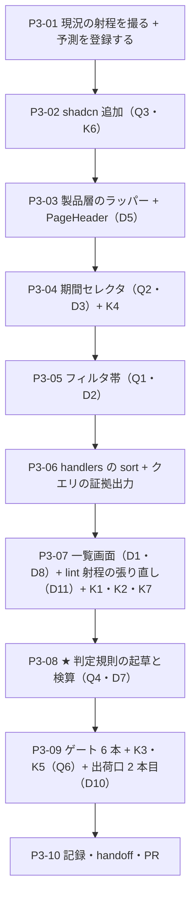

# 工程3 — 共通シェル ★ ここが工場の芯

> 段取り上の位置づけ: [工場の段取り.md](../工場の段取り.md) §工程3（工程2 の次・工程4/5 の前）
> 直前の工程: 工程2 done（**PR [#9](https://github.com/yatami0/design/pull/9) マージ済み** `5212ff0`・[実行記録 §工程2](../実行記録.md)）
> 実測の記録先: [実行記録.md](../実行記録.md) §工程3

**この工程で初めて「画面」が新土台の上で動く。**4 画面（一覧 / 詳細 / EVM / 稼働表）に同時に効く
シェル——Tabs・フィルタ帯・期間セレクタ・Breadcrumb——を作り、**チケット一覧を MSW のデータで組む。**

🟥 **着手前に効いている事実が 3 つある**（2026-08-08 実測）。

1. **コアと題材の線は、いまディレクトリでしか引かれていない**（[データモデル §6](../データモデル.md)）。
   工程2 が「暫定の線」と明記し、**規則の起草をこの工程に残した**（[段取り 未決 #6](../工場の段取り.md)）。
   ★ 候補は **「コアは語彙（有限集合）、題材は対応表」**——`StatusPill` が `tone` 4 語しか知らず、
   「Redmine の status 5 番が完了」を `convert.ts` が持つ形（[DR-0087](../DR/DR-0087-fetching-belongs-to-the-subject-layer.md)）。
   **この工程で新しい固有物が 3 種類まとめて現れる**（フィルタの選択肢・期間の語彙・画面そのもの）。
   → **§0 Q4 がこの工程の本体になる。**
2. 🟥 **工程2 Q3 の答えは「設計としては 3 点だけ」で止まっている**——実 API に繋ぐ日に書き換わるのは
   ① `REDMINE_BASE_URL` ② 認証ヘッダ ③ `convert.ts` だけ、という**主張**の検証は「工程3 以降」と申し送られた。
   **画面が snake_case を 1 度でも直接読んだらこの設計は破れる。**→ §0 Q5。
3. **本 repo は shadcn 部品を 8 手のあいだ 1 行も書き換えずに使ってきた**（素材層の diff 0 行が 6 回連続）。
   この工程は**工程1 以来はじめて `shadcn add` を打つ**——🟥 **`components.json` の `rsc` は工程1 で
   `true` → `false` に変わっている**（[工程1 D3](工程1_NextからViteへの土台入れ替え.md)）。
   「**追加インストールで部品が変わって降ってくるか**」は工程1 が**この工程へ申し送った実測**（handoff §次にやること 4）。→ §0 Q3。

---

## 0. この工程で答えを出す問い（観測項目）★最重要

| # | 問い | なぜ効くか（どの判断が変わるか） |
| --- | --- | --- |
| **Q1** | ★ **フィルタ帯は「部品」になるか、「画面ごとの組み立て」になるか** | 段取り §工程3 Q1。**判定規則（[DR-0070](../DR/DR-0070-product-layer-boundary-rule.md)）の ①→② を、いままでで一番大きい対象に当てる。**フィルタ帯は「帯の見た目（並び・間隔・折返し・ラベルの付き方）」と「何で絞るか（状態 / 担当 / プロジェクト）」が同居している。前者はコアの管轄、後者は題材——**分けられるなら部品、分けられないなら画面ごとの組み立て。**答えが「部品」なら 4 画面ぶんの再利用資産が確定し、「組み立て」なら**工場の芯が 1 つ減る**（段取りの前提「4 ビューは同じデータの別の見方だから共通シェルが最大の再利用資産」が崩れる） |
| **Q2** | **期間セレクタの語彙は何か。トークン語彙と同じ形（有限集合）で閉じられるか** | 段取り §工程3 Q2。🟥 **閉じられない可能性が高いほうに賭ける材料がある**——期間は「今週 / 今月 / 四半期」の有限語彙と「任意範囲」の無限集合が**同じ 1 つの props に同居する**。トークン語彙（`gap="md"`）にはこの形が 1 つも無い。[DR-0063](../DR/DR-0063-forbidding-without-an-alternative-fails.md)（禁止は代替と対でしか効かない）と同じ構図で、**逃げ道（custom）をどう設計するかが答えの本体**。ここで決めた形は工程7（EVM）・工程8（ガント）の時間軸にそのまま効く |
| **Q3** | 🟦 **新しく足す shadcn 部品は、既存 18 件と同じく無変更で入るか。`rsc: false` で降ってくる中身は変わるか** | 段取り §工程3 Q3 ＋ **工程1 D3 の申し送り**。素材層の diff 0 行は 6 回連続・部品の書き換え 0 は 8 手連続で、**これが崩れると「shadcn を素材として使う」という土台の前提が崩れる**。🟥 **既存 18 件が上書きされる可能性も測る**（`shadcn add` は依存部品を巻き込む）。あわせて **eslint のベースライン（error 33）が新素材でいくつ増えるか**を予測 → 実測で突き合わせる |
| **Q4** | 🆕 ★★ **「Redmine 固有 / コア」の判定規則は立つか。「コアは語彙、題材は対応表」は新しい固有物に当たるか** | [段取り 未決 #6](../工場の段取り.md) の**起草がこの工程に割り当てられている**。🟥 **規則が立たないと、この先の 5 工程すべてで「これはコアか題材か」を毎回その場で決めることになる**（＝工場ではなくなる）。この工程で現れる固有物は少なくとも 3 種類——① フィルタの選択肢（ステータス / 担当者 / プロジェクト）② 期間の語彙（Redmine の会計期間ではなく一般的な期間）③ 画面そのもの。★ **候補が当たらない固有物が 1 つでも出たら、それが規則の形を決める材料**になる（当たった件数より、**当たらなかったもの**を数える） |
| **Q5** | 🆕 🟥 **画面を組んでも「書き換わるのは 3 点だけ」は保たれるか**（工程2 Q3 の検証） | 工程2 は**設計としてそう作った**と書いただけで、**使う側が 1 人もいない状態で締めた**。画面が `issue.assigned_to`（snake_case）を 1 度でも読んだら、実 API に繋ぐ日に画面まで書き換わる。🟥 **型で防げているつもりでも、`as` 1 個で抜ける。**→ 赤テスト K2 で「抜けようとしたら止まるか」を測る |
| **Q6** | 🆕 **「画面」という層を足すと射程は漏れるか。出荷面は無傷か** | [DR-0040](../DR/DR-0040-frame-leaks-when-a-layer-is-added.md)（層を足すたびに射程が漏れる）の再演を数える。**この工程は片側だけ足す**——コアの新部品は `dist` に**入るべき**で、題材の画面は**入ってはいけない**。[DR-0085](../DR/DR-0085-three-independent-scopes-decide-what-ships.md)（出荷の入口は 3 本）の**初めての「入れる側」の運用**になる。🟨 あわせて `.design-sync/config.json` の `componentSrcMap`（31 件の明示列挙）に新部品を足すか＝**出荷口 2 本目に載せるか**も決める |

> **Q1 と Q4 が本体。**Q2 は工程7/8 への前提、Q3 は土台の再確認、Q5 は工程2 の宿題、Q6 は工場の衛生。
> 🟥 **この工程では編集を作らない**（工程4）。チャート・ガントにも触らない（工程6）。

### 0.1 赤テストの設計（🟥 作る前・作った直後に打つ）

**本 repo は「対象 0 件で緑」を通算 16 例踏んでいる。**画面はその形が最も出やすい——
**フィルタの UI は動いているのに取得に効いていない**とき、画面は「絞り込まれた結果」に見える絵を平然と描く。
**検体ごとに「赤になるはず／緑でも構わない」を先に宣言し、外れたら Q6 の答えに数える。**

| 検体 | 中身 | 期待 | 外れたときの意味 |
| --- | --- | --- | --- |
| **K1** | ★ フィルタを `status_id=closed` に変えて一覧を取り直す。**同時に、飛んだ URL を記録する** | 🟥 **件数と中身が変わるはず**（生成データは open / closed 両方を含む・`src/mocks/data.ts`） | 変わらないなら **UI は動いているが取得に効いていない**＝**17 例目**。🟥 **「件数が変わった」だけでは足りない**——URL に `status_id` が載っていることまで見る（偶然の並び替えと区別が付かない） |
| **K2** | 画面のコードに `issue.assigned_to`（snake_case）と書く／`as unknown as` で API 表現を画面に流し込む | 🟥 **前者は `tsc` が赤になるはず。**🟨 **後者は赤にならない**はず | 前者が緑なら `model.ts` の型が効いていない（Q5 = no）。**後者は「型では止まらない」ことの確認**——止まらないなら **lint 側に規則が要るか、規約文書に落とすかの判断**（→ §2 へ追記して決める） |
| **K3** | 新しく足した素材層を、**patterns / templates / story から** `@/components/ui/tabs` と**直接** import する（製品層ラッパーは包む側なので対象外） | 🟥 **eslint が赤になるはず**（窓口 1 本・手3 D3=B の `no-restricted-imports`。禁止先は `@/components/ui/*` の**パターン**なので新部品にも自動で効くはず） | 緑なら**パターンが効いていない**＝部品を足すたびに規則を足す運用になっている（規則の書き方を直す）。🟥 **注意: この検体を「画面」に置くと現状は必ず緑**——画面層はどのブロックの `files` にも入っていない（→ D11・K7） |
| **K4** | 期間セレクタに語彙外の値を渡す（`preset="fortnight"`）／帯の中で任意値クラス（`w-[220px]`）を書く | 🟥 **前者は `tsc`・後者は eslint（`tailwindcss/no-arbitrary-value`）が赤になるはず** | 後者が緑なら、**新しく作ったファイルが lint の射程に入っていない**（DR-0040 の形）。🟥 **error 33 のベースラインは「素材層だけ」だったので、自作側で 1 件でも出たら内訳の意味が変わる** |
| **K5** | 🟥 `dist/` の中身を before / after で diff | **コアの新部品は増える**／**題材（画面・フィルタの選択肢・`src/redmine/**`）は 1 件も増えない** | 題材が混ざったら [DR-0085](../DR/DR-0085-three-independent-scopes-decide-what-ships.md) の 3 本のどれかが塞げていない。**JS・`.d.ts`・静的の 3 本を別々に見る**（1 本ずつしか見ないと、また片方だけ塞いで終わる） |
| **K6** | 🟥 `shadcn add` 直後、**ignore を足す前に**ゲート 6 本 | 🟥 **eslint の error が増えるはず**（新素材の任意値）。**予測値を P3-01 で先に書いてから測る** | **予測より少ないほうが危ない**——射程に入っていない可能性がある。🟥 **増えた分を ignore で消さない**（内訳こそが成果物・CLAUDE.md）。既存 18 件が 1 行でも書き換わっていたら Q3 = no |
| **K7** | 🆕 画面（`src/redmine/screens/**`）に 3 検体を書く——① `@/components/ui/*` の直 import ② `p-4` / `text-gray-600`（数値の段・パレット色） ③ `fetch` 直書き | 🟥 **D11 のブロックを足す前は 3 つとも緑のはず**（射程の穴の実証＝ [DR-0040](../DR/DR-0040-frame-leaks-when-a-layer-is-added.md) の再演を、漏れる前に自分で踏む）。**足した後は 3 つとも赤のはず** | 足す**前**に赤が出たら現況の読み違い（どの規則が拾ったかを記録して D11 を見直す）。足した**後**に緑が残ったら **`files` の glob が画面に届いていない**——「足して 0 件のまま緑」の形なので、**3 つとも発火を確認するまで D11 を完了にしない** |

🟥 **各検体は「赤を確認 → 戻して緑を確認」まで 1 セット。**戻し忘れ防止に `git status` で終了確認する。
🟥 **K1 は目で見て終わりにしない。**MSW のハンドラ側で受け取ったクエリを console に出し、**URL を証拠として残す。**

---

## 1. 前提

- **直前の工程**: 工程2 done（[実行記録 §工程2](../実行記録.md)・DR-0085〜0087・[データモデル.md](../データモデル.md)）
- **ブランチ**: Conductor の作業ブランチ（工程1・2 と同じく workspace 名が PR の head になる。起草は `hanoi`・レビュー修正は `p3-review-and-fixes`）。
  完了したら `gh pr create --base main`。🟥 **マージは人**（[DR-0068](../DR/DR-0068-merge-through-pull-requests.md)）
- **依存は厳密ピン**（[DR-0080](../DR/DR-0080-strict-pins-stay-for-reproducibility.md)）。版は実測してから書く
- **環境の穴 2 つ**（[handoff §環境の再現](../handoff.md)）: ① `pnpm install` が `pnpm-workspace.yaml` の
  プレースホルダを生やす（**生えたら消す**——`cspell` が `esbuild` を拾って新しい赤になる）
  ② mise が非対話シェルで効かない（`export PATH="$HOME/.local/share/mise/installs/node/24.18.1/bin:$PATH"`）
- **ゲートのベースライン**（工程2 完了時）: `tsc` 緑 ／ `eslint` **error 33 / warning 1** ／ `vite build` 緑
  （dist 57 ファイル・`design.mjs` 61.36 kB）／ `prettier` 緑 ／ `cspell` 緑（257 ファイル）／
  `storybook build` 緑（story 39 ファイル・index.json 62 件）

### 現況の配線（2026-08-08 実測。この工程で動く箇所の全量）

| 箇所 | 現況 | 動かし先 |
| --- | --- | --- |
| `src/templates/AppShell.tsx` | props は **`brand` / `nav` / `children` の 3 つだけ**。中身は Sidebar（面 1）＋ `SidebarInset > Container > Stack`（面 2）。🟥 **ヘッダが無い**——Breadcrumb・Tabs・期間セレクタを置く場所が構造上どこにも無い | D5 |
| `src/components/ui/` | **18 件**（badge / button / card / checkbox / dialog / dropdown-menu / empty / input / label / pagination / popover / select / separator / sheet / sidebar / skeleton / table / tooltip）。🟥 **tabs・breadcrumb・calendar は無い** | D4・Q3 |
| 役割カテゴリ | Navigation に **Tabs / Breadcrumb**、Selection に **DatePicker** が[思想 §役割カテゴリ](../共通コンポーネント思想.md)で既に予約されている（分類の発明は不要） | D4 |
| `src/redmine/` | `types.ts` 148 行 ／ `model.ts` 108 行 ／ `convert.ts` 143 行 ／ `client.ts` 165 行。**`IssueQuery` は `status_id` / `assigned_to_id` / `project_id` / `include` / `offset` / `limit` / `sort`** | D2・D8 |
| `src/mocks/` | `data.ts` 361 行（決定論的生成）／ `handlers.ts` 263 行 ／ `db.ts` ／ `random.ts`。🟦 **絞り込みは既に効いている**——`status_id`（`open` / `closed` / `*` / id・`matchesStatus`）・`assigned_to_id`・`project_id` は工程2 実装済みで、既定 `open` も写してある。🟥 **無いのは `sort`（id 降順固定）と、受け取ったクエリの証拠出力** | P3-06（`sort` ＋ 証拠出力） |
| 画面 | 🟥 **存在しない。**`src/redmine/` に画面は無く、取得する story は `★ Review/データの器（MSW）` の**検体 2 本だけ**（工程2 D11=B。「画面ではない」と本文に明記してある） | D1 |
| `src/lib/fixtures/issues.ts` | **6 行 × 6 フィールド**の手書き。`④ Templates/AppShell` ほか既存 story が直接 import。🟥 **`dist/lib/fixtures/issues.d.ts` が出荷面に漏れたまま**（工程1 から在ったもの・[DR-0085](../DR/DR-0085-three-independent-scopes-decide-what-ships.md)。**整理はこの工程と申し送られている**） | D6 |
| story の棚 | 第 1 階層は **`① Tokens` / `② …` / `③ Patterns` / `④ Templates` / `★ Review`**（[DR-0051](../DR/DR-0051-storybook-organized-by-layer-with-viewpoint-cards.md)）。**画面（題材）を置く棚が無い** | D9 |
| `.design-sync/config.json` | `componentSrcMap` に **31 件を明示列挙**。**新部品は自動では載らない** | D10・Q6 |
| `eslint.config.mjs` | 工程2 で 2 ルールを復活（`fetch` 直書き禁止 ／ コア → 題材の import 禁止）。**story だけは題材を見てよい**。🟥 **D1 で新設する画面層（`src/redmine/screens/**`）はどのブロックの `files` にも入っていない**——① 素材層直 import 禁止は stories / patterns / templates だけ ② 数値の段・パレット色の禁止（手3 D4=B′ の「アプリ層」）は工程1 で `src/app` が消えて以来**掛かる先が無い**（[DR-0074](../DR/DR-0074-we-wrote-the-same-deviations-ourselves.md) の `w-48` が通り抜けた経路と同根） ③ `fetch` の例外が `src/redmine/**` **全体**なので画面が `client.ts` を迂回できる | D11・K3・K4・K7 |

## 2. 着手前に決めること（判断ポイント）

> D1〜D3 は [工場の段取り §工程3](../工場の段取り.md) の問いに対応する実装判断。D4 以降は手順書起こしの実測で増えた分。
> 🟨 **決定はすべて推奨どおりの Claude 判断（事後承認待ち）**——全件 🟦 戻せる。
> 異議があれば言ってほしい。実行中に §2 に無い選択肢が出たら、**その場で決めずにここへ追記してから進む**。

| # | 論点 | 選択肢 | 決定 | 根拠 | 戻せるか |
| --- | --- | --- | --- | --- | --- |
| **D1** | ★ **画面（Redmine のチケット一覧）をどこに置くか** | A: `src/redmine/screens/`（題材） ／ B: `src/screens/`（コア） ／ C: story の中だけ | **A** | **B は却下**——画面は「どのフィルタを出すか」「どの列を出すか」で Redmine を知っている。コアに置くと出荷物が題材を運ぶ（工程2 D4 と同じ論法）。**C も却下**——工程2 の検体は「画面ではない」と断って story に置いたが、**この工程の成果物は「一覧が動くこと」**なので、story の中に閉じると工程4（詳細）から再利用できない。→ **`src/redmine/screens/` に置き、`src/index.ts` からは 1 つも export しない。**既存 lint（コア → 題材の import 禁止）がそのまま効く | 🟦 |
| **D2** | ★ **フィルタ帯の作り**（Q1 の実装形） | A: コアに `FilterBar` 部品（選択肢まで持つ） ／ B: 画面ごとの組み立て（コアは何も持たない） ／ C: **コアは「帯」の器だけ持ち、中身は children** | **C** | **A は却下**——「ステータス / 担当者 / プロジェクト」は Redmine の語彙で、コアに入れた瞬間に出荷物が題材を知る。**B も却下**——帯の見た目（並び・間隔・折返し・ラベルの付き方）は**見た目の管轄権がコアにある**（[DR-0070](../DR/DR-0070-product-layer-boundary-rule.md)）。B にすると 4 画面で 4 通りの帯ができ、段取りが「最大の再利用資産」と呼んだものが消える。→ **C。器（`FilterBar`）と、中に入る 1 枠（`FilterField`）だけをコアが持ち、何で絞るかは題材が差す。**🟥 **これは Q1 の答えの「予測」であって答えではない**——実際に一覧を組んで、器だけで足りたか（画面側に見た目の指定が漏れなかったか）を実測する | 🟦 |
| **D3** | ★ **期間セレクタの語彙**（Q2） | A: 有限 union のみ（`thisWeek \| thisMonth \| thisQuarter`） ／ B: 任意範囲のみ（開始日・終了日） ／ C: **有限 union ＋ `custom`（範囲は別 props）** | **C** | A は EVM・稼働表で「任意の 3 か月」が出せず**必ず破られる**。B は「今月」を毎回 2 つの日付に翻訳させることになり、**画面ごとに翻訳規則がばらつく**（＝題材が語彙を持たない状態）。→ C。🟥 **[DR-0063](../DR/DR-0063-forbidding-without-an-alternative-fails.md)（禁止は代替と対でしか効かない）をそのまま適用**——語彙を閉じるなら**逃げ道を部品の中に用意する**。🟨 **プリセットの「今週」がいつ始まるか（月曜/日曜）・「四半期」の起点は題材の知識**なので、**プリセット → 日付範囲の解決関数は `src/redmine/` 側に置く**（＝ Q4 の候補「コアは語彙、題材は対応表」の 2 例目になるか実測する） | 🟦 |
| **D4** | **追加する shadcn 部品の範囲**（Q3） | A: 必要最小（tabs・breadcrumb） ／ B: A ＋ calendar（任意範囲の入力に要る） ／ C: さらに command / toggle-group など先回り | **B** | C は却下——**需要が立っていないものを入れない**（[DR-0077](../DR/DR-0077-abolish-the-two-occurrence-rule.md) 後の言い方では「回数」ではなく**この工程の画面が要求していない**のが理由）。A では D3=C の `custom` が入力できず**逃げ道が絵に描いた餅**になるので B。🟥 **`shadcn add` は依存部品を巻き込む**ので、**打つ前に `git status` を撮り、既存 18 件が 1 行でも変わったら止めて記録する**（Q3・工程1 D3 の申し送り） | 🟦（`git checkout` で戻る） |
| **D5** | **Breadcrumb / Tabs / フィルタ帯を `AppShell` に組み込むか** | A: `AppShell` に props を足す（`breadcrumb` / `tabs` / `toolbar`） ／ B: `AppShell` は触らず、画面が中身として置く ／ C: **`PageHeader` を新設し、`AppShell` の children の先頭に画面が置く** | **C** | A は却下——**4 画面が全部同じ並びだと決めつけることになる**（ガントは期間セレクタが要るが Breadcrumb の下ではないかもしれない）。しかも `AppShell` の props が「置き場の指定」で膨らむのは、[手8c](手8c_製品層に何を作るべきかの調査設計.md) が退けた形。B は D2=C と同じ理由で却下（見た目の管轄権がコアにある）。→ **C。`PageHeader`（見出し・Breadcrumb・右肩の操作）を製品層に新設**し、`AppShell` は **1 行も変えない**。🟦 **副次: `AppShell` の diff 0 行を保てる** | 🟦 |
| **D6** | 🟨 **`src/lib/fixtures/issues.ts` の始末**（工程2 からの申し送り） | A: 消して全 story を MSW 由来へ ／ B: 残したまま dts の `exclude` だけ足す ／ C: **残す（既存 story はそのまま）＋ dts の `exclude` を足す＋新しい story は MSW 由来** | **C** | A は「既存 4 story の見た目を変えない」（工程2 D11）と両立しない——**部品の検証装置を壊す**。B は出荷面だけ塞いで中身の重複を残す。→ C。🟥 **`dist/lib/fixtures/issues.d.ts` の漏れはこの工程で塞ぐ**（申し送りの履行）。🟨 **fixtures の全廃は工程4 で詳細画面を組むときに再判定**（そのとき既存 story を作り直す必要が出るかが分かる） | 🟦 |
| **D7** | 🆕 ★★ **判定規則（未決 #6）をどの形で書くか** | A: DR 1 本（decision） ／ B: 新しい文書（`docs/コアと題材の境界.md`） ／ C: 段取りの §0b に追記 | **A ＋ 検算の記録** | 規則は**1 決定**なので DR が正しい器（[CLAUDE.md](../../CLAUDE.md) の責務分離）。🟥 **ただし規則だけ書いて終わりにしない**——[DR-0070](../DR/DR-0070-product-layer-boundary-rule.md) が「6 周の逸脱を全件分類できた」ことで成立したのと同じく、**この工程で現れた固有物を全件その規則に当て、当たらなかったものを名指しする**。当たらないものが出たら**規則を直してから DR を書く**（規則に合わせて事実を選ばない）。B は文書が増えるだけ、C は段取り（地図）に決定を書くことになり責務分離に反する | 🟦 |
| **D8** | 🆕 **画面のデータ取得の形**（読み取りだけ） | A: story の `loaders`（工程2 と同じ） ／ B: 題材側の薄い読み取り hook（`src/redmine/useIssues.ts`） ／ C: コアに汎用のデータ取得 hook | **B** | A は**画面が取得を持たない**ことになり、story を離れると動かない＝「一覧が動く」の証拠にならない。C は工程2 D4 で「時期尚早」と判断済み（**抽象化の材料が 1 種類しかない**）——**判断を変える材料はまだ出ていない**。→ B。🟥 **編集の状態管理は工程4 Q1 の主題なので、ここでは読み取りだけに閉じる**（`useState` ＋ `useEffect` の最小形。🟨 ベースラインの `set-state-in-effect` 1 件が 2 件に増える可能性があるので、増えたら内訳に記録して**理由を書く**） | 🟦 |
| **D9** | 🆕 **画面の story をどの棚に置くか** | A: `④ Templates` に入れる ／ B: **`⑤ 題材（Redmine）` を第 1 階層に新設** ／ C: `★ Review` に入れる | **B** | 棚は[認識合わせの装置](../DR/DR-0051-storybook-organized-by-layer-with-viewpoint-cards.md)であって飾りではない。A は**出荷するもの（Templates）と出荷しないもの（題材）が同じ棚に並ぶ**——境界を機械で守っておきながら、人が見る面では混ぜることになる。C は検体置き場で、画面は検体ではない。→ **B。棚の第 1 階層に「コア / 題材」の線が見えるようにする。**🟥 **副作用を測る**——`/design-sync` の converter は story からカードを作るので、**題材の story がカードになるか**を次回同期（人が打つ）で確認する（D10・Q6） | 🟦 |
| **D10** | 🆕 **新しいコア部品を `componentSrcMap` に足すか**（出荷口 2 本目） | A: 足す（`FilterBar` / `FilterField` / `PeriodSelect` / `PageHeader` / `Tabs` / `Breadcrumb`） ／ B: 足さない（次の同期まで保留） | **A** | 出荷口は 2 経路と決まっている（[DR-0079](../DR/DR-0079-ship-via-git-dependency-and-claude-design.md)）。片方にだけ載せると**「同じ DS」を名乗る 2 つの面が食い違う**。🟥 **ただし同期を打つのは人**なので、**この工程では config を更新するところまで**（実測は次回同期）。🟨 **題材の story がカードに湧かないか**は同期時の観測項目として handoff へ申し送る | 🟦 |
| **D11** | 🆕 ★ **lint の射程を画面層へ張り直すか**（現況の配線で見つけた穴 3 つ・レビューで追加） | A: 現状のまま（画面は文書で守る） ／ B: **画面用ブロックを新設 ＋ `fetch` 例外を `client.ts` に絞る** ／ C: `src/redmine/**` 全体に製品層と同じ規則を張る | **B** | **A は却下**——「文書だけで守るのは 16 回踏んだ形」（工程2 D12 と同じ論法。しかも Q6 で「射程の漏れ」を数えると宣言しながら、**着手前から見えている漏れを放置する**ことになる）。**C は却下**——`client.ts` は `fetch` を持つ側で、`convert.ts` / `types.ts` に UI の規則を張っても対象が無い。→ **B**。`src/redmine/screens/**` に ① 素材層直 import 禁止 ② 数値の段・パレット色の禁止（手3 D4=B′ の「アプリ層」の復活——工程1 で `src/app` が消えて以来、掛かる先が無かった）を張り、`repo/fetch-lives-here` の `files` を **`src/redmine/client.ts` だけ**に絞る（③ は global の `fetch` 禁止が画面に自動で戻る）。🟥 **発火は K7 で「穴の実証（足す前は緑）→ 足して赤 → 検体を消して緑」まで確認する** | 🟦 |
| **D12** | 🆕 **穴 ① が `shadcn add` を止めた**（P3-02 実測で追記）——pnpm 11 は `allowBuilds` 未宣言の build script を**ハードエラー**にし、`shadcn add` は依存だけ入れて**部品ファイルを書く前に exit 1** した。未決 #27 ① をどうするか | A: `pnpm approve-builds`（対話 CLI） ／ B: **`pnpm-workspace.yaml` に `allowBuilds: esbuild / msw = false` を明示して commit** ／ C: これまでどおりプレースホルダを消して回避し続ける | **B** | **C は死んだ**——「生えたら消す」は読み取り系ゲートには効いたが、`shadcn add` は install を内包するので**回避のしようがない**。A は非対話環境で打てず、書かれる結果は B と同じ。**false（走らせない）を選ぶ根拠は実測**——8 手＋工程0〜2 は postinstall 未実行のままゲート全緑（esbuild の実体はプラットフォーム別 optional dep で入る・msw の worker は commit 済み）。→ **B で未決 #27 ① を決着**（「走らせない」の明示）。🟨 cspell が yaml の `esbuild` を拾うので辞書へ 1 語 | 🟦（ファイルを消せば元の穴に戻る） |

| **D13** | 🆕（P3-04 で追記）**`custom` の範囲入力の置き場** | A: **部品の中**（`PeriodSelect` が Popover ＋ Calendar を内蔵） ／ B: 外（画面が範囲入力を別部品として並べる） | **A** | D3 の根拠に書いたとおり、**語彙を閉じるなら逃げ道は部品の中に対で持つ**（[DR-0063](../DR/DR-0063-forbidding-without-an-alternative-fails.md)）。B だと「語彙は部品・逃げ道は画面」に割れ、4 画面がそれぞれ範囲入力を組む＝帯と同じ再発明が起きる | 🟦 |
| **D14** | 🆕（P3-04 で追記）**一覧画面で期間セレクタを取得に繋ぐか**——`IssueQuery` に期間の口が無い | A: 見た目だけ置いて query に繋がない ／ B: **`updated_on`（実 API に在る絞り込み・`><YYYY-MM-DD\|YYYY-MM-DD` 記法）を `IssueQuery` と handlers に足して繋ぐ** ／ C: 期間セレクタは一覧に置かない（EVM / 稼働表まで待つ） | **B** | **A は K1 が守ろうとしている形そのもの**（「UI は動くが取得に効いていない」を自分で作る）。C は段取りの成果物（共通シェル＝ Tabs・フィルタ帯・**期間セレクタ**・Breadcrumb）を欠く。B は Redmine の実 API に在る絞り込みなので「モックは Redmine が返せるものしか返さない」を破らない。🟨 **`><` という Redmine 固有の演算子記法は `period.ts`（対応表）側に置く**——Q4 の検体がまた 1 つ増える | 🟦 |

## 3. 成果物

- **コア（出荷する）**
  - `src/components/ui/tabs.tsx` / `breadcrumb.tsx` / `calendar.tsx`（shadcn・**無変更**）
  - `src/components/Navigation/Tabs.tsx` / `Breadcrumb.tsx`（製品層のラッパー・窓口 1 本）
  - `src/components/Selection/PeriodSelect.tsx`（期間セレクタ・**語彙 ＋ custom**・D3）
  - `src/patterns/FilterBar.tsx` / `FilterField`（帯の器・D2）
  - `src/patterns/PageHeader.tsx`（見出し・Breadcrumb・右肩の操作・D5）
  - `src/index.ts` への追加 export ＋ 型
- **題材（出荷しない）**
  - `src/redmine/screens/IssueList.tsx`（チケット一覧・D1）
  - `src/redmine/useIssues.ts`（読み取り hook・D8）
  - `src/redmine/period.ts`（プリセット → 日付範囲の解決＝**対応表**・D3）
  - `src/mocks/handlers.ts` の `sort` 対応 ＋ 受け取ったクエリの証拠出力（🟦 `status_id` / `assigned_to_id` / `project_id` は工程2 実装済み）
- **機械ゲート**: `eslint.config.mjs` の画面層ブロック新設 ＋ `fetch` 例外の絞り込み（D11・発火確認は K7）
- **story**: `⑤ 題材（Redmine）/チケット一覧`（D9）＋ 新部品の story（棚は `② 製品層`）
- **文書**: **判定規則の DR 1 本**（未決 #6 の決着・D7）／ ゲートのベースライン更新（handoff）／
  [実行記録 §工程3](../実行記録.md)（実測のみ）／ 段取り 未決 #6 の決着を反映

## 4. 作業フロー

## 5. 手順

### P3-01 現況の射程を撮る ＋ 予測を登録する

- **目的**: 「後から差分で見る」ための基準。🟥 **予測は測る前に書く**（[DR-0076](../DR/DR-0076-capture-the-run-not-just-the-output.md)——予測の外は「0 件」ですらなく欄が存在しない）。
- **実行**: `pnpm build` → `find dist -type f | sort > /tmp/dist-before.txt` ／ ゲート 6 本を回してベースライン一致を確認 ／ `git diff --stat` が空であることを確認。
- **登録する予測**（実行記録に先に書く）:
  1. `shadcn add` で**既存 18 件は 1 行も変わらない**（Q3）
  2. eslint の error は **33 → ?**（新素材の任意値。**打つ前に件数を宣言する**）
  3. 題材の story は `dist` に 1 バイトも出ない（K5）
  4. ★ **予測していない箇所が 1 件以上出る**（DR-0076 ③ の様式）
- **観測**: Q3・Q6 の基準。

### P3-02 shadcn 追加（★ Q3・K6）

- **目的**: 8 手連続で守られてきた「素材層は無変更」が、`rsc: false` になった後も続くかの実測。
- **実行**: `pnpm dlx shadcn@latest add tabs breadcrumb calendar` → **すぐ `git status` / `git diff src/components/ui`** → **ignore を足す前にゲート 6 本**（K6）。
- **期待結果**: 新規 3 ファイル。既存 18 件の diff **0 行**。eslint の error は増えるかもしれない（**予測と突き合わせる**）。
- **観測**: Q3。🟥 **既存が書き換わっていたら、そこで止めて内訳を記録する**（工程1 D3 の申し送りへの答えがそれ）。
- **詰まったら**: `calendar` は依存（`react-day-picker` 等）を引く可能性がある。**引いたら版を実測してピン**（DR-0080）し、**外部依存が増えたこと自体を記録する**（素材源の話なので工程6 の材料になる）。

### P3-03 製品層のラッパー ＋ `PageHeader`（D5）

- **目的**: 窓口 1 本（手3 D3=B）を保ったまま、新素材を製品層に通す。
- **実行**: `src/components/Navigation/Tabs.tsx` / `Breadcrumb.tsx` の再輸出 → `src/patterns/PageHeader.tsx` → `src/index.ts` に追加。
- **検証**: **K3**（`@/components/ui/tabs` の直 import が赤になるか）。
- **観測**: Q6（新部品が既存の規則の射程に自動で入るか）。
- **判断**: 🟥 **ラッパーで `className` を開けない**（[DR-0071](../DR/DR-0071-closed-product-layer-is-viable.md)・手8d で閉じた形を踏襲）。開けたくなったら §2 へ追記してから。

### P3-04 期間セレクタ（★ Q2・D3）＋ K4

- **目的**: **有限語彙と無限集合が同居する props** を、トークン語彙と同じ形に閉じられるかの実測。
- **実行**: `src/components/Selection/PeriodSelect.tsx`（`preset` は union ＋ `custom`、`range` は別 props）→ **解決関数は `src/redmine/period.ts`**（プリセットの起点は題材の知識）→ **K4** を打つ。
- **期待結果**: 語彙外の `preset` が `tsc` で赤。帯の中の任意値クラスが eslint で赤。
- **観測**: Q2・Q4（★ **「コアは語彙、題材は対応表」の 2 例目になるか**——ここが Q4 の検算の主戦場）。
- **判断**: `custom` を選んだときの範囲入力の置き場（部品の中 / 外）。🟥 **決めたら §2 へ追記してから進む。**

### P3-05 フィルタ帯（★ Q1・D2）

- **目的**: 帯の見た目（コア）と、何で絞るか（題材）が**本当に分かれるか**。
- **実行**: `src/patterns/FilterBar.tsx`（器）＋ `FilterField`（1 枠）→ story で**中身が違う 2 例**（ステータス絞り／担当者絞り）を並べ、**帯の見た目が同じであること**を見る。
- **期待結果**: **画面側に見た目の指定（幅・間隔・折返し）が 1 つも漏れない。**
- **観測**: ★ Q1。🟥 **漏れたら、漏れた項目を全部書き出す**——それが「部品にならなかった理由」の実体で、答えが B（画面ごとの組み立て）に倒れる根拠になる。**漏れた数が 0 でないと Q1 は yes とは言えない。**

### P3-06 handlers の `sort` ＋ クエリの証拠出力

- **目的**: K1 の**証拠**を出せる状態にする。🟦 **絞り込み自体は工程2 で実装済み**——`status_id`（`open` / `closed` / `*` / id・`matchesStatus`）・`assigned_to_id`・`project_id` は既に効いており、既定の `open` も写してある（`handlers.ts` 冒頭コメント ③）。🟥 起草時の本手順書は「これから実装する」と書いていた＝**現況を測らずに書いた行**（レビューで訂正）。
- **実行**: ① `sort` を実装する（現状は id 降順固定。一覧画面が使う分だけ——実 API に無い並び替えは**作らない**。工程2 の規律「モックは Redmine が返せるものしか返さない」） ② **受け取ったクエリを console に出す**（K1 の証拠）。
- **期待結果**: 既存の絞り込みの挙動は 1 つも変わらない（`★ Review/データの器` の検体 2 本の絵が同じ）。
- **観測**: Q5 の準備。🟥 **出典**: `status_id` の既定・許容値は [Redmine wiki](https://www.redmine.org/projects/redmine/wiki/Rest_Issues)（§7）。🟨 **[データモデル §2.1](../データモデル.md) に `status_id` の項は無い**——`client.ts` L68 のコメント「データモデル §2.1 の逐語」は参照先が誤り。実行時に **コメントを直すか §2.1 に追記するかを決めて記録する**。

### P3-07 一覧画面（D1・D8・D11）＋ K1・K2・K7

- **目的**: **新土台で画面が動く**。段取りが「最短で画面が見える点」と呼んだ地点。
- **実行**: **先に K7 の前半**（`src/redmine/screens/` に 3 検体を置き、**現状の lint で 3 つとも緑になること＝穴の実証**を撮る）→ **D11 のブロックを張って赤 → 検体を消して緑** → `src/redmine/useIssues.ts` → `src/redmine/screens/IssueList.tsx`（`AppShell` > `PageHeader` > `FilterBar` > `DataGrid` ＋ `Pagination`）→ story を `⑤ 題材（Redmine）/チケット一覧` に置く（D9）→ **K1・K2** を打つ。
- **期待結果**: フィルタを変えると URL と件数が変わる。snake_case を書くと `tsc` が赤。
- **検証**: `grep -rn "redmine\|screens" src/index.ts` = **0 件**（出荷面に漏れていない）。
- **観測**: Q1・Q5・Q6（★ **K7 の「足す前は緑」が Q6 の 1 件目の実測になる**——層を足す**前**から漏れていた射程）。🟥 **K1 が緑（＝絞れていないのに絵は出る）なら、そこで止めて 17 例目として記録する。**

### P3-08 ★ 判定規則の起草と検算（Q4・D7）

- **目的**: [未決 #6](../工場の段取り.md) の決着。**規則を書き、この工程で現れた固有物に全件当てる。**
- **実行**:
  1. この工程で現れた固有物を**全部書き出す**（フィルタの選択肢・期間プリセットの起点・列の定義・ステータスのトーン・URL・画面の並び ほか。**思いついた順ではなく、追加・変更したファイルを 1 本ずつ見て拾う**）
  2. 候補の規則「**コアは語彙（有限集合）、題材は対応表**」を全件に当てる
  3. 🟥 **当たらなかったものを名指しする**（当たった件数ではなく、**当たらなかったもの**が規則の形を決める）
  4. 規則を確定させて **DR を 1 本書く**（`/dr`）。段取り 未決 #6 と [データモデル §6](../データモデル.md) から参照を張る
- **期待結果**: 規則は**判定手順の形**（何を見て、どちらに倒すか）で書かれていること。分類表で終わらせない（[指摘 12](../共通コンポーネント思想への指摘.md) と同じ穴を自分で掘らない）。
- **観測**: ★ Q4。**当たらなかった固有物が 0 件だったら、それはそれで疑う**——3 種類しか当てていない可能性がある。
- **判断**: 規則が既存の判定規則（[DR-0070](../DR/DR-0070-product-layer-boundary-rule.md)・素材層/製品層）と**衝突するか**。衝突したら §2 へ追記してから決める。

### P3-09 ゲート 6 本 ＋ K3・K5（Q6）＋ 出荷口 2 本目（D10）

- **目的**: 射程の漏れと、出荷面の純度。**この工程は「入れる側」と「入れない側」が同時にある。**
- **実行**: ① `pnpm build` → `find dist -type f | sort` を P3-01 と diff（**K5**。**JS・`.d.ts`・静的の 3 本を別々に見る**）② `vite.config.ts` の dts `exclude` に `src/redmine/**` が効いているか確認し、**`src/lib/fixtures/**` を足す**（D6）③ ゲート 6 本 → 内訳を handoff の表と突き合わせ ④ `.design-sync/config.json` の `componentSrcMap` に新部品を追加（D10）。
- **期待結果**: dist にコアの新部品だけが増える。題材は 0 件。
- **観測**: Q6。🟥 **説明できない増減は「対象 0 件で緑」の疑い。**

### P3-10 記録・handoff・PR

- **目的**: 責務分離どおりに書き分けて締める。
- **実行**: 実行記録 §工程3（実測のみ・**予測との突き合わせ表を含む**）→ handoff（現在地・ベースライン表・次にやること＝工程4）→ 本手順書 status を done → 段取り 未決 #6 に決着を書く → DR / OBS（`/dr` `/obs`）→ `gh pr create --base main`。
- **判断**: 🟥 **マージは人**。🟨 **工程3 の締めで「工場の規約文書の起草時機」を 1 度問う**（[段取り 未決 #7](../工場の段取り.md)）。

## 6. 完了条件

- [ ] §0 の Q1〜Q6 に答えが出ている
- [ ] 赤テスト K1〜K7 が「赤 → 戻して緑」まで記録されている（K5 は差分で・K7 は「穴の実証 → 塞いで赤 → 戻して緑」の 3 段）
- [ ] ★ **判定規則の DR が 1 本あり、この工程の固有物に全件当てた結果（当たらなかったものを含む）が書かれている**。段取り 未決 #6 が決着している
- [ ] **チケット一覧が新土台で動く**（`⑤ 題材（Redmine）/チケット一覧` が MSW のデータで描画され、フィルタが取得に効く）
- [ ] `src/index.ts` に `src/redmine/**` `src/mocks/**` が 1 つも現れない（出荷面が無傷）
- [ ] `dist/lib/fixtures/issues.d.ts` の漏れが塞がっている（工程2 からの申し送り）
- [ ] `AppShell` の diff が 0 行（D5=C の帰結）／ 既存 18 件の素材層の diff が 0 行（Q3）
- [ ] ゲート 6 本の結果が handoff の表と突き合わせ済みで、増減に全件説明が付いている（**ignore で消していない**）
- [ ] 実行記録 §工程3 が追加され、本手順書は計画のまま（実測を書き込まない）
- [ ] PR 作成済み（マージは人）

## 7. 出典

- shadcn/ui（tabs / breadcrumb / calendar のレジストリ）: <https://ui.shadcn.com/docs/components>（**版と中身は `shadcn add` の実測が正**）
- Redmine Issues API（`status_id` の許容値・既定の絞り込み）: <https://www.redmine.org/projects/redmine/wiki/Rest_Issues>
- 本 repo の既存決定: [DR-0070](../DR/DR-0070-product-layer-boundary-rule.md)（見た目の管轄権）／ [DR-0071](../DR/DR-0071-closed-product-layer-is-viable.md)（閉じた製品層）／ [DR-0063](../DR/DR-0063-forbidding-without-an-alternative-fails.md)（禁止は代替と対）／ [DR-0085](../DR/DR-0085-three-independent-scopes-decide-what-ships.md)（出荷の入口は 3 本）／ [DR-0087](../DR/DR-0087-fetching-belongs-to-the-subject-layer.md)（取得は題材の層）
- 🟥 **外部ドキュメントは二次情報になり得る**（[DR-0006](../DR/DR-0006-shadcn-base-radix-preset-nova.md)）。版・挙動は P3-02 以降の実測が正。
