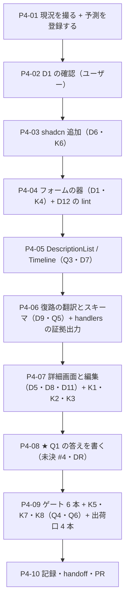

# 工程4 — 一覧 → 詳細（🟥 編集を含む）

> 段取り上の位置づけ: [工場の段取り.md](../工場の段取り.md) §工程4（工程3 の次・工程5 の前）
> 直前の工程: 工程3 done（**PR [#10](https://github.com/yatami0/design/pull/10) マージ済み** `5a9abde`・[実行記録 §工程3](../実行記録.md)）
> 実測の記録先: [実行記録.md](../実行記録.md) §工程4

**この工程が一番重い。**フォーム・バリデーション・保存の状態は、**部品ライブラリの設計思想が最も割れるところ**（段取り §工程4）。
工程3 までは**画面が状態を持たなかった**——持っていたのは「絞り込みの選択」だけで、
**書き戻す先が無かった**。この工程で初めて **UI が真実の側を書き換える。**

🟥 **着手前に効いている事実が 7 つある**（2026-08-08 実測。§1 に数字、ここに意味だけ書く）。

1. **ゲートは内訳まで `main`（`22440c8`）と一致している。**新しい worktree で `pnpm i --frozen-lockfile` が
   **回避策なしに素直に通った**（工程3 D12 の `allowBuilds` の効果・`.design-sync/NOTES.md` 見張り #20 の確認）。
   🟨 `cspell` だけ **283 ファイル**（handoff の表は 280）——差分 3 は工程外コミットで足した md で、**新しい赤ではない**。
2. 🟥 ★ **段取り §工程4 D1 の選択肢が古い。**「shadcn の `Form`（rhf ＋ zod）か自作か」の二択で書かれているが、
   **レジストリを引いたら第 3 の選択肢が実在した**——`field`（`Field` / `FieldLabel` / `FieldError` ほか）は
   **外部依存 0**（`registryDependencies` は `label` と `separator` だけで、どちらも在庫にある）。
   対して `form` は **`react-hook-form` / `zod` / `@hookform/resolvers` の 3 件**を引く。
   → **§2 D1 は二択ではなく三択で立てる。**
3. 🟥 ★ **思想は「RHF ＋ Zod」を名指ししている**（[共通コンポーネント思想 §Components 層](../共通コンポーネント思想.md)
   「入力値は RHF + Zod へ切り出す」・フラグ `formBound` =「RHF + Zod に紐づくか」）。
   🟥 **ただし思想が言っているのは「切り出す」であって「どの層が持つか」ではない**——
   分類表であって合成の規則を持たない（[指摘 12](../共通コンポーネント思想への指摘.md)）。
   **[段取り 未決 #4](../工場の段取り.md)（編集の状態管理の置き場）が空いているのはそのため。**→ §0 Q1・§2 D1。
4. 🟦 **詳細と編集の材料は工程2 で全部揃っている。**`fetchIssue`（`include=journals,relations`）・
   `updateIssue`（PUT → 204）・`IssuePatch`・`IssueDetail` / `IssueEvent`、そして MSW の PUT ハンドラ
   （`journals` を積み、**現在時刻を読まない**）。**この工程で書くのは画面と部品だけ**——取得の層は 1 行も足さない見込み。
   → 🟥 **その見込み自体が観測項目**（Q5 で数える）。
5. 🟥 **`ListDetail` / `useListDetail` は在るのに、工程3 の一覧は使っていない。**
   `IssueList.tsx` は `DataGrid` を直に置いており、行を押しても何も起きない。
   **手4 で作って出荷までしている Pattern が、最初の実利用者の前で素通りされた**——
   詳細を足すいまが**この Pattern が使われるか使われないかの初めての実測**になる。→ §2 D5。
6. 🟥 **Timeline も DescriptionList も、役割 9 カテゴリのどこにも席が無い。**
   DataDisplay が持つのは `Table, DataGrid, List（データ）, Tree, Tag, Statistic, Chart`。
   工程3 は「分類の発明は不要」で済んだ（Tabs / Breadcrumb / DatePicker は思想に予約済みだった）が、
   **工程4 は分類の外に出る最初の工程。**🟥 **思想はユーザーの持ち物なので書き換えない**——指摘として起票する。→ §0 Q3・§2 D7。
7. 🟥 **出荷入口は 4 本ある**（[DR-0091](../DR/DR-0091-claude-design-is-a-fourth-shipping-entrance.md)）。
   4 本目（Claude Design）の判定軸は story の `title` で、**除外しなければ既定で落ちるのではなく `[TITLE_UNMAPPED]` 扱いになる。**
   **工程4 は題材 story が増える最初の工程**なので、`titleMap` への追記が実際に要る。
   段取りは**出荷面の話をこの工程で 1 度に片付ける**と決めている（D3 ＝ `cfg.entry` を `dist` に倒すか ＋ `titleMap` の機械化）。→ §2 D3・D4。

---

## 0. この工程で答えを出す問い（観測項目）★最重要

| # | 問い | なぜ効くか（どの判断が変わるか） |
| --- | --- | --- |
| **Q1** | 🟥 ★★ **編集の状態管理を誰が持つか**（部品 / 画面 / hook / 外部ライブラリ） | 段取り §工程4 Q1 ＝ **[未決 #4](../工場の段取り.md)**。**工場としてここを決めないと、使い回すたびに違う形になる。**🟥 **この問いは出荷物の依存に直結する**——コアが `react-hook-form` を import した瞬間、**このデザインシステムを使う全 repo が rhf を取る**。逆に画面側だけが持てば、コアは依存 0 のまま「フォームの見た目」を提供できる。★ **[DR-0088](../DR/DR-0088-core-subject-boundary-is-decided-by-two-questions.md) の 2 問を当てると答えが出るはず**——① 「フォームの状態管理」は Redmine を知らない repo でも意味が通る（コア候補）→ ② **フィールドの構成を有限の語で言えるか**（言えないなら**コアは器だけ**）。**その予測が当たるかがこの工程の芯。** |
| **Q2** | **バリデーションの語彙をどこに置くか**（型 / スキーマ / 部品の props） | 段取り §工程4 Q2。🟥 **「必須」「255 文字まで」は Redmine の知識**（題材）だが、**「エラーをどう見せるか」はコアの管轄**（[DR-0070](../DR/DR-0070-product-layer-boundary-rule.md)）。Q1 と同じ線が 1 段細かいところにもう一度現れる。★ **ここで決めた形が工程5（稼働表の編集）・工程7（EVM の入力）にそのまま効く。** |
| **Q3** | **`DescriptionList` と `Timeline` は部品になるか** | 段取り §工程4 Q3。🟥 🆕 **判定の前に「席が無い」問題がある**——役割 9 カテゴリのどれにも入らない（着手前実測 6）。**部品になるか**（DR-0070 の判定）と**どこに分類するか**（思想の分類表）が別々に答えを要る。★ **思想への指摘は工程3 まで 13 件で、全部「使ってみて初めて出た」**（未決 #25）。**14 件目がここで出るかは、その仮説の検算になる。** |
| **Q4** | 🟨 **編集で「見た目の選択」がどれだけ増えるか** | 段取り §工程4 Q4。**閲覧専用だった 7 周では出なかった逸脱が出るはず**——フォームは「ラベルの位置」「必須の印」「エラーの出し方」「ボタンの並び」と、**見た目の選択が閲覧の数倍ある**。🟥 **数え方を先に決める**——画面（`src/redmine/screens/**`）に書いた `className` の件数と、その中で語彙外だったものの件数。工程3 は **`className` 0 件・任意値 0 件**で終わった（唯一の指定は `width="md"` の語彙 prop 1 箇所）。**この 0 が編集で保てるかが Q4 の合格線。** |
| **Q5** | 🆕 🟥 **「実 API に繋ぐ日に書き換わるのは 3 点だけ」は、書き込みでも保たれるか**（工程2 Q3 の 2 度目の検証） | 工程3 は**読み取りだけ**で Q5 を通した。🟥 **書き込みは形が違う**——`IssuePatch` は snake_case（`status_id` / `done_ratio` / `assigned_to_id`）で、**画面が編集するのは camelCase の `Issue`**。**翻訳が逆向きに 1 本増える**（`convert.ts` は `toIssue` しか持たない＝**片道しか無い**）。**この復路をどこに置くかで「3 点だけ」が保たれるかが決まる。**🟥 着手前の見込みは「取得の層は 1 行も足さない」だが、**復路が要るなら見込みは外れる**——外れたことを数える。 |
| **Q6** | 🆕 🟥 **外部依存を製品層に入れると、出荷面に何が出るか** | [DR-0072](../DR/DR-0072-no-passthrough-of-dependency-types.md)（公開 API に依存の型を素通ししない）の再演になるかを測る。**`UseFormReturn` / `ZodSchema` が `.d.ts` に 1 語でも出たら、受け手の lint 規則がそれを写す**（[DR-0059](../DR/DR-0059-receiver-generates-its-own-adherence-lint.md)）。あわせて **4 本の出荷入口を全部見る**（[DR-0085](../DR/DR-0085-three-independent-scopes-decide-what-ships.md) の 3 本 ＋ [DR-0091](../DR/DR-0091-claude-design-is-a-fourth-shipping-entrance.md) の 4 本目）。🟨 **Q1 の答えが「コアは器だけ」なら Q6 は自動的に無風になる**——**無風だったこと自体が Q1 の答えの裏づけ**なので、測定を省かない。 |

> **Q1 が本体。**Q2 は Q1 の細部、Q3 は分類の話、Q4 は生成 AI への効き（工程外の周回実験が測っていた面）、Q5 は工程2 の宿題の 2 度目、Q6 は工場の衛生。
> 🟥 **この工程ではチャート・ガントに触らない**（工程6）。**稼働表の編集も作らない**（工程5）。

### 0.1 赤テストの設計（🟥 作る前・作った直後に打つ）

**本 repo は「対象 0 件で緑」を通算 16 例踏んでいる**（工程3 の K1 は 17 例目にならなかった）。
🟥 **編集はこの形が読み取りより出やすい**——**保存ボタンを押すと画面が「保存された絵」に変わるが、
PUT が飛んでいない**、あるいは**飛んでいるが body が空**でも、画面は何食わぬ顔で成功に見える。
さらに **[DR-0090](../DR/DR-0090-token-classes-were-silently-dropped-by-tailwind-merge.md)（prop は在るが作用が無い）の教訓**があるので、
**「指定したか」ではなく「効いたか」を測る。**

| 検体 | 中身 | 期待 | 外れたときの意味 |
| --- | --- | --- | --- |
| **K1** | ★ 詳細で件名と進捗を変えて保存する。**飛んだリクエストの method / URL / body を証拠として残す** | 🟥 **`PUT /redmine/issues/<id>.json` が 1 回だけ飛び、body に変えた項目だけが載るはず** | 飛んでいなければ **17 例目**（UI は動くが保存に効いていない）。🟥 **「画面が変わった」だけでは足りない**——ローカル state を書き換えただけの絵と区別が付かない。**body に変えていない項目まで載っていたら別の赤**（全項目 PUT ＝ 他人の編集を踏み潰す形） |
| **K2** | ★ バリデーションを破る値で保存する（件名を空／`done_ratio` に 101） | 🟥 **エラーが出て、かつ PUT が 1 回も飛ばないはず** | **「赤く出るのに送っている」が最悪**——見た目の検証だけだと**必ず見逃す**。🟥 **エラー表示の有無ではなく、飛んだ回数 0 を証拠にする** |
| **K3** | 保存後に取り直す（`fetchIssue`） | 🟥 **変更履歴（`journals`）が 1 件増え、`updated_on` が動くはず**（工程2 の PUT ハンドラは journals を積む） | 増えないならインメモリ db に書けていない（＝ K1 が緑でも保存は成立していない）。🟨 **楽観更新はしない**（D2）ので、**取り直しの前後で画面が変わることが「本当に保存された」の証拠** |
| **K4** | 新しく作った部品に語彙外の値を渡す／画面のフォーム部分に任意値クラス（`w-[220px]`・`p-4`・`text-gray-600`）を書く | 🟥 **前者は `tsc`、後者は eslint（`no-arbitrary-value` ＋ 工程3 D11 の画面層ブロック）が赤になるはず** | 緑なら**新しく作ったファイルが lint の射程に入っていない**（[DR-0040](../DR/DR-0040-frame-leaks-when-a-layer-is-added.md) の形）。🟥 **工程3 で画面層ブロックを張ったので、今回は「足す前から赤」が正しい**——緑が出たら glob が届いていない |
| **K5** | 🟥 `dist/` を before / after で diff。**JS・`.d.ts`・静的の 3 本を別々に見る**。★ あわせて **`.d.ts` 全文を `react-hook-form` / `zod` / `@hookform` で grep** | **コアの新部品は増える**／**題材（画面・スキーマ・`src/redmine/**`）は 1 件も増えない**／★ **外部ライブラリの型名は 0 件のはず** | 型名が出たら [DR-0072](../DR/DR-0072-no-passthrough-of-dependency-types.md) の再演＝**受け手の lint 規則に写る**（Q6）。題材が混ざったら [DR-0085](../DR/DR-0085-three-independent-scopes-decide-what-ships.md) の 3 本のどれかが塞げていない |
| **K6** | 🟥 `shadcn add` 直後、**ignore を足す前に**ゲート 6 本 | 🟥 **eslint の error が増えるはず**（新素材の任意値）。**予測値を P4-01 で先に書いてから測る** | **予測より少ないほうが危ない**——射程に入っていない可能性がある。🟥 **増えた分を ignore で消さない**（内訳こそが成果物）。**既存 21 件が 1 行でも書き換わっていたら、そこで止めて記録する**（素材層の diff 0 行は 7 回連続） |
| **K7** | 🆕 ★ **題材 story を足して `titleMap` に足し忘れた状態を作り、`/design-sync` の判定がどう出るかを読む**（🟥 同期は打たない・**config の突き合わせだけ**） | 🟥 **`[TITLE_UNMAPPED]` に落ちるはず**（[DR-0091](../DR/DR-0091-claude-design-is-a-fourth-shipping-entrance.md)） | **静かに部品カードとして湧くなら、手で足す運用では守れない**＝ D4 は検査の新設に倒れる。**目立つ形で止まるなら手で足すだけで足りる。**🟥 **どちらかを実測してから D4 を確定する**（[OBS-0014](../OBS/OBS-0014_同一ファイルに2キーを向けたときconverterが何をするか.md) と同じ「予測が実行されうるか検算せずに登録した」失敗を繰り返さない） |
| **K8** | 🆕 **語彙を 1 語でも足したら、その prop の効果を実寸で測る**（[DR-0090](../DR/DR-0090-token-classes-were-silently-dropped-by-tailwind-merge.md) の宿題 ①） | 🟥 **指定した語のとおりの実寸が出るはず** | 出ないなら **`src/lib/tw-merge.ts` への追記漏れ**——**語彙の写しが `tokens.css` と `tw-merge.ts` の 2 箇所にあり、機械で守られていない**（工程外の修正が残した宿題）。🟨 **語彙を 1 語も足さなかった場合は「対象 0 件」と明記する**（打たずに緑にしない） |

🟥 **各検体は「赤を確認 → 戻して緑を確認」まで 1 セット。**戻し忘れ防止に `git status` で終了確認する。
🟥 **K1・K2 は目で見て終わりにしない。**MSW のハンドラ側で method / URL / body を console に出し、**回数まで数える。**

---

## 1. 前提

- **直前の工程**: 工程3 done（[手順書](工程3_共通シェル.md)・[実行記録 §工程3](../実行記録.md)・[DR-0088](../DR/DR-0088-core-subject-boundary-is-decided-by-two-questions.md)）
  ＋ 工程外の修正 1 本（[DR-0089](../DR/DR-0089-overlays-do-not-cover-their-anchor.md) / [DR-0090](../DR/DR-0090-token-classes-were-silently-dropped-by-tailwind-merge.md)）
- **ブランチ**: Conductor の作業ブランチ（workspace 名が PR の head になる）。完了したら `gh pr create --base main`。
  🟥 **マージは人**（[DR-0068](../DR/DR-0068-merge-through-pull-requests.md)）
- **依存は厳密ピン**（[DR-0080](../DR/DR-0080-strict-pins-stay-for-reproducibility.md)）。版は実測してから書く
- **環境**: 🟦 **穴 ① は塞がった**——新しい worktree で `pnpm i --frozen-lockfile` が
  `pnpm-workspace.yaml` を生やさずに exit 0（工程3 D12 の `allowBuilds` 明示の効果）。
  🟨 穴 ② は残る（mise が非対話シェルで効かない → `export PATH="$HOME/.local/share/mise/installs/node/24.18.1/bin:$PATH"`）

### ゲートのベースライン（2026-08-08・`main` = `22440c8` で実測）

| ゲート | 実測 | handoff の表との差 |
| --- | --- | --- |
| `pnpm typecheck` | 🟦 緑 | 一致 |
| `pnpm lint` | 🟥 **error 40 ／ warning 1** | 🟦 **内訳まで一致**（`no-arbitrary-value` 31 ／ `restrict-template-expressions` 4 ／ `no-confusing-void-expression` 4 ／ `set-state-in-effect` 1 ／ warning は `incompatible-library`） |
| `pnpm build` | 🟦 緑・**dist 65 ファイル**・`design.mjs` **74,419 B**（74.41 kB） | 一致 |
| `pnpm format:check` | 🟦 緑 | 一致 |
| `pnpm spell` | 🟦 緑・**283 ファイル** | 🟨 **+3**（handoff は 280）。工程外コミットの md 3 本ぶんで、**新しい赤ではない**。P4-10 で表を 283 に直す |
| `pnpm build-storybook` | 🟦 緑・story **45 ファイル**・`index.json` **71 件**（全部 `type: story`・docs 0） | 一致 |

### 現況の配線（2026-08-08 実測。この工程で動く箇所の全量）

| 箇所 | 現況 | 動かし先 |
| --- | --- | --- |
| `src/components/ui/` | **21 件**（工程3 で tabs / breadcrumb / calendar が入った）。🟥 **textarea・form・field・alert・progress・radio-group・switch は無い** | D1・D6・Q3 |
| shadcn レジストリ（実測） | `form` → deps **`react-hook-form` / `zod` / `@hookform/resolvers`**（＋ 在庫の `radix-ui`）・regDeps `button` `label` ／ **`field` → deps 0**・regDeps `label` `separator`（**両方在庫**） ／ `textarea` → deps 0 ／ `alert` → deps 0 ／ `progress`・`radio-group`・`switch` → `radix-ui`（在庫） ／ 🟥 **`sonner` → `sonner` ＋ `next-themes`** | ★ D1・D8 |
| `src/redmine/client.ts` | `fetchIssue(id)`（`include=journals,relations`）・`updateIssue(id, patch)`・`IssuePatch`（snake_case 10 フィールド）が**工程2 から実装済み**。🟥 **`fetch` を書いてよいのはこのファイルだけ**（工程3 D11 で例外を 1 ファイルに絞った） | D9・Q5 |
| `src/redmine/convert.ts` | `toIssue` / `toIssueDetail` ほか **API → 画面の片道だけ**。🟥 **画面 → API の復路は無い** | ★ Q5・D9 |
| `src/mocks/handlers.ts` | PUT は実装済み（subject / description / done_ratio / status_id / priority_id を適用し、**`journals` に 1 件積む**）。🟦 **現在時刻を読まない**（基準日固定・story の再現性優先）。🟥 **受け取った body の証拠出力は無い** | P4-06・K1 |
| `src/patterns/ListDetail.tsx` ＋ `useListDetail.ts` | 手4 D5 で作り、**出荷もしている**（`src/index.ts` から export・`componentSrcMap` にも在る）。🟥 **一覧画面は使っていない**（`IssueList.tsx` は `DataGrid` を直に置く） | ★ D5 |
| `src/redmine/screens/IssueList.tsx` | `AppShell > PageHeader > FilterBar > DataGrid > Pagination`。**`className` 0 件・任意値 0 件**（唯一の見た目指定は `SelectTrigger width="md"`） | D5・Q4 |
| 役割 9 カテゴリ（[思想](../共通コンポーネント思想.md)） | DataDisplay = `Table, DataGrid, List（データ）, Tree, Tag, Statistic, Chart`。🟥 **`DescriptionList` も `Timeline` も無い。**TextInput = `TextField, Textarea`（**Textarea は予約済み**） | ★ D7・Q3 |
| 思想の該当行 | 「状態は role の外に出し、開閉は `useXxxModal()`/`useXxxDrawer()` へ、**入力値は RHF + Zod へ切り出す**」／ フラグ `formBound` =「RHF + Zod に紐づくか」 | ★ D1・Q1 |
| `src/lib/fixtures/issues.ts` | 使っているのは **3 story**（`DataGrid` / `ListDetail` / `AppShell`）。工程3 D6=C で残し、**全廃はこの工程で再判定**と申し送られた | D10 |
| `.design-sync/config.json` | `componentSrcMap` **37 件**・`titleMap` **9 件**（うち題材は `チケット一覧` / `データの器（MSW）` を `null` で除外）。`entry` は `src/index.ts` | ★ D3・D4・K7 |
| `eslint.config.mjs` | 画面層ブロック（`src/redmine/screens/**`）は工程3 D11・D15 で新設済み。🟥 **「コアが外部の状態ライブラリを import しないこと」を見る規則は無い** | ★ D12 |
| 出荷入口 | **4 本**（JS の到達可能性 ／ dts の `include` ／ `publicDir` ／ 🆕 story の `title`） | Q6・D3・D4 |

## 2. 着手前に決めること（判断ポイント）

> D1〜D3 は [工場の段取り §工程4](../工場の段取り.md) の論点に対応する。D4 以降は手順書起こしの実測で増えた分。
> 🟨 **D2 以降は推奨どおりの Claude 判断（事後承認待ち）**——全件 🟦 戻せる。
> ★★ **D1 は決着した（ユーザー判断 2026-08-08 = B）。**理由は逐語で「**UI はできるだけ純粋に保つ**」。
> [段取り §5 未決 #4](../工場の段取り.md) が「工場の思想に直結する・工程4 の着手前」と名指ししていたもので、
> **推奨（B）が段取りの推奨（A）と食い違っていた**ため実行前に問うた。→ **D12 は生きる**（D1=A なら消える予定だった）。
> 実行中に §2 に無い選択肢が出たら、**その場で決めずにここへ追記してから進む**。

| # | 論点 | 選択肢 | 決定 | 根拠 | 戻せるか |
| --- | --- | --- | --- | --- | --- |
| **D1** | 🟥 ★★ **フォームの土台＝編集の状態管理の置き場**（Q1・[未決 #4](../工場の段取り.md)） | A: **コアに shadcn の `Form`**（rhf ＋ zod ＋ resolvers を出荷物の依存にする） ／ B: **コアは `field` の器だけ**（依存 0）**＋ rhf ＋ zod は題材の画面が持つ** ／ C: 完全自作（`field` も入れない） | ★★ **B（🟦 ユーザー判断 2026-08-08）** | ★★★ 🟦 **ユーザーの理由（逐語）: 「UI はできるだけ純粋に保つ」。**🟥 **これは D1 より広い**——**出荷物に依存を足すかどうかの一般則**として、工程5〜8 の素材源の判断（とくに工程6 のチャート・ガント）にもそのまま効く。**P4-08 の DR に規約として書く。**以下は手順書が推奨に至った根拠: ★ **[DR-0088](../DR/DR-0088-core-subject-boundary-is-decided-by-two-questions.md) の 2 問を当てた結果**——① 「フォームの状態管理」は Redmine を知らない repo でも意味が通る**（コア候補）** → ② **フィールドの構成は有限の語で言えない**（自由な組み合わせ・無限）→ **規則どおりなら「コアは器（`Field`）だけ持ち、中身は使う側に返す」。**🟥 **A は出荷物の依存を 3 件増やす**——[DR-0078](../DR/DR-0078-repo-becomes-a-ui-factory-for-a-core-design-system.md)（他の開発でも使い回す）ので、**使い回し先全部が rhf を取る**。しかも **`UseFormReturn` が公開 API に出れば [DR-0072](../DR/DR-0072-no-passthrough-of-dependency-types.md) の再演**。C は却下——**ラベル・必須の印・エラー文の位置は見た目の管轄権がコアにある**（[DR-0070](../DR/DR-0070-product-layer-boundary-rule.md)）ので、器を作らないと画面ごとに再発明が起きる（工程3 の `FilterBar` と同じ論法）。🟨 **段取りの推奨は A**（「shadcn の Form。ただし外部依存 2 件が増える」）。**食い違う理由は着手前実測**——段取りを書いた時点では `field`（依存 0 の器）を知らずに二択で立てていた。🟥 **思想との関係**: 思想は「入力値は RHF + Zod へ切り出す」と書いており、**B はそれを破らない**（rhf は使う。**画面が持つ**だけ）。ただし**「どの層が持つか」は思想が答えていない**ので、ここが未決 #4 の中身 | 🟦（B → A は `shadcn add form` を足すだけ。A → B は依存を抜く分だけ重い＝**軽いほうから始める**） |
| **D2** | **楽観更新をやるか**（段取り D2） | A: やる ／ B: **やらない** | **B** | 段取りの推奨どおり。MSW なので即時に返る＝**楽観更新の効果が測れない**。🟥 **むしろ K3（保存 → 取り直しで画面が変わる）を成立させるために、やらないほうが証拠になる**。実 API で遅延が観測されてから入れる | 🟦 |
| **D3** | 🆕 🟥 **`/design-sync` の `cfg.entry` を `src/index.ts` → `dist/design.mjs` に倒すか**（`.design-sync/NOTES.md` 見張り #19・段取り §工程4 D3） | A: 倒す ／ B: **据え置き** | **B** | 段取りの推奨どおり。**倒すと ① [DR-0083](../DR/DR-0083-lib-build-silently-strips-use-client.md)（dist は `'use client'` を警告 0 で失う）を出荷物に持ち込む ② `pnpm build` が同期の前提になる**（手順が 1 本増える）。🟦 **倒す利点（入口が 4 本 → 実質 2 系統に減る）は本物**だが、🟥 **判定軸は `title` のままなので「dist を渡す」と「境界が守られる」は別**（[DR-0091](../DR/DR-0091-claude-design-is-a-fourth-shipping-entrance.md)）——**入口の数を減らすことと、境界を守ることは別の仕事。**後者を D4 で先にやる | 🟦（config 1 行） |
| **D4** | 🆕 ★ **`titleMap` の足し忘れをどう防ぐか**（[DR-0091](../DR/DR-0091-claude-design-is-a-fourth-shipping-entrance.md)・handoff 次にやること 2d） | A: 手で足すだけ（現状） ／ B: **repo 側に検査を置く**（`⑤ 題材` 配下の story title が `titleMap` に全部載っているか） ／ C: 何もしない | **B（🟥 形は K7 の実測後に確定）** | **C は却下**——**lint 2 本（[DR-0087](../DR/DR-0087-fetching-belongs-to-the-subject-layer.md)）はこの経路を 1 行も見ていない**と分かっているのに放置するのは、「文書だけで守る」を 16 回踏んだ形（工程3 D11 と同じ論法）。**A で足りるかは「足し忘れると何が起きるか」で決まる**ので、**K7 で先に測る**——🟥 **静かに湧くなら検査が要る／`[TITLE_UNMAPPED]` で目立つなら A で足りる。**🟨 **検査の置き場は「同期を打つ前に人が回すもの」**（同期自体は人の操作なので、ゲート 6 本には入れない方向で検討し、実行時に §2 へ追記して決める） | 🟦 |
| **D5** | 🆕 ★ **詳細画面の出し方** | A: **`ListDetail`（一覧の右にシート）を使う** ／ B: 別画面に切り替える ／ C: 両方作る | **A** | **手4 で作って出荷までしている Pattern の、最初の実利用者になる**（着手前実測 5）。tmp-admin §4.4「行アクション列を持たず、**行そのものを押して詳細を右スライドで出す**」＝ Pattern の由来そのもの。C は却下（**需要が立っていない**——[DR-0077](../DR/DR-0077-abolish-the-two-occurrence-rule.md) 後の言い方では「回数」ではなく**この工程が要求していない**のが理由）。🟥 **B に倒れる目もある**——**編集フォームがシートの幅に入らない**なら A は成立しない。**入らなかったことは Q3/Q4 の材料になる**ので、**倒すときは幅の実測を証拠に残して §2 へ追記する** | 🟦 |
| **D6** | 🆕 **追加する shadcn 部品の範囲**（Q3・K6） | A: 必要最小（`textarea` ＋ `field`） ／ B: A ＋ `alert`（保存失敗の表示） ／ C: さらに `radio-group` / `switch` / `progress` を先回り | **B** | C は却下——**需要が立っていない**（進捗は数値入力で足り、Redmine に真偽値の主要フィールドが無い）。A では**保存失敗の見せ方が画面の手組みになる**（Q4 の逸脱を自分で作る形）。→ B。🟥 **`shadcn add` は依存部品を巻き込む**ので、**打つ前に `git status` を撮り、既存 21 件が 1 行でも変わったら止めて記録する**（素材層の diff 0 行は 7 回連続）。🟨 **D1=A に倒れた場合は `form` が加わる**（依存 3 件のピン留めも同時に要る） | 🟦（`git checkout`） |
| **D7** | 🆕 ★ **`DescriptionList` / `Timeline` の役割カテゴリ**（Q3・思想に席が無い） | A: DataDisplay に置く ／ B: 新カテゴリを作る ／ C: 作らず画面で組む | **A ＋ 指摘を起票** | **B は却下**——🟥 **[共通コンポーネント思想.md](../共通コンポーネント思想.md) はユーザーの持ち物で、書き換えない**（CLAUDE.md）。**カテゴリの新設は思想の改訂**にあたるので、**こちらでやらない。**A の根拠: DataDisplay は「Ant / Carbon の Data Display」由来で、**両ライブラリとも `Descriptions` / `Timeline` をそこに置いている**（P4-05 で出典を確認してから確定する）。C は却下——**項目名と値の対の並び方・出来事の縦の連なりは見た目の管轄権がコアにある**（DR-0070）。→ **A で実装し、「9 カテゴリに席が無かった」は指摘 14 として起票する**（[未決 #25](../handoff.md)「指摘の偏りは規定の細かさか使い込みの量か」の材料が 1 件増える） | 🟦 |
| **D8** | 🆕 **保存の完了・失敗をどう見せるか** | A: Toast（shadcn `sonner`） ／ B: **画面内のインライン表示**（`alert` ＋ ボタンの状態） ／ C: 何も出さない | **B** | 🟥 **A は却下——実測で地雷が出た。**`sonner` のレジストリは **`sonner` ＋ `next-themes`** を引く。**工程1 で Next を外した repo に `next-themes` が戻る**（[DR-0078](../DR/DR-0078-repo-becomes-a-ui-factory-for-a-core-design-system.md) 後の土台と正面から食い違う）。しかも Toast は **Provider（置き場）の話**を持ち込む（[DR-0037](../DR/DR-0037-providers-belong-to-product-layer.md) の射程）。C は却下——**K2 の「赤く出るのに送っている」を人が見抜けなくなる**。→ B。🟨 **Toast の需要自体は消えない**ので、**「今は作らない理由」を書いて残す**（[DR-0077](../DR/DR-0077-abolish-the-two-occurrence-rule.md)：回数ではなく中身の理由——**依存が土台と食い違う**） | 🟦 |
| **D9** | 🆕 ★ **バリデーションと「復路の翻訳」の置き場**（Q2・Q5） | A: コアの部品 props が制約を持つ（`required` / `maxLength`） ／ B: **題材にスキーマ（zod）を置き、コアは「エラー文を出す口」だけ持つ** ／ C: 型だけ（実行時の検査をしない） | **B** | **[DR-0088](../DR/DR-0088-core-subject-boundary-is-decided-by-two-questions.md) の 2 問**——「件名は必須・進捗は 0〜100・5 刻み」は **Redmine の知識**（問 1 で題材）。「エラーをどう見せるか」は**有限の語で言える**（問 2 でコアの語彙＝ `invalid` / `error` の口）。A は却下（**コアが Redmine の制約値を知る**）。C は却下（**K2 が成立しない**——実行時に止まらないと「赤く出るのに送る」を再現できない）。★ 🟥 **復路の翻訳（画面の `Issue` → `IssuePatch`）も同じ場所に置く**——`convert.ts` は片道しか無い（着手前実測）。**`toIssuePatch` を `convert.ts` に足すのが Q5 の答えの形**（＝「書き換わるのは 3 点だけ」は**保たれる**）。🟥 **これは予測であって答えではない**——**復路が画面側にはみ出したら Q5 は破れる**ので、**はみ出した項目を全部書き出す** | 🟦 |
| **D10** | 🆕 **`src/lib/fixtures/issues.ts` の全廃**（工程3 D6=C の申し送り再判定） | A: 全廃して 3 story を MSW 由来へ ／ B: **据え置き** | **B** | 判定条件は工程3 が明記している——「**既存 story を作り直す必要が出るかで決める**」。🟦 **実測: 使っているのは `DataGrid` / `ListDetail` / `AppShell` の 3 story で、いずれもコアの部品検証装置**。工程4 は**題材側に詳細画面を足す**だけで、この 3 つを触る理由が無い。→ **条件は満たされていないので据え置き。**🟥 **出荷面の漏れは工程3 で塞ぎ済み**（`dist/lib/fixtures/issues.d.ts` は消えた）ので、残るのは中身の重複だけ。**次の再判定は「コアの story が MSW を要求したとき」**と書いて送る | 🟦 |
| **D11** | 🆕 **編集の story をどう置くか・どう検証するか** | A: story を置くだけ（目視） ／ B: **story ＋ Playwright で実操作**（工程3 K1 と同じ） ／ C: `@storybook/addon-vitest` を入れる（[未決 #14](../handoff.md)） | **B** | 🟥 **`storybook build` は story が実行時に落ちても exit 0**（[DR-0048](../DR/DR-0048-build-storybook-does-not-render.md)・工程2・工程3 と 2 度踏んだ）。**A は K1〜K3 を成立させられない**（保存が飛んだ回数を数えられない）。C は**判断材料が揃っている**（未決 #14 は「回数の条件は無くなった・残る論点は移送コストだけ」）が、🟨 **この工程で入れると変数が 2 つ動く**（編集の実装と検証装置の入れ替え）。→ **B。C は工程5 の着手前にもう一度問う**（**回数ではなく「Playwright の手順が 3 工程連続で同じ形になったか」を理由にする**）。🟥 **story 間の干渉を断つ**——編集は db を書き換えるので `resetDb()` を必ず呼ぶ（工程2 が用意した口） | 🟦 |
| **D12** | 🆕 ★ **「コアは外部の状態ライブラリを知らない」を機械で守るか**（D1=B の帰結） | A: 文書だけ ／ B: **lint に足す**（`src/components/**` `src/patterns/**` `src/templates/**` で `react-hook-form` / `zod` / `@hookform/*` の import を禁止） ／ C: 何もしない | **B** | **A/C は「文書だけで守るのは 16 回踏んだ形」**（工程2 D12・工程3 D11・D15 と同じ論法）。**D1=B は「rhf は画面が持つ」という約束**で、**約束を機械で守らないと 1 回の import で静かに破れる**（しかも破れた瞬間に出荷物の依存が増える＝ Q6 の事故）。既存の `noSubjectImports` と**同じ形**で書けるので追加コストが小さい。🟥 **足して 0 件のまま緑が一番危ない**ので、**赤テストで発火を確認**（コアのファイルに `import { useForm } from 'react-hook-form'` を 1 行足して赤 → 消して緑）。🟨 **D1=A に倒れたらこの D は消える**（コアが持ってよくなるため）——**D1 の答えに従属する** | 🟦 |

| **D13** | 🆕（P4-01 で追記）**`react-hook-form` / `zod` を `dependencies` と `devDependencies` のどちらに置くか** | A: `dependencies`（＋ `vite.config.ts` の `external` に追随） ／ B: **`devDependencies`** | **B** | 🟥 **P4-01 で `vite.config.ts` を読んで初めて見えた**——**`external` は手書きで `dependencies` と 1:1** と冒頭コメントが宣言している。**A に置くと「利用側の node_modules にある前提」を名乗る**ことになり、**D1=B（コアは rhf を知らない）と真っ向から食い違う**。🟦 **B なら名乗りが正しい**——rhf / zod を使うのは `src/redmine/**`（題材）と story だけで、**どちらも出荷しない**。**`external` も 1 行も足さなくてよい**（entry から到達しないので束ねられようがない）。★ **これは D1 のユーザー理由「UI はできるだけ純粋に保つ」を `package.json` の面で実行したもの**——**依存表は出荷物の名乗り**なので、ここが濁ると `dist` が綺麗でも純度は落ちる。🟥 **赤テスト**: `dependencies` が 1 件も増えていないことを P4-09 で確認する | 🟦 |

| **D14** | 🆕（P4-03 で追記）★ **`Field` を役割 9 カテゴリのどこに置くか** | A: **Layout（配置・構造）** ／ B: TextInput ／ C: 新カテゴリを作る ／ D: 製品層に窓口を作らず Pattern から直接使う | **A** | 🟥 **P4-03 で分かった: `Field` も席が無い**（Q3 の `DescriptionList` / `Timeline` に続く **3 件目**）。**C は却下**——[共通コンポーネント思想.md](../共通コンポーネント思想.md) はユーザーの持ち物で、カテゴリの新設は思想の改訂（D7 と同じ）。**D も却下**——`src/patterns/**` は `@/components/ui/*` を import できない（`repo/product-layer-boundaries` が機械で止める）。★★ 🟥 **ここが指摘 12（思想は分類表であって合成の規則を持たない）の具体例になった**——**思想は Pattern として「フォームレイアウト」を持っている**のに、**部品としての `Field` の席が無い**。**思想の分類どおりに置こうとすると、機械化した層の規則に阻まれる。**→ **A の根拠は先例**: `Card` は shadcn 由来で、既に `src/components/Layout/Card.tsx` に置かれている（**Layout は「自作テンプレ」だけの棚ではない**）。`Field` は「フォーム 1 枠の配置・構造」なので同じ棚が素直。B は却下（`Field` はテキスト入力ではなく**入れ物**）。🟨 **指摘 14 は 3 件まとめて起票する**（`Field` / `DescriptionList` / `Timeline`） | 🟦 |

| **D15** | 🆕（P4-07 で追記）**編集で選ぶ「ステータス / 優先度」の一覧をどこから取るか** | A: 画面に選択肢をベタ書き（工程3 の `STATUS_OPTIONS` の先例） ／ B: **MSW に実 API の端点を足して取得する**（`/issue_statuses.json` ／ `/enumerations/issue_priorities.json`） | **B** | 🟥 **A を選ぶと同じ表が 3 箇所になる**——`src/mocks/data.ts` の `STATUSES` / `PRIORITIES`（生成用・module private）、`handlers.ts` の PUT が持つ**インラインの複製**（工程2 から在る）、そして画面。**閲覧だけなら 1 箇所でも足りていた**が、**編集は「選べる値の集合」を要求する**ので、ここで割れる。→ **B。両端点とも Redmine に実在する**ので「モックは実 API が返せるものしか返さない」（[DR-0086](../DR/DR-0086-redmine-has-no-baseline-for-evm.md)）を破らない。**ついでに工程2 が残した PUT のインライン複製も `data.ts` の 1 箇所に寄せる**（複製 3 → 1）。🟨 **A の先例（工程3 の `STATUS_OPTIONS`）は残す**——あれは**絞り込みの語**（`open` / `closed` / `*`）で、**ステータスの実体ではない**（Redmine の絞り込み専用の語彙なので端点から取れない）。**同じ「選択肢」でも出どころが違うことがこの工程で分かった**＝ Q2 の材料 | 🟦 |

| **D16** | 🆕（P4-07 で追記・**K1-b が赤になって出た**）★★ 🟥 **`Select` の `value` に一致する `SelectItem` が無いと、Radix が `onValueChange("")` を発火して束ねた値を黙って潰す。**どこで塞ぐか | A: **画面側**（選択肢が揃うまでフォームを出さない ＋ 空文字を無視する） ／ B: 製品層の `Select` で `""` を飲み込む ／ C: 何もしない（rhf 側で吸収） | **A ＋ OBS へ積む** | 🟥 **実測の連鎖**: 課題（`fetchIssue`）と選択肢（`fetchIssueStatuses`）は**別々に飛ぶ**ので、**選択肢が届く前に `reset` が走る**→ その瞬間 `statuses` は `[]` なので Radix が「一致するものが無い」と判断して `onValueChange("")` → `Number('') = 0` → **フォームの値が 6 から 0 に化ける** → `toIssuePatch` が「変わった」と見なして **`status_id: 0` を PUT に載せた**。🟥 **しかもモックは黙って飲んだ**——`applyNamed` は id が表に無ければ**何もしない**ので、**204 が返り、画面は「保存した」と言い、実際には何も変わらない**（[DR-0048](../DR/DR-0048-build-storybook-does-not-render.md) 系の「緑に見える」形）。**実 Redmine なら 422 か不正な書き換え。**★ **K1-b は正確にこれを狙って書いた検体で、狙いどおり赤になった**（「対象 0 件で緑」ではなく**赤テストが仕事をした**初めての形）。→ **A**: 画面は ① 選択肢が揃うまで編集を出さない ② `onValueChange` の空文字を無視する。**C は却下**（rhf は Radix の発火を知らない）。**B は保留**——「値が選択肢に無いときどうするか」は**コアの規定になりうる**（[DR-0089](../DR/DR-0089-overlays-do-not-cover-their-anchor.md) が位置決めを製品層で固定したのと同じ形）が、**空文字を飲むと「選択を消す」用途が塞がる**ので、需要を見てから決める → **OBS に積む** | 🟦 |

## 3. 成果物

- **コア（出荷する）**
  - `src/components/ui/textarea.tsx` / `field.tsx` / `alert.tsx`（shadcn・**無変更**・D6）
  - `src/components/TextInput/Textarea.tsx`（製品層のラッパー・窓口 1 本）
  - `src/components/Communication/Alert.tsx`（保存の成否・D8）
  - `src/components/DataDisplay/DescriptionList.tsx`（項目名と値の対・D6/D7）
  - `src/components/DataDisplay/Timeline.tsx`（出来事の縦の連なり・**器**・D6/D7）
  - `src/patterns/FormLayout.tsx`（ラベル・必須の印・エラー文の位置＝**器**・D1=B）
  - `src/index.ts` への追加 export ＋ 型
- **題材（出荷しない）**
  - `src/redmine/screens/IssueDetail.tsx`（詳細＋編集・D5 で `ListDetail` に載せる）
  - `src/redmine/useIssue.ts`（単票の読み取り ＋ 保存・D1=B なら rhf はここから下）
  - `src/redmine/issueSchema.ts`（zod スキーマ＝ Redmine の制約・D9）
  - `src/redmine/convert.ts` に **`toIssuePatch`（復路の翻訳）**を追加（D9・Q5）
  - `src/mocks/handlers.ts` に **受け取った method / URL / body の証拠出力**（K1・K2）
- **機械ゲート**: `eslint.config.mjs` に「コアは状態ライブラリを知らない」ブロック（D12・発火確認込み）
- **出荷口**: `.design-sync/config.json` の `componentSrcMap` に新部品を追加 ／ `titleMap` に題材 story を追加（D4）
- **story**: `⑤ 題材（Redmine）/チケット詳細`（D11）＋ 新部品の story（棚は `② 製品層` / `③ Patterns`）
- **文書**: **Q1 の答えの DR 1 本**（未決 #4 の決着）／ Q3 の指摘 14（思想への指摘）／
  ゲートのベースライン更新（handoff）／ [実行記録 §工程4](../実行記録.md)（実測のみ）／ 段取り 未決 #4 の決着を反映

## 4. 作業フロー

## 5. 手順

### P4-01 現況を撮る ＋ 予測を登録する

- **目的**: 「後から差分で見る」ための基準。🟥 **予測は測る前に書く**（[DR-0076](../DR/DR-0076-capture-the-run-not-just-the-output.md)——予測の外は「0 件」ですらなく欄が存在しない）。
  🟥 **予測が実行されうるかを検算してから登録する**（[OBS-0014](../OBS/OBS-0014_同一ファイルに2キーを向けたときconverterが何をするか.md) の失敗を繰り返さない）。
- **実行**: `pnpm build` → `find dist -type f | sort > /tmp/dist-before.txt` ／ ゲート 6 本（§1 の表と突き合わせ）／ `git diff --stat` が空。
- **登録する予測**（実行記録に先に書く）:
  1. `shadcn add` で**既存 21 件は 1 行も変わらない**（7 回連続の記録が 8 回になる）
  2. eslint の error は **40 → ?**（新素材の任意値。**打つ前に件数を宣言する**）
  3. 題材（画面・スキーマ）は `dist` に 1 バイトも出ない（K5）
  4. ★ **`.d.ts` に外部ライブラリの型名は 0 件**（D1=B の帰結。**A に倒れたら予測を書き直す**）
  5. ★ **画面に書く `className` は 0 件のまま**（Q4 の合格線。工程3 の実績）
  6. ★ **予測していない箇所が 1 件以上出る**（DR-0076 ③ の様式）
- **観測**: Q4・Q6 の基準。

### P4-02 ★ D1 をユーザーに確認する ✅ **決着（2026-08-08 = B）**

- **目的**: [段取り 未決 #4](../工場の段取り.md) は「**工場の思想に直結する**・**工程4 の着手前**」と名指ししている。
  **推奨（B）が段取りの推奨（A）と食い違う**ので、実装を始める前に 1 度出す。
- **実行**: §2 D1 の 3 択と根拠（**依存 3 件が出荷物に乗るか / `field` は依存 0 / DR-0088 の 2 問の当て方**）を提示して答えをもらう。
- **答え**: ★★ **B。**理由は逐語で「**UI はできるだけ純粋に保つ**」。
  🟥 **この理由は D1 より広い**——**出荷物に依存を足すかどうかの一般則**なので、
  **P4-08 の DR に規約として書き、工程6（チャート・ガントの素材源）へ申し送る。**
- **観測**: Q1 の前半（**置き場を決めた根拠**）。答えの後半（**決めた形が実際に成立したか**）は P4-07 で測る。

### P4-03 shadcn 追加（D6・K6）

- **目的**: 「素材層は無変更」の 8 回目。
- **実行**: `pnpm dlx shadcn@latest add textarea field alert`（D1=A なら `form` も）→ **すぐ `git status` / `git diff src/components/ui`** → **ignore を足す前にゲート 6 本**（K6）。
- **期待結果**: 新規 3 ファイル。既存 21 件の diff **0 行**。eslint の error は増えるかもしれない（**予測と突き合わせる**）。
- **観測**: Q6。🟥 **既存が書き換わっていたら、そこで止めて内訳を記録する。**
- **詰まったら**: `field` は `label` / `separator` を regDeps に持つ（**両方在庫**）。**上書きを提案されたら受けない**——受けると「素材層無変更」の記録が切れる。

### P4-04 フォームの器（D1）＋ D12 の lint

- **目的**: **ラベル・必須の印・エラー文の位置**をコアが持ち、**値の管理は使う側に返す**形が作れるか。
- **実行**: `src/components/TextInput/Textarea.tsx`（窓口）→ `src/patterns/FormLayout.tsx`（器）→ `src/index.ts` に追加
  → **D12 の lint ブロックを足し、赤テストで発火を確認**（コアに `import { useForm } from 'react-hook-form'` を 1 行 → 赤 → 消して緑）。
- **検証**: **K4**（語彙外の props が `tsc` で赤・任意値クラスが eslint で赤）。
- **観測**: Q1・Q2。🟥 **器の props に「値」「onChange」「エラーの真偽」以外が生えたら、それは Q1 の答えが B で収まっていない徴候**——**生えた props を全部書き出す。**
- **判断**: 🟥 **`className` を開けない**（[DR-0071](../DR/DR-0071-closed-product-layer-is-viable.md)・手8d 以降の形）。開けたくなったら §2 へ追記してから。

### P4-05 `DescriptionList` / `Timeline`（Q3・D7）

- **目的**: 判定規則（DR-0070 の見た目の管轄権）を、**思想に席が無い部品**に当てる。
- **実行**: ① **Ant / Carbon が `Descriptions` / `Timeline` をどのカテゴリに置いているかを出典つきで確認**（D7=A の根拠の裏取り）
  ② `src/components/DataDisplay/DescriptionList.tsx`（**語彙: 列数・向き**）③ `Timeline.tsx`（**器**——出来事の中身は children）
  ④ story を `② 製品層` に置く。
- **期待結果**: **どちらも props が有限の語で閉じる**（`columns` / `orientation` など）。
- **観測**: ★ Q3。🟥 **閉じなかったほうが情報**——閉じない項目を書き出すと、それが「器にすべきだった境界」になる。
- **判断**: **思想への指摘 14 を起票する**（`/dr` ではなく[共通コンポーネント思想への指摘.md](../共通コンポーネント思想への指摘.md)）。🟥 **思想の本文は書き換えない。**

### P4-06 復路の翻訳とスキーマ（D9・Q5）＋ handlers の証拠出力

- **目的**: **書き込みでも「3 点だけ」が保たれるか**（Q5）と、**K1・K2 の証拠**を出せる状態にする。
- **実行**: ① `src/redmine/convert.ts` に **`toIssuePatch`（画面の `Issue` → `IssuePatch`）**を足す
  ② `src/redmine/issueSchema.ts`（zod・**Redmine の制約を逐語で**——件名必須 / `done_ratio` 0〜100 の 5 刻み ほか。🟥 **出典を確認して書く**）
  ③ `src/mocks/handlers.ts` の PUT に **method / URL / body の console 出力**（K1・K2 の証拠）。
- **期待結果**: **画面は snake_case を 1 文字も書かない。**
- **観測**: ★ Q5。🟥 **復路が画面側にはみ出した項目を全部書き出す**——**0 件でなければ「3 点だけ」は破れている。**
- **判断**: 🟨 **`done_ratio` の刻みなど、Redmine の版で変わる値は出典と版を併記する**（[DR-0006](../DR/DR-0006-shadcn-base-radix-preset-nova.md)：公式ドキュメントも古くなる）。

### P4-07 詳細画面と編集（D5・D8・D11）＋ K1・K2・K3

- **目的**: **UI が真実の側を書き換える**。この工程の芯。
- **実行**: `src/redmine/useIssue.ts`（単票の読み取り ＋ 保存）→ `src/redmine/screens/IssueDetail.tsx`
  → `IssueList.tsx` を `ListDetail` に載せ替える（D5）→ story を `⑤ 題材（Redmine）/チケット詳細` に置く（`resetDb()` を必ず呼ぶ）
  → **Playwright で実操作し、K1・K2・K3 を打つ**。
- **期待結果**: 保存すると **PUT が 1 回だけ飛び**、取り直すと **`journals` が 1 件増える**。不正値では **PUT が 0 回**。
- **検証**: `grep -rn "redmine\|screens" src/index.ts` = **0 件**。
- **観測**: Q1 の後半・Q4（**画面に書いた `className` の件数と、そのうち語彙外の件数**）。
  🟥 **K1 が緑（＝保存の絵は出るが PUT が飛ばない）なら、そこで止めて 17 例目として記録する。**
- **判断**: 🟥 **フォームがシートの幅に入らなかったら D5 を B に倒す**——**倒す前に幅を実測して §2 へ追記する。**

### P4-08 ★ Q1 の答えを書く（未決 #4・DR）

- **目的**: [未決 #4](../工場の段取り.md) の決着。**決めたことではなく、決めた形が成立したかを書く。**
- **実行**:
  1. この工程で現れた**編集にまつわる固有物を全部書き出す**（制約値・復路の翻訳・保存の単位・既定値・エラー文言。**思いついた順ではなく、追加・変更したファイルを 1 本ずつ見て拾う**）
  2. **[DR-0088](../DR/DR-0088-core-subject-boundary-is-decided-by-two-questions.md) の 2 問を全件に当てる**（★ DR-0088 §影響 の推論「工程4 で 2 問が裁けるかが次の検算」の履行）
  3. 🟥 **裁けなかったものを名指しする**——**当たった件数ではなく、当たらなかったものが規則の形を決める**（工程3 と同じ様式）
  4. **DR を 1 本書く**（`/dr`・decision）。段取り 未決 #4 と DR-0088 から参照を張る
- **期待結果**: 答えが**置き場の指定だけで終わっていない**こと（「rhf は画面が持つ」だけでは規則ではない。**なぜその線なのかの判定手順**まで書く）。
- **観測**: ★ Q1。**2 問で裁けなかったものが 0 件だったら、それはそれで疑う**（拾い方が編集の外に出ていない可能性）。

### P4-09 ゲート 6 本 ＋ K5・K7・K8（Q4・Q6）＋ 出荷口 4 本

- **目的**: 射程の漏れと、出荷面の純度。**入口が 4 本になって初めての工程。**
- **実行**: ① `pnpm build` → `find dist -type f | sort` を P4-01 と diff（**K5**。**JS・`.d.ts`・静的の 3 本を別々に見る**）
  ② ★ **`.d.ts` を `react-hook-form` / `zod` / `@hookform` で grep**（**0 件が期待値**・Q6）
  ③ ゲート 6 本 → 内訳を §1 の表と突き合わせ
  ④ `componentSrcMap` に新部品を追加、`titleMap` に題材 story を追加（D4）→ **K7**（足し忘れると何が起きるか）
  ⑤ **K8**（語彙を足していれば実寸を測る。足していなければ「対象 0 件」と明記）。
- **期待結果**: dist にコアの新部品だけが増える。題材は 0 件。外部ライブラリの型名 0 件。
- **観測**: Q4・Q6。🟥 **説明できない増減は「対象 0 件で緑」の疑い。**

### P4-10 記録・handoff・PR

- **目的**: 責務分離どおりに書き分けて締める。
- **実行**: 実行記録 §工程4（実測のみ・**予測との突き合わせ表を含む**）→ handoff（現在地・ベースライン表・**`spell` を 283 に更新**・次にやること＝工程5）
  → 本手順書 status を done → 段取り 未決 #4 に決着を書く → DR / 指摘（`/dr`）→ `gh pr create --base main`。
- **判断**: 🟥 **マージは人**。🟨 **工程4 の締めで 2 つ問う**——
  ① [段取り 未決 #7](../工場の段取り.md)（規約文書の起草時機。工程3 の答えは「まだ」）
  ② [未決 #14](../handoff.md)（`@storybook/addon-vitest` を入れるか。**D11 が工程5 へ送った**）。

## 6. 完了条件

- [ ] §0 の Q1〜Q6 に答えが出ている
- [ ] 赤テスト K1〜K8 が「赤 → 戻して緑」まで記録されている（K5 は差分で・K7 は実測で D4 の形を確定・K8 は対象 0 件なら明記）
- [ ] ★ **Q1 の DR が 1 本あり、DR-0088 の 2 問を編集の固有物に全件当てた結果（裁けなかったものを含む）が書かれている**。段取り 未決 #4 が決着している
- [ ] **チケット詳細が新土台で動き、編集が真実の側に書き戻る**（保存 → 取り直しで `journals` が増える）
- [ ] 🟥 **`.d.ts` に外部ライブラリの型名が 0 件**（D1=A に倒れた場合は「何が出たか」を全件記録）
- [ ] `src/index.ts` に `src/redmine/**` `src/mocks/**` が 1 つも現れない（出荷面が無傷）
- [ ] 既存 21 件の素材層の diff が 0 行 ／ `AppShell` の diff が 0 行
- [ ] `titleMap` に題材 story が載っている（D4 で決めた形で足し忘れを防いでいる）
- [ ] ゲート 6 本の結果が §1 の表と突き合わせ済みで、増減に全件説明が付いている（**ignore で消していない**）
- [ ] 思想への指摘 14（役割カテゴリに席が無い）が起票されている
- [ ] 実行記録 §工程4 が追加され、本手順書は計画のまま（実測を書き込まない）
- [ ] PR 作成済み（マージは人）

## 7. 出典

- shadcn/ui レジストリ（**2026-08-08 に実測**）: `https://ui.shadcn.com/r/styles/new-york-v4/<name>.json`
  — `form` は `react-hook-form` / `zod` / `@hookform/resolvers`、`field` は依存 0、`sonner` は `next-themes` を引く。
  🟥 **版と中身は `shadcn add` の実測が正**（[DR-0006](../DR/DR-0006-shadcn-base-radix-preset-nova.md)）
- Redmine Issues API（PUT のフィールドと制約）: <https://www.redmine.org/projects/redmine/wiki/Rest_Issues>
- 本 repo の既存決定: [DR-0088](../DR/DR-0088-core-subject-boundary-is-decided-by-two-questions.md)（境界判定の 2 問）／
  [DR-0070](../DR/DR-0070-product-layer-boundary-rule.md)（見た目の管轄権）／ [DR-0071](../DR/DR-0071-closed-product-layer-is-viable.md)（閉じた製品層）／
  [DR-0072](../DR/DR-0072-no-passthrough-of-dependency-types.md)（依存の型を素通ししない）／ [DR-0085](../DR/DR-0085-three-independent-scopes-decide-what-ships.md)（出荷入口 3 本）／
  [DR-0091](../DR/DR-0091-claude-design-is-a-fourth-shipping-entrance.md)（4 本目）／ [DR-0090](../DR/DR-0090-token-classes-were-silently-dropped-by-tailwind-merge.md)（語彙を twMerge に教える）
- 分類の正本: [共通コンポーネント思想.md](../共通コンポーネント思想.md)（⚠ **ユーザーの持ち物。書き換えず、指摘は別文書へ**）
