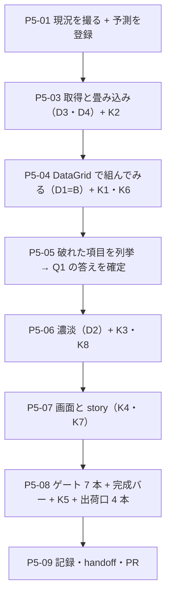

# 工程5 — 稼働表（ピボット）

> 段取り上の位置づけ: [工場の段取り.md](../工場の段取り.md) §工程5（工程4 の次・工程6 の前）
> 直前の工程: 工程4 done（**PR [#13](https://github.com/yatami0/design/pull/13) マージ済み** `5b96c77`・[実行記録 §工程4](../実行記録.md)・[DR-0092](../DR/DR-0092-the-core-holds-the-vessel-not-the-state.md)）
> 実測の記録先: [実行記録.md](../実行記録.md) §工程5

---

## 0. この工程で答えを出す問い（観測項目）★最重要

| #      | 問い                                                                                                | なぜ効くか（どの判断が変わるか）                                                                                                                                                                                                                                                                                                                                                                                                                                                                                                                                                                                                                                                                            |
| ------ | --------------------------------------------------------------------------------------------------- | --- |
| **Q1** | ★★ **`DataGrid` を拡張するか、`PivotTable` を新設するか**                                            | 段取り §工程5 Q1。🟥 **「列が動的に生える」は既存 API で機械的には書ける**——`columns` はただの配列なので、期間から日付列を生成して `accessor` にその日をクロージャで閉じ込めればよい（着手前実測 4）。**だから「書けるか」は問いにならない。**★ **問いは「書けたものが読めるか」**——`DataGridColumn` の書式フラグ（`kind` / `emphasis`）は**列単位**で、ピボットが要求する**セル単位**の強弱を表せない。行ヘッダ（人名）の固定も無い（素材層 `table` にあるのは `overflow-x-auto` だけで sticky は無い）。🟥 **先に断定しない**——**まず `DataGrid` で組み、書けなかった項目を列挙してから決める**（D1）。**列挙されたものが「別部品が要る理由」の全量**になる |
| **Q2** | ★ **濃淡（ヒートマップ）はトークン語彙で表せるか**                                                  | 段取り §工程5 Q2。🟥 **着手前実測でほぼ答えが出ている**——`src/styles/tokens.css` の色は **semantic 2 系統だけ**（`--color-success` / `--color-warning` の線色 ＋ `--color-fill-{success,warning,danger,neutral}` の面色）で、**段階（scale）を持つ色は 1 つも無い。**★ だから問いは「表せるか」ではなく **「表せないと分かったとき、どこに置くか」**（① 層に段階を新設する／部品の内部実装にする／濃淡をやめる）。**[指摘 8](../共通コンポーネント思想への指摘.md)（① 層は「値の作り方」を分類しない）の再演**が着手前に確定している |
| **Q3** | 🆕 **「実 API に繋ぐ日に書き換わるのは 3 点だけ」は、別のクエリ形でも保たれるか**（工程2 Q3 の 3 度目） | 🟥 **同じ「期間」が 2 つの違うクエリ形に化ける。**一覧は `updated_on=><YYYY-MM-DD\|YYYY-MM-DD`（Redmine 固有の演算子記法）、稼働表は **`spent_on` の `from` / `to` の 2 パラメータ**（MSW ハンドラもそう受けている・着手前実測 1）。`period.ts` が持つのは `toUpdatedOnParam` **だけ**。★ **コアの `PeriodSelect` は 1 つのまま、対応表が 2 本になるか**——工程3 D3=C「**コアは語彙、題材は対応表**」の 2 例目の検体。**対応表が増えるのは仕様どおりか、それとも語彙の設計ミスか**がここで分かる                                                                             |
| **Q4** | 🆕 ★ **畳み込み（`TimeEntry[]` → 人 × 日）はどの層が持つか**                                        | [DR-0092](../DR/DR-0092-the-core-holds-the-vessel-not-the-state.md)（**コアは器を持ち、状態は持たない**）の **2 度目の適用**。工程4 は「編集の状態」で答えたが、**集計は状態ではない**ので同じ答えになるとは限らない。🟥 **[DR-0088](../DR/DR-0088-core-subject-boundary-is-decided-by-two-questions.md) の 2 問を当てる**——① 「行 × 列に畳む」は Redmine を知らない repo でも意味が通る（**コア候補**） → ② **何を畳むか（稼働・工数・人）は有限の語で言えるか。**★ **予測は「コアは畳まない」**（器だけ受け取る）。**予測が外れたら DR-0092 の射程が狭まる**                                                                                                                            |
| **Q5** | 🟨 **役割 9 カテゴリに席が無い部品が 4 件目になるか**                                               | 工程4 で **1 工程に 3 件**出た（`Field` / `DescriptionList` / `Timeline` → [指摘 14](../共通コンポーネント思想への指摘.md)）。DataDisplay は `Table, DataGrid, List, Tree, Tag, Statistic, Chart` で、**ピボットの席は無い**（`Statistic` は指標タイル寄り）。★ **[未決 #25](../handoff.md)「指摘の偏りは規定の細かさか使い込みの量か」の材料**——**使い込むほど出るなら (b)**。🟥 **思想は書き換えない**（ユーザーの持ち物）                                                                                                                                                                                                                                                        |

> **Q1 が本体。**Q2 は Q1 のセル側の細部、Q3 は工程2 の宿題の 3 度目、Q4 は DR-0092 の射程確認、Q5 は分類の話。
> 🟥 **この工程ではチャート・ガントに触らない**（工程6 で素材源を調査してから）。
> 🟥 **稼働表の「編集」も作らない**——段取りは稼働表を**閲覧**として置いている。**予定列（capacity）も作らない**（下記）。
>
> 🟥 **データの欠落を先に確認しておく**——[データモデル §欠落 ④](../データモデル.md) は
> **「稼働可能時間（capacity）と非稼働日は Redmine の API に無い」**と実測済みで、
> **「稼働表は当面『実績のみ』」**と決めている。**予定 / 空きの列は作らない**（作るなら工場側の定数になり、
> 「モックは実 API が返せるものしか返さない」（[DR-0086](../DR/DR-0086-redmine-has-no-baseline-for-evm.md)）を破る）。

### 0.1 赤テストの設計（🟥 作る前・作った直後に打つ）

**本 repo は「対象 0 件で緑」を通算 16 例踏んでいる**（工程3 K1・工程4 K1-b はいずれも 17 例目にならなかった）。
🟥 **集計はこの形が編集より出やすい**——**空の表と「絞り込んだ結果 0 件の表」は見た目が同じ**で、
**畳み込みが 1 行も走っていなくても、それらしい枠が描かれる。**
さらに [DR-0090](../DR/DR-0090-token-classes-were-silently-dropped-by-tailwind-merge.md)（**prop は在るが作用が無い**）の教訓があるので、
**「指定したか」ではなく「効いたか」を測る**——濃淡は**実際の色**を読む。

| 検体   | 中身                                                                                                                                       | 期待                                                                                              | 外れたときの意味                                                                                                                                                                                                                                                       |
| ------ | ------------------------------------------------------------------------------------------------------------------------------------------ | --------------------------------------------------------------------------------------------------- | --- |
| **K1** | ★ 稼働表を開き、**セルの合計と `GET /time_entries.json` が返した `hours` の総和を突き合わせる**                                            | 🟥 **一致するはず**（畳み込みが全件を拾っている）                                                 | ずれたら畳み込みの取りこぼし。🟥 **「表に数字が出ている」だけでは足りない**——**1 セルでも合っていれば全部合っているように見える。**総和で押さえる。🟥 **`total_count` > 返却件数のとき（ページング）は必ずずれる**ので、**ページングを踏んだかも一緒に記録する** |
| **K2** | ★ 期間セレクタを動かし、**飛んだ URL を証拠として残す**（工程3 K1 と同じ形）                                                              | 🟥 **`from=YYYY-MM-DD` と `to=YYYY-MM-DD` が載り、列数と絵が変わるはず**                          | 載らなければ **UI は動くが取得に効いていない**（工程3 K1 が警戒した形）。🟥 **`updated_on=><…` が飛んでいたら Q3 の答えが「対応表を分けそこねた」**——**一覧の変換を流用してしまった証拠**なので、そのまま記録する                                                    |
| **K3** | ★ **濃淡を作った場合のみ**——段階の違う 3 セルの **`getComputedStyle` の実効色**を読む                                                     | 🟥 **3 つとも違う色が出るはず**                                                                   | 同じ色なら [DR-0090](../DR/DR-0090-token-classes-were-silently-dropped-by-tailwind-merge.md) の再演（**指定はしたが効いていない**）。🟨 **濃淡を作らないと決めた場合は「対象 0 件」と明記する**（打たずに緑にしない）                                                |
| **K4** | 画面（`src/redmine/screens/**`）に任意値クラス（`w-[220px]` / `p-4` / `text-gray-600`）を書く ＋ 新部品に語彙外の値を渡す                  | 🟥 **前者は eslint（`no-arbitrary-value` ＋ 工程3 D11 の画面層ブロック）、後者は `tsc` が赤になるはず** | 緑なら**新しく作ったファイルが射程に入っていない**（[DR-0040](../DR/DR-0040-frame-leaks-when-a-layer-is-added.md) の形）。🟥 **工程3 で画面層ブロックを張ったので「足す前から赤」が正しい**                                                                          |
| **K5** | 🟥 `dist/` を before / after で diff。**JS・`.d.ts`・静的の 3 本を別々に見る**                                                             | **コアの新部品は増える**／**題材（`src/redmine/**` ・画面）は 1 件も増えない**                    | 題材が混ざったら [DR-0085](../DR/DR-0085-three-independent-scopes-decide-what-ships.md) の 3 本のどれかが塞げていない。🟨 **`dependencies` が 1 件も増えていないこと**も見る（工程4 D13 の形）                                                                       |
| **K6** | 🆕 ★ **列が 90 本のときの描画**（四半期＝約 90 日）を story で作る                                                                         | 🟥 **横スクロールで最後の列まで到達でき、行ヘッダ（人名）を見失わないはず**                       | 見失うなら **Q1 の答えが「別部品」に倒れる証拠**——`table-container` の `overflow-x-auto` だけでは足りない（着手前実測 4）。**倒れたことを証拠として残す**（幅と可視状態を実測）                                                                                    |
| **K7** | 🆕 **題材 story を足したら `node tools/title-map-check.mjs` を回す**（工程4 D4=B で置いた検査の初運用）                                    | 🟥 **`⑤ 題材（Redmine）` 配下の新しい title が `titleMap` に無ければ、検査が落ちるはず**          | 落ちなければ**検査が届いていない**（工程4 の初版は `titleMap` の key が空白を落とした形なのを見誤って誤判定した実績がある）。🟦 **検査はゲートに入れない**——同期を打つ前に人が回すもの                                                                             |
| **K8** | 🆕 **語彙を 1 語でも足したら、その prop の効果を実寸／実効色で測る**（[DR-0090](../DR/DR-0090-token-classes-were-silently-dropped-by-tailwind-merge.md) の宿題 ①） | 🟥 **指定した語のとおりの実寸／実効色が出るはず**                                                 | 出ないなら **`src/lib/tw-merge.ts` への追記漏れ**——**語彙の写しが `tokens.css` と `tw-merge.ts` の 2 箇所にあり、機械で守られていない**（工程外の修正が残した宿題）。🟨 **1 語も足さなかったら「対象 0 件」と明記する**                                             |

🟥 **各検体は「赤を確認 → 戻して緑を確認」まで 1 セット。**戻し忘れ防止に `git status` で終了確認する。
🟥 **K1・K2 は目で見て終わりにしない。**飛んだ URL と件数を機械で出して数える（工程2〜4 で 3 本書いた `tools/*-probe.mjs` と同じ形）。

---

## 1. 前提

> ★★★ 🆕 **2026-08-09 更新（ユーザー指示で部品軸を中断し、この工程から再開する）。**
> **確認待ちは 1 件も無い。**🟦 **D7（`@storybook/addon-vitest`）は部品3 D7=A で決着済み**——
> **既に入っていて、ゲートは 7 本になっている**（`pnpm test-storybook`）。→ **P5-02 は不要になった。**
> 🟥 **§1 のベースラインは古い**（`e371484` 時点）。**P5-01 で撮り直す**——差は下表のとおり。

- **直前の工程**: 工程4 done（[手順書](工程4_一覧から詳細_編集あり.md)・[DR-0092](../DR/DR-0092-the-core-holds-the-vessel-not-the-state.md)）
  ＋ `/design-sync` 2 回（2026-08-08 / 2026-08-09）
  ＋ 🆕 **部品軸 6 本**（部品1〜部品6・[PR #14〜#20](https://github.com/yatami0/design/pulls)）
- 🆕 **この工程で新しく効く前提**（部品軸が残したもの・**全部この工程に効く**）
  - 🟥 **新しい部品は [完成バー](../部品の完成バー.md) を通す。**面①（描画された）と面②（a11y）は
    **`pnpm test-storybook` で全 story に自動で掛かる**ので、**書かなくても掛かる。**
  - 🟥 **面④（語彙の効果）は書かないと掛からない**——**`PivotTable` を新設するなら
    `src/stories/measure.ts` を使って実効値を測る story を 1 本書く**（[台帳 §5.5](../部品の完成バー_台帳.md)）。
    ★ **D2（濃淡）はまさに「語が効いたか」を測る対象。**
  - 🟦 **ゲートは 7 本**（`pnpm test-storybook` が 7 本目）。**ゲート外の計測器が 4 本ある**
    （`opened-overlay-check` / `coverage` / `self-check` / `typecheck:tools`）——**打つのは締めで 1 回でよい。**
  - 🟨 **ゲートを 8 本目にするかの判断は保留のまま。この工程をブロックしない。**
- **ブランチ**: Conductor の作業ブランチ。完了したら `gh pr create --base main`。🟥 **マージは人**（[DR-0068](../DR/DR-0068-merge-through-pull-requests.md)）
- **依存は厳密ピン**（[DR-0080](../DR/DR-0080-strict-pins-stay-for-reproducibility.md)）
- **環境**: 🟦 **穴 ① は塞がったまま**（新しい worktree で `pnpm i --frozen-lockfile` が
  `pnpm-workspace.yaml` を生やさずに exit 0 ＝ **3 回連続で確認**）。
  🟨 穴 ② は残る（mise が非対話シェルで効かない → `export PATH="$HOME/.local/share/mise/installs/node/24.18.1/bin:$PATH"`）

### ゲートのベースライン（🆕 **現行**・2026-08-09・部品6 完了時 = `0bd09e7`）

🟥 **P5-01 で必ず撮り直す**（下表は部品6 の締めの実測）。

| ゲート | 現行 | 🟥 旧表（`e371484`）との差 |
| --- | --- | --- |
| `pnpm typecheck` | 🟦 緑 | — |
| `pnpm lint` | 🟥 **error 50 ／ warning 1** | **+8**（全部素材層・**自作分の赤は 0**） |
| `pnpm build` | 🟦 緑・**dist 85**・`design.mjs` **92,605 B** | dist +11 |
| `pnpm format:check` | 🟦 緑 | — |
| `pnpm spell` | 🟦 緑・**362 ファイル** | +56（md が増えた） |
| `pnpm build-storybook` | 🟦 緑・story **58 ファイル / 130 件** | +9 ファイル・**+50 story** |
| 🆕 **`pnpm test-storybook`（7 本目・バー）** | 🟦 **130 / 130 緑** | 🆕 **旧表に無い**（部品3 D7=A で足した） |
| （ゲート外）a11y | 🟦 critical 0 ／ 🟨 serious **148**・色の組 **9** ／ 保留 **23**（未分類 0） | 🆕 |
| （ゲート外）`coverage` | 🟥 **面④ 10/22** ／ 🟥 **主張 0 本 103/130** | 🆕 |

旧ベースライン（`e371484`・工程4 直後・参考）

| ゲート                | 実測                                                        | handoff の表との差                                                                                                                                                                       |
| --------------------- | ----------------------------------------------------------- | ---------------------------------------------------------------------------------------------------------------------------------------------------------------------------------------- |
| `pnpm typecheck`      | 🟦 緑                                                       | 一致                                                                                                                                                                                       |
| `pnpm lint`           | 🟥 **error 42 ／ warning 1**                                | 🟦 **内訳まで一致**（`no-arbitrary-value` **32** ／ `restrict-template-expressions` 4 ／ `no-confusing-void-expression` 4 ／ `no-unnecessary-condition` 1 ／ `set-state-in-effect` 1 ／ warning は `incompatible-library`） |
| `pnpm build`          | 🟦 緑・**dist 74 ファイル**・`design.mjs` **83,784 B**      | 一致                                                                                                                                                                                       |
| `pnpm format:check`   | 🟦 緑                                                       | 一致                                                                                                                                                                                       |
| `pnpm spell`          | 🟦 緑・**306 ファイル**                                     | 🟨 **表は 305**（2026-08-09 に 303 → 305 へ訂正済み）。**差分 1 は OBS-0016 で、新しい赤ではない**                                                                                        |
| `pnpm build-storybook`| 🟦 緑・story **49 ファイル**・`index.json` **80 件**        | 一致                                                                                                                                                                                       |

### 現況の配線（2026-08-09 実測。この工程で動く箇所の全量）

| #   | 箇所                                        | 現況                                                                                                                                                                                                                                              | 動かし先        |
| --- | ------------------------------------------- | ------------------------------------------------------------------------------------------------------------------------------------------------------------------------------------------------------------------------------------------------- | --------------- |
| 1   | `src/mocks/handlers.ts`                     | 🟦 **`GET /time_entries.json` は工程2 から実装済み**。`from` / `to` / `user_id` / `project_id` ＋ ページングを受ける。`GET /users.json` もある                                                                                                     | Q1・K1・K2      |
| 2   | `src/redmine/client.ts`                     | 🟦 **`fetchTimeEntries(query)` / `fetchUsers()` も実装済み**。🟥 **`fetch` を書いてよいのはこのファイルだけ**（工程3 D11）                                                                                                                        | Q3・D4          |
| 3   | `src/redmine/model.ts`                      | `TimeEntry { id, issueId, project, user, activity, hours, comments, spentOn }`。★ **`spentOn` のコメントに「稼働表も EVM の AC もこの 1 フィールドで畳む」と明記**——**工程2 が工程5 を見越して設計している**                                       | ★ Q4・D3        |
| 4   | `src/components/DataDisplay/DataGrid.tsx`   | `data` ＋ `columns: DataGridColumn[]`（`key` / `header` / `accessor(row)` / `kind` / `emphasis`）＋ `onRowSelect` / `empty`。🟥 **`accessor` は行だけを見る**・**書式フラグは列単位**・**行ヘッダ固定は無い**。素材層 `table` は `overflow-x-auto` のみ | ★ Q1・D1・K6    |
| 5   | `src/styles/tokens.css`                     | 🟥 **色は semantic 2 系統だけ**——`--color-success` / `--color-warning`（線）＋ `--color-fill-{success,warning,danger,neutral}`（面）。**段階を持つ色は 0**。しかも **semantic をパレット色への参照で定義**している（`var(--color-emerald-600)` 等） | ★ Q2・D2        |
| 6   | `src/redmine/period.ts`                     | `resolvePeriod` / `toUpdatedOnParam` / `periodToQuery`。🟥 **`updated_on` 専用**（`><a\|b` の演算子記法）。**`spent_on` 用の変換は無い**                                                                                                          | ★ Q3・D4        |
| 7   | 役割 9 カテゴリ（[思想](../共通コンポーネント思想.md)） | DataDisplay = `Table, DataGrid, List（データ）, Tree, Tag, Statistic, Chart`。🟥 **ピボットの席は無い**                                                                                                                                          | Q5・D5          |
| 8   | `src/lib/fixtures/issues.ts`                | 工程4 D10=B で据え置き。**次の再判定は「コアの story が MSW を要求したとき」**と申し送られている。🟥 **稼働の fixture は無い**                                                                                                                    | ★ D6            |
| 9   | `tools/`                                    | `edit-probe.mjs` / `visual-probe.mjs` / `dead-class-scan.mjs` / `title-map-check.mjs`。🟥 **工程2〜4 で `*-probe.mjs` を 3 本書いた**——**同じ形が 3 工程連続**                                                                                    | ★ D7            |
| 10  | `.design-sync/conventions.md`               | 🟥 **header が名指ししていない出荷部品が 8 件**（[OBS-0016](../OBS/OBS-0016_headerが名指ししていない出荷部品8件をどう埋めるか.md)・2026-08-09 起票）。**この工程が部品を足すと 9 件目になる**                                                    | D8              |
| 11  | 出荷入口                                    | **4 本**（JS の到達可能性 ／ dts の `include` ／ `publicDir` ／ story の `title`）。4 本目は `tools/title-map-check.mjs` が守る（工程4 D4=B・**未運用**）                                                                                        | K5・K7          |

## 2. 着手前に決めること（判断ポイント）

> D1・D2 は [工場の段取り §工程5](../工場の段取り.md) の Q1・Q2 に対応する。D3 以降は手順書起こしの実測で増えた分。
> 🟨 **全件、推奨どおりの Claude 判断（事後承認待ち）・全件 🟦 戻せる。**
> ✅ ~~**D7 だけは着手前に問う**~~ **不要になった**（部品3 D7=A で決着済み）。🟦 **この工程に確認待ちは 1 件も無い**——**D1〜D6・D8 は推奨どおりの Claude 判断（事後承認）で進める。**
> 実行中に §2 に無い選択肢が出たら、**その場で決めずにここへ追記してから進む**。

| #      | 論点                                                                                                          | 選択肢                                                                                                                                                    | 決定                          | 根拠                                                                                                                                                                                                                                                                                                                                                                                                                                                                                                                                                                                                                                                                                                                                                                                                                                                                                                                                                                                          | 戻せるか                                    |
| ------ | --------------------------------------------------------------------------------------------------------------- | ----------------------------------------------------------------------------------------------------------------------------------------------------------- | ----------------------------- | --- | ------------------------------------------- |
| **D1** | ★★ **ピボットを `DataGrid` で組むか、`PivotTable` を新設するか**（Q1）                                        | A: 最初から新設 ／ B: **まず `DataGrid` で組み、破れた項目を列挙してから決める** ／ C: `DataGrid` を拡張する（`accessor` にセル情報を渡す等）              | **B**                         | 🟥 **A は「書けない」と決めつけている**——着手前実測 4 のとおり、**列の動的生成は機械的には書ける**（`columns` はただの配列）。**書けるものを書かずに新設すると、新設の理由が「なんとなく」になる。**★ **B なら Q1 の答えが「破れた項目の一覧」という形で出る**——これは段取りが求めている答え（「既存 API で表せるか」）そのもの。🟨 **予測**: 破れるのは ① **セル単位の強弱**（`kind` / `emphasis` は列単位） ② **行ヘッダの固定**（K6） ③ **合計行・合計列**（`DataGrid` に footer の概念が無い）の 3 点。**予測を P5-01 で登録してから測る**（[DR-0076](../DR/DR-0076-capture-the-run-not-just-the-output.md)）。**C は却下**——`accessor` の引数を増やすのは**既存 5 部品の契約を動かす**（`DataGrid` は一覧が本番で使っている）。🟥 **B で「破れなかった」場合は新設しない**——それも立派な答え | 🟦（B → A は捨てて作り直すだけ）            |
| **D2** | ★ **濃淡（ヒートマップ）をどう符号化するか**（Q2）                                                            | A: ① 層に段階トークンを新設（`--color-scale-*`） ／ B: **部品の内部実装として持つ**（語彙にしない） ／ C: 濃淡をやめて別の符号化（数値のみ／バー幅）      | **B（🟥 P5-04 の実測後に確定）** | ★ **先例が同型でそこにある**——`DataGrid` の `CELL_KIND`（`font-mono tabular-nums`）は **「語彙ではなく部品の内部実装」**として持たれており、**利用側が書けるのは `kind: 'numeric'` だけでクラス名は境界を越えない**（手8d D10=(b)）。**濃淡も同じ形にできる**（利用側は `intensity` のような有限の語だけを渡す）。🟥 **A は「値の作り方」を ① 層に持ち込む**——**[指摘 8](../共通コンポーネント思想への指摘.md) が名指ししている当の問題**で、**段階の刻み方（何段か・線形か対数か）は稼働表の都合**であって語彙ではない。しかも **`tokens.css` は semantic をパレット色への参照で定義している**（着手前実測 5）ので、段階を足すと**パレットへの依存がもう 1 段増える**（`.design-sync/NOTES.md` 見張り #10 の論点）。**C は最後の手段**——🟨 **ただし「器（依存 0）で済む形を先に探す」（工程4 の一般則）の色版として、C を先に検討する価値はある。**🟥 **どれに倒すにせよ Q2 の答えは「① 層では表せなかった」という実測から書く**——**表せないことを先に示してから置き場を決める** | 🟦                                          |
| **D3** | ★ **畳み込み（`TimeEntry[]` → 人 × 日）をどの層が持つか**（Q4）                                              | A: コアの部品が畳む（生の `TimeEntry[]` を受け取る） ／ B: **題材が畳み、コアは畳んだ結果だけを受け取る** ／ C: hook をコアに置く（`usePivot()`）          | **B**                         | ★ **[DR-0092](../DR/DR-0092-the-core-holds-the-vessel-not-the-state.md)（コアは器を持ち、状態は持たない）の 2 度目の適用。**[DR-0088](../DR/DR-0088-core-subject-boundary-is-decided-by-two-questions.md) の 2 問: ① 「行 × 列に畳む」は他所でも意味が通る（コア候補）→ ② 🟥 **何を畳むかは有限の語で言えない**（稼働・工数・件数・金額…無限）→ **コアは器だけ持ち、中身は使う側に返す。**A は却下——**コアが `TimeEntry` を知る**（Redmine の型が公開 API に出る＝[DR-0072](../DR/DR-0072-no-passthrough-of-dependency-types.md) の再演）。C も却下——**`useListDetail` の先例はあるが、あれは「開閉」という有限の語**で、集計は無限。🟥 **これは予測**（Q4 の答え）**であって前提ではない**——**B で組んで破れたら、破れた形を証拠に §2 へ追記する** | 🟦                                          |
| **D4** | ★ **期間 → `spent_on` クエリの変換をどこに置くか**（Q3）                                                     | A: `period.ts` に `toSpentOnParams` を足す（**対応表が 2 本になる**） ／ B: `periodToQuery` を汎用化して 1 本にする ／ C: 画面で組む                       | **A**                         | ★ **工程3 D3=C「コアは語彙、題材は対応表」の 2 例目の検体。**`PeriodSelect`（コア）が知っているのは「今週」という**語**だけで、**それが `updated_on=><a\|b` になるか `from`/`to` になるかは Redmine の都合**（題材）。→ **対応表が 2 本になるのは仕様どおり。**🟥 **B は却下**——2 つのクエリ形は**パラメータの個数も記法も違う**（1 個の演算子記法 vs 2 個の日付）ので、汎用化すると**「どちらでもない形」**になる（工程3 が `STATUS_OPTIONS` と実体一覧で踏んだのと同じ、**同じ名前の別物**）。C は却下（`src/redmine/screens/**` が変換を持つと Q3 が破れる）。🟨 **`resolvePeriod` は共通で使える**——**割れるのは「範囲 → クエリ」の 1 段だけ**。**この「どこまで共通でどこから割れるか」が Q3 の答えの形** | 🟦                                          |
| **D5** | **新部品の役割カテゴリ**（Q5）                                                                                | A: **DataDisplay に置く** ／ B: 新カテゴリを作る ／ C: 部品にせず画面で組む                                                                               | **A ＋ 席が無ければ指摘 15**  | **B は却下**——🟥 **[共通コンポーネント思想.md](../共通コンポーネント思想.md) はユーザーの持ち物で、カテゴリの新設は思想の改訂**（工程4 D7・D14 と同じ論法）。A の根拠は先例（`DataGrid` / `Table` が既に DataDisplay）。C は却下——**行 × 列の交点の見せ方は見た目の管轄権がコアにある**（[DR-0070](../DR/DR-0070-product-layer-boundary-rule.md)）。🟨 **一次情報で確認してから確定する**（Ant / Carbon がピボットをどこに置いているか）——工程4 D7 が Ant の `group: Data Display` を確認して決めた手口をなぞる | 🟦                                          |
| **D6** | **新部品の story のデータをどこから取るか**（工程4 D10 の申し送りの再判定）                                    | A: `src/lib/fixtures/` に稼働 fixture を足す ／ B: **story 内にインラインで置く** ／ C: story を MSW 由来にする（fixtures 全廃へ動く）                     | **B**                         | 工程4 D10 は「**次の再判定は『コアの story が MSW を要求したとき』**」と条件を明記して送った。🟥 **この工程は条件に当たらない**——**D3=B なら部品が受け取るのは「畳んだ結果」**で、**取得も畳み込みも題材側の話**。部品の story に要るのは **matrix 1 個**だけで、**fixtures という共有の棚に置くほどのものではない**（`issues.ts` は 3 story が共有しているから棚に在る）。→ **B。**C は却下——**全廃を動かすと変数が 2 つになる**（新部品と fixtures 方針）。🟨 **申し送りは据え置きのまま次工程へ**（条件を書き換えない） | 🟦                                          |
| **D7** | ✅ ~~**`@storybook/addon-vitest` を入れるか**~~ **決着済み**（**部品3 D7=A・ユーザー判断 2026-08-09**）。**入っていて、ゲート 7 本目になっている。この工程で問うことは何も無い**      | A: **入れる**（実装の前に単独で） ／ B: 入れない ／ C: 先送り                                                | ✅ **A（決着済み）** | ★ **工程4 が「回数ではなく『Playwright の手順が 3 工程連続で同じ形になったか』を理由にする」と条件を指定して送ってきた。**🟦 **条件は満たされている**——工程2・3・4 で `tools/*-probe.mjs` を **3 本**書いた（着手前実測 9）。★★ 🟥 **さらに、未決 #14 に唯一残っていた論点が消えている**——未決 #14 は「**残る論点は移送コスト（依存が増える＝手9 に効く）だけ**」と書いているが、**手9 は [DR-0078](../DR/DR-0078-repo-becomes-a-ui-factory-for-a-core-design-system.md) で廃止された。**加えて**工程4 D13 で `devDependencies` は出荷しないことが確定している**ので、**移送コストは 0。**→ **止めている理由が 1 つも残っていない。**「入れるべき」側の証明は既に 3 度出ている（[DR-0048](../DR/DR-0048-build-storybook-does-not-render.md)＝`storybook build` は story が実行時に落ちても exit 0・工程2/3/4 で 3 回踏んだ）。🟥 **入れるなら実装の前に単独で入れ、わざと落ちる story で発火を確認する**（変数を 1 つずつ動かす）。C は却下——**先送りの理由が言語化できない**（[DR-0077](../DR/DR-0077-abolish-the-two-occurrence-rule.md) 後は「回数」も「なんとなく」も理由にならない） | 🟦（`pnpm remove` で戻せる・出荷物に影響なし） |
| **D8** | **[OBS-0016](../OBS/OBS-0016_headerが名指ししていない出荷部品8件をどう埋めるか.md) の 1 変数実験をこの工程でやるか** | A: 新部品 1 件を header に足して測る ／ B: **やらない（検体数の記録だけ）** ／ C: 8 件まとめて足す                                                        | **B**                         | 🟥 **A は「測れない」——この工程は design agent に組ませない。**[DR-0069](../DR/DR-0069-adding-prohibitions-to-the-header-degraded-the-output.md) の実測は**組ませた出力を数えて**得られたもので、**header を書き換えただけでは効果が観測できない**（**「名前の実在は効果を保証しない」の 2 度目**——2026-08-09 の同期が指摘したのと同じ罠）。C は論外（多変数）。→ **B: `.design-sync/NOTES.md` 見張り #21 と OBS-0016 に「検体が 8 → 9 件になった」と追記するだけ。**🟨 **実験は「design agent に組ませる周回」を持つ工程／回でやる**——**その機会が来たら OBS-0016 §2 の実験 1・2 をそのまま実行できるように書いてある** | 🟦                                          |

## 3. 成果物

- **コア（出荷する）**
  - 稼働ピボットの部品（**D1 の結果しだいで `DataGrid` のままか新設か**）＋ story
  - 🟨 濃淡の表現（**D2 の結果しだい**。作らない判断もありうる）
- **題材（出荷しない）**
  - `src/redmine/` に稼働の畳み込み（D3=B）＋ `toSpentOnParams`（D4=A）＋ hook ＋ 稼働表の画面
  - `⑤ 題材（Redmine）` 配下の story ＋ `titleMap` への `null` 追加（K7）
- **検証装置**
  - ✅ ~~`@storybook/addon-vitest`~~ **既に入っている**（部品3 D7=A）
  - K1・K2 の証拠出力（飛んだ URL と件数）
  - 🆕 🟥 **新部品を作った場合は [完成バー](../部品の完成バー.md) の面④ の story を 1 本**
    （`src/stories/measure.ts` の `styleOf` / `resolveColor` で**濃淡が効いているか**を実効値で測る）
- **記録**
  - [実行記録.md](../実行記録.md) §工程5・[handoff.md](../handoff.md) の更新
  - Q1〜Q5 の答え（**DR に落ちるものは起票**）・指摘 15（**Q5 が席無しに倒れた場合**）

## 4. 作業フロー

## 5. 手順

### P5-01 現況を撮る ＋ 予測を登録する

- **目的**: 測る前に予測を書く（[DR-0076](../DR/DR-0076-capture-the-run-not-just-the-output.md)。工程3 で「予測が実行されうるかを検算せずに登録した」失敗を踏んでいる）
- **実行**: 🟥 **ゲート 7 本を実測**（§1 の**現行**表と突き合わせ）／ `dist/` の before を保存 ／ 🆕 `pnpm coverage` の before
- **観測**: 全 Q。**とくに D1 の予測 3 点（セル単位の強弱・行ヘッダ固定・合計行）を先に書く**
- **判断**: 🟥 **予測が「実行されうるか」を検算する**——**D1 の予測は「`DataGrid` で組んでみる」経路が実際に走らないと測れない。**P5-04 が走ることを確認してから登録する

### ~~P5-02 D7 — `@storybook/addon-vitest` を単独で入れる~~ ✅ **削除**

**部品3 D7=A（ユーザー判断・2026-08-09）で既に入っており、ゲート 7 本目になっている。**
**赤の伝播も確認済み**（わざと 1 story を落として `exit 1`・戻して `exit 0`）。
→ **P5-01 の次は P5-03。**

### P5-03 取得と畳み込み（D3・D4）＋ K2

- **実行**: `period.ts` に `toSpentOnParams` ／ `src/redmine/` に畳み込み ＋ hook
- **期待結果**: `from` / `to` が URL に載る
- **観測**: **Q3**（対応表が 2 本になったか・**共通で残ったのはどこまでか**）・**Q4**（畳み込みが題材に収まったか）
- **判断**: 🟥 **畳み込みがコアにはみ出したら D3 の予測が外れ**——**はみ出した理由を §2 へ追記してから進む**

### P5-04 `DataGrid` で組んでみる（D1=B）＋ K1・K6

- **目的**: ★ **この工程の芯。**「書けるか」ではなく**「書けたものが読めるか」**を見る
- **実行**: 期間から日付列を生成し、`accessor` で交点を引く。**90 列の story も作る**（K6）
- **観測**: **Q1**。🟥 **破れた項目を 1 つずつ書き出す**（予測 3 点と突き合わせ、**予測に無かったものを数える**）
- **判断**: **破れなければ新設しない**（それも答え）

### P5-05 破れた項目を列挙 → Q1 の答えを確定（＋ 新設する場合は D5）

- **観測**: **Q1・Q5**
- **判断**: 新設に倒れたら **D5**（カテゴリ）を確定し、**席が無ければ指摘 15 を起票**（🟥 思想は書き換えない）

### P5-06 濃淡（D2）＋ K3・K8

- **実行**: 🟥 **まず「① 層の語彙で表せない」ことを実測で示す**（現状 2 系統・段階 0）→ その上で置き場を決める
- **観測**: **Q2**・[指摘 8](../共通コンポーネント思想への指摘.md) の再演
- **判断**: 🟥 **語彙を 1 語でも足したら `src/lib/tw-merge.ts` にも足す**（K8。**2 箇所の写しは機械で守られていない**）

### P5-07 画面と story（K4・K7）

- **実行**: `src/redmine/screens/` に稼働表の画面 ／ `⑤ 題材（Redmine）` の story ＋ `titleMap` に `null`
- **検証**: `pnpm build-storybook && node tools/title-map-check.mjs`（K7・**検査の初運用**）
- **観測**: **Q4**（画面の `className` 0 件・任意値 0 件を保てるか——工程3・4 の実績）

### P5-08 ゲート 7 本 ＋ 完成バー ＋ K5 ＋ 出荷口 4 本

- **検証**: §1 の**現行**表と突き合わせ、**新しい赤だけを見る**。`dist/` の before / after を JS・`.d.ts`・静的の 3 本で diff
- 🆕 **新部品を作った場合は [完成バー](../部品の完成バー.md) を通す**——面①・面② は自動、
  🟥 **面④（語彙の効果）は story に書かないと掛からない**
- 🆕 **ゲート外の計測器を締めで 1 回ずつ**: `node tools/opened-overlay-check.mjs`（7/7 のまま） ／
  `pnpm coverage`（🟥 **面④ の被覆が下がっていないこと**——**下がったら止める**・部品6 D9） ／
  `pnpm self-check`（8/8） ／ `pnpm typecheck:tools`（56 のまま）
- **観測**: **Q5**・出荷面の衛生。🟨 **`dependencies` が増えていないことも見る**

### P5-09 記録・handoff・PR

- **実行**: 実行記録 §工程5 ／ handoff ／ **ベースライン表の更新** ／ `gh pr create --base main`
- **判断**: 🟥 **[段取り 未決 #7](../工場の段取り.md)（規約文書の起草時機）を締めでもう一度問う**（工程3・4 の締めで 2 回問い、いずれも「まだ」）。
  🟨 **OBS-0016 に「検体が 9 件になった」を追記する**（D8=B）

## 6. 完了条件

- [ ] 🟥 **機械ゲート 7 本**を実測し、**内訳を §1 の現行表と突き合わせた**（🟥 **赤で終わってよい。新しい赤の有無が成果物**）
- [ ] §0 の Q1〜Q5 すべてに答えが出ている（🟥 **「測れなかった」も答え。その場合は理由を書く**）
- [ ] §2 の D1〜D8 がすべて決着し、根拠が書かれている（🟦 **D7 は決着済み・確認待ちは 0 件**）
- [ ] 🆕 **新部品を作った場合、[完成バー](../部品の完成バー.md) を通している**（🟥 **面④ の story を書いた**）
- [ ] 🆕 **`pnpm coverage` の面④ 被覆が下がっていない**（部品6 D9）
- [ ] 赤テスト K1〜K8 を打った（🟨 **対象 0 件のものは「対象 0 件」と明記**——打たずに緑にしない）
- [ ] 実行記録に §工程5 の節がある・handoff が更新されている
- [ ] 🟥 **未決 #7 を問うた**（答えが「まだ」でも記録する）
- [ ] コミット済み（`<type>(P5): 要約 [工程5]`）・PR を出した（🟥 **マージは人**）

## 7. 出典

- [工場の段取り.md](../工場の段取り.md) §工程5（Q1・Q2 の出どころ）・§5 未決 #7
- [データモデル.md](../データモデル.md) §2.2 TimeEntry・§欠落 ④（**capacity は Redmine に無い**）
- [DR-0092](../DR/DR-0092-the-core-holds-the-vessel-not-the-state.md)（Q4 の下敷き）・[DR-0088](../DR/DR-0088-core-subject-boundary-is-decided-by-two-questions.md)（2 問）・[DR-0090](../DR/DR-0090-token-classes-were-silently-dropped-by-tailwind-merge.md)（K3・K8 の下敷き）・[DR-0048](../DR/DR-0048-build-storybook-does-not-render.md)（D7 の下敷き）
- [OBS-0016](../OBS/OBS-0016_headerが名指ししていない出荷部品8件をどう埋めるか.md)（D8）
- 着手前実測（2026-08-09・`main` = `e371484`）: `src/mocks/handlers.ts` L237 ／ `src/redmine/client.ts` L152 ／ `src/redmine/model.ts` L82 ／ `src/redmine/period.ts` ／ `src/components/DataDisplay/DataGrid.tsx` ／ `src/styles/tokens.css` L74-81 ／ `src/components/ui/table.tsx` L10-11
