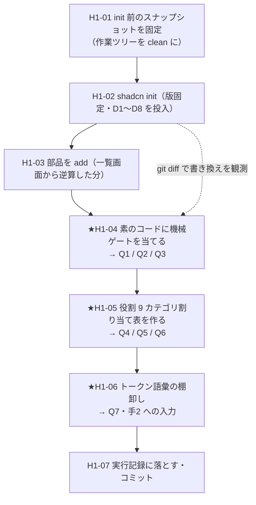
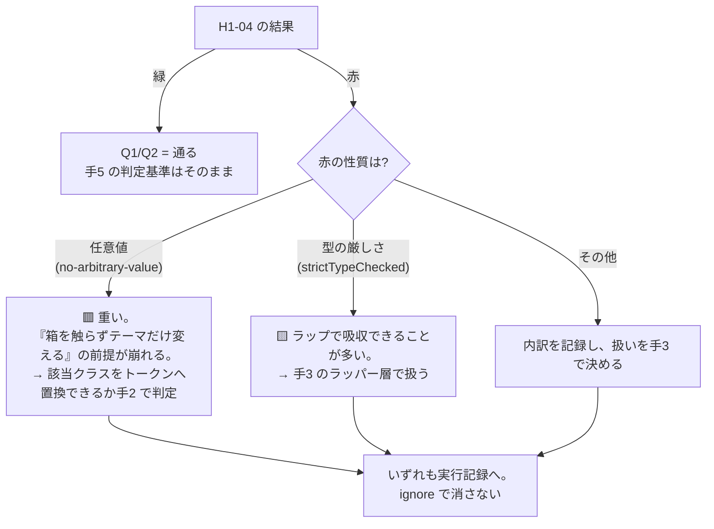

# 手1 — shadcn デフォルト導入と役割 9 カテゴリへの割り当て

> 段取り上の位置づけ: [UI検証の位置づけと段取り.md](../UI検証の位置づけと段取り.md) §5
> 部品分類の正本: [共通コンポーネント思想.md](../共通コンポーネント思想.md)
> 実測の記録先: [実行記録.md](../実行記録.md) §手1

**この手の目的は「shadcn を入れること」ではない。**入れた結果として、
**思想の 3 層に shadcn が何を供給し、何を供給しないかを確定させること**が目的。
手2（トークン語彙のマッピング）と手3（Components 層の自作）の作業範囲は、この手の観測でしか決まらない。

---

## 0. この手で答えを出す問い（観測項目）★最重要

| # | 問い | なぜ効くか（どの判断が変わるか） |
|---|---|---|
| **Q1** | shadcn の素のコードは `strictTypeChecked` を通るか | 通らないなら、移送先の PoC でも通らない。ルールを緩める／ラップする／ignore する の 3 択が発生し、**手5 の「部品を触らずに」の判定基準が変わる** |
| **Q2** | shadcn の素のコードは `tailwindcss/no-arbitrary-value` を通るか（任意値を含むか） | 含むなら、shadcn をそのまま使う限り「トークン外の値がコードに存在する」状態になる。**「箱を触らずテーマだけ変える」（OBS-0003）の前提が最初から崩れる** |
| **Q3** | `shadcn init` は `globals.css` と `tsconfig.json` をどう書き換えるか | 手で書いた設定・コメントが消えるなら、**設定の正本がツール側に移る**。手2 で書くトークンも同じ経路で上書きされうる |
| **Q4** | 63 部品を役割 9 カテゴリに割り当てたとき、素直に入らないものはどれか | 入らないものは「分類の欠陥」か「shadcn 固有の事情」のどちらか。前者なら**思想の側を直す提案**になる |
| **Q5** | Layout カテゴリ（Box / Stack / Grid / Container / Spacer / Section）の欠落は実際どれだけか | ここが手3 の自作範囲の実体。**思想が「Layout は自作テンプレで持つ」と決めた判断が、実装上も正しかったかの答え合わせ**になる |
| **Q6** | shadcn の状態の持ち方（Radix の `open`/`onOpenChange`）は、思想の「開閉は `useXxxModal()` へ」とどれだけ食い違うか | 食い違うならラッパー層が要る＝**手3 の工数がここで決まる**。ラップしない選択なら思想の側を修正する話になる |
| **Q7** | shadcn は **spacing / typography の semantic token** を持つか | 調査時点では**色と radius しか無い**（§7 出典）。持たないなら、思想①の「Layout テンプレが取れる gap/padding を semantic token に限定する」は **shadcn だけでは成立しない**＝手2 で自前の semantic spacing を定義する必要がある |

> Q7 は事前調査で「持たない」がほぼ確定している。手1 では**実物で裏を取る**（生成された `globals.css` を読む）。
> 事前調査で答えが出ている問いを手順に残すのは、**二次情報を一次情報で置き換えるため**。

---

## 1. 前提

- **直前の手**: 手0 done（`typecheck` / `lint` / `build` / `format` / `spell` すべて緑・コミット済み）
- **版**（すべて固定。PoC の ADR-0012「catalog 厳密ピン」に倣う）
  | 対象 | 版 |
  |---|---|
  | shadcn CLI | **4.15.0**（`@latest` を使わない。→ D2） |
  | tailwindcss / @tailwindcss/postcss | 4.3.3 |
  | next / react / react-dom | 16.2.10 / 19.2.7 / 19.2.7 |
  | typescript | 6.0.3 |
- **参照**
  - [共通コンポーネント思想.md](../共通コンポーネント思想.md)（役割 9 カテゴリ・フラグ・3 層）
  - shadcn/ui 公式 docs（取得日 2026-07-26。→ §7）
  - CC-Skills の `tmp-admin` 哲学（トークン値の引き継ぎ元。手2 で使う。この手では触らない）

---

## 2. 着手前に決めること（判断ポイント）

| # | 論点 | 選択肢 | 決定（推奨） | 根拠 | 戻せるか |
|---|---|---|---|---|---|
| **D1** | `tailwind.baseColor` | neutral / stone / zinc / mauve / olive / mist / taupe | **neutral**（要ユーザー確認） | tmp-admin は「濃紺 chrome / グレー canvas / 白 card」の 3 層で、canvas は無彩色。zinc は青みが乗るため濃紺 chrome と干渉しうる。純グレーの neutral が濁らない | 🟥 **不可逆**（公式が「init 後は変更不可」と明記） |
| **D2** | CLI の版 | `shadcn@latest` / `shadcn@4.15.0` | **4.15.0 に固定** | PoC は全依存を厳密ピンしている。CLI が生成するコードは成果物なので、生成器の版が動くと**再現しない**。手5 の差し替え実験は再現性が前提 | 🟦 戻せる |
| **D3** | add する部品の範囲 | 全 63 / 一覧画面から逆算した分だけ | **逆算した分だけ**（下記 H1-03 の表） | 使わない部品が lint 赤を出しても判断材料にならず、赤の内訳が濁る。9 カテゴリ割り当ては**表の上で全 63 を扱えば足りる**（コードを置く必要はない） | 🟦 戻せる |
| **D4** | shadcn のコードが lint / typecheck で赤だったときの扱い | ignore する / ルールを緩める / ラップして直す / **赤のまま記録して進む** | **赤のまま記録して進む**（§5 H1-04 の分岐図） | ignore すると **Q1・Q2 の答えが消え、手5 の判定が甘くなる**。手1 の成果物は「緑の状態」ではなく「赤の内訳」 | 🟦 戻せる |
| **D5** | DataDisplay の Table をどう供給するか | 素の `Table` のみ / `Data Table`（TanStack Table を導入） | **手1 では素の `Table` のみ**。TanStack Table の導入判断は手3 へ送る | shadcn の Data Table は単一部品ではなく **TanStack Table を使う組み立てガイド**。PoC の catalog に `@tanstack/react-table` は無く、**新規依存の追加は移送に影響する**。手1 の問い（Q1〜Q7）はどれも Table の中身に依存しない | 🟦 戻せる |
| **D6** | `tailwind.cssVariables` | true / false | **true** | false は Tailwind ユーティリティ直書きになり、**思想①「UI は semantic token だけを使う」が成立しない**。選択の余地はない | 🟦 戻せる |
| **D7** | `style` | new-york のみ（`default` は deprecated） | **new-york** | 選択肢が 1 つしかない。記録のみ | — |
| **D8** | aliases の配置 | — | `components: @/components` / `ui: @/components/ui` / `lib: @/lib` / `hooks: @/hooks` / `utils: @/lib/utils` | 手0 で入れた `paths: {"@/*": ["./src/*"]}` と整合。PoC の `apps/redmine/src/lib/` 構成とも並ぶ | 🟦 戻せる |

> **🟥 D1 だけがユーザー判断を要する。**不可逆で、かつ tmp-admin の見た目（手5）に効くため。他は上記のとおり決めて進む。

---

## 3. 成果物

| 成果物 | 内容 |
|---|---|
| `components.json` | shadcn の設定（D1・D6〜D8 の決定が固定される） |
| `src/components/ui/*.tsx` | add した部品の実体（**生成物ではなく編集する自分のコード**） |
| `src/lib/utils.ts` | `cn()` ヘルパ |
| `src/app/globals.css` | shadcn のトークン（`@theme inline` / `:root` / `.dark`）が入る |
| `package.json` | 依存が増える（`class-variance-authority` / `clsx` / `tailwind-merge` / `lucide-react` / `radix-ui` 等）＝**PoC の catalog に無い＝移送時の差分** |
| **`docs/部品カタログ.md`** | ★**この手の主成果物**。全 63 部品 × 役割 9 カテゴリ × フラグ + 欠落リスト（形式は H1-05） |
| `docs/実行記録.md` §手1 | Q1〜Q7 の答えと、赤の内訳 |

---

## 4. 作業フロー



**H1-01 を最初に置く理由**: `shadcn init` は既存ファイル（`globals.css`・`tsconfig.json`）を書き換える。
作業ツリーが汚れていると **git diff で「ツールが何を変えたか」が読めなくなり、Q3 に答えられない。**
観測のために、変更検出の基準点を先に固定する。

---

## 5. 手順

### H1-01 init 前のスナップショットを固定する

- **目的**: `shadcn init` の書き換えを git diff で観測できる状態を作る（Q3 の前提）
- **実行**:
  ```bash
  git status --short   # 空であること
  git rev-parse HEAD   # 基準点を控える
  ```
- **期待結果**: 作業ツリーが clean
- **検証**: `git status --short` の出力が空
- **観測**: なし（観測の準備）
- **判断**: なし
- **詰まったら**: 未コミットがあれば先にコミットする。**stash はしない**（init 後に戻すと diff が混ざる）

### H1-02 shadcn init

- **目的**: shadcn を導入し、設定を D1〜D8 で固定する
- **実行**:
  ```bash
  pnpm dlx shadcn@4.15.0 init
  ```
  対話で D1（baseColor）・D6（cssVariables）・D7（style）・D8（aliases）を投入する。
  非対話にできる場合はフラグで固定する（再現性のため。可能なフラグは `--help` で確認）。
- **期待結果**:
  - `components.json` が生成される
  - `src/lib/utils.ts` が生成される
  - `src/app/globals.css` に `@theme inline` / `:root` / `.dark` が追記される
  - `package.json` に依存が追加される
- **検証**: `cat components.json` が D1〜D8 の決定どおりであること
- **観測**: ★**Q3** — `git diff` で `globals.css` と `tsconfig.json` の書き換え内容を全文読む。
  特に **手0 で書いたコメントが残っているか**、`tsconfig.json` の `paths` が上書きされていないか
- **判断**: 対話が D1〜D8 に無い選択肢を聞いてきた場合は、**その場で決めずに記録し、§2 に追記してから進む**
- **詰まったら**:
  - Tailwind v4 では `tailwind.config` は空欄（公式が明記）。設定ファイルを作ろうとするなら版の想定違い
  - `@/*` エイリアスが無いと init が失敗する。手0 で入れてあるので通るはず。失敗したら `tsconfig.json` の `paths` を疑う

### H1-03 部品を add する（一覧画面から逆算）

- **目的**: 手3〜手4 で一覧画面を組むのに要る部品を揃える（D3）
- **実行**:
  ```bash
  pnpm dlx shadcn@4.15.0 add \
    button input label select checkbox badge separator \
    table pagination skeleton empty \
    dialog sheet dropdown-menu tooltip popover \
    card sidebar
  ```
  > 一覧画面から逆算した最小セット。**Data Table は入れない**（D5）。
  > 追加が要ると分かった時点で足す（手3 で確定する）
- **期待結果**: `src/components/ui/` に対応する `.tsx` が置かれる
- **検証**: `ls src/components/ui/` が add した部品数と一致
- **観測**: 各部品が引き込む依存（`radix-ui` のどのパッケージか等）を控える＝移送時の差分の実体
- **判断**: なし
- **詰まったら**: 部品名は公式の一覧が正（§7）。`sidebar` は追加の CSS 変数（`--sidebar-*`）を持ち込む

### ★H1-04 素のコードに機械ゲートを当てる

- **目的**: **shadcn を一切触らない状態**で、PoC 相当の lint / typecheck を通るかを見る（Q1・Q2）
- **実行**:
  ```bash
  pnpm typecheck
  pnpm lint
  pnpm build
  ```
  赤が出たら、内訳を必ず保存する:
  ```bash
  pnpm lint -f json > /tmp/h1-lint.json 2>&1 || true
  pnpm lint 2>&1 | tail -100
  ```
- **期待結果**: **緑とは限らない。赤でよい。**赤の内訳が取れることが目的
- **検証**: ルール別・ファイル別の件数が集計できていること
- **観測**: ★**Q1**（`strictTypeChecked` 系のルール名と件数）／★**Q2**（`tailwindcss/no-arbitrary-value` の件数と、どの部品のどのクラス名か）
- **判断**: D4 のとおり **ignore しない**。分岐は下図。



- **詰まったら**: lint が「対象 0 件」で緑になっていないか必ず疑う（PoC で実際に起きた事故）。
  `pnpm lint --debug` かファイル数の表示で、`src/components/ui/**` が検査対象に入っていることを確かめる

### ★H1-05 役割 9 カテゴリ割り当て表を作る

- **目的**: **この手の主成果物**。shadcn の 63 部品を思想の分類に載せ、欠落を確定させる（Q4・Q5・Q6）
- **実行**: `docs/部品カタログ.md` を作る。形式は下記に固定する。

  **表1: 割り当て表（全 63 部品）**

  | 部品 | 役割カテゴリ | 出所 | stateful | behaviorHook | formBound | overlay | container | 備考 |
  |---|---|---|---|---|---|---|---|---|
  | Button | Action | shadcn | false | — | false | false | true | |
  | Dialog | Overlay | shadcn | **true** | 🟥 要検討 | false | true | true | Radix が `open`/`onOpenChange` を持つ（Q6） |

  - **役割カテゴリ**: 思想の 9 つ（Action / TextInput / Selection / Layout / Overlay / DataDisplay / Navigation / Communication / Display）から必ず 1 つ。**入れ子にしない**
  - **出所**: `shadcn`（素で存在）/ `自作`（作る必要がある）/ `見送り`（今回使わない）
  - **フラグ 5 種**: 思想 §②のファセット分類をそのまま使う
  - **備考**: 分類に迷った理由・思想と食い違う点を書く。**迷いを消さずに残す**（Q4 の材料）

  **表2: 分類できなかったもの（Q4 の答え）**

  | 部品 | なぜ入らないか | 対処案 |
  |---|---|---|

  **表3: 欠落リスト（Q5 の答え）**

  | 必要な部品 | 役割カテゴリ | shadcn に無い理由 | 手3 で作るか |
  |---|---|---|---|
  | Box / Stack / Grid / Container / Spacer / Section | Layout | shadcn は**レイアウトプリミティブを提供しない**方針 | |

  **表4: 状態の持ち方の食い違い（Q6 の答え）**

  | 部品 | shadcn の実装 | 思想の要求 | 差分 | ラップの要否 |
  |---|---|---|---|---|

- **期待結果**: 上記 4 表が埋まった `docs/部品カタログ.md`
- **検証**: 全 63 部品が表1 に 1 行ずつある（漏れゼロ）。表3 に手3 の作業対象が列挙されている
- **観測**: ★Q4 / ★Q5 / ★Q6
- **判断**: 思想の 9 カテゴリに構造的な欠陥が見つかった場合、**思想を書き換えず、指摘として実行記録に書く**（思想の正本はユーザーが持つ）
- **詰まったら**: 迷ったら「入れ子は使い方であって分類ではない」（思想 §②）に戻る。
  それでも決まらないものは表2 へ送る——**表2 が空になることを目的にしない**

### ★H1-06 トークン語彙の棚卸し

- **目的**: 手2（トークン語彙のマッピング）の入力を作る（Q7）
- **実行**: 生成された `src/app/globals.css` を読み、宣言されている CSS 変数を全件書き出す
- **期待結果**: 次の 3 群に仕分けられた一覧
  | 群 | 例 | 思想の 3 層のどこか |
  |---|---|---|
  | 色（背景/前景ペア） | `--background`/`--foreground`・`--primary`/`--primary-foreground`・`--destructive`・`--border`・`--input`・`--ring`・`--chart-1..5`・`--sidebar-*` | semantic |
  | 角丸 | `--radius` と `--radius-sm..4xl`（`calc()` 派生） | semantic |
  | **余白・タイポ** | 🟥 **調査時点では存在しない見込み** | **欠落** |
- **検証**: `grep -o '\-\-[a-z-]*:' src/app/globals.css | sort -u` の全件が上表のどれかに分類されている
- **観測**: ★**Q7** — spacing / typography の semantic token が本当に無いか。
  無ければ**思想①の「gap/padding を semantic token に限定する」は shadcn だけでは成立せず、手2 で自前定義が要る**
- **判断**: ここでトークンの**値**は決めない（手5 まで shadcn デフォルトのまま）。語彙の棚卸しだけ
- **詰まったら**: Tailwind v4 の `--spacing` は 1 変数基準のスケール（OBS-0003 §2 の調査）。
  これを semantic spacing とみなすかは**手2 の判断**であって、この手では「有る／無い」の事実だけ記録する

### H1-07 実行記録に落とす・コミットする

- **目的**: 観測を残し、次セッションから読めるようにする
- **実行**: `docs/実行記録.md` に §手1 を追加 → コミット
  ```bash
  git add components.json src/ package.json pnpm-lock.yaml
  git commit -m "feat(H1): shadcn デフォルトを導入 [手1]"
  git add docs/部品カタログ.md docs/実行記録.md docs/手順/手1_shadcn導入と役割分類.md
  git commit -m "docs(H1): 部品カタログと手1 の実行記録"
  ```
- **期待結果**: `step/h1-shadcn` に 2 コミット、`main` へ `--no-ff` マージ
- **検証**: `git log --graph` で手0 と同じ形になっている
- **観測**: なし
- **判断**: なし

---

## 6. 完了条件

- [ ] `components.json` が存在し、D1〜D8 の決定どおり
- [ ] `src/components/ui/` に H1-03 の部品が揃っている
- [ ] **`docs/部品カタログ.md` の 4 表がすべて埋まっている**（表1 は全 63 部品・漏れゼロ）
- [ ] 機械ゲートを実行した。**緑でなくてよいが、赤の内訳（ルール別・件数・該当部品）が実行記録にある**
- [ ] §0 の Q1〜Q7 すべてに答えが出ている
- [ ] §2 の判断がすべて決着（特に D1 がユーザー決定済み）
- [ ] `docs/実行記録.md` に §手1 がある
- [ ] コミット済み・`main` へマージ済み
- [ ] **手2 の作業範囲が確定している**（＝トークンで自前定義が要る語彙が列挙されている）
- [ ] **手3 の作業範囲が確定している**（＝表3 の欠落リストと表4 のラップ対象）

> 最後の 2 項目が本当の完了条件。**手1 の価値は shadcn が入ったことではなく、手2・手3 の範囲が決まったこと。**

---

## 7. 出典

すべて 2026-07-26 取得。

- [shadcn/ui — Next.js Installation](https://ui.shadcn.com/docs/installation/next) — `init` の手順・`@/*` エイリアス必須・Tailwind 先行インストール
- [shadcn/ui — Components](https://ui.shadcn.com/docs/components) — 部品一覧（**63 件**。Sidebar / Data Table / Empty / Skeleton / Pagination の存在を確認）
- [shadcn/ui — Theming](https://ui.shadcn.com/docs/theming) — CSS 変数の全語彙・`@theme inline` / `:root` / `.dark` の 3 ブロック構造・カスタム色の足し方。**色と radius のみで spacing / typography は無い**
- [shadcn/ui — components.json](https://ui.shadcn.com/docs/components-json) — スキーマ全キー。`baseColor` は **init 後変更不可**・`style` は `new-york` のみ（`default` は deprecated）・v4 では `tailwind.config` は空欄
- [shadcn/ui — Tailwind v4](https://ui.shadcn.com/docs/tailwind-v4) — v4 対応の変更点（forwardRef 撤廃・`data-slot` 属性・HSL → OKLCH）
- npm registry 実測: `shadcn@4.15.0`（`registry.npmjs.org/shadcn/latest`）
