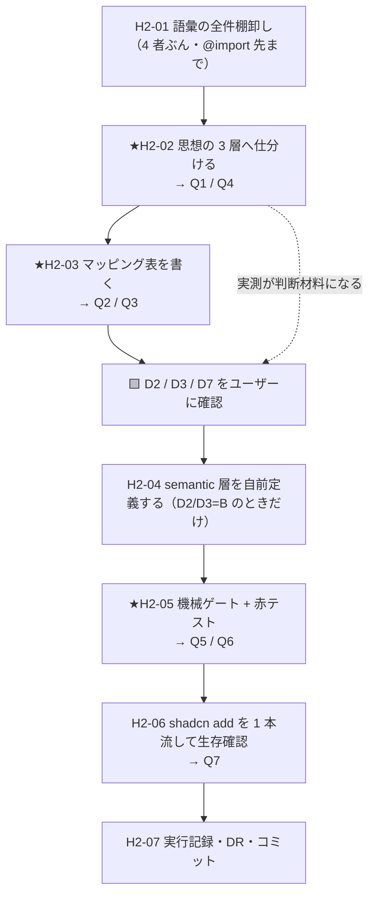

# 手2 — ① Tokens 層（語彙のマッピングと semantic 層の自前定義）

> 段取り上の位置づけ: [UI検証の位置づけと段取り.md](../UI検証の位置づけと段取り.md) §5
> トークンの決定の正本: [DR-0005](../DR/DR-0005-token-ownership-and-two-stage.md)／欠落の実測: [DR-0012](../DR/DR-0012-shadcn-supplies-no-layout-no-spacing.md)
> 部品分類の正本: [共通コンポーネント思想.md](../共通コンポーネント思想.md)
> 実測の記録先: [実行記録.md](../実行記録.md) §手2

**この手の目的は「トークンを整えること」ではない。**
思想の 3 層・shadcn の語彙・Tailwind v4 の既定・tmp-admin（+ base apple）の語彙、この **4 者がどこで噛み合い、どこで噛み合わないか**を確定させることが目的。

手5（トークン差し替え実験）は、理想的には**ここで作るマッピング表を上から順に実行するだけ**になる。
**噛み合わない箇所＝手5 の赤の候補**であり、それを手5 より前に名指ししておくのがこの手の価値。

🟥 **値は決めない。**shadcn デフォルトのまま手5 まで進む（[DR-0005](../DR/DR-0005-token-ownership-and-two-stage.md) 決定3）。この手で作るのは**語彙とマッピング**だけ。

---

## 0. この手で答えを出す問い（観測項目）★最重要

| #      | 問い                                                                                                                                   | なぜ効くか（どの判断が変わるか）                                                                                                                                                              |
| ------ | -------------------------------------------------------------------------------------------------------------------------------------- | -------------------------------------------------------------------------------------------------------------------------------------------------------------------------------------------- |
| **Q1** | 思想の 3 層（primitive / semantic / component）は、shadcn + Tailwind v4 の構造にそのまま載るか。**載らない層はどれか**                  | 載らない層があるなら、思想①「UI は semantic だけを使う」は**この構成では宣言できない**。PoC の **OBS-0003（案A/案B）** へ戻す材料の中身が変わる                                                 |
| **Q2** | tmp-admin（+ base apple）の語彙を shadcn 語彙へ写すと、① 1:1 ② 多:1 / 1:多 ③ **写す先が無い**、はそれぞれ何件か                         | ③ が多いほど、手5 は「値の差し替え」ではなく「**語彙の追加**」になる。**手5 の作業量と赤の量がここで決まる**                                                                                    |
| **Q3** | tmp-admin の V2（**accent は塗りに使わない・ブランドは濃紺の面で出す**）と shadcn 既定（`primary` の塗り CTA）の衝突は、**トークンの写し方だけで解けるか** | 解けないなら手5 で**部品を触ることになり、その時点で「変えない層」は破れる**。手3 のラップ範囲が変わる。→ [DR-0005](../DR/DR-0005-token-ownership-and-two-stage.md) が「衝突の解き方自体が手2 の検証項目」とした箇所 |
| **Q4** | Tailwind v4 の `--spacing`（1 変数基準のスケール）と `--text-*` 階調は、思想の言う **semantic か primitive か**                         | primitive なら semantic 層を自前で足す必要がある（→ D2 / D3）。semantic とみなすなら足さずに済むが、**思想①の読み方を変える**ことになる。[DR-0012](../DR/DR-0012-shadcn-supplies-no-layout-no-spacing.md) が手2 送りにした判断 |
| **Q5** | 自前の semantic トークンを足したとき、**shadcn の素の部品はそれを使うか**                                                               | 使わない（`p-4` `text-sm` を直書き済み）なら、semantic 層は**自作 Layout テンプレにしか効かない**。思想①「gap/padding を semantic token に限定する」の**実際の射程がここで決まる**              |
| **Q6** | トークンを足すと `tailwindcss/no-arbitrary-value` の 24 件（[DR-0010](../DR/DR-0010-shadcn-invents-values.md)）は減るか                  | 減るなら DR-0010 の対処3（トークンを足して部品を書き換える）が現実的。減らないなら対処2（受け入れて明示）に寄る。**手5 の判定方法の書き方が変わる**                                             |
| **Q7** | 手2 で書いたトークンは、以後の `shadcn add` で**生き残るか**                                                                            | 消えるなら置き場所を分ける必要がある（→ D1）。手1 の Q3（`init` が `globals.css` を書き換える）の続き。**設定の正本がツール側にあるのか自分側にあるのか**の確認                                  |

> Q4 と Q7 は手1 から明示的に送られてきた宿題（DR-0012 / 手1 Q3）。
> Q3 は DR-0005 が「手2 の検証項目」と名指しした唯一の項目で、**この手で必ず表に落とす**（解くかどうかは D4）。

---

## 1. 前提

- **直前の手**: 手1 done（`main` へマージ済み・作業ツリー clean）
- **ベースライン**（[handoff.md](../handoff.md) の表と一致していること。ここからの差分が「新しい赤」）
  | ゲート | 手1 完了時 |
  | --- | --- |
  | `pnpm typecheck` | 🟥 赤 1 件 |
  | `pnpm lint` | 🟥 赤 33 件（任意値 24 ／ 型系 9） |
  | `pnpm build` | 🟥 赤（typecheck と同一原因） |
  | `pnpm format:check` | 🟦 緑 |
  | `pnpm spell` | 🟦 緑 |
- **版**: 手1 と同一（tailwindcss 4.3.3 / shadcn CLI 4.15.0 / next 16.2.10 / typescript 6.0.3）
- **突き合わせる 4 者**（すべてローカル実体。§7 に取得元）
  | # | 語彙の出所 | 実体 |
  | --- | --- | --- |
  | ① | 思想の 3 層 | [共通コンポーネント思想.md](../共通コンポーネント思想.md) ① Tokens 層 |
  | ② | shadcn が生成した語彙 | `src/app/globals.css`（138 行）＋ `@import` 先（`shadcn/tailwind.css` / `tw-animate-css`） |
  | ③ | Tailwind v4 の既定 | `node_modules/tailwindcss/theme.css` |
  | ④ | tmp-admin（+ base apple） | `~/git/CC-Skills/web-design-mock/_philosophies/aux-admin/aux-admin.md` ＋ `~/git/CC-Skills/.claude/skills/web-design-mock/references/apple/apple.md` |
- **参考（写す先ではない）**: PoC の `packages/tailwind-config/theme.css`（孤立資産・値は仮置き。語彙は design 側が正 → DR-0005 決定1）

---

## 2. 着手前に決めること（判断ポイント）

> **戻しにくい決定はここに全部出す。**実行中に §2 に無い選択肢が出たら、**その場で決めずにここへ追記してから進む**（手1 の D9・D10 がその実例）。

| #      | 論点                                     | 選択肢                                                                                             | 決定（推奨）                                                          | 根拠                                                                                                                                                                                                                                                                       | 戻せるか                                     |
| ------ | ---------------------------------------- | -------------------------------------------------------------------------------------------------- | --------------------------------------------------------------------- | ---------------------------------------------------------------------------------------------------------------------------------------------------------------------------------------------------------------------------------------------------------------------------- | -------------------------------------------- |
| **D1** | 自前トークンの置き場所                   | `globals.css` に直書き ／ **別ファイル**（`src/app/tokens.css`）を作り `globals.css` から `@import` | **別ファイル**                                                        | 手1 Q3 で **CLI が `globals.css` を書き換える**ことが観測済み。自分の語彙と CLI の領域を分けると `git diff` で「ツールが何を変えたか」が読める＝**Q7 に答えられる**。手1 の H1-01（変更検出の基準点を先に固定する）と同じ理屈                                                | 🟦 戻せる（H2-04 で不可なら直書きへ）        |
| **D2** | 🟨 **semantic spacing の形**             | **A** Tailwind の `--spacing` を semantic とみなす（語彙を足さない）／ **B** 用途名の semantic 層を足す ／ **C** B + lint を用途名以外禁止に強化 | ✅ **B**（ユーザー決定 2026-07-26 → [DR-0019](../DR/DR-0019-semantic-spacing-typography-vocabulary.md)） | 思想の定義（primitive =「生値。参照専用で直接は使わない」／ semantic =「用途で意味づけ」）に照らすと、`--spacing` と `p-4` は**サイズを言っているだけで用途を言っていない**＝ primitive。A を採ると「semantic だけを使う」は名前で検証できず、根拠が lint（値の集合を閉じる）だけになる。C は**必要性が 2 回証明されていない**（手8 まで待つ）。**3 択の比較は DR-0019 に残す** | 🟨 **手3 の開始前に確定が要る**（Layout テンプレが取るユーティリティ名が変わる） |
| **D3** | 🟨 **semantic typography の形**          | 同上 A / B / C                                                                                       | ✅ **B**（ユーザー決定 2026-07-26 → [DR-0019](../DR/DR-0019-semantic-spacing-typography-vocabulary.md)） | tmp-admin は**用途名**（body / callout / subhead / footnote）を持ち、Tailwind は**サイズ名**（`text-sm` 等）。tmp-admin 4.3 は「本文 body、テーブル本文 subhead、th/補助 footnote」と**用途で使い分けを規定**しているので、サイズ名のままでは写す先が無い（→ Q2 の ③）                | 🟨 D2 と同じ                                 |
| **D4** | Q3（accent 衝突）を手2 で解くか          | **A** 手2 で `--primary` に navy を入れて解決する ／ **B** **写し方の設計と衝突表まで**にとどめ、顕在化は手5 で観測 | **B**                                                                 | DR-0005 決定3（値は手5）。A をやると「差し替えたら**どこが変わらなかったか**」の観測が手2 に前倒しで潰れる。**衝突は解かずに「どこで衝突するか」を表に確定させるのが手2 の仕事**                                                                                              | 🟦 戻せる                                    |
| **D5** | 「値を決めない」まま語彙を定義する方法   | 値を書く ／ **既定への参照として書く**                                                               | **既定への参照**（例: `--spacing-inset-md: calc(var(--spacing) * 4)` / `--text-body: var(--text-sm)`。名前空間が `--spacing-*` で正しいかは H2-04 で実測する） | semantic spacing / typography は名前だけでは定義できない。参照で書けば、手5 の差し替えは**参照先を tmp-admin の値に向け替えるだけ**になり、「値を決めない」と「語彙を定義する」が両立する。**手5 の差し替え手順がこの形で先に決まる**                                          | 🟦 戻せる                                    |
| **D6** | マッピング表の置き場所                   | `docs/トークンマッピング.md` を新設 ／ 実行記録に埋める                                              | **新設**                                                              | [部品カタログ.md](../部品カタログ.md)（手1 の主成果物）と対をなす。実行記録は「時系列の実測」であって**引き直す表の置き場ではない**（文書の責務分離）                                                                                                                        | 🟦 戻せる                                    |
| **D7** | 🟨 **dark モードを対象に含めるか**       | **A** 含める（`.dark` に対応する tmp-admin 側の値を作る）／ **B** 除外し、`.dark` は shadcn 既定のまま残す | ✅ **B**（ユーザー決定 2026-07-26 → [DR-0020](../DR/DR-0020-dark-mode-out-of-scope.md)） | tmp-admin / apple は **light のみが公式値**で dark は「任意」（apple.md 注記）。A は**値の発明**が必要になり、DR-0005 決定2「ゼロから決め直さない」に反する。ただし B を採ると手5 で「**dark だけ shadcn のまま**」の混在が残るので、**既知の非対象として表4 に明記する** | 🟦 戻せる                                    |
| **D8** | 対応先が無い shadcn 語彙（`chart-1..5` 等）の扱い | 暫定で埋める ／ **非対象として明記**                                                                 | **非対象として明記**                                                  | 検証スコープは**チケット一覧 1 画面**（DR-0002）でグラフは射程外。埋めると「使われないトークンの値」を発明することになり、手5 の観測を濁す                                                                                                                                    | 🟦 戻せる                                    |

> **D2 / D3 / D7 は思想と値の所有者（ユーザー）の判断。**この 3 つが決まるまで **H2-04 に進まない**。
> H2-01〜H2-03（棚卸しとマッピング）は 3 つの決着を待たずに実行できる——**むしろ Q1 / Q2 / Q4 の実測が D2 / D3 の判断材料になる**ので、先に回してよい。
>
### 追記（2026-07-26・H2-04 の赤テスト中に判明）

**Tailwind v4 の自動コンテンツ検出が `docs/**/*.md` まで走査していた。**
H2-04 の赤テストで、使っていないはずの `.p-inset-md` / `.gap-inset-md` が生成 CSS に現れ、
出所が**本手順書 §5 H2-04 のコード例のコメント**だと判明した。追試（`docs/_probe.md` に `text-fuchsia-700` と書いて build）でも再現。
→ 計画に無い選択肢が出たので、**その場で決めずに本節へ追記する**（規律どおり）。

| #      | 論点                                                     | 選択肢                                                                                 | 決定                | 根拠                                                                                                                                                                                                                                       | 戻せるか  |
| ------ | -------------------------------------------------------- | ---------------------------------------------------------------------------------------- | ------------------- | ------------------------------------------------------------------------------------------------------------------------------------------------------------------------------------------------------------------------------------------- | --------- |
| **D9** | 🆕 docs の md がユーティリティ生成に混入する件の扱い     | **A** 記録だけして放置 ／ **B** 走査対象から `docs/` を外す（`@source not`）／ **C** 走査対象を `src/` に限定する | **B**               | 🟥 **手5 の判定装置が壊れる。**手5 は「どこが変わらなかったか」を列挙する手であり、**生成 CSS を差分で読む**ことになる。docs に書いた例示クラスが混ざると、差分がドキュメントの編集で動く＝**観測が文章に汚染される**。C は shadcn / next の走査まで巻き込むリスクがあるので、**外すのは docs だけ**に留める。仕組みの追加ではなく**観測装置の較正**として入れる | 🟦 戻せる |

> ⚠ この発見自体が成果物（→ [DR-0021](../DR/DR-0021-tailwind-scans-docs-markdown.md)）。**PoC も Tailwind v4 なので同じことが起きる。**

> ✅ **2026-07-26 に全件決着。**D2 / D3 / D7 はユーザー決定（→ [DR-0019](../DR/DR-0019-semantic-spacing-typography-vocabulary.md) / [DR-0020](../DR/DR-0020-dark-mode-out-of-scope.md)）。
> **判断の根拠は H2-01 の実測が先に出ていたから確定できた**——「shadcn 部品が spacing を 132 箇所直書きしている」を知らずに D2 を決めていたら、
> 自前 semantic 層の**射程の限界**（自作 Layout テンプレにしか効かない）を承知しないまま採用していた。

---

## 3. 成果物

| 成果物                                        | 内容                                                                                             |
| --------------------------------------------- | ------------------------------------------------------------------------------------------------ |
| **`docs/トークンマッピング.md`**              | ★**この手の主成果物**。表1〜表4（形式は H2-03）                                                    |
| `src/app/tokens.css`（D1）                    | semantic spacing / typography の**語彙**。値は既定への参照（D5）。**D2 / D3 が A なら作らない**    |
| `src/app/globals.css`                         | `tokens.css` の `@import` 1 行のみ追加（D1）                                                       |
| `docs/実行記録.md` §手2                       | Q1〜Q7 の答え・ゲートのベースライン差分                                                            |
| DR（新規）                                    | 少なくとも Q1（3 層は載るか）と Q3（accent 衝突）は finding として切り出す見込み                   |

---

## 4. 作業フロー



**H2-01〜H2-03 を確認より前に置く理由**: D2 / D3 は「Tailwind の `--spacing` を semantic とみなすか」の判断であり、
**実際に何が有って何が無いかを見ないまま決めると、手1 で踏んだのと同じ「二次情報で手順を組む」失敗**になる（DR-0006）。

---

## 5. 手順

### H2-01 語彙の全件棚卸し（4 者ぶん）

- **目的**: マッピングの入力を作る。**手1 の棚卸し（H1-06）は `globals.css` 138 行だけを見ていた**ので、`@import` 先まで射程を広げて裏を取る
- **実行**:
  ```bash
  # ② shadcn が生成した語彙
  grep -oE '^\s*--[a-z0-9-]+' src/app/globals.css | tr -d ' ' | sort -u

  # ②-b @import 先が語彙を持ち込んでいないか（DR-0012 の根拠を広げる）
  f=$(find node_modules/.pnpm -path '*shadcn*/dist/tailwind.css' | head -1)
  grep -cE '^\s*--(spacing|text|font|leading|radius)' "$f"

  # ③ Tailwind v4 の既定
  t=$(find node_modules/.pnpm -path '*tailwindcss/theme.css' | head -1)
  grep -nE '^\s*--(spacing|text-[a-z0-9]+|leading|font-weight)' "$t"

  # ④ tmp-admin + apple base の :root
  ```
- **期待結果**: 4 者それぞれの語彙の全件リスト（件数つき）
- **検証**: ② は手1 の H1-06 の結果と一致する（一致しないなら手1 の棚卸しに漏れがある）
- **観測**: Q1 / Q4 の入力。★**DR-0012 の「spacing / typography は無い」が `@import` 先まで含めても成立するか**
- **判断**: なし
- **詰まったら**: pnpm なので実体は `node_modules/.pnpm/…` にある。`node_modules/shadcn/dist/tailwind.css` を直接開けないときは上記の `find` を使う

### ★H2-02 思想の 3 層へ仕分ける

- **目的**: Q1 / Q4 に答える。**仕分けの基準を先に固定してから**仕分ける
- **仕分けの基準**（思想 ① の定義から機械的に引く）:
  | 判定 | 基準 | 例 |
  | --- | --- | --- |
  | primitive | **名前が値・サイズ・位置を言っている**（用途を言っていない） | `--text-sm` / `--spacing` / `--radius-lg` / `--space-7` / `--color-gray3` |
  | semantic | **名前が用途・意味を言っている** | `--primary` / `--destructive` / `--color-label-secondary` / `--text-body` |
  | component | **部品名が入っている** | `--sidebar-*` / `button.padding.x` |
- **実行**: H2-01 の全件を上表で 3 層に振り分ける。振り分けられないものは「保留」列に残す（**保留を消すことを目的にしない**。手1 の表2 と同じ作法）
- **期待結果**: 表2（3 層仕分け表）
- **検証**: H2-01 の全件が表2 に 1 行ずつある（漏れゼロ）
- **観測**: ★**Q1**（3 層のうち欠けている層はどれか）／★**Q4**（`--spacing` と `--text-*` はどちらに落ちたか）
- **判断**: `--sidebar-*` は shadcn では semantic 色として使われているが**名前は部品名**。component 層に落ちるなら「shadcn は component token を持たない」という手1 の理解（DR-0012）が**部分的に誤り**になる。→ その場合は §2 に追記してから進む
- **詰まったら**: 迷ったら**名前だけを見る**。「実際どう使われているか」で判定を始めると、同じ変数が層をまたいで決まらなくなる

### ★H2-03 マッピング表を書く

- **目的**: **この手の主成果物**。`docs/トークンマッピング.md` を作る（D6）
- **形式**（固定する）:

  **表1: 語彙マッピング（本体）**

  | 用途（意味）   | 思想の層 | shadcn 語彙            | Tailwind v4 既定 | tmp-admin / apple 語彙          | 対応       | 手5 での差し替え         |
  | -------------- | -------- | ---------------------- | ---------------- | ------------------------------- | ---------- | ------------------------ |
  | ページ背景     | semantic | `--background`         | —                | `--color-bg`                    | 1:1        | 値を差し替えるだけ       |
  | カード面       | semantic | `--card`               | —                | `--color-surface`               | 1:1        | 〃                       |
  | 本文余白 …     | semantic | ❌ **無し**            | `--spacing`      | `--space-4` … `--space-12`      | **無し**   | **語彙の追加が要る**     |

  - **対応**: `1:1` / `多:1` / `1:多` / **`無し`** の 4 値。**`無し` の行が Q2 の答えであり、手5 の作業量そのもの**
  - **手5 での差し替え**: 「値を差し替えるだけ」／「語彙の追加が要る」／「**部品を触らないと解けない**」の 3 値。3 つ目が付いた行は**その時点で「変えない層」の穴**

  **表2: 3 層仕分け（H2-02 の結果 / Q1・Q4 の答え）**

  | 変数 | 出所（shadcn / Tailwind / tmp-admin） | 層 | 判定根拠（名前が言っているもの） |
  | --- | --- | --- | --- |

  **表3: 衝突表（Q3 の答え）**

  | #   | tmp-admin の原則                      | shadcn の既定             | 衝突の中身                       | トークンだけで解けるか | 解けないなら誰が解くか       |
  | --- | ------------------------------------- | ------------------------- | -------------------------------- | ---------------------- | ---------------------------- |
  | 1   | V2: accent は塗りに使わない（塗り CTA なし） | `primary` の塗り CTA が既定 |                                  |                        | 手3 のラップ / 手5 で受け入れ |
  | 2   | V1: 奥行きは 3 層の面（blur を使わない） |                           |                                  |                        |                              |
  | 3   | V3: largetitle〜title2 を使わない     |                           |                                  |                        |                              |
  | 4   | V5: on-dark は `--sidebar-*` に隔離   | `--sidebar-*` が既に有る  | **偶然の同名。中身が一致するか** |                        |                              |

  **表4: 非対象（写さないと決めたもの）**

  | 対象 | 理由 | いつ見直すか |
  | --- | --- | --- |
  | `.dark` ブロック | D7 | |
  | `--chart-1..5` | D8 | |

- **期待結果**: 表1〜表4 が埋まった `docs/トークンマッピング.md`
- **検証**: H2-01 の 4 者の語彙が、表1 か表4 のどちらかに**必ず 1 回は現れる**（取りこぼしゼロ）
- **観測**: ★**Q2**（対応の 4 値の件数）／★**Q3**（表3。特に #4 の `--sidebar-*` 同名は 1:1 で写せるか）
- **判断**: **D4 のとおり衝突は解かない。**表3 は「どこで衝突するか」を確定させるところまで
- **詰まったら**: tmp-admin は apple base への**デルタ**なので、写す前に `apple の :root` ← `tmp-admin のデルタ` の順にマージした状態を作る（aux-admin.md 冒頭の指示）。**tmp-admin 単体を見ると語彙の 8 割が欠けて見える**

### H2-04 semantic 層を自前定義する

> **D2 / D3 が B（用途名を足す）のときだけ実行する。**A なら「足さない」と実行記録に書いて飛ばす。

- **目的**: 思想①「Layout テンプレが取れる gap / padding を semantic token に限定する」の実体を作る
- **実行**: `src/app/tokens.css` を作り、`globals.css` から `@import` する（D1）。**値は書かず既定への参照で書く**（D5）
  ```css
  /* 例。実際の語彙は表1 の「無し」行から引く */
  @theme {
    --spacing-inset-md: calc(var(--spacing) * 4); /* → p-inset-md / gap-inset-md */
    --text-body: var(--text-sm); /* → text-body */
  }
  ```
  🟥 **名前空間が `--spacing-*` / `--text-*` で正しいかを最初に実測する。**Tailwind v4 は名前空間ごとに生成するユーティリティが決まっており、
  ここを外すと「CSS は書けたがクラスが生成されない」＝**気づかないまま緑になる**（PoC の「対象 0 件で緑」と同型の事故）
- **期待結果**: `pnpm build` が通り、生成 CSS に対応するユーティリティが出る
- **検証**: 🟥 **赤テストで確かめる**（緑を信用しない）。定義した用途名ユーティリティを 1 箇所だけ使うページを作り、
  ① スタイルが実際に効いていること ② **未定義の用途名を書いたときは効かないこと**の両方を見る
- **観測**: Q5 の準備
- **判断**: `@theme` と `@theme inline` のどちらに置くか。shadcn は色を `@theme inline`（`:root` の値を参照）で持っているが、
  自前語彙は**参照先が Tailwind の既定**なので `@theme` でよいはず。**実測で確かめ、食い違ったら §2 に追記**
- **詰まったら**: Tailwind v4 の `@theme` はビルド時に解決される。`@import` の順序で解決されないなら D1 を直書きへ戻す

### ★H2-05 機械ゲート + 赤テスト

- **目的**: ベースラインとの差分（＝新しい赤）を取る。Q5・Q6 に答える
- **実行**:
  ```bash
  pnpm typecheck && pnpm lint && pnpm build && pnpm format:check && pnpm spell
  ./node_modules/.bin/eslint . -f json > /tmp/h2-lint.json
  node -e "const r=require('/tmp/h2-lint.json');const m={};for(const f of r)for(const x of f.messages)m[x.ruleId]=(m[x.ruleId]||0)+1;console.log(m)"
  # Q5: shadcn の素の部品が使っている spacing / typography ユーティリティの実数
  grep -ohE '\b(p|px|py|pt|pb|pl|pr|m|gap|space-[xy])-[0-9.]+|\btext-(xs|sm|base|lg|xl)\b' src/components/ui/*.tsx | sort | uniq -c | sort -rn
  ```
- **期待結果**: **緑とは限らない。**ベースライン（赤 33 / 赤 1）との差分が取れていること
- **検証**: ルール別件数を handoff の表と突き合わせ、増減の理由が説明できる
- **観測**: ★**Q6**（任意値 24 件が減ったか）／★**Q5**（shadcn 部品は自前語彙を使わない＝素のユーティリティ直書きが何件残るか）
- **判断**: 赤が増えても **ignore しない**（DR-0007）。増えた分の内訳を実行記録へ
- **詰まったら**: lint が「対象 0 件」で緑になっていないか毎回疑う（PoC の事故）

### H2-06 `shadcn add` を 1 本流して自前トークンの生存を見る

- **目的**: Q7。**設定の正本が自分側にあるのかツール側にあるのか**を確定させる
- **実行**:
  ```bash
  git status --short          # 空であること（変更検出の基準点。H1-01 と同じ理屈）
  pnpm dlx shadcn@4.15.0 add tabs
  git diff --stat
  git diff src/app/
  ```
- **期待結果**: `src/app/tokens.css` に差分が出ない。`globals.css` は書き換えられうる
- **検証**: `git diff src/app/tokens.css` が空
- **観測**: ★**Q7**
- **判断**: 🟥 **観測したら追加した部品ごと revert する**（`git checkout -- . && git clean -fd src/components/ui/tabs.tsx`）。
  ベースライン（部品 18 件・赤 33 件）を汚さないため。tabs が要ると分かったら**手3 で正式に足す**
- **詰まったら**: revert 漏れがあると次セッションのベースライン比較が崩れる。`git status --short` が空に戻ることを必ず確認する

### H2-07 実行記録・DR・コミット

- **目的**: 観測を残す
- **実行**: `docs/実行記録.md` に §手2 を追加 → DR を切り出す → コミット
  ```bash
  git add src/app/ docs/トークンマッピング.md
  git commit -m "feat(H2): semantic トークンの語彙を定義しマッピング表を作成 [手2]"
  git add docs/
  git commit -m "docs(H2): 手2 の実行記録と DR [手2]"
  ```
- **期待結果**: `step/h2-tokens` に 2 コミット、`main` へ `--no-ff` マージ
- **検証**: `git log --graph` が手0・手1 と同じ形
- **観測**: なし
- **判断**: なし

---

## 6. 完了条件

- [ ] **`docs/トークンマッピング.md` の表1〜表4 が埋まっている**（表1 の「対応 = 無し」の行が列挙されている）
- [ ] §0 の Q1〜Q7 すべてに答えが出ている
- [ ] §2 の D1〜D8 が決着（**D2 / D3 / D7 はユーザー決定**）
- [ ] 機械ゲートを実行し、**ベースラインとの差分（新しい赤）**が実行記録にある
- [ ] `docs/実行記録.md` に §手2 がある／手2 の DR が切り出されている
- [ ] `git status --short` が空（H2-06 の revert 漏れが無い）
- [ ] コミット済み・`main` へマージ済み
- [ ] ★**手5 の差し替え手順が「表1 を上から順に実行するだけ」の形になっている**
- [ ] ★**手3 が使う semantic 語彙が確定している**（Layout テンプレが取れる gap / padding の名前）

> 最後の 2 項目が本当の完了条件。**手2 の価値はトークンが整ったことではなく、手5 の手順と手3 の語彙が確定したこと。**

---

## 7. 出典

すべて 2026-07-26 取得。**ローカル実体の実測**（公式 docs は手1 で古さが露呈しているため、値の確認には使わない → DR-0006）。

| 出典                                                                       | 何を取るか                                     |
| -------------------------------------------------------------------------- | ---------------------------------------------- |
| `src/app/globals.css`（本 repo・138 行）                                   | shadcn が生成した語彙（②）                     |
| `node_modules/.pnpm/shadcn@4.15.0_*/node_modules/shadcn/dist/tailwind.css` | `@import` 先が語彙を持ち込むか（②-b）          |
| `node_modules/.pnpm/tailwindcss@4.3.3/node_modules/tailwindcss/theme.css`  | Tailwind v4 の既定（③）                        |
| `~/git/CC-Skills/.claude/skills/web-design-mock/references/apple/apple.md` | base の `:root`（④）                            |
| `~/git/CC-Skills/web-design-mock/_philosophies/aux-admin/aux-admin.md`     | tmp-admin のデルタ（④）。`status: approved`     |
| `~/git/PoC/packages/tailwind-config/theme.css`                             | PoC の現行語彙（**写す先ではなく逆輸入の宛先**） |
| `~/git/PoC/docs/OBS/OBS-0003`                                              | 案A / 案B の論点（手2 の結果が判断材料になる）  |
