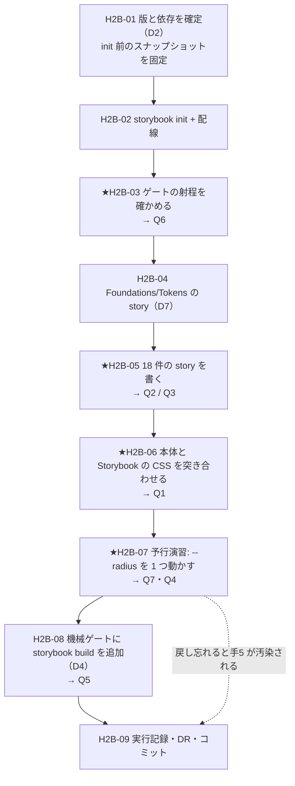

# 手2b — UI カタログ（Storybook 10.5）

> 段取り上の位置づけ: [UI検証の位置づけと段取り.md](../UI検証の位置づけと段取り.md) §5
> 方針の正本: [DR-0017](../DR/DR-0017-storybook-as-catalog.md)（採用と階層）／[DR-0018](../DR/DR-0018-design-sync-takes-preview-html.md)（Claude Design とは別物）
> 部品の一覧: [部品カタログ.md](../部品カタログ.md)／トークン: [トークンマッピング.md](../トークンマッピング.md)
> 実測の記録先: [実行記録.md](../実行記録.md) §手2b

**この手の目的は「Storybook を入れること」ではない。**
[DR-0017](../DR/DR-0017-storybook-as-catalog.md) が位置づけたとおり、**Storybook は開発補助ではなく手5（トークン差し替え実験）の判定装置**。
[DR-0010](../DR/DR-0010-shadcn-invents-values.md) により手5 の判定は「**どこが変わらなかったか**を列挙する」形になっており、列挙するには**全部品を一望できる面**が要る。

したがってこの手のゴールは **「判定装置が判定装置として機能することを、手5 の前に確かめる」**。
装置が壊れていることに手5 で気づいたら、手5 の赤が「設計の穴」なのか「装置の不良」なのか切り分けられない。

---

## 0. この手で答えを出す問い（観測項目）★最重要

| #      | 問い                                                                                                              | なぜ効くか（どの判断が変わるか）                                                                                                                                                             |
| ------ | ------------------------------------------------------------------------------------------------------------------ | ---------------------------------------------------------------------------------------------------------------------------------------------------------------------------------------------- |
| **Q1** | Storybook のビルドは本体と**同じ CSS を生成するか**（トークンが同じに解決されるか）                                | 違うなら **判定装置が本体と別の答えを出す**。特に手2 で入れた `@source not '../../docs'`（[DR-0021](../DR/DR-0021-tailwind-scans-docs-markdown.md)）が Vite 系でも効くか。効かないと Storybook 側だけ docs 由来のクラスを持つ |
| **Q2** | shadcn の部品に story を書くとき、**部品本体を触らずに済むか**                                                    | 触るなら、その時点で「変えない層」が破れる。**手5 の前提が手2b で壊れる**                                                                                                                      |
| **Q3** | 役割 9 カテゴリを `title` 階層にしたとき、**配線が要る部品**（`TooltipProvider` / `SidebarProvider`）はどう置かれるか | [部品カタログ 表2 の指摘 1・3](../部品カタログ.md#-思想への指摘書き換えはしない判断はユーザー)（「部品でないもの」の置き場が無い・`provider` フラグが要る）が、**実装で顕在化するかの答え合わせ**になる |
| **Q4** | **描画のみ**（addon-vitest 無し）で、手5 の判定装置として足りるか                                                  | 足りないなら Playwright まで引き込むことになり、**移送コストが跳ねる**（PoC の catalog に vite も playwright も無い）。→ D3                                                                    |
| **Q5** | Vite が新規依存として入ったとき、**本体の厳密ピンは壊れるか**／`^` レンジは何件増えるか                            | [DR-0016](../DR/DR-0016-shadcn-deps-are-caret-ranges.md) の続き。**手9 の移送コストの実体**。PoC の catalog には storybook / vite / playwright が 1 つも無い                                    |
| **Q6** | 既存の機械ゲート（lint / typecheck / format / spell）は **`.storybook/**` と `*.stories.tsx` を検査対象に含むか**  | 含まないなら **「対象 0 件で緑」の事故**（PoC で実際に起きた）と同型。story は自分で書くコードなので、shadcn 出力と違い**検査対象に入っていなければならない**                                    |
| **Q7** | ★ **判定装置は本当に機能するか** — トークンを 1 つだけ変えたとき、Storybook 上で「変わった部品／変わらなかった部品」を列挙できるか | **この手の合否そのもの。**できないなら手5 は実行できない。**手5 の予行演習を `--radius` 1 変数で行う**（値は元に戻す）                                                                          |

> Q1・Q2・Q3 は [DR-0017](../DR/DR-0017-storybook-as-catalog.md) §「手2b で答えを出す問い」の 1・2・3 を実測できる形に直したもの。
> Q3 は当初「分類できなかった 2 件（Direction / Marker）はどこに置かれるか」だったが、**この 2 件は未導入**（`add` していない）ため
> 手2b では観測できない。代わりに**導入済み 18 件で実際に起きる問題**（Provider の配線）に問いを差し替えた。
> Q7 は本手順書で追加した。**装置を作る手は、装置が効くことを確かめて終わる**べきで、それを手5 に持ち越すと赤の切り分けができない。

---

## 1. 前提

- **直前の手**: 手2 done（`main` へマージ済み・作業ツリー clean）
- **ベースライン**（[handoff.md](../handoff.md) と一致していること。ここからの差分が「新しい赤」）
  | ゲート | 手2 完了時 |
  | --- | --- |
  | `pnpm typecheck` | 🟥 赤 1 件（`dropdown-menu.tsx:94`） |
  | `pnpm lint` | 🟥 赤 33 件（任意値 24 ／ 型系 9） |
  | `pnpm build` | 🟥 赤（typecheck と同一原因） |
  | `pnpm format:check` | 🟦 緑 |
  | `pnpm spell` | 🟦 緑 |
- **版**（npm registry 実測 2026-07-26。§7）
  | 対象 | 版 | 備考 |
  | --- | --- | --- |
  | `storybook` / `@storybook/nextjs-vite` | **10.5.4** | peer に `next: ^16.0.0` を明示 |
  | `vite` | **8.1.5** | peer 範囲 `^5 \|\| ^6 \|\| ^7 \|\| ^8` の上端 |
  | （参考）`@storybook/addon-vitest` | 10.5.4 | peer に `@vitest/browser-playwright: ^4` → **D3 で入れない** |
- **対象部品**: 導入済みの **18 件**（[部品カタログ](../部品カタログ.md) の「実測 ✅」）。未導入 45 件は対象外
- **参照**
  - PoC `docs/framework/architecture.md` §3.6（「UI カタログ = Storybook（描画のみ）」「story を単一ソースにする」）
  - PoC `pnpm-workspace.yaml` catalog（**vitest 4.1.10 のみ。vite / storybook / playwright は無い**）

---

## 2. 着手前に決めること（判断ポイント）

> **戻しにくい決定はここに全部出す。**実行中に §2 に無い選択肢が出たら、**その場で決めずにここへ追記してから進む**
> （手1 の D9・D10、手2 の D9 がその実例。**この規律は 2 回以上機能している**）。

| #      | 論点                                          | 選択肢                                                                          | 決定                                  | 根拠                                                                                                                                                                                                                                                                                                                | 戻せるか                          |
| ------ | --------------------------------------------- | --------------------------------------------------------------------------------- | ------------------------------------- | ---------------------------------------------------------------------------------------------------------------------------------------------------------------------------------------------------------------------------------------------------------------------------------------------------------------------- | --------------------------------- |
| **D1** | フレームワーク                                | `@storybook/nextjs-vite` ／ `@storybook/nextjs`（webpack）                        | **`nextjs-vite`**                     | [DR-0017](../DR/DR-0017-storybook-as-catalog.md) 決定2 で確定済み。公式が Vite 版を推奨、PoC は Vitest 統一方針                                                                                                                                                                                                       | 🟥 重い（パイプラインごと変わる） |
| **D2** | 版の固定方針                                  | `init` が書く `^` レンジのまま ／ **厳密ピンに書き換える**                        | **厳密ピン**                          | 本 repo の全依存は PoC の catalog と同一値で厳密ピン（[DR-0003](../DR/DR-0003-foundation-mirrors-poc.md)）。**手5 の差し替え実験は再現性が前提**で、生成器・ビルダの版が動くと再現しない。手1 の D2（CLI 版を固定した）と同じ理屈                                                                                     | 🟦 戻せる                         |
| **D3** | `@storybook/addon-vitest`（+ Playwright）     | 入れる ／ **描画のみに留める**                                                    | **描画のみ**（→ 未決 #8 の答え）      | ① DR-0017 が与えた役割は「手5 の判定装置」で、**描画で足りる**（Q4 で確かめる）② peer が `@vitest/browser-playwright` を要求し、**ブラウザバイナリまで引き込む**＝ PoC catalog に無い依存が 3 段深くなる ③ PoC の **ADR-0009（ビジュアル回帰）は `proposed` で判断条件が「UI が固まってから」**＝いま入れるのは早い ④ 2 回ルール（必要性がまだ 1 度も証明されていない） | 🟦 戻せる（後から足せる）         |
| **D4** | `storybook build` を機械ゲートに入れるか      | 入れない ／ **入れる**                                                            | **入れる**（→ 未決 #9 の答え）        | DR-0017 が挙げた最大のリスクは「**本体では通るが Storybook では壊れる**」。ゲートに入れないと**そのリスクを観測する手段が無い**。Q1・Q6 の答えを毎回自動で取り直すことになる。**ベースライン表に 1 列増える**                                                                                                          | 🟦 戻せる                         |
| **D5** | story の置き場所                              | 部品と同居（`src/components/ui/*.stories.tsx`）／ **分離**（`src/stories/<カテゴリ>/`） | **分離**                              | 🟥 `.prettierignore` が **`src/components/ui/` を丸ごと除外**している（手1 D11）。同居させると **story が整形ゲートの外に出る**——story は shadcn の出力ではなく**自分で書くコード**なので、除外してはいけない。加えて**ディレクトリ構造がそのまま役割 9 カテゴリになり**、[部品カタログ](../部品カタログ.md) の表 / `title` 階層 / Claude Design の `group`（DR-0018）が**3 者とも同じ構造**で揃う | 🟦 戻せる                         |
| **D6** | 手2b で書く story の範囲                      | 代表数点 ／ **導入済み 18 件すべてに最小 1 story** ／ バリアント網羅               | **18 件すべてに最小 1 story**         | 代表数点だと **Q2・Q3 に答えられない**——配線の問題は部品ごとに違い、`Tooltip` / `Sidebar` のような **Provider 必須の部品でしか露出しない**。一方バリアント網羅は手3 以降（部品を作りながら足す）でよい。**手2b は「全部品が載る面ができた」ところまで**                                                                | 🟦 戻せる                         |
| **D7** | Foundations（トークン）のページを作るか       | 作らない ／ **作る**                                                              | **作る**（`Foundations/Tokens`）      | DR-0017 が「手2 のトークン語彙をカタログ最初のページにできる」とした箇所。**手5 でまず見るのはトークンそのもの**（色・余白・タイポの見本）。ここが変わらなければ部品を見るまでもない＝**判定の一段目**になる                                                                                                          | 🟦 戻せる                         |
| **D8** | `storybook-static`（ビルド出力）の扱い        | commit する ／ **`.gitignore`**                                                   | **`.gitignore`**                      | ビルド出力は成果物ではない。`.next/` と同じ扱い                                                                                                                                                                                                                                                                        | 🟦 戻せる                         |
| **D9** | Q7（予行演習）で動かすトークン                | `--radius` ／ 色 ／ spacing                                                       | **`--radius` 1 変数**                 | `--radius` は `calc()` で **7 段すべてが派生する**（[トークンマッピング 2.3](../トークンマッピング.md)）＝**1 変数で最も広く波及する**ので、装置の感度を見るのに最適。かつ**部品の 34 箇所が `rounded-*` を使っている**ので変化が目視できる。🟥 **確認後は必ず元に戻す**（値は手5 まで shadcn デフォルト。DR-0005 決定3） | 🟦 戻せる（戻すことが前提）       |

---

## 3. 成果物

| 成果物                                       | 内容                                                                              |
| -------------------------------------------- | ----------------------------------------------------------------------------------- |
| `.storybook/main.ts` / `.storybook/preview.ts` | Storybook の配線（`framework: '@storybook/nextjs-vite'`／`import '../src/app/globals.css'`） |
| `src/stories/Foundations/Tokens.stories.tsx` | ★ トークン見本（色 / 余白 / タイポ）＝**手5 の判定の一段目**（D7）                   |
| `src/stories/<役割カテゴリ>/*.stories.tsx`   | 導入済み 18 件の story（D5・D6）。階層は役割 9 カテゴリ                              |
| `package.json`                               | `storybook` / `build-storybook` スクリプト＋依存（**厳密ピン**。D2）                 |
| `.gitignore`                                 | `storybook-static/`（D8）                                                           |
| `docs/実行記録.md` §手2b                     | Q1〜Q7 の答え・ベースライン差分・**予行演習の結果**                                  |
| DR（新規）                                   | 少なくとも Q5（移送コスト）と Q7（装置の妥当性）は切り出す見込み                     |

---

## 4. 作業フロー



**H2B-03 を story より前に置く理由**: 先に story を大量に書いてから「ゲートが検査していなかった」と分かると、
**書いたコード全部を検査し直すことになる**。PoC の「lint が対象 0 件で緑」事故と同型なので、**空の 1 ファイルで先に確かめる。**

---

## 5. 手順

### H2B-01 版と依存を確定し、スナップショットを固定する

- **目的**: `init` の書き換えを `git diff` で観測できる状態を作る（手1 H1-01 と同じ理屈）
- **実行**:
  ```bash
  git status --short   # 空であること
  git rev-parse HEAD   # 基準点
  # 入れる前の依存件数を控える（Q5 の分母）
  node -e "const p=require('./package.json');console.log('deps',Object.keys(p.dependencies||{}).length,'dev',Object.keys(p.devDependencies||{}).length)"
  ```
- **期待結果**: 作業ツリーが clean
- **検証**: `git status --short` が空
- **観測**: Q5 の基準値
- **判断**: なし
- **詰まったら**: 未コミットがあれば先にコミットする。**stash はしない**（init 後に戻すと diff が混ざる）

### H2B-02 `storybook init` と配線

- **目的**: Storybook を導入し、Tailwind を通す
- **実行**:
  ```bash
  pnpm dlx storybook@10.5.4 init --package-manager pnpm
  ```
  対話で **React / Next.js（Vite）** を選ぶ。生成後に **D2 のとおり `^` を厳密ピンへ書き換える**:
  ```bash
  # init が書いた ^ を実測して固定値に置き換える
  node -e "const p=require('./package.json');console.log(JSON.stringify(p.devDependencies,null,1))"
  pnpm install
  ```
  `.storybook/preview.ts` に 1 行足す（公式 recipe）:
  ```ts
  import '../src/app/globals.css';
  ```
- **期待結果**: `.storybook/main.ts` の `framework` が `@storybook/nextjs-vite`、`pnpm storybook` が起動する
- **検証**: `pnpm storybook` でブラウザに Example の story が出る
- **観測**: ★**Q5** — `git diff package.json` で**増えた依存の件数と `^` の件数**を数える。`pnpm-lock.yaml` の増分も控える
- **判断**: init が D1〜D8 に無い選択肢を聞いてきたら、**その場で決めずに §2 へ追記してから進む**
- **詰まったら**:
  - init が生成する Example の story は **`src/stories/` に置かれることがある**。D5 の置き場と衝突するので、**中身は消して構造だけ使う**か、別名に退避する
  - Tailwind v4 は PostCSS 経由。`postcss.config.mjs` が既にあるので追加設定は不要のはず。効かない場合は `preview.ts` の import 先を疑う

### ★H2B-03 ゲートの射程を確かめる（story を書く前に）

- **目的**: `.storybook/**` と `*.stories.tsx` が **lint / typecheck / prettier / cspell の検査対象に入っているか**を、空のファイルで先に確かめる（Q6）
- **実行**: 検査対象に入っていれば必ず落ちる**赤テスト用のファイル**を 1 つ置いて、各ゲートが発火するか見る
  ```bash
  mkdir -p src/stories/_probe
  cat > src/stories/_probe/probe.stories.tsx <<'EOF'
  // 赤テスト: これが検出されなければ、そのゲートは story を見ていない
  export const bad = (): void => { const p = Promise.resolve(); p; };
  const arbitrary = 'p-[13px] bg-[#ff0000]';
  EOF
  pnpm lint 2>&1 | tail -20
  pnpm typecheck 2>&1 | tail -10
  pnpm format:check 2>&1 | tail -5
  pnpm spell 2>&1 | tail -5
  ```
- **期待結果**: **各ゲートが新しい赤を出す**（＝検査している）
- **検証**: ベースライン（lint 33 / typecheck 1）**より増える**こと。増えないゲートは story を見ていない
- **観測**: ★**Q6**
- **判断**: 見ていないゲートがあれば設定を直す。
  - `tsconfig.json` の `include` は `src/**/*` なので story は入るが、**`.storybook/**` は入らない**（＝ typecheck 対象外）
  - `eslint.config.mjs` は `**/*.{js,mjs,cjs}` で型情報ルールを外す扱いがあるので、`.storybook/*.ts` の扱いを確認する
  - **どう直したかは §2 へ追記する**
- **詰まったら**: 🟥 **プローブファイルは必ず消す。**残すとベースラインが恒久的に汚れる（`git status --short` が空に戻ることを確認）

### H2B-04 Foundations / Tokens の story

- **目的**: **手5 の判定の一段目**を作る（D7）
- **実行**: `src/stories/Foundations/Tokens.stories.tsx` に、トークンの見本を並べる
  | 節 | 内容 | 出所 |
  | --- | --- | --- |
  | 色 | shadcn の semantic 色 18 ＋ サイドバー 8 を見本チップで | [トークンマッピング 2.1 / 2.2](../トークンマッピング.md) |
  | 角丸 | `--radius` 派生の 7 段 | 同 2.3 |
  | 余白 | 手2 で定義した用途名 9（`inset` / `stack` / `inline`） | `src/app/tokens.css` |
  | タイポ | 手2 で定義した用途名 5 ＋ `font-emphasis` | 同上 |
- **期待結果**: 1 画面でトークンの現状が一望できる
- **検証**: 手2 で定義した語彙が**全件出ている**（`tokens.css` の 15 語彙と照合）
- **観測**: 🟨 **未使用だった semantic 語彙がここで初めて使われる。**手2 の実測で「未使用の `@theme` 変数は CSS に出ない」（DR-0021 §影響）と分かっているので、**この story を書いた時点で生成 CSS に現れるはず**——現れなければ配線が違う
- **判断**: なし
- **詰まったら**: 色チップは `bg-primary` のようなユーティリティで描く。**生値を書かない**（任意値禁止 lint が発火する＝それも観測）

### ★H2B-05 18 件の story を書く

- **目的**: 全部品が載る面を作る。**部品本体を触らずに書けるか**を見る（Q2・Q3）
- **実行**: `src/stories/<役割カテゴリ>/<部品>.stories.tsx` を 18 件。`title` は役割 9 カテゴリで揃える（DR-0017 決定4）

  | 役割カテゴリ | 部品（導入済み 18 件）                         | 件数 |
  | ------------ | ---------------------------------------------- | ---- |
  | Action       | Button                                         | 1    |
  | TextInput    | Input                                          | 1    |
  | Selection    | Checkbox, Select                               | 2    |
  | Layout       | Card                                           | 1    |
  | Overlay      | Dialog, Sheet, Dropdown Menu, Popover, Tooltip | 5    |
  | DataDisplay  | Table                                          | 1    |
  | Navigation   | Pagination, Sidebar                            | 2    |
  | Communication| Badge, Empty, Skeleton                         | 3    |
  | Display      | Label, Separator                               | 2    |

  ```ts
  // 例: src/stories/Action/Button.stories.tsx
  const meta = { title: 'Action/Button', component: Button } satisfies Meta<typeof Button>;
  ```
- **期待結果**: 18 件が 9 カテゴリの階層に並ぶ
- **検証**: サイドバーの階層が [部品カタログ 表1](../部品カタログ.md#表1-割り当て表全-63-部品) の役割カテゴリ列と一致する
- **観測**:
  - ★**Q2** — story を書くために `src/components/ui/**` を **1 行でも触ったか**。触ったら**何をなぜ触ったかを記録する**（手5 の前提が壊れた瞬間になる）
  - ★**Q3** — `Tooltip`（`TooltipProvider` 必須）と `Sidebar`（`SidebarProvider` + `useState` 内包）で**配線をどこに書いたか**。
    story 内 / `preview.ts` の decorator / どちらでも書けないか。→ [部品カタログ 表2 の指摘 1・3](../部品カタログ.md) の答え合わせ
- **判断**: Provider を `preview.ts` の decorator で全 story に配るか、必要な story だけに書くか。**決めたら §2 へ追記**
- **詰まったら**: `Sidebar` は 32 export・state 内包（[DR-0013](../DR/DR-0013-shadcn-holds-no-state-except-sidebar.md)）で最も重い。**ここだけ後回しにしてよい**が、**書けなかったなら「書けなかった」と記録する**（手3 の作業対象がそこに確定する）

### ★H2B-06 本体と Storybook の CSS を突き合わせる

- **目的**: 判定装置が本体と同じ答えを出すかを確かめる（Q1）
- **実行**:
  ```bash
  pnpm build            # 本体（typecheck で赤になるが CSS は生成される）
  pnpm build-storybook  # Storybook（storybook-static/ に出る）
  # docs 由来のクラスが Storybook 側だけに混入していないか（DR-0021 の Vite 版）
  echo 'probe: text-fuchsia-700' > docs/_probe.md
  pnpm build-storybook
  grep -rc 'text-fuchsia-700' storybook-static/**/*.css
  rm -f docs/_probe.md
  ```
- **期待結果**: 両者で**同じトークンが同じ値に解決される**。docs 由来のクラスは**どちらにも出ない**
- **検証**: `--radius` `--primary` および手2 の用途名トークンを両方の CSS で `grep` して値を比較する
- **観測**: ★**Q1** — 特に `@source not '../../docs'` が Vite 系でも効くか（handoff で手2 から持ち込んだ観測点）
- **判断**: 効かない場合、**Storybook 側にも同等の除外を書くか、`@source` の書き方を変えるか**。→ §2 へ追記
- **詰まったら**: Storybook の CSS はチャンクに分かれることがある。`storybook-static/**/*.css` を全走査する

### ★H2B-07 予行演習 — `--radius` を 1 つ動かす

- **目的**: **この手の合否。**装置が「どこが変わらなかったか」を列挙できるかを、手5 の前に確かめる（Q7・Q4）
- **実行**:
  ```bash
  git status --short                      # 空であること（戻す前提を作る）
  # globals.css の --radius だけを一時的に変える（例: 0.625rem → 1.5rem）
  pnpm storybook                          # 目視で全カテゴリを走査
  ```
  観測を**表**にする:
  | 部品 | 変わった | 変わらなかった | 変わらなかった理由（推定） |
  | --- | --- | --- | --- |
  | Checkbox | | ✅ | `rounded-[4px]`（生値。[DR-0010](../DR/DR-0010-shadcn-invents-values.md) の (C)） |
  | Tooltip | | ✅ | `rounded-[2px]`（同上） |
- **期待結果**: **事前に特定済みの「変わらない箇所」が実際に変わらない**ことが目視できる。
  [トークンマッピング §5](../トークンマッピング.md) のとおり、手5 で変わらない箇所は **15 件が事前特定済み**
  （生値 8 ＋ 部品を触らないと解けない 7）。そのうち **`rounded-[4px]`（Checkbox）と `rounded-[2px]`（Tooltip）は
  この予行演習で必ず現れる**——現れなければ**装置が見えていない**
- **検証**: 上の 2 件が「変わらなかった」列に入ること。**入らなければ装置の不良**として原因を潰してから先へ進む
- **観測**: ★**Q7**（装置は機能するか）／★**Q4**（描画のみで列挙できたか＝ addon-vitest が要るか）
- **判断**: 🟥 **確認後は `--radius` を必ず元に戻す。**
  ```bash
  git checkout -- src/app/globals.css
  git status --short   # 空に戻ること
  ```
  戻し忘れると**手5 の出発点が汚染され、実験が無効になる**
- **詰まったら**: 差が見えにくい部品は、`rounded-*` を使っていない可能性がある。
  [部品カタログ](../部品カタログ.md) と照合し、「そもそも角丸を持たない」のか「持つのに変わらない」のかを区別する

### H2B-08 機械ゲートに `storybook build` を追加する

- **目的**: 「本体では通るが Storybook では壊れる」を継続的に検出する（D4）
- **実行**: `package.json` に `build-storybook` を置き、handoff のベースライン表に列を足す
- **期待結果**: ゲートが 6 本になる（`typecheck` / `lint` / `build` / `format:check` / `spell` / `build-storybook`）
- **検証**: `pnpm build-storybook` が完走する（**本体の `build` は typecheck で赤のままでよい**）
- **観測**: ★**Q5** の確定値（依存の増分・`^` の件数）
- **判断**: `build-storybook` が赤なら、**ignore せず内訳を記録する**（[DR-0007](../DR/DR-0007-shadcn-output-handling.md)）
- **詰まったら**: Storybook のビルドは本体と別系統なので、**本体の typecheck 赤が原因で落ちることはない**はず。落ちたら別原因

### H2B-09 実行記録・DR・コミット

- **目的**: 観測を残す
- **実行**: `docs/実行記録.md` に §手2b を追加 → DR を切り出す → コミット
  ```bash
  git add .storybook/ src/stories/ package.json pnpm-lock.yaml .gitignore
  git commit -m "feat(H2B): Storybook 10.5 を導入し 18 部品の story を作成 [手2b]"
  git add docs/
  git commit -m "docs(H2B): 手2b の実行記録と DR [手2b]"
  ```
- **期待結果**: `step/h2b-storybook` に 2 コミット、`main` へ `--no-ff` マージ
- **検証**: `git log --graph` が手0〜手2 と同じ形
- **観測**: なし
- **判断**: なし

---

## 6. 完了条件

- [ ] `pnpm storybook` が起動し、**役割 9 カテゴリの階層で 18 部品が並ぶ**
- [ ] `Foundations/Tokens` に手2 の語彙が全件出ている
- [ ] §0 の Q1〜Q7 すべてに答えが出ている
- [ ] §2 の D1〜D9 が決着し、実行中に追記した論点があれば根拠が書かれている
- [ ] 機械ゲートを実行し、**ベースラインとの差分（新しい赤）**が実行記録にある。`build-storybook` が列に加わっている
- [ ] 🟥 **`git status --short` が空**（H2B-03 のプローブと H2B-07 の `--radius` を戻し忘れていない）
- [ ] `docs/実行記録.md` に §手2b がある／DR が切り出されている
- [ ] コミット済み・`main` へマージ済み
- [ ] ★ **予行演習（H2B-07）で「変わらなかった箇所」を列挙できた**＝**手5 を実行してよい状態になった**
- [ ] ★ **手2 の前提が壊れていない**＝ story を書くために `src/components/ui/**` を触っていない（触ったなら記録がある）

> 最後の 2 項目が本当の完了条件。**手2b の価値は Storybook が入ったことではなく、手5 の判定装置が効くと確かめられたこと。**

---

## 7. 出典

| 出典                                                                                          | 取得 | 何を取るか                                              |
| ----------------------------------------------------------------------------------------------- | ---- | -------------------------------------------------------- |
| npm registry 実測（`npm view`）                                                                | 2026-07-26 | `storybook` / `@storybook/nextjs-vite` = **10.5.4**、`vite` = **8.1.5**、peer 範囲 |
| [Storybook for Next.js (Vite)](https://storybook.js.org/docs/get-started/frameworks/nextjs-vite) | 2026-07-26 | `framework` の指定・init 手順                            |
| [Storybook Tailwind recipe](https://storybook.js.org/recipes/tailwindcss)                       | 2026-07-26 | `preview.ts` で globals.css を import するだけ            |
| `~/git/PoC/pnpm-workspace.yaml`                                                                | 2026-07-26 | catalog に **vitest 4.1.10 のみ**。vite / storybook / playwright は無い |
| `~/git/PoC/docs/framework/architecture.md` §3.6                                                | —    | 「UI カタログ = Storybook（描画のみ）」「story を単一ソースに」 |
| `~/git/PoC/docs/adr/0009-visual-regression-adoption.md`                                        | —    | `proposed`・判断条件「UI が固まってから」→ D3 の根拠      |

> ⚠ **公式 docs は手1 で古さが露呈している**（[DR-0006](../DR/DR-0006-shadcn-base-radix-preset-nova.md)）。
> 版・peer・生成物は**すべてローカル実測で裏を取る**。
