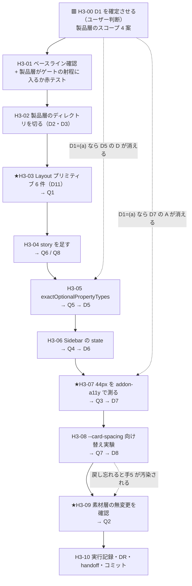

# 手3 — ② Components 層（素材層と製品層の分離）

> 段取り上の位置づけ: [UI検証の位置づけと段取り.md](../UI検証の位置づけと段取り.md) §5
> 分類の正本: [共通コンポーネント思想.md](../共通コンポーネント思想.md)（3 層・役割 9 カテゴリ・フラグ）
> 部品の一覧: [部品カタログ.md](../部品カタログ.md)（表3 = 欠落リスト／表4 = 状態の食い違い）
> トークン: [トークンマッピング.md](../トークンマッピング.md)／[DR-0019](../DR/DR-0019-semantic-spacing-typography-vocabulary.md)（semantic 語彙）
> 実測の記録先: [実行記録.md](../実行記録.md) §手3

**この手の目的は「部品を作ること」ではない。**

手2b までで、リポジトリには**素材**（`src/components/ui/**` = shadcn の出力そのまま）と**棚**（`src/stories/<役割 9 カテゴリ>/` = Storybook の階層）の 2 つがある。
しかし**役割 9 カテゴリはコードの中に存在せず、story の `title` 文字列としてしか存在しない**。
`src/components/` の直下は `ui/` だけで、**自作の共通部品は 0 件**である。

したがってこの手のゴールは **「素材層と製品層の境界をどこに引くかを決め、その境界が手5 の判定を成立させるかを観測する」**。
Layout プリミティブを 6 個作ること自体は手段であって、成果物は「境界の位置」と「その境界で何が解けて何が解けなかったか」。

---

## 0. この手で答えを出す問い（観測項目）★最重要

> **ここが空なら、その手はやらなくてよい。**各問いは **yes/no か、有限個の選択肢に落ちる形**で書く。
> §0 は**実測で答えが出るもの**、§2 は**決めるもの**。混ぜない（手2 の申し送りで確立した責務分離）。

| #      | 問い | なぜ効くか（どの判断が変わるか） |
| ------ | ---- | -------------------------------- |
| **Q1** | ★ 自作 Layout プリミティブ（Box / Stack / Grid / Container / Spacer / Section）は、**手2 で定義した semantic 語彙だけで組み切れるか**（生値・Tailwind の数値ユーティリティを 1 つも書かずに済むか） | 組み切れないなら **semantic 層の語彙に穴がある**＝手2 の成果物が不足。[DR-0019](../DR/DR-0019-semantic-spacing-typography-vocabulary.md) で定義した 15 語彙は**まだどこにも使われていない**ので、これが初めての実使用になる。組めなければ**手5 で「変わる層」がほぼ空になる** |
| **Q2** | ★ 製品層を作る過程で、**素材層（`src/components/ui/**`）を 1 行でも触るか** | 触った瞬間に手5 の前提（「部品を 1 行も触らずに」）が**手3 で壊れる**。手2b の Q2 と同じ観測を、今度は「読む側」ではなく「作る側」で行う |
| **Q3** | ★ **touch-min 44px は素材層を触らずに解けるか**（① トークンで解ける ② 製品層のラッパーで解ける ③ どちらでも解けない） | 未決 #11 は現在「**哲学の 44px を守る** vs **nova の高密度 `h-8`=32px を取る**」の二択で立っている（[DR-0023](../DR/DR-0023-real-conflict-is-touch-target.md)）。**製品層を認めると三択目（ラッパーで既定 size を上書き）が生まれる**。`addon-a11y`（手2b D10 で残した）で機械的に測る |
| **Q4** | Sidebar の state を hook へ切り出したとき、**lint 赤 17 件はいくつ減るか** | 未決 #2。減らないなら赤の原因は state ではなく**任意値・型**であり、切り出しは「思想を通すか」の純粋な設計判断に落ちる（＝ lint を理由にできなくなる）。[DR-0013](../DR/DR-0013-shadcn-holds-no-state-except-sidebar.md) |
| **Q5** | `exactOptionalPropertyTypes` の赤 1 件（`dropdown-menu.tsx:94`）は、**素材層を触らずに解けるか** | 未決 #1。解けるなら製品層が吸収する。解けないなら「設定を弱める / 素材を 1 行直す / 該当部品を使わない」の三択に落ちる（→ D5）。[DR-0014](../DR/DR-0014-exact-optional-property-types-incompatible.md) |
| **Q6** | 製品層の部品を棚に載せたとき、**素材層の story と二重に並ぶか**（`Layout/Card`（素材）と `Layout/Stack`（製品）が同じ階層に混ざる） | 混ざるなら **手5 の判定対象が二重になる**——「変わらなかった」が素材由来か製品由来か切り分けられない。→ D3・D4 |
| **Q7** | `--card-spacing` を `--spacing-inset-md` に向け替えたとき、**Card の見た目は実際に変わるか** | 未決 #12。[DR-0022](../DR/DR-0022-shadcn-has-component-tokens.md) が「**部品を触らず semantic 層へ載る唯一の接続点**」とした箇所が、本当に載るかの実測。載るなら手5 で同型の接続点を探す価値がある |
| **Q8** | 自作部品の story を書くとき、**雛形に型が取れるか** | 手2b の申し送り: 素材 18 件では**部品ごとに形が違いすぎて型が取れなかった**（Provider 必須 2・composite 8・単純 5）。自作部品は**自分で API を決められる**ので、ここで型が取れるなら**それは 2 回目の需要の証明**＝手9 の仕組み化候補になる（2 回ルール） |

> Q3・Q4・Q5・Q7 は handoff の未決 #11 / #2 / #1 / #12 を**実測できる形に書き直したもの**。
> Q1・Q2 は思想①②の検証そのもの。Q6・Q8 は**製品層を作ると初めて出てくる新しい問い**。

---

## 1. 前提

- **直前の手**: 手2b done（`main` へマージ済み・作業ツリー clean）
- **ベースライン**（[handoff.md](../handoff.md) と一致していること。**ここからの差分が「新しい赤」**）

  | ゲート | 手2b 完了時 |
  | --- | --- |
  | `pnpm typecheck` | 🟥 赤 1 件（`dropdown-menu.tsx:94`） |
  | `pnpm lint` | 🟥 赤 33 件（任意値 24 ／ 型系 9。**うち `sidebar.tsx` 17 + `use-mobile.ts` 3**） |
  | `pnpm build` | 🟥 赤（typecheck と同一原因） |
  | `pnpm format:check` | 🟦 緑 |
  | `pnpm spell` | 🟦 緑 |
  | `pnpm build-storybook` | 🟦 緑 |

- **いま実在するもの**（2026-07-26 実測）

  | 実体 | 件数 | 状態 |
  | --- | --- | --- |
  | `src/components/ui/**` | 18 | **shadcn 出力そのまま・無変更**（手2b Q2 で確認済み） |
  | `src/stories/<役割カテゴリ>/**` | 19 | 役割 9 カテゴリは **`title` 文字列としてのみ存在** |
  | `src/components/` 直下の自作ディレクトリ | **0** | 🟥 **製品層は存在しない** |
  | `src/hooks/` | 1（`use-mobile.ts`） | shadcn が生成したもの。自作 hook は 0 |
  | `src/app/tokens.css` の semantic 語彙 | 15 | 🟨 **`Foundations/Tokens` の story 以外では未使用** |
  | `src/app/page.tsx` | — | 🟥 **部品を 1 つも import していない** |

- **参照**
  - [共通コンポーネント思想.md](../共通コンポーネント思想.md) — ② Components 層／「Layout・Overlay は自作テンプレ」「状態は hook + フラグ」
  - [部品カタログ 表3](../部品カタログ.md) — 欠落リスト（＝この手の作業対象）
  - [部品カタログ 表4](../部品カタログ.md) — 状態の食い違い（**例外は Sidebar 1 つ**）
  - [DR-0012](../DR/DR-0012-shadcn-supplies-no-layout-no-spacing.md) — shadcn は Layout を 1 つも供給しない
  - PoC `docs/framework/templates/00_agent_config/rules/ui.md` — 移送先の UI 規約

---

## 2. 着手前に決めること（判断ポイント）

> **戻しにくい決定はここに全部出す。**実行中に §2 に無い選択肢が出たら、**その場で決めずにここへ追記してから進む**
> （手1 D9・D10、手2 D9、手2b D10〜D14 がその実例。**この規律は 4 回機能している**）。

### 🟥 D1 が背骨。D1 が決まるまで H3-02 以降に着手しない。

| #      | 論点 | 選択肢 | 決定 | 根拠 | 戻せるか |
| ------ | ---- | ------ | ---- | ---- | -------- |
| **D1** | ★ **製品層のスコープ** — 素材（shadcn）と製品（自作）の境界をどこに引くか | **(a) 欠落品だけ**: Layout プリミティブ + Sidebar ラッパーのみ自作。他は `ui/` を直接使う<br>**(b) 欠落品 + 全再輸出**: 18 件を製品層から re-export し、**画面は製品層しか import しない**（窓口を 1 本にする。中身は素通し）<br>**(c) 欠落品 + 既定値ラッパー**: (b) に加え、`Button` の `h-8` → 44px のように**既定値を哲学に合わせて上書きした薄いラッパー**を置く<br>**(d) 全部作り直す**: shadcn を参考実装扱いにする | **未定 🟥** | **ユーザー判断の可能性が高い。**(d) は検証設計が崩れる（手5 の「素材を触らない」が無意味化）ので実質除外。**(a)↔(c) はコストではなく思想の選択**——(c) を採ると未決 #11 が解け、代わりに手5 の観測対象が二層になる（→ D4） | 🟥 **不可逆に近い。**後から (a)→(b) は機械的だが、(c)→(a) は書いたラッパーを全部捨てることになる |
| **D2** | 製品層の置き場と命名 | **A** `src/components/<役割カテゴリ>/`（棚と同じ 9 カテゴリのディレクトリ）<br>**B** `src/components/common/` にフラット<br>**C** `src/components/ui/` に併置 | **未定** | **C は却下候補**——`.prettierignore` が `src/components/ui/` を丸ごと除外している（手1 D11）ので、**自作コードが整形ゲートの外に出る**。手2b D5 が story で同じ理由で「分離」を選んだのと同型。**A なら役割 9 カテゴリがコード上に初めて実在する**（＝思想②がディレクトリとして具現する） | 🟦 戻せる |
| **D3** | **画面と story の import 先** | **A** 素材層を直 import（現状）<br>**B** 製品層経由に統一（`@/components/ui/*` を画面と story から禁止する） | **未定**（D1 従属） | D1=(b)(c) なら B が自然。D1=(a) なら A のまま。**B を採るなら lint ルール（`no-restricted-imports`）で機械的に強制できる**——強制しないと規約が形骸化する（PoC の「守るための構造だけが先に立っている」と同型） | 🟦 戻せる |
| **D4** | ★ **手5 の観測対象の定義** | **A** 素材層のみ（`src/components/ui/**` を触らなければ合格）<br>**B** 素材層 + 製品層（両方触らなければ合格） | **未定**（D1 従属） | 手5 の問いは「**部品を 1 行も触らずに見た目が変わるか**」。**D1=(c) だと製品層はトークンで変わるべき層なのか、手で書き換えてよい層なのかが割れる**。ここを決めないまま手5 に入ると、赤の原因が切り分けられない | 🟥 **手5 の判定基準そのもの。手3 で確定させる** |
| **D5** | `exactOptionalPropertyTypes` の赤 1 件（未決 #1） | **A** 設定を弱める<br>**B** 素材を 1 行直す<br>**C** 該当部品（`DropdownMenu`）を使わない<br>**D** 🆕 **製品層のラッパーで型を吸収する** | **未定**（Q5 の実測後） | **A は PoC の tsconfig と食い違う**＝移送時に赤が復活する。**B は Q2 を自ら壊す**。**D は D1=(b)(c) のときだけ選べる**——D1 の答えでこの選択肢の数が変わる。`build` が赤のままだと**手4 で詰まる**ので手3 で決着させる（[DR-0014](../DR/DR-0014-exact-optional-property-types-incompatible.md)） | 🟦 戻せる |
| **D6** | Sidebar の扱い（未決 #2） | **A** 素材のまま使う<br>**B** state を hook（`useSidebar`）へ切り出して製品層に置く<br>**C** 今回は使わない | **未定**（Q4 の実測後） | 思想は「状態は role の外へ」だが、**shadcn の Sidebar は useState + Context + Provider + cookie + キーボードショートカットを内包**（[表4](../部品カタログ.md)）。**B は素材層のコピーになりがち**で、Q2（素材を触らない）は守れても**素材と製品で同じロジックが二重化する**。Q4 で「lint 赤が減らない」なら B の動機が 1 つ消える | 🟦 戻せる |
| **D7** | ★ **touch-min 44px**（未決 #11） | **A** 哲学を守る（製品層で既定 size を上書き）<br>**B** nova の高密度を取る（哲学側を改訂）<br>**C** 用途で使い分ける（一覧の行内は 32px、主要操作は 44px） | **未定**（Q3 の実測後） | **A は D1=(c) を要求する。**逆に D1=(a) を選ぶと A は選べず、B か C しか残らない。**つまり D1 と D7 は連動する**——先に D1 を決めると D7 の選択肢が絞れる。C は「哲学の下限」を条件つきにするので**思想への変更提案になる**（書き換えはせず DR に書く） | 🟥 哲学に触れる。ユーザー判断 |
| **D8** | `--card-spacing` の向け替え（未決 #12） | **A** `--spacing-inset-md` に向け替える<br>**B** 据え置く | **未定**（Q7 の実測後） | **A が通れば「素材を触らず semantic 層へ載る」実例が 1 件できる**（[DR-0022](../DR/DR-0022-shadcn-has-component-tokens.md)）。これは手5 の希望的観測ではなく**手3 で先に確かめられる**唯一の接続点 | 🟦 戻せる |
| **D9** | TanStack Table（未決 #3） | **A** 手3 で入れる<br>**B** 手4 へ送る<br>**C** 入れない（`Table` の素マークアップで組む） | **未定** | **B が有力**——一覧を実際に組むのは手4 であり、手3 の問い（Q1〜Q8）はどれも DataGrid を必要としない。**新規依存は移送コストに直結する**（手2b で依存 22→28・lock +1,991 行）ので、必要性が証明されてから入れる（2 回ルール） | 🟦 戻せる |
| **D10** | Provider の置き場 | **A** 製品層に集約する（`<AppProviders>`）<br>**B** 画面ごとに書く<br>**C** 手4（Patterns/Templates）へ送る | **未定** | [部品カタログ 表2 の指摘 1・3](../部品カタログ.md)（「部品でないもの」の置き場が無い・`provider` フラグが要る）の**受け皿になりうるのが製品層**。未決 #4（思想への指摘）を 1 つ閉じられる可能性がある。ただし**手2b で `preview.tsx` の decorator に既に書いてある**ので、急がない | 🟦 戻せる |
| **D11** | ★ **Layout プリミティブの API 形** | **A** semantic 名を props で受ける（`<Stack gap="md">` → `var(--spacing-stack-md)`）<br>**B** `className` パススルーのみ（`<Stack className="gap-4">`）<br>**C** 両方許す | **未定** | **思想①「数値を直書きさせない枠」の実体はここ。**B は Tailwind の数値ユーティリティ（`gap-4`）を通すので**枠が閉じない**（`no-arbitrary-value` は `gap-4` を検出しない——検出するのは `gap-[13px]` だけ）。**A なら取れる値が有限集合になる**が、**逃げ道が無いので組めない場面が出うる**（→ Q1 の答えそのもの）。C は実質 B | 🟥 **A↔B は書き直しになる。先に決める** |

---

## 3. 成果物

| 成果物 | 内容 |
| --- | --- |
| **製品層のディレクトリ**（D2） | 役割カテゴリ or `common/`。**空でも「境界を引いた」という成果物** |
| `Box` / `Stack` / `Grid` / `Container` / `Spacer` / `Section` | Layout プリミティブ 6 件（[表3](../部品カタログ.md)）。API 形は D11 |
| `src/hooks/use-*.ts` | D6=B のとき。Sidebar の state 切り出し |
| `src/stories/Layout/*.stories.tsx` 追加 | 自作部品の story（Q6・Q8 の観測対象） |
| `eslint.config.mjs` の `no-restricted-imports` | D3=B のとき。**規約を機械で強制する** |
| `docs/実行記録.md` §手3 | Q1〜Q8 の答え・ベースライン差分 |
| **DR（新規・DR-0028〜）** | 少なくとも **D1（境界の位置）**・**Q1（semantic 語彙で組み切れたか）**・**Q3/D7（44px）** は切り出す見込み |
| [handoff.md](../handoff.md) 更新 | 未決 #1 / #2 / #3 / #11 / #12 の決着（または残留理由） |

---

## 4. 作業フロー



**H3-01 を H3-03 より前に置く理由**: 手2b で `.storybook/**` が**どのゲートの射程にも入っていなかった**（[DR-0025](../DR/DR-0025-storybook-init-is-not-selectable.md)）。
新しいディレクトリを切るたびに同じ事故が起きうるので、**部品を書く前に空の 1 ファイルで射程を確かめる**。「対象 0 件で緑」を疑う規律の 3 回目。

**H3-09 を最後に置く理由**: Q2（素材層を触っていないか）は**全作業が終わってから `git diff` で機械的に判定する**のが確実。途中で触ってしまった場合、その時点では気づかないことがある。

---

## 5. 手順

### 🟥 H3-00 D1 を確定させる（ユーザー判断）

- **目的**: **この手の背骨。**素材層と製品層の境界を決める。D2〜D11 のうち **D3・D4・D5・D7 が D1 に従属する**
- **実行**: §2 の D1 の 4 案をユーザーに提示し、決定と根拠を §2 の表へ書き込む。
  提示の補助として、4 案でディレクトリ・import 文・未決事項の解け方が切り替わる
  **[HTML アーティファクト（案の比較）](https://claude.ai/code/artifact/9f6e3f58-6e92-4c04-a3bb-348152d0a5c1)** がある。
  🟨 **これは使い捨て**（PARADIGM の 3 段の関門）——**D1 が決まったら役目は終わり。決定は必ず本節と DR に文章 + Mermaid で残す**
- **期待結果**: §2 の D1 の「決定」欄が埋まり、D3・D4・D5・D7 の選択肢が絞られている
- **検証**: D1 の決定から D7 の選択肢を導出できること（例: D1=(a) なら D7 の A は選べない）
- **観測**: なし（これは判断であって観測ではない）
- **判断**: D1 そのもの
- **詰まったら**: 決まらないなら **(a) を仮置きして進む**。(a) は他案の部分集合なので、後から (b)(c) へ**足す**ことはできる。逆はできない

### H3-01 ベースライン確認とゲートの射程テスト

- **目的**: 現在の赤を確定させ、**新しいディレクトリがゲートに検査されるか**を部品を書く前に確かめる
- **実行**:
  ```bash
  git status --short   # 空であること
  pnpm typecheck; pnpm lint; pnpm build; pnpm format:check; pnpm spell; pnpm build-storybook
  ./node_modules/.bin/eslint . -f json > /tmp/lint.json
  node -e "const r=require('/tmp/lint.json');const m={};for(const f of r)for(const x of f.messages)m[x.ruleId]=(m[x.ruleId]||0)+1;console.log(m)"
  ```
  D2 で決めた場所に**赤テスト用のファイルを 1 つ置く**（手2b H2B-03 と同型）:
  ```bash
  # 例: D2=A のとき
  mkdir -p src/components/Layout
  cat > src/components/Layout/_probe.tsx <<'EOF'
  // 赤テスト: 検出されなければ、そのゲートは製品層を見ていない
  export const bad = (): void => { const p = Promise.resolve(); p; };
  export const cls = 'p-[13px] bg-[#ff0000]';
  EOF
  pnpm lint 2>&1 | tail -20
  pnpm typecheck 2>&1 | tail -10
  pnpm format:check 2>&1 | tail -5
  ```
- **期待結果**: 各ゲートが**ベースラインより増えた赤**を出す
- **検証**: lint 33 / typecheck 1 **より増える**こと。増えないゲートは製品層を見ていない
- **観測**: なし（射程の確認）
- **判断**: 見ていないゲートがあれば設定を直し、**どう直したかを §2 へ追記する**
- **詰まったら**: 🟥 **プローブは必ず消す**（`git status --short` が空に戻ること）

### ★H3-02 製品層のディレクトリを切る

- **目的**: 境界をファイルシステム上に実体化する（D2・D3）
- **実行**: D2 の決定に従ってディレクトリを作る。D3=B なら import 制限を機械化する:
  ```js
  // eslint.config.mjs（D3=B のとき）
  'no-restricted-imports': ['error', {
    patterns: [{ group: ['@/components/ui/*'], message: '素材層は製品層からのみ import する' }],
  }],
  ```
  ただし**製品層自身と story は除外**する（製品層が素材を import できないと成立しない）
- **期待結果**: 製品層のディレクトリが存在し、D3=B なら画面からの直 import が lint で落ちる
- **検証**: D3=B のとき、`src/app/page.tsx` に `import { Button } from '@/components/ui/button'` を一時的に書いて**lint が発火する**こと（赤テスト。**緑を信用しない**）
- **観測**: なし
- **判断**: 除外範囲（製品層・story・`.storybook/**`）をどう書くか。**決めたら §2 へ追記**
- **詰まったら**: 除外が広すぎると規約が骨抜きになる。**赤テストで発火を確かめてから先へ進む**

### ★H3-03 Layout プリミティブ 6 件を作る

- **目的**: **Q1 の本体。**思想①の「数値を直書きさせない枠」が実際に閉じるかを確かめる
- **実行**: D11 の API 形に従って 6 件を書く。[表3](../部品カタログ.md) の対象:

  | 部品 | 責務 | 取る値の候補（D11=A のとき） |
  | --- | --- | --- |
  | `Box` | 汎用の箱（padding のみ） | `--spacing-inset-*` |
  | `Stack` | 縦積み（gap） | `--spacing-stack-*` |
  | `Grid` | 格子（columns・gap） | `--spacing-stack-*` / `--spacing-inline-*` |
  | `Container` | 最大幅と中央寄せ | 🟨 **手2 の語彙に無い**（→ Q1 の答え） |
  | `Spacer` | 明示的な空き | `--spacing-stack-*` |
  | `Section` | 区画（縦の余白 + 見出しスロット） | `--spacing-stack-*` / typography 語彙 |

- **期待結果**: 6 件が `src/app/tokens.css` の 15 語彙だけで書ける
- **検証**: 書いたコードに**生値も Tailwind の数値ユーティリティも含まれない**こと:
  ```bash
  grep -nE '\[[0-9]|(gap|p|px|py|m|mx|my|w|h|text)-[0-9]' src/components/**/[A-Z]*.tsx
  ```
  → **1 件も出ないのが Q1=yes**
- **観測**: ★**Q1** — 語彙が足りなかった箇所を**列挙する**（例: `Container` の `max-width` に相当する語彙が無い）。
  🟥 **「足りなかったから生値を書いた」は失敗ではなく観測結果**。その場で語彙を足すか、足りないまま記録するかを判断し、**判断した理由を書く**
- **判断**: 語彙を足す場合、**`tokens.css` に足す**（手2 の成果物を育てる）のか、**手5 まで足さない**（手2 の成果物を凍結して穴を可視化する）のか。→ §2 へ追記
- **詰まったら**: `Container` の最大幅は typography（1 行 65 文字）由来で決まる値なので、spacing 語彙では表せない可能性が高い。**表せないこと自体が Q1 の答え**

### H3-04 自作部品の story を足す

- **目的**: 棚に製品層を載せる。**素材と製品が同じ階層に混ざるか**を見る（Q6・Q8）
- **実行**: `src/stories/Layout/` に自作 6 件の story を足す。既に `Card.stories.tsx`（素材）がある階層
- **期待結果**: `Layout/` の下に**素材の Card と自作の Stack が並ぶ**
- **検証**: Storybook のサイドバーで、どちらが素材でどちらが製品かが**見て分かるか**
- **観測**:
  - ★**Q6** — 分からないなら、**手5 の判定で素材由来と製品由来を切り分けられない**。`title` に印を足す（`Layout/自作/Stack`）か、タグ（`tags: ['product']`）で分けるか → §2 へ追記
  - ★**Q8** — 6 件の story を書いたとき、**雛形が共通化できたか**。できたなら手2b で取れなかった型が取れた＝**2 回目の証明**（手9 の仕組み化候補として実行記録に残す）
- **判断**: 上記の印の付け方
- **詰まったら**: 自作部品は `children` を取るので、素材と違い **args だけでは story にならない**（render 関数が要る）。それも Q8 の材料

### H3-05 `exactOptionalPropertyTypes` を決着させる

- **目的**: 未決 #1。`build` の赤を手4 へ持ち越さない（Q5・D5）
- **実行**: 赤 1 件（`dropdown-menu.tsx:94`）の内容を読み、D5 の A〜D それぞれで**通るか通らないか**を実際に試す
  ```bash
  pnpm typecheck 2>&1 | head -20
  ```
- **期待結果**: `pnpm build` が緑になる（またはならない理由が確定する）
- **検証**: ベースラインの typecheck 赤 1 → 0
- **観測**: ★**Q5** — 素材層を触らずに解けたか。解けなかったなら**なぜ解けないか**（型の伝播経路）
- **判断**: **D5。**A を選ぶ場合、**PoC の tsconfig と食い違うことを DR に明記する**（移送時に赤が復活する）
- **詰まったら**: D1=(a) だと D の選択肢が無い。**D1 を覆すのではなく、D1=(a) の制約下で A〜C から選ぶ**

### H3-06 Sidebar の state を扱う

- **目的**: 未決 #2。lint 赤の 6 割の正体を確かめる（Q4・D6）
- **実行**: まず**切り出す前に**、赤 17 件の内訳がどのルールかを確認する:
  ```bash
  ./node_modules/.bin/eslint src/components/ui/sidebar.tsx -f json > /tmp/sb.json
  node -e "const r=require('/tmp/sb.json');const m={};for(const f of r)for(const x of f.messages)m[x.ruleId]=(m[x.ruleId]||0)+1;console.log(m)"
  ```
- **期待結果**: 赤 17 件が「任意値」「型」「その他」に分解される
- **検証**: **state 由来の赤が何件あるか**が数字で出る
- **観測**: ★**Q4** — state を切り出しても減らない件数。**減らないなら D6=B の動機が「lint」ではなく「思想」だけになる**
- **判断**: **D6。**B を選ぶなら 🟥 **素材層のコピーになっていないかを見る**——コピーは Q2 を形式的には守るが、**同じロジックが二重化して手5 で両方を見る羽目になる**
- **詰まったら**: Sidebar は 32 export と最も重い。**今回の題材（チケット一覧）で本当に要るか**を先に問う。要らなければ D6=C が最も安い

### ★H3-07 touch-min 44px を測る

- **目的**: 未決 #11。**トークンで解けないものが、製品層で解けるか**を確かめる（Q3・D7）
- **実行**: `addon-a11y`（手2b D10 で残した）で `Action/Button` を検査し、**32px が実際に警告として出るか**を見る。
  次に D1=(c) が選ばれている場合のみ、製品層のラッパーで既定 size を上書きして**警告が消えるか**を見る
- **期待結果**: ① 素材のままだと警告が出る ② 製品層で上書きすると消える（D1=(c) のとき）
- **検証**: axe-core の該当ルール（target-size 系）の発火・消失
- **観測**: ★**Q3** — ① トークンで解けたか ② 製品層で解けたか ③ どちらでも解けなかったか。
  🟨 **`h-8` は素材のソースに直書きされているので、トークンでは解けないはず**——それを実測で確定させる
- **判断**: **D7。**🟥 **哲学（`tmp-admin`）とプリセット（nova）のどちらを優先するかの判断なので、ユーザーに上げる。**
  思想側の改訂が必要になるなら **DR に書くだけで、`共通コンポーネント思想.md` は書き換えない**（ユーザーの持ち物）
- **詰まったら**: `addon-a11y` が target-size を見ていない可能性がある。その場合は**手で測る**（DevTools）——**測れなかったことも観測結果**

### H3-08 `--card-spacing` の向け替え実験

- **目的**: 未決 #12。**素材を触らず semantic 層へ載る**実例が作れるかを確かめる（Q7・D8）
- **実行**:
  ```bash
  git status --short   # 空であること（戻す前提を作る）
  # globals.css / tokens.css の --card-spacing を --spacing-inset-md 参照に変える
  pnpm storybook       # Layout/Card を目視
  ```
- **期待結果**: **`src/components/ui/card.tsx` を 1 行も触らずに Card の内側余白が変わる**
- **検証**: 変わる／変わらない を目視 + 実効値の計算（[DR-0027](../DR/DR-0027-token-swap-not-detectable-by-css-diff.md) の 3 段判定に従う）
- **観測**: ★**Q7**。変わったなら **手5 で同型の接続点（component token → semantic 参照）を全件探す価値がある**——それは手5 の手順書に書く
- **判断**: **D8。**🟥 **実験値は必ず元に戻すか、D8=A として正式に採用するかを明示する。**曖昧に残さない
  ```bash
  git diff --stat   # 意図した差分だけが残っていること
  ```
- **詰まったら**: `--card-spacing` は component token（[DR-0022](../DR/DR-0022-shadcn-has-component-tokens.md)）。定義箇所が `globals.css` か shadcn の部品内かを先に確認する。**部品内なら Q7 は自動的に「載らない」**

### ★H3-09 素材層の無変更を確認する

- **目的**: **Q2 の判定。**手5 の前提が手3 で壊れていないことを機械的に確かめる
- **実行**:
  ```bash
  git diff --stat main -- src/components/ui/
  ```
- **期待結果**: **出力が空**（1 行も触っていない）
- **検証**: 空でないなら、**どのファイルを・なぜ触ったかを実行記録に書く**
- **観測**: ★**Q2**
- **判断**: 触っていた場合、**戻せるか**を判断する。戻せないなら**手5 の前提が変わったことを DR に切り出す**（隠さない）
- **詰まったら**: `.prettierignore` の対象なので**フォーマッタが勝手に触ることは無い**はず。差分が出たら意図的な変更

### H3-10 実行記録・DR・handoff・コミット

- **目的**: 観測を残す
- **実行**:
  ```bash
  git switch -c step/h3-components
  # …作業…
  git commit -m "feat(H3): 製品層を切り出し Layout プリミティブ 6 件を作成 [手3]"
  git commit -m "docs(H3): 手3 の実行記録と DR-0028〜・状態台帳の更新 [手3]"
  git switch main && git merge --no-ff step/h3-components
  ```
- **期待結果**: `docs/実行記録.md` §手3、DR-0028〜、handoff の未決表が更新されている
- **検証**: **未決 #1 / #2 / #3 / #11 / #12 が「決着」か「残留＋理由」のどちらかになっている**
- **観測**: なし
- **判断**: なし

---

## 6. 完了条件

- [ ] 🟥 **§2 の D1 が確定している**（＝素材層と製品層の境界が決まっている）
- [ ] 🟥 **§2 の D4 が確定している**（＝手5 の観測対象が「素材層のみ」か「素材層 + 製品層」か決まっている）
- [ ] §0 の Q1〜Q8 すべてに答えが出ている
- [ ] §2 の D1〜D11 が決着し、実行中に追記した論点があれば根拠が書かれている
- [ ] Layout プリミティブ 6 件が存在し、**story が棚に載っている**
- [ ] ★ **Q1 の答えが「組み切れた／どこが足りなかった」の形で列挙されている**（yes/no だけでは不足）
- [ ] 未決 #1（`exactOptionalPropertyTypes`）が決着し、**`pnpm build` の扱いが確定している**
- [ ] 未決 #2 / #11 / #12 が決着、または**残留理由が書かれている**
- [ ] 機械ゲート 6 本を実行し、**ベースラインとの差分（新しい赤）**が実行記録にある
- [ ] 🟥 **`git status --short` が空**（H3-01 のプローブ・H3-02 の赤テスト・H3-08 の実験値を戻し忘れていない）
- [ ] ★ **Q2 = 素材層に差分ゼロ**（触ったなら記録がある）
- [ ] `docs/実行記録.md` §手3 がある／DR が切り出されている／handoff が更新されている
- [ ] コミット済み・`main` へ `--no-ff` マージ済み

> **本当の完了条件は上から 2 つと下から 2 つ。**
> 手3 の価値は Layout プリミティブが 6 個できたことではなく、**「素材と製品の境界をどこに引いたか」と「その境界で手5 が判定できる状態になったか」**。

---

## 7. 出典

| 出典 | 取得 | 何を取るか |
| --- | --- | --- |
| `~/git/design` 実測（`find src -type f`） | 2026-07-26 | **製品層は 0 件**／役割 9 カテゴリは story の `title` にのみ存在 |
| [部品カタログ.md](../部品カタログ.md) 表3 | 手1 | 欠落リスト = 手3 の作業対象 |
| [部品カタログ.md](../部品カタログ.md) 表4 | 手1 | 状態の食い違いは **Sidebar 1 件のみ**（Overlay 系はラッパー不要） |
| [トークンマッピング.md](../トークンマッピング.md) | 手2 | semantic 語彙 15・component token 11・変わらない箇所 15 件 |
| `~/git/PoC/docs/framework/templates/00_agent_config/rules/ui.md` | — | 移送先の UI 規約（`page.tsx` は薄く・任意値禁止） |
| `~/git/CC-Skills/web-design-mock/_philosophies/aux-admin/aux-admin.md` | — | touch-min 44px の出どころ（D7） |

> ⚠ **ツールが書いた設定・生成物は全文読む**（[DR-0006](../DR/DR-0006-shadcn-base-radix-preset-nova.md)・[DR-0022](../DR/DR-0022-shadcn-has-component-tokens.md)・[DR-0025](../DR/DR-0025-storybook-init-is-not-selectable.md) で 3 度証明された）。
