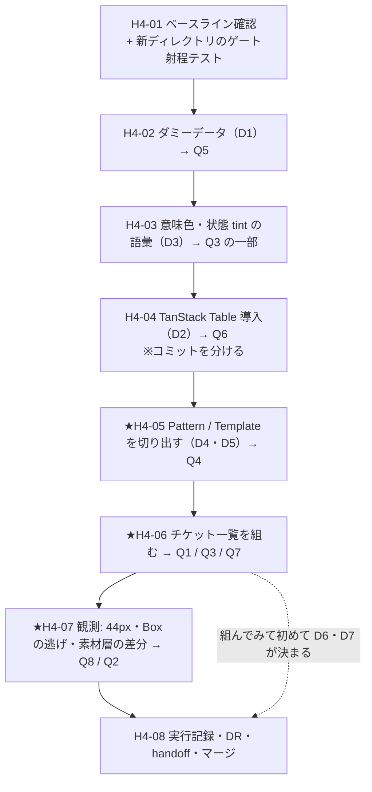

# 手4 — ③ Patterns / Templates 層と一覧

> 段取り上の位置づけ: [UI検証の位置づけと段取り.md](../UI検証の位置づけと段取り.md) §5
> 分類の正本: [共通コンポーネント思想.md](../共通コンポーネント思想.md) ③ Patterns / Templates 層
> 直前の手: [手3](手3_Components層と製品層の分離.md)（done）／実測の記録先: [実行記録.md](../実行記録.md) §手4

**この手の目的は「画面を作ること」ではない。**

[DR-0002](../DR/DR-0002-verify-three-layers-not-screens.md) のとおり**画面は部品を洗い出させるための口実**であり、
手4 のゴールは 2 つ:

1. **手3 で作った製品層が実際に使えるかを、画面を組んで確かめる**（D3=B は「一旦仮」のまま確定している）。
2. **component の足し算では出ないもの（Pattern / Template）が本当にあるかを確かめる**（思想③の検証）。

---

## 0. この手で答えを出す問い（観測項目）★最重要

| #      | 問い | なぜ効くか |
| ------ | ---- | ---------- |
| **Q1** | ★ チケット一覧は**製品層の部品だけで組み切れるか**（素材層への直 import 0 件・`Box` への逃げ回数） | **D3=B（一旦仮）の実証。**組めないなら製品層の再輸出に穴があるか、D3=B が現実的でない |
| **Q2** | ★ **素材層を 1 行でも触るか** | 手5 の前提。手3 に続く 3 回目の観測 |
| **Q3** | ★ tmp-admin の一覧仕様（**行高 60px / ステータス tint pill / 密データ等幅**）は**語彙で表現できるか** | 未決 #13。表現できないなら **semantic 層に何を足す必要があるか**が確定する。🟥 **値は流し込まない**（[DR-0005](../DR/DR-0005-token-ownership-and-two-stage.md) 決定3 の 2 段階） |
| **Q4** | **Pattern / Template は component の足し算で出ないものか** | 思想③そのものの検証。出るなら③層は要らないことになる |
| **Q5** | ダミーデータの props 型は、後で**生成型に差し替えられる形**か | 段取り §4 の仮置き。PoC の契約は `/ping` 1 本だけ |
| **Q6** | TanStack Table を入れたときの**移送コスト**（依存件数・`^` レンジ件数・lock 増分） | 手2b Q5 と同型。**D9=A（手3 から繰り越し）の実行** |
| **Q7** | Sidebar の **Cmd/Ctrl+B が別用途と衝突するか** | 未決 #22。衝突したら [DR-0035](../DR/DR-0035-sidebar-stays-as-vendor.md) を A → B へ変える **1 回目の証明** |
| **Q8** | ★ 当たり判定は**実際に 44px になっているか** | 未決 #23。手3 では CSS の生成しか確認していない。`addon-a11y` は 24px の AA しか見ない（[DR-0034](../DR/DR-0034-touch-target-visual-32-hit-44.md)） |

> Q1・Q2 は手3 の継続。Q3・Q6 は未決の消化。Q4 は思想③の検証。Q7・Q8 は手3 が残した観測項目。

---

## 1. 前提

- **直前の手**: 手3 done（`main` へマージ済み・作業ツリー clean）
- **ベースライン**（[handoff.md](../handoff.md) と一致していること）

  | ゲート | 手3 完了時 |
  | --- | --- |
  | `pnpm typecheck` | 🟦 緑（🟥 **借金で緑**。`exactOptionalPropertyTypes: false`） |
  | `pnpm lint` | 🟥 赤 33（**全部素材層**。製品層・アプリ層は 0 件） |
  | `pnpm build` | 🟦 緑（同じ借金） |
  | `pnpm format:check` / `pnpm spell` / `pnpm build-storybook` | 🟦 緑 |

- **使える部品**（手3 の成果）

  | 層 | 実体 |
  | --- | --- |
  | 製品層 | `src/components/<役割 9 カテゴリ>/` — 再輸出 16 ／ ラッパー 2 ／ 自作 Layout 7 |
  | 配線 | `src/components/providers.tsx`（`AppProviders`） |
  | 語彙 | `src/app/tokens.css` — semantic 21 |

- **組む画面の仕様**（tmp-admin §4。**形だけ写す。値は手5**）
  - 面は 3 層: 濃紺サイドバー（chrome）／キャンバス／白カード
  - サイドバー: sticky・nav-item は min-height 44px（手3 で実装済み）
  - テーブル: **行高 60px**・罫線控えめ・行 hover・**行は `role="button"` で詳細シートを開く**（行アクション列を持たない）
  - **密データは等幅**（ID・タイムスタンプは `--font-mono` / `tabular-nums`）
  - ステータス = **tint pill + 色ドット**／accent は**フォーカスリングのみ**

---

## 2. 着手前に決めること（判断ポイント）

> **実行中に §2 に無い選択肢が出たら、その場で決めずにここへ追記してから進む**（手1〜手3 で 5 回機能している規律）。

| #      | 論点 | 選択肢 | 決定 | 根拠 | 戻せるか |
| ------ | ---- | ------ | ---- | ---- | -------- |
| **D1** | ダミーデータの形と置き場（未決 #7） | **A** 使い捨ての手書き（`src/lib/fixtures/`）<br>**B** design 側で issues の Zod 契約を書く<br>**C** faker で生成 | 🟨 **A**（段取り §4 の仮置きを踏襲） | **B は契約の正本が 2 箇所に割れる**（PoC の「正本 1 つ・残りは導出」に反する）。C は依存が増えるうえ、**移送しないコードに依存を足す理由が無い**。🟦 **props 型は後で生成型に差し替わる前提**で組む（→ Q5） | 🟦 戻せる |
| **D2** | TanStack Table（**D9=A の繰り越し**） | **A** 入れる<br>**B** 素の `Table` で組む | ✅ **A**（手3 D9 のユーザー判断を引き継ぐ） | 🟥 **手3 で実行し損ねたので手4 で実行する。**決定を覆すのではなく実行時期の訂正。**他の作業とはコミットを分ける**（移送コストを単独で測るため） | 🟦 戻せる |
| **D3** | ★ 意味色と状態 tint の語彙（未決 #13） | **A** 手4 で足す<br>**B** 手5 まで足さない | 🟨 **A**（**語彙だけ。値は既定への参照**） | ステータス表示は**チケット一覧の中核**で、`destructive` しか無いと組めない。🟥 **[DR-0005](../DR/DR-0005-token-ownership-and-two-stage.md) 決定3 に従い値は書かない**——`--color-success` 等は既定への参照で置き、手5 で tmp-admin の値へ向け替える | 🟦 戻せる |
| **D4** | Pattern / Template の置き場 | **A** `src/components/Patterns/` `Templates/`（役割カテゴリと並べる）<br>**B** `src/patterns/` `src/templates/`（別の階層）<br>**C** アプリ層に直接書く | 🟨 **B** | **A は却下**——役割 9 カテゴリは**② Components 層の分類**であり、③ は**別の層**。同じ階層に置くと層が混ざる。**C は再利用の単位にならない**（思想③「同じ作り方を踏襲する指針」が失われる）。B なら `src/components/`（②）と `src/patterns/`（③）で層がディレクトリに現れる | 🟦 戻せる |
| **D5** | 詳細シート（右スライド）を組むか | **A** 組む<br>**B** 一覧だけにする | 🟨 **A** | tmp-admin §4.1・§4.4 が「行クリック → 右スライドシート」を規定しており、**Overlay 層と Pattern 層の接続点**になる。**Q4（足し算で出ないもの）の実例**としても要る | 🟦 戻せる |
| **D6** | D3=B（画面は製品層しか import しない）の再評価 | **A** 維持<br>**B** 緩める | ✅ **A — 維持**（Q1 の実測後・2026-07-26） | チケット一覧を組み切って、**素材層への直 import 0 件・`Box` への逃げ 0 回・製品層/③層/アプリ層の lint 赤 0 件**。**不自由が 1 件も出なかった**ので緩める理由が無い。🟨 手3 で付けた「一旦仮」の但し書きは外す | 🟦 戻せる |
| **D7** | 行高 60px などの寸法をどう表現するか | **A** semantic 語彙を足す<br>**B** Layout の props に足す<br>**C** 手5 まで既定のまま | ✅ **A — semantic 語彙を足す**（Q3 の実測後・2026-07-26） | **B は却下**——行高は `DataGrid`（DataDisplay）が使うもので、Layout プリミティブの props に置くと**カテゴリをまたぐ**。実際に足したのは `--spacing-row`（60px）と `--spacing-dot`（6px）で、**どちらも `--spacing` への参照**（値は書いていない）。🟨 `DataGrid` は `h-row` を className で書いているが、これは製品層なので枠の内側 | 🟦 戻せる |

### 追記（2026-07-26・H4-01 の赤テストで判明）

🟥 **枠が新ディレクトリに届いていなかった。**`src/patterns/` `src/templates/` `src/lib/` に赤テスト用の
`p-13` / `text-gray-600` / 素材層の直 import を置いたが、**lint は exit 0 で 1 件も出さなかった**。

`--print-config` で確認すると:

| ルール | 新ディレクトリでの状態 |
|---|---|
| `no-restricted-syntax`（数値の段・パレット色） | 🟥 **Server Actions 禁止だけ**。手3 で足した 8 セレクタが当たっていない |
| `no-restricted-imports`（素材層の直 import 禁止） | 🟥 **なし** |
| `tailwindcss/no-arbitrary-value` | 🟦 有り（全ファイル対象なので） |

**原因**: 手3 の設定は `files` を `src/components/**` と `src/app/**`（＋ story）に限定していた。
③ 層のディレクトリは手3 の時点で存在しなかったので、**射程に入れようがなかった。**

| #      | 論点 | 選択肢 | 決定 | 根拠 | 戻せるか |
| ------ | ---- | ------ | ---- | ---- | -------- |
| **D8** | ③ 層（`src/patterns/` `src/templates/`）を枠に入れるか | **A** 入れる（②・アプリ層と同じ扱い）<br>**B** 入れない<br>**C** 数値の段だけ入れて import 制限は入れない | ✅ **A** | ③ 層は**② の上**にあり、素材層を直接触ってよい理由が無い。**入れないと「Pattern だけ枠の外」という抜け道**ができ、D3=B が形骸化する。🟨 `src/lib/**` は className を書く場所ではないので対象外のままにする（`utils.ts` は shadcn 由来の `cn` ヘルパ） | 🟦 戻せる |

> 🟦 **H4-01 を H4-05 より前に置いた理由がそのまま出た。**Pattern を書いてから気づいていたら、
> **書いたコード全部を検査し直すことになっていた。**「対象 0 件で緑」を疑う規律が **3 度目**に効いた
> （1 度目: 手0 の赤テスト／2 度目: 手2b の `.storybook/**`）。

---

## 3. 成果物

| 成果物 | 内容 |
| --- | --- |
| `src/lib/fixtures/issues.ts` | ダミーデータ（使い捨て・手書き。D1） |
| `src/app/tokens.css` | 意味色 `success` / `warning` と状態 tint の語彙（D3・**値は参照のみ**） |
| `src/patterns/` | Pattern（空状態 / 一覧+詳細 / 確認ダイアログの作り方） |
| `src/templates/` | Template（サイドバー + 本文のページ骨格） |
| `src/components/DataDisplay/DataGrid.tsx` | TanStack Table の組み合わせ部品（D2） |
| `src/app/page.tsx` | チケット一覧（製品層 + Pattern / Template だけで組む） |
| story | Pattern / Template / DataGrid の story（層タグ `own`） |
| `docs/実行記録.md` §手4 | Q1〜Q8 の答え・ベースライン差分 |

---

## 4. 作業フロー



**H4-05 を H4-06 より前に置く理由**: 先に画面を組んでから Pattern を切り出すと、
**「足し算で出ないものがあったか」（Q4）が後知恵になる**。**先に仮説として切り出し、組みながら検証する。**

---

## 5. 手順

### H4-01 ベースライン確認とゲートの射程テスト

- **目的**: 手3 完了時の数字を確定し、**新設ディレクトリがゲートに検査されるか**を先に確かめる
- **実行**: 6 ゲートを回す → 各新ディレクトリに `_probe/` を切って赤テスト
- **検証**: lint / typecheck / format / spell が**それぞれ新しい赤を出す**こと
- **判断**: 見ていないゲートがあれば設定を直し、**§2 へ追記**
- **詰まったら**: 🟥 **プローブは `_probe/` に隔離する**（手3 で `rm -rf` が成果物を巻き込んだ）

### H4-02 ダミーデータ（D1）

- **目的**: 一覧に流すデータを作る。**後で生成型へ差し替えられる形にする**（Q5）
- **実行**: `src/lib/fixtures/issues.ts` に型 + 配列（ID / 件名 / ステータス / 優先度 / 担当者 / 更新日時）
- **検証**: 型が 1 箇所に閉じており、**差し替え点が 1 行で分かる**こと
- **観測**: ★**Q5**

### H4-03 意味色と状態 tint の語彙（D3）

- **目的**: ステータス表示を組めるようにする。未決 #13 の消化
- **実行**: `tokens.css` に意味色と状態 tint を足す。🟥 **値は書かず既定への参照**
- **検証**: 生成 CSS に出ること（「対象 0 件で緑」を疑う）
- **観測**: ★**Q3** の一部。**足した語彙の件数と、なぜ必要だったか**を記録する

### H4-04 TanStack Table の導入（D2・手3 からの繰り越し）

- **目的**: DataGrid を作る。**移送コストを単独で測る**（Q6）
- **実行**: 導入前の依存件数を控える → **厳密ピン**で追加 → `DataDisplay/DataGrid.tsx`
- **観測**: ★**Q6** — 依存の増分・`^` レンジ件数・`pnpm-lock.yaml` の増分
- **詰まったら**: 🟥 **このステップだけでコミットを分ける**

### ★H4-05 Pattern / Template を切り出す（D4・D5）

- **目的**: **component の足し算では出ないものを、先に仮説として置く**（Q4）
- **実行**: `src/patterns/`（空状態 / 一覧 + 詳細 / 確認ダイアログ）と `src/templates/`（ページ骨格）
- **検証**: **製品層の部品だけ**で書けていること
- **観測**: ★**Q4** — 🟥 **「これは component の足し算で書けるのでは？」と思ったものは、その場で記録する。**
  足し算で書けるものばかりなら、**思想③の層は不要という発見になる**

### ★H4-06 チケット一覧を組む

- **目的**: **手3 の製品層が実際に使えるかの実証**（Q1）
- **実行**: `src/app/page.tsx` を Template + Pattern + 製品層で組む。**形だけ tmp-admin に合わせ、値は既定のまま**
- **検証**: `grep -rn 'components/ui/' src/app src/patterns src/templates` が **0 件**／製品層・アプリ層の lint 赤が **0 件**
- **観測**: ★**Q1**（`Box` の逃げ回数も数える）／★**Q3**（語彙で書けなかったものを列挙）／★**Q7**
- **判断**: **D6**（D3=B を維持するか）と **D7**（寸法語彙）をここで決める

### ★H4-07 観測を取る

- **実行**:
  ```bash
  git diff --stat main -- src/components/ui/    # Q2: 空であること
  grep -rn '<Box' src/ | wc -l                  # Q1: Box への逃げ回数
  pnpm storybook                                # Q8: 当たり判定を DevTools で測る
  ```
- **観測**: ★**Q2**・★**Q8**
- **判断**: 🟥 **Q8 が 44px でなければ [DR-0034](../DR/DR-0034-touch-target-visual-32-hit-44.md) の実装が誤っている。**
  その場で直さず、**まず観測結果を記録してから**原因を切り分ける
- **詰まったら**: **測れなかったら「測れなかった」と記録する**

### H4-08 実行記録・DR・handoff・マージ

- **検証**: 未決 #7 / #13 / #21 / #22 / #23 が決着または残留理由つきで更新されている

---

## 6. 完了条件

- [ ] ★ **チケット一覧が製品層の部品だけで組めている**（素材層への直 import 0 件）
- [ ] ★ **Q1〜Q8 すべてに答えが出ている**
- [ ] ★ **Q2 = 素材層に差分ゼロ**
- [ ] **Q4 の答えが「足し算で出ないものが N 件あった／無かった」の形で列挙されている**
- [x] §2 の D6・D7 が決着している（**D6=A 維持／D7=A 語彙を足す**）
- [ ] 機械ゲート 6 本を回し、ベースラインとの差分が実行記録にある
- [ ] 🟥 **`git status --short` が空**
- [ ] 未決 #7 / #13 / #21 / #22 / #23 が更新されている
- [ ] コミット済み・`main` へマージ済み

> **本当の完了条件は 1 番目と 4 番目。**手4 の価値は画面ができたことではなく、
> **製品層が使えると分かったこと**と**思想③の層が要るかが分かったこと**。

---

## 7. 出典

| 出典 | 何を取るか |
| --- | --- |
| `~/git/CC-Skills/.../aux-admin.md` §4.1〜4.5 | 一覧画面の形（3 層の面・行高 60px・tint pill・等幅・accent はフォーカスのみ） |
| `~/git/PoC/apps/redmine-api/src/contract/paths/redmine.ts` | 🟥 **契約は `/ping` 1 本のみ**＝ダミーデータは手書きしかない（実測 2026-07-26） |
| [共通コンポーネント思想.md](../共通コンポーネント思想.md) ③ | Pattern ≠ Template ≠ component（Nathan Curtis） |
| [トークンマッピング.md](../トークンマッピング.md) 2.4 | 意味色 success / warning・状態 tint 4 種が**写す先を持たない**（未決 #13） |
