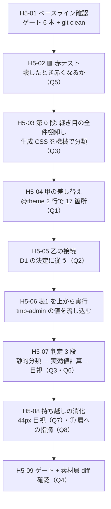

# 手5 — ★ トークン差し替え実験

> 段取り上の位置づけ: [UI検証の位置づけと段取り.md](../UI検証の位置づけと段取り.md) §5
> 直前の手: [手4](手4_PatternsTemplates層と一覧.md)（done）／実測の記録先: [実行記録.md](../実行記録.md) §手5

**この検証の核心その 1。**「トークンを差し替えたとき、**部品を 1 行も触らずに**見た目が変わるか」を測る手。

[DR-0005](../DR/DR-0005-token-ownership-and-two-stage.md) が決めた **2 段階投入の 2 段目**にあたる。
手1〜手4 は shadcn デフォルトの値のまま組み切ってきた。ここで初めて `tmp-admin` の値を流し込む。

---

## 0. この手で答えを出す問い（観測項目）★最重要

**🟥 元の問い「事前特定 15 件以外に変わらない箇所が出るか」は使わない。**
[DR-0043](../DR/DR-0043-recount-of-fifteen-unchanged-spots.md) が 15 件を再判定した結果、
**母数が 1 件になった**ので、問いを 3 つに割り直した（Q1〜Q3）。

| #      | 問い                                                                                                                 | なぜ効くか（どの判断が変わるか）                                                                                                                                             |
| ------ | -------------------------------------------------------------------------------------------------------------------- | ---------------------------------------------------------------------------------------------------------------------------------------------------------------------------- |
| **Q1** | ★ **甲の 17 箇所は本当に追従するか**（blur 2 箇所・weight 500 **15 箇所**）                                          | [DR-0041](../DR/DR-0041-tailwind-v4-seams-differ-per-utility.md) は生成 CSS から「継ぎ目がある」と読んだだけ。**`@theme` 2 行で 17 箇所が動くはず**という予測の検証            |
| **Q2** | ★ **乙の 6 件を接続したとき、部品側の変異を潰さずに済むか**（`data-[size=sm]` / `focus-visible:` / `hover:`）        | [DR-0042](../DR/DR-0042-layer-external-override-reaches-properties.md)。上書きは**所有権を外へ移す**ので変異が平坦化する。潰れるなら D1 の選択肢が狭まる                        |
| **Q3** | ★ **[DR-0043](../DR/DR-0043-recount-of-fifteen-unchanged-spots.md) の 16 行に無い場所で追従しないものが出るか**       | **元の問いはここだけに残る。**出るなら事前特定の方法（静的な grep）に穴がある                                                                                                 |
| **Q4** | ★ **素材層を 1 行でも触るか**（`src/components/ui/**` の diff 件数）                                                 | 手3・手4 に続く **4 回目**の観測。ここで触ったら「部品を触らずに」という前提そのものが崩れる                                                                                 |
| **Q5** | ★ **トークンを壊したとき赤くなる仕組みがあるか**（[OBS-0003](../OBS/OBS-0003_対象0件で緑が5回出た.md) の 6 例目）    | 🟥 **書いたのに効かないことを機械は教えない。**`@theme` に `--shadow-md` と書いてもビルドは緑で何も変わらない。**先に赤テストをする**                                          |
| **Q6** | **層ごとの合否**（[DR-0033](../DR/DR-0033-step5-criteria-differ-per-layer.md)）は story の層タグで実際に切り分けられるか | 手3・手4 で `vendor` 16 ／ `wrapped` 2 ／ `own` 10 のタグを打った。**タグが判定に使えなければ、打った意味が無かったことになる**                                              |
| **Q7** | 🟨 **当たり判定 44px は実際に 44px か**（未決 #23・4 回目の持ち越し）                                                | 手3 は CSS の生成、手4 は実効値計算まで。**ブラウザでの実測は一度もしていない。**`addon-a11y` は 24px の AA しか見ない                                                        |
| **Q8** | 🟨 **① Tokens 層にも思想への指摘が出るか**（[指摘](../共通コンポーネント思想への指摘.md) §8 の 8 件目）              | 現在 7 件のうち **5 件が ② 層**に集まっている。**手5 は ① 層を初めて本気で使う手**なので、偏りが「層の性質」か「使い込みの量」かが分かる                                     |

> Q1〜Q3 が本体。Q4〜Q6 は前提の確認。Q7・Q8 は持ち越しの消化。

---

## 1. 前提

- **直前の手**: 手4 done（`main` へマージ済み・作業ツリー clean）
- **ベースライン**（[handoff.md](../handoff.md) の表と一致していること）

  | ゲート                        | 手4 完了時                                                                |
  | ----------------------------- | ------------------------------------------------------------------------- |
  | `pnpm typecheck`              | 🟦 緑（🟥 **借金で緑**。`exactOptionalPropertyTypes: false`＝DR-0014）     |
  | `pnpm lint`                   | 🟥 **error 33**（全部素材層）／ warning 1（TanStack Table 由来）           |
  | `pnpm build`                  | 🟦 緑（同じ借金）                                                          |
  | `pnpm format:check`           | 🟦 緑                                                                      |
  | `pnpm spell`                  | 🟦 緑（`oklab` を追加済み）                                                |
  | `pnpm build-storybook`        | 🟦 緑（story 29 本）                                                       |

- **値の出どころ**: `~/git/CC-Skills` の `tmp-admin` 哲学（`status: approved`）。[DR-0005](../DR/DR-0005-token-ownership-and-two-stage.md)
- **語彙の正本**: [トークンマッピング.md](../トークンマッピング.md) 表1 —— **表1 を上から順に実行するのが手5 の本体**
- **差し替え可否の内訳**: [トークンマッピング §5 の訂正表](../トークンマッピング.md)（＝[DR-0043](../DR/DR-0043-recount-of-fifteen-unchanged-spots.md)）

### 判定方法（確定済み。ここは決め直さない）

| 前提                                                                                                                   | 出典                                                                          |
| ---------------------------------------------------------------------------------------------------------------------- | ----------------------------------------------------------------------------- |
| 判定は **① 参照の形で静的分類 ② 実効値の計算 ③ 目視**の 3 段。**生成 CSS の diff では判定できない**（全部 `var()` 参照） | [DR-0027](../DR/DR-0027-token-swap-not-detectable-by-css-diff.md)             |
| 🆕 **3 段の前に「継ぎ目があるか」を測る段（第 0 段）が要る。**ソースの `font-medium` を見ても分からず、生成 CSS を見る  | [DR-0041](../DR/DR-0041-tailwind-v4-seams-differ-per-utility.md)              |
| 合否の定義は**層ごとに違う**。素材層＝「触っていない」／製品層・③層・アプリ層＝「生値も数値の段もパレット色も書いていない」 | [DR-0033](../DR/DR-0033-step5-criteria-differ-per-layer.md)                   |
| 判定は **Storybook 側に固定する**（本体は hex+lab、Storybook は oklch で出力形式が違う）                                | [DR-0026](../DR/DR-0026-two-css-pipelines-differ.md)                          |
| story の**層タグ**（`vendor` 16 ／ `wrapped` 2 ／ `own` 10）で由来を切り分ける                                          | 手3・手4                                                                      |
| 差し替えの**向きも記録する**。`min(var(--radius-md), 10px)` は小さくする方向なら追従、大きくすると頭打ち                | [DR-0027](../DR/DR-0027-token-swap-not-detectable-by-css-diff.md)             |
| component token は**レイヤ外から向け替えられる**。`--card-spacing` で 1 件成立済み。**同型の接続点を全件探す**          | [DR-0029](../DR/DR-0029-component-token-overridable-outside-layer.md)・[DR-0036](../DR/DR-0036-card-spacing-points-to-semantic.md) |
| 🆕 レイヤ外の上書きは**プロパティにも届く**が、**変異を潰す**。「向け替え」と「上書き」は別物として記録する             | [DR-0042](../DR/DR-0042-layer-external-override-reaches-properties.md)        |
| 🟥 **「対象 0 件で緑」を警戒する。**トークンを消してもビルドは緑になる（5 例目まで観測済み）                            | [OBS-0003](../OBS/OBS-0003_対象0件で緑が5回出た.md)・[DR-0028](../DR/DR-0028-token-frame-is-not-closed.md) |

---

## 2. 着手前に決めること（判断ポイント）

> **戻しにくい決定はここに全部出す。**実行中に §2 に無い選択肢が出たら、**その場で決めずにここへ追記してから進む**（手1・手2 で 2 度機能した規律）。

| #      | 論点                                                                                    | 選択肢                                                                                                                                                                              | 決定  | 根拠 | 戻せるか      |
| ------ | --------------------------------------------------------------------------------------- | ------------------------------------------------------------------------------------------------------------------------------------------------------------------------------------- | ----- | ---- | ------------- |
| **D1** | 🟥 **最優先。乙のうち「上書きでしか解けない」9 箇所（影 7・スクリム 2）をどう扱うか**   | **A** 全部レイヤ外上書きで解く（追従はするが shadcn の内部構造への依存が増える）／ **B** 変数の向け替えで解けるものだけ解き、影・スクリムは「変わらない」と記録する／ **C** 製品層ラッパーで解く（`DialogContent` は overlay に props を渡さないので不可・実測済み） | 未決  |      | 🟦 戻せる     |
| **D2** | 差し替えの**単位**（実験の可逆性）                                                      | **A** `tokens.css` を直接書き換える／ **B** `tmp-admin.css` を別ファイルで足し、import の 1 行で切り替える（before/after を並べて比較できる）                                        | 未決  |      | 🟦 戻せる     |
| **D3** | 差し替えの**向き**を両方試すか                                                          | **A** tmp-admin 方向のみ／ **B** 大きくする方向・小さくする方向の両方（(B) 群 6 件の頭打ちを観測できる）                                                                             | 未決  |      | 🟦 戻せる     |
| **D4** | 未決 #6 — **`preset` ごと差し替える軸**を手5 に含めるか                                 | **A** 含める（`nova` → 別 preset で「部品の形」まで変わるかを見る）／ **B** 含めない（トークン差し替えとは別の軸なので手7 以降へ）                                                    | 未決  |      | 🟦 戻せる     |
| **D5** | 角丸の**非線形 5 段**（tmp-admin は 8/12/18/28。shadcn は単一基数からの比率派生）        | **A** `--radius` 1 変数だけ動かし「段の比率は固定」と記録する／ **B** 段ごとに `@theme inline` で上書きする（＝**語彙の追加**にあたる）                                              | 未決  |      | 🟦 戻せる     |
| **D6** | 未決 #16 — **色空間の差**（本体 hex+lab ／ Storybook oklch）を前提として明示するか       | **A** 手5 の実行記録に前提として書くだけ／ **B** DR に切り出す／ **C** 本体側の出力を Storybook に揃える（ビルド設定を触る）                                                        | 未決  |      | 🟨 C は不可逆 |

### D1 の補足（なぜここが最優先か）

[DR-0042](../DR/DR-0042-layer-external-override-reaches-properties.md) が示したとおり、**「届く」と「やるべき」は別**。

| 手口                     | 変異（`data-[size=sm]` 等） | 壊れ方                                             |
| ------------------------ | --------------------------- | -------------------------------------------------- |
| 変数の**向け替え**       | 🟦 保たれる                 | shadcn が変数名を変えたら効かなくなる（気づける）  |
| プロパティの**上書き**   | 🟥 潰れる                   | shadcn が variant を足したら**黙って潰す**（気づけない） |

**A を選ぶと「部品を触らずに変えられた」という結論は取れるが、その代償を測っていないことになる。**
D1 は Q2 の答えを左右するので、**実行前に決める**（実行中に変えると before/after が比較できなくなる）。

---

## 3. 成果物

- `src/app/` — tmp-admin の値を流し込んだトークン定義（形は D2 で決める）
- 🟥 **`src/components/ui/**` の diff は 0 行**（Q4。1 行でも動いたら前提が崩れている）
- [実行記録.md](../実行記録.md) §手5 — Q1〜Q8 の答えと、**追従しなかった箇所の全件列挙**
- DR — 少なくとも「追従率の実測」と「D1 の決定」の 2 件は出る見込み

---

## 4. 作業フロー



**H5-02 を H5-03 より前に置くのは意図的。**手2b・手4 で「射程を先に確かめる」順序が 2 度効いた
（[DR-0025](../DR/DR-0025-storybook-init-is-not-selectable.md)・[DR-0040](../DR/DR-0040-frame-leaks-when-a-layer-is-added.md)）。
**測る道具が壊れていないことを、測り始める前に確かめる。**

---

## 5. 手順

### H5-01 ベースラインの確認

- **目的**: 「新しい赤」を見分けられる状態から始める
- **実行**:
  ```bash
  git status --porcelain          # 空であること
  pnpm typecheck && pnpm lint; pnpm build && pnpm format:check && pnpm spell && pnpm build-storybook
  ```
- **期待結果**: §1 の表と件数が一致（lint は error 33 / warning 1）
- **検証**: 一致しないなら**手5 に入る前に原因を特定する**（第 3 セッションで `spell` のベースラインが陳腐化していた前例がある）
- **観測**: なし
- **判断**: なし
- **詰まったら**: `git stash -u` して HEAD 単体で回す対照実験（陳腐化の切り分け方は handoff に前例あり）

### H5-02 🟥 赤テスト — 壊したとき赤くなるか

- **目的**: **Q5。**「書いたのに効かない」を機械が教えてくれないことを、先に確定させる
- **実行**: 次の 3 つを 1 つずつ入れて `pnpm build-storybook` を回す（毎回戻す）
  1. `@theme { --shadow-md: 0 0 0 red; }` — **効かないはず**（`shadow-*` はリテラル焼き込み＝DR-0041）
  2. `@theme { --font-weight-medium: 900; }` — **効くはず**（15 箇所が動く）
  3. `@theme { --spacing: initial; }` — 素材 18 部品の余白が全部消えるが**緑で完走するはず**（DR-0028 で観測済み）
- **期待結果**: **3 つとも exit 0**。1 と 3 は「緑なのに壊れている / 緑なのに何も起きていない」
- **検証**: 生成 CSS を grep して**実際に値が変わったか**を確認する。**ビルドの成否では判定しない**
- **観測**: **Q5。**赤くなる仕組みが無いことが確定したら、H5-07 の判定は**すべて生成 CSS と目視で行う**
- **判断**: なし（[OBS-0003](../OBS/OBS-0003_対象0件で緑が5回出た.md) に 6 例目として追記するかは棚卸しで）
- **詰まったら**: プローブは **`src/app/` の成果物と同じファイルに書かない**（手3 で `rm -rf` が成果物を巻き込んだ前例）。
  一時ファイルを作り、撤去後に `git status --porcelain` が空であることを確認する

### H5-03 第 0 段 — 継ぎ目の全件棚卸し

- **目的**: **Q3。**[DR-0043](../DR/DR-0043-recount-of-fifteen-unchanged-spots.md) の 16 行が全件かを確かめる。
  **事前特定は grep（ソース側）で作ったが、継ぎ目の有無はソースを見ても分からない**（DR-0041）
- **実行**: `storybook-static/assets/iframe-*.css` を機械で分類する
  ```bash
  pnpm build-storybook
  # 宣言を全件抜き、右辺が var() を含むか / リテラルかで二分する
  ```
- **期待結果**: 「リテラルを焼き込んでいる宣言」の全件リスト。**16 行に無いものが出たら Q3 の答えが yes**
- **検証**: 抽出したリストと [DR-0043](../DR/DR-0043-recount-of-fifteen-unchanged-spots.md) の表を突き合わせる
- **観測**: **Q3。**差分がそのまま「事前特定の穴」になる
- **判断**: 🟨 **件数が多すぎて全件は追えない場合、どこで切るかは §2 へ追記してから決める**
- **詰まったら**: `.dark` ブロック 31 件と `--chart-*` 5 件は**非対象**（[トークンマッピング §4](../トークンマッピング.md)）。先に除外する

### H5-04 甲の差し替え — `@theme` 2 行で 17 箇所

- **目的**: **Q1。**最も安く効くはずの 2 件を先に打つ
- **実行**: `src/app/tokens.css` の `@theme` に 2 行
  ```css
  --blur-xs: 0px;                                    /* V1「blur を使わない」 */
  --font-weight-medium: var(--font-weight-semibold); /* V3「強調は 600 ⇔ 400」 */
  ```
- **期待結果**: blur **2 箇所**（`dialog.tsx` / `sheet.tsx` の overlay）と weight **15 箇所**が動く
- **検証**: 生成 CSS で `--blur-xs` / `--font-weight-medium` の `:root` 値が変わっていること＋ **Storybook で目視**
- **観測**: **Q1。**17 箇所すべてが動いたか、部分的か
- **判断**: なし
- **詰まったら**: 動かないなら `@theme` の**外**に書いてしまっている可能性（`@theme` の中でないと `:root` に出ない）

### H5-05 乙の接続 — D1 の決定に従う

- **目的**: **Q2。**継ぎ目が無い 6 件を、素材層を触らずに接続する
- **実行**: [DR-0043](../DR/DR-0043-recount-of-fifteen-unchanged-spots.md) の乙 6 件を手口別に

  | 手口                        | 対象                                                                      |
  | --------------------------- | ------------------------------------------------------------------------- |
  | 製品層ラッパー（既存）      | `button.tsx` の `text-[0.8rem]`（`Button`）／ `checkbox.tsx` の `rounded-[4px]` |
  | 製品層から `style` を渡す   | `--sidebar-width` desktop（`SidebarProvider` が `...style` を後ろで展開）  |
  | アプリ層で差し替え          | `--font-sans`（`src/app/layout.tsx` の `next/font`）                       |
  | 🟥 レイヤ外上書き（**D1**） | 影 7 箇所・スクリム 2 箇所                                                |

- **期待結果**: 接続後、**トークン側を動かすと追従する**（＝継ぎ目になっている）
- **検証**: 🟥 **接続した箇所ごとに、部品側の変異が生きているかを確かめる。**
  `Button` の `size=sm`／`Checkbox` の `focus-visible:`／`Card` の `data-[size=sm]`（DR-0029 §4 の前例）
- **観測**: **Q2。**潰れた変異を全件記録する
- **判断**: **D1。**A を採った場合、潰れた変異の件数が A の代償の実測値になる
- **詰まったら**: `DialogContent` は `<DialogOverlay />` を**引数なしで描画する**ので props では届かない（実測済み）。
  スクリムはレイヤ外の `[data-slot='dialog-overlay']` からしか触れない

### H5-06 表1 を上から実行 — tmp-admin の値を流し込む

- **目的**: [DR-0005](../DR/DR-0005-token-ownership-and-two-stage.md) の 2 段階投入の 2 段目
- **実行**: [トークンマッピング.md](../トークンマッピング.md) 表1（2.1 色 → 2.2 サイドバー → 2.3 spacing/typo/角丸/影 → 2.4 未対応語彙）を上から
- **期待結果**: 1:1 **17** / 多:1 **8** / 1:多 **1** が写り、「無し **22**」のうち手2〜手4 で語彙を足した分が埋まっている
- **検証**: 🟥 **`--primary` に `--color-accent`(#005fa2) を入れない**（V2「accent を塗りに使わない」。表3 #1）
- **観測**: **Q3。**写せなかったものを全件記録する
- **判断**: **D5**（角丸の非線形 5 段）。**D3**（向きを両方試すか）
- **詰まったら**: `.dark` は対象外（[DR-0020](../DR/DR-0020-dark-mode-out-of-scope.md)）。`--sidebar-*` の 5 語彙は 1:1 で写る（表1 2.2）

### H5-07 判定 3 段

- **目的**: **Q3・Q6。**何が変わり何が変わらなかったかを確定させる
- **実行**:
  1. **静的分類** — 参照の形で分類（追従 / 条件つき追従 / 非追従）。層タグで `vendor` / `wrapped` / `own` に切る
  2. **実効値の計算** — `var()` の連鎖を解いて px を出す
  3. **目視** — `pnpm storybook` で全 29 story を before/after で見る
- **期待結果**: 層ごとの追従率（[DR-0033](../DR/DR-0033-step5-criteria-differ-per-layer.md) の合否定義に従う）
- **検証**: 🟥 **生成 CSS の diff を「変わらなかった証拠」として使わない**（[DR-0027](../DR/DR-0027-token-swap-not-detectable-by-css-diff.md)。1 行しか動かない）
- **観測**: **Q3**（16 行に無い非追従）・**Q6**（層タグが判定に使えたか）
- **判断**: なし
- **詰まったら**: 判定は **Storybook 側に固定**（[DR-0026](../DR/DR-0026-two-css-pipelines-differ.md)）。本体アプリの CSS と突き合わせない

### H5-08 持ち越しの消化

- **目的**: **Q7・Q8**
- **実行**:
  - **Q7（未決 #23）**: `pnpm storybook` を開き、DevTools で `Button` の `::after` の実寸を測る。
    `@media (pointer: coarse)` を device emulation で有効にすること（**しないと 32px のまま見える**）
  - **Q8**: ① 層を使い込んで出た違和感を [共通コンポーネント思想への指摘.md](../共通コンポーネント思想への指摘.md) に 8 件目として追記
- **期待結果**: Q7 は 44px（32 + 6×2）。Q8 は 0 件でもよい（**0 件なら「② 層に偏るのは層の性質」の側に証拠が寄る**）
- **検証**: 🟥 `addon-a11y` の緑を根拠にしない（axe-core 4.12.1 の `target-size` は **24px の AA** しか見ない）
- **観測**: **Q7・Q8**
- **判断**: なし。🟥 **思想は書き換えない**（ユーザーの持ち物）
- **詰まったら**: Q7 が 44px にならない場合、[DR-0034](../DR/DR-0034-touch-target-visual-32-hit-44.md) の D=当たり判定拡張が成立していないことになる（**それ自体が発見**）

### H5-09 ゲートと素材層 diff の確認

- **目的**: **Q4。**「部品を触らずに」という前提が保たれたか
- **実行**:
  ```bash
  git diff --stat main -- src/components/ui/    # 🟥 空であること
  pnpm typecheck && pnpm lint; pnpm build && pnpm format:check && pnpm spell && pnpm build-storybook
  ```
- **期待結果**: 素材層の diff **0 行**。lint の error は **33 のまま**（増えたら製品層かトークン層に生値を書いている）
- **検証**: 🟥 **レイヤ外 CSS は lint の射程外**（`no-restricted-syntax` は className / cva / cn しか見ない＝[DR-0038](../DR/DR-0038-arbitrary-value-rule-sees-three-contexts.md)）。
  **`tokens.css` に生値を書いても緑のまま通る。**目で確認する
- **観測**: **Q4**
- **判断**: なし
- **詰まったら**: 素材層に diff が出ていたら、**戻してから**別の手口を探す（触った時点で手5 の観測が無効になる）

---

## 6. 完了条件

- [ ] 機械ゲート 6 本の結果が [handoff.md](../handoff.md) の表と突き合わせ済み（**赤で終わってもよい。内訳が実行記録にあること**）
- [ ] 🟥 **`src/components/ui/**` の diff が 0 行**（Q4）
- [ ] §0 の問い Q1〜Q8 すべてに答えが出ている
- [ ] §2 の判断 D1〜D6 がすべて決着し、根拠が書かれている
- [ ] **追従しなかった箇所が全件列挙されている**（[DR-0043](../DR/DR-0043-recount-of-fifteen-unchanged-spots.md) の 16 行との差分が分かる形で）
- [ ] 🟥 **プローブがすべて撤去され `git status --porcelain` が空**
- [ ] 実行記録に §手5 の節が追加されている
- [ ] コミット済み（`<type>(H5): 要約 [手5]`）／ `main` へ `--no-ff` マージを**提案**（実行はしない）

---

## 7. 出典

- [トークンマッピング.md](../トークンマッピング.md) — 表1（実行手順そのもの）・§5 訂正表
- [DR-0043](../DR/DR-0043-recount-of-fifteen-unchanged-spots.md) — 数え直し（未決 #18 の答え）
- [DR-0041](../DR/DR-0041-tailwind-v4-seams-differ-per-utility.md) / [DR-0042](../DR/DR-0042-layer-external-override-reaches-properties.md) — 継ぎ目と上書きの実測
- [DR-0027](../DR/DR-0027-token-swap-not-detectable-by-css-diff.md) — 判定 3 段
- [DR-0033](../DR/DR-0033-step5-criteria-differ-per-layer.md) — 層ごとの合否
- `~/git/CC-Skills` の `tmp-admin` 哲学（値の出どころ・`status: approved`）
