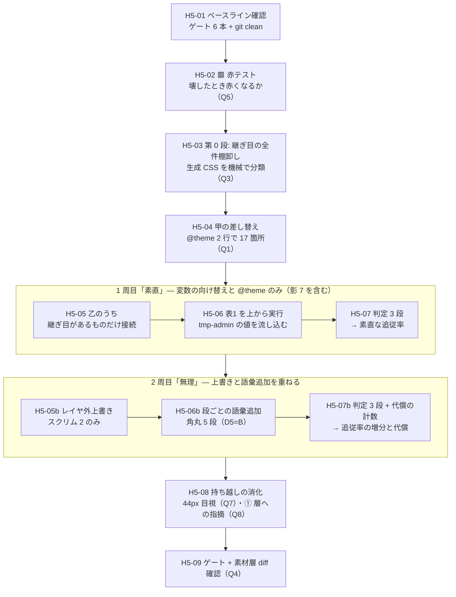

# 手5 — ★ トークン差し替え実験

> 段取り上の位置づけ: [UI検証の位置づけと段取り.md](../UI検証の位置づけと段取り.md) §5
> 直前の手: [手4](手4_PatternsTemplates層と一覧.md)（done）／実測の記録先: [実行記録.md](../実行記録.md) §手5

**この検証の核心その 1。**「トークンを差し替えたとき、**部品を 1 行も触らずに**見た目が変わるか」を測る手。

[DR-0005](../DR/DR-0005-token-ownership-and-two-stage.md) が決めた **2 段階投入の 2 段目**にあたる。
手1〜手4 は shadcn デフォルトの値のまま組み切ってきた。ここで初めて `tmp-admin` の値を流し込む。

---

## 0. この手で答えを出す問い（観測項目）★最重要

**🟥 元の問い「事前特定 15 件以外に変わらない箇所が出るか」は使わない。**
[DR-0043](../DR/DR-0043-recount-of-fifteen-unchanged-spots.md) が 15 件を再判定した結果、
**母数が 1 件になった**ので、問いを 3 つに割り直した（Q1〜Q3）。

| #      | 問い                                                                                                                 | なぜ効くか（どの判断が変わるか）                                                                                                                                             |
| ------ | -------------------------------------------------------------------------------------------------------------------- | ---------------------------------------------------------------------------------------------------------------------------------------------------------------------------- |
| **Q1** | ★ **甲の 24 箇所は本当に追従するか**（blur 2・weight 500 **15**・🆕 影 **7**）                                       | 🟦 **H5-02 で一部確認済み**（[DR-0044](../DR/DR-0044-tailwind-resolves-tokens-at-build-time-too.md)）。weight と影は `@theme` で動くことをプローブで見た。**残りは実値を入れたときに全箇所が動くか** |
| **Q2** | ★ **乙の 5 件を接続したとき、部品側の変異を潰さずに済むか**（`data-[size=sm]` / `focus-visible:` / `hover:`）        | [DR-0042](../DR/DR-0042-layer-external-override-reaches-properties.md)。上書きは**所有権を外へ移す**ので変異が平坦化する。🆕 **上書きが要るのはスクリム 2 箇所だけになった**    |
| **Q3** | ★ **[DR-0043](../DR/DR-0043-recount-of-fifteen-unchanged-spots.md) の 16 行に無い場所で追従しないものが出るか**       | ✅ **H5-03 で回答済み。yes、58 箇所**（不透明度修飾）。🟦 **穴は方法ではなく分類語彙**——生値 8 件は別手法で完全に再導出できた（[DR-0045](../DR/DR-0045-opacity-modifiers-were-invisible-to-lint.md)） |
| **Q4** | ★ **素材層を 1 行でも触るか**（`src/components/ui/**` の diff 件数）                                                 | 手3・手4 に続く **4 回目**の観測。ここで触ったら「部品を触らずに」という前提そのものが崩れる                                                                                 |
| **Q5** | ★ **トークンを壊したとき赤くなる仕組みがあるか**（[OBS-0003](../OBS/OBS-0003_対象0件で緑が5回出た.md) の 6 例目）    | ✅ **H5-02 で回答済み。無い。**`--spacing: initial` で `p-4`/`gap-2`/`px-3` が消え CSS が **−9,758 bytes** になっても `build-storybook` は exit 0（[DR-0044](../DR/DR-0044-tailwind-resolves-tokens-at-build-time-too.md)） |
| **Q6** | **層ごとの合否**（[DR-0033](../DR/DR-0033-step5-criteria-differ-per-layer.md)）は story の層タグで実際に切り分けられるか | 手3・手4 で `vendor` 16 ／ `wrapped` 2 ／ `own` 10 のタグを打った。**タグが判定に使えなければ、打った意味が無かったことになる**                                              |
| **Q7** | 🟨 **当たり判定 44px は実際に 44px か**（未決 #23・4 回目の持ち越し）                                                | 手3 は CSS の生成、手4 は実効値計算まで。**ブラウザでの実測は一度もしていない。**`addon-a11y` は 24px の AA しか見ない                                                        |
| **Q8** | 🟨 **① Tokens 層にも思想への指摘が出るか**（[指摘](../共通コンポーネント思想への指摘.md) §8 の 8 件目）              | 現在 7 件のうち **5 件が ② 層**に集まっている。**手5 は ① 層を初めて本気で使う手**なので、偏りが「層の性質」か「使い込みの量」かが分かる                                     |

> Q1〜Q3 が本体。Q4〜Q6 は前提の確認。Q7・Q8 は持ち越しの消化。

---

## 1. 前提

- **直前の手**: 手4 done（`main` へマージ済み・作業ツリー clean）
- **ベースライン**（[handoff.md](../handoff.md) の表と一致していること）

  | ゲート                        | 手4 完了時                                                                |
  | ----------------------------- | ------------------------------------------------------------------------- |
  | `pnpm typecheck`              | 🟦 緑（🟥 **借金で緑**。`exactOptionalPropertyTypes: false`＝DR-0014）     |
  | `pnpm lint`                   | 🟥 **error 33**（全部素材層）／ warning 1（TanStack Table 由来）           |
  | `pnpm build`                  | 🟦 緑（同じ借金）                                                          |
  | `pnpm format:check`           | 🟦 緑                                                                      |
  | `pnpm spell`                  | 🟦 緑（`oklab` を追加済み）                                                |
  | `pnpm build-storybook`        | 🟦 緑（story 29 本）                                                       |

- **値の出どころ**: `~/git/CC-Skills` の `tmp-admin` 哲学（`status: approved`）。[DR-0005](../DR/DR-0005-token-ownership-and-two-stage.md)
- **語彙の正本**: [トークンマッピング.md](../トークンマッピング.md) 表1 —— **表1 を上から順に実行するのが手5 の本体**
- **差し替え可否の内訳**: [トークンマッピング §5 の訂正表](../トークンマッピング.md)（＝[DR-0043](../DR/DR-0043-recount-of-fifteen-unchanged-spots.md)）

### 判定方法（確定済み。ここは決め直さない）

| 前提                                                                                                                   | 出典                                                                          |
| ---------------------------------------------------------------------------------------------------------------------- | ----------------------------------------------------------------------------- |
| 判定は **① 参照の形で静的分類 ② 実効値の計算 ③ 目視**の 3 段。**生成 CSS の diff では判定できない**（全部 `var()` 参照） | [DR-0027](../DR/DR-0027-token-swap-not-detectable-by-css-diff.md)             |
| 🆕 **3 段の前に「継ぎ目があるか」を測る段（第 0 段）が要る。**ソースの `font-medium` を見ても分からず、生成 CSS を見る  | [DR-0041](../DR/DR-0041-tailwind-v4-seams-differ-per-utility.md)              |
| 🆕 🟥 **第 0 段は「生成 CSS を読む」だけでは足りない。**解決は **実行時参照 / ビルド時解決 / 解決しない** の 3 種で、後 2 者は出力が同じに見える。**`@theme` に入れて回すまで区別できない** | [DR-0044](../DR/DR-0044-tailwind-resolves-tokens-at-build-time-too.md)        |
| 合否の定義は**層ごとに違う**。素材層＝「触っていない」／製品層・③層・アプリ層＝「生値も数値の段もパレット色も書いていない」 | [DR-0033](../DR/DR-0033-step5-criteria-differ-per-layer.md)                   |
| 判定は **Storybook 側に固定する**（本体は hex+lab、Storybook は oklch で出力形式が違う）                                | [DR-0026](../DR/DR-0026-two-css-pipelines-differ.md)                          |
| story の**層タグ**（`vendor` 16 ／ `wrapped` 2 ／ `own` 10）で由来を切り分ける                                          | 手3・手4                                                                      |
| 差し替えの**向きも記録する**。`min(var(--radius-md), 10px)` は小さくする方向なら追従、大きくすると頭打ち                | [DR-0027](../DR/DR-0027-token-swap-not-detectable-by-css-diff.md)             |
| component token は**レイヤ外から向け替えられる**。`--card-spacing` で 1 件成立済み。**同型の接続点を全件探す**          | [DR-0029](../DR/DR-0029-component-token-overridable-outside-layer.md)・[DR-0036](../DR/DR-0036-card-spacing-points-to-semantic.md) |
| 🆕 レイヤ外の上書きは**プロパティにも届く**が、**変異を潰す**。「向け替え」と「上書き」は別物として記録する             | [DR-0042](../DR/DR-0042-layer-external-override-reaches-properties.md)        |
| 🟥 **「対象 0 件で緑」を警戒する。**トークンを消してもビルドは緑になる（5 例目まで観測済み）                            | [OBS-0003](../OBS/OBS-0003_対象0件で緑が5回出た.md)・[DR-0028](../DR/DR-0028-token-frame-is-not-closed.md) |

---

## 2. 着手前に決めること（判断ポイント）

> **戻しにくい決定はここに全部出す。**実行中に §2 に無い選択肢が出たら、**その場で決めずにここへ追記してから進む**（手1・手2 で 2 度機能した規律）。

| #      | 論点                                                                                    | 選択肢                                                                                                                                                                              | 決定  | 根拠 | 戻せるか      |
| ------ | --------------------------------------------------------------------------------------- | ------------------------------------------------------------------------------------------------------------------------------------------------------------------------------------- | ----- | ---- | ------------- |
| **D1** | 🟥 **最優先。乙のうち「上書きでしか解けない」箇所をどう扱うか**<br/>🆕 **H5-02 で射程が 9 箇所 → スクリム 2 箇所に縮んだ**（[DR-0044](../DR/DR-0044-tailwind-resolves-tokens-at-build-time-too.md)。影 7 は `@theme` で動く＝甲へ移動） | **A** 全部レイヤ外上書きで解く／ **B** 変数の向け替えで解けるものだけ解き、残りは「変わらない」と記録する／ **C** 製品層ラッパーで解く（`DialogContent` は overlay に props を渡さないので**不可・実測済み**）／ 🆕 **D** **B → A の順で 2 段測る** | 🟦 **D**（ユーザー判断 2026-07-26。**射程縮小後も維持**） | 本 repo の成果物は「**赤の内訳**」（[DR-0007](../DR/DR-0007-shadcn-output-handling.md)）。A だけだと**代償を測っていない結論**になり、B だけだと**どこまでなら通せたかが残らない**。D なら Q2 に before/after で答えられる。🟥 **判断軸そのものは未決**＝[OBS-0005](../OBS/OBS-0005_どこまで無理をして通すかの判断軸.md) | 🟦 戻せる |
| **D2** | 差し替えの**単位**（実験の可逆性）                                                      | **A** `tokens.css` を直接書き換える／ **B** `tmp-admin.css` を別ファイルで足し、import の 1 行で切り替える                                                                          | 🟦 **B** | **D1=D が 2 周を要求する**ので、周ごとにファイルを分けないと before/after が並べられない。手2 D1 で `tokens.css` を分けたのと同じ理由（**git diff で「どの周で何が動いたか」が読める**） | 🟦 戻せる |
| **D3** | 差し替えの**向き**を両方試すか                                                          | **A** tmp-admin 方向のみ／ **B** 大きくする方向・小さくする方向の両方                                                                                                                | 🟦 **B**（ただし (B) 群 6 件に限定） | [DR-0027](../DR/DR-0027-token-swap-not-detectable-by-css-diff.md) が「`min(var(--radius-md),10px)` は小さくする方向なら追従、大きくすると頭打ち」と記録済み。**全語彙で両方向やるのは費用対効果が悪い**ので、頭打ちが起きうる (B) 群 6 件だけ両方向で測る | 🟦 戻せる |
| **D4** | 未決 #6 — **`preset` ごと差し替える軸**を手5 に含めるか                                 | **A** 含める／ **B** 含めない（手7 以降へ）                                                                                                                                          | 🟦 **B**（ユーザー判断 2026-07-26） | Q1〜Q3 は**すべて「トークンの追従」を測る問い**。preset を同時に動かすと**何が原因で変わったのか切り分けられない**。🟥 **置き場と「何を検証する手か」は未決**＝[OBS-0006](../OBS/OBS-0006_preset差し替えは何の検証なのか.md) | 🟦 戻せる |
| **D5** | 角丸の**非線形 5 段**（tmp-admin は 8/12/18/28。shadcn は単一基数からの比率派生）        | **A** `--radius` 1 変数だけ動かし「段の比率は固定」と記録する／ **B** 段ごとに `@theme inline` で上書きする（＝**語彙の追加**）                                                      | 🟦 **A → B の 2 段**（D1 と同じ扱い） | **D1 と同じ形の問い**（[OBS-0005](../OBS/OBS-0005_どこまで無理をして通すかの判断軸.md)）。1 周目は A で「段の比率は固定」を観測し、2 周目に B を重ねて**語彙を何個足せば非線形 5 段が再現できるか**を数える | 🟦 戻せる |
| **D6** | 未決 #16 — **色空間の差**（本体 hex+lab ／ Storybook oklch）を前提として明示するか       | **A** 実行記録に前提として書くだけ／ **B** DR に切り出す／ **C** 本体側の出力を Storybook に揃える（ビルド設定を触る）                                                              | 🟦 **A** | [DR-0026](../DR/DR-0026-two-css-pipelines-differ.md) が既に発見として台帳にあり、**B は同じことを 2 度書くだけ**。C は不可逆で、しかも[判定を Storybook 側に固定する](../DR/DR-0026-two-css-pipelines-differ.md)と決めた以上**揃える必要が無い**。🟨 手5 で**値の不一致が実害を出したら** B へ上げる | 🟨 C は不可逆 |

### 🆕 D7（実行中に出た論点・H5-06 で追記）

**shadcn の変数を、どちらの名前で上書きするか。**

H5-06 の 1 回目のビルドで **18 の意味色と `--radius` が動かなかった**（[DR-0046](../DR/DR-0046-theme-swap-loses-to-source-order.md)）。
`globals.css` は `@theme inline { --color-primary: var(--primary) }` と `:root { --primary: … }` の
**2 段構え**で、どちらも**私の `@import` より後ろにある**ため、後勝ちで打ち消されていた。
🟥 **ビルドは緑で 31 変数が変わったので、成功したように見えた。**

| # | 論点 | 選択肢 | 決定 | 根拠 | 戻せるか |
| --- | --- | --- | --- | --- | --- |
| **D7** | shadcn の意味色と `--radius` をどう上書きするか | **A** Tailwind 側の別名（`--color-primary`）を `@theme` で上書きする／ **B** **shadcn 自身の変数名**（`--primary` / `--radius` / `--sidebar`）を `:root` で上書きする／ **C** `globals.css` を直接書き換える | 🟦 **B ＋ import をファイル末尾へ移す** | **A は `.dark` を壊す。**`.dark` は `--primary` を上書きするので、別名側を固定すると dark が効かなくなる（[DR-0020](../DR/DR-0020-dark-mode-out-of-scope.md) で対象外とはいえ**壊す必要は無い**）。**C は shadcn CLI の領域**（手2 D1 で分けた理由と衝突）。**B は shadcn 自身のテーマ機構に乗るので構造を壊さない** | 🟦 戻せる |

> 🟦 **D1〜D7 すべて決着済み**（2026-07-26）。D1・D4 はユーザー判断、D2・D3・D5・D6・D7 は推奨で確定。
> 🟥 **ただし D1・D4 は「判断軸が無いまま推奨で進めた」**ものなので、
> [OBS-0005](../OBS/OBS-0005_どこまで無理をして通すかの判断軸.md)・[OBS-0006](../OBS/OBS-0006_preset差し替えは何の検証なのか.md) に観点として残してある。**同じ問いが次の手で再来する。**
> 🟦 **D7 は「実行中に §2 に無い選択肢が出たら、その場で決めずに §2 へ追記してから進む」規律の 3 例目**（1 例目は手1 D9/D10、2 例目は手2 D9）。

### D1 の補足（なぜ 2 段測るのか）

[DR-0042](../DR/DR-0042-layer-external-override-reaches-properties.md) が示したとおり、**「届く」と「やるべき」は別**。

| 手口                     | 変異（`data-[size=sm]` 等） | 壊れ方                                             |
| ------------------------ | --------------------------- | -------------------------------------------------- |
| 変数の**向け替え**       | 🟦 保たれる                 | shadcn が変数名を変えたら効かなくなる（気づける）  |
| プロパティの**上書き**   | 🟥 潰れる                   | shadcn が variant を足したら**黙って潰す**（気づけない） |

**A だけを選ぶと「部品を触らずに変えられた」という結論は取れるが、その代償を測っていないことになる。**
**B だけを選ぶと「どこまでなら通せたか」が分からないまま残る。**
→ **D（2 段測る）を採る。**

### 🆕 2 周の定義（D1=D / D5=A→B が要求する構造）

| 周     | やること                                                                 | 出す数字                                                                 |
| ------ | ------------------------------------------------------------------------ | ------------------------------------------------------------------------ |
| **1 周目**「素直」 | 変数の向け替えと `@theme` **のみ**。継ぎ目が無い箇所は触らない            | **素直な追従率。**「変わらない箇所」の全件（影 7・スクリム 2・角丸の段・`--sidebar-width` モバイル ほか） |
| **2 周目**「無理」 | 1 周目の上に、レイヤ外上書き（影 7・スクリム 2）と段ごとの語彙追加（角丸）を重ねる | **追従率の増分**と**代償** — ① 潰れた variant の件数 ② 足した語彙の数 ③ shadcn 内部構造への依存箇所数 |

🟥 **2 周目は 1 周目を消さない。**別ファイル（D2=B）で重ね、**両方の実行記録を残す。**
これが [OBS-0005](../OBS/OBS-0005_どこまで無理をして通すかの判断軸.md) の材料になる。

---

## 3. 成果物

- `src/app/` — tmp-admin の値を流し込んだトークン定義（形は D2 で決める）
- 🟥 **`src/components/ui/**` の diff は 0 行**（Q4。1 行でも動いたら前提が崩れている）
- [実行記録.md](../実行記録.md) §手5 — Q1〜Q8 の答えと、**追従しなかった箇所の全件列挙**
- DR — 少なくとも「追従率の実測」と「D1 の決定」の 2 件は出る見込み

---

## 4. 作業フロー



**H5-02 を H5-03 より前に置くのは意図的。**手2b・手4 で「射程を先に確かめる」順序が 2 度効いた
（[DR-0025](../DR/DR-0025-storybook-init-is-not-selectable.md)・[DR-0040](../DR/DR-0040-frame-leaks-when-a-layer-is-added.md)）。
**測る道具が壊れていないことを、測り始める前に確かめる。**

---

## 5. 手順

### H5-01 ベースラインの確認

- **目的**: 「新しい赤」を見分けられる状態から始める
- **実行**:
  ```bash
  git status --porcelain          # 空であること
  pnpm typecheck && pnpm lint; pnpm build && pnpm format:check && pnpm spell && pnpm build-storybook
  ```
- **期待結果**: §1 の表と件数が一致（lint は error 33 / warning 1）
- **検証**: 一致しないなら**手5 に入る前に原因を特定する**（第 3 セッションで `spell` のベースラインが陳腐化していた前例がある）
- **観測**: なし
- **判断**: なし
- **詰まったら**: `git stash -u` して HEAD 単体で回す対照実験（陳腐化の切り分け方は handoff に前例あり）

### H5-02 🟥 赤テスト — 壊したとき赤くなるか

- **目的**: **Q5。**「書いたのに効かない」を機械が教えてくれないことを、先に確定させる
- **実行**: 次の 3 つを 1 つずつ入れて `pnpm build-storybook` を回す（毎回戻す）
  1. `@theme { --shadow-md: 0 0 0 red; }` — **効かないはず**（`shadow-*` はリテラル焼き込み＝DR-0041）
  2. `@theme { --font-weight-medium: 900; }` — **効くはず**（15 箇所が動く）
  3. `@theme { --spacing: initial; }` — 素材 18 部品の余白が全部消えるが**緑で完走するはず**（DR-0028 で観測済み）
- **期待結果**: **3 つとも exit 0**。1 と 3 は「緑なのに壊れている / 緑なのに何も起きていない」
- **検証**: 生成 CSS を grep して**実際に値が変わったか**を確認する。**ビルドの成否では判定しない**
- **観測**: **Q5。**赤くなる仕組みが無いことが確定したら、H5-07 の判定は**すべて生成 CSS と目視で行う**
- **判断**: なし（[OBS-0003](../OBS/OBS-0003_対象0件で緑が5回出た.md) に 6 例目として追記するかは棚卸しで）
- ✅ **実施済み（2026-07-26）。実測は [実行記録 §手5](../実行記録.md)、発見は [DR-0044](../DR/DR-0044-tailwind-resolves-tokens-at-build-time-too.md)。**
  🟥 **(1) の予測が外れた。**`--shadow-md` は `@theme` で**変わった**（ビルド時解決）。
  → **影 7 箇所を 2 周目から 1 周目へ移し、D1 の射程をスクリム 2 箇所に縮めた。**
  🟦 **この誤りを表1 の流し込み前に捕まえられたのが、H5-02 を先に置いた効果。**
- **詰まったら**: プローブは **`src/app/` の成果物と同じファイルに書かない**（手3 で `rm -rf` が成果物を巻き込んだ前例）。
  一時ファイルを作り、撤去後に `git status --porcelain` が空であることを確認する

### H5-03 第 0 段 — 継ぎ目の全件棚卸し

- **目的**: **Q3。**[DR-0043](../DR/DR-0043-recount-of-fifteen-unchanged-spots.md) の 16 行が全件かを確かめる。
  **事前特定は grep（ソース側）で作ったが、継ぎ目の有無はソースを見ても分からない**（DR-0041）
- **実行**: `storybook-static/assets/iframe-*.css` を機械で分類する
  ```bash
  pnpm build-storybook
  # 宣言を全件抜き、右辺が var() を含むか / リテラルかで二分する
  ```
- **期待結果**: 「リテラルを焼き込んでいる宣言」の全件リスト。**16 行に無いものが出たら Q3 の答えが yes**
- **検証**: 抽出したリストと [DR-0043](../DR/DR-0043-recount-of-fifteen-unchanged-spots.md) の表を突き合わせる
- **観測**: **Q3。**差分がそのまま「事前特定の穴」になる
- ✅ **実施済み（2026-07-26）。実測は [実行記録 §手5](../実行記録.md)、発見は [DR-0045](../DR/DR-0045-opacity-modifiers-were-invisible-to-lint.md)。**
  🟥 **Q3 = yes。不透明度修飾 17 種 60 箇所**（うち 58 箇所が新規）**が事前特定に無かった。**
  甲/乙/丙 のどれでもない **🟨 丁「色は追うが不透明度は焼き込み」**を分類に足した。
  🟦 **手法の検算には成功**——純粋な生値 8 種が [DR-0010](../DR/DR-0010-shadcn-invents-values.md) の (C) と完全一致した
- **判断**: 🟨 **件数が多すぎて全件は追えない場合、どこで切るかは §2 へ追記してから決める**
- **詰まったら**: `.dark` ブロック 31 件と `--chart-*` 5 件は**非対象**（[トークンマッピング §4](../トークンマッピング.md)）。先に除外する

### H5-04 甲の差し替え — `@theme` 2 行で 17 箇所

- **目的**: **Q1。**最も安く効くはずの 2 件を先に打つ
- **実行**: `src/app/tokens.css` の `@theme` に 2 行
  ```css
  --blur-xs: 0px;                                    /* V1「blur を使わない」 */
  --font-weight-medium: var(--font-weight-semibold); /* V3「強調は 600 ⇔ 400」 */
  ```
- **期待結果**: blur **2 箇所**（`dialog.tsx` / `sheet.tsx` の overlay）と weight **15 箇所**が動く
- **検証**: 生成 CSS で `--blur-xs` / `--font-weight-medium` の `:root` 値が変わっていること＋ **Storybook で目視**
- **観測**: **Q1。**17 箇所すべてが動いたか、部分的か
- **判断**: なし
- **詰まったら**: 動かないなら `@theme` の**外**に書いてしまっている可能性（`@theme` の中でないと `:root` に出ない）

---

## 5-1. 1 周目「素直」— 変数の向け替えと `@theme` のみ

> **この周では継ぎ目が無い箇所を触らない。**出すのは**素直な追従率**と「変わらない箇所」の全件。

### H5-05 乙の接続（継ぎ目があるものだけ）

- **目的**: **Q2 の before。**素材層を触らずに接続できる 4 件を、**上書きを使わずに**接続する
- **実行**: [DR-0043](../DR/DR-0043-recount-of-fifteen-unchanged-spots.md) の乙のうち **1 周目で扱う 4 件**

  | 手口                      | 対象                                                                            |
  | ------------------------- | ------------------------------------------------------------------------------- |
  | 製品層ラッパー（既存）    | `button.tsx` の `text-[0.8rem]`（`Button`）／ `checkbox.tsx` の `rounded-[4px]`  |
  | 製品層から `style` を渡す | `--sidebar-width` desktop（`SidebarProvider` が `...style` を後ろで展開）        |
  | アプリ層で差し替え        | `--font-sans`（`src/app/layout.tsx` の `next/font`）                            |

  🟥 **影 7 箇所・スクリム 2 箇所はこの周では触らない**（D1=D の 1 周目）。「変わらない箇所」として記録する。

- **期待結果**: 接続後、**トークン側を動かすと追従する**（＝継ぎ目になっている）
- **検証**: 🟥 **接続した箇所ごとに、部品側の変異が生きているかを確かめる。**
  `Button` の `size=sm`／`Checkbox` の `focus-visible:`／`Card` の `data-[size=sm]`（DR-0029 §4 の前例）
- **観測**: **Q2 の before。**この周で潰れた変異があれば記録する（**製品層ラッパーは `cn` 経由なので潰れないはず**）
- **判断**: なし（D1=D で確定済み）
- **詰まったら**: `DialogContent` は `<DialogOverlay />` を**引数なしで描画する**ので props では届かない（実測済み）。
  スクリムは 2 周目のレイヤ外上書きでしか触れない

### H5-06 表1 を上から実行 — tmp-admin の値を流し込む

- **目的**: [DR-0005](../DR/DR-0005-token-ownership-and-two-stage.md) の 2 段階投入の 2 段目
- **実行**: [トークンマッピング.md](../トークンマッピング.md) 表1（2.1 色 → 2.2 サイドバー → 2.3 spacing/typo/角丸/影 → 2.4 未対応語彙）を上から
- **期待結果**: 1:1 **17** / 多:1 **8** / 1:多 **1** が写り、「無し **22**」のうち手2〜手4 で語彙を足した分が埋まっている
- **検証**: 🟥 **`--primary` に `--color-accent`(#005fa2) を入れない**（V2「accent を塗りに使わない」。表3 #1）
- **観測**: **Q3。**写せなかったものを全件記録する
- **判断**: なし（D2=B により `src/app/tmp-admin.css` を新設し、`globals.css` の import 1 行で切り替える）
- **角丸**: **D5 の 1 周目＝A。**`--radius` 1 変数だけ動かし、**段の比率が固定であること**を記録する（段ごとの上書きは 2 周目）
- 🆕 **影 7 箇所もこの周で扱う**（[DR-0044](../DR/DR-0044-tailwind-resolves-tokens-at-build-time-too.md)）。`@theme` で `--shadow-xs/sm/md/lg` を tmp-admin の `--shadow-1/2` へ写す。
  🟨 **shadcn は 3 段（sm/md/lg）・tmp-admin は 2 段**なので**多:1 の写し方を決める**必要がある（語彙の話であって機構の話ではない）。
  🟥 `shadow-none`（`sidebar.tsx:325`）が巻き込まれていないことを確認する
- **向き**: **D3=B。**頭打ちが起きうる (B) 群 6 件（`rounded-[min(var(--radius-md),10px)]` ほか）だけ**大小両方向**で測る
- **詰まったら**: `.dark` は対象外（[DR-0020](../DR/DR-0020-dark-mode-out-of-scope.md)）。`--sidebar-*` の 5 語彙は 1:1 で写る（表1 2.2）

### H5-07 判定 3 段

- **目的**: **Q3・Q6。**何が変わり何が変わらなかったかを確定させる
- **実行**:
  1. **静的分類** — 参照の形で分類（追従 / 条件つき追従 / 非追従）。層タグで `vendor` / `wrapped` / `own` に切る
  2. **実効値の計算** — `var()` の連鎖を解いて px を出す
  3. **目視** — `pnpm storybook` で全 29 story を before/after で見る
- **期待結果**: 層ごとの追従率（[DR-0033](../DR/DR-0033-step5-criteria-differ-per-layer.md) の合否定義に従う）
- **検証**: 🟥 **生成 CSS の diff を「変わらなかった証拠」として使わない**（[DR-0027](../DR/DR-0027-token-swap-not-detectable-by-css-diff.md)。1 行しか動かない）
- **観測**: **Q3**（16 行に無い非追従）・**Q6**（層タグが判定に使えたか）
- **判断**: なし
- **詰まったら**: 判定は **Storybook 側に固定**（[DR-0026](../DR/DR-0026-two-css-pipelines-differ.md)）。本体アプリの CSS と突き合わせない
- 🟥 **ここで 1 周目を確定させ、コミットする。**2 周目が 1 周目を上書きしてしまうと before が消える

---

## 5-2. 2 周目「無理」— 上書きと語彙追加を重ねる

> **1 周目を消さない。**別ファイルに重ね、**両方の実行記録を残す**（D2=B）。
> この周の成果は追従率そのものではなく、**追従率の増分と代償**。→ [OBS-0005](../OBS/OBS-0005_どこまで無理をして通すかの判断軸.md) の材料

### H5-05b レイヤ外上書き — スクリム 2 箇所

> 🆕 **H5-02 の結果で射程が縮んだ。**影 7 箇所は `@theme` の `--shadow-*` で動くので
> **1 周目（H5-06）へ移した**（[DR-0044](../DR/DR-0044-tailwind-resolves-tokens-at-build-time-too.md)）。この周に残るのは**スクリムだけ**。

- **目的**: **Q2 の after。**継ぎ目が無い箇所に、**外から所有権を取って**通す
- **なぜスクリムだけ継ぎ目が無いか**: `bg-black/10` は
  `color-mix(in oklab, var(--color-black) 10%, transparent)` を出す。**色は `--color-black` 参照だが不透明度 10% はクラス名側**にあり、
  tmp-admin の `--scrim: rgba(0,0,0,0.40)` へは向けられない
- **実行**: `src/app/tmp-admin-override.css`（`@theme` の外）に

  | 対象            | セレクタ                                                      | 与える値                         |
  | --------------- | ------------------------------------------------------------- | -------------------------------- |
  | スクリム 2 箇所 | `[data-slot='dialog-overlay']` / `[data-slot='sheet-overlay']` | `background-color: var(--scrim)` |

  🟥 **値は書かない。**① 層の語彙への参照にする（[DR-0005](../DR/DR-0005-token-ownership-and-two-stage.md) 決定3）。
  `--scrim` は語彙として無いので**この周で足す**（＝代償の 1 つとして数える）

- **期待結果**: スクリムが tmp-admin の値に変わる
- **検証**: 🟥 **代償を数える。**
  1. **潰れた variant** — Dialog / Sheet の `data-open:` / `data-closed:` のアニメーションが生きているか
  2. **足した語彙の数**
  3. **shadcn 内部構造への依存箇所** — `data-slot` の値を何個ハードコードしたか
- **観測**: **Q2 の after。**1 周目との差分が「無理の代償」
- **判断**: なし（D1=D で確定済み）
- **詰まったら**: レイヤ外に書くこと（`@theme` の中に書くと効かない）。位置は生成 CSS で
  `@layer utilities` の閉じ括弧より後ろにあることを確認する（[DR-0042](../DR/DR-0042-layer-external-override-reaches-properties.md) の測り方）

### H5-06b 段ごとの語彙追加 — 角丸の非線形 5 段（D5=B）

- **目的**: **D5 の 2 周目。**単一基数からの比率派生では出せない 8/12/18/28 を、**段ごとの上書きで再現する**
- **実行**: `@theme inline` で `--radius-md` / `--radius-lg` / `--radius-2xl` / `--radius-4xl` を個別に定義
- **期待結果**: tmp-admin の 5 段が再現される
- **検証**: 🟥 **足した語彙の数を数える**（1 周目は `--radius` 1 個。2 周目は何個になったか）
- **観測**: **Q2 の after。**「語彙を足す無理」の実コスト（[OBS-0005](../OBS/OBS-0005_どこまで無理をして通すかの判断軸.md) §2 の仮説の検証材料）
- **判断**: なし
- **詰まったら**: `--radius-xs` は shadcn が上書きしない唯一の段で**使用 0 箇所**（トークンマッピング §4）。触らなくてよい

### H5-07b 判定 3 段 + 代償の計数

- **目的**: **Q2 の確定。**2 周目の追従率と代償を出す
- **実行**: H5-07 と同じ 3 段 ＋ 代償 3 項目の計数
- **期待結果**: 次の形の表が出ること

  | | 1 周目「素直」 | 2 周目「無理」 | 差分 |
  | --- | --- | --- | --- |
  | 追従した箇所 | ? | ? | **増分** |
  | 変わらない箇所 | ? | ? | |
  | 潰れた variant | 0 のはず | ? | **代償①** |
  | 足した語彙 | ? | ? | **代償②** |
  | `data-slot` 依存箇所 | 2（既存の `--card-spacing`） | ? | **代償③** |

- **検証**: 1 周目のコミットと `git diff` で突き合わせる
- **観測**: **Q2。**この表が [OBS-0005](../OBS/OBS-0005_どこまで無理をして通すかの判断軸.md) の §4「この結論が変わる条件」に直接答える
- **判断**: なし。🟥 **「どちらが正しいか」はここでは決めない**（判断軸が無いことが OBS-0005 の中身）
- **詰まったら**: 代償が数えられない項目があれば、**数えられないこと自体を記録する**（0 と書かない）

---

## 5-3. 仕上げ

### H5-08 持ち越しの消化

- **目的**: **Q7・Q8**
- **実行**:
  - **Q7（未決 #23）**: `pnpm storybook` を開き、DevTools で `Button` の `::after` の実寸を測る。
    `@media (pointer: coarse)` を device emulation で有効にすること（**しないと 32px のまま見える**）
  - **Q8**: ① 層を使い込んで出た違和感を [共通コンポーネント思想への指摘.md](../共通コンポーネント思想への指摘.md) に 8 件目として追記
- **期待結果**: Q7 は 44px（32 + 6×2）。Q8 は 0 件でもよい（**0 件なら「② 層に偏るのは層の性質」の側に証拠が寄る**）
- **検証**: 🟥 `addon-a11y` の緑を根拠にしない（axe-core 4.12.1 の `target-size` は **24px の AA** しか見ない）
- **観測**: **Q7・Q8**
- **判断**: なし。🟥 **思想は書き換えない**（ユーザーの持ち物）
- **詰まったら**: Q7 が 44px にならない場合、[DR-0034](../DR/DR-0034-touch-target-visual-32-hit-44.md) の D=当たり判定拡張が成立していないことになる（**それ自体が発見**）

### H5-09 ゲートと素材層 diff の確認

- **目的**: **Q4。**「部品を触らずに」という前提が保たれたか
- **実行**:
  ```bash
  git diff --stat main -- src/components/ui/    # 🟥 空であること
  pnpm typecheck && pnpm lint; pnpm build && pnpm format:check && pnpm spell && pnpm build-storybook
  ```
- **期待結果**: 素材層の diff **0 行**。lint の error は **33 のまま**（増えたら製品層かトークン層に生値を書いている）
- **検証**: 🟥 **レイヤ外 CSS は lint の射程外**（`no-restricted-syntax` は className / cva / cn しか見ない＝[DR-0038](../DR/DR-0038-arbitrary-value-rule-sees-three-contexts.md)）。
  **`tokens.css` に生値を書いても緑のまま通る。**目で確認する
- **観測**: **Q4**
- **判断**: なし
- **詰まったら**: 素材層に diff が出ていたら、**戻してから**別の手口を探す（触った時点で手5 の観測が無効になる）

---

## 6. 完了条件

- [x] 機械ゲート 6 本の結果が [handoff.md](../handoff.md) の表と突き合わせ済み（**赤で終わってもよい。内訳が実行記録にあること**）— 2026-08-01。**新しい赤ゼロ**
- [x] 🟥 **`src/components/ui/**` の diff が 0 行**（Q4）— `git diff main...HEAD -- src/components/ui/` が空（**6 回連続**）
- [x] §0 の問い Q1〜Q8 すべてに答えが出ている — [実行記録 §手5 の締め](../実行記録.md)（2026-08-01）
- [x] §2 の判断 D1〜D6 がすべて決着し、根拠が書かれている（2026-07-26）
- [x] 🆕 **1 周目と 2 周目が別コミットで残っている**（D1=D / D2=B。2 周目が 1 周目を消していない）— `eecf7e6`（1 周目）／ `5166084`（2 周目）
- [x] 🆕 **H5-07b の比較表が埋まっている**（追従の増分・代償 3 項目）→ [OBS-0005](../OBS/OBS-0005_どこまで無理をして通すかの判断軸.md) の材料
- [x] **追従しなかった箇所が全件列挙されている**（[DR-0043](../DR/DR-0043-recount-of-fifteen-unchanged-spots.md) の 16 行との差分が分かる形で）— 不透明度 58 箇所（H5-03）＋ variant 取り残し 7 箇所（H5-07b）
- [x] 🟥 **プローブがすべて撤去され `git status --porcelain` が空**
      🟨 **ただし `tools/visual-probe.mjs` は残す。**これはプローブ（使い捨ての実験）ではなく**計測器**で、
      観点カードが読む `_measured.json` の出どころ（[DR-0051](../DR/DR-0051-storybook-organized-by-layer-with-viewpoint-cards.md)）。出力先の `tmp/` は gitignore 済み
- [x] 実行記録に §手5 の節が追加されている
- [x] コミット済み（`<type>(H5): 要約 [手5]`）／ 🟥 **`main` へ `--no-ff` マージは提案のみ**（実行はしない）

---

## 7. 出典

- [トークンマッピング.md](../トークンマッピング.md) — 表1（実行手順そのもの）・§5 訂正表
- [DR-0043](../DR/DR-0043-recount-of-fifteen-unchanged-spots.md) — 数え直し（未決 #18 の答え）
- [DR-0041](../DR/DR-0041-tailwind-v4-seams-differ-per-utility.md) / [DR-0042](../DR/DR-0042-layer-external-override-reaches-properties.md) — 継ぎ目と上書きの実測
- [DR-0027](../DR/DR-0027-token-swap-not-detectable-by-css-diff.md) — 判定 3 段
- [DR-0033](../DR/DR-0033-step5-criteria-differ-per-layer.md) — 層ごとの合否
- `~/git/CC-Skills` の `tmp-admin` 哲学（値の出どころ・`status: approved`）
