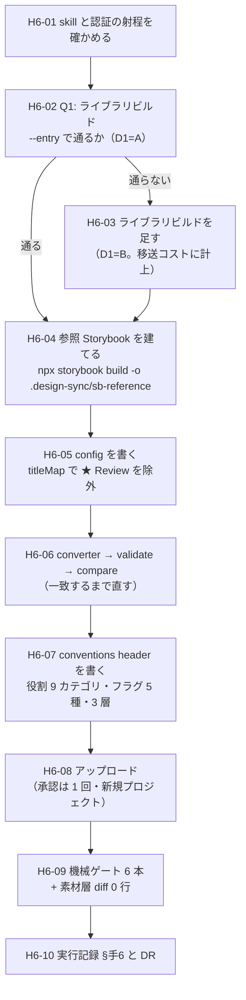

# 手6 — `/design-sync` で Claude Design へ同期する

> 段取り上の位置づけ: [UI検証の位置づけと段取り.md](../UI検証の位置づけと段取り.md) §5
> 直前の手: [手5](手5_トークン差し替え実験.md)（done・`main` へマージ済み `e88311a`）／実測の記録先: [実行記録.md](../実行記録.md) §手6

**この手は「境界を越える瞬間」を初めて測る手。**
手0〜手5 はすべて本 repo の内側で閉じていた。手6 で初めて成果物が Claude Design のプロジェクトへ出る。

> 🟥 **2026-08-01 に手順書を全面的に書き直した。**初稿は「プレビュー HTML を自前で作る手」として設計していたが、
> **`/design-sync` skill の一次情報を読んだら前提が崩れた**（[DR-0057](../DR/DR-0057-design-sync-uploads-compiled-code-not-just-html.md)）。
> 初稿の §2 D2（手書き／Playwright で吸い出す／静的レンダリング経路を書く）は**3 案とも捨てた。**

## この手の正しい形（[DR-0057](../DR/DR-0057-design-sync-uploads-compiled-code-not-just-html.md)）

**手6 は「公式 converter を走らせる手」。**自前で何かを生成する手ではない。

| 上がるもの                                             | 読み手                        | 用途                                        |
| ------------------------------------------------------ | ----------------------------- | ------------------------------------------- |
| `_ds_bundle.js` + `_vendor/`                           | **design agent のランタイム** | **実コンポーネントを描画する**              |
| `styles.css` / `tokens/` / `fonts/` / `_ds_bundle.css` | すべての描画結果              | 見た目（← **手5 の成果はここに乗る**）      |
| `<Name>.d.ts`（`<Name>Props`）                          | **design agent**              | API 契約                                    |
| `<Name>.prompt.md`                                      | **design agent**              | 使い方リファレンス（← **フラグの置き場 1**）|
| `README.md` の conventions header（`readmeHeader`）     | **design agent の system prompt に inline** | 規約（← **フラグの置き場 2**）  |
| `<Name>.html`（`@dsCard` 付き）                          | **人間**（部品ピッカー）      | 探すため・同期結果を信じるため              |
| `_ds_sync.json`                                          | 次回の同期                    | 内容ハッシュの錨                            |

- **Storybook は「入力」かつ「基準器（fidelity oracle）」。**story のソースモジュールをコンパイルしてプレビューを作り、
  **参照 Storybook のスクショと並べて一致するまで直す。**🟥 `storybook-static` は 1 バイトも上がらない
- **Playwright + chromium は必須。**ただし**変換のためではなく compare ループ（検証）のため**
- 🟥 **`npx storybook build -o .design-sync/sb-reference` を直接使う。**repo の `pnpm build-storybook` は**使わない**（出力先が違う）

🟨 **手6 と手7 の分担**——手6 は「**同期が通るか・何が落ちるか**」、手7 は「**それで Claude Design が正しく部品を選ぶか**」。

---

## 0. この手で答えを出す問い（観測項目）★最重要

🟥 **初稿の Q1〜Q8 は DR-0057 で前提が崩れたので割り直した。**

| #      | 問い                                                                                                        | なぜ効くか（どの判断が変わるか）                                                                                                                                     |
| ------ | ------------------------------------------------------------------------------------------------------------- | --------------------------------------------------------------------------------------------------------------------------------------------------------------------- |
| **Q1** | ★ **converter が要求する「ライブラリとしてのビルド」を、Next.js アプリのこの repo で満たせるか**             | 🟥 **最大の障害。**`package.json` は `private: true` / `build: next build` / `exports` 無し / `dist` 無し。**満たせなければ converter が走らない。**手9 の移送形にも直結する |
| **Q2** | ★ **Storybook 37 本は基準器として使えるか**（compare が一致するまで何周・skip 何件・`close` 何件）           | [DR-0017](../DR/DR-0017-storybook-as-catalog.md) は「開発カタログ」として入れた。**入力として使えるかは別の問い。**使えなければ手2b の投資が手6 に効かない            |
| **Q3** | ★ **手5 で流し込んだ tmp-admin の値は `tokens/` / `styles.css` に載るか**                                   | 載らなければ design agent が見るのは shadcn デフォルト。**手5 の成果が境界を越えない。**🟥 「HTML はできたが値は届いていない」が起きうる                              |
| **Q4** | ★ **フラグ 5 種は `.prompt.md` / conventions header に書けるか**（未決 #10）                                | [DR-0018](../DR/DR-0018-design-sync-takes-preview-html.md) は「載せ場所が無い」と結論したが**誤りだった**（DR-0057）。**書けるかどうかは手6、効くかどうかは手7**       |
| **Q5** | **役割 9 カテゴリは `components/<group>/<Name>/` の `group` に載るか。層（`vendor`/`wrapped`/`own`）はどこへ行くか** | [DR-0033](../DR/DR-0033-step5-criteria-differ-per-layer.md) は**合否の定義が層ごとに違う**と決めた。層が消えると**手7 の出力を層別に判定できない**                    |
| **Q6** | **素材層を 1 行でも触るか**（`src/components/ui/**` の diff 行数）                                          | 手3・手4・手5 に続く **7 回目**の観測。🟥 **今回は初めて「触る圧力」がかかる**——converter が要求する形に合わせる作業が入るため                                        |
| **Q7** | **「対象 0 件で緑」の 10 例目が出るか**（[OBS-0003](../OBS/OBS-0003_対象0件で緑が5回出た.md)）              | 通算 9 例。skill 自身が罠を 2 つ名指ししている（`index.json` だけあってビルド失敗／ビルドを `head` に流すと OOM が成功に見える）                                      |
| **Q8** | 🟨 **[思想への指摘](../共通コンポーネント思想への指摘.md)が 9 件目として出るか**                            | 現在 **8 件**。手6 は**フラグ 5 種を初めて外へ出す手**。未決 #25（指摘の偏りは「規定の細かさ」か「使い込みの量」か）の判定材料にもなる                                |

> **Q1〜Q4 が本体。**Q5〜Q7 は前提の確認。Q8 は継続観測。

---

## 1. 前提

- **直前の手**: 手5 done（`main` へ `--no-ff` マージ済み `e88311a`・作業ツリー clean）
- **ベースライン**（[handoff.md](../handoff.md) の表と一致。**2026-08-01 に 6 本とも実測して一致を確認済み**）

  | ゲート                 | 手5 完了時                                                            |
  | ---------------------- | --------------------------------------------------------------------- |
  | `pnpm typecheck`       | 🟦 緑（🟥 **借金で緑**。`exactOptionalPropertyTypes: false` ＝ DR-0014） |
  | `pnpm lint`            | 🟥 **error 33**（全部素材層）／ warning 1（TanStack Table 由来）        |
  | `pnpm build`           | 🟦 緑（同じ借金）                                                      |
  | `pnpm format:check`    | 🟦 緑                                                                  |
  | `pnpm spell`           | 🟦 緑                                                                  |
  | `pnpm build-storybook` | 🟦 緑（story **37 本**）                                               |

### この repo の形（2026-08-01 実測）

| 項目                                | 実測                                              | converter の要求との差                          |
| ----------------------------------- | ------------------------------------------------- | ----------------------------------------------- |
| `.storybook/main.ts`                | 🟦 **有り**                                       | 🟦 `shape = 'storybook'` に確定する              |
| story                               | 🟦 **37 本**                                      | 🟦 十分                                          |
| `package.json` `name`               | `design`                                          | `cfg.pkg` に書ける                              |
| `private`                           | `true`                                            | 🟨 問題にならない見込み                          |
| `build`                             | `next build`                                      | 🟥 **アプリのビルド。`dist/` が出ない**          |
| `main` / `module` / `exports`       | **無し**                                          | 🟥 **エントリが決まらない**                      |
| `dist/`                             | **存在しない**                                    | 🟥 **バンドルの材料が無い** → **Q1**            |
| `react`                             | 19.2.7                                            | 🟦 React 18+ の要求を満たす                      |
| `playwright`                        | 1.58.0（devDependency）                           | 🟦 有り。🟥 **chromium バイナリの導入は別途**    |

### 同期候補の実数（story の層タグと `title` 第 1 階層で全件走査。2026-08-01）

| 第 1 階層          | 件数   | 中身                                                                                                                                                   | 層タグ    |
| ------------------ | ------ | -------------------------------------------------------------------------------------------------------------------------------------------------------- | --------- |
| ① Tokens           | **1**  | Foundations/Tokens                                                                                                                                     | （無し）  |
| ② 素材層           | **16** | Badge / Empty / Skeleton / Table / Label / Separator / Card / Pagination / Dialog / DropdownMenu / Popover / Sheet / Tooltip / Checkbox / Select / Input | `vendor`  |
| ② 製品層・ラッパー | **2**  | Button / Sidebar                                                                                                                                       | `wrapped` |
| ② 製品層・自作     | **9**  | DataGrid / StatusPill / Box / Container / Grid / Inline / Section / Spacer / Stack                                                                      | `own`     |
| ③ Patterns         | **2**  | EmptyState / ListDetail                                                                                                                                | `own`     |
| ④ Templates        | **1**  | AppShell                                                                                                                                               | `own`     |
| ★ Review           | **6**  | A 状態面 / B 角丸 / C 影 / D タイポ / E·F オーバーレイ / I 層の比較                                                                                     | `review`  |
| **計**             | **37** |                                                                                                                                                        |           |

🟥 **★ Review 6 件は同期対象外**（[DR-0053](../DR/DR-0053-viewpoints-must-be-answerable-by-eye.md)。**人が目で判定する検体**であって部品ではない）。
converter 側の除外口は `cfg.titleMap` の `{title: null}`。

### 確定済みの前提（ここは決め直さない）

| 前提                                                                                                             | 出典                                                                          |
| ------------------------------------------------------------------------------------------------------------------ | ------------------------------------------------------------------------------- |
| 上がるのは**コンパイル済みの実コンポーネント**。プレビュー HTML は**人間用のカード**                                | [DR-0057](../DR/DR-0057-design-sync-uploads-compiled-code-not-just-html.md)     |
| **Storybook は入力かつ基準器。**`storybook-static` は上がらない／story はビルド時に評価されない                     | [DR-0057](../DR/DR-0057-design-sync-uploads-compiled-code-not-just-html.md)     |
| **Playwright は「検証」に要る**（compare ループ）。「変換」には要らない                                            | [DR-0057](../DR/DR-0057-design-sync-uploads-compiled-code-not-just-html.md)     |
| フラグの置き場は **`.prompt.md`** と **conventions header**（`readmeHeader`）の 2 つ                               | [DR-0057](../DR/DR-0057-design-sync-uploads-compiled-code-not-just-html.md)     |
| 手順は **list/read → `finalize_plan` → write/delete** の順で固定                                                   | DesignSync ツール仕様                                                          |
| **first sync は必ず新規プロジェクトを作る**（既存へ入れるのはユーザーが明示的に頼んだ場合だけ）                     | `/design-sync` skill §1                                                        |
| 合否の定義は**層ごとに違う**                                                                                       | [DR-0033](../DR/DR-0033-step5-criteria-differ-per-layer.md)                     |
| 棚は**第 1 階層が層／第 2 階層が役割 9 カテゴリ**で既に並んでいる                                                   | [DR-0051](../DR/DR-0051-storybook-organized-by-layer-with-viewpoint-cards.md)   |
| 画面は**製品層しか見ない**（手3 D3=B・手4 D6=A で維持を確認済み）                                                  | 手3・手4                                                                       |
| 🟥 **緑は何も保証しない。**検出は**生成物への grep が一番速い**                                                    | [DR-0046](../DR/DR-0046-theme-swap-loses-to-source-order.md)・[DR-0048](../DR/DR-0048-build-storybook-does-not-render.md) |

### 🟨 skill が既に解いている問題（自前で考えない）

初稿で私が「穴」として書いたものは、**公式 skill 側に既に口がある。**

| 初稿の心配                                       | skill の口                                                                       |
| ------------------------------------------------ | -------------------------------------------------------------------------------- |
| Overlay 5 件は閉じた状態でしか撮れない           | `cfg.overrides.<Name>.cardMode: "single"`（overlay 用に用意されている）          |
| バリアントを持たない部品が `thin` で弾かれる     | `cardMode` / `primaryStory` / `viewport`、`skip` は NOTES.md の justification 付き |
| Provider（`TooltipProvider` / `SidebarProvider`）| `.storybook/preview` の decorator が**自動でバンドルされる**。`cfg.provider` は最後の手段 |
| story id を間違えても気づけない                  | compare が参照 Storybook と突き合わせる（一致しなければ落ちる）                  |

### 🟥 着手前に潰しておく不確定要素

| #   | 不確定要素                                                                                              | 潰し方                                                                     |
| --- | --------------------------------------------------------------------------------------------------------- | ---------------------------------------------------------------------------- |
| 1   | 🟥 **`/design-sync` が本セッションの skill 一覧に無い**（バイナリには実体がある。2026-08-01 実測）        | **H6-01 で起動を試す。**D6                                                 |
| 2   | 🟥 **認証が未確認。**design スコープが要る。本セッションは非対話なので OAuth が回せない                   | **人が対話セッションで `/design-login` を済ませる。**D6                    |
| 3   | 🟥 **chromium バイナリが未導入。**`playwright` パッケージはあるがブラウザは別                            | skill の手順（`.ds-sync/` で `npx playwright install chromium`）に従う      |
| 4   | 🟨 **規模の見積もりが無い。**skill は「大きな repo で数時間・トークンを大量に使う」と警告し確認を取る設計 | **D5 でスコープを決めてから走らせる**                                      |

---

## 2. 着手前に決めること（判断ポイント）

> **戻しにくい決定はここに全部出す。**実行中に §2 に無い選択肢が出たら、**その場で決めずにここへ追記してから進む**
> （手1 D9/D10・手2 D9・手5 D7 で **3 度**機能した規律）。

| #      | 論点                                                | 選択肢                                                                                                                                          | 決定                         | 根拠      | 戻せるか  |
| ------ | ----------------------------------------------------- | --------------------------------------------------------------------------------------------------------------------------------------------------- | ---------------------------- | --------- | --------- |
| **D1** | 🟥 **最優先。ライブラリビルドが無い問題をどう解くか** | **A** `--entry` に TS ソースを直接渡して通るか試す／ **B** `dist/` を吐くライブラリビルドを足す／ **C** shape=package の逃げ道に乗る／ **D** A → B の 2 段 | 🟥 **未決**                  | §2.1      | 🟨 B は残る |
| **D2** | **何を同期するか**                                  | **A** 製品層のみ **11**／ **B** ① + 製品層 + ③④ = **15**／ **C** ★ Review 以外すべて = **31**                                                    | 🟥 **未決**                  | §2.2      | 🟦 戻せる |
| **D3** | **どのトークンを載せるか**                          | **A** tmp-admin 適用後（手5 の 2 周目まで）／ **B** 適用前（shadcn デフォルト）                                                                 | 🟥 **未決**                  | §2.3      | 🟦 戻せる |
| **D4** | ★ **フラグ 5 種をどこに書くか**（未決 #10）          | **A** `.prompt.md` のみ／ **B** conventions header のみ／ **C** 両方／ **D** 書かない                                                           | 🟥 **未決**                  | §2.4      | 🟦 戻せる |
| **D5** | **1 周目のスコープ**（時間とトークン）              | **A** フルで回す／ **B** 製品層に絞って 1 周 → 広げる                                                                                           | 🟥 **未決**                  | §2.5      | 🟦 戻せる |
| **D6** | skill の起動と認証                                  | **A** `/design-sync` を叩く／ **B** skill の中身を写して手で走らせる                                                                            | 🟥 **未決**                  | §2.6      | 🟦 戻せる |
| ~~D7~~ | ~~登録先と外向き操作の承認~~                        | —                                                                                                                                               | ✅ **決着（ユーザー判断 2026-08-01）** | §2.7 | —         |

### 2.1 D1 — ライブラリビルドが無い（🟥 最優先）

**推奨: D（A → B の 2 段）。**

converter は「**顧客がすでに作ったものを出荷する**——バンドルは相手のビルド済み `dist/` であって、書き直したものではない」を
中核原則に据えていて、`--entry <built-dist-entry>` を要求する。この repo には `dist/` が無い。

| 案    | 評価                                                                                                                                        |
| ----- | --------------------------------------------------------------------------------------------------------------------------------------------- |
| A     | 🟦 **安い。**converter は esbuild で束ねるので、TS ソースのエントリでも通る可能性がある。**通れば何も足さずに済む**。🟥 未検証                |
| B     | 🟨 **確実だが Next.js アプリに 2 本目のビルド系が増える。**🟥 **手9 の移送コストが上がる**（依存追加は DR-0016・DR-0024 と同型の観測対象）    |
| C     | 🟥 **shape の判定は `.storybook/` の有無で決まる**ので、こちらから選べない。skill も「`.storybook` がルートに無いだけで package に落とすな」と明記 |
| **D** | ★ **A を 1 回試して、駄目なら B。**手5 D1=D と同じ形——**「素直に通るか」を先に測ってから無理をする**                                       |

🟨 **B を選ぶことになったら、それ自体が成果。**「共通部品を Claude Design へ出すには、**アプリではなくライブラリとして
ビルドできる形にしておく必要がある**」は PoC の `packages/ui` に直接効く（[DR-0057](../DR/DR-0057-design-sync-uploads-compiled-code-not-just-html.md) の poc_feedback）。

### 2.2 D2 — 何を同期するか

**推奨: B（① 1 + 製品層 11 + ③ 2 + ④ 1 = 15）。**

| 案      | 評価                                                                                                                                     |
| ------- | ------------------------------------------------------------------------------------------------------------------------------------------ |
| A（11） | ① が欠ける。design agent が**値の出どころを持たない**                                                                                    |
| **B**（15） | 🟦 **3 層がそのまま渡る。**[DR-0002](../DR/DR-0002-verify-three-layers-not-screens.md)（検証対象は画面ではなく 3 層）と形が一致する    |
| C（31） | 🟥 **手3 D3=B（画面は製品層しか見ない）が境界の向こうで破れる。**素材層を渡せば design agent はそれを直接使う案を出しうる。しかも**手7 が失敗したとき原因が切り分けられない** |

🟨 **足りなければ 2 周目で素材層 16 を足す**（手5 D1=D と同じ形）。除外は `cfg.titleMap` の `{title: null}` で書く。

### 2.3 D3 — どのトークンを載せるか

**推奨: A（tmp-admin 適用後）。**
**Q3 は「手5 の成果が境界を越えるか」を測る問い**なので、適用前（B）を渡すと問い自体が成立しない。

### 2.4 D4 — フラグ 5 種をどこに書くか（未決 #10）

**推奨: C（両方）。**🟨 **初稿から推奨が変わった。**

初稿は「一次情報に無い経路へ推測で書き込むな」を理由に「書かない」を推していた。
**DR-0057 でその前提が消えた**——`.prompt.md` と conventions header は**仕様に書かれた、design agent が読む場所**。

skill は conventions header について明示している:

> **語彙を名指しすれば agent は語彙を使う。クラスの語彙を名指ししなければ、agent は推測しない——自分のものを発明する。**
> すべての文が 1 つの問いを通ること: *design agent はこれを推測なしに実行できるか？*

→ **役割 9 カテゴリとフラグ 5 種は、まさに「名指しすれば使える語彙」。**
🟥 ただし **「書いた」と「効いた」は別。**効果の判定は手7。手6 の答えは「**書けたか**」まで。

### 2.5 D5 — 1 周目のスコープ

**推奨: B（製品層に絞って 1 周）。**
compare ループは **story 数 × 周回**。skill 自身が「>100 部品なら事前に規模を伝えてスコープを狭めさせろ」と書いている。
15 部品・37 story は小さい方だが、**1 周目は D1 と Q1 の答えを出すのが目的**なので、まず通す。

### 2.6 D6 — skill の起動と認証

**推奨: A（`/design-sync` を人が打つ）。**

✅ **認証は済んだ**（H6-01・2026-08-01）。残るのは**起動経路**。

🟥 **`/design-sync` は Claude 側から起動できない。**skill 一覧に出ず、`/design` のサブコマンド
（`subcommands: {sync: "design-sync", login: "design-login", …}`）として登録されている＝**人が打つスラッシュコマンド**。
→ **A を採るなら、コマンドを打つのはユーザー。**

B（中身を写して手で走らせる）は skill 自身が
「**off-script generation は正当だが、off-script の検証は正当ではない**」と条件を付けている。
しかも converter 本体（`package-build.mjs` / `compare.mjs` / `lib/`）は `<skill-base-dir>` から staging される想定で、
**skill を起動しないとそのパスが手に入らない。**→ 🟥 **B は事実上とれない。**

### 2.7 D7 — ✅ 登録先と外向き操作の承認（決着）

**✅ ユーザー判断（2026-08-01）: 外に出る先は Claude Design なので問題なし。進めてよい。**

🟦 **公式 skill が既定で守っている**——first sync は**必ず新規プロジェクトを作る**（既存プロジェクトは
ユーザーが明示的に名指ししたときだけ。しかも「既存ファイルを置き換え・削除するかもしれない」と平易な言葉で警告してから）。
**既存資産を汚す経路が既定では存在しない。**

🟨 **承認は 1 回だけ、しかも早い段階で来る**（プロジェクト作成＋この実行のアップロードを覆う 1 回）。
以降は検証の済んだ部品から順にプロジェクトへ現れる。

---

## 3. 成果物

- `.design-sync/config.json` — `pkg` / `globalName` / `shape` / `titleMap` / `overrides` / `readmeHeader`
- `.design-sync/conventions.md` — **design agent の system prompt に inline される規約**（役割 9 カテゴリ・フラグ 5 種・3 層）
- `.design-sync/NOTES.md` — 再同期時の watch-list
- （D1=B なら）ライブラリビルドの設定 — 🟥 **依存が増えるので手9 の移送コストに計上する**
- Claude Design 側の新規プロジェクト — 同期済みの部品カード
- 🟥 **`src/components/ui/**` の diff は 0 行**（Q6。1 行でも動いたら前提が崩れている）
- [実行記録.md](../実行記録.md) §手6 — Q1〜Q8 の答えと、**通らなかった箇所の全件列挙**
- DR — 少なくとも「Q1 の可否」と「conventions header に何を書いたか」の 2 件は出る見込み

---

## 4. 作業フロー



---

## 5. 手順

### H6-01 skill と認証の射程を確かめる

- **目的**: **「対象 0 件で緑」を先に潰す。**認証が通らないまま数時間の変換を回すと全部空振りになる。
- **実行**: `ToolSearch(query: "select:DesignSync")` → `DesignSync({method: 'list_projects'})`。あわせて `/design-sync` が起動できるか確かめる。
- **期待結果**: 書き込み可能なプロジェクト一覧（**0 件でもよい。エラーにならないことが確認点**）
- **検証**: ① 認証が通るか ② `create_project` が使えるか ③ skill が起動するか
- **観測**: 不確定要素 1・2
- **判断**: 🟥 **通らなければここで止め、人に `/design-login` を依頼する。**推測で先へ進まない
- **詰まったら**: 認証エラーのメッセージは環境に応じて出し分けられている。**そのまま人に伝える**（skill の指示）
- ✅ **実施済み（2026-08-01）。**結果は [実行記録 §手6](../実行記録.md)

### H6-02 Q1 — ライブラリビルドが `--entry` で通るか（D1=A）

- **目的**: **最大の障害を最初に測る。**ここが決まらないと以降の見積もりが立たない。
- **実行**: skill の §2.4 に従って `.ds-sync/` へスクリプトを staging し、`package-build.mjs` に
  `--entry` でソースエントリを渡して 1 回だけ走らせる。
- **期待結果**: `ds-bundle/_ds_bundle.js` が出る、または**明確な失敗メッセージ**
- **検証**: 🟥 **ビルド出力を `head` / `tail` に流さない**（skill が名指しした罠。**OOM が成功に見える**）。ファイルへリダイレクトして読む
- **観測**: **Q1**・Q7
- **判断**: 🟥 **通らなければ D1=B へ。**その判断と失敗の内訳を実行記録に残す（**通らなかったことが成果**）
- **詰まったら**: `--node-modules` の指定。monorepo でないので repo root でよい見込み

### H6-03 ライブラリビルドを足す（D1=B のときだけ）

- **目的**: converter にバンドルの材料を与える。
- **実行**: `src/components/**`（+ `src/patterns` / `src/templates`）をライブラリとしてビルドする経路を足す。
- **期待結果**: `dist/` にエントリが出る
- **検証**: 🟥 **`src/components/ui/**` を 1 行も触っていないこと**（Q6）
- **観測**: **Q6**・Q1／手9 の移送コスト
- **判断**: 🟨 **どのビルダーを足すか。**依存が増えるので **DR-0016・DR-0024 と同型に厳密ピンで計上する**
- **詰まったら**: 既存の 6 ゲート（特に `pnpm build` / `typecheck`）と衝突しないこと

### H6-04 参照 Storybook を建てる

- **目的**: compare の基準器を用意する。
- **実行**:
  ```bash
  # repo ルートで実行する（skill は「-o は repo ルートからのパスにしろ」と指定している。
  # 本 repo は .storybook がルートにあるので、ルートで走らせれば相対パスで足りる）
  npx storybook build -c .storybook -o .design-sync/sb-reference
  ```
- **期待結果**: `.design-sync/sb-reference/iframe.html` が存在し **>10KB**
- **検証**: 🟥 **`index.json` だけあってビルドが失敗している**ことがある（skill が名指しした罠）。**`iframe.html` のサイズを見る**
- **観測**: **Q7**・Q2
- **判断**: 🟥 **`pnpm build-storybook` は使わない**（出力先が違う）。**ゲート用のスクリプトとは別物**として実行記録に明記する
- **詰まったら**: `.gitignore` に `.design-sync/sb-reference/` / `.design-sync/.cache/` / `.ds-sync/` / `ds-bundle/` を足す。
  🟥 **足したら `pnpm format:check` / `pnpm spell` / `pnpm lint` の射程がどう変わるか確かめる**
  （手2b で `.storybook/**` が射程外だった＝[DR-0025](../DR/DR-0025-storybook-init-is-not-selectable.md)、手4 で ③ 層が射程外だった＝[DR-0040](../DR/DR-0040-frame-leaks-when-a-layer-is-added.md)。**層を足すたびに起きている**）

### H6-05 config を書く

- **目的**: 同期範囲と部品ごとの扱いを確定させる。
- **実行**: `.design-sync/config.json` に `pkg` / `globalName` / `shape: "storybook"` /
  `storybookStatic` / `titleMap` / `overrides` を書く。
- **期待結果**: ★ Review 6 件が `titleMap` の `{title: null}` で除外され、D2 で決めた件数だけが対象になる
- **検証**: 対象一覧を出力し、**件数が D2 の決定と一致すること**
- **観測**: **Q5**（`group` に役割 9 カテゴリが載るか）・Q2
- **判断**: 🟨 **Overlay 5 件に `cardMode: "single"` を当てるか**（skill が overlay 用として用意している口）
- **詰まったら**: story の `title` は `② 素材層/Communication/Badge` のような 3 段。`titleMap` で export 名との対応を書く

### H6-06 converter → validate → compare

- **目的**: Q2・Q3 の本体。**参照 Storybook と一致するまで直す。**
- **実行**: skill の §2.5 の 3 コマンドを**同期的に、最初の非ゼロ終了で止めて**回す。
- **期待結果**: `package-validate.mjs` が exit 0、compare の判定が `match`（または鑑定基準を満たす `close`）
- **検証**: 🟥 **`ds-bundle/tokens/` と `styles.css` に tmp-admin の実値を grep して 0 件なら失敗**（Q3。
  手5 で「検出は grep が一番速かった」）。🟥 **`[FONT_MISSING]` が残っていないこと**（compare では見えない唯一の警告）
- **観測**: **Q2**・**Q3**・Q7
- **判断**: 🟥 **直す場所は「生成物」ではなく「次回も読まれるファイル」**（skill の規律: *never hand-patch generated output*）。
  つまり `config.json` か `NOTES.md`。**`ds-bundle/` を手で直したら失敗**
- **詰まったら**: skill §4a の fix decision tree（global first）と §5 の逃げ道の表を読む

### H6-07 conventions header を書く

- **目的**: **Q4。フラグ 5 種と役割 9 カテゴリを、design agent が読む場所へ載せる。**
- **実行**: `.design-sync/conventions.md` を書き、`readmeHeader` で配線してから**再ビルド**（順序が逆だと README に載らない）。
- **期待結果**: 生成された `README.md` の先頭に規約が入っている
- **検証**: 🟥 **書いた文字列を生成物に grep する。**「配線したつもり」で載っていないのは手5 で 4 回踏んだ形
- **観測**: **Q4**・**Q5**・Q8
- **判断**: 🟨 **何を書くか。**skill が指定する 4 項目（ラップと初期化 / スタイリングの語彙 / 真実がどこにあるか / 組み立て例）に、
  本 repo の 3 層・役割 9 カテゴリ・フラグ 5 種・**「数値の段とパレット色は使わない」**（[DR-0033](../DR/DR-0033-step5-criteria-differ-per-layer.md)）を載せる
- **詰まったら**: 「デザインシステムの慣習に従う」のような文は skill 自身が**失格例**として挙げている。**語彙を名指しする**

### H6-08 アップロード

- **目的**: Q5 の実測。**境界を越える。**
- **実行**: skill §6 の手順（新規プロジェクト作成 → `finalize_plan` → 検証済みバッチから順に `write_files` → close-out）。
- **期待結果**: プロジェクトに部品カードが並び、`group` が役割 9 カテゴリになっている
- **検証**: 人がピッカーを見て、**Storybook の第 2 階層と一致していること**
- **観測**: **Q5**
- **判断**: なし（D7 決着済み。承認は skill が 1 回だけ求める）
- **詰まったら**: `_ds_sync.json` は**必ず最後**に書く（途中で落ちると錨が嘘をつく）

### H6-09 機械ゲートを回す

- **目的**: 新しい赤が出ていないこと。
- **実行**:
  ```bash
  pnpm typecheck && pnpm lint && pnpm build && pnpm format:check && pnpm spell && pnpm build-storybook
  ```
- **期待結果**: [handoff](../handoff.md) のベースラインと一致（lint error 33 / warning 1、他は緑）
- **検証**: 🟥 **`.design-sync/` `ds-bundle/` `.ds-sync/` がゲートの射程に入っていないこと**を確かめる（H6-04 の続き）
- **観測**: **Q6**（`git diff --stat main -- src/components/ui/` が空か）・Q7
- **判断**: なし
- **詰まったら**: D1=B でビルドを足していたら、依存の増分を数える（手9 の材料）

### H6-10 実行記録と DR を書く

- **目的**: Q1〜Q8 の答えを台帳に落とす。
- **実行**: [実行記録.md](../実行記録.md) §手6 を追記し、DR を起票する。
- **期待結果**: Q1〜Q8 すべてに答えか「答えが出なかった理由」が書かれている
- **検証**: §影響 が**観測から直接言えること**と**🟥 推論（未検証）**に割れていること
  （[DR-0055](../DR/DR-0055-finding-impact-splits-observation-from-inference.md)。**未決 #24 の検算 5 例目**——DR-0057 が 4 例目）
- **観測**: Q8／未決 #24・#25 の判定材料
- **判断**: ADR 昇格候補があれば `docs/DR/index.md` に印を付けるだけ（**その場で起案しない**）
- **詰まったら**: 「書けた」と「効いた」を混ぜない。**効いたかどうかは手7**

---

## 6. 完了条件

- [ ] 機械ゲート 6 本が**ベースラインと一致**。**新しい赤があれば内訳と扱いが実行記録に書かれていること**
- [ ] §0 の Q1〜Q8 すべてに答え、または「答えが出なかった理由」が出ている
- [ ] §2 の D1〜D6 がすべて決着し、根拠が書かれている
- [ ] 🟥 **`src/components/ui/**` の diff が 0 行**（Q6・7 回連続）
- [ ] `package-validate.mjs` が exit 0 で、compare の判定が全件出ている（`skip` は NOTES.md に理由つき）
- [ ] 🟥 **tmp-admin の実値を `ds-bundle/tokens/` と `styles.css` に grep して 0 件でない**（Q3。緑を信用しない）
- [ ] 🟥 **conventions header に書いた語彙を、生成された `README.md` に grep して確認済み**（Q4）
- [ ] [実行記録.md](../実行記録.md) に §手6 の節が追加されている
- [ ] [handoff.md](../handoff.md) の現在地・進捗ボード・ベースライン表・次にやることが更新されている
- [ ] コミット済み（`<type>(H6): 要約 [手6]`）

---

## 7. 出典

- **`/design-sync` skill 本体**（`name: design-sync`）と **storybook サブスキル**（`# Storybook source shape`） —
  Claude Code バイナリ `2.1.220` から抽出して全文読解（2026-08-01）。→ [DR-0057](../DR/DR-0057-design-sync-uploads-compiled-code-not-just-html.md)
- `DesignSync` ツール仕様（本セッションで全文取得。2026-08-01）— `method` の一覧、`finalize_plan` の順序制約、`@dsCard`、SECURITY 節
- 🟥 [DR-0018](../DR/DR-0018-design-sync-takes-preview-html.md) — **superseded。**ツール仕様だけを読んで書かれており、skill 本体を読んでいなかった
- [ClaudeDesignShadcnIntegration.md](../../ClaudeDesignShadcnIntegration.md) — 先行調査（二次情報）。
  「ローカルの React コンポーネントを変換してアップロード」と書いており、**DR-0018 より実態に近かった**
- `package.json` の実測（2026-08-01）— §1 の「この repo の形」
- story の層タグ・`title` 第 1 階層の全件走査（2026-08-01）— §1 の同期候補の実数
