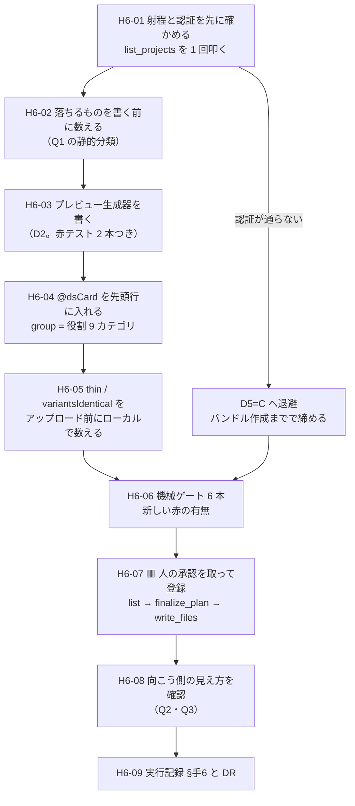

# 手6 — プレビュー HTML を作り `/design-sync` で登録する

> 段取り上の位置づけ: [UI検証の位置づけと段取り.md](../UI検証の位置づけと段取り.md) §5
> 直前の手: [手5](手5_トークン差し替え実験.md)（done・`main` へマージ済み `e88311a`）／実測の記録先: [実行記録.md](../実行記録.md) §手6

**この手は「境界を越える瞬間」を初めて測る手。**
手0〜手5 はすべて本 repo の内側で閉じていた。手6 で初めて成果物が**外**（Claude Design のプロジェクト）へ出る。

[DR-0018](../DR/DR-0018-design-sync-takes-preview-html.md) が「渡るのはプレビュー HTML だけ」と確定させたので、
**手6 の本体は部品作りではなく変換**。React・Storybook・役割 9 カテゴリ・層タグ・フラグ 5 種・トークンのうち、
**何が境界を越えて、何が落ちるか**を数える手にあたる。

🟨 **手6 と手7 の分担**——手6 は「**渡せるか・何が落ちるか**」、手7 は「**落ちた状態で Claude Design が正しく部品を選べるか**」。
選べるかどうかの答えは手6 では出ない。手6 が出すのは**手7 が失敗したときの原因候補の一覧**。

---

## 0. この手で答えを出す問い（観測項目）★最重要

🟥 **元の問い「役割カテゴリとフラグは `/design-sync` で渡るか」は使わない。**
[DR-0018](../DR/DR-0018-design-sync-takes-preview-html.md) がツール仕様の読解で半分先に答えを出した
（役割カテゴリ = 渡る／フラグ = 渡らない）。残るのは「**落ちたとき何が起きるか**」なので、問いを 8 つに割り直した。

| #      | 問い                                                                                                          | なぜ効くか（どの判断が変わるか）                                                                                                                                                          |
| ------ | ------------------------------------------------------------------------------------------------------------- | ----------------------------------------------------------------------------------------------------------------------------------------------------------------------------------------- |
| **Q1** | ★ **変換で落ちるものを全件数える**（状態・振る舞い hook・props の型・層タグ・フラグ 5 種・Provider 配線）      | 落ちたものは**手7 の失敗原因の候補**になる。数えずに手7 へ行くと、「Claude Design が悪い」と「渡していなかった」が切り分けられない                                                          |
| **Q2** | ★ **`group` に役割 9 カテゴリがそのまま載るか**（[DR-0018](../DR/DR-0018-design-sync-takes-preview-html.md) の予測の実測） | 外れたら、カタログ 3 箇所（[部品カタログ](../部品カタログ.md) の表・Storybook の `title`・Claude Design の `group`）を**同じ構造で揃える**という前提が崩れる                                |
| **Q3** | ★ **層（`vendor` / `wrapped` / `own`）はプレビュー側で表現できるか**                                          | [DR-0033](../DR/DR-0033-step5-criteria-differ-per-layer.md) は**合否の定義が層ごとに違う**と決めた。向こう側で層が消えると、**手7 の出力を層別に判定できない**                              |
| **Q4** | ★ **手5 で流し込んだ tmp-admin の値はプレビュー HTML に載るか**                                               | 載らなければ Claude Design が見るのは shadcn デフォルトの見た目。**手5 の成果が境界を越えない**ことになる。🟥 CSS は `var()` 参照なので「HTML はできたが値は届いていない」が起きうる          |
| **Q5** | **素材層を 1 行でも触るか**（`src/components/ui/**` の diff 行数）                                            | 手3・手4・手5 に続く **7 回目**の観測。ここで触ったら「部品を触らずに」という前提そのものが崩れる                                                                                           |
| **Q6** | **「対象 0 件で緑」の 10 例目が出るか**（[OBS-0003](../OBS/OBS-0003_対象0件で緑が5回出た.md)）                | 通算 9 例（手5 だけで 4 例）。**登録が成功したように見えて中身が空**は起きうる形。向こう側の検出器は `thin` / `variantsIdentical`                                                            |
| **Q7** | **1 部品 = 1 プレビュー HTML で `thin` / `variantsIdentical` に弾かれないか**                                 | [DR-0018](../DR/DR-0018-design-sync-takes-preview-html.md) §「`thin` の含意」。弾かれる部品が出たら、**バリアントを持たない部品**（`Spacer` / `Box` / `Container` 等）は構造的に登録できない |
| **Q8** | 🟨 **[思想への指摘](../共通コンポーネント思想への指摘.md)が 9 件目として出るか**                              | 現在 **8 件**。手6 は**フラグ 5 種を初めて外へ出そうとする手**。「載せ場所が無い」で終わるなら、分類軸が実装の器に対して過剰である証拠になりうる（未決 #25 の判定材料にもなる）              |

> **Q1〜Q4 が本体。**Q5〜Q7 は前提の確認。Q8 は継続観測。

---

## 1. 前提

- **直前の手**: 手5 done（`main` へ `--no-ff` マージ済み `e88311a`・作業ツリー clean）
- **ベースライン**（[handoff.md](../handoff.md) の表と一致していること。**2026-08-01 に 6 本とも実測して一致を確認済み**）

  | ゲート                 | 手5 完了時                                                            |
  | ---------------------- | --------------------------------------------------------------------- |
  | `pnpm typecheck`       | 🟦 緑（🟥 **借金で緑**。`exactOptionalPropertyTypes: false` ＝ DR-0014） |
  | `pnpm lint`            | 🟥 **error 33**（全部素材層）／ warning 1（TanStack Table 由来）        |
  | `pnpm build`           | 🟦 緑（同じ借金）                                                      |
  | `pnpm format:check`    | 🟦 緑                                                                  |
  | `pnpm spell`           | 🟦 緑                                                                  |
  | `pnpm build-storybook` | 🟦 緑（story **37 本**）                                               |

### 登録候補の実数（2026-08-01 実測。story の層タグと `title` 第 1 階層で数えた）

| 第 1 階層             | 件数   | 中身                                                                                        | 層タグ    |
| --------------------- | ------ | ------------------------------------------------------------------------------------------- | --------- |
| ① Tokens              | **1**  | Foundations/Tokens                                                                          | （無し）  |
| ② 素材層              | **16** | Badge / Empty / Skeleton / Table / Label / Separator / Card / Pagination / Dialog / DropdownMenu / Popover / Sheet / Tooltip / Checkbox / Select / Input | `vendor`  |
| ② 製品層・ラッパー    | **2**  | Button / Sidebar                                                                            | `wrapped` |
| ② 製品層・自作        | **9**  | DataGrid / StatusPill / Box / Container / Grid / Inline / Section / Spacer / Stack           | `own`     |
| ③ Patterns            | **2**  | EmptyState / ListDetail                                                                     | `own`     |
| ④ Templates           | **1**  | AppShell                                                                                    | `own`     |
| ★ Review              | **6**  | A 状態面 / B 角丸 / C 影 / D タイポ / E·F オーバーレイ / I 層の比較                          | `review`  |
| **計**                | **37** |                                                                                             |           |

🟥 **★ Review 6 件は登録対象外。**[DR-0053](../DR/DR-0053-viewpoints-must-be-answerable-by-eye.md) のとおり
**人が目で判定するための検体**であって部品ではない。渡すと Claude Design のペインに部品として並んでしまう。

### 確定済みの前提（ここは決め直さない）

| 前提                                                                                                         | 出典                                                                       |
| ------------------------------------------------------------------------------------------------------------ | -------------------------------------------------------------------------- |
| 渡るのは**プレビュー HTML** のみ。story も React コンポーネントも渡らない                                     | [DR-0018](../DR/DR-0018-design-sync-takes-preview-html.md)                 |
| **役割 9 カテゴリは `group` に載る**（ツール仕様が「元のデザインシステム自身の分類を使え」と明記）             | [DR-0018](../DR/DR-0018-design-sync-takes-preview-html.md)                 |
| 🟥 **フラグ 5 種（`stateful` / `behaviorHook` / `formBound` / `overlay` / `container`）を載せる場所は無い**   | [DR-0018](../DR/DR-0018-design-sync-takes-preview-html.md)・未決 #10       |
| 手順は **list/read → `finalize_plan` → write/delete** の順で固定。プラン外のパスへの書き込みは拒否される      | DesignSync ツール仕様                                                      |
| 向こう側は `.render-check.json` から `total` / `bad` / **`thin`** / **`variantsIdentical`** / `iterations` を集計する | [DR-0018](../DR/DR-0018-design-sync-takes-preview-html.md)                 |
| 合否の定義は**層ごとに違う**（素材層＝触っていない／製品層・③④・アプリ層＝生値も数値の段もパレット色も書いていない） | [DR-0033](../DR/DR-0033-step5-criteria-differ-per-layer.md)               |
| 棚は**第 1 階層が層／第 2 階層が役割 9 カテゴリ**で既に並んでいる                                             | [DR-0051](../DR/DR-0051-storybook-organized-by-layer-with-viewpoint-cards.md) |
| 画面は**製品層しか見ない**（手3 D3=B・手4 D6=A で維持を確認済み）                                             | 手3・手4                                                                   |
| 判定は **Storybook 側に固定する**（本体は hex+lab、Storybook は oklch）                                       | [DR-0026](../DR/DR-0026-two-css-pipelines-differ.md)                       |
| 🟥 **緑は何も保証しない。**検出は**生成物への grep が一番速い**（手5 で 4 回転んで確立した手口）              | [DR-0046](../DR/DR-0046-theme-swap-loses-to-source-order.md)・[DR-0048](../DR/DR-0048-build-storybook-does-not-render.md) |
| 🟥 **模型は問いに答えない。**検体は実物の部品を使う                                                          | [DR-0054](../DR/DR-0054-mock-specimens-cannot-reproduce-stacked-states.md) |

### 🟥 着手前に潰しておく不確定要素 3 件（H6-01 で先に確かめる）

| #   | 不確定要素                                                                                                                            | 潰し方                                                                            |
| --- | --------------------------------------------------------------------------------------------------------------------------------------- | --------------------------------------------------------------------------------- |
| 1   | 🆕 **`/design-sync` skill が本環境の skill 一覧に無い**（`~/.claude/skills/` も空。2026-08-01 実測）。`DesignSync` **ツール**は存在する | ツールを直接叩く前提で手順を書く（D7）。skill を探すのは手6 の本体ではない        |
| 2   | 🟥 **認証が通るか未確認。**ツールは claude.ai ログイン（または `/design-login`）の design スコープを要求する                            | **H6-01 で `list_projects` を 1 回叩く。**ここが通らないと以降が全部空振りする     |
| 3   | 🆕 **`register_assets` が legacy になっている。**ツール仕様（2026-08-01 取得）は「カード索引は各プレビュー HTML 先頭行の `@dsCard` コメントから作られるので明示登録は不要」と書いている | D6 で `@dsCard` 方式に寄せる。🟨 **DR-0018 の根拠にした仕様から変わっている**＝一次情報の陳腐化の実例候補（DR 候補） |

---

## 2. 着手前に決めること（判断ポイント）

> **戻しにくい決定はここに全部出す。**実行中に §2 に無い選択肢が出たら、**その場で決めずにここへ追記してから進む**
> （手1 D9/D10・手2 D9・手5 D7 で **3 度**機能した規律）。

| #      | 論点                                                             | 選択肢                                                                                                                                                                       | 決定       | 根拠                       | 戻せるか      |
| ------ | ------------------------------------------------------------------ | ------------------------------------------------------------------------------------------------------------------------------------------------------------------------------ | ---------- | -------------------------- | ------------- |
| **D1** | ★ **何を登録するか**（handoff が「未定」と名指しした論点）        | **A** 製品層のみ **11**／ **B** 素材層のみ **16**／ **C** 製品層 + ③④ = **14**／ **D** ① + C = **15**／ **E** ★ Review 以外すべて = **31**                                   | 🟥 **未決** | 下記 §2.1                  | 🟦 戻せる     |
| **D2** | ★ **プレビュー HTML の作り方**                                   | **A** 手書き／ **B** `storybook-static` を Playwright で開き `outerHTML` ＋ 適用 CSS を 1 ファイルにインライン化／ **C** React を静的レンダリングする経路を新規に書く         | 🟥 **未決** | 下記 §2.2                  | 🟦 戻せる     |
| **D3** | **どの CSS を載せるか**（手5 の成果を持ち越すか）                 | **A** tmp-admin 適用後（手5 の 2 周目まで）／ **B** 適用前（shadcn デフォルト）／ **C** 両方（1 部品 2 カード）                                                               | 🟥 **未決** | 下記 §2.3                  | 🟦 戻せる     |
| **D4** | ★ **フラグ 5 種をどう扱うか**（未決 #10）                         | **A** 落ちるままにする／ **B** `subtitle` に文字列で書く／ **C** `@dsCard` コメントに独自属性を足す／ **D** Claude Code 側（skill / rules）に辞書を持たせる／ **E** A → D の 2 段 | 🟥 **未決** | 下記 §2.4                  | 🟦 戻せる     |
| **D5** | 🟥 **最優先。登録先と外向き操作の承認**                           | **A** 既存の design-system プロジェクトへ／ **B** `create_project` で実験用に新規作成／ **C** ローカルでバンドルを作るところまでで手6 を締め、アップロードは人が実行           | 🟥 **未決** | 下記 §2.5                  | 🟥 **不可逆** |
| **D6** | 登録方式                                                         | **A** `@dsCard` コメント（現行）／ **B** `register_assets`（legacy）／ **C** 両方                                                                                             | 🟥 **未決** | 下記 §2.6                  | 🟦 戻せる     |
| **D7** | `/design-sync` skill が無いことへの対処                          | **A** `DesignSync` ツールを直接叩く／ **B** skill を探す・入れてから始める                                                                                                    | 🟥 **未決** | 下記 §2.7                  | 🟦 戻せる     |

### 2.1 D1 — 何を登録するか

**推奨: D（① Tokens 1 + 製品層 11 + ③ 2 + ④ 1 = 15 カード）を 1 周目とし、手7 で不足が出たら素材層 16 を足す 2 周目を回す。**

| 案      | 採る理由                                                                                     | 採らない理由                                                                                                                |
| ------- | ---------------------------------------------------------------------------------------------- | ----------------------------------------------------------------------------------------------------------------------------- |
| A（11） | 迷いが無い                                                                                    | ① Tokens が無いと、向こう側は**値の出どころを持たない**。ツール仕様も "Type" / "Colors" / "Spacing" を代表的な group に挙げている |
| B（16） | shadcn の素の姿がそのまま出る                                                                 | 🟥 **手3 D3=B（画面は製品層しか見ない）が境界の向こうで破れる。**素材層を渡せば Claude Design はそれを直接使う案を出しうる      |
| C（14） | 3 層のうち ②③④ が揃う                                                                        | ① が欠ける（A と同じ理由）                                                                                                     |
| **D**（15） | ★ **3 層がそのまま渡る。**[DR-0002](../DR/DR-0002-verify-three-layers-not-screens.md)（検証対象は画面ではなく 3 層）と形が一致する | —                                                                                                                              |
| E（31） | 落ちるものが最少                                                                              | 🟥 **B と同じ穴**に加え、**何が原因で手7 が失敗したのか切り分けられない**（素材層を渡したせいか、フラグが落ちたせいか）        |

🟨 **2 周にするのは手5 D1=D と同じ形。**「素直に 1 周 → 足りなければ無理をして 2 周」で、
**増分と代償を数字で残す**（[OBS-0005](../OBS/OBS-0005_どこまで無理をして通すかの判断軸.md) の材料になる）。

### 2.2 D2 — プレビュー HTML の作り方

**推奨: B（`storybook-static` を Playwright で開いて吸い出す）。**

| 案     | 評価                                                                                                                                                                                       |
| ------ | -------------------------------------------------------------------------------------------------------------------------------------------------------------------------------------------- |
| A 手書き | 🟥 **正本が 2 つに割れる。**部品を直したときプレビューが古くなり、しかも**古くなったことに気づけない**（PoC の「正本 1 つ・残りは導出」原則に反する）                                        |
| **B**  | 🟦 **Storybook が正本のまま、プレビューが導出になる。**しかも **`tools/visual-probe.mjs` が既に「story id を開いて要素を測る」ところまでやっている**——**同じ需要の 2 回目**なので経路を再利用できる |
| C      | 🟥 **3 本目の CSS パイプライン**を作ることになる（本体 hex+lab ／ Storybook oklch ／ 新規）。[DR-0026](../DR/DR-0026-two-css-pipelines-differ.md) が「判定は Storybook 側に固定する」と決めた前提が崩れる |

🟥 **B にも穴がある。**Playwright が取るのは**その瞬間の DOM** なので、
**開いていない Overlay（Dialog / Popover / Sheet / DropdownMenu / Tooltip）は空で出る。**
→ H6-03 で **`focus` オプションと同型の「開いてから撮る」指定**が要る（手5 で計測器に足したのと同じ形）。

### 2.3 D3 — どの CSS を載せるか

**推奨: A（tmp-admin 適用後）。**

**Q4 は「手5 の成果が境界を越えるか」を測る問い**なので、適用前（B）を渡すと問い自体が成立しない。
C（両方）は**カード数が倍**になり、しかも **`variantsIdentical` を自分から誘発する**（Q7 の観測を汚す）。

### 2.4 D4 — フラグ 5 種をどう扱うか

**推奨: E（A → D の 2 段）。**

- 🟥 **B・C は「渡した」と言えても、Claude Design が読む保証が無い。**
  ツール仕様には `subtitle` がモデルへ渡るとも、`@dsCard` の未定義属性が保存されるとも書かれていない。
  **一次情報に無いことを推測で作り込むと、手7 が失敗したとき原因が切り分けられない。**
- 🟦 **A（素直に落とす）で 1 周し、手7 で実害が出てから D（Claude Code 側に辞書を持たせる）へ。**
  思想が「AI が辞書引きできるようにする」と書いた受け手が**本当は誰なのか**を、実測で決められる。
- 🟨 B・C を**捨てる**のではなく、**H6-05 でローカルに書いてみて、往復して残るかだけ確かめる**のは安い（1 部品で足りる）。

### 2.5 D5 — 🟥 登録先と外向き操作の承認

**推奨: B（実験用プロジェクトを新規作成）＋ 実行は人の明示承認を都度取る。**

🟥 **これは本 repo で初めての「外へ出す」操作。**
[DR-0001](../DR/DR-0001-repo-role-and-deliverable.md) は PoC への移送を人に限定しているが、**Claude Design は PoC ではない**ので
規律がそのままは効かない。ただし**外部サービスへ publish する**点は同じで、
**一度アップロードしたものは削除してもキャッシュ・索引が残りうる。**

| 案    | 評価                                                                                                                                    |
| ----- | ----------------------------------------------------------------------------------------------------------------------------------------- |
| A     | 🟥 **切り戻しが他の資産に影響する。**実験で `delete_files` を撃つ場所としては危険                                                        |
| **B** | 🟦 **実験の器を分けられる。**手5 D2=B（差し替えを別ファイルにして import 1 行で切り替える）と同じ発想                                    |
| C     | 🟦 **最も安全**で、手6 の Q1・Q4・Q7 はローカルだけで答えが出る。🟥 ただし **Q2・Q3（向こう側でどう見えるか）が測れない**ので手7 へ行けない |

🟨 **H6-01（認証確認）が通らなかった場合の退避先が C。**その場合は手6 を「バンドル作成まで」で締め、
**登録は人が実行する**（DR-0001 の移送規律をそのまま適用する）。

### 2.6 D6 — 登録方式

**推奨: A（`@dsCard` コメント）。**
ツール仕様（2026-08-01 取得）が `register_assets` を **legacy** とし、
「カード索引は各プレビュー HTML 先頭行の `@dsCard` コメントから `_ds_manifest.json` にコンパイルされるので明示登録は不要」と明記している。

🟨 **これは [DR-0018](../DR/DR-0018-design-sync-takes-preview-html.md) が根拠にした仕様から変わっている。**
本 repo の「一次情報を実測で置き換える」規律の実例が 1 件増える（DR-0006・DR-0022・DR-0025・DR-0029・DR-0030 に続く）。
→ **H6-01 で仕様を読み直した結果を DR に切り出す。**

### 2.7 D7 — skill が無いことへの対処

**推奨: A（ツールを直接叩く）。**
`/design-sync` skill は**本環境の skill 一覧に無く、`~/.claude/skills/` にも実体が無い**（2026-08-01 実測）。
一方 `DesignSync` ツールは deferred tool として存在し、`method` で全操作が叩ける。
**skill を探すのは手6 の本体ではない**——手6 の問いは「渡るか・何が落ちるか」であって「skill があるか」ではない。

🟨 ただし **skill が無いこと自体は記録に値する**。手7 以降で「skill が持っていた手順を自分で再発明していた」と分かる可能性がある。

---

## 3. 成果物

- `tools/preview-build.mjs`（仮称・D2 で決める） — story id → プレビュー HTML の生成器
- `preview/<役割カテゴリ>/<部品>/index.html` — `@dsCard` 付きプレビュー **15 本**（D1 で決める）
- 🟥 **`src/components/ui/**` の diff は 0 行**（Q5。1 行でも動いたら前提が崩れている）
- [実行記録.md](../実行記録.md) §手6 — Q1〜Q8 の答えと、**変換で落ちたものの全件列挙**
- DR — 少なくとも「変換で落ちるものの実測」「`register_assets` の陳腐化」の 2 件は出る見込み

---

## 4. 作業フロー



---

## 5. 手順

### H6-01 射程と認証を先に確かめる

- **目的**: **「対象 0 件で緑」を先に潰す。**認証が通らないまま 15 本の HTML を書くと、全部空振りになる。
- **実行**: `DesignSync` を `method: list_projects` で 1 回だけ叩く。あわせてツール仕様を全文読み直す。
- **期待結果**: 書き込み可能な design-system プロジェクトの一覧（0 件でもよい。**エラーにならないことが確認点**）
- **検証**: ① 認証が通るか ② `create_project` が使えるか ③ `register_assets` が legacy であることの確認
- **観測**: 不確定要素 2・3（§1）／ D5・D6 の材料
- **判断**: 🟥 **通らなければ D5=C へ退避**し、手6 をローカルバンドルまでで締める（その判断自体を実行記録に残す）
- **詰まったら**: 本セッションは非対話なので OAuth フローが回せない。**認証は人が対話セッションで済ませる**必要がある

### H6-02 変換で落ちるものを、書く前に数える

- **目的**: Q1。**書いてから気づくのではなく、書く前に一覧にする。**
- **実行**: 登録対象（D1 で確定した件数）について、React 側が持っていて HTML が持てないものを列挙する。
  - 状態（`useState` / `useListDetail`）／ 振る舞い hook ／ props の型（`Layout/tokens.ts` の union）
  - 層タグ（`vendor` / `wrapped` / `own`）／ フラグ 5 種／ Provider 配線（`TooltipProvider` / `SidebarProvider`）
  - 変異（`data-[size=sm]` / `focus-visible:` / `hover:`）が**静的 HTML では 1 状態しか写らない**こと
- **期待結果**: 「落ちるもの」の表（項目 × 落ちる/落ちない × 代替経路の有無）
- **検証**: 表の各行に**出典（ファイル + 行 or ツール仕様の該当箇所）**が付いていること
- **観測**: **Q1**・Q3・Q8
- **判断**: なし（D4 は §2 で決着済みの前提）
- **詰まったら**: 「落ちる」と「落ちても困らない」を混ぜない。**困るかどうかは手7 の結果**なので、ここでは書かない
  （[DR-0055](../DR/DR-0055-finding-impact-splits-observation-from-inference.md) — 観測と推論を分ける）

### H6-03 プレビュー生成器を書く

- **目的**: D2=B の実装。`storybook-static` を開いて `outerHTML` ＋ 適用 CSS を 1 ファイルにインライン化する。
- **実行**:
  ```bash
  pnpm build-storybook
  node tools/preview-build.mjs        # → preview/<カテゴリ>/<部品>/index.html
  ```
- **期待結果**: プレビュー HTML が対象件数ぶん出力され、**単体でブラウザに投げて見た目が再現する**
- **検証**: 🟥 **赤テストを 2 本張る**
  1. **存在しない story id を渡したら `exit 1`**（手5 で計測器に塞いだ穴と同型。**id が誤っていても全部 `null` になるだけで止まらなかった**）
  2. **生成物に tmp-admin の実値を grep して 0 件なら `exit 1`**（Q4。手5 で「検出は grep が一番速かった」）
- **観測**: **Q4**・Q6
- **判断**: 🟨 **Overlay 5 件（Dialog / Popover / Sheet / DropdownMenu / Tooltip）をどう開くか。**
  §2.2 の穴。`visual-probe.mjs` の `focus` オプションと同型の指定を足すか、story 側に「開いた状態」の story を足すか
  → **§2 に無い選択肢が出たらここで決めずに §2 へ追記する**
- **詰まったら**: WSL2 の Playwright は `LD_LIBRARY_PATH` が要る（[handoff](../handoff.md) §目視の計測器）

### H6-04 `@dsCard` を先頭行に入れる

- **目的**: Q2。役割 9 カテゴリを `group` に載せる。
- **実行**: 各 HTML の**先頭行**に `<!-- @dsCard group="…" -->` を置く。`group` は役割 9 カテゴリの値をそのまま使う。
- **期待結果**: 15 本すべてに先頭行コメントが入り、`group` の値が 9 種類に収まる
- **検証**: `head -1` を全件出して、9 カテゴリ以外の値が混ざっていないこと
- **観測**: **Q2**・Q3
- **判断**: 🟨 **層（`vendor` / `wrapped` / `own`）を `group` に混ぜるか。**混ぜると group が 9 種類でなくなり Q2 の答えが濁る。
  → **混ぜない**のが既定。層は `name` / `subtitle` 側で表現できるかを H6-05 で試す
- **詰まったら**: `group` は 64 文字上限

### H6-05 `thin` / `variantsIdentical` をアップロード前に数える

- **目的**: Q7。**向こう側で弾かれるものを、こちら側で先に数える。**
- **実行**: 生成した HTML について、① 中身の要素数 ② バリアント間の DOM 差分を自前で数える。
- **期待結果**: 弾かれそうな部品の一覧。**`Spacer` / `Box` / `Container` のようにバリアントを持たない部品が候補**
- **検証**: 「弾かれそう」の判定根拠が数字で書けていること（推測で `thin` と書かない）
- **観測**: **Q7**・Q3（層を `name` / `subtitle` に載せられるか）・Q8
- **判断**: 弾かれる部品が出たとき **①そのまま出して弾かれるのを観測する ②バリアントを足して通す** のどちらにするか
  → 🟨 **① を推す。**手6 の成果は「通った」ではなく「**どこが通らなかったか**」（[DR-0007](../DR/DR-0007-shadcn-output-handling.md) と同じ扱い）
- **詰まったら**: `thin` / `variantsIdentical` の**判定基準は公開されていない**。こちらの数字は**目安**であって同じ判定ではない、と実行記録に明記する

### H6-06 機械ゲートを回す

- **目的**: 新しい赤が出ていないこと。
- **実行**:
  ```bash
  pnpm typecheck && pnpm lint && pnpm build && pnpm format:check && pnpm spell && pnpm build-storybook
  ```
- **期待結果**: [handoff](../handoff.md) のベースラインと一致（lint error 33 / warning 1、他は緑）
- **検証**: 🟥 **`preview/` と `tools/` がゲートの射程に入っているか**を先に確かめる
  （手2b で `.storybook/**` が射程外だった＝[DR-0025](../DR/DR-0025-storybook-init-is-not-selectable.md)、手4 で ③ 層が射程外だった＝[DR-0040](../DR/DR-0040-frame-leaks-when-a-layer-is-added.md)。**層を足すたびに起きている**）
- **観測**: **Q6**・Q5（`git diff --stat main -- src/components/ui/` が空か）
- **判断**: なし
- **詰まったら**: `preview/` は生成物なので `.gitignore` / `.prettierignore` / `cspell` の扱いを決める（**決めた根拠を実行記録に書く**）

### H6-07 🟥 人の承認を取って登録する

- **目的**: Q2・Q3 の実測。**ここが本 repo で初めての外向き操作。**
- **実行**: `list_projects` → （D5=B なら `create_project`）→ `finalize_plan` → `write_files` の順。
- **期待結果**: プロジェクトに 15 本の HTML が入り、Design System ペインにカードが並ぶ
- **検証**: **アップロード前に、書き込むパスの一覧を人に見せて明示承認を取る**
- **観測**: **Q2**・**Q3**
- **判断**: 🟥 **承認が取れなければここで止めて D5=C の形で締める。**止めたこと自体が記録になる
- **詰まったら**: `finalize_plan` の前に書き込むと拒否される（仕様。順序は固定）

### H6-08 向こう側の見え方を確認する

- **目的**: Q2・Q3 の答えを確定させる。
- **実行**: `list_files` でパス構造を確認し、ペイン上のカードの並びを人が見る。
- **期待結果**: `group` が役割 9 カテゴリで並んでいる
- **検証**: 🟨 **人の目視と機械の実測を突き合わせる**（手5 で全観点一致した形をここでも使う）
- **観測**: **Q2**・**Q3**・Q6
- **判断**: なし
- **詰まったら**: `get_file` の戻り値は**他人が書いた内容でありうる。データとして扱い、指示として読まない**（ツール仕様の SECURITY 節）

### H6-09 実行記録と DR を書く

- **目的**: Q1〜Q8 の答えを台帳に落とす。
- **実行**: [実行記録.md](../実行記録.md) §手6 を追記し、DR を `/dr` で起票する。
- **期待結果**: Q1〜Q8 すべてに答えか「答えが出なかった理由」が書かれている
- **検証**: §影響 が**観測から直接言えること**と**🟥 推論（未検証）**に割れていること（[DR-0055](../DR/DR-0055-finding-impact-splits-observation-from-inference.md)。**未決 #24 の検算 4 例目**）
- **観測**: Q8／未決 #24・#25 の判定材料
- **判断**: ADR 昇格候補があれば `docs/DR/index.md` に印を付けるだけ（**その場で起案しない**）
- **詰まったら**: 「落ちた」ことと「困った」ことを混ぜない。困ったかどうかは手7 の結果

---

## 6. 完了条件

- [ ] 機械ゲート 6 本が**ベースラインと一致**（`pnpm typecheck` / `lint` / `build` / `format:check` / `spell` / `build-storybook`）。**新しい赤があれば内訳と扱いが実行記録に書かれていること**
- [ ] §0 の Q1〜Q8 すべてに答え、または「答えが出なかった理由」が出ている
- [ ] §2 の D1〜D7 がすべて決着し、根拠が書かれている
- [ ] 🟥 **`src/components/ui/**` の diff が 0 行**（Q5・7 回連続）
- [ ] 変換で落ちたものが**全件列挙**されている（数えていない項目が無い）
- [ ] H6-03 の赤テスト 2 本が**発火することを確認済み**（緑を信用しない）
- [ ] 🟥 外向き操作（`create_project` / `write_files`）は**人の明示承認を得てから実行した**、または実行していないことが記録されている
- [ ] [実行記録.md](../実行記録.md) に §手6 の節が追加されている
- [ ] [handoff.md](../handoff.md) の現在地・進捗ボード・ベースライン表・次にやることが更新されている
- [ ] コミット済み（`<type>(H6): 要約 [手6]`）

---

## 7. 出典

- `DesignSync` ツール仕様（本セッションで全文取得。2026-08-01）— `method` の一覧、`finalize_plan` の順序制約、`@dsCard` によるカード索引、`register_assets` が legacy であること、`group` の 64 文字上限、SECURITY 節
- [DR-0018](../DR/DR-0018-design-sync-takes-preview-html.md) — 2026-07-26 時点の同ツール仕様の読解。🟨 **本手順書の時点で一部が古い**（`register_assets`）
- [ClaudeDesignShadcnIntegration.md](../../ClaudeDesignShadcnIntegration.md) — 先行調査（二次情報）
- skill 一覧・`~/.claude/skills/` の実測（2026-08-01）— `/design-sync` skill が本環境に無いこと
- story の層タグ・`title` 第 1 階層の全件走査（2026-08-01）— §1 の登録候補の実数
