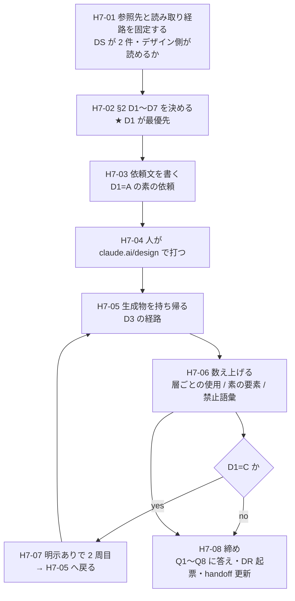

# 手7 — Claude Design にチケット一覧を組ませる

> 段取り上の位置づけ: [UI検証の位置づけと段取り.md](../UI検証の位置づけと段取り.md) §5
> 直前の手: [手6](手6_ClaudeDesignへの同期.md)（done・`main` へマージ済み `b7a97f3`）／実測の記録先: [実行記録.md](../実行記録.md) §手7

**この手は「受け手だけ」を測る手。**渡す側は手6 で全部揃った。
🟦 **本 repo のコードは原則 1 行も変えない**——変えたくなったらそれ自体が観測結果（Q4）。

## この手の結論が段取りを分岐させる（段取り §5）

| 答え | 帰結 |
| --- | --- |
| 🟦 **使う** | **往復ワークフローが成立する。**部品はコードごと移送する（手9 の形が決まる） |
| 🟥 **作り直す** | **Claude Design は案出し専用に格下げ。**部品は人が手で組んで供給する |

🟨 **手6 と手7 の分担**——手6 は「同期が通るか・何が落ちるか」、手7 は「**それで design agent が正しく部品を選ぶか**」。
「書けた」（手6 の答え）と「効いた」（手7 の答え）を混ぜない。

---

## 0. この手で答えを出す問い（観測項目）★最重要

| # | 問い | なぜ効くか（どの判断が変わるか） |
| --- | --- | --- |
| **Q1** | ★ **登録した 14 部品を使うか、markup を作り直すか。**層ごとに答えが割れるか | **この検証の核心その 2。**段取り §5 の分岐そのもの。🟥 **判定は「`window.Design.*` を何回使ったか」だけでは足りない**——受け手の機械ゲートは `<button>` しか見ないので、**素の HTML 要素を何個書いたかを数える**（[DR-0059](../DR/DR-0059-receiver-generates-its-own-adherence-lint.md)） |
| **Q2** | ★ **フラグ 5 種（`stateful` / `behaviorHook` / `formBound` / `overlay` / `container`）を使い分けるか**（未決 #10 の後半） | 手6 D4=C で `.prompt.md` と conventions header の**両方に書いた**。**書けた ≠ 効いた。**効かなければフラグは境界を越えない＝分類の一部が移送不能 |
| **Q3** | ★ **禁止語彙（数値の段 `p-4` / パレット色 `text-gray-600`）を書かないか** | 🟥 **受け手の機械ゲートはこれを検出しない**（[DR-0059](../DR/DR-0059-receiver-generates-its-own-adherence-lint.md) §4）。**散文だけで守れるかの試験。**破れば手8 の lint が赤くなる＝手8 のスコープが「通るか」から「どこで食い違うか」へ変わる |
| **Q4** | **素材層 16 件を渡していないことで「足りない」が出るか**（どの部品を求めるか） | 出たら **2 周目で素材層を足す**判断（手6 D2 の 2 周目）。**手3 D3=B「画面は製品層しか見ない」が境界の向こうでも保てるか** |
| **Q5** | **層と役割が `group` 1 本に潰れた影響が出るか**（`layout` と `patterns` が兄弟に見える） | [思想への指摘 9](../共通コンポーネント思想への指摘.md)。選択を誤ったらこれが原因候補。**誤らなければ「1 本で足りていた」という反証になる** |
| **Q6** | **conventions header が英語であることが効き目に影響するか**（[OBS-0011](../OBS/OBS-0011_規約ヘッダの言語は決定ではなく既定値だった.md)） | 🟥 **1 周目は英語のまま固定する**（検体を動かさない）。Q2 が 🟥 だったときに**原因候補として起き上がる**。生成物の**文言の言語**も記録する |
| **Q7** | **「対象 0 件で緑」の 13 例目が出るか**（[OBS-0003](../OBS/OBS-0003_対象0件で緑が5回出た.md)） | 通算 12 例。🟥 **今回の固有リスク: 見た目が正しくても中身が別物**（プレビューが実部品で描かれるので、作り直していても「合っている」ように見える） |
| **Q8** | 🟨 **[思想への指摘](../共通コンポーネント思想への指摘.md)が 10 件目として出るか** | 現在 **9 件**。未決 #25（指摘の偏りは「規定の細かさ」か「使い込みの量」か）の判定材料。手7 は**分類を初めて他者に使わせる手** |

> **Q1〜Q3 が本体。**Q4・Q5 は原因の切り分け用。Q6〜Q8 は継続観測。
>
> 🆕 **2 周目からは「14 部品」ではなく「30 部品」**（手7 D5=A で素材層 16 件を足した・§2.9）。
> **Q4 は「渡していないと何が起きるか」で 1 周目に答えが出た**ので、2 周目は「**渡すと直るか**」を見る。

---

## 1. 前提

- **直前の手**: 手6 done（`main` へ `--no-ff` マージ済み `b7a97f3`）
- **本手のブランチ**: `step/h7-design-agent-behavior`
- **ベースライン**（[handoff.md](../handoff.md) の表と一致）

  | ゲート | 手6 完了時 |
  | --- | --- |
  | `pnpm typecheck` | 🟦 緑（🟥 借金で緑＝`exactOptionalPropertyTypes: false`・DR-0014） |
  | `pnpm lint` | 🟥 **error 33**（全部素材層）／ warning 1 |
  | `pnpm build` | 🟦 緑 |
  | `pnpm format:check` | 🟦 緑 |
  | `pnpm spell` | 🟦 緑 |
  | `pnpm build-storybook` | 🟦 緑（story 37 本） |

  🟨 **手7 は本 repo を触らない手なので、ゲートは着手時と完了時の 2 回回せば足りる。**

### 渡し終わっている側（手6 の成果・ここは動かさない）

| 事実 | 効くこと |
| --- | --- |
| 🟦 実コンポーネント **14 件**が `window.Design.*` で描画される | **「使う」を選べる状態は成立済み。**作り直したら受け手側の判断 |
| 🟦 `.d.ts` と `.prompt.md` が部品ごとに載っている | API を間違えたら**渡し方**ではなく**受け手**の問題 |
| 🟦 conventions header が system prompt に inline される | **フラグ 5 種を散文で渡した。効くかがここで分かる** |
| 🟦 tmp-admin の値が `_ds_bundle.css` に載っている | 見た目は手5 の成果で描かれる |
| 🟥 層と役割が `group` 1 本に潰れている | → Q5 |
| 🟥 素材層 16 件は渡していない | → Q4 |

### 🆕 受け手側の実測（[DR-0059](../DR/DR-0059-receiver-generates-its-own-adherence-lint.md)・2026-08-01）

**受け手は受け取ったものを加工して、自分用の機械ゲートを作っていた。**

| 観測 | 手7 への効き方 |
| --- | --- |
| `_adherence.oxlintrc.json` が**リモートにだけ存在する**（`.d.ts` から導出） | **props 名と union 値が向こうの lint 規則になっている。**型の鮮度が規則の正しさを決める |
| `react/forbid-elements` は **`<button>` 1 本だけ**。他 13 部品の `replaces` は `[]` | 🟥 **`<div>` で Layout を迂回されても検出されない** → **Q1 の判定に「素の要素の数」を入れる** |
| `no-restricted-syntax` は生 hex と `\d+px` **リテラル**のみ | 🟥 **`p-4` / `text-gray-600` は捕まらない** → **Q3 は散文だけの試験になる** |
| `x-omelette.tokens` にパレット色 8 語が**トークンとして**載る | 🟥 conventions header の禁止と**食い違っている**。Q3 が 🟥 なら原因候補 |
| 🟦 `list_files` / `get_file` が通った | **私が受け手側を読める。**目視だけに頼らなくてよい |
| 🟥 デザインシステムが **2 件**ある（`Modernist` / `design — UI検証`） | **取り違えると全部が無意味になる。**H7-01 で固定する |

### 確定済みの前提（ここは決め直さない）

| 前提 | 出典 |
| --- | --- |
| 検証スコープは**チケット一覧 1 画面**。画面は部品を洗い出させる口実 | [DR-0002](../DR/DR-0002-verify-three-layers-not-screens.md) |
| 合否の定義は**層ごとに違う** | [DR-0033](../DR/DR-0033-step5-criteria-differ-per-layer.md) |
| 画面は**製品層しか見ない**（手3 D3=B・手4 D6=A で維持） | 手3・手4 |
| 上がっているのは**コンパイル済みの実コンポーネント**。プレビュー HTML は人間用のカード | [DR-0057](../DR/DR-0057-design-sync-uploads-compiled-code-not-just-html.md) |
| 移送は**境界を越える瞬間だけ人が実行する** | [DR-0001](../DR/DR-0001-repo-role-and-deliverable.md) |
| 🟥 **緑は何も保証しない。**検出は**生成物への grep が一番速い** | [DR-0048](../DR/DR-0048-build-storybook-does-not-render.md)・[DR-0046](../DR/DR-0046-theme-swap-loses-to-source-order.md) |

### 🟥 着手前に潰しておく不確定要素

| # | 不確定要素 | 潰し方 |
| --- | --- | --- |
| 1 | 🟥 **design agent を私（Claude Code 側）から起動できない。**手6 の `/design-sync` と同じ構造（[handoff §H6-01](../handoff.md)） | **人が claude.ai/design で打つ。**D6 |
| 2 | 🟥 **デザインを作る側のプロジェクトを私が読めるか未確認。**`list_projects` は**デザインシステム型に絞って**返す | **H7-01 で試す。**読めなければ D3（持ち帰り経路）が変わる |
| 3 | 🟥 **デザインシステムが 2 件ある。**`Modernist`（`37ffb46e…`）と `design — UI検証`（`3acbb737…`） | **H7-01 で参照先を目視確認してから組ませる** |
| 4 | 🟨 **Low-fi / High-fi のどちらで出るか未確定。**先行調査では **Low-fi がデザインシステムを完全に無視した**報告がある（[ClaudeDesignShadcnIntegration.md](../../ClaudeDesignShadcnIntegration.md) §3） | **D2 で明示的に選ぶ。**混ぜると Q1 の原因が切り分けられない |
| 5 | 🟨 **`Modernist` の由来が不明。**H6-01 の時点で `list_projects` は `[]` だった | H7-01 でユーザーに確認。**手7 で触らない** |

---

## 2. 着手前に決めること（判断ポイント）

> **戻しにくい決定はここに全部出す。**実行中に §2 に無い選択肢が出たら、**その場で決めずにここへ追記してから進む**
> （手1 D9/D10・手2 D9・手5 D7・手6 D8 で **4 度**機能した規律）。

| # | 論点 | 選択肢 | 決定 | 根拠 | 戻せるか |
| --- | --- | --- | --- | --- | --- |
| **D1** | ★ **最優先。1 周目の指示にデザインシステム準拠を明示するか** | **A** 何も言わず素の依頼だけ／ **B** 「デザインシステム準拠で」と明示／ **C** A で 1 周 → B で 2 周（対照） | 🟦 **C**（ユーザー判断 2026-08-01） | §2.1 | 🟦 戻せる |
| **D2** | **何を・どの忠実度で組ませるか** | **A** チケット一覧 1 画面・High-fi のみ／ **B** Low-fi → High-fi の 2 段／ **C** 一覧 + 詳細の 2 画面 | 🟦 **A**（ユーザー判断 2026-08-01） | §2.2 | 🟦 戻せる |
| **D3** | **生成物の持ち帰り経路** | **A** `DesignSync` の読み取りで私が直接読む／ **B** `/design` で Claude Code へ戻す／ **C** 人が手でコピーして repo に貼る | 🟦 **A → 駄目なら C**（ユーザー判断 2026-08-01） | §2.3 | 🟦 戻せる |
| **D4** | ★ **「使った」の判定基準** | **A** `window.Design.*` を 1 つでも使えば使った／ **B** 層ごとに基準を変える（DR-0033）／ **C** 素の HTML 要素の比率で測る | 🟦 **B ＋ C を補助**（ユーザー判断 2026-08-01） | §2.4 | 🟥 **後から変えると再実行** |
| **D5** | **素材層の不足が出たとき、その場で 2 周目を回すか** | **A** 回す（素材層 16 件を足して再同期）／ **B** 記録だけして手7 は 1 周で閉じる | 🟦 ~~B~~ → **A へ変更**（ユーザー判断 2026-08-02） | §2.5 | 🟦 戻せる |
| **D6** | **誰が何周打つか** | **A** 人が 1 周だけ／ **B** 人が 2 周（D1=C とセット）／ **C** 人が打ち、私が生成物を読んで追加指示を作る | 🟦 **C**（ユーザー判断 2026-08-01） | §2.6 | 🟦 戻せる |
| **D7** | **外向き操作の承認**（新しいデザインプロジェクトを作る） | **A** 新規プロジェクトを作る／ **B** 既存に作る | 🟦 **A**（ユーザー判断 2026-08-01） | §2.7 | 🟨 消せる |

> 🟦 **D1〜D7 は 2026-08-01 に一括で決着した**（推奨どおり）。**H7-02 は完了。**

### 🆕 D8（実行中に出た論点・H7-06 で追記）

**1 周目が肯定的だったので、2 周目の目的が消えた。**

D1=C の 2 周目は「**A が 🟥 だったときに『使わない』と『言わないと使わない』を切り分ける**」ための対照だった。
🟦 **1 周目は明示なしで 9/14 を使い、`<div>` も `<button>` も 0 件**だったので、**その切り分けは不要になった。**

| # | 論点 | 選択肢 | 決定 | 根拠 | 戻せるか |
| --- | --- | --- | --- | --- | --- |
| **D8** | 2 周目（H7-07）を回すか | **A** 事前登録どおり回す（末尾に 1 文だけ足す）／ **B** 回さず Q1 を確定させて閉じる／ **C** 予定を変えて「宣言した語彙だけを使え」と明示する 2 周目にする | 🟦 **B**（2026-08-02）。🟨 **D5=A の帰結として自動的にこうなる**——§2.9 | §2.8 | 🟦 戻せる |
| **D9** | **素材層を何件足すか** | **A** 16 件全部（手6 D2 の 2 周目の定義）／ **B** Q4 が名指しした 3 件だけ（`Card` / `Badge` / `Select`） | 🟦 **A**（「素材層を足して」＝素材層そのものと読んだ・2026-08-02） | §2.9 | 🟦 戻せる |

### 2.8 D8 — 2 周目を回すか

**推奨: A（事前登録どおり）。**

- **A の価値は Q1 から Q3 へ移る。**1 周目で出た「**宣言した語彙の外に 4 語**」（§Q3）が、
  **明示すると締まるのか**が同じ 1 周で見える。**事前登録（末尾 1 文だけ）も守れる**
- **B** は安い。🟥 ただし **Q3 の「散文だけで守れるか」に片側の観測しか残らない**
- 🟥 **C は事前登録から外れる。**「語彙だけを使え」は D1 が定義した対照ではないので、
  **やるなら 3 周目**（A を回した後の追加観測）として位置づける

### 2.9 D5 の変更（B → A）と、その帰結としての D8=B・D9=A

🟦 **ユーザー判断（2026-08-02）: 2 周目ではなく「素材層を足して再同期」で進める。**

**★ 変数を 1 つだけ動かす。**

| | 1 周目 | **2 周目（次に打つもの）** |
| --- | --- | --- |
| デザインシステム | 14 部品（製品層＋③＋④） | 🟥 **30 部品**（＋素材層 16） |
| 依頼文 | 明示なし（H7-03） | 🟦 **同一。1 文字も変えない** |
| conventions header の語彙表 | — | 🟦 **1 文字も変えない**（役割一覧と 2 段の説明だけ足す） |

- **D8=B の理由**: 事前登録の 2 周目（末尾に 1 文足す）を同時に打つと、
  🟥 **「素材層が増えた」と「明示した」の 2 変数が同時に動く。**Q1 は 1 周目で 🟦 が出ているので、
  **D1=C の対照はもう要らない**（[実行記録 §手7 Q1](../実行記録.md)）。
- **D9=A の理由**: 「素材層を足して」を**素材層そのもの**と読んだ。
  手6 D2 の 2 周目は元々 16 件全部として定義してある。🟨 **B（3 件だけ）は人工的な集合**で、
  「足りないものが揃ったら何が変わるか」を測るには弱い。
- 🟥 **手3 D3=B（画面は製品層しか見ない）は、境界の向こうでは維持しないことになった。**
  1 周目の Q4 が実害を示したうえでの変更。**repo の内側では維持している**
  （`src/index.ts` の import 元は製品層の再輸出で、`@/components/ui/**` を直接は出していない）。

#### 🟥 2 周目に賭ける予測（打つ前に書く）

| # | 予測 | 外れたら何を意味するか |
| --- | --- | --- |
| 1 | ★ **`Box` + `bg-card rounded-md border` の手組みが消え、`Card` が使われる** | **語彙表を変えていないので、消えれば「宣言語彙を外れた原因は部品の欠落」が確定する。**消えなければ**語彙表の書き方の問題** |
| 2 | フィルタのチップが `Button` の variant 切り替えから `Badge` / `Select` / `Checkbox` に変わる | 変わらなければ「部品があっても選ばない」＝ Q1 の答えが層で割れる |
| 3 | カードが **14 → 30** になる | カード数を決めるのは export ではなく story |
| 4 | Overlay 5 件で `[GRID_OVERFLOW]` が出る | 出たら `cardMode: "single"` を足す（`Sidebar` / `AppShell` と同じ）。🟥 **先回りでは足していない** |
| 5 | 🟥 **素の `<span>` 8 個は減らない** | 表セルの文字装飾には対応する部品が無いため。減ったら**素材層に想定外の受け皿があった**ということ |

### 2.1 D1 — 指示にデザインシステム準拠を明示するか（★ 最優先）

**推奨: C（A で 1 周 → B で 2 周）。**

🟥 **ここが手7 の測定設計そのもの。**先に決めないと Q1 の答えが意味を持たない。

| 案 | 何を測ることになるか |
| --- | --- |
| **A**（明示しない） | **「放っておいても使うか」**＝ conventions header が system prompt に効いているかの純粋な試験。🟥 **無視されたら「格下げ」の判定が出る**が、それは**本当に格下げなのか、指示不足なのか**が分からない |
| **B**（明示する） | **「言えば使うか」**＝実運用に近い。🟥 **下駄を履かせた測定**になり、段取り §5 の分岐（案出し専用に格下げ）を判定できない |
| **C**（A → B） | **両方取れる。**A が 🟥 で B が 🟦 なら「**使うが、言わないと使わない**」＝**運用手順に 1 行足せば済む**という第 3 の答えになる |

**C を推す理由**: 先行調査に「**最初はワイヤーフレームがデザインシステムを完全に無視した／再指示したら適用された**」という
報告がある（[ClaudeDesignShadcnIntegration.md](../../ClaudeDesignShadcnIntegration.md) §3）。
**A だけで測ると、この既知の挙動を「格下げ」と誤読する。**

### 2.2 D2 — 何を・どの忠実度で組ませるか

**推奨: A（チケット一覧 1 画面・High-fi のみ）。**

- 射程は [DR-0002](../DR/DR-0002-verify-three-layers-not-screens.md) で**チケット一覧 1 画面**に確定済み。広げる理由が無い
- 🟥 **Low-fi は避ける。**先行調査の「デザインシステムを無視した」報告は **Low-fi の話**で、
  **忠実度と準拠の 2 変数が同時に動く**と Q1 の原因が切り分けられない
- **B（Low-fi → High-fi）を採るなら、Low-fi の無視は Q1 の答えに数えない**ことを先に決めておく

### 2.3 D3 — 生成物の持ち帰り経路

**推奨: A を試し、駄目なら C。**

- **A** は H7-01 で可否が分かる（不確定要素 #2）。通れば**私が直接読める＝最も速く、写し間違いが無い**
- **B**（`/design`）は Claude Code 側のコマンドで、🟥 **`/design-sync` と同じく私からは起動できない**。人が打つ
- **C** は確実だが、🟥 **人の写し間違いが観測に混入する**（[DR-0054](../DR/DR-0054-mock-specimens-cannot-reproduce-stacked-states.md) の「検体が模型だった」と同型の危険）

### 2.4 D4 — 「使った」の判定基準（🟥 後から変えると再実行）

**推奨: B（層ごとに基準を変える）＋ C を補助に。**

[DR-0033](../DR/DR-0033-step5-criteria-differ-per-layer.md) が「**合否の定義は層ごとに違う**」と決めている。
🟥 **[DR-0059](../DR/DR-0059-receiver-generates-its-own-adherence-lint.md) により、受け手の機械ゲートが見るのは `<button>` 1 本だけ**と分かったので、
**残りは我々が数えるしかない。**

| 層 | 「使った」の定義 | 「作り直した」の兆候 |
| --- | --- | --- |
| ④ Templates | `AppShell` を使って画面骨格を組んだ | 自前で `<div>` + sidebar を組んだ |
| ③ Patterns | `ListDetail` / `EmptyState` を使った（`useListDetail` を呼んだか） | 一覧と詳細を素で並べた |
| ② 製品層・自作 | `Stack` / `Inline` / `Grid` / `Container` で組んだ | 🟥 **`<div className="flex …">` を書いた**（受け手の lint は検出しない） |
| ② 製品層・ラッパー | `Button` を使った | 🟥 **`<button>` を書いた**（ここだけ受け手も検出する） |
| ② 製品層・DataDisplay | `DataGrid` / `StatusPill` を使った | 素の `<table>` / 色付き `<span>` を書いた |

**補助指標（C）**: 生成物中の**素の HTML 要素の数 ÷ 部品タグの数**。**割合で出すと層をまたいで比較できる。**

### 2.5 D5 — 素材層の不足が出たら 2 周目を回すか

**推奨: B（記録だけして 1 周で閉じる）。**

- 手6 D2 は「2 周目で素材層を足す」を残しているが、🟥 **足すと手3 D3=B（画面は製品層しか見ない）が境界の向こうで破れる**
- **「何が足りないと言われたか」自体が成果物。**足りない部品名のリストは、そのまま**製品層に足すべき部品の候補**になる
- A を採るなら、**素材層を足す前後で Q1 の答えを別々に記録する**（混ぜると 2 周目の結果しか残らない）

### 2.6 D6 — 誰が何周打つか

**推奨: C（人が打ち、私が生成物を読んで追加指示を作る）。**

🟥 **私は design agent を起動できない**（不確定要素 #1）。手6 D6 と同じ構造なので、
**手7 の実行は「ユーザーが claude.ai/design で打つ」から始まる。**
D3=A が通れば、私は**打った結果を読んで次の指示を書く**ところまで担える。

### 2.7 D7 — 外向き操作の承認

**推奨: A（新規プロジェクトを作る）。**既存資産に触らない。
🟨 手6 D7 でユーザーは「Claude Design なら問題なし」と判断済みだが、**デザイン側は初めてなので改めて確認する。**

---

## 3. 成果物

- `docs/実行記録.md` に **§手7** の節（Q1〜Q8 の実測・生成物の数え上げ）
- 生成物のスナップショット（D3 の経路で持ち帰ったもの）。置き場は **`.context/` ではなく repo 配下**——
  🟥 **置き場を決めるのは D3 の一部。**lint の射程に入るなら `eslint.config.mjs` の除外が要る（[DR-0040](../DR/DR-0040-frame-leaks-when-a-layer-is-added.md) の 4 例目を出さない）
- **DR が最低 2 件**の見込み: ①「Q1 の答え」②「フラグは効いたか」
- 🟨 [OBS-0011](../OBS/OBS-0011_規約ヘッダの言語は決定ではなく既定値だった.md) の遷移（Q2 が 🟦 なら `closed`）

## 4. 作業フロー



## 5. 手順

### H7-01 参照先と読み取り経路を固定する

- **目的**: **不確定要素 #2・#3・#5 を潰す。**測る前に、何を測れるかを確定させる
- **実行**:
  - `DesignSync({method:'get_project', projectId:'3acbb737-85fe-4098-95f4-c99070168ba1'})` で
    `type: PROJECT_TYPE_DESIGN_SYSTEM` と `canEdit` を確認
  - **人が claude.ai/design でデザインプロジェクトを 1 つ作り、参照する DS に `design — UI検証` を選ぶ**（🟥 `Modernist` と取り違えない）
  - その projectId を私に渡し、`list_files` が通るか試す（→ **D3=A の可否**）
- **期待結果**: DS 側は 110 パスが見える。デザイン側は 🟥 **通るか不明**
- **検証**: `Modernist` を触っていないこと（`updatedAt` が変わっていない）
- **観測**: 前提の確定。Q なし
- **判断**: D3（読めなければ A を落として C へ）
- **詰まったら**: `list_projects` はデザインシステム型しか返さない。**デザイン側の ID は人が URL から取る**

### H7-02 §2 の D1〜D7 を決める

- **目的**: **問いの測定条件を確定させる。**とくに D1 と D4
- **実行**: 推奨と根拠を出し、ユーザーが決める
- **期待結果**: §2 の表の「決定」欄が全部埋まる
- **検証**: 🟥 **D4 を決めずに H7-04 へ進まない**——基準を後から変えると生成し直しになる
- **観測**: なし（測定設計）
- **判断**: D1〜D7 すべて
- **詰まったら**: 迷ったら **D1=C**（対照が取れる方）を採る。1 周増える代償だけで、判定不能を避けられる

### H7-03 依頼文を書く

- **目的**: **1 周目の依頼文を確定させ、実行記録に「そのまま」残す。**再現性のため
- **実行**: D1=C の 1 周目なので、**デザインシステムに一切言及しない**依頼文にする。
  🟦 **確定した依頼文（1 周目・これをそのまま打つ）:**

  ```text
  Redmine のチケット一覧画面を作ってください。要件は次のとおりです。

  - 左にサイドバーのナビゲーション（チケット / プロジェクト / 設定）、右が本文
  - 本文の先頭に画面タイトルと、新規作成のボタン
  - チケットの一覧表。列は ID / 題名 / ステータス / 優先度 / 担当者 / 更新日
  - ステータスは「新規・進行中・解決・却下」を色分けして見分けられるように
  - 一覧の上に、ステータスと担当者で絞り込むフィルタ
  - 検索条件に合うチケットが 0 件のときの表示も用意してください
  ```

  🟥 **2 周目（H7-07）の差分は 1 文だけ。**末尾に
  「**このプロジェクトのデザインシステムに登録されている部品を使って組んでください。**」を足す。**他は 1 文字も変えない。**
- **固定する条件（記録しておく変数）**: 依頼文は**日本語**／ conventions header は**英語**（[OBS-0011](../OBS/OBS-0011_規約ヘッダの言語は決定ではなく既定値だった.md)）／忠実度は **High-fi**（D2=A）
- **期待結果**: 依頼文が 1 本確定する
- **検証**: 🟥 **依頼文に部品名（`DataGrid` `AppShell` `StatusPill` `ListDetail` `EmptyState` …）を書いていないこと。**書いたら Q1 は測れない
  - 🟨 **1 つ自覚した曖昧さ: 「サイドバー」。**一般的な UI 名詞だが、**我々の部品名 `Sidebar` と綴りが重なる。**
    要件から外すと画面が成立しない（④ Templates が試せない）ので**残す**。
    **`Sidebar` を使ったことを Q1 の根拠に単独では使わない**——他部品と合わせて判断する
- **観測**: Q1 の測定条件
- **判断**: なし
- **詰まったら**: 「デザインシステム準拠で」を書きたくなったら、それは **D1=B**。§2 へ戻る

### H7-04 人が claude.ai/design で打つ

- **目的**: 生成させる
- **実行**: 🟥 **ユーザーが実行する。**私からは起動できない（不確定要素 #1）
- **期待結果**: デザインが 1 つ以上出る
- **検証**: 参照 DS が `design — UI検証` になっていること（H7-01 で固定した先）
- **観測**: **この時点で人が見て分かることを先に記録する**——部品らしく見えるか・色は tmp-admin か・書体は何か
- **判断**: なし
- **詰まったら**: 🟥 **見た目が正しくても中身が別物でありうる**（Q7）。**目視で「使っている」と判定しない**

### H7-05 生成物を持ち帰る

- **目的**: **数えられる形にする**
- **実行**: D3 の経路（A: `list_files` / `get_file` ／ B: `/design` ／ C: 手でコピー）
- **期待結果**: JSX か HTML のソースが手元に来る
- **検証**: 🟥 **truncated: false** を確認する（`get_file` は 256 KiB 上限）
- **観測**: Q7（「持ち帰れた」と「全部持ち帰れた」は別）
- **判断**: 置き場（§3）
- **詰まったら**: 読み取りが通らなければ C へ落とす。**落としたことを実行記録に書く**

### H7-06 数え上げる

- **目的**: ★ **Q1〜Q3 に答える**
- **実行**: 生成物への grep。**緑を見ずに数字を見る**
  ```bash
  # Q1: 部品タグ vs 素の要素
  grep -o '<[A-Z][A-Za-z]*' <生成物> | sort | uniq -c | sort -rn
  grep -o '<[a-z][a-z0-9]*' <生成物> | sort | uniq -c | sort -rn
  # Q3: 禁止語彙（受け手の lint は検出しない）
  grep -nE 'className="[^"]*\b(p|m|gap|w|h)-[0-9]+' <生成物>
  grep -nE '(text|bg|border)-(gray|slate|zinc|neutral|stone|red|blue|green)-[0-9]{2,3}' <生成物>
  # Q2: フラグの効き（AppProviders / useListDetail を使ったか）
  grep -nE 'AppProviders|useListDetail|SidebarProvider' <生成物>
  ```
- **期待結果**: §2.4 の層別表が埋まる
- **検証**: 🟥 **赤テストを打つ**——**わざと `<button>` と `p-4` を含む断片**を同じ grep にかけ、**引っかかることを確認**してから本番の数字を読む（[DR-0048](../DR/DR-0048-build-storybook-does-not-render.md)・通算 12 例の教訓）
- **観測**: **Q1・Q2・Q3・Q5**
- **判断**: D5（素材層の不足が出たら）
- **詰まったら**: 数が 0 のとき、**「使っていない」なのか「grep が当たっていない」なのか**を必ず切り分ける

### H7-07 明示ありで 2 周目（D1=C のときだけ）

- **目的**: **対照を取る。**「使わない」のか「言わないと使わない」のか
- **実行**: 同じ依頼文に「**このデザインシステムの部品を使って**」を足して打ち直す（人が実行）
- **期待結果**: 1 周目との差分
- **検証**: 🟥 **依頼文の差分が 1 箇所だけであること。**他を変えると対照にならない
- **観測**: **Q1（第 3 の答え「言えば使う」）・Q6**
- **判断**: なし
- **詰まったら**: 2 周目も 🟥 なら、**言語（Q6・OBS-0011）が次の原因候補**に上がる

### H7-08 締め

- **目的**: 答えを固定する
- **実行**: 実行記録 §手7 に Q1〜Q8 の答え・DR 起票・[handoff.md](../handoff.md) 更新・機械ゲート 6 本
- **期待結果**: §6 の完了条件が全部埋まる
- **検証**: 🟥 **チェックを付ける前に検証する**（手6 で守った規律）
- **観測**: Q8（思想への指摘 10 件目）
- **判断**: 段取り §5 の分岐（「使う」→ 手9 の形／「作り直す」→ 案出し専用に格下げ）
- **詰まったら**: 答えが割れたら（層ごとに違う）**割れたまま記録する。**「全部」は答えではない

## 6. 完了条件

- [ ] 機械ゲート 6 本を回し、**新しい赤がゼロ**であること（手7 は本 repo を触らない手なので、増えていたらそれ自体が発見）
- [ ] §0 の Q1〜Q8 すべてに答えが出ている（🟥 **答えが「不明」なら、なぜ測れなかったかを書く**）
- [ ] §2 の D1〜D7 がすべて決着し、根拠が書かれている
- [ ] **H7-06 の赤テストを実施した証跡がある**（grep が当たることを確認してから数字を読んだ）
- [ ] 生成物のスナップショットが repo に入り、**lint / prettier / spell の射程が漏れていない**（DR-0040 の 4 例目を出さない）
- [ ] 実行記録に §手7 の節が追加されている
- [ ] [handoff.md](../handoff.md) の現在地・進捗ボード・ベースライン表が更新されている
- [ ] コミット済み（`<type>(H7): 要約 [手7]`）
- [ ] `main` へ `--no-ff` マージを**人に提案**した（実行はしない）

## 7. 出典

- [DR-0059](../DR/DR-0059-receiver-generates-its-own-adherence-lint.md) — 受け手の機械ゲート（2026-08-01 実測・`DesignSync` の読み取り）
- [DR-0057](../DR/DR-0057-design-sync-uploads-compiled-code-not-just-html.md) — 何が上がるか（`/design-sync` skill 本文）
- [DR-0002](../DR/DR-0002-verify-three-layers-not-screens.md) / [DR-0033](../DR/DR-0033-step5-criteria-differ-per-layer.md) — 射程と判定基準
- [ClaudeDesignShadcnIntegration.md](../../ClaudeDesignShadcnIntegration.md) — 🟥 **二次情報**（2026-07-24 の調査まとめ）。
  「Low-fi がデザインシステムを無視した」「再指示したら適用された」はここが出どころで、**一次情報では確認していない**
- プロジェクト: <https://claude.ai/design/p/3acbb737-85fe-4098-95f4-c99070168ba1>
