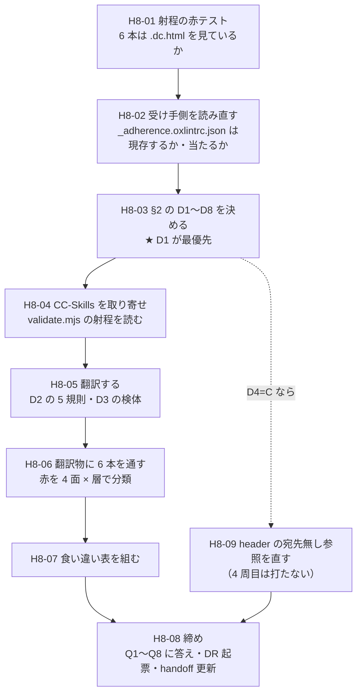

# 手8 — 出力は機械ゲートを通るか

> 段取り上の位置づけ: [UI検証の位置づけと段取り.md](../UI検証の位置づけと段取り.md) §5
> 直前の手: [手7](手7_ClaudeDesignに一覧を組ませる.md)（done・`main` へマージ済み `5c36b88`）／実測の記録先: [実行記録.md](../実行記録.md) §手8

**この手は「境界の両側の網目を突き合わせる手」。**部品を作る手でも、画面を作る手でもない。

## 🟥 問いが手7 で書き換わった

段取りは手8 を「**出力は lint / validate.mjs を通るか**」と定義していた。
[DR-0059](../DR/DR-0059-receiver-generates-its-own-adherence-lint.md) で**受け手も lint を持っている**ことが分かったので、問いは

> **受け手の lint と我々の lint はどこで食い違うか**

に具体化されている（[実行記録 §手7 の締め](../実行記録.md)）。
🟥 **「通るか」を先に問うと、両側とも対象 0 件で緑という答えを取り逃す。**

---

## 0. この手で答えを出す問い（観測項目）★最重要

| # | 問い | なぜ効くか（どの判断が変わるか） |
| --- | --- | --- |
| **Q1** | ★ **我々の機械ゲート 6 本は、生成物 `.dc.html` を 1 行でも見ているか。**見ているのは何本で、何を見ているか | **手8 全体の前提。**見えていないなら「通った」は無意味＝**[「対象 0 件で緑」の 14 例目](../OBS/OBS-0003_対象0件で緑が5回出た.md)**。🟥 **ここを飛ばして翻訳へ進むと、手8 の結論が丸ごと無効になる** |
| **Q2** | ★ **受け手の `_adherence.oxlintrc.json` は、この成果物の形に当たるか** | [DR-0059](../DR/DR-0059-receiver-generates-its-own-adherence-lint.md) §推論を潰す。セレクタは **JSX**（`JSXOpeningElement[name.name='Stack']`）だが、成果物は **`x-import` マークアップ ＋ 素の JS `<script>`**。🟥 **当たらないなら「食い違い」ではなく「どちらも見ていない」が答えになる** |
| **Q3** | ★ **`.dc.html` を TSX へ翻訳したとき、我々の 6 本は何件赤くなるか。内訳は [DR-0060](../DR/DR-0060-vocabulary-leaks-from-four-surfaces.md) の 4 面のどれか** | **手9 の移送コストの見積りそのもの。**赤の内訳が層と面のどこに寄るかで、直す先（素材層ラッパー／`columns` の props 化／header）が決まる |
| **Q4** | **`validate.mjs` / `anti-slop.mjs` は ESLint が捕まえないものを捕まえるか**（段取り §7 の「lint と二重の網」は成立するか） | 成立しないなら段取り §7 の行を訂正する。🟥 **CC-Skills は単一ファイル HTML 出力が前提**なので、射程が違う可能性が高い |
| **Q5** | **借金（`exactOptionalPropertyTypes: false`・[DR-0014](../DR/DR-0014-exact-optional-property-types-incompatible.md)）はここで顕在化するか** | 「手9 の移送時に必ず赤が復活する」と書いてある。**翻訳物を typecheck すれば手9 より先に見える** |
| **Q6** | **手7 が送った 3 件は、直すと赤が減るか**（header の宛先無し参照／`<style>` 生 CSS／`tabular-nums`） | 直すには 4 周目の同期と生成が要る（D4）。**回さないなら「赤の内訳」として手9 へ送る** |
| **Q7** | **「対象 0 件で緑」の 14 例目が出るか** | 通算 **13 例**。🟥 **今回は候補が 2 つある**——我々の側（Q1）と受け手の側（Q2）。**両方が空振りする形は初めて** |
| **Q8** | 🟨 **[思想への指摘](../共通コンポーネント思想への指摘.md)が 11 件目として出るか** | 現在 **10 件**。未決 #25（指摘の偏りは「規定の細かさ」か「使い込みの量」か）の判定材料。**手8 は「規約を機械で守る面」を初めて両側から見る手** |

> **Q1〜Q3 が本体。**Q4・Q6 は付随。Q5 は先取り観測。Q7・Q8 は継続観測。
>
> 🟥 **Q1 と Q2 は「無い」が答えでありうる。**「無い」を「まだ測っていない」と区別して書く。

---

## 1. 前提

- **直前の手**: 手7 done（`main` へマージ済み `5c36b88`・PR #1）
- **本手のブランチ**: `step/h8-output-passes-gates`
- **ベースライン**（[handoff.md](../handoff.md) の表と一致）

  | ゲート | 手7 完了時 |
  | --- | --- |
  | `pnpm typecheck` | 🟦 緑（🟥 借金で緑＝`exactOptionalPropertyTypes: false`・[DR-0014](../DR/DR-0014-exact-optional-property-types-incompatible.md)） |
  | `pnpm lint` | 🟥 **error 33**（全部素材層）／ warning 1 |
  | `pnpm build` | 🟦 緑 |
  | `pnpm format:check` | 🟦 緑（`artifacts/` は `.prettierignore`） |
  | `pnpm spell` | 🟦 緑 |
  | `pnpm build-storybook` | 🟦 緑（story 37 本） |
  | `docs-meta --check` | 🟦 ERROR 0 / warn 27 |

### 手元にある検体（手7 の成果・ここは書き換えない）

| ファイル | 周 | 行 | 何が違うか |
| --- | --- | --- | --- |
| `artifacts/h7/RedmineIssueList.dc.html` | 1 周目 | 132 | 14 部品。`Box` ＋ 3 クラスの手組みが残っている |
| `artifacts/h7/redmine-issue-list.dc.html` | 2 周目 | 156 | 30 部品（素材層 16 を追加）。`w-48` が出た |
| `artifacts/h7/RedmineIssueList-r3.dc.html` | 3 周目 | 157 | 語彙を足した後。`w-48` → `w-field-md` |

🟥 **3 本とも `.dc.html`。**中身は 2 層に分かれる。

| 層 | 形 | 我々の ESLint から見えるか |
| --- | --- | --- |
| マークアップ | `<x-import component-from-global-scope="Design.Stack" gap="md">` ＋ `<sc-if>` / `<sc-for>` | 🟥 **JSX ではない。**属性は `class-name`（ケバブ） |
| ロジック | `<script>` の中の `class ... extends ...` ＋ `React.createElement` | 🟥 **`.html` の中の素の JS。**`className:` はオブジェクトのキー |

### 確定済みの前提（ここは決め直さない）

| 前提 | 出典 |
| --- | --- |
| 赤は ignore もルール緩和もしない。**赤の内訳が成果物** | [DR-0007](../DR/DR-0007-shadcn-output-handling.md) |
| 合否の定義は**層ごとに違う** | [DR-0033](../DR/DR-0033-step5-criteria-differ-per-layer.md) |
| 移送は**境界を越える瞬間だけ人が実行する** | [DR-0001](../DR/DR-0001-repo-role-and-deliverable.md) |
| デザイン側に届くのは**ランタイム 3 ファイル ＋ system prompt の header** だけ | [DR-0064](../DR/DR-0064-design-project-receives-runtime-only.md) |
| 逸脱の出どころは **4 面**（素材層の `className` ／ `Box` ／ `columns[].cell` ／ `<style>`） | [DR-0060](../DR/DR-0060-vocabulary-leaks-from-four-surfaces.md) |
| 🟥 **緑は何も保証しない。**検出は**生成物への grep が一番速い** | [DR-0048](../DR/DR-0048-build-storybook-does-not-render.md)・[DR-0046](../DR/DR-0046-theme-swap-loses-to-source-order.md) |
| 我々の lint が見る文脈は **className / cva / cn の 3 つだけ** | [DR-0038](../DR/DR-0038-arbitrary-value-rule-sees-three-contexts.md) |

### 🟥 着手前に潰しておく不確定要素

| # | 不確定要素 | 潰し方 |
| --- | --- | --- |
| 1 | 🟥 **`~/git/CC-Skills` がこの機械に存在しない。**`validate.mjs` / `anti-slop.mjs` の実物が無い（環境が変わっている——handoff の「環境の再現」は WSL2 前提で書かれているが、現在は macOS ＋ Conductor worktree） | 🟦 **GitHub に public で残っている**（`yatami0/CC-Skills`）。**H8-04 で clone する。**取得できなければ D5 が B へ落ちる |
| 2 | 🟥 **受け手の oxlint が実際に走っているか未確認**（[DR-0059](../DR/DR-0059-receiver-generates-its-own-adherence-lint.md) §推論）。観測したのは設定ファイルの存在だけ | **H8-02 で設定の形を読み、Q2 として「当たるか」まで判定する。**「走っているか」は D8 |
| 3 | 🟥 **`_adherence.oxlintrc.json` が 30 部品版に更新されているか未確認。**3 周目では `_ds/` から消えていた（[DR-0064](../DR/DR-0064-design-project-receives-runtime-only.md) §1） | **H8-02 で `list_files` / `get_file` を打ち直す。**消えていたら**それ自体が Q2 の答え** |
| 4 | 🟨 **翻訳の忠実度を誰が担保するか。**手で書き直すと[「検体が模型だった」](../DR/DR-0054-mock-specimens-cannot-reproduce-stacked-states.md)と同型の危険 | **D2 で機械的な 1:1 変換に寄せる。**判断を挟んだ箇所は実行記録に全件書く |
| 5 | 🟨 **4 周目を打つなら人が要る**（design agent は私から起動できない・手6 D6 / 手7 D6 と同じ構造） | **D4 で「打つ／打たない」を先に決める** |
| 6 | 🟨 **`artifacts/**` を lint の射程に入れると [DR-0040](../DR/DR-0040-frame-leaks-when-a-layer-is-added.md) の 4 例目になりうる**（今度は「漏れ」ではなく「入れ過ぎ」の向き） | **D7 で置き場と射程を先に決める。**翻訳物は検体であって製品ではない |

---

## 2. 着手前に決めること（判断ポイント）

> **戻しにくい決定はここに全部出す。**実行中に §2 に無い選択肢が出たら、**その場で決めずにここへ追記してから進む**
> （手1 D9/D10・手2 D9・手5 D7・手6 D8・手7 D8/D9/D10 で **7 度**機能した規律）。

| # | 論点 | 選択肢 | 決定 | 根拠 | 戻せるか |
| --- | --- | --- | --- | --- | --- |
| **D1** | ★ **最優先。「出力」とは何を指すか**（検査対象の定義） | **A** `.dc.html` そのものだけ／ **B** TSX へ翻訳したものだけ／ **C** 両方（面ごとに分ける）／ **D** ＋ `ds-bundle/`（我々が上げた側）も含める | 🟦 **C**（ユーザー判断 2026-08-02） | §2.1 | 🟥 **後から変えると全部やり直し** |
| **D2** | **翻訳の方法**（D1 が B か C のとき） | **A** 機械的な 1:1 変換（`x-import` → JSX・`class-name` → `className`）／ **B** 人が読んで React として書き直す／ **C** 変換スクリプトを書く | 🟦 **A**（同） | §2.2 | 🟦 戻せる |
| **D3** | **どの検体を使うか** | **A** 3 周目（`-r3`）だけ／ **B** 3 本全部／ **C** 1 周目と 3 周目（語彙を足す前後の対照） | 🟦 **C**（同） | §2.3 | 🟦 戻せる |
| **D4** | **手7 が送った 3 件を手8 で直すか** | **A** 全部直して 4 周目を打つ（人が実行）／ **B** 直さず赤の内訳として手9 へ送る／ **C** header の宛先無し参照だけ直す（4 周目は打たない） | 🟦 **C**（同） | §2.4 | 🟨 4 周目を打つと戻せない |
| **D5** | **`validate.mjs` / `anti-slop.mjs` をどう扱うか** | **A** CC-Skills を clone して実際に走らせる／ **B** 走らせず「射程が違う」ことを実測して段取り §7 を訂正する／ **C** 本 repo 用に書き直す | 🟦 ~~A~~ → **B**（🟥 実物が存在しなかった・D9） | §2.5 | 🟦 戻せる |
| **D6** | **赤が出たときどうするか** | **A** 手8 の中で直す／ **B** 記録だけして手9 へ送る（[DR-0007](../DR/DR-0007-shadcn-output-handling.md) の延長）／ **C** 層ごとに分ける | 🟦 **B**（同） | §2.6 | 🟦 戻せる |
| **D7** | **翻訳物の置き場と機械ゲートの射程** | **A** `artifacts/h8/` に置き、既存どおり射程外のまま（手で数える）／ **B** `artifacts/h8/` に置き、**ESLint の射程にだけ入れる**（prettier / spell は今のまま）／ **C** `src/` 配下に置く | 🟦 **B ＋ 測定後に外す**（同・§2.11） | §2.7 | 🟦 戻せる |
| **D8** | **受け手の lint が「走っているか」をどう確かめるか** | **A** わざと違反する断片を含む依頼を 4 周目で打って観測（D4=A とセット）／ **B** 設定の形だけ読んで「当たるか」に答え、「走っているか」は 🟥 未検証と書く／ **C** 確かめない | 🟦 **B**（同） | §2.8 | 🟦 戻せる |

### 🆕 D9〜D13（実行中に出た論点・H8-04 / H8-05 で追記）

| # | 論点 | 選択肢 | 決定 | 根拠 | 戻せるか |
| --- | --- | --- | --- | --- | --- |
| **D9** | 🟥 **CC-Skills の GitHub リポジトリが空だった**（`Initial commit` の README 1 枚のみ）。`validate.mjs` / `anti-slop.mjs` は**存在しない** | **A** 諦めて D5 を B へ落とす／ **B** 本 repo 用に書き直す（D5=C 相当）／ **C** ユーザーの旧環境から発掘してもらう | 🟦 **A**（2026-08-02）。§2.9 | §2.9 | 🟦 戻せる |
| **D10** | **`hint-size` を翻訳物に残すか** | **A** 落とす（キャンバス寸法メタデータでスタイルではない・[DR-0060](../DR/DR-0060-vocabulary-leaks-from-four-surfaces.md) §1）／ **B** 残す（受け手の「未宣言 props」規則に当たるかを測れる） | 🟦 **A ＋ 件数だけ記録**（2026-08-02）。§2.10 | §2.10 | 🟦 戻せる |
| **D11** | **`<helmet>` の `<style>`（面 ④）をどう翻訳するか** | **A** `<style>` 要素として残す／ **B** 落とす | 🟦 **A**（面 ④ を測るには残すしかない） | §2.10 | 🟦 戻せる |
| **D12** | **import 元をどこにするか** | **A** `@/index`（本 repo の DS entry。`no-restricted-imports` の検査対象になる）／ **B** 相対パス／ **C** import を書かない | 🟦 **A**（受け手も `index.js` からの import を規約にしている） | §2.10 | 🟦 戻せる |
| **D13** | 🟥 **D7=B（ESLint の射程にだけ入れる）では Q5 に答えられない。**`exactOptionalPropertyTypes` は typecheck が見るもの | **A** `tsconfig.json` の `include` にも入れる（typecheck の射程に入る）／ **B** Q5 を「測れなかった」として閉じる | 🟦 **A**（2026-08-02）。§2.11 | §2.11 | 🟦 戻せる（`include` から外すだけ） |

### 🆕 D14（H8-09 の後に出た論点）

**D4=C は「4 周目は打たない」と決めたが、Q6（効き目）はそれでは答えが出ない。**

| # | 論点 | 選択肢 | 決定 | 根拠 | 戻せるか |
| --- | --- | --- | --- | --- | --- |
| **D14** | header を直した効き目を測るか | **A** 4 周目を打つ（人が実行）／ **B** 測らず Q6 を「未測定」で閉じ、手9 へ送る | 🟦 **A**（ユーザー判断 2026-08-02・「残りの 2 件に進む」）| §2.12 | 🟨 打つと戻せない（新しいデザインプロジェクトができる） |

### 2.12 D14 — 4 周目を打つ

**🟦 変数は 1 つだけ動く。**手7 の 3 周が守ってきた測定設計をそのまま延長できる。

| | 3 周目 | **4 周目** |
| --- | --- | --- |
| デザインシステムの部品 | 30 | 🟦 **30。不変**（`src/**` は 1 行も触っていない） |
| ① Tokens の語彙 | `--container-field-*` を足した後 | 🟦 **不変** |
| 依頼文 | 手7 H7-03 の確定文 | 🟦 **1 文字も変えない** |
| **conventions header** | 宛先無し参照 4 件つき・`<style>` の禁止なし | 🟥 **ここだけ動く**（H8-09） |

🟥 **`git diff 5c36b88..HEAD -- src/ .design-sync/` で確認済み**——変わったのは `.design-sync/conventions.md` の 1 ファイルだけ。

### 2.9 D9 — CC-Skills が空だった

🟥 **不確定要素 #1 の「🟦 GitHub に public で残っている」は誤りだった。**
clone は成功したが、中身は **`Initial commit` の `README.md` 1 枚（本文は `# sdd`）**だけ。
`web-design-mock` も `_philosophies/aux-admin` も `validate.mjs` も**一度も push されていない。**

- **A を採る理由**: **手8 は「食い違いを数える手」で、網を新造する手ではない。**
  B（書き直す）は「`validate.mjs` が何を検査していたか」を知らずに書くことになり、**別物になる**
- 🟦 **失われていないもの**: `tmp-admin` のトークン値は**手5 で本 repo に移送済み**（`src/app/tmp-admin.css`）。
  🟥 **失われたもの**: `validate.mjs` / `anti-slop.mjs` の**実装**。
  本 repo は「依存ゼロの Node スクリプト」「🟦 流用できる」としか記録しておらず、**中身を一度も写していない**
- → **段取り §7 の「🟦 design repo でも効かせる（lint と二重の網）→ 手8」は実行不能。**Q4 の答えは「**測れない**」

### 2.10 D10〜D12 — 翻訳規則で決まらなかった 3 点

| # | 決定 | 理由 |
| --- | --- | --- |
| **D10** | `hint-size` は**落とす**。ただし**元の出現数だけ記録する** | [DR-0060](../DR/DR-0060-vocabulary-leaks-from-four-surfaces.md) §1 が「キャンバス寸法メタデータでスタイルではない」と判定済み。🟨 **残すと受け手の「未宣言 props」規則に大量に当たるが、それは移送物に存在しない props への赤**＝手9 の見積りを水増しする |
| **D11** | `<style>` は `<style>` 要素として**残す** | 面 ④（`<style>` への生 CSS）は [DR-0060](../DR/DR-0060-vocabulary-leaks-from-four-surfaces.md) の 4 面の 1 つ。落とすと**測る対象が消える** |
| **D12** | `import { … } from '@/index'` | 受け手の `no-restricted-imports` も「`index.js` から import せよ」という規約なので、**両側で同じ形**にすると食い違いが測れる |

### 2.11 D13 — Q5 のために `tsconfig` の射程にも入れる

**D7=B は「ESLint の射程にだけ入れる」と決めたが、それでは Q5 に答えられない。**
`exactOptionalPropertyTypes` の借金は **typecheck が見るもの**で、ESLint の射程では顕在化しない。

- **A を採る**。🟦 **`pnpm build` には影響しない**（Next.js は `src/app/**` しかビルドしない）
- 🟥 **`pnpm typecheck` に翻訳物が入る**＝ **ベースラインが動く。**
  **これは副作用ではなく Q5 の観測そのもの**なので、**実行記録に「入れる前／入れた後」を別々に書く**
- **戻すのは `include` から 1 行消すだけ**（🟦 戻せる）

### 2.1 D1 — 「出力」とは何を指すか（★ 最優先）

**推奨: C（`.dc.html` と TSX 翻訳の両方・面ごとに分ける）。**

段取りの「出力」は 3 通りに読める。**読みによって手8 が答える問いが変わる。**

| 読み | 何を測ることになるか | 手8 に要るか |
| --- | --- | --- |
| **(a) `.dc.html` そのもの** | **今のゲートが生成物を見ているか**（Q1）。🟥 **見ていないという答えが出る可能性が高く、それ自体が 14 例目** | 🟦 **要る** |
| **(b) TSX へ翻訳したもの** | **移送したら何が赤くなるか**（Q3・Q5）＝**手9 の見積り** | 🟦 **要る** |
| **(c) `ds-bundle/`（我々が上げた側）** | 本 repo のソースそのもの。**すでに毎回 6 本を通している** | 🟥 **要らない。新しい観測が出ない** |

- **A だけ**では手9 の見積りが出ない。**B だけ**では Q1 が測れず、**「翻訳したものが緑だった」を「出力は通った」と誤読する**
- 🟥 **D（(c) も含める）を推さない理由**: `ds-bundle/` は converter の出力で `eslint.config.mjs` の `ignores` に入っている（手6）。
  外すと 1,307 件の赤が戻るだけで、**手6 で決着済みの話を蒸し返す**
- **C の実装は重くない。**(a) は grep とゲート設定の読み取りで足り、**新しい lint プラグインを足す必要が無い**
  （足すのは「本 repo に部品を増やす」ことで、必要性の証明が 1 回もない）

### 2.2 D2 — 翻訳の方法

**推奨: A（機械的な 1:1 変換）。**

- 🟥 **B（読んで書き直す）は [DR-0054](../DR/DR-0054-mock-specimens-cannot-reproduce-stacked-states.md) と同型の危険**——
  **検体が模型になると、問いに答えられない。**「翻訳のときに直してしまった」赤は数えられない
- **A の変換規則は 5 本で足りる**（下表）。**規則を先に書いて実行記録に残す**ので、
  「どこで判断を挟んだか」が後から追える
- 🟥 **C（スクリプトを書く）は 2 回ルールに反する。**翻訳の需要はまだ 1 回目。
  **3 本を手で変換して、同じ変換を 2 度目に要求されたら書く**

| # | 変換 | 例 |
| --- | --- | --- |
| 1 | `<x-import component-from-global-scope="Design.X" …>` → `<X …>` | `Design.Stack` → `<Stack>` |
| 2 | ケバブ属性 → キャメル props | `class-name` → `className` / `on-value-change` → `onValueChange` |
| 3 | `{{ expr }}` → `{expr}` | `nav="{{ nav }}"` → `nav={nav}` |
| 4 | `<sc-if value>` / `<sc-for list as>` → `{cond && …}` / `.map()` | — |
| 5 | `<script>` の `DCLogic` クラス → コンポーネント本体（`React.createElement` はそのまま残す） | 🟥 **JSX へ書き換えない**（[DR-0038](../DR/DR-0038-arbitrary-value-rule-sees-three-contexts.md): lint の見る文脈が変わってしまう） |

> 🟥 **規則 5 が Q3 の答えを左右する。**`columns[].cell` の `React.createElement('span', { className: 'tabular-nums' })` を
> JSX に直すと **lint が見る文脈が「オブジェクトのキー」から「`className` 属性」へ変わり、赤が増える。**
> **どちらの形で数えたかを必ず書く**——[DR-0060](../DR/DR-0060-vocabulary-leaks-from-four-surfaces.md) の面 ③ はここに住んでいる。

### 2.3 D3 — どの検体を使うか

**推奨: C（1 周目と 3 周目）。**

- **3 周目だけ（A）**は「今の最良」を測るには足りるが、🟥 **赤が減った理由が分からない**
- **3 本全部（B）**は 2 周目が中間状態なので、**手間の割に増える情報が少ない**
- **C は対照になる。**[DR-0063](../DR/DR-0063-forbidding-without-an-alternative-fails.md)（語彙を足したら逸脱が 5 → 1 に減った）が
  **lint の赤の件数でも再現するか**が同じ 1 手で見える。🟨 **再現しなければ「逸脱の数」と「lint の赤」が別物だったということ**

### 2.4 D4 — 手7 が送った 3 件を直すか

**推奨: C（header の宛先無し参照だけ直す。4 周目は打たない）。**

| # | 送られたもの | 直す難度 | 4 周目が要るか |
| --- | --- | --- | --- |
| 1 | header の `guidelines/docs/…` 参照に宛先が無い（[DR-0064](../DR/DR-0064-design-project-receives-runtime-only.md)） | 🟦 **低い**（参照を削るか要点を畳む） | 🟥 **効き目を測るなら要る。直すだけなら要らない** |
| 2 | `<style>` への生 CSS が 2 例目 | 🟦 低い（header に 1 文） | 🟥 効き目を測るなら要る |
| 3 | `tabular-nums`（`columns[].cell` 経由） | 🟥 **高い**（手4 の成果物の API 変更） | — |

- **C を推す理由**: ① は **skill 自身が「存在しないものを名指しする conventions は無いより悪い」と書いている**ので、
  **測るかどうかと無関係に直すべき瑕疵**。②③ は**直すと Q3 の検体が変わる**
- 🟥 **A（全部直して 4 周目）は変数が 3 つ同時に動く。**手7 が「1 変数だけ動かす」で 3 周を成立させた設計を壊す
- **B（何も直さない）でも手8 は成立する。**ただし ① を残すと、次の同期で同じ瑕疵を運ぶ

### 2.5 D5 — `validate.mjs` / `anti-slop.mjs` をどう扱うか

**推奨: A（clone して走らせる）。ただし「射程が違う」で終わる可能性を先に書いておく。**

- 段取り §7 は「🟦 design repo でも効かせる（lint と二重の網）→ 手8」と書いている。**この行の検算が手8 の役目**
- 🟥 **CC-Skills は単一ファイル HTML 出力が前提**（段取り §6）。
  **`.dc.html` は単一ファイル HTML なので、実は射程が合っているかもしれない**——ここは読まないと分からない
- **走らせて 0 件だったら、それが「対象 0 件で緑」の候補**。🟥 **赤テストを打ってから件数を読む**
- **B（走らせず訂正）を採るのは、clone しても射程が明らかに合わないとき。**その場合も**読んだ根拠を書く**

### 2.6 D6 — 赤が出たときどうするか

**推奨: B（記録だけして手9 へ送る）。**

- [DR-0007](../DR/DR-0007-shadcn-output-handling.md)（赤の内訳が成果物）の延長。**手8 は「食い違いを数える手」であって「直す手」ではない**
- 🟥 **A（直す）を選ぶと、直した後の数字しか残らない。**手5 で「1 周目と 2 周目を別コミットで残す」を守ったのと同じ理由
- **C（層ごとに分ける）は、赤が実際に出てから考えればよい**——**出る前に分岐を作らない**

### 2.7 D7 — 翻訳物の置き場と機械ゲートの射程

**推奨: B（`artifacts/h8/` に置き、ESLint の射程にだけ入れる）。**

- 🟥 **A（射程外のまま手で数える）だと Q3 が測れない。**ESLint に通すことが Q3 そのもの
- 🟥 **C（`src/` 配下）は駄目。**製品コードと検体が混ざり、`pnpm build` / `build-storybook` まで巻き込む
- **B の配線**: `eslint.config.mjs` に `artifacts/h8/**` 用の block を 1 つ足し、
  **製品層と同じ枠**（`no-restricted-syntax` の `noPrimitiveValues` ＋ `no-restricted-imports`）を当てる。
  🟥 **`.prettierignore` の `artifacts/` はそのまま**——整形すると「agent が吐いたそのもの」でなくなる（手7 の判断を維持）
- 🟨 **これは [DR-0040](../DR/DR-0040-frame-leaks-when-a-layer-is-added.md) の逆向き**（漏れではなく入れ過ぎ）。
  **翻訳物は検体であって製品ではない**ので、**手8 が終わったら射程から外すか、外さない理由を書く**

### 2.8 D8 — 受け手の lint が「走っているか」をどう確かめるか

**推奨: B（形だけ読んで「当たるか」に答え、「走っているか」は 🟥 未検証と明記）。**

- **Q2 は「当たるか」で答えが出る。**セレクタが JSX 前提なら、走っていようがいまいが**マークアップには当たらない**
- 🟥 **A（わざと違反させる 4 周目）は D4=A とセット**で、**変数が増える**。
  **「走っているか」は手8 の問いの中心ではない**——中心は「食い違いの位置」
- **C（確かめない）は取らない。**設定の読み直し（H8-02）は数分で済み、
  🟥 **3 周目で `_adherence.oxlintrc.json` が消えていた**（[DR-0064](../DR/DR-0064-design-project-receives-runtime-only.md)）ので**現況の確認自体に価値がある**

---

## 3. 成果物

- ★ **食い違い表**（下の形）— **手8 の中心的な成果物**。`docs/実行記録.md` §手8 に置く

  | 規約 | 我々の ESLint | 受け手の oxlint | `validate.mjs` | 生成物での実例 |
  | --- | --- | --- | --- | --- |
  | 生 hex | | | | |
  | 生 px リテラル | | | | |
  | 数値の段（`p-4`） | | | | |
  | パレット色（`text-gray-600`） | | | | |
  | 任意値（`w-[192px]`） | | | | |
  | 素材層への直 import | | | | |
  | props の union 値 | | | | |
  | `<button>` → `<Button>` | | | | |
  | `<style>` への生 CSS | | | | |

- `artifacts/h8/*.tsx` — 翻訳物（D2=A の変換規則を適用したもの・D3 の検体ぶん）
- `docs/実行記録.md` に **§手8** の節（Q1〜Q8 の実測・赤の内訳）
- **DR が最低 2 件**の見込み: ①「Q1・Q2 の答え（どちらの網も生成物を見ているか）」②「Q3 の赤の内訳」
- 🟨 段取り §7 の `validate.mjs` の行の訂正（Q4 の答え次第）
- 🟨 `eslint.config.mjs` に `artifacts/h8/**` の block（D7=B のとき）

## 4. 作業フロー



> 🟨 **H8-01 と H8-02 を §2 の決着より前に置いている。**手7 で「手順書を書く前に受け手側を実測した」のと同じ形——
> **D1 の選択肢の形が、測る前と後で変わりうる**ため。🟥 **ただし Q1・Q2 の答えはここで出るので、実行記録に書く。**

## 5. 手順

### H8-01 射程の赤テスト — 6 本は生成物を見ているか

- **目的**: ★ **Q1 に答える。**手8 の全部がこの答えの上に乗る
- **実行**: 🟥 **設定を読むだけで済ませない。わざと違反する検体を置いて 6 本を回す。**

  ```bash
  # 赤テスト用の検体（本番の artifacts/h7/ とは別ディレクトリに置く）
  mkdir -p artifacts/_probe
  cat > artifacts/_probe/red-test.dc.html <<'EOF'
  <x-import component-from-global-scope="Design.Box" class-name="p-4 text-gray-600" style="width: 192px">
    <button style="color:#3b82f6">送信</button>
  </x-import>
  EOF
  pnpm typecheck; pnpm lint; pnpm build; pnpm format:check; pnpm spell; pnpm build-storybook
  ```

- **期待結果**: **何本が発火し、何本が黙るか**が出る
- 🟥 **打つ前に賭ける予測**（[手7 §2.9](手7_ClaudeDesignに一覧を組ませる.md) と同じ作法）。
  🟨 **これは設定ファイルを読んで立てた予測であって実測ではない**——
  [DR-0025](../DR/DR-0025-storybook-init-is-not-selectable.md)（`storybook init` が eslint に import だけ足して効いていなかった）があるので、
  **設定の読みは外れうる。だから赤テストを打つ。**

  | ゲート | 予測 | 根拠（設定の行） | 外れたら何を意味するか |
  | --- | --- | --- | --- |
  | `typecheck` | ⬜ **見ない** | `.html` は `tsconfig` の `include` 外 | 見ていたら射程の理解が誤っている |
  | `lint` | ⬜ **見ない** | `files` は `**/*.{ts,tsx}`。ESLint は `.html` を parse しない | 発火したら plugin が暗黙に入っている |
  | `build` | ⬜ **見ない** | Next.js のビルド対象外 | — |
  | `format:check` | ⬜ **見ない** | `.prettierignore` に `artifacts/`（手7 の判断） | — |
  | `spell` | ⬜ **見ない** | 🆕 **`cspell.json` の `ignorePaths` に `artifacts`**（2026-08-02 に確認） | 発火したら `ignorePaths` の解釈を誤っている |
  | `build-storybook` | ⬜ **見ない** | story の glob 外 | — |

  → 🟥 **予測どおりなら「6 本中 0 本」。**生成物は**どのゲートにも 1 文字も見られていない**＝
  [「対象 0 件で緑」の 14 例目](../OBS/OBS-0003_対象0件で緑が5回出た.md)で、**これまでで最も広い空振り。**
  🟨 **手7 の完了時に「`format:check` 🟦 緑（`artifacts/` を除外）」「`spell` 🟦 緑」と書いたのは、
  どちらも「見た上で緑」ではなく「見ていないから緑」だった**可能性が高い。**ここを確定させるのが H8-01。**
- **検証**: 🟥 **検体を消してから本番の数字を読む**（[手3 の `rm -rf` 事故](../実行記録.md)を踏まえ、`artifacts/_probe/` を切って成果物と混ぜない）
- **観測**: **Q1・Q7**
- **判断**: D1（見えている本数によって、(a) の測り方が変わる）
- **詰まったら**: 0 本発火しても「壊れている」ではない。**「射程外である」ことを数字で確定させるのが目的**

### H8-02 受け手側を読み直す

- **目的**: ★ **Q2 に答える。**不確定要素 #2・#3 を潰す
- **実行**:
  - `DesignSync({method:'list_files', projectId:'3acbb737-…'})` — `_adherence.oxlintrc.json` が**現存するか**
  - 現存すれば `get_file` で全文（🟥 `truncated: false` を確認）。**30 部品版に更新されているか**を件数で見る
  - `replaces` が `Button` 以外にも付いたかを数える（[DR-0059](../DR/DR-0059-receiver-generates-its-own-adherence-lint.md) 表の再取得）
  - ★ **セレクタが検体に当たるかを机上ではなく実物で確かめる**——
    セレクタは `JSXOpeningElement` 前提。検体のマークアップは `x-import` 要素なので**当たらないはず**。
    🟥 **`<script>` 側（素の JS）には当たりうる**ので、**マークアップとロジックを分けて判定する**
- **期待結果**: 「当たる／当たらない」が面ごとに出る
- **検証**: 🟥 **「設定がある」を「効いている」と書かない**（DR-0059 が自分で立てた戒め）
- **観測**: **Q2・Q7**
- **判断**: D8
- **詰まったら**: 消えていたら**それが答え**。3 周目で `_ds/` から消えた件（DR-0064 §1）と突き合わせる

### H8-03 §2 の D1〜D8 を決める

- **目的**: **測定条件を確定させる。**とくに D1
- **実行**: 推奨と根拠を出し、ユーザーが決める
- **期待結果**: §2 の表の「決定」欄が全部埋まる
- **検証**: 🟥 **D1 と D2 を決めずに H8-05 へ進まない**——翻訳の形を後から変えると数え直しになる
- **観測**: なし（測定設計）
- **判断**: D1〜D8 すべて
- **詰まったら**: 迷ったら **D1=C**（両方測る方）。片方だけだと結論を誤読する側に倒れる

### H8-04 CC-Skills を取り寄せ、`validate.mjs` の射程を読む

- **目的**: **Q4 に答える。**段取り §7 の「二重の網」を検算する
- **実行**:
  ```bash
  gh repo clone yatami0/CC-Skills ~/git/CC-Skills   # 🟥 この機械には無い（不確定要素 #1）
  ```
  取得できたら **`validate.mjs` / `anti-slop.mjs` の全文を読む**——何を入力に取り、何を検査するか
- **期待結果**: 射程が「単一ファイル HTML」なのか「任意のファイル」なのかが分かる
- **検証**: 🟥 **走らせて 0 件だったら赤テストを打つ**（対象 0 件で緑の 15 例目を作らない）
- **観測**: **Q4・Q7**
- **判断**: D5
- **詰まったら**: clone できなければ D5=B。**「取れなかった」ことを実行記録に書く**（環境が変わっている証拠として handoff にも残す）

### H8-05 翻訳する

- **目的**: **Q3 の検体を作る**
- **実行**: D2 の変換規則 5 本を、D3 の検体に適用する。**規則を適用した箇所と、判断を挟んだ箇所を分けて記録する**
- **期待結果**: `artifacts/h8/*.tsx`
- **検証**: 🟥 **翻訳で赤を消していないこと。**
  元の `.dc.html` に含まれる禁止語彙（`tabular-nums` / `text-emphasis` / `w-field-md` …）が
  **翻訳物にも同じ数だけ残っている**ことを grep で確認してから次へ進む
- **観測**: なし（検体づくり）
- **判断**: 規則で決まらない箇所が出たら §2 へ追記してから決める
- **詰まったら**: `sc-if` / `sc-for` の意味が取れなければ、**その部分だけ残して注記する。**推測で書かない

### H8-06 翻訳物に機械ゲートを通す

- **目的**: ★ **Q3・Q5 に答える**
- **実行**: D7 の配線をしてから 6 本を回す。**赤を分類する**
  ```bash
  ./node_modules/.bin/eslint . -f json > /tmp/lint.json
  node -e "const r=require('/tmp/lint.json');const m={};for(const f of r)for(const x of f.messages)m[x.ruleId]=(m[x.ruleId]||0)+1;console.log(m)"
  ```
- **期待結果**: **ベースライン（error 33）からの増分**と、その内訳
- **検証**: 🟥 **増分がゼロなら、まず射程を疑う。**H8-01 で置いた赤テストの検体を `artifacts/h8/` に置き直して発火を確認する
- **観測**: **Q3・Q5・Q7**
- **判断**: D6（直さない＝記録するだけ）
- **詰まったら**: **赤を [DR-0060](../DR/DR-0060-vocabulary-leaks-from-four-surfaces.md) の 4 面 × 層のマトリクスに置く。**
  どの面にも入らない赤が出たら**面が 5 つ目**ということ

### H8-07 食い違い表を組む

- **目的**: ★ **手8 の中心的な成果物を作る**
- **実行**: §3 の表を埋める。**セルは「捕まえる／捕まえない／射程外」の 3 値**で、
  🟥 **「捕まえない」と「射程外」を混ぜない**（前者は規則が無い・後者はファイルを見ていない）
- **期待結果**: 食い違いの位置が数で出る
- **検証**: 各セルに**根拠（規則名か設定の行）**が紐づいていること。**推論で埋めたセルは 🟥 を付ける**（[DR-0055](../DR/DR-0055-finding-impact-splits-observation-from-inference.md)）
- **観測**: **Q2 の本体・Q8**
- **判断**: なし
- **詰まったら**: 全セルが「射程外」なら、**それが手8 の答え。**「食い違い」ではなく「**どちらも見ていない**」

### H8-08 締め

- **目的**: 答えを固定する
- **実行**: 実行記録 §手8 に Q1〜Q8 の答え・DR 起票・[handoff.md](../handoff.md) 更新・機械ゲート 6 本
- **期待結果**: §6 の完了条件が全部埋まる
- **検証**: 🟥 **チェックを付ける前に検証する**（手6・手7 で守った規律）
- **観測**: Q8（思想への指摘 11 件目）
- **判断**: **手8b をやるかどうかの材料が揃ったか**（[DR-0056](../DR/DR-0056-preset-swap-is-its-own-step.md)。「やらない」も結論）
- **詰まったら**: 答えが「無い」なら**「無い」と書く。**「まだ測っていない」と区別する

### H8-09 header の宛先無し参照を直す（D4=C のときだけ）

- **目的**: **skill の基準で「無いより悪い」瑕疵を消す**
- **実行**: `.design-sync/conventions.md` の `guidelines/docs/共通コンポーネント思想.md` 参照を、
  **削るか、要点を header 本文へ畳む**（[DR-0064](../DR/DR-0064-design-project-receives-runtime-only.md) §影響 3）
- **期待結果**: header に宛先の無い参照が 0 件
- **検証**: header 中の**すべてのパス参照**を洗い、宛先の実在を確認する（1 件だけ直して他を残さない）
- **観測**: なし（🟥 **効き目は測らない。**測るには 4 周目が要る＝ D4=A）
- **判断**: なし
- **詰まったら**: 畳むと header が長くなる。**長さと届く量のどちらを取るかは §2 へ追記して決める**

### 🆕 H8-10 4 周目を打って header の効き目を測る（D14=A・★ Q6）

- **目的**: ★ **Q6 に答える。**H8-09 で直した conventions header が**実際に効くか**
- 🟥 **実行は人。**私からは `/design-sync` も design agent も起動できない（手6 D6・手7 D6 と同じ構造）

#### 人が打つ手順

| # | やること | 備考 |
| --- | --- | --- |
| 1 | Claude Code で **`/design-sync`** と打つ | 🟨 `.design-sync/conventions.md` だけが変わっている。**部品も語彙も不変**なので `ds-bundle` は同一のはず——**同一でなかったら、それ自体が観測結果**（先に記録する） |
| 2 | claude.ai/design で**新しいデザインプロジェクト**を作り、参照 DS に **`design — UI検証`** を選ぶ | 🟥 `Modernist` と取り違えない |
| 3 | **手7 H7-03 の依頼文をそのまま打つ**（下記・**1 文字も変えない**） | 🟥 変えると 3 周との比較が壊れる |
| 4 | projectId を私に渡す | 私が `DesignSync(list_files / get_file)` で持ち帰る（手7 D3=A が通っている） |

```text
Redmine のチケット一覧画面を作ってください。要件は次のとおりです。

- 左にサイドバーのナビゲーション（チケット / プロジェクト / 設定）、右が本文
- 本文の先頭に画面タイトルと、新規作成のボタン
- チケットの一覧表。列は ID / 題名 / ステータス / 優先度 / 担当者 / 更新日
- ステータスは「新規・進行中・解決・却下」を色分けして見分けられるように
- 一覧の上に、ステータスと担当者で絞り込むフィルタ
- 検索条件に合うチケットが 0 件のときの表示も用意してください
```

#### 🟥 打つ前に賭ける予測

| # | 予測 | 外れたら何を意味するか |
| --- | --- | --- |
| **1** | ★ **`<style>` への生 CSS が消えるか、リセットだけになる** | header に**名指しの禁止**を足した唯一の変更。消えなければ**散文の禁止は 3 例目も破られた**＝ [DR-0063](../DR/DR-0063-forbidding-without-an-alternative-fails.md) の「禁止だけでは破られる」が**代替を与えても成立する**ことになる |
| **2** | ★ **`tabular-nums` が消える** | header で**名指しした**うえに「CSS に存在することは使ってよいことを意味しない」と書いた。🟥 **消えなければ、許可リストは散文では閉じられない**＝[指摘 11](../共通コンポーネント思想への指摘.md) が強まる |
| **3** | 🟨 **部品の使い方は 3 周目と変わらない**（種類 18・`AppProviders` 最外に 1 回・`w-field-md` ×2） | 変わったら**header の書き換えが副作用を出した**ということ。**削った参照が実は効いていた**可能性が上がる |
| **4** | ⬜ **`.prompt.md` / `.d.ts` を「探しに行く」挙動は元々観測できない** | 🟥 **これは測れない。**agent の内部動作は見えないので、**Q6 の答えに数えない** |

- **期待結果**: 4 周目の `.dc.html` が `artifacts/h8/` に入る
- **検証**: 🟥 **数える前に赤テストを打つ**（手7 H7-06 と同じ grep 群に、わざと違反する断片をかける）
- **観測**: **Q6。**あわせて Q7（対象 0 件で緑の 16 例目が出るか）
- **判断**: 予測 1・2 が外れたら、**「散文で閉じられる範囲」の上限が確定する**——[指摘 11](../共通コンポーネント思想への指摘.md) §11.3 の 3 番（許可リストの機械化）の**必要性 2 回目**になるので、2 回ルールの判定へ回す
- **詰まったら**: `ds-bundle` が同一でなかったら**先にその差分を記録する。**変数が 2 つ動いた状態で数えない

## 6. 完了条件

- [x] 機械ゲート 6 本 ＋ `docs-meta --check` を回し、**新しい赤の内訳が実行記録に書かれている**
      （🟥 **緑で終わることは条件ではない。**翻訳物を射程に入れるので赤が増えるのが自然）
- [x] §0 の Q1〜Q8 すべてに答えが出ている（🟥 **答えが「無い」なら、なぜ無いと言えるかを書く**）
- [x] §2 の D1〜D14 がすべて決着し、根拠が書かれている
- [x] **H8-01 の赤テストを実施した証跡がある**（ゲートが発火する／黙ることを確認してから数字を読んだ）
- [x] **食い違い表（§3）が埋まっており、各セルに根拠が紐づいている**
- [x] 翻訳物が repo に入り、**射程の扱い（D7）が `eslint.config.mjs` のコメントに書かれている**
- [x] 赤テストの検体（`artifacts/_probe/`）が撤去され、`git status --porcelain` が空
- [x] 実行記録に §手8 の節が追加されている
- [x] [handoff.md](../handoff.md) の現在地・進捗ボード・ベースライン表が更新されている
- [x] コミット済み（`<type>(H8): 要約 [手8]`）
- [x] `main` へのマージを**人に提案**した → **PR #2**（[DR-0068](../DR/DR-0068-merge-through-pull-requests.md) で PR 運用に統一）

## 7. 出典

- [DR-0059](../DR/DR-0059-receiver-generates-its-own-adherence-lint.md) — 受け手の `_adherence.oxlintrc.json`（2026-08-01 実測）
- [DR-0060](../DR/DR-0060-vocabulary-leaks-from-four-surfaces.md) — 逸脱の 4 面（赤の分類軸）
- [DR-0064](../DR/DR-0064-design-project-receives-runtime-only.md) — 何がデザイン側に届くか（3 周ぶんの `list_files`）
- [DR-0065](../DR/DR-0065-claude-design-uses-the-registered-components.md) — Q1 =「使う」（手8 の前提）
- [DR-0038](../DR/DR-0038-arbitrary-value-rule-sees-three-contexts.md) — 我々の lint が見る 3 文脈
- [DR-0007](../DR/DR-0007-shadcn-output-handling.md) — 赤の扱い
- [実行記録.md](../実行記録.md) §手7 の締め — 手8 へ送られた 3 件
- [UI検証の位置づけと段取り.md](../UI検証の位置づけと段取り.md) §7 — `validate.mjs` / `anti-slop.mjs` の引き継ぎ（🟥 本手で検算する行）
- 検体: `artifacts/h7/*.dc.html`（3 本・手7 で持ち帰り済み）
