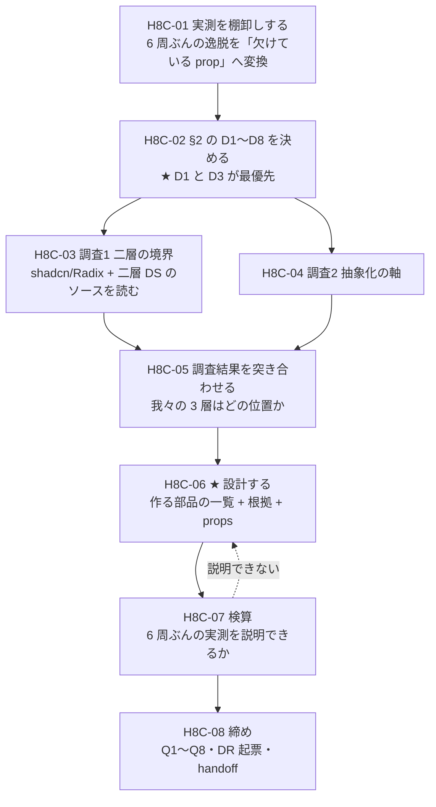

# 手8c — 製品層に何を作るべきかを調査して設計する

> 段取り上の位置づけ: [UI検証の位置づけと段取り.md](../UI検証の位置づけと段取り.md) §5（手8 と 手8b のあいだに挿す）
> 直前の手: [手8](手8_出力は機械ゲートを通るか.md)（done）／実測の記録先: [実行記録.md](../実行記録.md) §手8c

**この手は「作る手」ではなく「何を作るべきかを決める手」。**部品は 1 つも実装しない。

## この手が立った経緯

手7 D10 は選択肢 **B（素材層 16 件を製品層ラッパーで包む）**を「手8 の数字が出てから」として保留していた。
手8 で数字が出て、**逃げ道 4 面すべてで「欠けている prop / 部品」を名指しできた**（[実行記録 §手8](../実行記録.md)）。

🟥 **ただしユーザーの見立てで枠組みが変わった**（2026-08-02）:

> そもそも素材層のラッパーというか**必要な部品を製品層で作る**んだよね。
> 素材層を組み合わせるための**抽象的な製品層**を作ってくんじゃないかな。

→ **D10=B の「16 件をラッパーで包む」は、問題の立て方が下から過ぎた。**
包むかどうかではなく、**製品層にどんな部品が要るか**が問い。**この手はそれを決める。**

---

## 0. この手で答えを出す問い（観測項目）★最重要

| # | 問い | なぜ効くか（どの判断が変わるか） |
| --- | --- | --- |
| **Q1** | ★ **「素材層のまま出す」と「製品層で作る」の境界は、何で決まるか。**判定できる規則として書けるか | **この手の核心。**手3 D1=(c)（欠落品 ＋ 既定値ラッパー）は**作った動機**であって**判定規則ではない**。規則が無いと部品を足すたびに毎回ゼロから議論になる |
| **Q2** | ★ **製品層に足すべき部品は何か。**列挙して、それぞれに**足す根拠（実測の回数）**を付けられるか | 🟥 **「全部」は答えではない。**素材層 16 件のうち逸脱が出たのは **1 件だけ**（`SelectTrigger`）。**根拠の無い 15 件を包むのは仕組みを増やすだけ**（[2 回ルール](../../CLAUDE.md)） |
| **Q3** | ★ **逃げ道（`className` / ReactNode を受ける props）を持たない製品層は成立するか。**成熟した DS は逃げ道をどう扱っているか | [DR-0032](../DR/DR-0032-layout-primitives-take-props-not-classname.md)（枠は props で閉じる）は**我々が Layout 7 件で試しただけ**。🟥 **他所で成立しているのか、どこで破綻するのかを知らない** |
| **Q4** | **抽象化の軸は「役割 9 カテゴリ」でよいか。**他の DS は何で切っているか | [指摘 9](../共通コンポーネント思想への指摘.md)（分類の軸が 3 本あるのに器は 1 本）に効く。🟥 **思想はユーザーの持ち物なので、提案までで書き換えない** |
| **Q5** | **決めた設計は、6 周ぶんの実測を後から説明できるか**（検算） | 🟥 **説明できない設計は、次の周も同じ逸脱を出す。**[DR-0069](../DR/DR-0069-adding-prohibitions-to-the-header-degraded-the-output.md) の「予測した所は当たり、予測していない所が壊れた」を繰り返さない |
| **Q6** | **他人の型を公開 API にしたときの扱い**（`DataGrid.columns: ColumnDef<…>`） | 🆕 **手8 で出た角度。**逃げ道 ③ は我々が開けたのではなく、**TanStack の型をそのまま公開したことで一緒に公開された。**依存の型を再輸出するときの規則が要る |
| **Q7** | 🟨 **[思想への指摘](../共通コンポーネント思想への指摘.md)が 12 件目として出るか** | 現在 **11 件**。未決 #25 の判定材料。**手8c は「分類そのもの」を初めて外の DS と突き合わせる手** |
| **Q8** | **「対象 0 件で緑」の 16 例目が出るか** | 通算 **15 例**。🟥 **調査の手は「調べた気になる」形で空振りしやすい**——一次情報に当たれていないのに結論だけ書く |

> **Q1〜Q3 が本体。**Q4・Q6 は付随。Q5 は検算。Q7・Q8 は継続観測。
>
> 🟥 **Q1 は「規則として書けるか」まで含む。**「ケースバイケース」は答えではない。

---

## 1. 前提

- **直前の手**: [手8](手8_出力は機械ゲートを通るか.md) done
- **本手のブランチ**: `step/h8c-product-layer-design`
- **🟥 実装しない。**部品を 1 つも作らない。**成果物は設計と、その根拠**

### 手元にある実測（この手の入力・ここは動かさない）

**6 周ぶんの生成物**が `artifacts/h7/` 3 本 ＋ `artifacts/h8/` 3 本にある。
**逃げ道の 4 面**（[DR-0060](../DR/DR-0060-vocabulary-leaks-from-four-surfaces.md)）と、6 周目時点の状態:

| 面 | 実体 | 6 周目 | 欠けているもの（手8 で名指しした） |
| --- | --- | --- | --- |
| **①** | 素材層の `className` | `SelectTrigger class-name="w-field-md"` × 2 | `Select` の `width` prop |
| **②** | `Box` の `className` | 🟦 **0**（`Card` が使われた） | 🟨 **これは設計上の逃げ道そのもの**。欠けている prop ではない |
| **③** | `columns[].cell` の任意 JSX | 🟥 `tabular-nums` 2 ／ `font-emphasis` 1 | `DataGrid` の宣言的な列オプション |
| **④a** | `<style>` の document reset | 🟥 `html,body{margin:0}` | **document shell を誰も持っていない**（`AppShell` は自ら "page skeleton" と名乗る） |
| **④b** | `<style>` のリンク色 | 🟥 `a{color:var(--primary)}` | 🟥 **`Link` 部品が存在しない**（`src/index.ts` に無い） |

★ **語彙表の外に出ているのは 3 件で、全部 ③ から出ている。**①は正しい語彙を正しく使えており、残るのは「**props ではなく `className` 経由である**」という形だけ。

### 足す根拠の回数（Q2 の入力）

| 候補 | 実測での出現 | 2 回ルール |
| --- | --- | --- |
| `Select` の `width` | **3 回**（2 周目 `w-48` ／ 3・6 周目 `w-field-md` ／ 4・5 周目 `class=` で事故）——**毎回同じ場所** | 🟦 成立 |
| `DataGrid` の列オプション | **6 周中 6 回**。語彙表の外は常にここ | 🟦 成立 |
| `AppShell` の document shell ／ `Link` | **6 周中 4 回** `<style>` が出た | 🟦 成立 |
| 残る素材層 15 件のラッパー | 🟥 **0 回** | 🟥 **不成立** |

### 確定済みの前提（ここは決め直さない）

| 前提 | 出典 |
| --- | --- |
| 素材層と製品層の境界は **(c) 欠落品 ＋ 既定値ラッパー** | 手3 D1 |
| 画面は**製品層しか見ない**（repo の内側では維持） | 手3 D3=B・手4 D6=A |
| Layout プリミティブは **props で semantic 名だけ**受ける（`className` は `Box` のみ） | [DR-0032](../DR/DR-0032-layout-primitives-take-props-not-classname.md) |
| 部品分類の正本は[共通コンポーネント思想](../共通コンポーネント思想.md)。⚠ **ユーザーの持ち物。書き換えず、指摘は DR/OBS へ** | CLAUDE.md |
| 🟥 **禁止だけを足すと別の場所が壊れる** | [DR-0069](../DR/DR-0069-adding-prohibitions-to-the-header-degraded-the-output.md) |
| 🟦 **禁止に代替語彙を対で与えると守られる** | [DR-0063](../DR/DR-0063-forbidding-without-an-alternative-fails.md) |
| 仕組みは**必要性が 2 回証明されるまで作らない** | CLAUDE.md |

### 🟥 着手前に潰しておく不確定要素

| # | 不確定要素 | 潰し方 |
| --- | --- | --- |
| 1 | 🟥 **調査は「調べたいものを調べた」になりやすい。**対象を走りながら足すと、結論が対象選定に依存する | **D3 で対象を着手前に固定する。**足したくなったら §2 へ追記してから足す |
| 2 | 🟥 **二次情報で結論を書く危険。**本 repo は既に 1 度踏んでいる（[ClaudeDesignShadcnIntegration.md](../../ClaudeDesignShadcnIntegration.md) は 🟥 二次情報のまま手7 の前提になりかけた） | **D2 で一次情報の基準を決める。**記事は**必ず 🟥 二次情報と明記**し、結論の根拠にしない |
| 3 | 🟥 **設計フェーズが実装に滑る。**「ついでに直す」が始まると、何を決めたのかが残らない | **D6 で線を引く。**実装は次の手 |
| 4 | 🟨 **思想（ユーザーの持ち物）に触れる提案が出る**（Q4） | **D5 で扱いを決める。**既定は「[指摘集](../共通コンポーネント思想への指摘.md)に足す・思想は触らない」 |
| 5 | 🟨 **調査の分量に上限が無いと際限なく広がる** | **D8 で本数と深さの上限を決める** |

---

## 2. 着手前に決めること（判断ポイント）

> **戻しにくい決定はここに全部出す。**実行中に §2 に無い選択肢が出たら、**その場で決めずにここへ追記してから進む**
> （手1 D9/D10・手2 D9・手5 D7・手6 D8・手7 D8/D9/D10・手8 D9〜D14 で **8 度**機能した規律）。

| # | 論点 | 選択肢 | 決定 | 根拠 | 戻せるか |
| --- | --- | --- | --- | --- | --- |
| **D1** | ★ **最優先。調査の射程** | **A** 「素材層と製品層の境界」だけ（Q1・Q3）／ **B** ＋「抽象化の軸」（Q4）／ **C** ＋「依存の型を公開する扱い」（Q6）＝ Q1〜Q6 全部 | ✅ **C** | §2.1（推奨どおり） | 🟨 広げるのは後から可・狭めるのは不可 |
| **D2** | ★ **一次情報の基準** | **A** GitHub のソースと公式 docs のみ／ **B** ＋ 設計者本人の記事（Nathan Curtis 等）／ **C** ＋ 一般の技術記事 | ✅ **B** | §2.2（推奨どおり） | 🟦 戻せる |
| **D3** | ★ **調査対象の DS をどう選ぶか**（着手前に固定する） | **A** 我々の直系だけ（shadcn/ui・Radix）／ **B** ＋ 二層構造を明示している DS（MUI Base/Material・React Aria/Spectrum・Ark/Chakra）／ **C** ＋ 大手プロダクトの DS（Primer・Polaris・Carbon・Atlassian）／ **D** ユーザーが指定する | ✅ **C**（🟨 推奨は B） | D1=C で Q4 が射程に入り、**Q4 の実例（役割による分類）は大手群にしかない**。ユーザー指示（2026-08-02「詳細な調査から設計が重要です」）が広い側を支持 | 🟥 **走り出したら足さない**（不確定要素 #1） |
| **D4** | ★ **成果物の形** | **A** 調査文書 1 本（`docs/` 直下）／ **B** ＋ 設計文書 1 本（作る部品の一覧と API）／ **C** ＋ DR で決定を切り出す／ **D** ＋ ADR まで起案する | ✅ **C** | §2.4（推奨どおり） | 🟦 戻せる |
| **D5** | **思想への提案の扱い** | **A** [指摘集](../共通コンポーネント思想への指摘.md)に足すだけ（思想は触らない）／ **B** ＋ OBS に起票して棚卸しへ回す／ **C** 思想の改訂案を書く（🟥 **ユーザーの持ち物**） | ✅ **A** | §2.5（推奨どおり） | 🟦 戻せる |
| **D6** | **どこまでやったら「この手は終わり」か** | **A** 部品の一覧と足す根拠まで（API は次の手）／ **B** ＋ 各部品の props シグネチャまで／ **C** ＋ 1 部品だけ実装して確かめる | ✅ **B** | §2.6（推奨どおり） | 🟥 C を採ると「作らない手」でなくなる |
| **D7** | **手8b（preset 差し替え）・手9 との順序** | **A** 手8 → **手8c** → 手8b → 手9／ **B** 手8 → 手8b → 手8c → 手9／ **C** 手8b をやらない（[DR-0056](../DR/DR-0056-preset-swap-is-its-own-step.md) は「やらない」も結論と書いている） | ✅ **A** | §2.7（推奨どおり）。手8b の動機は手8c の後に測り直す | 🟦 戻せる |
| **D8** | **調査の上限** | **A** DS **4 本**・各 1 時間相当／ **B** DS **8 本**／ **C** 上限を決めず、Q1〜Q3 に答えが出たら止める | ✅ **B**（🟨 推奨は A） | D3=C に合わせて 8 本＝**直系 2 ＋ 二層 3 ＋ 大手 3**（Primer / Polaris / Carbon。Atlassian は落とす——役割分類の実例は 3 本で足りる） | 🟦 戻せる |

> ✅ **決着 2026-08-07。**ユーザーの指示「**詳細な調査から設計が重要です**」を受け、**推奨を基本に、調査の広さだけ広い側**を採った。
> 🟨 **推奨から変えたのは D3（B→C）と D8（A→B）の 2 件だけ**で、どちらも「広げる」方向（狭める方向の変更は無し）。
> 🟥 ユーザーとの個別確認は取っていない——**異議があれば D3/D8 は縮められる**（読んだ DS を捨てるだけで、狭める不可逆性は無い）。

### 2.1 D1 — 調査の射程

**推奨: C（Q1〜Q6 全部）。ただし §2.9 の 3 群に束ねて 1 度に調べる。**

- **A** は最小だが、🟥 **Q4（抽象化の軸）を外すと「何を作るか」の議論が役割 9 カテゴリに縛られる。**
  ユーザーの見立て（「抽象的な製品層」）は**軸そのものの話**なので、外すと問いに答えられない
- **C を推す理由は調査の経済性**。同じ DS のソースを読めば Q1・Q3・Q4・Q6 は**同じ読みで答えが出る**
  （手3 §2.5 が「同じ根から出ている問いを同じ調査で解く」で成功した形）
- 🟥 **広げるのは後から効くが、狭めるのは効かない**——1 本目を読み終えてから「Q4 も見ればよかった」となると読み直しになる

### 2.2 D2 — 一次情報の基準

**推奨: B（GitHub のソース ＋ 公式 docs ＋ 設計者本人の記事）。**

| 段 | 扱い |
| --- | --- |
| 🟦 **一次** | **GitHub のソースコード**（`.d.ts` / props の型 / 実装）。**これが最上位**——「何と書いてあるか」ではなく「何を受けるか」が分かる |
| 🟦 **一次に準ずる** | 公式 docs（API リファレンス・設計思想のページ） |
| 🟨 **二次だが値打ちがある** | **設計者本人が書いた記事**（例: Nathan Curtis の component API / layering 論）。🟥 **「本人か」を確認してから使う** |
| 🟥 **二次** | 一般の技術記事・まとめ。**背景の把握には使うが、結論の根拠にしない。使ったら 🟥 二次情報と明記する** |

🟥 **本 repo は一次情報を実測で置き換える規律を 6 回踏んでいる**（DR-0006・DR-0022・DR-0025・DR-0029・DR-0030・DR-0057）。
**「公式 docs にこう書いてある」で止めない。**props の型を読む。

### 2.3 D3 — 調査対象の DS

**推奨: B（直系 ＋ 二層構造を明示している DS）。**

| 群 | 候補 | なぜ見るか |
| --- | --- | --- |
| **直系**（必須） | **shadcn/ui** / **Radix Primitives** | 🟥 **我々の素材層そのもの。**「素材層が `className` しか受けない」のは我々の設計ではなく**上流の設計**。まずそこを読む |
| **二層構造を明示している** | **MUI（Base UI ↔ Material）** / **React Aria ↔ React Spectrum**（Adobe）/ **Ark UI ↔ Chakra** | ★ **我々の「素材層 ↔ 製品層」と同じ構造を、他所がどう定義しているか。**Q1 の直接の材料 |
| **大手プロダクトの DS** | Primer（GitHub）/ Polaris（Shopify）/ Carbon（IBM）/ Atlassian | 🟨 **役割による分類の実例**（Q4）と、**逃げ道の扱い**（Q3）。C を採るなら |

🟥 **走り出したら足さない。**足したくなったら §2 へ追記してから。

### 2.4 D4 — 成果物の形

**推奨: C（調査文書 ＋ 設計文書 ＋ DR）。**

- 🟦 **調査と設計を別ファイルに分ける**——本 repo の責務分離（調査＝事実、設計＝判断）。
  手3 の調査 3 本（[デザイントークン設計](../デザイントークン設計.md)ほか）が同じ形で機能した
- 🟥 **D（ADR まで）は採らない。**[未決 #20](../handoff.md) で **ADR 昇格候補が 7 件溜まっている**うえ、
  🟥 **うち 3 件は finding 由来で「決定を 1 本書く工程」が先に要る**と判定済み。**ここで 8 件目を足さない**
- 🔺 **ADR 昇格の判定はする**（起案はしない）——判定と起案を分ける規律

### 2.5 D5 — 思想への提案の扱い

**推奨: A（指摘集に足すだけ）。**

⚠ [共通コンポーネント思想.md](../共通コンポーネント思想.md) は**ユーザーの持ち物**（CLAUDE.md）。
🟥 **Q4 は「軸を変えるべきか」に踏み込むので、提案が出るのはほぼ確実。**
**出たら指摘 12 件目として[指摘集](../共通コンポーネント思想への指摘.md)へ。改訂案は書かない。**

### 2.6 D6 — この手の終わり

**推奨: B（部品の一覧 ＋ props シグネチャまで）。**

- **A**（一覧だけ）だと、🟥 **次の手が「で、どういう API にする?」からやり直しになる。**
  手8 で分かったのは「**props の形そのものが答え**」（`width="md"` なら綴り事故が起きえない）なので、
  **API まで決めないと Q3 に答えたことにならない**
- 🟥 **C（1 部品だけ実装）は採らない。**「作らない手」でなくなり、
  **実装が始まると設計の記録が実装に上書きされる**（本 repo が文書の責務分離で避けてきた形）

### 2.7 D7 — 手8b・手9 との順序

**推奨: A（手8 → 手8c → 手8b → 手9）。**

- 🟦 **手8c は手9（移送）の入力**——**何を移送するか**が変わる
- 🟨 **手8b（preset 差し替え）は独立**（[DR-0056](../DR/DR-0056-preset-swap-is-its-own-step.md)）。
  🟥 **ただし手8c が preset の選択に影響する可能性がある**——製品層で包む範囲が広がるほど preset の重みは下がる。
  **手8c の後に手8b の動機を測り直すと、「やらない」が結論になる目が上がる**

### 2.8 D8 — 調査の上限

**推奨: A（DS 4 本）。**直系 2 ＋ 二層構造 2。🟥 **足りなければ §2 へ追記して足す。**

### 2.9 調査ブロック — 3 群に束ねる（手3 §2.5 と同じ形）

> **同じ根から出ている問いを、同じ調査で解く。**バラバラに調べると同じソースを 3 回読むことになる。

| 群 | 束ねる Q | 共通の根 | 成果物（予定） |
| --- | --- | --- | --- |
| **調査1 二層の境界** | **Q1** / Q3 | 「**素材層はどこまでを担い、製品層は何を足すのか**」。逃げ道（`className`）の扱いは境界の定義から従属的に決まる——**上流が `className` を開けているのは、上流が「見た目を決めない層」だから** | `docs/二層構造の設計.md` |
| **調査2 抽象化の軸** | Q4 / Q7 | 「**部品を何で分類し、何で抽象化するか**」。役割 9 カテゴリは**分類**の軸だが、ユーザーが言う「抽象的な製品層」は**合成**の軸かもしれない。**分類と合成は別の軸**という仮説を確かめる | `docs/製品層の抽象化の軸.md` |
| **調査3 公開 API と依存の型** | Q6 | 「**依存パッケージの型を再輸出すると何が公開されるか**」。`DataGrid.columns: ColumnDef<…>` は TanStack の型で、**`cell` の逃げ道も一緒に公開された**。他所は依存の型をどう包むか | 調査1 に含めてよい（分量次第で分ける） |

🟨 **これは「選択肢を並べる前に調査を挟む」工程の 2 回目**（1 回目は手3 §2.5）。
🔺 **手3 の申し送りは「2 回目が来たら手順書テンプレートに §2.5 として足す候補」と書いている。**
🟥 **ただし形が違う**——手3 は「手の中の 1 ブロック」、手8c は「手そのもの」。**同じ需要と数えるかはユーザー判断。**

---

## 3. 成果物

- `docs/二層構造の設計.md` — **調査1**（事実。設計判断は書かない）
- `docs/製品層の抽象化の軸.md` — **調査2**（同上）
- ★ `docs/製品層の部品設計.md` — **設計**（作る部品の一覧 ＋ 足す根拠 ＋ props シグネチャ）
- `docs/実行記録.md` に **§手8c** の節
- **DR が最低 3 件**の見込み: ①「素材層と製品層の境界の判定規則」②「逃げ道を持たない製品層は成立するか」③「依存の型を公開 API にする扱い」
- 🟨 [指摘集](../共通コンポーネント思想への指摘.md)に 12 件目（Q4 で出たら）
- 🔺 ADR 昇格候補の**判定**（起案はしない）

🟥 **部品のコードは 1 行も増えない。**

## 4. 作業フロー

## 5. 手順

### H8C-01 実測を棚卸しする

- **目的**: **調査の前に、答えるべき具体を確定させる。**調査から入ると「一般論として正しい設計」を持ち帰ってしまう
- **実行**: 6 周ぶんの生成物（`artifacts/h7/` 3 ＋ `artifacts/h8/` 3）から、**逸脱を「欠けている prop / 部品」へ変換した表**を作る。§1 の表が下書き
- **期待結果**: 「足すべきものの候補」が**根拠の回数つき**で並ぶ
- **検証**: 🟥 **回数が 0 の候補を混ぜない。**素材層 15 件は 0 回
- **観測**: Q2 の入力
- **判断**: なし
- **詰まったら**: 「どの面にも入らない逸脱」が出たら [DR-0060](../DR/DR-0060-vocabulary-leaks-from-four-surfaces.md) の 4 面が足りないということ。**面を 5 つ目に増やす**

### H8C-02 §2 の D1〜D8 を決める

- **目的**: **測定条件と射程を確定させる**
- **実行**: 推奨と根拠を出し、ユーザーが決める
- **期待結果**: §2 の「決定」欄が全部埋まる
- **検証**: 🟥 **D3（調査対象）を決めずに H8C-03 へ進まない**——走りながら足すと結論が対象選定に依存する
- **観測**: なし（測定設計）
- **判断**: D1〜D8 すべて
- **詰まったら**: 迷ったら **D1=C**（広い方）。狭めるのは後から効かない

### H8C-03 調査1 — 二層の境界

- **目的**: ★ **Q1・Q3・Q6 に答える**
- **実行**: D3 で決めた DS について、**GitHub のソースで**次を読む（記事ではなく型）
  - 素材層に相当する層は **`className` を受けるか**。受けるなら**なぜ**（docs に理由が書かれているか）
  - 製品層に相当する層は **`className` を閉じているか**。閉じているなら**逃げ道は何か**
  - **依存の型を再輸出しているか**（`ColumnDef` のような形）。包んでいるならどう包むか
  - 二層の**命名**（Base / Primitive / Headless / Styled / Composed …）と、境界の**定義文**
- **期待結果**: DS ごとに 1 行の比較表 ＋ 引用（**URL と取得日つき**）
- **検証**: 🟥 **各行に「ソースのどこを見たか」が付いていること。**付いていない行は**まだ調べていない**
- **観測**: **Q1・Q3・Q6**
- **判断**: なし（事実収集。判断は §2 へ戻す）
- **詰まったら**: 二層構造が無い DS に当たったら、**それも観測結果**（「二層に分けない設計もある」）

### H8C-04 調査2 — 抽象化の軸

- **目的**: **Q4 に答える**
- **実行**: 同じ DS について、**部品が何で分類・抽象化されているか**を読む
  - 分類の軸（役割 / 粒度 / ドメイン / 何も無い）
  - **合成の仕組み**（slot / compound component / render prop / recipe / asChild …）
  - 🟥 **仮説を 1 つ持って読む**——「**分類の軸**と**合成の軸**は別物ではないか」
- **期待結果**: 軸の比較表。我々の役割 9 カテゴリがどこに位置するか
- **検証**: 🟥 **「我々のほうが優れている / 劣っている」を書かない。**位置づけだけ
- **観測**: **Q4・Q7**
- **判断**: D5（思想への提案が出たら）
- **詰まったら**: 軸が読み取れなければ「**明示していない**」が答え

### H8C-05 調査結果を突き合わせる

- **目的**: **我々の 3 層が外から見てどの位置にあるかを確定させる**
- **実行**: 調査1・2 の表を 1 枚にまとめ、**我々を同じ行に並べる**
- **期待結果**: 「我々の素材層＝○○に相当」「製品層＝○○に相当」が言える
- **検証**: 🟥 **相当するものが無ければ「無い」と書く。**無理に対応させない
- **観測**: Q1・Q4
- **判断**: なし
- **詰まったら**: 対応が付かないのは**我々の分け方が特殊**か**まだ読めていない**か。**切り分けて書く**

### H8C-06 ★ 設計する

- **目的**: ★ **Q1・Q2 に答える。**この手の本体
- **実行**: `docs/製品層の部品設計.md` に次を書く
  1. **判定規則**（Q1）——「素材層のまま出す／製品層で作る」を**判定できる形**で。🟥 「ケースバイケース」は不可
  2. **作る部品の一覧**（Q2）——各行に **足す根拠（実測の回数）** と **判定規則のどれに当たるか**
  3. **props シグネチャ**（D6=B）——🟥 **`className` を受けるかどうかを各部品で明示する**
  4. **逃げ道の扱い**（Q3）——残す逃げ道と、その**監視方法**（`Box` は 6 手連続 0 回）
- **期待結果**: 次の手がそのまま実装に入れる設計
- **検証**: 🟥 **根拠が 0 回の部品が一覧に入っていないこと**（2 回ルール）
- **観測**: **Q1・Q2・Q3・Q6**
- **判断**: 実装しないこと（D6）。**書きたくなったら次の手へ**
- **詰まったら**: 判定規則が書けないなら、**調査が足りない**か**規則にならない性質**か。**後者なら「規則にならない」と書いて根拠を示す**

### H8C-07 検算 — 6 周ぶんの実測を説明できるか

- **目的**: ★ **Q5 に答える。**[DR-0069](../DR/DR-0069-adding-prohibitions-to-the-header-degraded-the-output.md) の再発を防ぐ
- **実行**: **決めた設計を 6 周ぶんの生成物に当てて、逸脱が消えるかを机上で確かめる**
  - 面 ① `class-name="w-field-md"` → `width="md"` になるか
  - 面 ③ `tabular-nums` / `font-emphasis` → 列オプションで書けるか
  - 面 ④ `<style>` → `AppShell` と `Link` で書けるか
  - 🟥 **説明できない逸脱が 1 件でも残ったら、それを一覧に足すか「残す」と明記する**
- **期待結果**: 6 周ぶんの逸脱が**全件、設計のどこかに対応づく**
- **検証**: 🟥 **「たぶん消える」で通さない。**書き換え後の形を実際に書いてみる
- **観測**: **Q5**
- **判断**: 対応づかないものが出たら H8C-06 へ戻る
- **詰まったら**: 机上で消えても**実際に消えるかは次の手**。**ここで「消える」と断定しない**

### H8C-08 締め

- **目的**: 答えを固定する
- **実行**: 実行記録 §手8c ・DR 起票・[handoff.md](../handoff.md) 更新・機械ゲート 6 本
- **期待結果**: §6 の完了条件が全部埋まる
- **検証**: 🟥 **チェックを付ける前に検証する**（手6・手7・手8 で守った規律）
- **観測**: Q7（指摘 12 件目）・Q8（対象 0 件で緑 16 例目）
- **判断**: 手8b をやるかどうかの動機が変わったか（D7 §2.7）
- **詰まったら**: 答えが割れたら**割れたまま記録する。**「全部」は答えではない

## 6. 完了条件

- [x] 機械ゲート 6 本 ＋ `docs-meta --check` を回し、**新しい赤がゼロ**（2026-08-07。🟨 spell に固有名詞 2 語＝`Segun` / `Adebayo` が出て辞書へ——人名は辞書に足す先例どおり。docs-meta は ERROR 0）
- [x] §0 の Q1〜Q8 すべてに答えが出ている（[実行記録 §手8c の締め](../実行記録.md)）
- [x] §2 の D1〜D8 がすべて決着し、根拠が書かれている（2026-08-07）
- [x] **調査の各行に一次情報の出典が付いている**（[二層構造の設計](../二層構造の設計.md)・[製品層の抽象化の軸](../製品層の抽象化の軸.md)。🟥 取得日はエージェント指示の誤りで一部 08-02 表記——実フェッチは全件 08-07・両文書冒頭に注記）
- [x] **一覧の各部品に「足す根拠の回数」が付いている**（0 回の部品なし。素材層 15 件は棄却）
- [x] **検算で 6 周ぶんの逸脱が全件対応づいた**（「残す」は accessor の ReactNode と素材層 16 件の className の 2 つ）
- [x] **部品のコードは 1 行も増えていない**（`git diff --stat 1025936..HEAD -- src/` = 0 行）
- [x] 実行記録に §手8c の節が追加されている
- [x] [handoff.md](../handoff.md) の現在地・進捗ボードが更新されている
- [x] コミット済み（`<type>(H8c): 要約 [手8c]`）
- [x] `main` への PR を**人に提案**した（[DR-0068](../DR/DR-0068-merge-through-pull-requests.md)。マージは人が実行）

## 7. 出典

- [実行記録.md](../実行記録.md) §手8 — 逃げ道 4 面の 6 周ぶんの実測（この手の入力）
- [DR-0060](../DR/DR-0060-vocabulary-leaks-from-four-surfaces.md) — 逸脱は 4 面から出る
- [DR-0032](../DR/DR-0032-layout-primitives-take-props-not-classname.md) — 枠は props で閉じる（我々の側の先行決定）
- [DR-0063](../DR/DR-0063-forbidding-without-an-alternative-fails.md) — 禁止と代替の対
- [DR-0069](../DR/DR-0069-adding-prohibitions-to-the-header-degraded-the-output.md) — 🟥 **禁止だけを足すと別の場所が壊れる**（この手が「足すもの」を設計する理由）
- [DR-0066](../DR/DR-0066-neither-side-lints-the-generated-output.md) — 機械では検出できない＝**設計で防ぐしかない**
- [共通コンポーネント思想.md](../共通コンポーネント思想.md) — ⚠ ユーザーの持ち物
- 手3 §2.5 の調査 3 本（[デザイントークン設計](../デザイントークン設計.md) ／ [状態とProviderの置き場](../状態とProviderの置き場.md) ／ [タッチターゲットとサイズ密度](../タッチターゲットとサイズ密度.md)）— **調査の書き方の先行例**
- ✅ 調査対象 DS 8 本の URL と取得日は [二層構造の設計.md](../二層構造の設計.md) と[製品層の抽象化の軸.md](../製品層の抽象化の軸.md) に全行付きで記載（実フェッチ 2026-08-07）
