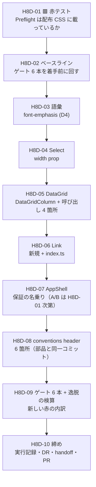

# 手8d — 製品層の部品を実装する

> 段取り上の位置づけ: [UI検証の位置づけと段取り.md](../UI検証の位置づけと段取り.md) §5（手8c と 手8b のあいだ）
> 直前の手: [手8c](手8c_製品層に何を作るべきかの調査設計.md)（done・**PR #3 がマージされた＝設計確定の印**）
> 実測の記録先: [実行記録.md](../実行記録.md) §手8d
> **設計の正本**: [製品層の部品設計.md](../製品層の部品設計.md)（この手は設計を決め直さない。**変えたくなったら §2 へ追記してから変える**）

**この手は「何を作るか」を決める手ではない。**それは手8c が終えた。
**この手は決まった設計をコードにし、機械ゲートまで通す手。**
🟥 **逸脱が実際に消えるかは測らない**——それは再同期と生成が要る **7 周目**（次の手）。

## この手が立った経緯

手8c の締めで、実装の割り当てが**未決のまま残った**（[handoff §次にやること 0-2](../handoff.md)）:

> **設計の実装をどの手に割り当てるか**——新しい手（手8d）か、手9 の一部か。

その後 **PR #3 がマージされた**（`9801b66`）。ユーザー指示「**設計そのものが終わったらマージします**」により、
**[製品層の部品設計.md](../製品層の部品設計.md) は確定した設計**として扱ってよい状態になった。
→ 本書は **A（新しい手 手8d）を前提に書いた提案**。割り当て自体は **D1** でユーザーが決める。

---

## 0. この手で答えを出す問い（観測項目）★最重要

| # | 問い | なぜ効くか（どの判断が変わるか） |
| --- | --- | --- |
| **Q1** | 🟥 ★ **配布 CSS に Tailwind Preflight は載っているか**（`*` に `margin:0` を当てる規則が境界を越えているか） | **手8c が実装より先に打てと書いた唯一の赤テスト**（[設計 §3.3](../製品層の部品設計.md)）。🟦 載っていれば器は **A（配布 CSS の base レイヤ）**で確定し、AppShell は**宣言だけ**。🟥 載っていなければ器は **B（`AppProviders`）へ倒れ、実装内容が変わる** |
| **Q2** | ★ **設計はそのまま実装できたか。**§2 への追記は何件出たか | 手8c は D6=B で「次の手がこのまま実装に入れる形」を目指した。**追記の件数が設計の解像度の実測**（0 件なら「props シグネチャまで書く」が正しい粒度だったことの 1 例目） |
| **Q3** | ★ **`ColumnDef` を公開 API から消すと、呼び出し側は何行変わるか。**我々自身の逸脱は消えるか | 🟥 **`src/app/page.tsx` が生成物と同じ書き方をしている**（cell に `font-mono tabular-nums`・実測 2026-08-07）。設計が効くなら**自分のコードから先に消える**。消えないなら設計の穴 |
| **Q4** | **機械ゲート 6 本に新しい赤が出るか。**出るならどこか | ベースラインは lint error 33 / warning 1・他 5 本は緑。🟨 とくに typecheck は `exactOptionalPropertyTypes: false` の借金（DR-0014）の上に立っている |
| **Q5** | 🟦 **素材層の diff は 0 行のままか**（8 回連続になるか）。`Select` をラッパー化しても `ui/select.tsx` を触らずに済むか | 手2b 以来 **7 回連続 0 行**。🟥 **ラッパー化は素材層に最も近い変更**なので、破れるならここ |
| **Q6** | **`Box` への逃げは 0 回のままか**（[未決 #21](../handoff.md)） | 手3〜手8 で **6 手連続 0 回**。新 API を足した直後に増えるなら、語彙の設計に穴がある |
| **Q7** | **「対象 0 件で緑」の 16 例目が出るか** | 通算 **15 例**。🟥 **今回は grep の赤テストが 2 本ある**（Q1 と 逸脱の検算）——検査自体が対象 0 件になる形を[手7 着手時に 1 度踏んでいる](../handoff.md) |
| **Q8** | 🟨 **[思想への指摘](../共通コンポーネント思想への指摘.md)が 13 件目として出るか** | 現在 **12 件**。[未決 #25](../handoff.md) の判定材料。**手8d は「設計を初めてコードに落とす」手**なので、分類ではなく**実装可能性**の側から出る可能性がある |

> **Q1〜Q3 が本体。**Q4・Q5 は退行検査。Q6〜Q8 は継続観測。
>
> 🟥 **この手では「逸脱が消えたか」を測らない。**測れるのは実装 → 再同期 → 生成の **7 周目**（次の手）。
> ここで測れるのは「**我々のコードから逸脱が消えたか**」（Q3）だけ。**混ぜて書かない。**

---

## 1. 前提

- **直前の手**: [手8c](手8c_製品層に何を作るべきかの調査設計.md) done（**PR #3 マージ済み＝設計確定**）
- **入力**: [製品層の部品設計.md](../製品層の部品設計.md) —— §2 作る一覧／§2.5 全部品の API 方針／§3 props シグネチャ／§6 検算／§7 語彙／§8 合成方針
- **ブランチ**: 現ワークスペースの作業ブランチ（Conductor）。完了したら `gh pr create --base main`。🟥 **マージは人**（[DR-0068](../DR/DR-0068-merge-through-pull-requests.md)）
- **🟥 設計を決め直さない。**設計に穴が見つかったら **§2 へ追記してから**変える（手1〜手8c で **9 度**機能した規律）

### 実装対象の現況（着手前の実測・2026-08-07）

| 対象 | 現況 | 効くこと |
| --- | --- | --- |
| `src/components/Selection/Select.tsx` | **4 行の `export *` 素通し** | ラッパー化には `export *` を割る必要がある → **D3** |
| `src/components/DataDisplay/DataGrid.tsx` | 107 行。🟦 **セル既定 `text-table` ／ ヘッダ既定 `text-label` は既に当たっている**（L86・L100） | 設計 §3.2 の「基本 typography は部品の既定」は**半分実装済み**。足すのは `kind` / `emphasis` の 2 語 |
| `ColumnDef` の呼び出し側 | **4 箇所**——`src/app/page.tsx` ／ story 3 本（DataGrid・ListDetail・AppShell）。🟦 `patterns/ListDetail.tsx` は columns を持たない | **D5** の移行コスト。素通しは 1 段だけ |
| 🟥 `src/app/page.tsx` L57 / L74 | **我々自身が cell に `font-mono` / `font-mono tabular-nums` を書いている** | **Q3 の検体。**生成物の面③と**同じ逸脱**。🟨 `font-mono` は設計 §3.2 の `kind:'numeric'`（tabular-nums のみ）に含まれていない → **H8D-05 の判断** |
| `src/templates/AppShell.tsx` | 72 行。🟦 **CSS を 1 行も持たない**。L43 が `text-emphasis font-emphasis` を使用 | 設計 §3.3（props 不変・CSS 0 行）と §7（語彙の宣言漏れ）の**現物** |
| `font-emphasis` の使用 | 製品層 **2 件**——`Section.tsx` L23 は **`text-heading font-emphasis`**、`AppShell.tsx` L43 は `text-emphasis font-emphasis`（＋ story 多数） | **D4 の判断材料。**サイズと weight は**直交して使われている** |
| `Link` | **存在しない**（`src/components/Navigation/` は Pagination・Sidebar のみ） | 新規作成。`src/index.ts` への export も要る |
| `.design-sync/` | **`conventions.md` / `config.json` / `NOTES.md` の 3 本だけ**。🟥 `_ds_bundle.css` は手元に無い（生成物は gitignore・[DR-0040](../DR/DR-0040-frame-leaks-when-a-layer-is-added.md) の対処で除外） | 🟥 **Q1 を本物の bundle では打てない** → **D6** |
| `conventions.md` | 131 行。**L53 が `className="w-field-md"` を教え**、**L86 が `TanStack ColumnDef[]` を名指し**している | 設計 #6 の対更新 2 箇所は**行番号まで一致**（設計の記述が現物と合っていることの確認） |

### 確定済みの前提（ここは決め直さない）

| 前提 | 出典 |
| --- | --- |
| 境界は「見た目の管轄権」。判定は ①2 回 → ②語彙で表せるか → ③誰の責務か | [DR-0070](../DR/DR-0070-product-layer-boundary-rule.md) |
| 依存パッケージの型を公開 API に素通ししない | [DR-0072](../DR/DR-0072-no-passthrough-of-dependency-types.md) |
| 逃げ道は `Box` の `className` 1 本＋素材層 16 件の素通し。**ゼロにしない** | 設計 §4・[DR-0032](../DR/DR-0032-layout-primitives-take-props-not-classname.md) |
| 製品層の自作部品は「閉じた単一部品 ＋ union props」。compound を新設しない | 設計 §8 |
| 🟥 **禁止だけを足すと別の場所が壊れる**／🟦 **代替語彙と対にすると守られる** | [DR-0069](../DR/DR-0069-adding-prohibitions-to-the-header-degraded-the-output.md)・[DR-0063](../DR/DR-0063-forbidding-without-an-alternative-fails.md) |
| 素材層（`src/components/ui/**`）は触らない | 手3 D1=(c)・7 回連続 0 行 |
| 思想（`共通コンポーネント思想.md`）は**ユーザーの持ち物**。指摘は DR/OBS へ | CLAUDE.md |

### 🟥 着手前に潰しておく不確定要素

| # | 不確定要素 | 潰し方 |
| --- | --- | --- |
| 1 | 🟥 **器 A の前提が未検証のまま実装に入る。**外れたら AppShell の実装が丸ごと変わる | **H8D-01 を最初に置く**（設計 §3.3 の指示）。**D6 で検体を決めてから打つ** |
| 2 | 🟥 **「実装しながら設計を直す」に滑る。**手8c が 1 週間かけて確定させたものが、実装の都合で静かに書き換わる | **設計の変更は §2 への追記が先**（Q2 で件数を数える）。追記なしの変更を見つけたら差し戻す |
| 3 | 🟥 **header を変えると、狙っていない所が壊れる**（[DR-0069](../DR/DR-0069-adding-prohibitions-to-the-header-degraded-the-output.md) で実測済み） | **D8 で変更範囲を確定**し、**変更点を実行記録に列挙して 7 周目の予測と対にする**。禁止文は足さない |
| 4 | 🟨 **grep の赤テストが「対象 0 件で緑」になる**（通算 15 例・手7 では検査装置自体が空振りした） | **当たる文字列と当たらない文字列を対で打つ**（H8D-01・H8D-09） |
| 5 | 🟨 **新 API の story が無いと、7 周目で使われようがない**——カードの数を決めるのは export ではなく story（手6 実測） | **D7 で story の範囲を決める** |

---

## 2. 着手前に決めること（判断ポイント）

> **戻しにくい決定はここに全部出す。**実行中に §2 に無い選択肢が出たら、**その場で決めずにここへ追記してから進む。**

| # | 論点 | 選択肢 | 推奨 | 決定 | 戻せるか |
| --- | --- | --- | --- | --- | --- |
| **D1** | ★ **この実装をどの手に割り当てるか**（[handoff 0-2](../handoff.md) の未決） | **A** 新しい手 **手8d**（本書）／ **B** 手9 の一部／ **C** 手8b を先に挟む | **A** | ✅ **A**（ユーザー判断） | 🟦 戻せる（B なら本書を手9 手順書の §へ畳む） |
| **D2** | ★ **実装の範囲** | **A** 設計の全量（部品 4 ＋ 語彙 1 ＋ 散文 3）／ **B** Q1 の結果に依存する AppShell を外した 3 件／ **C** 1 件ずつ別 PR | **A** | ✅ **A**（推奨どおり） | 🟦 戻せる |
| **D3** | ★ **`Select` のラッパー化の形** | **A** `export *` を明示列挙に割り、`SelectTrigger` だけ自前／ **B** 全パーツを rename import して包む／ **C** `SelectTrigger` を別名で出す | **A** | ✅ **A**（推奨どおり） | 🟨 A→B は後から可 |
| **D4** | ★ **`font-emphasis` の扱い**（設計 §7 が実装判断として残した） | **A** 語彙表に `font-emphasis` を足す／ **B** `text-emphasis` に weight を畳んで utility 1 本にする | **A** | ✅ **A**（推奨どおり・§2.4 の実測が B を否定） | 🟥 B は見た目が変わる（不可逆に近い） |
| **D5** | ★ **`DataGrid` の移行方式** | **A** `DataGridColumn` へ一括置換（`ColumnDef` を公開 API から消す）／ **B** union で両対応／ **C** 新 API を足して旧を deprecated | **A** | ✅ **A**（推奨どおり） | 🟨 A→B は後から可 |
| **D6** | ★ **Q1（赤テスト）の検体** | **A** ローカルの `storybook build` 出力 CSS を**代理検体**にする／ **B** ユーザーが `/design-sync` を打ち、本物の `_ds_bundle.css` で打つ／ **C** 7 周目まで待つ | **A**（＋7 周目で本物を再確認） | ✅ **A**（ユーザー判断） | 🟦 戻せる |
| **D7** | **story の更新範囲** | **A** 変更した部品の story を直すだけ／ **B** ＋ 新 API の story を足す（`Select width` ／ `DataGrid kind`・`emphasis` ／ `Link`）／ **C** ＋ ★ Review に目視観点を足す | **B** | ✅ **B**（推奨どおり） | 🟦 戻せる |
| **D8** | **conventions header の更新範囲** | **A** 設計 #6 の 3 箇所（L53・L86・reset 1 文）／ **B** ＋ 語彙表に `font-emphasis`／ **C** ＋ semantic 色は `StatusPill` 経由のみと明記／ **D** ＋ `Link` を部品表に載せる | **A+B+C+D**（＝設計 §7・§2 の全量） | ✅ **A+B+C+D**（ユーザー判断） | 🟥 出力が変わる（DR-0069） |
| **D9** | **7 周目（再同期 → 生成）をこの手に含めるか** | **A** 含めない（この手はゲートまで）／ **B** 含める | **A** | ✅ **A**（推奨どおり） | 🟦 戻せる |

> ✅ **決着 2026-08-07。**ユーザー判断は **D1 / D6 / D8** の 3 件（いずれも推奨どおり）。
> 残り 6 件は「推奨から動かす理由が見当たらない」として推奨で確定させた。**推奨と異なる決定は 0 件。**

### 2.10 実行中に出た選択肢（🆕 §2 へ追記してから進んだ・Q2 の実測）

| # | 論点 | 選択肢 | 決定 | 根拠 |
| --- | --- | --- | --- | --- |
| **D10** | 🟥 **`kind: 'numeric'` に `font-mono` を含めるか**（H8D-05 の判断） | **(a)** `tabular-nums` だけ当てる（設計 §3.2 の字面どおり）／ **(b)** `font-mono tabular-nums` を当てる | ✅ **(b)** | ① **現物が font-mono を使っている**（`page.tsx` L57・L74）。(a) だと ID・日時の等幅が**消える＝見た目の退行**で、D4 と同じ理由（手5 の目視をやり直す羽目になる）で採れない ② tmp-admin §4.4 は「**密データは等幅で**」としか書いておらず、font-mono と tabular-nums を区別していない ③ **部品の内部に閉じる**ので利用側の語彙は増えない（呼び出し側は `kind:'numeric'` としか書けない） |
| **D11** | **`Link` の下線オフセットをどうするか** | **(a)** shadcn の `link` variant に揃えて `underline-offset-4` を使う／ **(b)** オフセットを当てない（`hover:underline` だけ） | ✅ **(b)** | 🟥 **`underline-offset-4` は数値の段（primitive）だが、lint の `NUMERIC_STEP` 正規表現に `underline-offset` が入っていないので通ってしまう**（実測）。**緑だから正しいわけではない**（CLAUDE.md「緑を信用しない」）。語彙が要ると分かったら実測 2 回目で足す（規則①）。🟨 **lint の射程の穴として実行記録に残す** |
| **D12** | 🟥 **`Select` の棚と層タグをどうするか**（`SelectTrigger` だけがラッパーになった） | **(a)** 素材層の棚に残し `vendor` のまま／ **(b)** `② 製品層・ラッパー` へ移して `wrapped` にする／ **(c)** 棚は素材層に残し、タグを **`vendor` ＋ `wrapped` の 2 つ**にする | ✅ **(c)** | 🟥 **どちらか一方が嘘になる。**10 パーツ中 9 つは素材のまま（(b) は嘘）で、1 つは製品層が見た目を決めている（(a) も嘘）。→ **タグを 2 つ付けて実態どおりにし、[思想への指摘 13 件目](../共通コンポーネント思想への指摘.md)として起票する**（層タグは**部品単位**でしか付けられないが、**昇格はパーツ単位で起きた**）。🟨 棚を動かさないのは、`group` は役割フォルダ由来で棚の第 1 階層に依らないため（手6 Q5） |

### 2.1 D1 — この実装をどの手に割り当てるか

**推奨: A（新しい手 手8d）。**

- **手9 は「移送」の手**——PoC へコードを運ぶ工程で、🟥 **実行するのは人**（PoC は `apps/**` `packages/**` への Claude の編集を hook で止めている・[DR-0001](../DR/DR-0001-design-repo-role.md)）。
  **実行者が違う工程を同じ手に入れると、完了条件が人の操作に依存する**（手6 で `/design-sync` が Claude から起動できず、手の途中で止まった形の再演）
- 設計 §6.2 が「**実装 → 再同期 → 7 周目**で検算を実測に変える」と書いており、**手9 の前に 1 周挟まる**ことが確定している。手9 に畳むとこの周が手9 の中に入り込む
- 🟨 **B を採る理由があるとすれば**「手を増やしすぎない」。ただし手8c 自体が手8 と手8b のあいだに挿した枝番なので、**枝番を増やすコストは既に払っている**

### 2.2 D2 — 実装の範囲

**推奨: A（設計の全量）。**

- 設計は **PR #3 のマージで確定済み**で、**未決 0 件**（設計 §2.5 が全 33 部品に方針を一巡させ、29 件は「維持」と明示的に決めてある）。**分割する理由が無い**
- **C（1 件ずつ別 PR）は規律違反になる**——設計 #6 は「**部品と散文を同一コミットで変える**」と決めている。C だと conventions header が 4 回に分かれて動き、🟥 **どの header の版でどの出力が出たかが 7 周目で追えなくなる**
- 🟨 **B は Q1 が外れた場合の保険**だが、外れても AppShell の変更は「**コメント 1 箇所 ＋ header 1 文**」から「**`AppProviders` に器を持たせる**」へ変わるだけで、他の 3 件とは独立している。**Q1 の結果を見てから H8D-07 の中身を決めれば足りる**

### 2.3 D3 — `Select` のラッパー化の形

**推奨: A（`export *` を明示列挙に割り、`SelectTrigger` だけ自前）。**

現況は 4 行の `export * from '@/components/ui/select'`。ラッパーを同名で定義すると `export *` と衝突するので、**形を選ぶ必要がある**:

- **A** — `export { Select, SelectContent, SelectItem, … } from '@/components/ui/select'` と列挙し、`SelectTrigger` だけ自前で定義して export。
  🟦 設計 §2.5 が「**`SelectTrigger` のみ**」と限定しているのと 1:1。🟨 上流が部品を増やしたら列挙を足す手間が出るが、**それは「窓口を 1 本にする」設計の当然の帰結**（手3 D2=A）
- **B**（全パーツを包む）— 🟥 **0/6 周の予防的ラッパー**そのもの。規則①で棄却済み（設計 §2「作らないもの」）
- **C**（別名で出す）— 🟥 **閉じない。**上流の `SelectTrigger` が `export *` 経由で生きているので、design agent は `className` を使える。[DR-0063](../DR/DR-0063-forbidding-without-an-alternative-fails.md)（代替を与えても旧経路が残れば意味がない）

🟥 **A の実装で確かめること**: `src/index.ts` L71 も `export * from '@/components/Selection/Select'` なので、**そこにも同名衝突が伝播しないか**（Q5 に効く）。

### 2.4 D4 — `font-emphasis` の扱い

**推奨: A（語彙表に `font-emphasis` を足す）。🆕 実測が B を否定している。**

設計 §7 は「`text-emphasis` に font-weight を含めて **utility 1 本に畳む**手もある——次の手の実装判断」と残していた。**現物を数えたら畳めないことが分かった**:

| 使用箇所 | 書き方 | B（畳む）だとどうなるか |
| --- | --- | --- |
| `Section.tsx` L23 | **`text-heading font-emphasis`** | 🟥 **表せない。**見出しサイズ（`--text-lg`）＋強調 weight の組で、`text-emphasis`（`--text-base`）に畳むと**見出しが 1 段小さくなる** |
| `AppShell.tsx` L43 | `text-emphasis font-emphasis` | 🟦 畳める |

★ **サイズ（`--text-*`）と weight（`--font-weight-emphasis`）は直交して使われている。**
畳むと**直交していた 2 軸が 1 軸に潰れ**、`text-heading` + 強調が表せなくなる。
しかも **B は見た目を変える**ので、手5 の目視判定（観点 D タイポ）をやり直すことになる。

→ **A**。語彙表 type 行に `font-emphasis` を足す（設計 §7 の「宣言漏れ 1」を素直に埋める）。

### 2.5 D5 — `DataGrid` の移行方式

**推奨: A（一括置換）。**

- **B / C を採ると `.d.ts` に `ColumnDef` が残る。**残ると
  ① [DR-0072](../DR/DR-0072-no-passthrough-of-dependency-types.md)（依存の型を素通ししない）が半分しか適用されない
  ② 🟥 **受け手の lint 生成の穴（[未決 #29](../handoff.md)・未 import の `ColumnDef` で型エラー 5 件）が残る**
  ③ **Q3 が測れない**（「消したら何が変わるか」を消さずに測ることはできない）
- 呼び出し側は **4 箇所だけ**（実測）。移行コストは小さい
- 🟨 一括置換は**破壊的変更**だが、公開先は Claude Design プロジェクトだけで、**利用者は 7 周目の生成物のみ**。互換を保つ相手がいない

### 2.6 D6 — Q1（赤テスト）の検体

**推奨: A（ローカルの `storybook build` 出力を代理検体にする）＋ 7 周目で本物を再確認。**

- 🟦 **代理でよい根拠**: `_ds_bundle.css` は **参照 Storybook のコンパイル済み CSS から採取される**（手6 Q3 で実測——tmp-admin の 6 色が `_ds_bundle.css` に載っていることを赤テストで確認済み）。**同じ経路の上流を見ることになる**
- 🟥 **代理であることの限界**: converter が採取時に何かを落とす可能性は**この検体では否定できない**。→ **7 周目の再同期直後に本物で打ち直す**（設計 §3.3 の指示どおり）
- **B** は人の操作を 1 回増やす（`/design-sync` は Claude から起動できない・手6 実測）。**C** は「設計判断が実装の後になる」形で、手8c が避けたもの

🟥 **実行記録には「代理検体で打った」と明記する。**一次情報を実測で置き換える規律（CLAUDE.md）の裏返しで、**代理を一次情報として書かない。**

### 2.7 D7 — story の更新範囲

**推奨: B（新 API の story を足す）。**

- 🟥 **カードの数を決めるのは export ではなく story**（手6 の実測——`Sidebar` の `export *` はカード 1 枚だった）。
  **`Link` の story が無いと Claude Design 側にカードが出ず、7 周目で使われようがない**＝ 設計 §3.4 の検算が空振りする
- `Select` の `width` ／ `DataGrid` の `kind`・`emphasis` も同じ——**新しい語彙は story に現れて初めて `.prompt.md` の実例になる**（converter は story から実例を引く）
- **C**（★ Review に目視観点を足す）は**見た目の判定**の話。今回は見た目を変えない（D4=A なら weight も動かない）ので**足さない**

### 2.8 D8 — conventions header の更新範囲

**推奨: A+B+C+D（設計 §7・§2 の全量）。**

| 変更 | 出どころ | 種別 |
| --- | --- | --- |
| L53 `<SelectTrigger className="w-field-md">` → `width="md"` | 設計 #6-① | 🟥 **教え文の訂正**（現行の書き方を教えていた） |
| L86 「`columns`（TanStack `ColumnDef[]`）」→ `DataGridColumn[]` ＋ `kind` / `emphasis` の説明 | 設計 #6-② | 🟥 **依存の型名の除去**（DR-0072） |
| document reset の保証を 1 文 | 設計 #6-③ | 🟦 **保証の宣言**（禁止ではない） |
| 語彙表 type 行に `font-emphasis` | 設計 §7・D4=A | 🟦 **語彙の追加** |
| semantic 色は `StatusPill` 経由のみと明記 | 設計 §7「方針を決めた 6」 | 🟨 **出口の名指し** |
| `Link` を部品表（Composed 側）に載せる | 設計 §3.4 | 🟦 **部品の追加** |

🟥 **[DR-0069](../DR/DR-0069-adding-prohibitions-to-the-header-degraded-the-output.md) の再演を避ける形**: 6 件のうち**禁止文は 0 件**。
訂正・宣言・追加だけで、**「してはいけない」を 1 文も足さない**（[DR-0063](../DR/DR-0063-forbidding-without-an-alternative-fails.md)の「代替を与える」側だけを打つ）。
**変更点は実行記録に 6 行の表として残し、7 周目の予測と対にする。**

### 2.9 D9 — 7 周目を含めるか

**推奨: A（含めない）。**

- `/design-sync` は**人が打つ**（手6 D6・実測）。含めると**手の完了条件が人の操作に依存する**
- 検算（設計 §6）が机上から実測に変わるのは 7 周目。**そこは独立した観測の手**として立てる（名前は次の手で決める）
- 🟨 あわせて **手8b の動機を測り直す**（設計 D7 §2.7）のも 7 周目の後

---

## 3. 成果物

| # | 増える／変わるもの | 出どころ |
| --- | --- | --- |
| 1 | `src/components/Selection/Select.tsx` — `SelectTrigger` ラッパー（`width` prop・`className` は Omit） | 設計 §3.1 |
| 2 | `FIELD_WIDTH` / `FieldWidth`（置き場は `Layout/tokens.ts` か `Select.tsx` — H8D-04 の判断） | 設計 §3.1 |
| 3 | `src/components/DataDisplay/DataGrid.tsx` — `DataGridColumn` ＋ 内部で `ColumnDef` へ変換（`meta` 経由） | 設計 §3.2 |
| 4 | 呼び出し 4 箇所の書き換え（`page.tsx` ＋ story 3 本） | 同上 |
| 5 | `src/components/Navigation/Link.tsx`（新規）＋ `src/index.ts` の export・型 export | 設計 §3.4 |
| 6 | `src/templates/AppShell.tsx` — **保証の名乗り**（コメントのみ。🟥 **CSS 0 行**） | 設計 §3.3 |
| 7 | `src/app/tokens.css` — 🟨 **変更なしの見込み**（`--font-weight-emphasis` は既に定義済み。足すのは header 側だけ） | 設計 §7 |
| 8 | `.design-sync/conventions.md` — 6 箇所（D8） | 設計 #6・§7 |
| 9 | story — 更新 ＋ 新規 `Link`（D7=B） | D7 |
| 10 | `docs/実行記録.md` §手8d ／ 必要なら DR ／ `docs/handoff.md` | 規律 |

---

## 4. 作業フロー



---

## 5. 手順

### H8D-01 🟥 赤テスト — Preflight は配布 CSS に載っているか（Q1）

- **目的**: 設計 §3.3 の**唯一の未検証前提**を潰す。**器 A か B かが決まる**ので、実装より先に打つ
- **実行**（D6=A の場合）:
  ```bash
  export PATH="$HOME/.local/share/mise/installs/node/24.18.1/bin:$PATH"
  ./node_modules/.bin/storybook build -o /tmp/h8d-sb
  # ① 検体が本当にあるか（対象 0 件で緑の予防）
  ls /tmp/h8d-sb/assets/*.css | wc -l
  # ② Preflight の指紋（v4 は ::file-selector-button を含む）
  grep -c 'file-selector-button' /tmp/h8d-sb/assets/*.css
  # ③ * セレクタの margin:0（minify 後は空白が消える）
  grep -o -E '\*,[^{]*\{[^}]*margin: *0' /tmp/h8d-sb/assets/*.css | head -3
  # ④ 🟥 当たらないはずの文字列（grep 自体が壊れていないことの対照）
  grep -c 'zzz-not-a-real-token' /tmp/h8d-sb/assets/*.css
  ```
- **期待結果**: ① が 1 以上／② が 1 以上／③ が 1 件以上ヒット／④ が 0
- **検証**: ①〜④ が**全部**期待どおりのときだけ「載っている」と判定する。🟥 **③ だけ見て判定しない**
- **観測**: **Q1**（＋ Q7: 対象 0 件で緑の 16 例目）
- **判断**: 🟦 **載っていた** → 器 **A**。H8D-07 は「コメント ＋ header 1 文」だけ。
  🟥 **載っていなかった** → 器 **B**。**§2 へ D10 として追記してから**、`AppProviders` に器を持たせる形へ切り替える
- **詰まったら**: `storybook build` は story が実行時に落ちても `exit 0`（[DR-0048](../DR/DR-0048-build-storybook-does-not-render.md)）。**CSS が出ているかは ① で必ず数える**

### H8D-02 着手前のベースライン

- **目的**: 「新しい赤」を判定する基準を、**この手の直前の実測**で取り直す（[handoff の表は手の完了時ではなくゲートを回すたびに突き合わせる](../handoff.md)）
- **実行**:
  ```bash
  export PATH="$HOME/.local/share/mise/installs/node/24.18.1/bin:$PATH"
  ./node_modules/.bin/tsc --noEmit
  ./node_modules/.bin/eslint .
  ./node_modules/.bin/next build
  ./node_modules/.bin/prettier --check .
  ./node_modules/.bin/cspell --no-progress --gitignore "**"
  ./node_modules/.bin/storybook build && rm -rf storybook-static
  ```
- **期待結果**: lint が error 33 / warning 1、他 5 本は緑（handoff の表）
- **検証**: 表と食い違ったら**先に原因を調べる**（手に属さないコミットが赤を積んでいた例が 2 度ある）
- **観測**: Q4 の基準
- **判断**: なし

### H8D-03 語彙 — `font-emphasis`（D4）

- **目的**: 設計 §7 の「宣言漏れ 1」を埋める
- **実行**: D4=A なら **`tokens.css` は変更なし**（`--font-weight-emphasis` は L102 に既にある）。**変えるのは header の語彙表だけ**＝ H8D-08 に畳む
- **期待結果**: この手順で増える差分は 0 行（H8D-08 へ移る）
- **検証**: `grep -n 'font-weight-emphasis' src/app/tokens.css` が 1 件出ること
- **観測**: Q2（設計 §7 の「語彙の整備 1 件」は**コードではなく散文の変更だった**）
- **判断**: 🟥 **D4=B を採った場合はここが実装の手順になる**（`text-emphasis` の定義変更 ＋ `Section.tsx` L23 の書き換え ＋ 目視のやり直し）

### H8D-04 `Select` の `width` prop（設計 §3.1）

- **目的**: 面①（6/6 周）を prop に引き取る
- **実行**: D3=A の形で `Select.tsx` を書き換える。`FIELD_WIDTH` は**静的なクラス文字列の定数**として持つ（テンプレート結合にすると Tailwind の静的抽出が効かない・`Layout/tokens.ts` L7 の既知の罠）
- **期待結果**: `<SelectTrigger width="md">` が型で通り、`className` は**型エラー**になる
- **検証**: 🟥 **赤テストを打つ**——`className="w-field-md"` を書いた検体で `tsc` が**赤になること**を確かめる（緑のまま通ったら閉じていない）
- **観測**: **Q5**（`ui/select.tsx` を触らずに済んだか）・Q2
- **判断**: **`FIELD_WIDTH` の置き場**——設計 §3.1 の本文は `Layout/tokens.ts` からの import を書き、直後のコード例は `Select.tsx` 内での定義を書いており、**2 通りある**。
  🟨 **推奨は `Layout/tokens.ts`**（語彙の union は 1 箇所に集める・`WIDTH` / `INSET` と同じ棚）。**選んだ側を実行記録に書く**

### H8D-05 `DataGrid` の列オプション（設計 §3.2）

- **目的**: 面③（6/6 周）を宣言的な列オプションに引き取り、`ColumnDef` を公開 API から消す
- **実行**:
  1. `DataGridColumn<TData>` を定義（`key` / `header` / `accessor` / `kind?` / `emphasis?`）
  2. 内部で `ColumnDef` へ変換。書式フラグは **`ColumnDef.meta`** に載せる（TanStack が用意している利用者定義の置き場）
  3. セルは既定の `text-table` に加えて `kind==='numeric'` なら等幅数字、`emphasis` なら強調 weight を当てる
  4. 呼び出し 4 箇所（`page.tsx` ／ story 3 本）を書き換える
- **期待結果**: `src/index.ts` の `.d.ts` に `ColumnDef` が現れない。`page.tsx` から `@tanstack/react-table` の import が消える
- **検証**: `grep -rn 'ColumnDef' src/ | grep -v 'components/DataDisplay/DataGrid.tsx'` が **0 件**
- **観測**: **Q3**（我々自身の逸脱が消えたか）・Q2・Q4
- **判断**: 🟥 **`font-mono` を `kind:'numeric'` に含めるか。**設計 §3.2 は `tabular-nums` しか書いていないが、**現物（`page.tsx` L57・L74）は `font-mono` も使っている**。
  - **(a)** `kind:'numeric'` は `tabular-nums` だけ当てる（設計どおり）→ `font-mono` は**消える**＝**見た目が変わる**
  - **(b)** `kind:'numeric'` に `font-mono` も含める → 設計の**拡張**
  - 🟨 **どちらを採っても §2 へ D10 として追記してから進む**（不確定要素 #2）。判断材料: tmp-admin §4.4 は「密データは等幅で」と書いており、**等幅 = font-mono か tabular-nums かを区別していない**

### H8D-06 `Link` の新設（設計 §3.4）

- **目的**: 面④b（4/6 周）を部品に引き取る
- **実行**: `src/components/Navigation/Link.tsx` を作り、`src/index.ts` に `Link` と `LinkProps` を足す。`external` なら `target="_blank"` ＋ `rel="noopener noreferrer"` を部品が付ける
- **期待結果**: `className` / `style` は型に無い（`NoStyleProps` と同じ Omit の形）
- **検証**: story（D7=B）で `tone` 2 種と `external` が描ける
- **観測**: Q2・Q6（`Box` に逃げずに書けたか）
- **判断**: 🟨 **`next/link` と名前が衝突しないか。**本 repo の画面は 1 枚（`page.tsx`）で `next/link` を使っていないが、**移送先の PoC は Next.js アプリ**。衝突するなら**移送時の論点**として [未決](../handoff.md) に積む（この手では解かない）

### H8D-07 `AppShell` の保証の名乗り（設計 §3.3）

- **目的**: 面④a（5/6 周）を「保証の宣言」で消す
- **実行**: **H8D-01 の結果で分岐する。**
  - 🟦 **器 A**（載っていた）: `AppShellProps` に**コメントだけ**足す（「document reset は配布 CSS の `@layer base` が保証する」）。🟥 **CSS は 1 行も足さない**
  - 🟥 **器 B**（載っていなかった）: **§2 へ D10 を追記**してから `AppProviders` 側に器を作る
- **期待結果**: 器 A なら `git diff src/templates/AppShell.tsx` は**コメントのみ**
- **検証**: `git diff --stat` で CSS ファイルが 1 本も動いていないこと
- **観測**: **Q1 の帰結**・Q2
- **判断**: 上記の分岐

### H8D-08 conventions header の対更新（D8）

- **目的**: **部品と散文を同じコミットで動かす**（設計 #6 の規律）
- **実行**: D8 の 6 箇所を書き換える。🟥 **禁止文は足さない**
- **期待結果**: `.design-sync/conventions.md` の diff が 6 箇所に収まる
- **検証**: 🟥 **`git diff` を読み上げて「してはいけない」を足していないことを確認する**（DR-0069 の再演防止）
- **観測**: Q2。**7 周目の予測を実行記録に登録する**（変更 6 件に対して「何が変わると予測するか」を先に書く）
- **判断**: なし（範囲は D8 で確定済み）

### H8D-09 ゲート 6 本 ＋ 逸脱の検算

- **目的**: 新しい赤の有無（Q4）と、**我々のコードから逸脱が消えたか**（Q3）
- **実行**:
  ```bash
  # ゲート 6 本（H8D-02 と同じ形）
  # 逸脱の検算（🟥 対象 0 件で緑の予防に、当たる/当たらないを対で打つ）
  grep -rn 'tabular-nums\|font-mono' src/app src/components src/patterns src/templates   # 0 件が期待値
  grep -rn 'tabular-nums' src/stories | wc -l                                            # 🟨 story は別枠（0 でなくてよい）
  grep -rn 'ColumnDef' src/ | grep -v DataGrid.tsx                                       # 0 件が期待値
  ```
- **期待結果**: lint の error 33 / warning 1 が**増えていない**。上の検算が期待値どおり
- **検証**: 増えていたら**内訳を数えてから**扱いを決める（🟥 ignore で消さない）
- **観測**: **Q3・Q4・Q7**
- **判断**: 新しい赤が出た場合、①設計の穴 ②借金の顕在化 ③射程漏れ のどれかを**先に切り分ける**（[DR-0040](../DR/DR-0040-frame-leaks-when-a-layer-is-added.md) の 4 例目かもしれない）

### H8D-10 締め

- **目的**: 記録を責務どおりに分けて残し、PR を提案する
- **実行**: 実行記録 §手8d（実測のみ）／ 設計どおりに行かなかった点があれば DR ／ handoff の現在地・進捗ボード・ベースライン表 ／ `gh pr create --base main`
- **期待結果**: §0 の Q1〜Q8 に答えが並ぶ
- **検証**: §6 の完了条件を**チェックを付ける前に**検証する
- **観測**: Q8（思想への指摘 13 件目）
- **判断**: 🟥 **マージは人**（DR-0068）

---

## 6. 完了条件

- [ ] **H8D-01 の赤テストが 4 項目とも期待どおりに出た**（③ だけで判定していない）
- [ ] 機械ゲート 6 本を回し、**新しい赤がゼロ**——または内訳と扱いが実行記録にある
- [ ] `grep -rn 'ColumnDef' src/` が `DataGrid.tsx` 以外 **0 件**
- [ ] `src/app/page.tsx` の cell から書式クラスが消えている（Q3）
- [ ] 🟦 **`src/components/ui/**` の diff が 0 行**（8 回連続・Q5）
- [ ] `Box` の使用箇所が増えていない（Q6）
- [ ] 部品・語彙・conventions header が**同一コミット**で動いている（設計 #6）
- [ ] §0 の問いすべてに答えが出ている（🟥 **7 周目の話を混ぜていない**）
- [ ] §2 の判断がすべて決着し、**実行中の追記は D10 以降として §2 にある**
- [ ] 実行記録に §手8d が追加され、**7 周目の予測が登録されている**
- [ ] コミット済み（`<type>(H8D): 要約 [手8d]`）・PR を人に提案した

## 7. 出典

- **設計の正本**: [製品層の部品設計.md](../製品層の部品設計.md)（手8c・PR #3 でマージ＝確定）
- **判定規則**: [DR-0070](../DR/DR-0070-product-layer-boundary-rule.md) ／ **依存の型**: [DR-0072](../DR/DR-0072-no-passthrough-of-dependency-types.md) ／ **器の先例**: [DR-0071](../DR/DR-0071-closed-product-layer-is-viable.md)
- **現況の実測**（2026-08-07・本 repo の作業ブランチ）: `src/components/Selection/Select.tsx`（4 行）／`src/components/DataDisplay/DataGrid.tsx`（107 行・セル既定あり）／`ColumnDef` 呼び出し 4 箇所／`font-emphasis` 製品層 2 箇所／`.design-sync/` に生成物なし
- 🟥 **Tailwind Preflight の内容は node_modules 実測**（手8c H8C-10・`node_modules/tailwindcss/index.css` / `preflight.css`）。**バージョンに紐づくので、版が動いたら取り直す**
