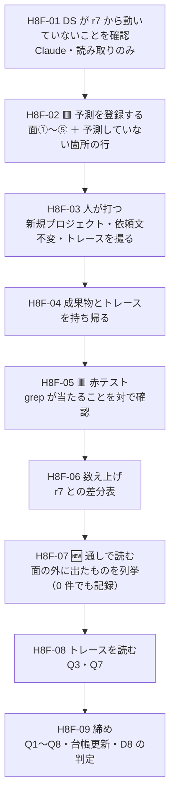

# 手8f — 8 周目（同一入力の再現性と、過程の観測）

> 段取り上の位置づけ: [UI検証の位置づけと段取り.md](../UI検証の位置づけと段取り.md) §5（手8e の次・手8b と手9 の前）
> 直前の手: [手8e](../実行記録.md)（done・**PR #5 マージ済み** `d469c13`。手順書は無い）
> 実測の記録先: [実行記録.md](../実行記録.md) §手8f

**この手は「部品を作る手」でも「規約を直す手」でもない。**7 周目までに溜まった
**測り方の穴を 2 つ塞ぐ手**である。

1. 🟥 **ばらつきを一度も測っていない。**r1〜r7 は毎周 1 変数だけ動かし、**差分を全部「変数の効果」と読んできた。**
   同じ入力を 2 度打ったときにどれだけ揺れるか（＝床）を知らないまま、7 周ぶんの結論を積んでいる。
2. 🟥 **過程を一度も持ち帰っていない**（[DR-0076](../DR/DR-0076-capture-the-run-not-just-the-output.md)）。
   判断を動かした観測 3 件のうち 1 件は成果物の外にあり、**ユーザーが偶然共有したトレース**でしか見えなかった。

🟥 **だから 8 周目は「何も動かさない周」にする**（D1）。動かすのは**観測の装置だけ**。

---

## 0. この手で答えを出す問い（観測項目）★最重要

| # | 問い | なぜ効くか（どの判断が変わるか） |
| --- | --- | --- |
| **Q1** | ★★ 🟥 **同一入力を 2 度打つと、出力は同じか。**揺れるとしたらどの粒度で、どれだけか | **7 周ぶんの読みの校正。**これまで差分はすべて「動かした 1 変数の効果」として読んできた。🟥 **ばらつきの床が面のレベル（件数 1〜2 件）にあるなら、[DR-0063](../DR/DR-0063-forbidding-without-an-alternative-fails.md) の「5 → 2 → 1」も [DR-0069](../DR/DR-0069-adding-prohibitions-to-the-header-degraded-the-output.md) の「壊れて戻った」も、幅の中の話だったことになる。**床が骨格レベル（部品が消える）なら DR-0069 の読み自体が揺らぐ |
| **Q2** | ★ **[OBS-0013](../OBS/OBS-0013_部品があるのにインラインスタイルで組んだ.md)（インラインスタイル）は 2 回目を出すか** | 🟦 出れば [DR-0070](../DR/DR-0070-product-layer-boundary-rule.md) の規則①（同じ場所から 2 回）が成立し、**打ち手の検討に入れる**（header か `.prompt.md` か＝ OBS-0013 §2 の 2 番目の問い）。出なければ 1/8 周のまま**何もしない** |
| **Q3** | ★ **agent は `.prompt.md` を何本・どれを読むか。**選び方は「変更された部品」か「要件から引き当て」か「常に全部」か | [DR-0075](../DR/DR-0075-design-side-reads-the-design-system-directly.md) の**唯一の未検証の推論**。🟦 r7 で読んだ 3 本（`AppShell` / `DataGrid` / `Select`）は**手8d で動かした 3 本ちょうど**だったが、**同じ 3 本が要件からも引き当てられる**（シェル・表・フィルタ）ので 1 周では割れない。**今回 DS は 1 バイトも変えない**ので、🟥 **「変更された部品」説なら 0 本になるはず** |
| **Q4** | ★ **予測の外に出たものは何件か**（[DR-0076](../DR/DR-0076-capture-the-run-not-just-the-output.md) ②③） | **0 件でも「0 件だった」と記録する。**これを書く欄が無かったことが DR-0076 の起点。🟥 **過去 3 周で 3 回出ている**ので、0 件が続けば逆に「装置が追いついた」の証拠になる |
| **Q5** | **宣言語彙の外に出たクラスは 0 件のままか** | r6 は 3 件・r7 は 🟦 **0 件**。**Q1 の下位観測**——ここが揺れるなら床は面のレベルにある |
| **Q6** | **`Link` は 0 のままか** | r7 で唯一外れた予測（面④b）。🟨 **依頼文を変えない限り「リンクを作る場面」自体が出ない**見込み（D6）。**2 周連続 0 なら「部品を足しても場面が無ければ選ばれない」の 1 例目**になり、[DR-0065](../DR/DR-0065-claude-design-uses-the-registered-components.md)（足せば足すだけ使った）に**条件が付く** |
| **Q7** | 🟥 **トレース（DR-0076 ①）は、判断を動かす材料を出したか** | **装置自身の検査。**DR-0076 は「手段の証拠は 1 例だけ」と明記して**2 回ルールを前倒し**した決定なので、**空振りなら ① を落とす**（PARADIGM「具体は使い捨て」）。🟥 **判定基準は打つ前に決める**（D8） |
| **Q8** | 🟨 **[思想への指摘](../共通コンポーネント思想への指摘.md)が 14 件目として出るか** | 現在 **13 件**。[未決 #25](../handoff.md)（偏りは「規定の細かさ」か「使い込みの量」か）の判定材料。🟨 **今回は分類にも実装にも触らない周**なので、**出なければそれ自体が 1 つの答え**（指摘は「使い込み」から出る側に寄る） |

> **Q1 が本体。**Q2〜Q4 は 7 周目が残した宿題。Q5〜Q8 は継続観測。
>
> 🟥 **この手では打ち手を打たない。**インラインスタイルへの対処も `Link` の測定も**次の周以降**。
> **測り方を直す周に、測る対象まで動かさない。**

### Q1 の「同じ」を先に定義する（🟥 打つ前に決めておく）

**完全一致は期待していない。**差を報告する粒度を先に固定する:

| 粒度 | 何を数えるか | r7 の値 |
| --- | --- | --- |
| **(a) 面** | 面①〜⑤ の件数 | ①0 ②0 ③0 ④a 0 ④b 0 ⑤2 |
| **(b) 部品** | 部品の種類・`x-import` の要素数 | 15 種・30 要素 |
| **(c) 素の要素** | `<div>` / `<span>` / `<table>` / `<button>` / `<a>` | div 2・span 2・他 0 |
| **(d) 骨格** | `AppShell` / `Container` / `Section` / `Inline` / `DataGrid` / `AppProviders` の有無 | 🟦 全件あり |

🟥 **(d) が揺れたら [DR-0069](../DR/DR-0069-adding-prohibitions-to-the-header-degraded-the-output.md) の読みが揺らぐ**——
あれは「禁止文を足したら骨格が消え、戻したら戻った」という **2 回の観測**だが、
**床が骨格レベルにあるなら、2 回とも幅の中だった可能性が出る。**

---

## 1. 前提

- **直前の手**: 手8e done（[実行記録 §手8e](../実行記録.md)。**PR #5 マージ済み** `d469c13`）
- **デザインシステム**: `3acbb737-85fe-4098-95f4-c99070168ba1`（**31 部品**・`Link` 新設済み）。
  🟥 **この手では 1 バイトも変えない**
- **依頼文**: 手7 H7-03 ＋ 末尾 1 文（下記全文・**1 文字も変えない**）
- **ブランチ**: 現ワークスペースの作業ブランチ（Conductor）。完了したら `gh pr create --base main`。
  🟥 **マージは人**（[DR-0068](../DR/DR-0068-merge-through-pull-requests.md)）
- 🟥 **生成は人が打つ**（[DR-0001](../DR/DR-0001-design-repo-role.md)）。Claude ができるのは
  **打つ前の予測登録**・**持ち帰った成果物の数え上げ**・**記録**の 3 つだけ

### 打つ依頼文（全文・🟥 1 文字も変えない）

```text
Redmine のチケット一覧画面を作ってください。要件は次のとおりです。

- 左にサイドバーのナビゲーション（チケット / プロジェクト / 設定）、右が本文
- 本文の先頭に画面タイトルと、新規作成のボタン
- チケットの一覧表。列は ID / 題名 / ステータス / 優先度 / 担当者 / 更新日
- ステータスは「新規・進行中・解決・却下」を色分けして見分けられるように
- 一覧の上に、ステータスと担当者で絞り込むフィルタ
- 検索条件に合うチケットが 0 件のときの表示も用意してください
```

＋ 末尾に 1 文（r? 以降ずっと同じ）:

```text
このプロジェクトのデザインシステムに登録されている部品を使って組んでください。
```

### 確定済みの前提（ここは決め直さない）

| 前提 | 出典 |
| --- | --- |
| 実測 1 回では部品も規約も動かさない（同じ場所から 2 回） | [DR-0070](../DR/DR-0070-product-layer-boundary-rule.md) 規則① |
| 🟥 禁止だけを足すと**触っていない箇所**が壊れる | [DR-0069](../DR/DR-0069-adding-prohibitions-to-the-header-degraded-the-output.md) |
| 🟦 禁止は代替語彙と対にすると守られる | [DR-0063](../DR/DR-0063-forbidding-without-an-alternative-fails.md) |
| 🟦 デザイン側は DS プロジェクトの `.prompt.md` を直接読める（複製は 6 ファイルのまま） | [DR-0075](../DR/DR-0075-design-side-reads-the-design-system-directly.md) |
| 観測は 3 点（過程を持ち帰る / 通しで読む / 予測していない箇所の行） | [DR-0076](../DR/DR-0076-capture-the-run-not-just-the-output.md) |
| 逸脱の面は 4 つ（素材層 `class-name` / `Box` の `className` / 列の書式 / `<style>` の生 CSS） | [DR-0060](../DR/DR-0060-vocabulary-leaks-from-four-surfaces.md) |
| 思想（`共通コンポーネント思想.md`）は**ユーザーの持ち物**。指摘は DR / OBS へ | CLAUDE.md |

### 🟥 着手前に潰しておく不確定要素

| # | 不確定要素 | 潰し方 |
| --- | --- | --- |
| 1 | 🟥 **DS 側が我々の知らないうちに動いている可能性。**動いていたら Q1 は成立しない（変数が 2 つ） | **H8F-01 で `DesignSync` の `updatedAt` とファイル数を r7 の値と突き合わせる。**ズレたら**先に差分を記録し、Q1 の判定を保留する** |
| 2 | 🟥 **同じデザインプロジェクトで 2 回打つと、前回の文脈が残る**（＝入力が同じでなくなる） | **D3 で新規プロジェクトを作る**と決める |
| 3 | 🟥 **トレースの取り方が決まっていないと、人が撮り損ねる**（撮り直しは効かない・生成は 1 回きり） | **D4 で形式を確定し、H8F-03 の手順に「何を撮るか」を書き下す** |
| 4 | 🟨 **「差が出なかった」を成果として書けるか。**Q1 は 🟦 でも 🟥 でも情報だが、**0 件を書く欄を作らないと消える**（DR-0076 の形そのもの） | **H8F-06 の表に「r7 の値」列を先に埋めておく**（差分表として書く） |
| 5 | 🟨 **1 周では「ばらつきの床」は 1 サンプルしか取れない。**「同じだった」は「揺れない」の証明にはならない | **H8F-09 で「n=2 で一致」以上のことを書かない。**3 周目以降が要るなら未決に積む |

---

## 2. 着手前に決めること（判断ポイント）

> **戻しにくい決定はここに全部出す。**実行中に §2 に無い選択肢が出たら、**その場で決めずにここへ追記してから進む。**
> 🟥 **とくに D1 と D8 はユーザー判断**（測定設計そのもの／装置を捨てる基準）。

| # | 論点 | 選択肢 | 推奨 | 決定 | 戻せるか |
| --- | --- | --- | --- | --- | --- |
| **D1** | ★★ **8 周目の変数をどうするか** | **A** 何も動かさない（純粋な再現性測定）／ **B** OBS-0013 への打ち手を先に打つ／ **C** 依頼文を変えて `Link` を測る | **A** | ⬜ 未決 | 🟦 戻せる |
| **D2** | ★ **`/design-sync` を打つか** | **A** 打つ（同期の冪等性も同時に測る）／ **B** 打たない（DS を r7 と同一に保つ） | **B** | ⬜ 未決 | 🟦 戻せる |
| **D3** | **デザインプロジェクトを新規に作るか** | **A** 新規に作る／ **B** r7 のプロジェクト（`89a4410e-…`）で 2 回目を打つ | **A** | ⬜ 未決 | 🟥 打ったら戻せない |
| **D4** | ★ **トレースの取り方**（[DR-0076](../DR/DR-0076-capture-the-run-not-just-the-output.md) ①） | **A** スクリーンショットのみ／ **B** テキストの手写しのみ／ **C** 両方 | **C** | ⬜ 未決 | 🟥 撮り直せない |
| **D5** | **面の定義に ⑤ インラインスタイルを足すか** | **A** 足して予測表に登録する／ **B** 足さず「予測していない箇所」の側で拾う | **A** | ⬜ 未決 | 🟦 戻せる |
| **D6** | **`Link` をどう測るか**（[handoff 0-4](../handoff.md) の未決） | **A** 8 周目では測らない／ **B** 依頼文にリンクの要件を足す／ **C** 別の周（手8g）を立てる | **A**（→ 9 周目で C） | ⬜ 未決 | 🟦 戻せる |
| **D7** | **8 周目を新しい手として立てるか** | **A** 手8f（本書）／ **B** 手8e の続きにする／ **C** 手9 へ畳む | **A** | ⬜ 未決 | 🟦 戻せる |
| **D8** | ★★ 🟥 **DR-0076 ①（トレース）を落とす判定基準を先に決める** | **A** Q3 に答えが出れば残す・出なければ落とす／ **B** 何か 1 つでも予測外の観測が出れば残す／ **C** 3 周見てから決める | **A** | ⬜ 未決 | 🟦 戻せる |

### 2.1 D1 — 8 周目の変数をどうするか（★★ ここが測定設計）

**推奨: A（何も動かさない）。**

- 🟥 **B は規律違反になる。**インラインスタイルは**実測 1 回**で、[DR-0070](../DR/DR-0070-product-layer-boundary-rule.md) の規則①（2 回）が不成立。
  打ち手を先に打つと、**2 回目が出たかどうかを永久に測れなくなる**（OBS-0013 §4 の「結論が変わる条件」がそのまま潰れる）
- 🟥 **C は 1 変数の規律を壊す。**依頼文を変えると **r1〜r7 との比較の土台が消える**（H8-10 が「1 文字も変えない」と書いた理由）
- 🟦 **A なら 4 つの問いが同時に取れる**——Q1（床）・Q2（2 回目）・Q3（`.prompt.md` の選び方）・Q4（予測の外）。
  **動かすのは観測の装置だけ**で、装置は入力を変えない
- 🟨 **A の弱点**: 「何も新しいことをしない周」に見える。🟦 ただし **Q1 は 7 周ぶんの読みを校正する問い**なので、
  情報量はむしろ大きい。**外れた場合（床が大きい場合）に一番動くのは過去の結論**

### 2.2 D2 — `/design-sync` を打つか

**推奨: B（打たない）。**

- 🟦 **手8e 以降、repo のコードは 1 行も変わっていない**（`d469c13` 以降のコミットは本手順書だけ）。
  打っても `ds-bundle` は同一のはず＝**得られる情報は「冪等だった」の 1 ビット**
- 🟥 **打つと変数が増える側にしか転ばない。**同期は `updatedAt` を動かし、`unchanged` 判定は
  **verified-by-upload**（手8e 実測）なので、**再アップロードが走る部品が出る可能性がある**
- 🟦 **代わりに H8F-01 で「動いていないこと」を読み取りで確認する**（Claude が `DesignSync` で実行できる）。
  **書き込みを伴わない検算のほうが Q1 の前提として強い**

### 2.3 D3 — デザインプロジェクトを新規に作るか

**推奨: A（新規）。**r1〜r7 はすべて新規プロジェクトで打っている。
🟥 **同じプロジェクトで 2 回目を打つと会話文脈が残り、「同一入力」でなくなる**——Q1 が測れない。

### 2.4 D4 — トレースの取り方

**推奨: C（両方）。**

| 形式 | 強み | 弱み |
| --- | --- | --- |
| スクリーンショット | 🟦 **改変が入らない。**撮り漏らした行も画像には写る | 🟥 grep できない・行数が多いと切れる |
| テキストの手写し | 🟦 **grep できる・差分が取れる**（r7 のトレースと突き合わせられる） | 🟥 **手写しの誤りが入る**（H8E-09 で成果物側に同じ懸念が出ている） |

🟥 **正本は画像**（改変が入らないほう）とし、**テキストは索引として扱う**——手8e で成果物に対して採った扱いと同じ形。

**撮るもの（H8F-03 に再掲）**: ① `Listing files` の行（**どの projectId を list したか**）
② `Reading *.prompt.md` の行（**何本・どれを**）③ `Searching` / `Reading` のその他 ④ **生成にかかった体感時間**。

### 2.5 D5 — 面の定義に ⑤ を足すか

**推奨: A（足す）。**

- 🟦 **Q2 は「2 回目が出たか」の yes/no** なので、**数える対象を先に定義しないと答えが出ない**
- 🟥 **足すことの代償を自覚しておく**——[DR-0076](../DR/DR-0076-capture-the-run-not-just-the-output.md) が言うとおり、
  **予測に登録した瞬間、それは「予測の外」ではなくなる。**だから **③ の行（予測していない箇所）は別に置く**（H8F-02）
- 🟨 面⑤ の定義: **`style="…"` 属性の出現箇所すべて**（`display:flex` に限らない）。
  **限定すると同じ穴を掘り直す**（面①〜④ をクラス名の集合で定義したせいで ⑤ が外に落ちた）

### 2.6 D6 — `Link` をどう測るか

**推奨: A（8 周目では測らない）。**

- 🟥 依頼文を変えるのは **D1=C と同じ**——1 変数の規律を壊す
- 🟦 **2 周連続 0 件それ自体が Q6 の答えになる**（「場面が無ければ選ばれない」）
- 🟨 **測りたいなら独立した周を立てる**（手8g）。そこでは**依頼文を変えることが唯一の変数**になり、規律を保てる

### 2.7 D8 — DR-0076 ① を落とす判定基準（★★ 打つ前に決める）

**推奨: A（Q3 に答えが出れば残す）。**

🟥 **基準を後から決めると、必ず「残す」に倒れる**（撮った労力が惜しくなる）。
[DR-0076](../DR/DR-0076-capture-the-run-not-just-the-output.md) は自分で
「**8 周目で何も出なければ ① を落とす**」と書いているので、**「何も出ない」の定義をここで確定させる。**

| 案 | 基準 | 評価 |
| --- | --- | --- |
| **A** | **Q3（`.prompt.md` の選び方）に切り分けが付いたら残す。**付かなければ落とす | 🟦 **DR-0076 §影響の「推論」欄に書かれた唯一の検証項目とちょうど対応する。**基準として一番狭く、一番検証しやすい |
| **B** | 予測外の観測が 1 件でも出れば残す | 🟥 **緩すぎる。**成果物側（②③）で拾ったものまで ① の手柄になる |
| **C** | 3 周見てから決める | 🟥 **2 回ルールの前倒しをさらに前倒しすることになる。**「効かなければ捨てる」が空文になる |

🟨 **A で落とす場合も ②③ は残す**（DR-0076 の §影響 3 が「2 は安い」と明記している）。

---

## 3. 成果物

- `artifacts/h8f/` —— ① 生成物の `.dc.html` ② **トレースの画像** ③ **トレースのテキスト**（`trace.md`）
- [実行記録.md](../実行記録.md) §手8f —— 予測表（**打つ前に登録**）／差分表（r7 → r8）／通し読みの列挙／トレースの読み
- [OBS-0013](../OBS/OBS-0013_部品があるのにインラインスタイルで組んだ.md) の §8 見直しログ（**2 回目が出ても出なくても追記する**）
- 必要なら DR 起票（Q1 の床が面のレベルにあった場合は `finding` が 1 本立つ）
- [handoff.md](../handoff.md) の更新
- 🟥 **コードは 1 行も増えない。**増えていたら D1 を破っている

## 4. 作業フロー



## 5. 手順

### H8F-01 DS が r7 から動いていないことを確認する（Q1 の前提）

- **目的**: 🟥 **不確定要素 #1 を潰す。**変数が 2 つ動いた状態で数えない
- **実行**: `DesignSync({method:'get_project', projectId:'3acbb737-85fe-4098-95f4-c99070168ba1'})` と `list_files`
- **期待結果**: **31 部品・170 ファイル**、`updatedAt` が手8e の再同期の時刻から動いていない
- **検証**: ファイル数・部品数・`updatedAt` の 3 つを r7 の値と突き合わせる
- **観測**: Q1 の前提。**ズレていたら Q1 は保留にし、先に差分を記録する**
- **判断**: なし（ズレたら D2 を A へ振り直す判断がユーザーに戻る）
- **詰まったら**: `list_projects` はデザインシステム型しか返さない（手7 H7-01 の既知）

### H8F-02 🟥 予測を登録する（★ 打つ前に必ず）

- **目的**: 後付けの物語を防ぐ。**および [DR-0076](../DR/DR-0076-capture-the-run-not-just-the-output.md) ③ の「予測していない箇所」の行を様式として置く**
- **実行**: 下表を実行記録 §手8f に転記してから H8F-03 へ進む

| # | 予測 | 外れたら何を意味するか |
| --- | --- | --- |
| **①** | **面①〜④ は 0 のまま**（`class-name` 0 ／ `Box` の `className` 0 ／ 列の書式クラス 0 ／ `<style>` 0） | 🟥 **ばらつきの床が面のレベルにある。**r1〜r7 の「5 → 2 → 1 → 0」の読みに幅が付く。**[DR-0063](../DR/DR-0063-forbidding-without-an-alternative-fails.md) と [DR-0069](../DR/DR-0069-adding-prohibitions-to-the-header-degraded-the-output.md) の再解釈が要る** |
| **②** | 🟨 **面⑤（`style=` 属性）は再び出る**（同じ `Label` ＋ `Select` の縦積み） | 🟦 出れば [DR-0070](../DR/DR-0070-product-layer-boundary-rule.md) 規則①が成立し打ち手へ。出なければ **1/8 周の揺れ**——**何もしないが、OBS-0013 に「1 回きりだった」を追記する** |
| **③** | **部品の種類は 15 ± 2 種、`x-import` は 30 ± 5 要素** | 大きく外れたら床は (b) の粒度にある |
| **④** | 🟨 **骨格（`AppShell` / `Container` / `Section` / `Inline` / `DataGrid` / `AppProviders` 最外 1 回）は全件そのまま** | 🟥 **外れたら DR-0069 の読みが揺らぐ**（「禁止文が壊した」ではなく「元から揺れる」側の可能性が立つ） |
| **⑤** | **`.prompt.md` は 3 本前後を読む**（`AppShell` / `DataGrid` / `Select`） | 🟦 **0 本なら「直前に変更された部品を読む」説**（今回 DS は不変）。**31 本なら「常に全部」説。**別の 3 本なら「要件から引き当て」説 |
| **⑥** | **`Link` は 0 件** | 出たら「場面が無くても選ぶ」ことになり Q6 の読みが変わる |
| **⑦** | ★ **予測していない箇所が 1 件以上出る**（[DR-0076](../DR/DR-0076-capture-the-run-not-just-the-output.md) ③） | 🟨 **0 件なら「装置が追いついた」の 1 例目。**過去 3 周は 3 回とも出ている |

- **期待結果**: 実行記録 §手8f に予測表がある（**成果物より先に**）
- **検証**: 予測が全部 yes/no か有限個の値に落ちているか
- **観測**: Q4 の様式そのもの
- **判断**: なし
- **詰まったら**: 迷ったら**両方書く**のではなく**片方に賭ける**（賭けないと外れが観測にならない）

### H8F-03 人が打つ（🟥 実行は人）

| # | やること | 備考 |
| --- | --- | --- |
| 1 | claude.ai/design で**新しいデザインプロジェクト**を作り、参照 DS に **`design — UI検証`** を選ぶ | 🟥 `Modernist` と取り違えない（毎周の既知） |
| 2 | **§1 の依頼文をそのまま打つ**（本文 ＋ 末尾 1 文） | 🟥 **1 文字も変えない** |
| 3 | 🆕 **生成中のツールトレースを撮る**（D4=C なら画像 ＋ テキスト） | **撮るもの**: ① `Listing files` の行（projectId まで） ② `Reading *.prompt.md` の行（**何本・どれを**） ③ その他の `Reading` / `Searching` ④ 体感時間。🟥 **生成は 1 回きりで撮り直せない** |
| 4 | projectId を Claude に渡す | Claude が `DesignSync(list_files / get_file)` で持ち帰る |

- **期待結果**: 生成物 1 本 ＋ トレース
- **検証**: 依頼文が r7 と同一であること（**打つ前に見比べる**）
- **観測**: Q1〜Q7 の全部
- **判断**: なし
- **詰まったら**: 🟥 **トレースを撮り損ねたら、その周は Q3・Q7 に答えを出さない**（撮れた分だけで推論しない）

### H8F-04 成果物とトレースを持ち帰る

- **目的**: 数える対象を確定させる
- **実行**: `DesignSync(list_files)` → `get_file` で原本を取り、`artifacts/h8f/` へ置く
- **期待結果**: `artifacts/h8f/RedmineIssueList-r8.dc.html` ＋ `trace.md` ＋ 画像
- **検証**: 🟦 **数え上げは `get_file` の原本に対して行う**（手写しは索引・H8E-09 と同じ扱い）
- **観測**: 前提の確定
- **判断**: なし
- **詰まったら**: デザイン側の `list_files` が通らなければ、成果物は人が貼る（手7 D3 の代替経路）

### H8F-05 🟥 赤テスト — grep が当たることを確かめる

- **目的**: **「対象 0 件で緑」の 17 例目を踏まない**（通算 16 例。手7 では検査装置自体が空振りした）
- **実行**: 面①〜⑤ の各 grep について、**わざと当たる断片**と**当たらない断片**を対で通す
  ```bash
  # 例: 面⑤（style 属性）
  printf '<div style="display:flex">\n' > /tmp/hit.html
  printf '<div class="gap-stack-sm">\n'  > /tmp/miss.html
  grep -c 'style="' /tmp/hit.html /tmp/miss.html   # 1 と 0 になること
  ```
- **期待結果**: すべての面で **hit=1 / miss=0**
- **検証**: 🟥 **綴りを仮定しない**——H8E-04 で `::after` と `:after` を取り違えかけた。**当たり側の検体は生成物から抜き出した実文字列にする**
- **観測**: Q4 の信頼性 ／ 継続観測（対象 0 件で緑の 17 例目）
- **判断**: なし
- **詰まったら**: 面⑤ は属性なので、**HTML の属性境界**（`style=` の前が空白か）を確認する

### H8F-06 数え上げ（r7 との差分表）

- **目的**: **Q1・Q2・Q5・Q6。**§0 の (a)〜(d) の 4 粒度で数える
- **実行**: 面①〜⑤ の grep ＋ 部品の種類・素の要素・骨格の確認
- **期待結果**: 下表が埋まる（**r7 の列は先に埋めておく**＝不確定要素 #4 の対処）

| 粒度 | 項目 | r7 | **r8** | 差 |
| --- | --- | --- | --- | --- |
| (a) | 面① 素材層の `class-name` | 0 | | |
| (a) | 面② `Box` の `className` | 0 | | |
| (a) | 面③ 列の中の書式クラス | 0 | | |
| (a) | 面④a document reset | 0 | | |
| (a) | 面④b リンク色の生 CSS | 0 | | |
| (a) | 🆕 面⑤ `style=` 属性 | 2 | | |
| (b) | 部品の種類 / `x-import` 要素数 | 15 / 30 | | |
| (c) | `<div>` / `<span>` / `<table>` / `<button>` / `<a>` | 2 / 2 / 0 / 0 / 0 | | |
| (d) | 骨格 6 件 | 🟦 全件 | | |
| — | 宣言語彙の外に出たクラス | 0 | | |
| — | `Link` の使用 | 0 | | |

- **検証**: 差が出た項目は**必ず原文を引用する**（数字だけ書かない）
- **観測**: Q1・Q2・Q5・Q6
- **判断**: **面⑤ が 2 回目なら、打ち手の検討を次の周の §2 へ回す**（この周では打たない）
- **詰まったら**: 差が 1〜2 件のとき、🟥 **「変わらなかった」と書かない。**n=2 では**幅が 1〜2 件ある**としか言えない

### H8F-07 🆕 通しで読む（[DR-0076](../DR/DR-0076-capture-the-run-not-just-the-output.md) ②）

- **目的**: **Q4。**grep の射程の外に出たものを拾う
- **実行**: 生成物を**先頭から末尾まで 1 回通しで読み**、面①〜⑤ の定義に当てはまらない気になる箇所を**列挙する**
- **期待結果**: 列挙のリスト。🟥 **0 件でも「0 件だった」と実行記録に書く**
- **検証**: 列挙した各件について「**どの面の定義にも当てはまらないこと**」を明示する
- **観測**: Q4・Q8
- **判断**: 列挙が出たら **1 回目か 2 回目か**を判定する（1 回目なら OBS へ・2 回目なら DR-0070 規則①）
- **詰まったら**: 「気になる」の基準が曖昧なら、**素材層の生 DOM・属性・DSL の書き方**の 3 つを軸に読む

### H8F-08 トレースを読む（Q3・Q7）

- **目的**: [DR-0075](../DR/DR-0075-design-side-reads-the-design-system-directly.md) の唯一の未検証の推論を切り分ける
- **実行**: トレースから ① list した projectId ② 読んだ `.prompt.md` の**本数と名前** ③ その他の read/search を書き出し、**r7 のトレースと並べる**
- **期待結果**: 下表のどれかに落ちる

| r8 で読んだもの | 何説が立つか |
| --- | --- |
| **0 本** | 🟦 **「直前に変更された部品を読む」説**（今回 DS は不変）。→ **同期が agent の読みを誘導している**ことになり、手9 の移送設計に効く |
| **同じ 3 本** | 🟨 **「要件から引き当て」説**が優勢（シェル・表・フィルタ）。**変更とは独立** |
| **31 本（全部）** | 🟦 **「常に全部」説**。r7 で 3 本しか見えなかったのは**トレースの表示が省略されていた**ことになる |
| **別の本数** | 🟨 **どれでもない**。n=2 では決まらないので**次の周へ**（DR-0076 ① は残す側に倒れる） |

- **検証**: **r7 のトレース（実行記録 H8E-10 に転記済み）と 1 行ずつ突き合わせる**
- **観測**: **Q3・Q7**
- **判断**: ★★ **D8 の基準に照らして [DR-0076](../DR/DR-0076-capture-the-run-not-just-the-output.md) ① を残すか落とすかを判定する**
- **詰まったら**: トレースが省略表示（`… 12 more`）だったら、**「本数は測れなかった」と書く**。推定しない

### H8F-09 締め

- **目的**: §0 の Q1〜Q8 に答えを出し、台帳を更新する
- **実行**:
  - 実行記録 §手8f に予測の突き合わせ・差分表・通し読みの列挙・トレースの読みを書く
  - [OBS-0013](../OBS/OBS-0013_部品があるのにインラインスタイルで組んだ.md) §8 に見直しログを追記（**出ても出なくても**）
  - Q1 の床が面のレベルにあったら **`finding` の DR を 1 本起票**（`/dr`）
  - **D8 の判定を DR-0076 に追記**（残す／落とす）
  - handoff の「現在地」「次にやること」を差し替え
  - 機械ゲート 6 本を回してベースラインと突き合わせる（🟥 **手に属さないコミットでも赤は積まれる**——2026-08-07 の教訓）
- **期待結果**: §6 の完了条件が全部埋まる
- **検証**: 🟥 **「n=2 で一致した」以上のことを書いていないか**を読み返す
- **観測**: 全問
- **判断**: 次の周（手8g）を立てるか——**`Link`（D6）と、面⑤ の打ち手**が候補
- **詰まったら**: なし

## 6. 完了条件

- [ ] §2 の D1〜D8 が全件決着し、根拠が書かれている
- [ ] **予測表が生成の前に実行記録へ登録されている**（後から書いていない）
- [ ] `artifacts/h8f/` に生成物 ＋ トレース（画像 ＋ テキスト）がある
- [ ] 赤テスト（H8F-05）が全面で hit=1 / miss=0 だった
- [ ] 差分表の (a)〜(d) が全欄埋まっている
- [ ] **通し読みの列挙が書かれている（0 件なら「0 件」と書かれている）**
- [ ] §0 の Q1〜Q8 に答えが出ている（**「測れなかった」も答え**）
- [ ] **DR-0076 ① を残すか落とすかの判定が書かれている**
- [ ] OBS-0013 の見直しログが更新されている
- [ ] 機械ゲート 6 本がベースラインと一致（新しい赤ゼロ）
- [ ] handoff が更新され、コミット済み（`docs(H8f): 要約 [手8f]`）
- [ ] 🟥 **`src/**` の diff が 0 行**（D1=A を守れた証拠）

## 7. 出典

- [DR-0076](../DR/DR-0076-capture-the-run-not-just-the-output.md)（観測の様式・**本書はその実行手段**）／ [DR-0075](../DR/DR-0075-design-side-reads-the-design-system-directly.md)（`.prompt.md` の経路）／ [DR-0070](../DR/DR-0070-product-layer-boundary-rule.md)（規則①）／ [DR-0069](../DR/DR-0069-adding-prohibitions-to-the-header-degraded-the-output.md)（触っていない箇所も数える）／ [DR-0060](../DR/DR-0060-vocabulary-leaks-from-four-surfaces.md)（面の定義）
- [OBS-0013](../OBS/OBS-0013_部品があるのにインラインスタイルで組んだ.md)（Q2 の対象）
- [実行記録.md](../実行記録.md) §手8e H8E-09 / H8E-10 / H8E-11（r7 の値・r7 のトレース・様式を広げた経緯）
- 依頼文の原本: [手8 手順書 H8-10](手8_出力は機械ゲートを通るか.md)（本文）／[手7 手順書 §5](手7_ClaudeDesignに一覧を組ませる.md)（末尾 1 文）
