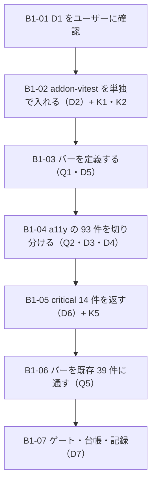

# 部品1 — 完成バーを機械で閉じる（**部品軸**の 1 本目）

> 🆕 **これは `工程N` の線とは別の軸。**段取り（[工場の段取り.md](../工場の段取り.md)）の工程0〜8 は
> **題材（Redmine の 5 画面）から部品の需要を洗い出す線**で、検証の出口は `/design-sync` だった。
> **本文書はその外側に、部品そのものを測る線を 1 本立てる。**
> 🟥 **段取り（地図）への追記が要る**——[§2 D1](#2-着手前に決めること判断ポイント) が決まってから書く。
>
> 実測の記録先: [実行記録.md](../実行記録.md) §部品1

---

## なぜこの軸を立てるか（1 段落）

**計測器は 2026-07-26（手2b）から入っていた。目盛りを一度も読んでいなかった。**
`@storybook/addon-a11y` は手2b D10 で「**DR-0023 の touch-min 44px を機械で測る手段**」として明示的に残され、
`.storybook/preview.tsx` に `a11y: { test: 'todo' }`（**違反はパネルに出すが失敗させない**）と書かれている。
そのコメント自身が「**addon-vitest を入れていないので CI で落ちる経路は無い**」と断っている。
🟥 **2026-08-09 に初めて axe を全 story に当てたら 286 件出た**（下表）。
**これは「対象 0 件で緑」ではない——「計測器を置いて、目盛りを一度も読まなかった」という新しい形。**

---

## 0. この軸で答えを出す問い（観測項目）★最重要

| #      | 問い                                                                        | なぜ効くか（どの判断が変わるか）                                                                                                                                                                                                                                                                                                                                                                                                                       |
| ------ | ----------------------------------------------------------------------------- | --- |
| **Q1** | ★★ **部品が「できた」と言える条件は何か**（＝ 完成バーの定義）             | **この軸の本体。**いま**条件が明文化されていない**ので、部品は「story が 1 本あって build が通ったら done」で出荷されている。🟥 **その結果が 93 件の a11y 違反**（出荷物の棚だけ）。★ **[DR-0078](../DR/DR-0078-repo-becomes-a-ui-factory-for-a-core-design-system.md)（他の開発でも使い回す）が目的なら、「使い回せる状態」の定義が要る。**バーが無いと、部品が増えるほど借金が増える |
| **Q2** | ★ **a11y の 286 件のうち、出荷物の欠陥は何件か**                           | 🟦 **着手前実測で割れている**——**出荷物の棚は 93 件**（`★ Review` の 167 は横断レビュー用の検証装置、`⑤ 題材` の 26 は Redmine のデモで、**どちらも出荷しない**）。★ **問いは「93 件のうち何件が本物か」**——`color-contrast` 82 件は**トークンの配色そのものへの指摘**かもしれず、**部品の欠陥ではなく ① 層の決定**の可能性がある（→ D3・[指摘 8](../共通コンポーネント思想への指摘.md) と同じ構図） |
| **Q3** | ★ **「状態」の面は部品ごとに違うのか、共通の面があるのか**                 | 🟥 **`States` story を持つのは 39 部品中 2 件だけ**（`Checkbox` / `Input`・着手前実測 3）。**残りは default しか撮っていない。**★ 手5 で `★ Review/A 状態面` を作ったが**横断 1 枚**で、**部品ごとの網羅ではない。**共通の面（hover / focus-visible / disabled / invalid / loading / empty / overflow）が定義できるなら**バーに載る**。できないなら部品ごとに書くしかない |
| **Q4** | **機械で閉じられるのはどこまでか**                                          | 🟥 **axe には測れないものがある**と実測済み——[DR-0034](../DR/DR-0034-touch-target-visual-32-hit-44.md): **addon-a11y は 24px の AA しか測らない**ので **44px（[OBS-0008](../OBS/OBS-0008_当たり判定44pxをどう扱うか.md)・open）は測れない**。★ **「バーのうち機械が持つ分／人が持つ分」を割ることがこの問いの答え。**割らないと「緑だから完成」を信じてしまう（この repo が 16 回踏んだ形） |
| **Q5** | **完成バーを既存 39 件に通すと、借金はどれだけあるか**                      | ★ **バーを定義しただけでは何も直らない。**通して初めて量が出る。🟨 **量が出たら「返し方」が判断になる**（D6）。🟦 **借金の量そのものが、バーが妥当かの検算**——**全部品が一発で通るバーは緩すぎ、1 件も通らないバーは厳しすぎる** |

> **Q1 が本体。**Q2〜Q4 はバーの各面の実現可能性、Q5 はバーの妥当性の検算。
> 🟥 **この軸では `/design-sync` を打たない**（同期軸は一旦置く・ユーザー指示 2026-08-09）。
> 🟥 **新しい部品を作るかはこの文書では決めない**——**D1 が決まってから**（部品1 はバーを立てる回、部品2 以降が作る回）。

### 0.1 赤テストの設計（🟥 バーを立てた直後に打つ）

**バーそのものが「対象 0 件で緑」になりうる。**測っているつもりで何も測っていない形を先に潰す。

| 検体   | 中身                                                                                                       | 期待                                                                | 外れたときの意味                                                                                                                                                                                                                              |
| ------ | ------------------------------------------------------------------------------------------------------------ | --------------------------------------------------------------------- | --- |
| **K1** | ★ **axe を故意に破る**——`Select` の `SelectTrigger` から `aria-label` 相当を消す（既に違反しているので、逆に**直してから壊し直す**） | 🟥 **`button-name` が 1 件増えるはず**                              | 増えなければ**検査が当該 story を見ていない**。🟥 **「全 story を回した」と「全 story を測れた」は別**——**空の story では axe は 0 件を返す**                                                                                                |
| **K2** | ★★ **空 story を混ぜる**（`Dialog/Open` が実在する検体——🟦 **着手前実測で 1 件見つかった**）              | 🟥 **「違反 0」ではなく「測定不能」として区別されるはず**           | 区別できないなら**バーは空を緑と読む**＝ **「対象 0 件で緑」の 17 例目**。🟦 **この検体は既知**（`.design-sync/NOTES.md`：storybook 側でも描画されず `cfg.overrides.Dialog.skip` に入っている）ので、**わざわざ作らなくても既に在る**       |
| **K3** | **状態 story が本当にその状態を作れているか**——`hover` を CSS クラスの偽装で描いていないか                | 🟥 **実際に `page.hover()` して撮った絵と一致するはず**             | 一致しないなら**状態面は「絵」であって「状態」ではない**（[DR-0054](../DR/DR-0054-mock-specimens-cannot-reproduce-stacked-states.md)：**モックの検体は積み重なった状態を再現できない**——手5 で 1 度踏んでいる）                             |
| **K4** | **語彙 prop の効果を実寸／実効値で測る**（[DR-0090](../DR/DR-0090-token-classes-were-silently-dropped-by-tailwind-merge.md) の宿題 ①） | 🟥 **指定した語のとおりの値が出るはず**                             | 出ないなら `src/lib/tw-merge.ts` への追記漏れ。🟥 **語彙の写しが `tokens.css` と `tw-merge.ts` の 2 箇所にあり機械で守られていない**——**この軸はその宿題を引き取る場所**                                                                    |
| **K5** | 🟥 **バーを 1 段きつくして、通っていた部品が落ちることを確認する**                                          | 🟥 **落ちるはず**                                                   | 落ちないなら**バーが実質無効**（判定式がどこかで握り潰されている）。★ **「緑を信用しない」の適用**——**バーは、赤くできることを確認してから運用する**                                                                                        |
| 🆕 **K6** | **面① を実装したあと、空 story（`() => null`）を混ぜる**（B1-06・D10/D11） | 🟥 **その 1 件だけが落ちるはず** | 落ちなければ判定式が握り潰されている。🟦 **実装前に同じ検体を打って「96/96 緑」を実測済み**なので、**before / after の対照になる**（＝ **バーが赤くできることの証明**） |
| 🆕 **K7** | ★★ 🟥 **面① が `Dialog/Open` を落とさないことを確認する**（B1-06・D11 の反対側） | 🟦 **通るはず**（portal に `[role=dialog]` が実在する） | 落ちるなら**判定式が portal を見ていない**＝ **正しい部品を落とす**。★ **「赤くできる」だけでは足りない**——**赤くすべきでないものを赤くしない**ことも同じ回で測る。**`Spacer` / `Separator`（文字を持たない）も同じ側の検体** |
| 🆕 **K8** | **面④ の `play` を書いた部品で、語彙を 1 語わざと壊す**（B1-06・D12） | 🟥 **落ちるはず** | 落ちないなら `play` が実効値を読んでいない（[DR-0094](../DR/DR-0094-the-bar-engine-ran-without-any-css.md) の再演）。🟥 **まず `vitest.config.ts` の `@tailwindcss/vite` を疑う**（バー §5 の落とし穴 3） |

---

## 1. 前提と着手前実測（2026-08-09・`main` = `f601674`）

### 1.1 🟥 a11y — 初めて数えた

**手法**: `.design-sync/sb-reference`（80 story）を配信し、各 story の `#storybook-root` に
axe-core **4.12.1**（`addon-a11y` の推移依存・在庫品）を当てた。`resultTypes: ['violations']`。
スクリプトは `.context/a11y-scan.mjs`（🟨 **gitignore 配下の使い捨て**——正式化は D2 で決める）。

| 棚                  | story | 違反 story | ノード  | 内訳                                        | 出荷するか        |
| ------------------- | ----- | ---------- | ------- | ------------------------------------------- | ----------------- |
| ★ Review            | 8     | 8          | **167** | color-contrast 166 / button-name 1          | 🟦 **しない**（横断レビュー用の検証装置） |
| ② 製品層・自作      | 20    | 9          | 29      | color-contrast 27 / button-name 2           | 🟥 **する**       |
| ⑤ 題材（Redmine）   | 2     | 2          | 26      | color-contrast 24 / button-name 2           | 🟦 **しない**（デモ） |
| ④ Templates         | 4     | 4          | 21      | color-contrast 21                           | 🟥 **する**       |
| ③ Patterns          | 10    | 8          | 20      | color-contrast 17 / button-name 3           | 🟥 **する**       |
| ② 素材層            | 27    | 9          | 17      | color-contrast 11 / button-name 5 / label 1 | 🟥 **する**       |
| ① Tokens            | 5     | 5          | 5       | color-contrast 5                            | 🟦 **しない**（見本） |
| ② 製品層・ラッパー  | 4     | 1          | 1       | color-contrast 1                            | 🟥 **する**       |
| **合計**            | 80    | 46         | **286** | color-contrast 272 / button-name 13 / label 1 | —               |
| ★ **出荷物の棚だけ** | **70** | **36**     | ★ **93** | **color-contrast 82 / button-name 10 / label 1** | —          |

**★ critical は 14 件（`button-name` 13 ＋ `label` 1）で、在処が集中している**——**ノイズではない**:

| 部品                        | story                       | 件数 |
| --------------------------- | --------------------------- | ---- |
| `Select`（素材層）          | Default 1 / **Widths 3**    | 4    |
| `FilterBar`（Patterns）     | StatusFilter 1 / AssigneeFilter 2 | 3 |
| `PeriodSelect`（製品層）    | Default 1 / Custom 1        | 2    |
| `Checkbox`（素材層）        | Default                     | 1    |
| `Input`（素材層）           | States（`label` 違反）      | 1    |
| ⑤ 題材・★ Review            | （出荷しない）              | 3    |

★★ 🟥 **`Select` 系が 9/14 を占める。**`SelectTrigger` は **placeholder と chevron しか持たない button** なので、
**アクセシブルな名前が無い。**★ **`Select` はこれで 3 度目の登場**——
[DR-0089](../DR/DR-0089-overlays-do-not-cover-their-anchor.md)（重なり）／[DR-0090](../DR/DR-0090-token-classes-were-silently-dropped-by-tailwind-merge.md)（`width` が効かない）／工程4 K1-b（値を 0 に潰す）に続く **4 件目の欠陥**。

🟨 **`Dialog/Open` の 1 story は空だった**（`#storybook-root` に中身が無い）。
🟦 **既知**——`.design-sync/NOTES.md` が「**storybook 側でも描画されない**（`sb-error`）」と記録し、
`cfg.overrides.Dialog.skip` に入れている。**独立に再現した**＝ **K2 の検体は作らなくても既に在る**。

### 1.2 状態網羅 — `States` を持つのは 39 部品中 2 件

| 部品                                     | story 名                                                |
| ---------------------------------------- | ------------------------------------------------------- |
| `Checkbox`                               | Default, **States**                                     |
| `Input`                                  | Default, **States**                                     |
| `Button`                                 | Default, Variants, Sizes（🟥 **States 無し**）          |
| その他 36 件                             | 大半が **Default 1 本だけ**                             |

🟨 横断の `★ Review/A 状態面` は手5 の産物で **1 枚に混ぜた形**。**部品ごとの面ではない。**

### 1.3 役割 9 カテゴリの充足（[部品カタログ.md](../部品カタログ.md) が既に台帳）

**カタログは 63 部品を 9 カテゴリに割り当て済み**（手1 の成果物・フラグつき）。**素材層は 24 件導入済み**。

| カテゴリ       | 思想が挙げる部品                                                  | 実在                                          | 🟥 欠落                                  |
| -------------- | ----------------------------------------------------------------- | --------------------------------------------- | ---------------------------------------- |
| Action         | Button, IconButton, FAB, Link                                     | Button, Link                                  | **IconButton, FAB**                      |
| TextInput      | TextField, Textarea                                               | Input, Textarea                                | —                                        |
| Selection      | Checkbox, Radio, Switch, Select, Slider, DatePicker, FileUpload   | Checkbox, Select, PeriodSelect                | **Radio, Switch, Slider, DatePicker, FileUpload** |
| Layout         | Box, Stack, Grid, Container, Spacer, Card, Section                | 全 7 ＋ Field, Inline                          | —                                        |
| Overlay        | Dialog, Drawer, Sheet, Popover, Dropdown, Tooltip                 | 全 5（Drawer=Sheet）                           | —                                        |
| DataDisplay    | Table, DataGrid, List, Tree, Tag, Statistic, Chart                | Table, DataGrid, DescriptionList, StatusPill, Timeline | **List, Tree, Tag, Statistic, Chart** |
| Navigation     | Tabs, Menu, Breadcrumb, Pagination, Stepper, NavBar/Drawer        | Tabs, Breadcrumb, Pagination, Sidebar, Link   | **Stepper**（Menu≒DropdownMenu）        |
| Communication  | Snackbar/Toast, Badge, Progress, Alert, Skeleton                  | Badge, Alert, Empty, Skeleton                 | **Toast, Progress**                      |
| Display        | Text/Heading, Icon, Image, Avatar, Divider                        | Label, Separator                              | **Text/Heading, Icon, Image, Avatar**    |

🟦 **`calendar` は素材層に在庫があるのに、製品層の窓口も story も無い**（＝ **出荷していない在庫**）。

### 1.4 ゲートのベースライン（`main` = `f601674`）

typecheck 🟦 緑 ／ lint 🟥 **error 42 / warning 1**（内訳は [工程5 §1](工程5_稼働表_ピボット.md) と同一）／
build 🟦 緑・dist **74**・`design.mjs` **83,784 B** ／ format 🟦 緑 ／ spell 🟦 **307** ／ storybook 🟦 緑・story **49 ファイル / 80 件**

---

### 1.5 🆕 B1-06 の着手前実測（2026-08-09・`main` = `2284b8a`・部品2 マージ後）

> **B1-06 は「バーを既存 44 件に通す」回。**通す前に**バーの各面が本当に実装されているか**を数えた。

#### ① 🟥 バーの 7 面のうち、**🟥「落とす」と書いてある面が実装されていなかった**

| 面 | バー文書の宣言 | 実装 | 実測 |
| --- | --- | --- | --- |
| **① 描画された** | 🟥 **落とす** | ❌ **無い** | 🟥 **`() => null` を描く空 story を足したら、バーは 96/96 緑で通った** |
| **② a11y** | 🟥 critical を落とす | ✅ `preview.tsx` の `a11y.test: 'error'` | 🟦 critical 0（B1-05） |
| **③ 状態面** | 🟨 台帳 | ❌ 台帳が無い | 🟥 **`States` 相当を持つのは 44 件中 7 件** |
| **④ 語彙の効果** | 🟥 **落とす** | 🟨 **3 部品だけ**（`Avatar` / `Switch` / `Slider`・部品2 が手で書いた `play`） | 🟥 **語彙 prop を持つ 17 件中 3 件しか測っていない** |
| **⑤ 型の閉じ** | 🟥 落とす | ✅ `tsc` ＋ lint | 🟦 運用中 |
| **⑥ 44px** / **⑦ 意味** | 👁 人 | —（対象外） | — |

★★★ 🟥 **これは「対象 0 件で緑」ではなく、「バーの目盛りを書いたが、針を付けていなかった」形。**
**B1-03 でバーを定義したとき、面② だけが実装され、面①・④ は文書の中だけに在った。**
🟦 **部品2 が面④ を 5 部品で実装したのは、バーが要求したからではなく手で書いたから**——
**書かなければ通る**ので、**面④ は「作った人の記憶」に依存していた。**

#### ② `afterEach` は全 story に掛かる（面① を 1 箇所で機械化できる）

`.storybook/preview.tsx` に `export const afterEach` を置くと **vitest の runner で全 story に対して走り、throw がテストを落とす**ことを実測で確認した（プローブ 6 件が落ちた）。

#### ③ 🟥 判定式が触る DOM の実測（プローブの生データ）

| story | `canvasElement` の子孫 | `document.body` の直下 |
| --- | --- | --- |
| `Separator/Horizontal` | 4 | harness 5 件のみ |
| `Spacer/Default` | 4 | harness 5 件のみ |
| **`Dialog/Open`** | 🟥 **0** | 🟦 **overlay ＋ `#radix-_r_3_`（`[role=dialog]`）** ＋ Radix の focus guard `` 2 件 |
| `Tooltip/AlwaysOpen` | 1 | portal の器 1 件 |
| **空 story（プローブ）** | 🟥 **0** | harness 5 件のみ |

**harness は毎回同じ 5 件**——`.sb-preparing-story` / `.sb-preparing-docs` / `.sb-nopreview` / `.sb-errordisplay`（4 件とも `.sb-wrapper`）と `svg#storybook-a11y-vision-filters`。
🟥 **`canvasElement` は無名の `
`**（`#storybook-root` ではない）——**id では掴めない。**
★ **`Dialog/Open` と空 story は「`canvasElement` が空」という点で同じ絵になる。**
**portal を見ないと本物の欠陥と正しい部品が区別できない**（バー §0 罠 3 の再確認）。

#### ④ 🟥 story を 1 本も持たない出荷物が 3 件ある

| 部品 | 状態 |
| --- | --- |
| `Alert` / `Field` / `Textarea` | 🟥 **`src/index.ts` で export しているのに story が無い**（工程4 で入れた素材）。**バーの全面が「対象 0 件で緑」**・`/design-sync` のカードも立たない |
| `calendar` | 🟨 **在庫のみ**（export もしていない・`PeriodSelect` の内部実装）＝ 既知の 1 件（D8） |

**素材層 29 件のうち story を持つのは 23 件**、`button` / `sidebar` は製品層ラッパーの棚に story がある（＝ 25 件）。**残り 4 件が上表。**

#### ⑤ ゲートのベースライン（`2284b8a`・**内訳まで一致**）

typecheck 🟦 緑 ／ lint 🟥 **error 50 / warning 1** ／ build 🟦 緑・`design.mjs` **91,322 B** ／ format 🟦 緑 ／
spell 🟦 **329**（🟨 **表の 327 は部品2 の測定時点で、その後 DR-0093・DR-0094 の 2 ファイルが増えた**＝ **新しい赤ではない**）／ **バー 95/95 緑**

🟨 **環境の注記**: この作業環境の既定 `node` は **v22.16.0** で `cspell@10` の要求（>=22.18.0）を満たさず `pnpm spell` が落ちる。
**repo は `mise.toml` で `node = "24"` を固定している**ので、**repo の欠陥ではなく mise 未活性のシェルの問題**。**mise の node（v24.18.1）で実行して緑を確認した。**

---

## 2. 着手前に決めること（判断ポイント）

> ★★ **D1 はユーザー確認待ち**——**工場の思想（需要駆動）に直接触る**ため。
> 🟨 **D2 以降は推奨どおりの Claude 判断（事後承認待ち）・全件 🟦 戻せる。**

| #      | 論点                                                                                      | 選択肢                                                                                                                                                                     | 決定                             | 根拠                                                                                                                                                                                                                                                                                                                                                                                                                                                                                                                                                                                                    | 戻せるか |
| ------ | ------------------------------------------------------------------------------------------- | ------------------------------------------------------------------------------------------------------------------------------------------------------------------------ | -------------------------------- | --- | -------- |
| **D1** | ★★ 🟥 **需要の出どころを何にするか**（＝ 題材駆動を一旦やめるなら、何が「作るべき部品」を決めるか） | **A**: 題材の画面から逆算（現状・工程5〜8 を進める） ／ **B**: **役割 9 カテゴリの充足**（[部品カタログ.md](../部品カタログ.md) の 63 部品が台帳） ／ **C**: **併走**（部品軸で完成バーと既存 39 件の借金返済、工程軸は止める） ／ **D**: 外部 DS との差分（手8c の調査資産） | ★★ **C → B（🟦 ユーザー判断 2026-08-09）**——**本文書が C、[部品2](部品2_9カテゴリの充足.md) が B** | ★ **これは思想に触る。**CLAUDE.md の規律は「**『まだ作らない』と決めるときは理由を書く**」で、**需要が無い部品を作らない**運用だった（[DR-0077](../DR/DR-0077-abolish-the-two-occurrence-rule.md) 後も「回数は理由にならないが、中身の理由は要る」）。**B に倒すと「カバレッジそのものが理由」になる**——これは**新しい種類の理由**なので、明示的に決める必要がある。🟨 **推奨の順序**: **まず C**（バーを立て、既存 39 件の借金を測って返す）→ **その後 B**（欠落を埋める）。理由: ★ **バーの無いまま部品を増やすと借金が増える**——いま 39 件で 93 件の a11y 違反があり、**カタログの欠落 16 件を先に埋めると単純計算で 130 件超になる。**🟦 **B の材料は既に揃っている**（部品カタログが 63 部品を割り当て済み・素材層 24 件導入済み・`calendar` は在庫のまま未出荷）。A は「置いておく」というユーザー指示と食い違うので推奨しない | 🟦 |
| **D2** | ★ **検証エンジンをどうするか**                                                            | A: **`@storybook/addon-vitest`**（story を CI で走らせる） ／ B: 独立スクリプト（`.context/a11y-scan.mjs` の正式化） ／ C: 両方                                             | **A**                            | ★ **[工程5 D7](工程5_稼働表_ピボット.md) と同一論点で、そちらは既に「止めている理由が 1 つも残っていない」と結論している**（工程4 D11 の条件＝ Playwright 3 工程連続は達成／未決 #14 唯一の論点「移送コスト」は**手9 廃止**＋**工程4 D13 で `devDependencies` は出荷しない**により消滅）。★★ **この軸はそのエンジンの最初の実需要**——工程5 D7 は「storybook build が緑でも落ちない」を塞ぐ話だったが、**こちらは a11y と状態面をバーとして運用する土台**。**同じ 1 手で 2 つ塞がる。**B は却下——**使い捨てスクリプトを正式化すると、story の増減に追随する仕組みを自作することになる**（addon が既に持っている）。🟨 **ただし着手前実測に使った B の形は残す**（**バー導入前後の対照**として 1 度だけ使う） | 🟦（`pnpm remove`） |
| **D3** | ★ **a11y のバーをどこに引くか**                                                           | A: critical のみ 0 ／ B: **critical 0 ＋ serious は件数を台帳化**（赤をベースラインとして数える） ／ C: 全部 0 ／ D: 何も落とさない（現状 `test: 'todo'`）                 | **B**                            | ★ **この repo の規律そのまま**——「**赤がベースライン。ignore で消さない。内訳こそが成果物**」（CLAUDE.md・shadcn の lint 赤の扱いと同型）。🟥 **C は今すぐには不可能**——`color-contrast` 82 件の多くは**トークンの配色そのもの**（① 層の決定）で、**部品を直しても消えない**可能性が高い（→ Q2 で切り分ける）。🟥 **D は現状で、それが 286 件を生んだ。**A だけでは弱い——**serious を数えないと、また目盛りを読まない状態に戻る。**→ **B: critical は落とす（14 件 → 0 が最初の仕事）／ serious は handoff のベースライン表に件数と内訳を載せる** | 🟦 |
| **D4** | **`★ Review` / `⑤ 題材` / `① Tokens` の棚を測定対象に含めるか**                          | A: 含める（286 件を母数にする） ／ B: **出荷物の棚だけを母数にする**（93 件）＋ **除外棚も件数だけ別枠で記録** ／ C: 完全に除外                                            | **B**                            | 🟥 **A は母数を 3 倍に膨らませる**——`★ Review` の 167 件は**低コントラストの組み合わせを意図的に並べた横断レビュー**（手5 の産物）で、**そこに違反があるのは仕様**。**出荷物の欠陥と混ぜると、直す優先順位が読めなくなる。**C も却下——🟥 **除外した瞬間に見えなくなる**のがこの repo の失敗パターン（射程の漏れ＝[DR-0040](../DR/DR-0040-frame-leaks-when-a-layer-is-added.md)）。→ **B: バーは出荷物の棚に掛け、除外棚は「別枠で数え続ける」**（増減だけ見る） | 🟦 |
| **D5** | ★ **「状態」の面をどう定義するか**（Q3）                                                  | A: 部品ごとに自由 ／ B: **共通の面を定義し、当てはまらない部品は「対象外」と書く** ／ C: 全部品に全面を強制                                                                | **B**                            | ★ **C は「対象 0 件で緑」を量産する**——`Spacer` に `hover` は無い。**無い面を空で埋めると、埋めたこと自体が緑に見える。**A は現状で、**39 部品中 2 件しか States を持たない**結果になった。→ **B。**🟨 **面の候補**（B1-03 で確定）: `default` / `hover` / `focus-visible` / `disabled` / `invalid` / `loading` / `empty` / `overflow`（長文・多件数）。★ **「対象外」には理由を書く**（CLAUDE.md「まだ作らないと決めるときは理由を書く」の状態版） | 🟦 |
| **D6** | **既存 39 件の借金の返し方**（Q5）                                                        | A: 一括で返す ／ B: **critical だけ先に一括、serious は部品を触るたび** ／ C: 新規部品だけバーを適用（既存は据え置き）                                                     | **B**                            | 🟦 **critical は 14 件・在処が 5 部品に集中**（`Select` 系 9 件）——**一括で返せる量**。🟥 **serious 82 件は原因が割れていない**（部品の欠陥か ① 層の配色か）ので、**一括で返そうとすると切り分けと修正が混ざる。**C は却下——**バーを既存に通さないと Q5（バーの妥当性の検算）が測れない**し、**「新旧 2 つの基準がある部品セット」は使い回し先から見て最悪** | 🟦 |
| **D7** | **ゲート 6 本に足すか**                                                                   | A: 7 本目にする ／ B: **足さない**（台帳に件数を載せ、`addon-vitest` の run で見る） ／ C: critical だけゲート                                                              | **C（🟥 B1-05 の実測後に確定）** | 🟨 **A は現状では repo を常時赤にする**（serious 82 件）。**B は「読まれない目盛り」に戻る危険**——**まさにそれで 286 件を作った。**→ **C が筋**（critical 0 を守り、serious は台帳）。🟥 **ただし critical を 0 にしてから足す**——**赤いままゲートに足すと「新しい赤」が見えなくなる**（この repo のベースライン運用が壊れる）。**順序: 14 件を返す → ゲートに足す → K5 で発火を確認** | 🟦 |
| **D8** | **`calendar`（在庫のまま未出荷）をどうするか**                                            | A: この回で製品層の窓口と story を作る ／ B: **D1 が B に決まってから**（Selection の `DatePicker` として） ／ C: 触らない                                                 | **B**                            | 🟦 **在庫があるのに出荷していない部品は 1 件だけ**（着手前実測 3）。🟥 **ただしこの回はバーを立てる回**で、**部品を足すと変数が 2 つ動く**。→ **D1=B/C が決まってから、部品2 以降で扱う**。**「今作らない理由」はこれ**（回数ではない） | 🟦 |

| **D10** | 🆕（B1-06 で追記・**実測で出た**）★★★ 🟥 **面①（描画された）に実装が無い。**どこで機械化するか | **A**: `.storybook/preview.tsx` に `export const afterEach` を置き、**全 story に自動で掛ける** ／ **B**: 各 story の `play` に書く ／ **C**: 別の vitest ファイルで `composeStories` を回す | **A** | 🟥 **実測**: `() => null` を描く空 story を足したら **バーは 96/96 緑で通った**——**バー文書が 🟥「落とす」と宣言している面が、1 行も実装されていなかった。**★★ **これは「対象 0 件で緑」ではない**（通算 16 例は据え置き）——**「目盛りを書いて針を付けなかった」**形で、[DR-0094](../DR/DR-0094-the-bar-engine-ran-without-any-css.md)（エンジンが CSS 無しで走っていた）と同じ**「バー自身が測れていない」系**の 2 例目。★ **A の理由は D7 と同じ**——**書き忘れの経路を作らない。**B は 96 箇所の手作業で、**新しい story を足した人が忘れたら黙って緑**（面④ がまさにそうなっていた＝ 21 件中 2 件）。C は **story 一覧の写しを作る**ことになり、[DR-0090](../DR/DR-0090-token-classes-were-silently-dropped-by-tailwind-merge.md) の宿題①「語彙の写しが 2 箇所にあり機械で守られていない」と同型の借金を 1 つ増やす。🟦 **A が動くことは実測済み**（プローブの `afterEach` が全 story で走り、throw が 6 件をきちんと落とした） | 🟦 |
| **D11** | 🆕（B1-06）★ **面① の判定式をどう書くか** | **A**: `canvasElement` の中身だけを見る ／ **B**: **`canvasElement` ＋ portal（`document.body` 直下の非 harness 要素）を見て、0 でない大きさの要素が 1 つ以上** ／ **C**: `textContent` の有無で見る | **B** | 🟥 **A は正しい部品を落とす**——実測で **`Dialog/Open` は `canvasElement` の子孫が 0** で、中身は `document.body` 直下の `#radix-_r_3_`（`[role=dialog]`）に出ている（バー §0 罠 3 の再確認）。**A だと空 story と `Dialog/Open` が同じ絵になる。**🟥 **C も却下**——`Spacer` / `Separator` は**文字を持たない部品**で、**正しい部品を落とす**（バー §2 が明記）。→ **B。**★ **harness は毎回同じ 5 件**（`.sb-wrapper` 4 件 ＋ `svg#storybook-a11y-vision-filters`）なので**名前で除ける**。🟥 **`canvasElement` は無名の `
`**（`#storybook-root` ではない）ので **id では掴めない**——**参照そのもの**で比べる。🟥 **`waitFor` で囲む**（面④ の教訓 1・[DR-0094](../DR/DR-0094-the-bar-engine-ran-without-any-css.md)）——同期に測ると CSS が当たる前の大きさを読む | 🟦 |
| **D12** | 🆕（B1-06）★★ 🟥 **面④（語彙の効果）の借金をどこまで返すか** | **A**: union prop を持つ **21 件すべて**に `play` を書く ／ **B**: **repo が定義した語彙を持つ 13 件を返し、shadcn の cva 由来 8 件は台帳に載せる** ／ **C**: 台帳だけ作り、返すのは部品を触るとき | **B** | 🟥 **実測: 有限 union の prop を持つ出荷部品は 21 件、`play` で測っているのは 2 件**（`Avatar` / `Switch`・部品2 が手で書いた）。**バーは面④ を 🟥「落とす」と宣言しているのに、19 件では 1 行も測っていない**＝ **落とす面が実質無効。**★ **B の線引きの理由は「壊れ方が違う」**——🟥 **[DR-0090](../DR/DR-0090-token-classes-were-silently-dropped-by-tailwind-merge.md) が起きたのは repo 語彙のほう**（`w-field-md` は `src/lib/tw-merge.ts` に語を登録しないと `twMerge` が黙って落とす）。**この失敗経路は repo 語彙に固有**で、**`tokens.css` と `tw-merge.ts` の 2 箇所に写しがあり機械で守られていない**（バー §5 の宿題①）——**面④ の `play` がその食い違いを検出できる唯一の網。**🟨 shadcn の cva 由来（`Button` の variant/size・`Badge` / `Empty` / `Tabs` の variant・`Sidebar` の variant/size・`Card` の size）は**上流が持つ契約**で、repo が守るものではない。**ただし数える**（除外すると見えなくなる＝ D4 と同じ理由）。A は変数が多すぎ、C は**「落とす」と書いた面を台帳に降格させる**ことになり、**バーの宣言と実装がまた食い違う** | 🟦 |
| **D13** | 🆕（B1-06）**面ごとの実測（台帳）をどこに置くか** | **A**: `docs/部品の完成バー.md` に表を足す ／ **B**: **`docs/部品の完成バー_台帳.md` を新設** ／ **C**: handoff の表に足す | **B** | 🟥 **A は文書の責務分離に反する**（CLAUDE.md「計画と結果を同じ場所に書かない」）——**バー本体は「定義」**で、**44 部品 × 面の状態は「実測」。**混ぜると**バーの定義が実測に上書きされて消える。**🟥 **C も却下**——handoff は**状態の要約**であって 44 行の表を持つ場所ではない（既に 1 行が長い）。→ **B。**🟦 **先例がある**——[部品カタログ.md](../部品カタログ.md) は `type: reference` で「実測」列を持つ**常設の台帳**。🟨 **時系列の記録は [実行記録.md](../実行記録.md) §部品1 が持つ**（台帳は「いまの状態」、実行記録は「いつ何をしたか」） | 🟦 |

| **D9** | 🆕（B1-02 で追記・**実測で出た**）★ 🟥 **日本語ファイル名の story を addon-vitest が変換できない。**どうするか | A: **7 ファイルを ASCII 名へ `git mv`** ／ B: vitest の対象から除外する ／ C: 放置（永久に 7 件 fail） | **A** | 🟥 **実測（1 変数）**: `src/stories/Review/角丸.stories.tsx` を**中身そのまま・ファイル名だけ ASCII** にした複製は通り、日本語名のままは `No test suite found` で 0 件になる。**title・tags・`component` の有無・NFC/NFD はいずれも原因ではない**（全部つぶした——ファイル名は **NFC** で、macOS の NFD 問題ではない）。対象は `★ Review` の **7 ファイル / 8 story** で、**repo 内の日本語 story ファイルはこの 7 件が全部**。★ **C は却下**——**本物の欠陥でない赤が常時 7 件**残ると、**「新しい赤を見つける」というこの repo のベースライン運用が壊れる**（CLAUDE.md）。★ **B も却下**——**除外は射程の漏れを制度化する形**（[DR-0040](../DR/DR-0040-frame-leaks-when-a-layer-is-added.md)）。**除外リストは維持されないと腐る。**→ **A。**🟦 **安全な理由**: ① `★ Review` は**出荷しない検証装置**（[部品1 D4=B] で a11y の母数からも外している） ② **title は日本語のまま**（棚の見え方は変わらない・変えるのはファイル名だけ） ③ **参照は文書 2 件だけ**（[実行記録](../実行記録.md) と [DR-0054](../DR/DR-0054-mock-specimens-cannot-reproduce-stacked-states.md) が `状態面.stories` を引用）——**貼り替える**（PR #11 の squash で死んだ SHA 参照を貼り替えたのと同じ処置） | 🟦（`git mv` を戻すだけ） |

## 3. 成果物

- **バーの定義**（Q1 の答え）——`docs/部品の完成バー.md`（新設・**1 部品 = 1 チェック**の形）
- **検証エンジン**——`@storybook/addon-vitest`（D2=A）＋ a11y の run 設定（D3=B）＋ 状態面の play function（D5=B）
- **借金の返済**——🟥 **critical 14 件 → 0**（`Select` / `FilterBar` / `PeriodSelect` / `Checkbox` / `Input`）
- **台帳**——handoff のベースライン表に **a11y の行を追加**（出荷物の棚 93 件の内訳 ＋ 除外棚の別枠）
- **記録**——[実行記録.md](../実行記録.md) §部品1 ／ 段取り（地図）に部品軸の行を追加（D1 決定後）
- 🟨 **DR に落ちる見込み**: 「計測器を置いて目盛りを読まなかった」（finding）／ 完成バーの定義（decision）

## 4. 作業フロー

## 5. 手順

### B1-01 ★ D1 をユーザーに確認する

- **目的**: **需要の出どころ**が決まらないと、この軸が「何を作る線」なのかが決まらない
- **観測**: —（判断のみ）
- **判断**: 🟥 **思想に触るので実行前に問う**（工程4 D1 と同じ扱い）

### B1-02 `@storybook/addon-vitest` を単独で入れる（D2=A）＋ K1・K2

- **目的**: 検証装置の導入を**バーの定義と分けて**行う（変数を 1 つずつ）
- **検証**: 🟥 **わざと落ちる story で発火を確認 → 消して緑**（K1）／ 🟥 **`Dialog/Open`（空）が「違反 0」ではなく「測定不能」として出ることを確認**（K2）
- **観測**: Q4（機械が持てる範囲）・[未決 #14](../handoff.md) の決着
- **詰まったら**: 🟨 **工程5 D7 と同一の導入**なので、どちらか先に走ったほうが他方の手順を消す

### B1-03 バーを定義する（Q1・D5=B）

- **実行**: `docs/部品の完成バー.md` を書く。**面ごとに「機械が測る／人が見る／対象外」を割る**（Q4）
- **観測**: **Q1・Q3・Q4**
- **判断**: 🟥 **「対象外」には理由を書く**。🟥 **44px（OBS-0008）は axe が測れない**ので**人の面に置く**か、別の測り方を書く

### B1-04 a11y の 93 件を切り分ける（Q2・D3=B・D4=B）

- **実行**: `color-contrast` 82 件を **①「部品の欠陥」／②「① 層の配色の決定」** に割る
- **観測**: **Q2**。🟥 **② に落ちたぶんは部品を直しても消えない**——**[指摘 8](../共通コンポーネント思想への指摘.md)（① 層は「値の作り方」を分類しない）の 2 例目になるか**を見る
- **判断**: ② が多いなら **① 層の配色が別の論点として立つ**（🟥 **この回では直さない**——変数が増える。OBS へ積む）

### B1-05 critical 14 件を返す（D6=B）＋ K5

- **実行**: `SelectTrigger` にアクセシブルな名前の口を付ける（🟥 **9/14 がここ**）／ `FilterBar` / `PeriodSelect` / `Checkbox` / `Input`
- **検証**: 🟥 **返した後にバーを 1 段きつくして、落ちることを確認する**（K5）
- **観測**: **Q5**。★ **`Select` はこれで 4 件目の欠陥**——**同じ部品に集中する理由**を記録する（**素材層の素通しだから？ 複合部品だから？**）
- **判断**: 🟥 **素材層（`src/components/ui/**`）を書き換えるか、製品層のラッパーで閉じるか**——**素材層の diff 0 行は 8 手＋工程0〜4 の連続記録**なので、**壊すなら理由を書く**（手3 D1=(c) の「欠落品 + 既定値ラッパー」が先例）

### B1-06 バーを既存 44 件に通す（Q5）

> 🆕 **着手前実測（§1.5）で前提が 1 つ崩れた**——**「バーを通す」の前に、通す道具が揃っていなかった。**
> **面①（🟥 落とす）は実装が 0 行**、**面④（🟥 落とす）は 21 件中 2 件**。**先に針を付ける。**

- **B1-06a 面① を機械化する**（D10=A・D11=B）＋ **K6 / K7**
  - 実行: `.storybook/preview.tsx` に `export const afterEach`。**`canvasElement` ＋ portal を見て、0 でない大きさの要素が 1 つ以上**
  - 検証: 🟥 **空 story を混ぜて落ちる**（K6）→ 消して緑 ／ 🟦 **`Dialog/Open` / `Spacer` / `Separator` は通る**（K7）
- **B1-06b 面④ の借金を返す**（D12=B）＋ **K8**
  - 実行: **repo が定義した語彙を持つ 13 件**に `play` を足す（`Box` / `Container` / `Grid` / `Inline` / `Section` / `Spacer` / `Stack` / `Select` / `PeriodSelect` / `DataGrid` / `DescriptionList` / `StatusPill` / `Link`）
  - 観測: 🟥 **[DR-0090](../DR/DR-0090-token-classes-were-silently-dropped-by-tailwind-merge.md) と同じ「効かない語」が他にもあるか**——**`tw-merge.ts` と `tokens.css` の食い違いはこれで初めて全数検査される**
- **B1-06c 台帳を作る**（D13=B）——`docs/部品の完成バー_台帳.md`。**44 部品 × 面**。🟥 **「対象外」には理由を書く**
- **観測**: **Q5**（借金の総量）。🟦 **全件一発で通ったらバーが緩い／1 件も通らなかったら厳しい**——**バーの妥当性の検算**
- **判断**: 通らなかった部品の扱い（返す／「対象外」と書く／据え置きの理由を書く）

### B1-07 ゲート・台帳・記録（D7）

- **実行**: handoff のベースライン表に **a11y の行**を追加 ／ 実行記録 §部品1 ／ 段取りに部品軸の行（D1 決定後） ／ PR
- **判断**: 🟥 **critical が 0 になってからゲートに足す**（赤いまま足すと「新しい赤」が見えなくなる）

## 6. 完了条件

- [x] §0 の Q1〜Q5 に答えが出ている（🟥 **「測れなかった」も答え。理由を書く**）
      — 🟥 **Q5 の答えは「借金の主体は部品ではなくバーそのものだった」**（面①・④ に実装が無かった）
- [x] §2 の D1〜D13 が決着し、根拠が書かれている（**D1 はユーザー判断・D2〜D13 は Claude 判断で事後承認待ち**）
- [x] 赤テスト K1〜K8 を打った
      — 🟨 **K3（`page.hover()` との一致）は打っていない**：**面③ を返さないと決めた**（D6=B）ので**検体が無い**。
        🟥 **「対象 0 件で緑」にしないため、打たなかったことをここに書く**
- [x] `docs/部品の完成バー.md` がある ／ 🆕 **`docs/部品の完成バー_台帳.md` がある**（D13=B）
- [x] 🟥 **critical が 0 になっている**（B1-05 で 11 → 0。**B1-06 の再計測でも 0**）
- [x] handoff のベースライン表に **a11y の行**がある（出荷物の棚 ＋ 除外棚を別枠で）
- [x] 実行記録 §部品1 / §部品1 B1-06 がある ／ 段取り（地図）に部品軸の行がある
- [ ] コミット済み・PR を出した（🟥 **マージは人**）

### 🟨 やり残し（次の回へ送るもの）

| # | 中身 | 理由 |
| --- | --- | --- |
| 1 | **面③ の 34 部品**（「対象外」の理由が未記入） | **D6=B**——一括で埋めると**埋めたこと自体が緑に見える**。部品を触るときに返す |
| 2 | **面④ の 6 部品**（shadcn の cva 由来） | **D12=B**——**上流が持つ契約**で repo の語彙ではない。🟦 台帳では数えている |
| 3 | 🟥 **`Alert` / `Field` / `Textarea` に story が無い** | **バーの射程の外**（[台帳 §4](../部品の完成バー_台帳.md)）。**部品を足す回（部品3 以降）で拾う** |
| 4 | **面④ をゲート 6 本に足すか**（D7 の続き） | 🟦 **critical は 0 だが、バーはまだゲートに入っていない**（`pnpm test-storybook` を手で回す）。**7 本目にするかは次の回の判断** |

## 7. 出典

- **着手前実測（2026-08-09・`main` = `f601674`）**: axe-core 4.12.1 を `.design-sync/sb-reference` の全 80 story に適用（`.context/a11y-scan.mjs` / 生データ `.context/a11y-scan.json`）
- `.storybook/preview.tsx`（`a11y: { test: 'todo' }` とその由来コメント）／ `.storybook/main.ts`（addons 2 本）
- [DR-0024](../DR/DR-0024-storybook-render-only-and-gate.md)（手2b D10：`addon-a11y` を残した理由）・[DR-0034](../DR/DR-0034-touch-target-visual-32-hit-44.md)（**axe は 24px の AA しか測らない**）・[DR-0054](../DR/DR-0054-mock-specimens-cannot-reproduce-stacked-states.md)（K3 の下敷き）・[DR-0090](../DR/DR-0090-token-classes-were-silently-dropped-by-tailwind-merge.md)（K4 の下敷き）
- [OBS-0008](../OBS/OBS-0008_当たり判定44pxをどう扱うか.md)（44px・open）／ [部品カタログ.md](../部品カタログ.md)（63 部品の割り当て台帳）／ [共通コンポーネント思想.md](../共通コンポーネント思想.md)（9 カテゴリ・🟥 ユーザーの持ち物）
- [工程5 §2 D7](工程5_稼働表_ピボット.md)（`addon-vitest` の同一論点）
