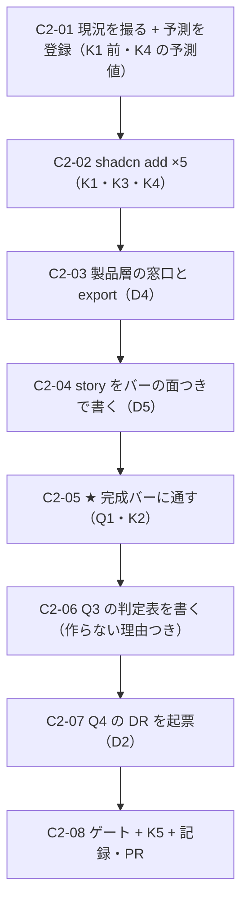

# 部品2 — 役割 9 カテゴリの充足（**部品軸**の 2 本目）

> 🟥 **前提: [部品1](部品1_完成バーを機械で閉じる.md) が先。**D1 = **C → B**（ユーザー判断 2026-08-09）の **B** がこれ。
> **バーの無いまま部品を増やすと借金が増える**——いま 39 部品で a11y 違反 93 件（出荷物の棚）。
> **本文書の部品はすべて、部品1 で定義した完成バーを通してから出荷する。**
>
> 実測の記録先: [実行記録.md](../実行記録.md) §部品2

---

## 0. この回で答えを出す問い（観測項目）★最重要

| #      | 問い                                                                              | なぜ効くか（どの判断が変わるか）                                                                                                                                                                                                                                                                                                                                                                                                       |
| ------ | ----------------------------------------------------------------------------------- | --- |
| **Q1** | ★★ **完成バーは、新しく作る部品に対して機能するか**                               | ★ **部品1 は既存 39 件に「後から」バーを当てた。**本回は**最初からバーを通す**——**順序が違う。**🟥 **一発で通るなら、バーは「作りながら守れる」形になっている。**通らないなら**バーは検査であって設計指針になっていない**（＝ 後追いでしか使えない）。**これがバーの 2 度目の検算**（部品1 Q5 は「既存の借金量」で検算した） |
| **Q2** | ★ **依存 0 の 5 件は「入れるだけ」で済むか**                                      | 🟦 **着手前実測でレジストリの依存が 0 と分かっている**（Radio Group / Switch / Slider / Progress / Avatar）。🟥 **だが「依存 0」と「無変更で入る」は別**——[DR-0010](../DR/DR-0010-shadcn-invents-values.md)（**shadcn 自身が任意値を発明する**）があり、工程4 では `field.tsx` が**ベースラインに一度も出ていない lint 規則**を持ち込んだ。★ **素材層の diff 0 行は 8 手＋工程0〜4 の連続記録**——**崩れるかを数える** |
| **Q3** | ★★ **shadcn に無い 8 件は部品になるか**（IconButton / FAB / FileUpload / List / Tree / Tag / Statistic / Stepper ほか） | ★ **[DR-0088](../DR/DR-0088-core-subject-boundary-is-decided-by-two-questions.md) の 2 問を、初めて「題材の需要が無い状態」で当てる。**これまでの判定は全部**画面が要求したから**始まった（工程3 のフィルタ帯、工程4 の `Field`）。🟥 **需要が無いときに 2 問が裁けるか**は未検証——**問 2「有限の語で言えるか」は言えてしまう部品が多い**（Statistic は「値 ＋ ラベル ＋ 増減」で閉じる）。**「言える」だけで作ってよいのかがここで問われる** |
| **Q4** | 🆕 🟥 **`combobox` が引く `@base-ui/react` をどう扱うか**                         | 🟥 **着手前実測の新発見**——shadcn の `radix-nova` style は**全部が radix ではない**。`combobox` は **`@base-ui/react`** を引く（`registryDependencies` は `button` / `input-group` で在庫）。★ **「素材源は shadcn 1 本」という前提が、shadcn の内側で崩れている**——[DR-0085](../DR/DR-0085-three-independent-scopes-decide-what-ships.md)（出荷入口）と同型の「**裏口**」。**工程6（2 つ目の素材源を入れる判断）の前哨戦がここで出た** |
| **Q5** | **製品層の窓口はどこまで要るか**                                                  | 手3 D1=(c)「**欠落品 ＋ 既定値ラッパー**」が規則で、`Table` のように**素通しの再輸出だけ**の部品もある。★ **5 件それぞれで「素通しでよいか / ラッパーが要るか」が割れるはず**——**割れ方が規則の解像度を測る**。🟨 [DR-0070](../DR/DR-0070-product-layer-boundary-rule.md)（見た目の管轄権はコア）が判定軸 |

> **Q1 が本体**（バーの実運用テスト）、Q3 が思想への一番重い問い、Q4 が新発見。
> 🟥 **この回で Chart と Toast は入れない**（D6 に理由を書く）。**`/design-sync` も打たない**（同期軸は保留中）。

### 0.1 赤テストの設計

| 検体   | 中身                                                                                            | 期待                                                                     | 外れたときの意味                                                                                                                                                                             |
| ------ | ------------------------------------------------------------------------------------------------- | -------------------------------------------------------------------------- | --- |
| **K1** | 🟥 `shadcn add` の**直前に `git status` を撮り、直後に既存 24 件の diff を数える**              | 🟥 **既存 24 件は 0 行のはず**（連続記録 8 手＋工程0〜4）                | 1 行でも動いたら**そこで止めて記録する**。★ **`shadcn add` は依存部品を巻き込む**——工程4 では `field` の regDeps が既存 `label.tsx` の上書きを聞いてきて**対話で止まり、exit 0 のまま部品が書かれなかった** |
| **K2** | ★★ **新部品を完成バーに通す**（部品1 で定義したもの。a11y critical 0 ／ 状態面 ／ 語彙 prop の効果） | 🟥 **一発で通るはず**（バーが設計指針として機能しているなら）             | 通らないなら **Q1 が「バーは後追い検査でしかない」に倒れる**。🟦 **その結果自体が成果**——**バーに「作るときに見る欄」が足りていない**ことが分かる                                          |
| **K3** | 🟥 `package.json` の `dependencies` を before / after で diff                                    | 🟥 **1 件も増えないはず**（5 件とも `dependencies: []`）                 | 増えたら**レジストリの実測が古い**か、**巻き込みで別の部品が入った**。★ **工程4 の一般則**「出荷物に依存を 1 件足すことは、使い回し先全部がその依存を取ること」に直接抵触する               |
| **K4** | **新部品に任意値クラスが含まれていないか**（[DR-0010](../DR/DR-0010-shadcn-invents-values.md)） | 🟥 **eslint の error が増えるはず**（`no-arbitrary-value`）。**予測値を C2-01 で先に書く** | 🟥 **予測より少ないほうが危ない**——射程に入っていない可能性。**増えた分を ignore で消さない**（内訳こそが成果物）                                                                          |
| **K5** | **出荷入口 4 本**（JS の到達可能性 ／ dts の `include` ／ `publicDir` ／ story の `title`）      | コアの新部品だけが増え、**題材は 0 件**                                  | 🟥 **`node tools/title-map-check.mjs` も回す**（同期は打たないが、**入口 4 本目の整合は保つ**）                                                                                              |

---

## 1. 前提と着手前実測（2026-08-09・`main` = `923004a`）

### 1.1 ★ shadcn レジストリの依存を実測した（`radix-nova` style）

**手法**: `https://ui.shadcn.com/r/styles/radix-nova/<name>.json` を直接引いた（`.context/reg.mjs`）。
工程4 が `field` vs `form` でやった手口と同じ。

| 部品            | `dependencies`                | `registryDependencies`            | 判定                                   |
| --------------- | ----------------------------- | --------------------------------- | -------------------------------------- |
| `radio-group`   | 🟦 **[]**                     | []                                | 🟦 **そのまま入る**                    |
| `switch`        | 🟦 **[]**                     | []                                | 🟦 **そのまま入る**                    |
| `slider`        | 🟦 **[]**                     | []                                | 🟦 **そのまま入る**                    |
| `progress`      | 🟦 **[]**                     | []                                | 🟦 **そのまま入る**                    |
| `avatar`        | 🟦 **[]**                     | []                                | 🟦 **そのまま入る**                    |
| `spinner`       | 🟦 []                         | []                                | 🟨 思想の 9 カテゴリに無い（→ D7）     |
| `kbd`           | 🟦 []                         | []                                | 🟨 同上                                |
| `native-select` | 🟦 []                         | []                                | 🟨 `Select` と重複                     |
| `toggle`        | 🟦 []                         | []                                | 🟨 思想に無い                          |
| `toggle-group`  | 🟦 []                         | `toggle`（**新規**）              | 🟨                                     |
| `button-group`  | 🟦 []                         | `separator`（🟦 在庫）            | 🟨 IconButton の代替候補（→ D3）       |
| `item`          | 🟦 []                         | `separator`（🟦 在庫）            | 🟨 `List` の代替候補（→ D3）           |
| `input-group`   | 🟦 []                         | `button` / `input` / `textarea`（🟦 **全部在庫**） | 🟨                     |
| 🟥 `combobox`   | 🟥 **`["@base-ui/react"]`**   | `button` / `input-group`          | 🟥 **別の primitive 源を引く**（→ Q4・D2） |
| 🟥 `sonner`     | 🟥 **`["sonner","next-themes"]`** | []                            | 🟥 **工程4 D8 で却下済み**（→ D6）     |
| 🟥 `chart`      | 🟥 **`["recharts@3.8.0"]`**   | []                                | 🟥 **工程6 の論点**（→ D6）            |
| `date-picker`   | — **HTTP 404**                | —                                 | 🟨 **単体では存在しない**（`calendar` ＋ `popover` の合成レシピ。**両方在庫**） |
| `typography`    | — **HTTP 404**                | —                                 | 🟨 **単体では存在しない**（docs のみ） |

★★ 🟥 **Q4 の新発見: `combobox` は `@base-ui/react` を引く。**
**`style: radix-nova` を選んだので素材源は radix 1 本、という前提が shadcn の内側で崩れている。**
🟦 **在庫の 24 件には混入していない**（実測: `package.json` に `@base-ui/*` は無い）が、
**`combobox` / `input-group` 系を足すと裏口から 2 つ目の primitive 源が入る。**

### 1.2 思想の 9 カテゴリ — 欠落と、その素性

| カテゴリ      | 🟥 欠落                          | shadcn                         | この回の扱い                    |
| ------------- | -------------------------------- | ------------------------------ | ------------------------------- |
| Selection     | **Radio**                        | `radio-group`（依存 0）        | ★ **入れる**                    |
| Selection     | **Switch**                       | `switch`（依存 0）             | ★ **入れる**                    |
| Selection     | **Slider**                       | `slider`（依存 0）             | ★ **入れる**                    |
| Communication | **Progress**                     | `progress`（依存 0）           | ★ **入れる**                    |
| Display       | **Avatar**                       | `avatar`（依存 0）             | ★ **入れる**                    |
| Selection     | **DatePicker**                   | 🟨 404（`calendar`＋`popover` の合成） | 🟨 **D1 で判断**（在庫で足りる） |
| Selection     | FileUpload                       | ✗                              | Q3（作るか）                    |
| Action        | IconButton / FAB                 | ✗（`button-group` が近い）     | Q3                              |
| DataDisplay   | List / Tree / Tag / Statistic    | ✗（`item` が近い・Tag≒Badge） | Q3                              |
| Navigation    | Stepper                          | ✗                              | Q3                              |
| Display       | Text/Heading / Icon / Image      | ✗（🟦 `lucide-react` は既に `dependencies`） | Q3      |
| Communication | **Toast**                        | 🟥 `sonner` → **next-themes**  | 🟥 **入れない**（D6）           |
| DataDisplay   | **Chart**                        | 🟥 `chart` → **recharts**      | 🟥 **入れない**（工程6・D6）    |

🟦 **`calendar` は在庫にあるのに製品層の窓口も story も無い**（＝ **出荷していない在庫が 1 件**）。

### 1.3 ゲートのベースライン（`main` = `923004a`）

typecheck 🟦 緑 ／ lint 🟥 **error 42 / warning 1** ／ build 🟦 緑・dist **74**・`design.mjs` **83,784 B** ／
format 🟦 緑 ／ spell 🟦 **308** ／ storybook 🟦 緑・story **49 ファイル / 80 件** ／
🆕 **a11y**（部品1 で台帳化）: 出荷物の棚 **93 件**（critical 14 / serious 79）

---

## 2. 着手前に決めること（判断ポイント）

> 🟨 **全件、推奨どおりの Claude 判断（事後承認待ち）・全件 🟦 戻せる。**
> ★ **D1 の親（需要の出どころ）は決着済み**——[部品1 D1](部品1_完成バーを機械で閉じる.md) = **C → B**（ユーザー判断 2026-08-09）。
> 実行中に §2 に無い選択肢が出たら、**その場で決めずにここへ追記してから進む**。

| #      | 論点                                                                | 選択肢                                                                                                                    | 決定                        | 根拠                                                                                                                                                                                                                                                                                                                                                                                                                                                    | 戻せるか |
| ------ | ------------------------------------------------------------------- | ------------------------------------------------------------------------------------------------------------------------- | --------------------------- | --- | -------- |
| **D1** | ★ **この回で入れる範囲**                                            | A: **依存 0 の 5 件だけ**（Radio / Switch / Slider / Progress / Avatar） ／ B: A ＋ **DatePicker**（在庫の合成） ／ C: 欠落を全部 | **A**                       | ★ **バーの実運用テスト（Q1）が本体なので、検体は「素直な 5 件」がよい。**🟥 **B の DatePicker は合成レシピ**（`calendar` ＋ `popover`）で、**shadcn が部品を配らない＝ こちらが設計する部分が大きい**——**Q1 の検体としては変数が多すぎる**（「バーを通らなかったのは新部品だからか、合成が難しいからか」が切り分けられない）。C は論外（Q3 の判定と Q1 の検算が混ざる）。→ **A。DatePicker は部品3 で扱う**（**在庫が 1 件遊んでいるので優先度は高い**） | 🟦 |
| **D2** | 🆕 ★★ 🟥 **`@base-ui/react` を引く部品をどう扱うか**（Q4）           | A: 引いてよい（shadcn の一部なので） ／ B: **引かない**（`combobox` / それに依る部品を入れない） ／ C: 引くかを個別に判断  | **B ＋ DR を起票**          | ★★ **工程4 の一般則がそのまま効く**——「**出荷物に依存を 1 件足すことは、使い回し先全部がその依存を取ること。器（依存 0）で済む形を先に探す**」（ユーザー判断・[DR-0092](../DR/DR-0092-the-core-holds-the-vessel-not-the-state.md) 由来）。🟥 **`@base-ui/react` は radix と同格の primitive 源**で、**引いた瞬間に素材源が 2 つになる**——[段取り §2](../工場の段取り.md) が「**shadcn 以来 2 つ目の素材源を入れる判断**」を**工程6 の重い判断**として置いているのに、**`combobox` を足すだけで裏口から入る。**🟦 **この回の 5 件は誰も引かない**ので実害は無いが、🟥 **「shadcn = radix 1 本」という前提が偽だと分かった**のは finding なので **DR を起票する**。C は却下——**個別判断にすると、次に誰かが `combobox` を足した日に静かに入る**（**文書だけで守るのは 16 回踏んだ形**） | 🟦 |
| **D3** | ★★ **shadcn に無い 8 件を作るか**（Q3）                             | A: 作る ／ B: **この回では作らず、[DR-0088](../DR/DR-0088-core-subject-boundary-is-decided-by-two-questions.md) の 2 問を当てた結果だけ書く** ／ C: 触らない | **B**                       | ★ **Q3 は「作れるか」ではなく「需要が無いときに 2 問が裁けるか」。**🟥 **判定を書くことと、作ることは別。**2 問を当てると **`Statistic`（値＋ラベル＋増減）や `Stepper`（段の並び）は「有限の語で言える」に落ちる**——**つまり 2 問だけでは「作れ」に倒れる。**★ **それが分かること自体が成果**（**2 問には「需要」の項が無い**という発見）。🟦 **CLAUDE.md の規律「『まだ作らない』と決めるときは理由を書く。回数は理由にならない」**に従い、**8 件それぞれに理由を書く**。C は却下（**判定を書かないと部品3 以降が同じ議論をやり直す**） | 🟦 |
| **D4** | **製品層の窓口の形**（Q5）                                          | A: 全部ラッパー ／ B: **手3 D1=(c) の規則をそのまま当てる**（既定値の上書きが要るものだけラッパー、他は素通し再輸出） ／ C: 窓口を作らず素材層を直接 export | **B**                       | **規則が既にある**——手3 D1=(c)「**欠落品 ＋ 既定値ラッパー**」／ D2=A（窓口 1 本）／ D3=B（`no-restricted-imports` で強制）。**新しく決めることは無い。**C は却下（**窓口 1 本の原則が壊れる**・lint が止める）。🟨 **5 件のうちどれがラッパーになるかは実装して分かる**——**割れ方が Q5 の答え** | 🟦 |
| **D5** | **story の形**                                                      | A: Default だけ ／ B: **部品1 の完成バーが要求する面を最初から置く** ／ C: 網羅的に全面                                   | **B**                       | ★ **これが Q1 の検体そのもの。**A は現状の 39 部品がそうなって**`States` を持つのが 2 件だけ**という結果になった。C は「対象 0 件で緑」を量産（`Progress` に `hover` は無い）。→ **B: バーの「対象外」欄に理由を書く形で埋める** | 🟦 |
| **D6** | **Toast / Chart を入れないことの記録**                              | A: 入れる ／ B: **入れない ＋ 理由を書いて残す**                                                                          | **B**                       | 🟥 **Toast**: `sonner` は **`next-themes`** を引き、**工程1 で外した Next が戻る**（工程4 D8 で実測済み・却下済み）。**同じ理由が 2 度目**なので**「今は作らない理由」として明文化する**。🟥 **Chart**: `recharts@3.8.0` を引く——**これは段取りが工程6 に置いた「2 つ目の素材源」の判断そのもの**で、**この回で決めてよい大きさではない**。🟦 **どちらも [DR-0077](../DR/DR-0077-abolish-the-two-occurrence-rule.md) 後の様式（回数ではなく中身の理由）で書く** | 🟦 |
| **D7** | **思想の 9 カテゴリに無い shadcn 部品**（`spinner` / `kbd` / `toggle` / `native-select` ほか） | A: この回で扱う ／ B: **扱わない**（カタログ表2 の「分類の外」に留める）                                                  | **B**                       | 🟥 **この回は「思想が挙げた部品の欠落を埋める」回**で、**思想に無いものを足すのは別の話**（**分類の改訂に近い**）。🟨 **ただし `spinner` は例外候補**——**部品1 の状態面に `loading` を入れるなら受け皿が要る**。→ **部品1 の D5（面の定義）が `loading` を採ったら、その時点で §2 へ追記して再判断する**（**先に決めない**） | 🟦 |

> 🆕 **以下の D8・D9 は C2-05 の実測で出た論点。**「実行中に §2 に無い選択肢が出たら、その場で決めずにここへ追記してから進む」に従って、**決める前に書いた。**

| #      | 論点                                                                | 選択肢                                                                                                                    | 決定                        | 根拠                                                                                                                                                                                                                                                                                                                                                                                                                                                    | 戻せるか |
| ------ | ------------------------------------------------------------------- | ------------------------------------------------------------------------------------------------------------------------- | --------------------------- | --- | -------- |
| **D8** | 🆕 ★★ 🟥 **`Slider` に名前を与える口が素材層に無い。どう塞ぐか**（C2-05 の実測） | A: **素材層 `src/components/ui/slider.tsx` を編集**して `aria-label` を thumb へ渡す ／ B: **製品層で `radix-ui` から組み直す**（素材層は 1 行も触らない） ／ C: 摘み 2 つの story だけ置く（＝ 逃げ） ／ D: `aria-input-field-name` を rule 単位で無効化 | **B**                       | 🟥 **実測**: `Slider/Default` と `Slider/States` が**バーに落ちた**（`aria-input-field-name`）。原因は **`<Slider aria-label="…">` が Root の `` に載るだけで thumb に届かないこと**——素材の `Slider` は Root / Track / Range / Thumb を**1 関数の中で閉じて**おり、**thumb に渡す口が 1 つも無い**。🟦 **摘み 2 つの `Range` だけ通ったのは Radix が `Minimum` / `Maximum` を自動で入れるから**（摘み 1 つだと `undefined`・[実測](../実行記録.md)）。★★ **これは [DR-0090](../DR/DR-0090-token-classes-were-silently-dropped-by-tailwind-merge.md) と同じ形**——**型は `aria-label` を受け、lint も story も緑で、作用だけが無い。**★ **D は却下**（「消したのではない」と言えない・[部品1 D3](部品1_完成バーを機械で閉じる.md) が `color-contrast` を外したときは**数える場所を移した**のであって消してはいない）。**C も却下**（バーが指した欠陥を story の書き方で隠すのは「対象 0 件で緑」そのもの）。**A vs B**: 🟨 **素材層 diff 0 行は 8 手＋工程0〜4 の連続記録**で、壊すなら理由が要る。★ **手3 D1=(c) の規則そのものが答えを持っている**——「**欠落品** ＋ 既定値ラッパー」。**名前を与えられない `Slider` は、出荷するデザインシステムから見て欠落品**なので、**B は規則の例外ではなく規則の適用。**🟦 **`Select.tsx` が先例**（素材層を 1 行も触らず製品層で `SelectTrigger` を昇格させた）。🟥 **B の代償は 2 つ**——① 約 45 行の写しができ、上流と乖離しうる ② **`slider.tsx` が誰にも使われない死んだファイルになり、その `no-arbitrary-value` 1 件がベースラインに残り続ける**（**内訳が実体と食い違う**）。**② は記録する** | 🟦 |
| **D9** | 🆕 ★ 🟥 **`bg-white` / `bg-black` を止める検査が無い**（C2-02 の副産物） | A: 触らない ／ B: **`PRIMITIVE_COLOR` に `white` / `black` を足し、赤テストで発火を確認する** ／ C: 文書に書くだけ         | **B**                       | 🟥 **実測（赤テスト）**: 製品層に `className="bg-white text-black"` と `className="bg-gray-500"` を並べて lint を回すと、**後者だけが落ちて前者は素通りする**。`PRIMITIVE_COLOR` の正規表現は `(slate\|gray\|…\|rose)-[0-9]` で、**`white` / `black` は数字を持たないので 1 つも当たらない。**🟥 **これが実害になっている**——`slider.tsx` の thumb が **`bg-white`**（テーマを持たない不透明色）で、**`no-arbitrary-value` にも `PRIMITIVE_COLOR` にも掛からない。**★ **C は却下**——**文書だけで守るのは 16 回踏んだ形。**🟦 **B の安全性**: `bg-black/10` は `dialog.tsx` / `sheet.tsx` にあるが**どちらも素材層**で、この規則は `src/components/ui/**` を `ignores` している＝ **新しい赤は出ない**（実測で確かめる） | 🟦 |
| **D10** | 🆕 ★★★ 🟥 **バーの実行エンジンに CSS が 1 行も当たっていなかった。**どうするか | A: **`vitest.config.ts` に `@tailwindcss/vite` を足す** ／ B: 面④ の測定を `play` ではなく別スクリプト（`tools/*-probe.mjs`）に置く ／ C: 面④ を「人が見る面」に降ろす | **A**                       | ★★★ **面④ を `play` で測ろうとして発覚した。**実測: `Switch` の幅が **0**（素の `<button>`）、`Avatar/sm` が **16px**（素の `小` の文字幅）、`Slider` の thumb 背景が **`rgba(0, 0, 0, 0)`**——**同じ 3 つを実ブラウザ（`storybook-static` ＋ Playwright）で測ると 24 / 24 / `rgb(255,255,255)` で全部正しい。**🟥 **落ちていたのは部品ではなく測定器。**原因は 1 つ: **`vitest.config.ts` は `vite.config.ts` から `resolve.alias` だけを引いており、`@tailwindcss/vite` プラグインを引いていなかった。**`preview.tsx` は `globals.css` を import しているが、その中身は `@import 'tailwindcss'` で、**展開するのはそのプラグイン**。★★ **`vitest.config.ts` の冒頭コメント自身が「jsdom は CSS を計算しないので実ブラウザにする」と書いている**——**理由に挙げた当のものが動いていなかった。**🟦 **部品1 の「critical 0」は無効にならない**（`button-name` 等は名前の有無しか見ず CSS に依存しない。依存するのは `color-contrast`＝ rule 単位で無効化済み と 面④）。**B は却下**——**バーの面④ は「🤖 機械」と定義済み**（[完成バー §1](../部品の完成バー.md)）で、**バーの外に出すと「読まれない目盛り」に戻る**（部品1 D7 と同じ理由）。**C も却下**（実効値は人が見て分かるものではない＝ DR-0090 は px を読んで初めて分かった） | 🟦 |

## 3. 成果物

- **素材層 ＋5 件**: `radio-group` / `switch` / `slider` / `progress` / `avatar`（🟥 **既存 24 件は 0 行**）
- **製品層の窓口**（D4=B の規則どおり・素通しかラッパーかは実装で割れる）＋ **story**（D5=B・バーの面つき）
- **`src/index.ts` の export** ＋ `.design-sync/config.json` の `componentSrcMap`（🟥 **同期は打たないが入口 4 本の整合は保つ**）
- **Q3 の判定表**: shadcn に無い 8 件に [DR-0088](../DR/DR-0088-core-subject-boundary-is-decided-by-two-questions.md) の 2 問を当てた結果 ＋ **作らない理由**
- 🟥 **DR 起票**: 「**shadcn の `radix-nova` は radix 1 本ではない**」（finding・Q4/D2）
- **記録**: [実行記録.md](../実行記録.md) §部品2 ／ handoff ／ [部品カタログ.md](../部品カタログ.md) の「実測」列を 24 → 29 に更新

## 4. 作業フロー

## 5. 手順

### C2-01 現況を撮る ＋ 予測を登録する

- **実行**: ゲート（§1.3）＋ a11y の台帳値を実測 ／ `git status` ／ `dist/` の before
- **判断**: 🟥 **K4 の予測値（`no-arbitrary-value` が何件増えるか）を先に書く**。★ **予測が実行されうるかを検算する**（工程3 で怠って [OBS-0014](../OBS/OBS-0014_同一ファイルに2キーを向けたときconverterが何をするか.md) を作った）

### C2-02 `shadcn add` ×5（K1・K3・K4）

- **実行**: `radio-group` `switch` `slider` `progress` `avatar`
- **検証**: 🟥 **既存 24 件の diff が 0 行**（K1）／ `dependencies` が 0 増（K3）／ lint の増分を数える（K4）
- **観測**: **Q2**
- **詰まったら**: 🟥 **対話プロンプトで止まることがある**（工程4 の `field` は `label.tsx` の上書き可否を聞いてきて、**`exit 0` のまま部品が書かれなかった**）。**終了コードを信用せず、ファイルの実在を確認する**

### C2-03 製品層の窓口と export（D4=B）

- **実行**: 手3 D1=(c) の規則を当てる（既定値の上書きが要るものだけラッパー）／ `src/index.ts` ／ `componentSrcMap`
- **観測**: **Q5**（5 件がどう割れたか）

### C2-04 story をバーの面つきで書く（D5=B）

- **観測**: **Q1** の前段。🟥 **「対象外」には理由を書く**

### C2-05 ★ 完成バーに通す（Q1・K2）

- **目的**: ★★ **この回の芯。**バーが**作りながら守れる形**か、**後追い検査でしかない**かが決まる
- **検証**: a11y critical 0 ／ 状態面 ／ 語彙 prop の効果（部品1 で定義したバー）
- **観測**: **Q1**。🟥 **通らなかった項目を全部書き出す**——**それがバーへの差分要求になる**

### C2-06 Q3 の判定表を書く（D3=B）

- **実行**: 8 件（IconButton / FAB / FileUpload / List / Tree / Tag / Statistic / Stepper ＋ Text/Icon/Image）に **2 問**を当てる
- **観測**: **Q3**。★ 🟥 **「2 問だけでは作れに倒れる」かを見る**——倒れたら **2 問に「需要」の項が無い**という発見（DR-0088 への差分）
- **判断**: **作らないものには理由を書く**（回数は理由にならない）

### C2-07 Q4 の DR を起票（D2=B）

- **実行**: 「**shadcn の `radix-nova` style は radix 1 本ではない**（`combobox` は `@base-ui/react` を引く）」を finding として起票
- **判断**: 🟥 **機械で守るか**——`package.json` に `@base-ui/*` が現れたら落ちる検査を置くか。**置くなら赤テストで発火を確認**（**文書だけで守るのは 16 回踏んだ形**）

### C2-08 ゲート ＋ K5 ＋ 記録・PR

- **検証**: ゲート 6 本 ＋ a11y の台帳 ＋ `node tools/title-map-check.mjs`（K5）／ `dist/` の diff 3 本
- **実行**: 実行記録 §部品2 ／ handoff ／ **部品カタログの「実測」列を 24 → 29** ／ PR（🟥 **マージは人**）

## 6. 完了条件

- [x] §0 の Q1〜Q5 に答えが出ている（🟥 **「測れなかった」も答え。理由を書く**）
- [x] §2 の D1〜D7 が決着し、根拠が書かれている（🆕 **実行中に D8・D9・D10 を追記して決着**）
- [x] 赤テスト K1〜K5 を打った（🟨 **K2 は「バーに通す」で、落ちた 2 件がそのまま結果**）
- [x] ★ **5 件すべてが完成バーを通っている**（🟥 **一発ではなく、`Slider` の 2 件を直してから**）
- [x] 🟥 **既存 24 件の diff が 0 行**（🟥 **ただし指標の限界を記録した**——`slider.tsx` は同コミットの新規なので git では 0 行だが、**上流との差分 2 箇所は実在する**）
- [x] 🟥 **`dependencies` が 0 増**（12 件のまま・`@base-ui/*` は 0 件）
- [x] Q3 の判定表がある（**11 件に理由がついている**・🟥 **2 問の限界という差分要求つき**）
- [x] Q4 の DR が起票されている（[DR-0093](../DR/DR-0093-shadcn-radix-nova-is-not-a-single-primitive-source.md)。🆕 **もう 1 本増えた**——[DR-0094](../DR/DR-0094-the-bar-engine-ran-without-any-css.md)）
- [x] 実行記録 §部品2 ／ handoff ／ 部品カタログが更新されている（🟨 **カタログは 18 → 29**——**6 件ぶん遅れていた**）
- [x] コミット済み・PR を出した

## 7. 出典

- **着手前実測（2026-08-09・`main` = `923004a`）**: `https://ui.shadcn.com/r/styles/radix-nova/<name>.json` を 18 件取得（`.context/reg.mjs`）。`components.json` の `style: radix-nova` / `iconLibrary: lucide`
- [部品カタログ.md](../部品カタログ.md)（63 部品の割り当て台帳・手1）／ [共通コンポーネント思想.md](../共通コンポーネント思想.md)（9 カテゴリ・🟥 ユーザーの持ち物）
- [部品1](部品1_完成バーを機械で閉じる.md)（完成バー・D1 = C → B の C）
- [DR-0088](../DR/DR-0088-core-subject-boundary-is-decided-by-two-questions.md)（2 問・Q3）／ [DR-0092](../DR/DR-0092-the-core-holds-the-vessel-not-the-state.md)（依存を足す判断の一般則・D2）／ [DR-0010](../DR/DR-0010-shadcn-invents-values.md)（K4）／ [DR-0070](../DR/DR-0070-product-layer-boundary-rule.md)（D4）／ [DR-0077](../DR/DR-0077-abolish-the-two-occurrence-rule.md)（D6 の様式）
- [工場の段取り.md](../工場の段取り.md) §2「足りない部品は性質が 3 種類に割れる」（(b) 外部ライブラリ＝工程6）
