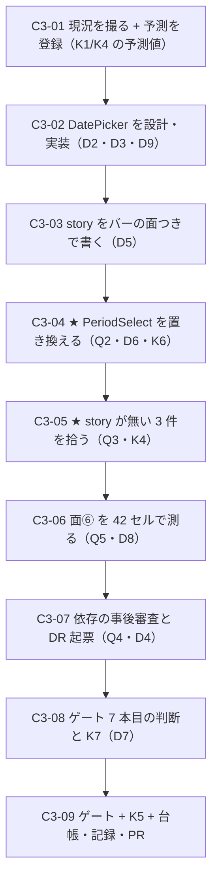

# 部品3 — DatePicker（在庫の合成）と、バーが見ていない 3 件

> 🟥 **前提: [部品1](部品1_完成バーを機械で閉じる.md)（バーの定義と機械化）と [部品2](部品2_9カテゴリの充足.md)（依存 0 の 5 件）が done。**
> 段取り上の位置づけ: [工場の段取り §3b](../工場の段取り.md) の**部品軸 3 本目**。
> 実測の記録先: [実行記録.md](../実行記録.md) §部品3

★★ **この回はこれまでの 2 本と性質が違う。**
**部品1 は「バーを作る」、部品2 は「shadcn が配る部品を入れる」だった。**
🟥 **部品3 は `shadcn add` を 1 度も打たない初めての回**——素材は**全部すでに在庫にあり**、
**足りないのは「合成の設計」だけ**（`date-picker` は[レジストリに存在しない](#71-着手前実測2026-08-09main--1c5bc0b)・HTTP 404）。

---

## 0. この回で答えを出す問い（観測項目）★最重要

| #      | 問い                                                                                     | なぜ効くか（どの判断が変わるか）                                                                                                                                                                                                                                                                                                                                                                                                                                                                                                                                                       |
| ------ | ---------------------------------------------------------------------------------------- | --- |
| **Q1** | ★★★ **shadcn が配らない部品を自分で設計したとき、完成バーは通るか**                       | ★ **部品2 の Q1 は「上流が配った部品を、バーを見ながら入れる」だった**（15 中 13 が一発）。🟥 **本回は上流の実装が 1 行も無い**——`date-picker` はレジストリ 404 で、**docs のレシピ（Popover ＋ Calendar ＋ Button）しかない**。★★ **バーの面④（語彙の効果）は「repo が定義した語彙」を要求するが、合成部品の語彙は誰も決めていない**——**語彙を自分で決める初めての部品**。**通らないなら、バーは「上流の部品を検品する道具」でしかない** |
| **Q2** | ★★★ **`DatePicker` を出荷したら、`PeriodSelect` は使う側に回るか**                        | 🟥 **合成レシピは既に repo の中で 1 度実装されている**——`PeriodSelect` が `custom` のときに **Popover ＋ Calendar を内蔵**している（[工程3 D13=A](工程3_共通シェル.md) の判断「外に出すと語彙は部品・逃げ道は画面に割れる」）。★ **`DatePicker` を出すと、その判断の前提が変わる**（外に出す先ができる）。**置き換えられるなら「部品を作ると既存が使う側に回る」の初めての実例**、**置き換えられないなら repo の内側で [OBS-0013](../OBS/OBS-0013_部品があるのにインラインスタイルで組んだ.md)（部品があるのに手組み）が再発する** |
| **Q3** | ★★ **story が 1 本も無かった 3 件に初めて目盛りを当てたら、何が出るか**                   | 🟥 **`Alert` / `Field` / `Textarea` は `src/index.ts` で export しているのに story が無く、[バーの全面が「対象 0 件で緑」](../部品の完成バー_台帳.md)。**★ **部品1 B1-05 が critical を 11 → 0 にしたのは「story がある部品」だけ**——**射程の外に何が溜まっていたかは誰も知らない。**★★ **critical 0 は保たれるか**が、**「バーの緑」がどこまでの主張なのかを決める** |
| **Q4** | 🟥 ★★ **`react-day-picker` / `date-fns` の 2 件は、出荷物の依存として妥当か**             | 🟥 **着手前実測の発見**——この 2 件は**工程3（`5a9abde`）で `calendar` と一緒に `dependencies` に入っている**が、🟥 **`calendar` は export されておらず、判断の記録も無い。**★★★ **[DR-0092](../DR/DR-0092-the-core-holds-the-vessel-not-the-state.md) の一般則「出荷物に依存を 1 件足すことは、使い回し先全部がその依存を取ること」は 2026-08-08（工程4）に立った**——**この 2 件はそれより前に、誰の判断でもなく入った。**🟥 **`DatePicker` を出荷すると、その 2 件が「使われる依存」として確定する**＝ **一般則を遡って当てる初めての機会** |
| **Q5** | ★ **面⑥（当たり判定 44px）は、この部品で初めて正面から効くか**                            | 🟥 **実測: `calendar.tsx` のセルは `--cell-size: --spacing(7)` = 28px**。**日付セルは 1 か月ぶんで 42 個並ぶ**——[DR-0049](../DR/DR-0049-hit-area-reaches-44px-only-at-default-size.md)（4 サイズ中 2 つが 44px 未達）と [OBS-0008](../OBS/OBS-0008_当たり判定44pxをどう扱うか.md)（open）の材料が、**1 部品で 42 個ぶん出る。**★ **バーは面⑥ を「人が見る」に置いた**（axe は 24px AA しか測らない・[DR-0034](../DR/DR-0034-touch-target-visual-32-hit-44.md)）——**人が見る面が初めて「見なければ出荷できない」重さになるか** |
| **Q6** | 🟨 **`locale`（曜日名・月名）はコアか題材か**                                             | ★ [DR-0088](../DR/DR-0088-core-subject-boundary-is-decided-by-two-questions.md) の **2 問の 3 度目の適用**。🟥 **`Calendar` は `locale` prop を持ち、既定は英語**（`date.toLocaleString(locale?.code, …)`）。★ **問① は通る**（Redmine を知らない repo でも意味が通る）が、**問② で割れる**——**言語は有限の語では言えない**。→ **器（prop で受ける）に落ちるはず**だが、🟥 **そうすると「日本語で出す」判断が題材側に無いまま消える**（5 画面はすべて日本語）。**2 問が「器」と答えたときに残る穴を見る** |

> **Q1 と Q2 が本体**（前者はバーの射程、後者は部品を作る意味そのもの）。
> **Q4 は事後審査**（既に払っている代金の妥当性）、**Q3 はバーの穴埋め**。
> 🟥 **この回でも `/design-sync` は打たない**（同期軸は保留中・[段取り §3b](../工場の段取り.md)）。**ただし出荷入口 4 本の整合は保つ**（K5）。

### 0.1 赤テストの設計

| 検体   | 中身                                                                                                                | 期待                                                                                    | 外れたときの意味                                                                                                                                                                                                                                       |
| ------ | ------------------------------------------------------------------------------------------------------------------- | --------------------------------------------------------------------------------------- | --- |
| **K1** | 🟥 **素材層 29 件の diff を数える**（`shadcn add` は打たないので、**動くとしたら我々の手**）                         | 🟥 **0 行**（連続記録：8 手＋工程0〜4＋部品2 は「新規追加のみ」）                       | 1 行でも動いたら**そこで止めて記録する**。★ **部品2 で 1 度崩れかけている**（`slider.tsx` の 2 箇所。**同コミットの新規なので git の diff には出なかった**＝ **K1 は「新規ファイルを見ない」という射程の限界を持つ**）——**本回は既存 29 件なので、その限界は掛からない** |
| **K2** | ★★ **`DatePicker` と 3 件の story を完成バーに通す**（面①②③④⑤）                                                   | 🟨 **一発では通らない見込み**（Q1・Q3 の予測は C3-01 で先に書く）                       | ★ **通ったら通ったで意味がある**——**部品2 で塞いだ穴（`aria-label` が届かない類）が effective だった証拠**。**通らなければ、落ちた項目がそのままバーへの差分要求**                                                                                     |
| **K3** | 🟥 **`package.json` の `dependencies` を before / after で diff**                                                    | 🟥 **0 増**（`react-day-picker` / `date-fns` は**既に在る**）                            | 増えたら**合成の設計が素材の範囲を超えている**。★ **本回は「依存を増やさずに部品が 1 件増える」ことの実証**でもある（[DR-0092](../DR/DR-0092-the-core-holds-the-vessel-not-the-state.md) の望ましい形）                                                |
| **K4** | ★★ 🟥 **story を足した 3 件から新しい a11y critical が出るか**（Q3）                                                 | 🟥 **予測を C3-01 で先に書く**（**`Field` / `Textarea` は入力系なので `label` 系が出る**に賭ける） | 🟥 **0 件だったら、それは「バーの射程外に借金は無かった」ではなく「予測が当たらなかった」**——**どちらかを言い切れる材料を先に用意しておく**（**`Input/States` は同じ理由で critical を出した**＝ B1-05 の実測） |
| **K5** | **出荷入口 4 本**（`src/index.ts` の到達可能性 ／ `.d.ts` ／ `publicDir` ／ story の `title`）                       | コアの新部品だけが増え、**題材は 0 件**                                                 | 🟥 **`node tools/title-map-check.mjs` を回す**（[DR-0091](../DR/DR-0091-claude-design-is-a-fourth-shipping-entrance.md)：**同期は打たなくても入口はズレる**）                                                                                            |
| **K6** | 🆕 ★ **`PeriodSelect` を `DatePicker` に置き換えたあと、既存 story が緑のままか**（Q2 の回帰）                       | 🟦 **`PeriodSelect` の 3 story が緑**・**`FilterBar` / `IssueList` も緑**                | 🟥 **落ちたら「合成の抽出」が既存の振る舞いを変えている**——**部品を出した代償**として記録する。★ **`PeriodSelect` は面④ を持つ**（`width` の語彙）ので、**置き換えで `field-*` が死んでいないかも同時に見る**（[DR-0090](../DR/DR-0090-token-classes-were-silently-dropped-by-tailwind-merge.md) の再発検査） |
| **K7** | 🆕 ★★ **ゲート 7 本目（`pnpm test-storybook`）を足したら、赤が伝播するか**（D7 が A のとき）                         | 🟥 **わざと 1 story を落として、ゲートが赤になることを確認する**                        | 🟥 **確認せずに足すのは「目盛りを書いて針を付けない」**——**部品1 B1-06 でその形を踏んだばかり**（面① は宣言だけで実装 0 行だった）                                                                                                                     |

---

## 1. 前提と着手前実測（2026-08-09・`main` = `1c5bc0b`）

### 1.1 ★ `date-picker` はレジストリに存在しない（実測）

**手法**: `https://ui.shadcn.com/r/styles/radix-nova/<name>.json` を直接引いた（部品2 §1.1 と同じ手口）。

| 部品          | HTTP    | `dependencies`                        | `registryDependencies` | 判定                                     |
| ------------- | ------- | ------------------------------------- | ---------------------- | ---------------------------------------- |
| `date-picker` | 🟥 **404** | —                                     | —                      | 🟥 **上流に実装が無い**（docs のレシピのみ） |
| `calendar`    | 200     | 🟥 `["react-day-picker@latest","date-fns"]` | `["button"]`      | 🟦 **在庫**（`src/components/ui/calendar.tsx` 222 行） |
| `popover`     | 200     | 🟦 `[]`                               | `[]`                   | 🟦 **在庫・出荷済み**                    |

★★ **つまり `DatePicker` は「欠落品」でも「既定値ラッパー」でもない第 3 の形**——
**素材は全部在庫にあり、足りないのは合成の設計だけ。**
🟥 **手3 D1=(c)「欠落品 ＋ 既定値ラッパー」は、この形を名前で持っていない**（→ D2 の根拠・Q1）。

### 1.2 🟥 依存 2 件は**判断の記録なしに**入っている（Q4 の材料）

```
$ git log --oneline -S"react-day-picker" -- package.json
5a9abde 工程3 — 共通シェル。チケット一覧が新土台で動いた（#10）
```

| 事実                                                | 実測                                                                     |
| --------------------------------------------------- | ------------------------------------------------------------------------ |
| `react-day-picker@10.0.1` / `date-fns@4.4.0` の出自 | 🟥 **工程3（`5a9abde`・2026-08-07）**。`calendar` を `shadcn add` した副産物 |
| `dependencies` に居るか                             | 🟥 **居る**（＝ **出荷物の依存**。使い回し先が全部取る）                  |
| `calendar` は export されているか                   | 🟥 **されていない**（`src/index.ts` L83 に「**PeriodSelect の内部実装なので出さない**」と明記） |
| 実際に使っているのは誰か                            | `react-day-picker` → `calendar.tsx` **1 箇所** ／ `date-fns` → **コア `PeriodSelect`** と**題材 `redmine/period.ts`** の 2 箇所 |
| [DR-0092](../DR/DR-0092-the-core-holds-the-vessel-not-the-state.md) の一般則が立った日 | **2026-08-08（工程4）**＝ 🟥 **この 2 件が入った翌日** |

★★★ 🟥 **「器（依存 0）で済む形を先に探す」という規則は、この 2 件には一度も当たっていない。**
**いま `DatePicker` を出荷することは、その 2 件を「使われる依存」として追認すること**（→ D4）。

### 1.3 🟥 合成レシピは既に repo の中で 1 度実装されている（Q2 の材料）

`src/components/Selection/PeriodSelect.tsx` L108-129 —— **`custom` のときだけ Popover ＋ Calendar が開く**:

```tsx
{value === 'custom' && (
  <Popover>
    <PopoverTrigger asChild><Button variant="outline">{range ? `… 〜 …` : '範囲を選ぶ'}</Button></PopoverTrigger>
    <PopoverContent align="start"><Calendar mode="range" selected={range} onSelect={…} /></PopoverContent>
  </Popover>
)}
```

🟨 **これは工程3 D13=A の判断**（「外に出すと**語彙は部品・逃げ道は画面**に割れ、画面ごとの再発明が起きる」）。
★ **`DatePicker` が出ると前提が変わる**——**外に出す先が「画面」ではなく「部品」になる。**

### 1.4 バーが見ていない出荷物（Q3 の対象・[台帳 §4](../部品の完成バー_台帳.md)）

| 部品       | 素材層              | 製品層の窓口                          | export | story        |
| ---------- | ------------------- | ------------------------------------- | ------ | ------------ |
| `Alert`    | `ui/alert.tsx`      | `Communication/Alert.tsx`             | 🟦 有  | 🟥 **無**    |
| `Field`    | `ui/field.tsx`      | `Layout/Field.tsx`                    | 🟦 有  | 🟥 **無**    |
| `Textarea` | `ui/textarea.tsx`   | `TextInput/Textarea.tsx`              | 🟦 有  | 🟥 **無**    |
| `calendar` | `ui/calendar.tsx`   | 🟥 **無**（`PeriodSelect` の内部実装） | 🟥 無  | 🟥 **無**    |

🟦 **素材 29 件のうち、製品層の窓口を持たないのは `calendar` ただ 1 件**（実測・全件走査）。
★ **`providers.tsx` は部品ではない**ので数えない（[DR-0037](../DR/DR-0037-providers-belong-to-product-layer.md)）。

### 1.5 ゲートのベースライン（`main` = `1c5bc0b`・2026-08-09 実測）

| ゲート                       | 実測                                                 |
| ---------------------------- | ---------------------------------------------------- |
| typecheck                    | 🟦 緑                                                |
| lint                         | 🟥 **error 50 / warning 1**（内訳は handoff の表）    |
| build                        | 🟦 緑・dist **84 ファイル**・`design.mjs` **91,322 B** |
| format:check                 | 🟦 緑                                                |
| spell                        | 🟦 **332 ファイル / 0 件**                           |
| storybook（story）           | 🟦 **54 ファイル / 106 件**                          |
| **バー（`test-storybook`）** | 🟦 **106 / 106 緑**                                  |
| a11y（出荷物の棚）           | 🟦 **critical 0** ／ 🟨 **serious 113・色の組 8 種類** |

🟨 **環境の注意（既知・[handoff §環境の再現](../handoff.md)）**: 非対話シェルでは `mise` が効かず `node -v` が **22.16.0** で
`cspell` が落ちる。**`export PATH="$HOME/.local/share/mise/installs/node/24.18.1/bin:$PATH"` を先に打つ**（実測で再現済み）。

---

## 2. 着手前に決めること（判断ポイント）

> 🟨 **D1〜D3・D5・D6・D8・D9 は推奨どおりの Claude 判断（事後承認待ち）。**
> 🟦 **D4 と D7 は 2026-08-09 にユーザー判断で決着した**——**どちらも推奨どおり（A）**（逐語: 「推奨で」）。
> **D4 = A（依存を追認し、finding の DR を起票する）** ／ **D7 = A（`pnpm test-storybook` をゲート 7 本目にする。🟥 K7 で赤の伝播を確かめてから）**。
> 実行中に §2 に無い選択肢が出たら、**その場で決めずにここへ追記してから進む**。

| #      | 論点                                                                    | 選択肢                                                                                                                                                                     | 決定                       | 根拠                                                                                                                                                                                                                                                                                                                                                                                                                                                                                                                                    | 戻せるか |
| ------ | ----------------------------------------------------------------------- | -------------------------------------------------------------------------------------------------------------------------------------------------------------------------- | -------------------------- | --- | -------- |
| **D1** | ★ **この回で扱う範囲**                                                  | A: `DatePicker` だけ ／ B: **`DatePicker` ＋ story が無い 3 件** ／ C: B ＋ 部品2 Q3 の「作れ」9 件から拾う                                                                 | **B**                      | ★ **3 件を拾うのは部品1 が決めた申し送り**（[部品1 §6](部品1_完成バーを機械で閉じる.md)「**部品を足す回で拾う**」）。🟦 **同じ回に入れる理由がある**——**`Field` と `Textarea` は入力系**で、**`DatePicker` も入力系**。**a11y の critical が出るとしたら同じ系統**なので、**1 回で切り分けたほうが原因が読める**。🟥 **C は却下**——**9 件には「作らない理由」を 1 件ずつ書いたばかり**（部品2 C2-06）で、**覆す材料がこの回に無い**。**回数ではなく材料で決める**（[DR-0077](../DR/DR-0077-abolish-the-two-occurrence-rule.md)） | 🟦 |
| **D2** | ★★★ **`DatePicker` の形**                                               | A: `mode="single"` だけ ／ B: **`mode` を語彙にして `single` と `range` を持つ** ／ C: `Calendar` を素通しで再輸出するだけ（合成は使う側）                                  | **B**                      | ★★ **Q2 が測れるのは B だけ。**A だと `PeriodSelect` の `range` を吸収できず、**合成の重複が残ったまま**になる（＝ Q2 が「測れなかった」で終わる）。🟥 **C は却下**——**素通しは「窓口 1 本」は満たすが、Popover とトリガ文言の合成を使う側が毎回書く**＝ **[OBS-0013](../OBS/OBS-0013_部品があるのにインラインスタイルで組んだ.md)（部品があるのに手組み）を repo の内側で再生産する**。★ **`mode` は有限の語**（`'single' \| 'range'`）で、[DR-0088](../DR/DR-0088-core-subject-boundary-is-decided-by-two-questions.md) の問② を通る。🟨 **上流 `react-day-picker` は `multiple` も持つが採らない**——**5 画面のどこにも需要が無く、[面③ の story を書けない](../部品の完成バー.md)**（「対象外」に書く理由が無い状態で語だけ増やすのは、**語彙を「使われないまま定義する」形**） | 🟦 |
| **D3** | **`Calendar` 単体を export するか**                                     | A: する ／ B: **しない**（`DatePicker` の内部実装に留める） ／ C: `DatePicker` と両方出す                                                                                   | **B**                      | ★ **手3 D2=A「窓口は 1 本」**がそのまま効く。🟥 **`Calendar` 単体は語彙を持たない**（`classNames` を 20 個以上受ける設定オブジェクトの塊で、**有限の語で言える形になっていない**）——**出すと使う側が `classNames` を書き始め、[DR-0032](../DR/DR-0032-layout-primitives-take-props-not-classname.md)（props が主・`className` は受けない）と衝突する**。🟨 **C の「両方出す」は Q2 を殺す**——**逃げ道があると `PeriodSelect` は置き換わらない**。🟦 **B でも在庫の遊びは解消する**（`calendar` が `DatePicker` 経由で出荷物に到達する） | 🟦 |
| **D4** | 🟥 ★★ **`react-day-picker` / `date-fns` を出荷物の依存として追認するか**（Q4） | A: **追認する**（既に `dependencies` に在り、`DatePicker` の出荷で「使われる依存」として確定させる） ／ B: 追認せず `date-fns` だけ外す（`format` を自前実装に置換） ／ C: 両方外す（カレンダーを自作） | 🟦 **A ＋ DR 起票**（**ユーザー判断 2026-08-09**） | ★★★ **[DR-0092](../DR/DR-0092-the-core-holds-the-vessel-not-the-state.md) の一般則を遡って当てる。**「**出荷物に依存を 1 件足すことは、使い回し先全部がその依存を取ること。器（依存 0）で済む形を先に探す**」——**この 2 件は規則より前に、判断の記録なしに入った**（§1.2）。🟥 **C は却下**——**カレンダーの自作は「有限の語で言えない」**（週の開始曜日・うるう年・月送り・キーボード操作・ARIA grid）。**器では済まない典型**で、[段取り §2](../工場の段取り.md) が「(b) 外部ライブラリ」に分類した側。🟨 **B は中途半端**——`date-fns` は **`react-day-picker` の regDep でもある**ので、外しても**間接依存として残る**（＝ 出荷物の重さは変わらず、コードだけ増える）。★ **A を選ぶが、「気づいたら入っていた」を「決めた」に変える**——**finding として DR を起票する**（**この形が他にも在るかを次に数えるため**）。🟥 **ユーザー確認に上げる理由**: **依存の追認は工場の出荷物そのものを決める**判断で、[工程4 D1](工程4_一覧から詳細_編集あり.md) が**同じ理由でユーザー判断に上がった**（そのとき答えは「UI はできるだけ純粋に保つ」＝ **B 寄り**だった）——**今回はその答えと逆向きに見える**ので、**Claude が単独で倒してはいけない** | 🟨 **A は戻せる**（export をやめれば依存は再び「使われない」に戻る）。**C は不可逆に近い** |
| **D5** | **story の形**                                                          | A: Default だけ ／ B: **バーの面を最初から置く**（部品2 D5=B と同じ） ／ C: 網羅                                                                                            | **B**                      | ★ **部品2 で機能した形をそのまま使う**（15 中 13 が一発で通り、**落ちた 2 件が本物の欠陥だった**）。🟥 **面③ の「対象外」には理由を書く**（[バー §4](../部品の完成バー.md)）。🟨 **3 件（`Alert` / `Field` / `Textarea`）も同じ形で書く**——**Default だけ置くと、いま在る 34 件の借金を 3 件増やすだけ**になる | 🟦 |
| **D6** | ★ **`PeriodSelect` を `DatePicker` に置き換えるか**（Q2 の実行）        | A: **置き換える** ／ B: 置き換えず、両方在ることを記録する ／ C: `PeriodSelect` を捨てて `DatePicker` に統合                                                                | **A**（🟥 **K6 で回帰を測る**） | ★★ **Q2 は「置き換えられるか」なので、置き換えないと答えが出ない。**🟥 **C は却下**——**`PeriodSelect` の本体は「期間の語彙」**（`PERIOD_PRESETS` の有限 union ＋ 逃げ道）で、**`DatePicker` とは別の部品**（[工程3 D3=C](工程3_共通シェル.md)）。**統合すると有限語彙が消える**。🟨 **B は「測ったが直さない」**で、**この repo が 16 回踏んだ「文書だけで守る」形**。★ **A の代償は回帰リスク**——だから **K6 を先に置く**（`PeriodSelect` の面④＝`width` の語彙が死なないかを含む） | 🟦 |
| **D7** | 🟥 ★★ **`pnpm test-storybook` をゲート 7 本目にするか**（部品1 D7=C の積み残し） | A: **足す** ／ B: 足さない ／ C: 足すが `--project=storybook` を CI 限定にする                                                                                              | 🟦 **A**（**ユーザー判断 2026-08-09**） | ★ **部品1 D7=C が付けた条件は「critical を 0 にしてから」で、[満たされている](../部品の完成バー_台帳.md)**（critical 0 ／ **バー 106/106 緑**）。🟥 **足さないと「実行し忘れる経路」が残る**——**面① も面④ もこのコマンドの中でしか走らない**（`build-storybook` は [story が実行時に落ちても exit 0](../DR/DR-0048-build-storybook-does-not-render.md)）。🟨 **代償は所要時間**（実測 **11.5 秒**＋ setup 58 秒 ＝ **約 70 秒**。既存 6 本の合計より重い）。★ **C は却下**——**CI は無い**（この repo の機械ゲートは手元で回す 6 本）。🟥 **ユーザー確認に上げる理由**: **ゲートの本数は CLAUDE.md に書かれた規約**で、**全工程・全セッションに効く**。🟥 **足すなら K7 で「赤が伝播する」ことを確かめてから**——**確認せずに足すのは部品1 B1-06 で踏んだ「目盛りを書いて針を付けない」形** | 🟦 |
| **D8** | ★ **面⑥（44px）をこの回でどう扱うか**（Q5）                             | A: 測って**台帳に載せるだけ**（落とさない） ／ B: `--cell-size` を広げて 44px にする ／ C: 触らない・測らない                                                              | **A**                      | 🟥 **B は ① 層の決定**——`--cell-size` は `--spacing(7)` = 28px で、**広げると月表示の横幅が 1.5 倍になり、Popover の中に収まるかが変わる**（**見た目の決定はユーザーの領分**）。★ **[OBS-0008](../OBS/OBS-0008_当たり判定44pxをどう扱うか.md) が open のまま**なので、**この回で倒すのは越権**。🟥 **C は却下**——**42 個並ぶ**のは repo 史上いちばん強い材料で、**測らないと OBS-0008 は永久に決まらない**。★ **A の実測値がそのまま OBS-0008 への入力**になる | 🟦 |
| **D9** | 🟨 **`locale` の扱い**（Q6）                                             | A: **prop で受ける**（既定は指定なし＝ブラウザ既定） ／ B: 日本語を既定にする ／ C: 受けない（英語固定）                                                                    | **A**                      | ★ **2 問を当てた結果**——問①「Redmine を知らない repo でも意味が通る」は**通る**、問②「有限の語で言えるか」は 🟥 **言えない**（言語は無限集合）→ **器（prop）**。🟥 **B は却下**——**「日本語」は題材（Redmine の 5 画面）の知識**で、**コアに入れると使い回し先が全部日本語になる**（[DR-0087](../DR/DR-0087-fetching-belongs-to-the-subject-layer.md) と同じ境界）。🟨 **ただし A には穴が残る**——**題材側で誰も `locale` を渡さないと、5 画面が英語のカレンダーを出す**。→ **題材の画面が渡す形にして、渡し忘れが起きるかを観測する**（Q6 の答えの一部） | 🟦 |

> 🆕 **以下の D10・D11 は C3-03 の実測（K2 の発火）で出た論点。**
> 「実行中に §2 に無い選択肢が出たら、その場で決めずにここへ追記してから進む」に従って、**決める前に書いた。**

| #       | 論点                                                                        | 選択肢                                                                                                                                                       | 決定           | 根拠                                                                                                                                                                                                                                                                                                                                                                                                                                                                                                                              | 戻せるか |
| ------- | --------------------------------------------------------------------------- | -------------------------------------------------------------------------------------------------------------------------------------------------------------- | -------------- | --- | -------- |
| **D10** | 🆕 ★★★ 🟥 **`PopoverContent` は `role="dialog"` なのに名前が無い。どう塞ぐか** | A: `DatePicker` から `aria-label` を渡す（この部品だけ直す） ／ B: **製品層 `Popover.tsx` を素通しから昇格させ、`PopoverContent` に名前を型で要求する** ／ C: 素材層 `popover.tsx` を編集する ／ D: `aria-dialog-name` を rule 単位で無効化 | **B**          | ★★ 🟥 **実測（K2）**: `DatePicker/Open` が **`aria-dialog-name`** で落ちた——`#radix-_r_4_` が `role="dialog"` で `aria-label` も `aria-labelledby` も持たない。★★★ **これは `DatePicker` の欠陥ではなく `Popover` の欠陥**——**`Popover` を開く story がこれまで 1 本も無かった**（`Popover/Default` は開かず、`PeriodSelect/Custom` も閉じたまま）＝ **閉じた popover は DOM を持たないので axe の対象が 0 件**。🟥 **「対象 0 件で緑」の 17 例目**（工程3 から出荷している部品が、**一度も測られずに 2 日間出荷されていた**）。★ **A は却下**——**次に `Popover` を使う人が同じ穴に落ちる**（[OBS-0013](../OBS/OBS-0013_部品があるのにインラインスタイルで組んだ.md) と同型）。**C は却下**（素材層 diff 0 行の連続記録・**先例は `Select.tsx` が素材を 1 行も触らず製品層で昇格させた形**）。**D は却下**（部品1 D3 が `color-contrast` を外したときは**数える場所を移した**のであって消してはいない）。★★ **B を「必須の prop」にする理由**: 🟥 **既定の名前を持てない**——popover の中身は使う側が決めるので、コアが名乗れる名前が無い。**文書で「名前を付けてください」と書くのは 16 回踏んだ形**なので、**型で要求する**（面⑤「型の閉じ」の 2 例目・`SelectTrigger` の `className` を型から消したのと同じ手） | 🟦 |
| **D11** | 🆕 ★★ 🟥 **バーの面② は「定義」と「実装」が食い違っている**                  | A: **実装に合わせて定義を直す**（serious も落とす。`color-contrast` / `region` だけが rule 単位の例外） ／ B: 定義に合わせて実装を緩める（serious を全部通す） | **A**          | 🟥 **[完成バー §3](../部品の完成バー.md) は「serious は台帳に載せる（落とさない）」と書いている**が、**実装は `a11y.test: 'error'`** で、**無効化した 2 rule 以外は impact に関係なく落ちる。**★ **食い違いに今日まで気づかなかったのは、serious が 113 件とも `color-contrast`（無効化済み）だったから**——**例外が全量を覆っていて、規則の形が見えなかった。**★★★ **B は却下**——**今回まさにその「落ちない側」が本物の欠陥を捕まえた**（D10）。**緩めると `aria-dialog-name` は台帳の数字になって、誰も直さない。**→ **A: 定義のほうを実装に合わせる**（**「serious は落とさない」ではなく「`color-contrast` は rule 単位で無効化してある」が正しい記述**） | 🟦 |

---

## 3. 成果物

- **製品層 ＋1 件**: `src/components/Selection/DatePicker.tsx`（D2=B・`mode` は `'single' | 'range'`）
  ＋ `src/index.ts` の export ＋ 型（`DatePickerProps` / `DatePickerMode`）
- **story ＋4 ファイル**: `DatePicker` ／ 🆕 **`Alert` ／ `Field` ／ `Textarea`**（D5=B・バーの面つき）
- **`PeriodSelect` の書き換え**（D6=A・`custom` 分岐が `DatePicker` を使う側に回る）
- **`.design-sync/config.json`** の `componentSrcMap` ＋ `titleMap`（🟥 **同期は打たないが入口 4 本の整合は保つ**）
- 🟥 **DR 起票**: 「**出荷物の依存が、判断の記録なしに入っていた**」（finding・Q4/D4）
- 🟨 **[OBS-0008](../OBS/OBS-0008_当たり判定44pxをどう扱うか.md) への追記**（Q5/D8 の実測 42 個ぶん）
- **[台帳](../部品の完成バー_台帳.md) の更新**（44 → 48 部品・§4「バーが見ていない出荷物」は **4 件 → 0 件**）
- **記録**: [実行記録.md](../実行記録.md) §部品3 ／ [handoff](../handoff.md) ／ [部品カタログ.md](../部品カタログ.md)
- **（D7=A のとき）** `CLAUDE.md` の機械ゲートを 6 本 → **7 本**に更新

## 4. 作業フロー



## 5. 手順

### C3-01 現況を撮る ＋ 予測を登録する

- **目的**: **予測を先に書く**（[DR-0076](../DR/DR-0076-capture-the-run-not-just-the-output.md) の様式）
- **実行**: §1.5 のゲート ＋ `git status` ＋ `dist/` の before ＋ 素材層 29 件のハッシュ（K1 の基準）
- **判断**: 🟥 **K4 の予測を書く**——**`Alert` / `Field` / `Textarea` から a11y critical が何件出るか**。
  ★ **予測が実行されうるかを検算する**（工程3 で怠って [OBS-0014](../OBS/OBS-0014_同一ファイルに2キーを向けたときconverterが何をするか.md) を作った）
- **観測**: 全 Q の基準線

### C3-02 `DatePicker` を設計・実装（D2=B / D3=B / D9=A）

- **目的**: ★★ **上流の実装が無い部品を、バーを見ながら設計する**（Q1）
- **実行**: `src/components/Selection/DatePicker.tsx`。**語彙は `mode`（`'single' | 'range'`）と `width`**
  （🟨 **`width` は `FieldWidth` の既存語彙を再利用する**——`PeriodSelect` が使っている `field-sm/md/lg`）
- **検証**: 🟥 **語彙を足したら `src/lib/tw-merge.ts` にも足す**（[バー §5](../部品の完成バー.md)：写しが 2 箇所にあり機械で守られていない）
- **観測**: **Q1**・**Q6**
- **詰まったら**: 🟥 **製品層は任意値クラスを書けない**（`no-arbitrary-value`）。
  **部品2 D8 で「製品層で組み直す」が機械に拒まれた**（`size-3` と `transition-[…]`）——**同じ壁に当たったら §2 へ追記してから決める**

### C3-03 story をバーの面つきで書く（D5=B）

- **実行**: 面①（自動）／ 面②（a11y）／ 面③（`default` / `focus-visible` / `disabled` / `empty`。**対象外には理由**）／ **面④（`mode` と `width` の実効値）**
- **検証**: 🟥 **面④ は `play` で実効値を読む**——**生値を書かない**（[バー §5](../部品の完成バー.md)）。**`?.` を使わない**（`el()` は無ければ throw）
- **観測**: **Q1**（K2 の前段）
- **詰まったら**: ★★★ **面④ が全部 0 や素の値を返したら、まず `vitest.config.ts` の `@tailwindcss/vite` を疑う**（[DR-0094](../DR/DR-0094-the-bar-engine-ran-without-any-css.md)）

### C3-04 ★ `PeriodSelect` を置き換える（Q2・D6=A・K6）

- **目的**: ★★★ **この回の芯の 1 つ。**「部品を作ると、既存が使う側に回るか」
- **実行**: `custom` 分岐の Popover ＋ Calendar を `<DatePicker mode="range" …>` に置換
- **検証**: 🟥 **K6**——`PeriodSelect` の 3 story ／ `FilterBar` ／ 題材の `IssueList` が緑。
  **`PeriodSelect` の面④（`width` の語彙）が生きているか**も見る（[DR-0090](../DR/DR-0090-token-classes-were-silently-dropped-by-tailwind-merge.md) の再発検査）
- **観測**: **Q2**。🟥 **置き換えられなかった箇所を全部書き出す**——**それが「合成部品の抽出は何を落とすか」の答え**

### C3-05 ★ story が無い 3 件を拾う（Q3・K4）

- **目的**: ★★ **バーの射程外に何が溜まっていたかを初めて見る**
- **実行**: `Alert` / `Field` / `Textarea` の story を D5=B の形で書く
- **検証**: 🟥 **a11y critical が 0 のままか**（K4）。**出たら内訳を書く**——**「バーの緑」がどこまでの主張だったかが決まる**
- **観測**: **Q3**
- **詰まったら**: 🟨 **`Field` は「フォーム 1 枠の器」で単体では意味を持たない**（工程4 D14=A で `Layout` に置いた）——
  **`Input` と組んだ story になる**が、🟥 **それは `Field` を測っているのか `Input` を測っているのか**を story の説明に書く

### C3-06 面⑥ を 42 セルで測る（Q5・D8=A）

- **実行**: `storybook-static` ＋ Playwright（`hasTouch`）で **日付セル 42 個の当たり判定**を測る（[DR-0049](../DR/DR-0049-hit-area-reaches-44px-only-at-default-size.md) と同じ手法）
- **観測**: **Q5**。🟥 **落とさない**（D8=A）——**[OBS-0008](../OBS/OBS-0008_当たり判定44pxをどう扱うか.md) に実測を追記する**
- **判断**: **なし**（この回では倒さない）

### C3-07 依存の事後審査と DR 起票（Q4・D4）

- **実行**: 🟥 **D4 がユーザー判断で決着してから。**「**出荷物の依存が、判断の記録なしに入っていた**」を finding として起票
- **判断**: 🟥 **機械で守るか**——**`dependencies` が増えたら落ちる検査**を置くか。
  ★ **置くなら赤テストで発火を確認**（**文書だけで守るのは 16 回踏んだ形**）。
  🟨 **部品2 D2 で同じ論点が出て「検体が無い」で止まった**（`@base-ui/*` が 0 件）——**今回は既存 12 件が検体になる**

### C3-08 ゲート 7 本目の判断と K7（D7）

- **実行**: 🟥 **D7 がユーザー判断で決着してから。**A なら `CLAUDE.md` の機械ゲートを 7 本に更新
- **検証**: 🟥 **K7**——**わざと 1 story を落として、7 本目が赤になることを確認する**（**確認せずに足さない**）
- **判断**: 🟨 **B なら「足さない理由」を書く**（回数ではなく中身の理由・[DR-0077](../DR/DR-0077-abolish-the-two-occurrence-rule.md)）

### C3-09 ゲート ＋ K5 ＋ 台帳・記録・PR

- **検証**: ゲート 6（or 7）本 ＋ a11y の再計測 ＋ `node tools/title-map-check.mjs`（K5）／ `dist/` の diff 3 本
- **実行**: [台帳](../部品の完成バー_台帳.md)（**§4 が 4 件 → 0 件になるはず**）／ [実行記録](../実行記録.md) §部品3 ／ handoff ／ [部品カタログ](../部品カタログ.md) ／ PR（🟥 **マージは人**）
- **観測**: 🟥 **a11y の serious は「件数」ではなく「色の組の種類」で載せる**（[台帳 §5](../部品の完成バー_台帳.md)：件数は story 数に比例する）

## 6. 完了条件

- [x] §0 の Q1〜Q6 に答えが出ている（**全 6 問。答えは [実行記録 §部品3](../実行記録.md) の締めの表**）
- [x] §2 の D1〜D9 が決着し、根拠が書かれている（🟦 **D4・D7 はユーザー判断**「推奨で」・🆕 **実行中に D10・D11 を追記して決着**）
- [x] 赤テスト K1〜K7 を打った（🟦 K1 / K3 / K5 / K6 / K7 は期待どおり ／ 🟥 **K2 は 124 中 1 件が落ちた**＝ 本物の欠陥 ／ 🟥 **K4 は外れた**）
- [x] ★ **`DatePicker` と 3 件が完成バーを通っている**（🟥 **一発ではない**——`DatePicker/Open` が `aria-dialog-name` で落ち、**落ちたのは `Popover` だった**）
- [x] 🟥 **素材層 29 件の diff が 0 行**（K1・`git diff origin/main -- src/components/ui/` が空）
- [x] 🟥 **`dependencies` が 0 増**（K3・12 件のまま）
- [x] ★ **`PeriodSelect` が `DatePicker` を使う側に回っている**（D6=A・手組み約 20 行 → 6 行・K6 緑）
- [x] 🟥 **[台帳 §4](../部品の完成バー_台帳.md)「バーが見ていない出荷物」が 0 件**になっている
      （🆕 **代わりに §4.2「開かない状態」という新しい射程の外が見つかった**）
- [x] Q4 の DR が起票されている（[DR-0095](../DR/DR-0095-shipped-dependencies-arrived-without-a-decision.md)。🆕 **もう 2 本増えた**——[DR-0096](../DR/DR-0096-overlays-that-no-story-opens-are-invisible-to-every-check.md) / [DR-0097](../DR/DR-0097-an-exception-that-covered-the-whole-set-hid-the-rule.md)）
      ／ Q5 の実測が [OBS-0008](../OBS/OBS-0008_当たり判定44pxをどう扱うか.md) に入っている（🆕 [OBS-0017](../OBS/OBS-0017_意味色とfillの対比が全滅している.md) にも 9 組目を追記）
- [x] 実行記録 §部品3 ／ handoff ／ 台帳 ／ 部品カタログが更新されている
- [x] コミット済み・PR を出した（🟥 **マージは人**・[DR-0068](../DR/DR-0068-merge-through-pull-requests.md)）

### 🟨 やり残し（理由つき）

| # | やり残し | 理由 |
| --- | --- | --- |
| 1 | 🟥 **`DropdownMenu` / `Sheet` / `Tooltip` / `Select` の「開いた story」** | [DR-0096](../DR/DR-0096-overlays-that-no-story-opens-are-invisible-to-every-check.md) が名指しした**射程の外**。**本回の範囲（DatePicker ＋ 3 件）を超える**ので、**次の部品回で拾う**（`Popover` と同じ欠陥がある可能性は**測っていない**） |
| 2 | 🟨 **`dependencies` の増加を落とす検査** | [DR-0095](../DR/DR-0095-shipped-dependencies-arrived-without-a-decision.md) の経路を機械で塞ぐ案。**検体は作れる**（既存 12 件）が、**置く場所（lint か別スクリプトか）を決めていない** |
| 3 | 🟨 **面④ の定義に「実効値を持たない語彙」の欄が無い** | `mode` が測れないことは実行記録に書いたが、**バー本体の定義は直していない**——**1 例では形が決まらない**（次に振る舞いの語彙を持つ部品が出たら決める） |
| 4 | 🟥 **面⑥ の 42 セル未達は直していない** | **D8=A**（`--cell-size` は ① 層の決定＝ 5 画面の見た目が動く）。**判断は [OBS-0008](../OBS/OBS-0008_当たり判定44pxをどう扱うか.md) が持つ** |
| 5 | 🟨 **面③ の借金 33 件** | **D6=B（部品1）に据え置き**——一括では返さず、その部品を触るときに返す |

## 7. 出典

### 7.1 着手前実測（2026-08-09・`main` = `1c5bc0b`）

- **レジストリ**: `https://ui.shadcn.com/r/styles/radix-nova/{date-picker,calendar,popover}.json` を取得
  （`date-picker` = **HTTP 404** ／ `calendar` = 200・deps `["react-day-picker@latest","date-fns"]` ／ `popover` = 200・deps `[]`）
- **依存の出自**: `git log -S"react-day-picker" -- package.json` → `5a9abde`（工程3）
- **素材 29 件 × 製品層の窓口**: 全件走査で **窓口を持たないのは `calendar` 1 件**
- **story の欠落**: 製品層 / patterns / templates 全走査で **`Alert` / `Field` / `Textarea` の 3 件**（`providers.tsx` は部品でない）
- **ゲート**: §1.5 のとおり（**バー 106/106 緑**・`vitest --project=storybook --run` 実測 11.54 秒）

### 7.2 参照

- [部品の完成バー.md](../部品の完成バー.md)（面の定義）／ [部品の完成バー_台帳.md](../部品の完成バー_台帳.md)（44 部品の実測・§4 が本回の対象）
- [部品1](部品1_完成バーを機械で閉じる.md)（バーの機械化・D7=C の積み残し ＝ 本回 D7）／ [部品2](部品2_9カテゴリの充足.md)（Q3 の判定表・D5 の story の形）
- [DR-0092](../DR/DR-0092-the-core-holds-the-vessel-not-the-state.md)（依存を足す判断の一般則 ＝ D4）／ [DR-0088](../DR/DR-0088-core-subject-boundary-is-decided-by-two-questions.md)（2 問 ＝ D2・D9）
- [DR-0048](../DR/DR-0048-build-storybook-does-not-render.md)（`build-storybook` は落ちない ＝ D7 の根拠）／ [DR-0094](../DR/DR-0094-the-bar-engine-ran-without-any-css.md)（C3-03 の落とし穴）
- [DR-0034](../DR/DR-0034-touch-target-visual-32-hit-44.md) ／ [DR-0049](../DR/DR-0049-hit-area-reaches-44px-only-at-default-size.md) ／ [OBS-0008](../OBS/OBS-0008_当たり判定44pxをどう扱うか.md)（面⑥ ＝ D8）
- [工程3](工程3_共通シェル.md) D3=C / D13=A（`PeriodSelect` の語彙と内蔵の判断 ＝ Q2）
- [工場の段取り.md](../工場の段取り.md) §3b（部品軸）
