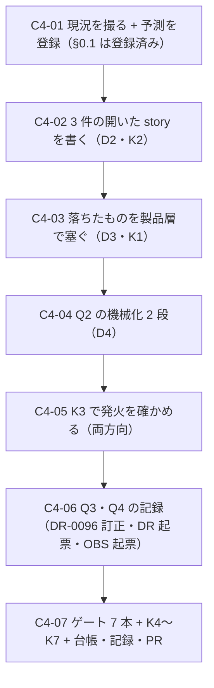

# 部品4 — 開かれない overlay を開く

> 🟥 **前提: [部品3](部品3_DatePickerと射程の外の3件.md) が done・[PR #17](https://github.com/yatami0/design/pull/17) マージ済み**（`1897a4e`）。
> 段取り上の位置づけ: [工場の段取り §3b](../工場の段取り.md) の**部品軸 4 本目**。
> 実測の記録先: [実行記録.md](../実行記録.md) §部品4

★★ **この回は「部品を足す回」ではない。**
**[DR-0096](../DR/DR-0096-overlays-that-no-story-opens-are-invisible-to-every-check.md) が名指しした射程の外を、実際に開いて何が出るかを見る回。**
🟥 **部品3 で `Popover` が 2 日間「名前の無い `role="dialog"`」を出荷していたことが出た**——
**閉じた overlay は DOM を持たないので、面①・面②・面④ が全部「対象 0 件で緑」になる。**

★★★ 🟥 **着手前実測で、DR-0096 の名指し 4 件のうち 1 件が外れていることが分かった**（§1.1）。
**この回の問いは「開けば何が出るか」（Q1）だけでなく、「なぜ数え間違えたか」（Q3）を含む。**

---

## 0. この回で答えを出す問い（観測項目）★最重要

| # | 問い | なぜ効くか（どの判断が変わるか） |
| --- | --- | --- |
| **Q1** | ★★★ **開いた状態を初めて描いたとき、3 部品（`DropdownMenu` / `Sheet` / `Select`）は何を落とすか** | 🟥 **[DR-0096](../DR/DR-0096-overlays-that-no-story-opens-are-invisible-to-every-check.md) §影響 の「🟥 推論（未検証）」をそのまま検体にする**——「同種の欠陥があるかは測っていない」「`Sheet` は `SheetTitle` が紐づく見込みだが確かめていない」。★★ **`Popover` の 1 件が偶然か系統かはここで決まる**——**3 件とも緑なら「`Popover` 固有の穴」、1 件でも落ちれば「shadcn の overlay 全般が名前を配線していない」**。★ **後者なら塞ぎ方は部品単位ではなく規約になる** |
| **Q2** | ★★★ **「開いた story を持つこと」を機械で要求できるか** | 🟥 **DR-0096 が「未検討」と明記した唯一の項**（「開閉を持つ部品の一覧を機械が知る方法」）。★★ **これが解けないと、次に overlay を足した人が同じ穴に落ちる**——**そして落ちたことが誰にも見えない**（story を書かなければ検査の対象が 0 件だから）。★★★ **この repo が 17 回踏んだ「対象 0 件で緑」のうち、本件は「検体そのものが存在しない」型**で、**既存のどのゲートも構造上見つけられない**（lint は書かれたコードしか見ず、バーは描かれた DOM しか見ない）。**「無いこと」を落とす検査は 1 本も無い** |
| **Q3** | ★★ 🟥 **DR-0096 の名指しはなぜ 1 件外れたか**（`Tooltip` は手5 から開いていた） | 🟥 **着手前実測（§1.1）**: `Tooltip/AlwaysOpen` は **`<Tooltip open>`** で、実測すると `[data-slot="tooltip-content"]` が **1 件・`role="tooltip"`** で portal に出ている。★★ **DR-0096 は「開く story を持つのは 2 件だけ」と書いたが、実際は 3 件だった**——**数えたのが「story 名に Open が付くか」だったから**（`Dialog/Open` / `DatePicker/Open` は当たり、`Tooltip/AlwaysOpen` は外れた）。★★★ **これは「射程の外を数える」こと自体が目視だったという指摘**で、**Q2 の答え（機械化）がそのまま Q3 の再発防止になる** |
| **Q4** | ★ **開閉以外に「story が一度も描いていない状態」があるか** | 🟥 **着手前実測**: `Sidebar` は `open` / `openMobile` の 2 つの状態を持ち、**mobile では中身が `Sheet`（portal）に出る**が、story は `Default`（デスクトップ・展開）**1 本だけ**。★ **`collapsed` も mobile も一度も描かれていない**＝ **DR-0096 と同じ形が overlay の外にもある**。★★ **この回で直すかは D1 で決める**——**測るだけでも「射程の外」の全体像が 1 段はっきりする** |
| **Q5** | 🟨 **開いた状態で、面② 以外の面は何を言うか** | ★ **部品3 では面② だけが落ちた**（`aria-dialog-name`）。**面①（描画された）は portal を見るので通り、面④（語彙の効果）は開いた中身に語彙が無いので掛からない。**🟥 **開いた状態は面③（状態面）の `default` に相当するのか、別の面なのか**が定義されていない——**[台帳 §4.2](../部品の完成バー_台帳.md) が「開かない状態」という欄を新設したばかり**で、**この回がその欄の 1 回目の運用**になる |

> **Q1 と Q2 が本体。**前者は「`Popover` の欠陥は系統か」、後者は「同じ穴を機械で塞げるか」。
> **Q3 は方法への指摘**（数え方が目視だった）、**Q4・Q5 は射程の輪郭**。
> 🟥 **この回でも `/design-sync` は打たない**（同期軸は保留中）。**ただし出荷入口 4 本の整合は保つ**（K5）。

### 0.1 赤テストの設計と**予測の登録**（🟥 実行前に書く・[DR-0076](../DR/DR-0076-capture-the-run-not-just-the-output.md) の様式）

| 検体 | 中身 | 🟥 **予測**（実行前に登録） | 外れたときの意味 |
| --- | --- | --- | --- |
| **K1** | **素材層 29 件の diff を数える** | 🟦 **0 行**（連続記録：8 手＋工程0〜4＋部品2・部品3） | 1 行でも動いたら**そこで止めて記録する**。★ **塞ぎ方は製品層で昇格させる**（部品3 D10=B・`Select` / `Popover` の先例） |
| **K2** | ★★★ **`DropdownMenu` / `Sheet` / `Select` の「開いた story」をバーに通す**（Q1） | 🟥 **`DropdownMenu` は落ちる**——`DropdownMenuContent` は `role="menu"` を出すが、**`DropdownMenuLabel` は role を持たない `
`** なので **`aria-required-children`（critical）** が出るほうに賭ける ／ 🟦 **`Sheet` は通る**（Radix の `Dialog` 系で `SheetTitle` が `aria-labelledby` に自動で紐づく＝ DR-0096 の推論と同じ） ／ 🟨 **`Select` は通る**（`role="listbox"` の子が `role="option"` で揃う） | 🟥 **3 件とも緑なら、`Popover` の欠陥は「系統」ではなく「1 部品の穴」**——**Q1 の答えが反転し、[DR-0096](../DR/DR-0096-overlays-that-no-story-opens-are-invisible-to-every-check.md) の poc_feedback（規約化）の根拠が 1 例だけになる**。★ **予測が当たっても外れても Q1 には答えが出る**——**外れたときだけ「なぜ外れたか」を書く** |
| **K3** | ★★★ **Q2 の機械化を赤テストで発火させる**（D4 が A 以外のとき） | 🟥 **開いた story を 1 本消したら検査が赤・戻したら緑** | 🟥 **確認せずに置くのは「目盛りを書いて針を付けない」**——**部品1 B1-06 と部品3 K7 で 2 回踏んだ形**。★ **本件はとくに危ない**——**「無いことを落とす検査」は、自分自身が「対象 0 件で緑」になりやすい** |
| **K4** | **既存 124 story が緑のまま**（回帰） | 🟦 **124 + 新規が全部緑** | 🟥 **落ちたら、開いた overlay が他の story の DOM に漏れている**（portal は `document.body` 直下なので、閉じ忘れると次の story に残る）——**バーの実行順序への依存**が出たことになり、それ自体が発見 |
| **K5** | **出荷入口 4 本**（`src/index.ts` の到達可能性 ／ `.d.ts` ／ `publicDir` ／ story の `title`） | 🟦 **コアの story だけが増え、題材は 0 件** | 🟥 `node tools/title-map-check.mjs` を回す（[DR-0091](../DR/DR-0091-claude-design-is-a-fourth-shipping-entrance.md)） |
| **K6** | **`package.json` の `dependencies` を before / after で diff** | 🟦 **0 増**（12 件のまま・story を足すだけ） | 増えたら**この回の設計が範囲を超えている** |
| **K7** | 🟥 **予測していない箇所が 1 件以上出るか**（DR-0076 の様式・工程4 で 5 件・部品2 で 4 件） | 🟥 **出る**に賭ける | **0 件だったら、それ自体が初めて**——**「予測の網が初めて全部を覆った」か「観測が浅かった」のどちらか**を書く |

---

## 1. 前提と着手前実測（2026-08-09・`main` = `1897a4e`）

### 1.1 ★★★ 🟥 DR-0096 の名指し 4 件のうち 1 件は外れている（Q3 の材料）

**手法**: ① `src/components/ui/*.tsx` から `Primitive.Portal` を含むファイルを全件走査
② story 全 58 ファイルから `open` / `defaultOpen` / `play` で開くものを全件走査
③ 🟥 **`Tooltip/AlwaysOpen` は実際に走らせて DOM を数えた**（一時 story・測ったら消した）

| 素材 | portal | 開く story | 実測 |
| --- | --- | --- | --- |
| `dialog.tsx` | 🟦 有 | 🟦 **`Dialog/Open`**（`defaultOpen`） | — |
| `popover.tsx` | 🟦 有 | 🟦 **`DatePicker/Open`**（`play` で click・部品3） | — |
| `tooltip.tsx` | 🟦 有 | 🟥 **`Tooltip/AlwaysOpen`**（`<Tooltip open>`・**手5 から**） | 🟦 **`[data-slot="tooltip-content"]` が 1 件・`role="tooltip"`**（実測） |
| `dropdown-menu.tsx` | 🟦 有 | 🟥 **無**（`Default` はトリガのみ） | 🟥 **検査の対象 0 件** |
| `sheet.tsx` | 🟦 有 | 🟥 **無**（`Default` はトリガのみ） | 🟥 **検査の対象 0 件** |
| `select.tsx` | 🟦 有 | 🟥 **無**（`Default` / `Widths` ともトリガのみ） | 🟥 **検査の対象 0 件** |

★★★ 🟥 **DR-0096 は「開く story を持つのは 2 件だけ」「`Tooltip` の中身はいまも開かれていない」と書いたが、両方とも誤り。**
**正しくは 3 件で、`Tooltip` は 2026-07-27（手5）から開いている。**
★★ **原因は数え方**——**story 名に `Open` が付くかで数えた**ので、**`AlwaysOpen` が漏れた。**
→ 🟥 **[DR-0004](../DR/DR-0004-document-system-and-git.md)「事実誤認の訂正は本文を直し、訂正した旨を残す」に従う**（D5）。

### 1.2 🟨 Sidebar にも同じ形がある（Q4 の材料）

| 状態 | 実装 | story |
| --- | --- | --- |
| `expanded`（デスクトップ） | `data-state="expanded"` | 🟦 **`Sidebar/Default`** |
| `collapsed` | `data-state="collapsed"` | 🟥 **無** |
| mobile | 🟥 **中身が `Sheet`（portal）に出る**（`openMobile`） | 🟥 **無**（viewport を変える story が 1 本も無い） |

★ **`Sidebar` は overlay ではないが、「story が一度も描いていない状態」という点は同じ。**
🟥 **mobile は viewport を変える道具が要る**ので、**この回の範囲に入れるかは D1 で決める。**

### 1.3 塞ぎ方の先例（製品層で昇格した 2 件）

| 部品 | 昇格させたもの | 手 | 素材層 |
| --- | --- | --- | --- |
| `Select` | `SelectTrigger`（`className` を型から消し `width` を prop に）＋ `SelectContent`（`position` / `align` を固定） | 手8d D3 ／ [DR-0089](../DR/DR-0089-overlays-do-not-cover-their-anchor.md) | 🟦 **0 行** |
| `Popover` | `PopoverContent`（`aria-label` を**型で必須**に） | 部品3 D10=B ／ [DR-0096](../DR/DR-0096-overlays-that-no-story-opens-are-invisible-to-every-check.md) | 🟦 **0 行** |

🟥 **`DropdownMenu` / `Sheet` / `Tooltip` は 3 件とも「素通しの再輸出」1 行**（`export * from '@/components/ui/…'`）。
★ **昇格が要るなら、`Popover.tsx` と同じ形（明示列挙 ＋ 型で要求）に割る。**

### 1.4 ゲートのベースライン（`main` = `1897a4e`・2026-08-09 実測）

| ゲート | 実測 |
| --- | --- |
| typecheck | 🟦 緑 |
| lint | 🟥 **error 50 / warning 1**（内訳は handoff の表） |
| build | 🟦 緑・dist **85 ファイル**・`design.mjs` **92,605 B** |
| format:check | 🟦 緑 |
| spell | 🟦 **340 ファイル / 0 件** |
| storybook（story） | 🟦 **58 ファイル / 124 件** |
| **バー（`test-storybook`）** | 🟦 **124 / 124 緑**（実測 11.87 秒・setup 61 秒） |
| a11y（出荷物の棚） | 🟦 **critical 0 ／ `color-contrast` 以外の serious 0** ／ 🟨 **serious 142・色の組 9 種類** |

🟨 **環境の注意（既知）**: 非対話シェルでは `mise` が効かず `node -v` が **22.16.0** で `cspell` が落ちる。
**`export PATH="$HOME/.local/share/mise/installs/node/24.18.1/bin:$PATH"` を先に打つ。**

---

## 2. 着手前に決めること（判断ポイント）

> 🟨 **D1〜D6 は推奨どおりの Claude 判断（事後承認待ち）。**
> 実行中に §2 に無い選択肢が出たら、**その場で決めずにここへ追記してから進む。**

| # | 論点 | 選択肢 | 決定 | 根拠 | 戻せるか |
| --- | --- | --- | --- | --- | --- |
| **D1** | ★ **この回で扱う範囲** | A: **開いた story 3 件だけ** ／ B: **3 件 ＋ Q2 の機械化** ／ C: B ＋ `Sidebar` の `collapsed` ／ D: C ＋ mobile（viewport） | **B** | ★★ **A は「測ったが直さない」**——**次に overlay を足した人が同じ穴に落ちる経路がそのまま残る**。🟥 **この repo が 17 回踏んだ「対象 0 件で緑」のうち、本件だけは検体そのものが無い型**で、**放置すると数え直すたびに目視になる**（Q3 がその実例）。🟨 **C の `collapsed` は 1 行で足せる**が、**`Sidebar` は [DR-0035](../DR/DR-0035-sidebar-stays-as-vendor.md) で「素材のまま使う」と決めた部品**で、**状態面の借金 33 件（部品1 D6=B）と同じ扱い＝ 触るときに返す**のが筋。★ **D は viewport の道具を新設することになり、この回の問いと無関係な変数が 1 つ増える**。→ **Q4 は「測って [OBS](../OBS/index.md) に積む」だけにする** | 🟦 |
| **D2** | ★★ **開き方** | A: `defaultOpen` / `open`（静的に開いた状態を描く） ／ B: **`play` でトリガを操作して開く** ／ C: **部品ごとに使い分ける** | **B**（🟥 **開かないものだけ A に落とす**） | ★★★ **A は「開いた絵」しか測らない。B は「トリガが実際に開く」まで測る。**🟥 **この repo は「型は通るが作用しない」を 3 回踏んでいる**（[DR-0090](../DR/DR-0090-token-classes-were-silently-dropped-by-tailwind-merge.md) の `width` ／ 部品2 の `Slider` の `aria-label` ／ [DR-0089](../DR/DR-0089-overlays-do-not-cover-their-anchor.md) の `align`）——**A はまさにその形の 4 例目になりうる**（トリガが壊れていても story は緑）。🟨 **`userEvent.click` を使う**——**Radix `Select` は `pointerdown` で開く**ので、`element.click()` では開かない見込み（🟥 **実測で確かめる**。部品3 の `DatePicker/Open` は生の `.click()` で通ったが、あれは `Popover`）。★ **C は結果としてそうなるが、既定を B にしておかないと「楽なほう（A）」に倒れる** | 🟦 |
| **D3** | ★★★ **落ちたときの塞ぎ方**（K2 が発火したとき） | A: **製品層で昇格させ、型で要求する** ／ B: 素材層を編集する ／ C: rule 単位で無効化する ／ D: story 側で `aria-label` を書いて済ませる | **A** | ★ **部品3 D10=B の先例をそのまま使う**（`PopoverContent` の `aria-label` を型で必須にし、**`tsc` が既存 2 箇所を両方落とした**）。🟥 **D は却下**——**story が緑になるだけで、出荷物は壊れたまま**。**次に使う人が同じ穴に落ちる**（[OBS-0013](../OBS/OBS-0013_部品があるのにインラインスタイルで組んだ.md) と同型）。🟥 **B は却下**（素材層 diff 0 行の連続記録を切らさない・K1）。🟥 **C は却下**——**部品1 D3 が `color-contrast` を外したときは数える場所を移した**のであって消してはいない。★★ **ただし「名前を型で要求する」が正解とは限らない**——**中身から名前が取れる部品**（`role="menu"` は `aria-labelledby` をトリガに向けられる）なら**既定を持てる**。🟥 **その場合は §2 へ追記してから決める** | 🟦 |
| **D4** | ★★★ **Q2 の機械化の形** | A: 置かない（文書に書く） ／ B: **静的**（story のソースを走査して「開く story があるか」を見る） ／ C: **動的 ＋ 静的の 2 段** ／ D: 動的のみ | **C** | ★★★ **B だけだと「書いてあるが開いていない」を通す**——**面① がまさにその形だった**（宣言だけで実装 0 行・[部品1 B1-06](部品1_完成バーを機械で閉じる.md)）。★★★ **D だけだと「story を書かなければ検査の対象が 0 件」**＝ 🟥 **DR-0096 の穴をそのまま再生産する**（**「無いこと」は動的には測れない**）。→ **2 段にしないと閉じない**: ① **動的**＝ story が「開いた」ことを**実行時に主張する**（helper が DOM を数え、無ければ throw） ② **静的**＝ **portal を持つ素材ごとに、その主張を含む story が 1 本以上あることを要求する**。🟥 **A は却下**——**文書だけで守るのは 16 回踏んだ形**で、**Q3（数え方が目視だった）はその 17 回目**。★ **検体の一覧は「素材層で `Primitive.Portal` を使っているファイル」から機械が引く**（DR-0096 が「未検討」と書いた「一覧を機械が知る方法」の答え） | 🟦 |
| **D5** | 🟥 **[DR-0096](../DR/DR-0096-overlays-that-no-story-opens-are-invisible-to-every-check.md) の誤りをどう直すか**（Q3） | A: **本文を直し、訂正した旨を残す** ／ B: 新しい DR で supersede する ／ C: 直さない（新 DR に事実だけ書く） | **A** | ★ **[DR-0004](../DR/DR-0004-document-system-and-git.md) §4 が明記している**——「**決定は不変に積む。覆すときは本文を書き換えず新しい DR で supersede する。ただし事実誤認の訂正は本文を直し、訂正した旨を残す**（決定の変更ではないため）」。🟦 **本件は事実誤認**（`Tooltip` を数え落とした）で、**DR-0096 の発見そのもの（開かれない overlay は見えない）は維持される**。★ **先例は [DR-0030](../DR/DR-0030-touch-target-provenance-corrected.md)**（DR-0023 の発見 2 だけを訂正し、1・3 は維持した）。🟨 **ただし「なぜ数え落としたか」は新しい発見**なので、**そちらは別の DR に書く**（数え方が目視だった＝ Q3） | 🟦 |
| **D6** | 🟨 **`Tooltip` をこの回でどう扱うか** | A: 既に開いているので何もしない ／ B: **既存の `AlwaysOpen` に「開いていることの主張」を足す**（D4=C の helper） ／ C: `Open`（`play` で hover）を新設する | **B** | ★ **A は「たまたま開いていた」を「開いていることになっている」に据え置く**——**`open` prop を外しても誰も気づかない**（**まさに DR-0096 が言う形**）。🟥 **C は hover の待ち時間が入る**（`delayDuration = 0` だが Radix の内部遷移がある）ぶん**バーの所要が伸びる**——**`open` で描く価値は既に story のコメントが持っている**（手5 の目視用）。★ **B なら 1 行足すだけで、D4=C の静的側の検体にもなる** | 🟦 |

---

## 3. 成果物

- **story ＋3 件以上**: `DropdownMenu/Open` ／ `Sheet/Open` ／ `Select/Open`（D2=B・`play` で開く）
  ＋ **`Tooltip/AlwaysOpen` に主張を追加**（D6=B）
- 🆕 **`src/stories/opened.ts`**（仮）— **「開いた」を主張する helper**（D4=C の動的側）
- 🆕 **`tools/opened-overlay-check.mjs`** — **portal を持つ素材ごとに主張つき story を要求する検査**（D4=C の静的側）
- **（K2 が発火したら）製品層の昇格**（D3=A・`Popover.tsx` と同じ形）
- 🟥 **DR-0096 の本文訂正**（D5=A・`Tooltip` は手5 から開いていた）
- 🟥 **DR 起票**: 「**射程の外を数えたのは機械ではなく目視だった**」（finding・Q3）
- 🟨 **OBS 起票**: `Sidebar` の `collapsed` / mobile（Q4・D1 で範囲外にした分）
- **[完成バー](../部品の完成バー.md) §7 ／ [台帳 §4.2](../部品の完成バー_台帳.md) の更新**
- **記録**: [実行記録.md](../実行記録.md) §部品4 ／ [handoff](../handoff.md)

## 4. 作業フロー

## 5. 手順

### C4-01 現況を撮る ＋ 予測を登録する

- **目的**: **予測を先に書く**（[DR-0076](../DR/DR-0076-capture-the-run-not-just-the-output.md) の様式）
- **実行**: §1.4 のゲート ＋ 素材層 29 件のハッシュ（K1 の基準）＋ `dependencies` の before（K6）
- **判断**: **なし**（§0.1 に予測を登録済み）
- **観測**: 全 Q の基準線

### C4-02 3 件の開いた story を書く（D2=B・K2）

- **目的**: ★★★ **この回の芯。**DR-0096 の「🟥 推論（未検証）」を検体にする
- **実行**: `DropdownMenu/Open` ／ `Sheet/Open` ／ `Select/Open`。**`userEvent.click` でトリガを操作する**
- **検証**: 🟥 **落ちた項目を全部書き出す**——**rule 名・impact・どのノードか**
- **観測**: **Q1**・**Q5**
- **詰まったら**: 🟥 **Radix `Select` は `pointerdown` で開く**——`element.click()` で開かなければ `userEvent` に落とす。
  🟨 **それでも開かなければ D2 の C（部品ごとに使い分け）に倒し、`open` prop で描く**（**§2 へ追記してから**）

### C4-03 落ちたものを製品層で塞ぐ（D3=A・K1）

- **実行**: `Popover.tsx` と同じ形（`export *` を明示列挙に割り、型で要求する）
- **検証**: 🟥 **`tsc` が既存の使用箇所を落とすこと**（面⑤「型の閉じ」＝ **書き忘れが書いた瞬間に落ちる**）／ **K1 = 素材層 0 行**
- **判断**: ★★ **「名前を型で要求する」以外の形が要るかもしれない**——**中身から名前が取れるなら既定を持てる**（D3 の但し書き）。**§2 へ追記してから決める**
- **観測**: **Q1**

### C4-04 Q2 の機械化（D4=C の 2 段）

- **目的**: ★★★ **DR-0096 が「未検討」と書いた唯一の項に答える**
- **実行**:
  1. **動的**——`src/stories/opened.ts`（仮）に「**この `data-slot` が document に出ている**」を主張する helper を置く。**無ければ throw**（🟥 **`?.` を使わない**・[バー §5](../部品の完成バー.md)）
  2. **静的**——`tools/opened-overlay-check.mjs` が **`src/components/ui/*.tsx` から `Primitive.Portal` を使うファイルを引き**、**その `data-slot` を主張する story が 1 本以上あるか**を見る
- **検証**: 🟥 **C4-05 の K3 で両方向**（消したら赤・戻したら緑）
- **観測**: **Q2**
- **詰まったら**: 🟨 **静的側の走査が「grep が当たるかどうか」に落ちると脆い**——
  **素材の `data-slot` 名を正本にする**（`data-slot="dropdown-menu-content"` は素材層のソースに実在する文字列）

### C4-05 K3 — 発火を両方向で確かめる

- **実行**: ① **開いた story を 1 本消して検査が赤になる** ② **戻して緑になる**
  ③ 🟥 **主張だけ残して `open` を外し、動的側が赤になる**
- **観測**: **Q2**。🟥 **③ を必ずやる**——**①② だけだと「静的側しか測っていない」**

### C4-06 Q3・Q4 の記録

- **実行**: 🟥 **DR-0096 の本文訂正**（D5=A・§1.1 の実測表を貼る）／ **Q3 の DR 起票**（数え方が目視だった）／
  **Q4 の OBS 起票**（`Sidebar` の `collapsed` / mobile）
- **判断**: 🟨 **Q3 の DR を finding にするか decision にするか**——**「射程の外は機械で数える」を決めるなら decision**

### C4-07 ゲート ＋ 台帳・記録・PR

- **検証**: ゲート **7 本** ＋ a11y の再計測 ＋ `node tools/title-map-check.mjs`（K5）／ `dist/` の diff 3 本（K5）／ `dependencies` の diff（K6）
- **実行**: [完成バー §7](../部品の完成バー.md)（**「開かない状態」の項を実測で置き換える**）／ [台帳 §4.2](../部品の完成バー_台帳.md) ／
  [実行記録](../実行記録.md) §部品4 ／ handoff ／ PR（🟥 **マージは人**）
- **観測**: 🟥 **K7（予測していない箇所）を数えて書く**

## 6. 完了条件

- [ ] §0 の Q1〜Q5 に答えが出ている
- [ ] §2 の D1〜D6 が決着し、根拠が書かれている
- [ ] 赤テスト K1〜K7 を打った（🟥 **K3 は両方向**）
- [ ] **`DropdownMenu` / `Sheet` / `Select` が開いた状態でバーを通っている**
- [ ] **`Tooltip/AlwaysOpen` が「開いていること」を主張している**（D6=B）
- [ ] 🟥 **素材層 29 件の diff が 0 行**（K1）／ **`dependencies` 0 増**（K6）
- [ ] 🟥 **Q2 の機械化が置かれ、両方向で発火を確認している**（D4=C）
- [ ] 🟥 **DR-0096 の本文が訂正されている**（D5=A）
- [ ] 実行記録 §部品4 ／ handoff ／ 完成バー ／ 台帳が更新されている
- [ ] コミット済み・PR を出した（🟥 **マージは人**・[DR-0068](../DR/DR-0068-merge-through-pull-requests.md)）

## 7. 出典

### 7.1 着手前実測（2026-08-09・`main` = `1897a4e`）

- **portal を持つ素材**: `grep -l "Primitive.Portal" src/components/ui/*.tsx` → **6 件**
  （`dialog` / `dropdown-menu` / `popover` / `select` / `sheet` / `tooltip`）
- **開く story**: 全 58 story ファイルを走査 → **3 件**（`Dialog/Open` / `Tooltip/AlwaysOpen` / `DatePicker/Open`）
- 🟥 **`Tooltip/AlwaysOpen` の実測**: 一時 story を置いて `document.querySelectorAll('[data-slot="tooltip-content"]')` を数えた
  → **1 件・`role="tooltip"`・portal（`document.body` 直下の `
`）**。測ったあと一時 story は削除した
- **`Sidebar` の状態**: `src/components/ui/sidebar.tsx` の `open` / `openMobile` / `data-state` → story は `Default` 1 本のみ
- **ゲート**: §1.4 のとおり（**バー 124/124 緑**・実測 11.87 秒）

### 7.2 参照

- [DR-0096](../DR/DR-0096-overlays-that-no-story-opens-are-invisible-to-every-check.md)（**本回の起点**・§影響 の「🟥 推論（未検証）」がそのまま Q1）
- [DR-0004](../DR/DR-0004-document-system-and-git.md) §4（事実誤認の訂正の作法 ＝ D5）／ [DR-0030](../DR/DR-0030-touch-target-provenance-corrected.md)（訂正の先例）
- [部品の完成バー.md](../部品の完成バー.md) §1（面の一覧）／ §7（保証しないこと）／ [台帳 §4.2](../部品の完成バー_台帳.md)
- [部品3](部品3_DatePickerと射程の外の3件.md) D10=B（製品層で昇格させる形 ＝ D3）／ [DR-0089](../DR/DR-0089-overlays-do-not-cover-their-anchor.md)（`Select` の位置決め）
- [DR-0035](../DR/DR-0035-sidebar-stays-as-vendor.md)（`Sidebar` は素材のまま ＝ D1 で C を却下した根拠）
- [工場の段取り.md](../工場の段取り.md) §3b（部品軸）
