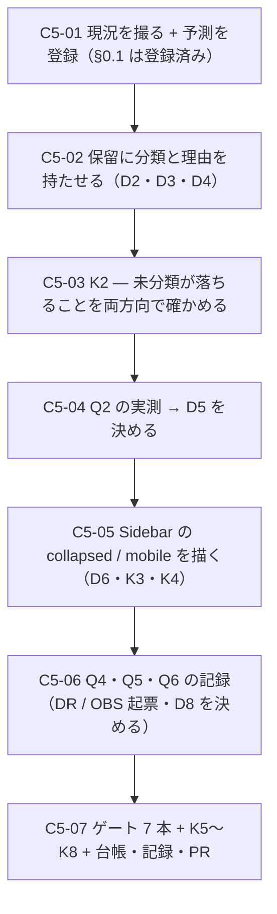

# 部品5 — 判定の保留と、描かれていない状態

> 🟥 **前提: [部品4](部品4_開かれないoverlayを開く.md) が done・[PR #18](https://github.com/yatami0/design/pull/18) マージ済み**（`a1f3fe2`）。
> 段取り上の位置づけ: [工場の段取り §3b](../工場の段取り.md) の**部品軸 5 本目**。
> 起点は [OBS-0019](../OBS/OBS-0019_storyが一度も描いていない状態をどこまで機械で要求するか.md)（部品4 のやり残し 1・2）。
> 実測の記録先: [実行記録.md](../実行記録.md) §部品5

★★ **この回も「部品を足す回」ではない。**
**部品4 が作った 2 つの目盛り**——[DR-0098](../DR/DR-0098-incomplete-was-counted-as-green.md)（判定の保留を数える場所）と
[DR-0099](../DR/DR-0099-the-blind-spot-list-must-be-machine-derived.md)（射程の外を機械で引く）——**を、初めて読む回。**

★★★ 🟥 **着手前実測で、保留 23 件のうち 12 件（未調査分）の中身が全部割れた**（§1.1）。
**「保留」は 1 種類ではなく 3 種類**で、**うち 2 件（`aria-valid-attr-value`）は本物ではなかった**——
🟥 **[OBS-0019](../OBS/OBS-0019_storyが一度も描いていない状態をどこまで機械で要求するか.md) §5 が「本物の可能性がある」と書いた側が外れた。**
**この回の問いは「12 件は何だったか」ではなく、「割った結果を機械のどこに置くか」（Q1）になる。**

---

## 0. この回で答えを出す問い（観測項目）★最重要

| # | 問い | なぜ効くか（どの判断が変わるか） |
| --- | --- | --- |
| **Q1** | ★★★ **「判定の保留」を数え続けるために、種類の分類をどこに持つか** | 🟥 **着手前実測で保留は 3 種類に割れた**（§1.1）——(a) **既知の色の組と同じもの**（8 件・**実測すると本当に AA 未達**） ／ (b) **重なりで測れないもの**（1 件） ／ (c) **検査器が無条件に保留するもの**（2 件・**参照先 ID は実在する**）。★★ **[DR-0098](../DR/DR-0098-incomplete-was-counted-as-green.md) は「数える場所」を作ったが、種類を持たない**——**23 という数字は、増えても減っても何が起きたか読めない**。🟥 **これは `violations` 側が既に解いている問題**（`HARNESS_RULES` で harness 由来を畳み、`pairs` で色の組に畳む）——**保留側にはその畳み方が 1 つも無い** |
| **Q2** | ★★ 🟥 **`.rdp-caption_label` を覆っている `nav` は本物の欠陥か** | 🟥 **着手前実測**: 月ラベル「August 2026」の中心を `elementFromPoint` で撃つと **`NAV.absolute.inset-x-0.top-0` が返る**＝ **ラベルは nav の下にある**。axe が「背景色を決められない」と保留したのはこれ。★★ **[DR-0089](../DR/DR-0089-overlays-do-not-cover-their-anchor.md)（overlay は自分のアンカーを覆わない）と同じ形かもしれない**——**あれは実際に 32px のうち 30px を隠していた**。🟥 **もし日付セルまで覆っていれば、[DR-0049](../DR/DR-0049-hit-area-reaches-44px-only-at-default-size.md) の当たり判定の話と繋がる**（部品3 Q5 = 日付セル 28px が 42 個） |
| **Q3** | ★★★ **`Sidebar` の mobile を描くと何が出るか** | 🟥 **着手前実測で 3 つ分かった**（§1.2）——① **道具は既に在る**（`@storybook/addon-vitest` は story の `globals.viewport` を読んで `page.viewport()` を実際に呼ぶ・ソース実測 ＋ 実行実測で `innerWidth` **1200 → 320**） ② 🟥 **mobile では `Sidebar` が 1 要素も描かれない**（`[data-slot="sidebar"]` が **0 件**。開く口が prop に無く、**トリガを押すまで DOM を持たない**） ③ 🟥 **開くと portal に出るが、名乗るのは `data-slot="sidebar"`**——**`sheet-content` ではない**。★★★ **③ が効く**——**[DR-0099](../DR/DR-0099-the-blind-spot-list-must-be-machine-derived.md) の静的一覧は `Primitive.Portal` を持つ素材から引く**ので **`sidebar.tsx` は載らず**、**動的側の主張も `sheet-content` を見るので当たらない**＝ **機械で引いた一覧にも、なお穴が 1 つある** |
| **Q4** | ★★ 🟥 **面①（描画された）は「部品が描かれた」を見ているか** | 🟥 **着手前実測**: mobile の `Sidebar` は**本体が 0 件**なのに、**面① は緑**（`SidebarTrigger` のボタンが描かれているから）。★★ **面① の判定は「canvas ＋ portal に 0 でない大きさの要素が 1 つ以上」**（部品1 D11=B）で、**どの部品が描かれたかは見ていない**。🟥 **これは「対象 0 件で緑」でも「保留で緑」でもない 3 つ目の形**——**別のものが描かれているので緑**。★ **面① を部品に紐づけるかは、この回で初めて材料が揃う** |
| **Q5** | 🟨 **`collapsed` は面③（状態面）を広げる話か、別の面か** | 🟥 **[OBS-0019](../OBS/OBS-0019_storyが一度も描いていない状態をどこまで機械で要求するか.md) §2 が名指しした未決**。[完成バー](../部品の完成バー.md) 面③ は `default` / `hover` / `focus-visible` / `disabled` / `empty` / `invalid` / `loading` / `overflow` の 8 つで、**`collapsed` も `mobile` もこの一覧に無い**。★ **前者（開閉）は「閉じている間 DOM を持たない」／後者（`collapsed`）は「DOM は在るが別の姿」**——**同じ検査で扱えるかが決まっていない** |
| **Q6** | 🟨 🟥 **台帳（`a11y-scan`）とバー（`test-storybook`）は同じ絵を見ているか** | 🟥 **着手前実測**: `tools/a11y-scan.mjs` は **1200×900 固定**で story の viewport を 1 行も読まない。**バーは読む**（Q3 の ①）。★★ **mobile の story を 1 本足した瞬間、2 つの計測器は別の DOM を測る**——**バーは 320px の姿を、台帳は 1200px の姿を**。🟥 **これは「食い違い」ではなく「片方が知らない」**（[DR-0097](../DR/DR-0097-an-exception-that-covered-the-whole-set-hid-the-rule.md) と同型で、**文書と実装ではなく計測器どうし**） |
| **Q7** | 🟨 **他の機械ゲートにも「保留」の口があるか** | 🟥 **部品4 のやり残し 3**（[DR-0098](../DR/DR-0098-incomplete-was-counted-as-green.md) の推論のまま・**候補は挙げたが 1 つも数えていない**）。★ **候補**: `tsc`（`skipLibCheck` の下に何件あるか＝ **未決 #29 は `.d.ts` 26 件を既に知っている**） ／ `eslint`（`warning` 1 件・`--fix` 可 4 件・`eslint-disable` コメント） ／ `cspell`（辞書に足した語＝ **「分からない」を「分かる」に書き換えた記録**・346 → 349） ／ `vitest`（`skip` / `todo` タグ） ／ 🟥 `vite build`（[DR-0082](../DR/DR-0082-vite-build-prints-type-errors-but-exits-zero.md)＝ **型エラーを赤い字で出しながら exit 0**＝ **保留ですらなく黙殺**） |

> **Q1 と Q3 が本体。**前者は「作った目盛りを読めるようにする」、後者は「機械で引いた一覧に残る穴」。
> **Q2・Q4 は着手前実測が偶然掘り当てたもの**、**Q5〜Q7 は輪郭**。
> 🟥 **この回でも `/design-sync` は打たない**（同期軸は保留中）。**ただし出荷入口 4 本の整合は保つ**（K5）。

### 0.1 赤テストの設計と**予測の登録**（🟥 実行前に書く・[DR-0076](../DR/DR-0076-capture-the-run-not-just-the-output.md) の様式）

| 検体 | 中身 | 🟥 **予測**（実行前に登録） | 外れたときの意味 |
| --- | --- | --- | --- |
| **K1** | **素材層 29 件の diff を数える** | 🟦 **0 行**（連続記録: 8 手＋工程0〜4＋部品2・部品3・部品4） | 1 行でも動いたら**そこで止めて記録する**。★ **`Sidebar` は [DR-0035](../DR/DR-0035-sidebar-stays-as-vendor.md) で「素材のまま使う」と決めた部品**——**触りたくなったらそれ自体が DR-0035 の見直し** |
| **K2** | ★★★ **保留の分類表を赤テストで発火させる**（Q1・D2） | 🟥 **分類の無い rule を 1 つ増やしたら赤・戻したら緑** | 🟥 **分類表は「知っているものを畳む」道具なので、知らないものが来たとき黙って通ると意味が無い**——**`HARNESS_RULES` は今まさにその形**（`Set` に無い rule は畳まれずに数えられるが、**「未分類」という状態を誰も持っていない**） |
| **K3** | ★★★ **`Sidebar/Mobile` をバーに通す**（Q3・Q4） | 🟥 **通る**に賭ける（**部品4 で `Sheet/Open` が通った**ので、同じ `Sheet` 経由の DOM は同じ結果になるはず）。🟨 **ただし `aria-hidden-focus` の保留が 3 件出る**ほうに賭ける | 🟥 **落ちたら、`Sidebar` は `Sheet` に載せているだけではない**——**部品4 が測った `Sheet/Open` と違う DOM を出していることになり、それ自体が発見** |
| **K4** | 🟥 **`Sidebar/Mobile` を `opened-overlay-check.mjs` に掛ける**（Q3 の ③） | 🟥 **検査は何も言わない**（`sidebar.tsx` は `Primitive.Portal` を書かないので一覧に載らない） | 🟦 **何か言ったら、静的側の走査が想定より広い**——**その場合は一覧の引き方を書き直せる** |
| **K5** | **出荷入口 4 本**（`src/index.ts` の到達可能性 ／ `.d.ts` ／ `publicDir` ／ story の `title`） | 🟦 **コアの story だけが増え、題材は 0 件** | 🟥 `node tools/title-map-check.mjs` を回す（[DR-0091](../DR/DR-0091-claude-design-is-a-fourth-shipping-entrance.md)） |
| **K6** | **`package.json` の `dependencies` を before / after で diff** | 🟦 **0 増**（12 件のまま） | 増えたら**この回の設計が範囲を超えている** |
| **K7** | 🟥 **保留の件数は再現するか**（同じコミットで `a11y-scan` を 2 回打つ） | 🟨 **再現しない**に賭ける——🟥 **着手前実測で 1 件ぶん食い違った**（台帳は `Avatar/Group` に 1 件を数えたが、**同じ story を直接 axe に掛けたら 0 件**） | 🟥 **再現しないなら、23 という数字はベースラインとして使えない**——**[handoff](../handoff.md) のベースライン表に「揺れる」と書く必要がある。**★ **再現したら、食い違いの原因は待ち時間（`waitForTimeout(120)`）** |
| **K8** | 🟥 **予測していない箇所が 1 件以上出るか**（DR-0076 の様式・工程4 で 5 件・部品2 で 4 件・部品4 で 4 件） | 🟥 **出る**に賭ける | **0 件だったら、それ自体が初めて** |

---

## 1. 前提と着手前実測（2026-08-09・`main` = `a1f3fe2`）

### 1.1 ★★★ 🟥 保留 12 件の中身は全部割れた（Q1 の材料）

**手法**: `storybook-static` を立てて axe を直接注入し、**`incomplete` のノードごとに `message` と `html` を出した**
（台帳 `tools/a11y-scan.mjs` は `rule` / `impact` / `target` しか保存していない＝ **理由を捨てている**）。

| # | rule | 件数 | axe の言い分 | 🟥 **実測で分かったこと** | 種類 |
| --- | --- | --- | --- | --- | --- |
| 1 | `color-contrast` | **5** | `Element content is too short to determine if it is actual text content`（`DatePicker` の日付セル） | 🟥 **実効色は `#8a8a8e on #ffffff`・比 3.44**＝ **既知の色の組の 1 番目（86 件）そのもの**。**AA（4.5）未達** | **(a) 既知の違反と同じ** |
| 2 | `color-contrast` | **3〜4** | 同上（`Avatar` の fallback「小」「中」「大」） | 🟥 **実効色は `#85858b on #f2f2f7`・比 3.29**＝ **既知の色の組の 6 番目（6 件）そのもの**。**AA 未達** | **(a)** |
| 3 | `color-contrast` | **1** | `Element's background color could not be determined because it is overlapped by another element`（`.rdp-caption_label`） | 🟥 **`NAV.absolute.inset-x-0.top-0` が月ラベルを覆っている**（`elementFromPoint` で実測）。**色そのものは `rgb(0,0,0) on rgb(255,255,255)`・比 21.00 で問題無い** | **(b) 重なりで測れない** |
| 4 | 🟥 `aria-valid-attr-value` | **2** | `Unable to determine if aria-controls referenced ID exists on the page while using aria-haspopup`（`DatePicker` のトリガ ／ `DropdownMenu` の sub-trigger） | 🟦 **参照先 ID は 2 件とも実在する**（`document.getElementById` で実測）。🟥 **axe-core 4.12.1 のソースを読むと、`aria-haspopup` が `false` / `null` 以外なら ID の実在を確かめずに `needsReview` を立てる**（`ariaValidAttrValueEvaluate` の `preChecks['aria-controls']`） | **(c) 検査器が無条件に保留** |
| 5 | `aria-hidden-focus` | **11** | （部品4 D7=C で既決） | 🟦 **Radix の `data-radix-focus-guard`**。**フォーカスは実際に閉じ込められている**（部品4 で `userEvent.tab()` ×3 実測） | **(c)** |

★★★ 🟥 **OBS-0019 §5 の見立ては外れた。**
「**`aria-valid-attr-value` は参照先が実在しないときに出る形なので、本物の欠陥の可能性がある**」と書いたが、
**参照先は実在し、axe は実在を確かめずに保留を立てていた。**
★★ **これは部品4 の `aria-hidden-focus`（`isModalOpen()` が `role="menu"` を見ない）と同じ形の 2 例目**——
**「保留」の多くは部品ではなく検査器の側の事情。**

★★ 🟥 **逆に、(a) の 8〜9 件は「保留」だが中身は本物**——
**実測すると AA 未達で、しかも既に台帳の `violations` 側に載っている色の組と同一。**
→ 🟥 **同じ欠陥が、ノードによって violations と incomplete に振り分けられている**（**分けているのは文字数**）。

### 1.2 ★★★ 🟥 `Sidebar` の mobile は道具無しで描ける。ただし部品が消える（Q3・Q4 の材料）

**手法**: 一時 story（`★ Review/ZZProbe`）を置いて `globals: { viewport: { value: 'mobile1' } }` で実行し、
**`window.innerWidth` と DOM を数えた**。測ったあと一時 story は削除した（部品4 §7.1 と同じ作法）。

| 実測 | 結果 |
| --- | --- |
| **viewport は効くか** | 🟦 **効く**。`innerWidth` = **desktop 1200 / mobile 320**（`MINIMAL_VIEWPORTS.mobile1` = 320×568・`useIsMobile` の閾値は 768） |
| **どこで効いているか** | 🟦 `@storybook/addon-vitest` の `test-utils.js` が **`await setViewport(...)` を `composedStory.run()` の前に呼ぶ**（ソース実測）。**新しい道具は 1 つも要らない** |
| 🟥 **mobile の初期状態** | 🟥 **`[data-slot="sidebar"]` が 0 件**——**`openMobile` の初期値は `false` で、外から開く prop が無い**（`SidebarProvider` の `defaultOpen` は desktop 側の `open` にしか効かない）。**トリガを押すまで部品は DOM を持たない** |
| 🟥 **面① の判定** | 🟥 **緑**。`SidebarTrigger` のボタンが描かれているので「0 でない大きさの要素」は在る＝ **部品本体が 0 件でも通る** |
| **開いたあと** | 🟦 `userEvent.click` で **portal に出る**（`document.body` 直下が `DIV:sheet-overlay` → `DIV:sidebar`） |
| 🟥 **名乗る slot** | 🟥 **`data-slot="sidebar"`**——**`sheet-content` ではない**（`sidebar.tsx` が `SheetContent` に `data-slot` を上書きしている）。★★ **[DR-0099](../DR/DR-0099-the-blind-spot-list-must-be-machine-derived.md) の静的一覧（`Primitive.Portal` を持つ素材）にも、動的側の主張（`sheet-content`）にも掛からない** |

### 1.3 🟥 台帳とバーは別の viewport を見る（Q6 の材料）

| 計測器 | viewport | story の `globals.viewport` を読むか |
| --- | --- | --- |
| **バー**（`pnpm test-storybook`） | 既定 **1200×900**・**story ごとに変わる** | 🟦 **読む**（§1.2） |
| **台帳**（`node tools/a11y-scan.mjs`） | **1200×900 固定** | 🟥 **読まない**（`newPage({ viewport: … })` を 1 回だけ） |

🟥 **`storybook-static/index.json` は `globals` を持たない**ので、台帳側が読むには別の口が要る。

### 1.4 ゲートのベースライン（`main` = `a1f3fe2`・2026-08-09 実測）

| ゲート | 実測 |
| --- | --- |
| typecheck | 🟦 緑 |
| lint | 🟥 **error 50 / warning 1**（内訳は handoff の表・**自作分 0**） |
| build | 🟦 緑・dist **85 ファイル**・`design.mjs` **92,605 B** |
| format:check | 🟦 緑 |
| spell | 🟦 **349 ファイル / 0 件**（🟨 **表は 346**。差分 3 は部品4 が最後に足した md＝ **新しい赤ではない**） |
| storybook（story） | 🟦 **58 ファイル / 128 件** |
| **バー（`test-storybook`）** | 🟦 **128 / 128 緑**（実測 12.16 秒・setup 63 秒） |
| a11y（出荷物の棚） | 🟦 **critical 0** ／ 🟨 **serious 148・色の組 9 種類** ／ 🆕 **判定の保留 23** |
| （ゲート外）`opened-overlay-check` | 🟦 **7 / 7 緑**（0.1 秒） |

🟨 **環境の注意（既知）**: 非対話シェルでは `mise` が効かず `node -v` が **22.16.0** で `cspell` が落ちる。
**`export PATH="$HOME/.local/share/mise/installs/node/24.18.1/bin:$PATH"` を先に打つ。**

---

## 2. 着手前に決めること（判断ポイント）

> 🟨 **D1〜D8 は推奨どおりの Claude 判断（事後承認待ち）。D9 だけユーザー判断。**
> 実行中に §2 に無い選択肢が出たら、**その場で決めずにここへ追記してから進む。**

| # | 論点 | 選択肢 | 決定 | 根拠 | 戻せるか |
| --- | --- | --- | --- | --- | --- |
| **D1** | ★ **この回で扱う範囲** | A: **保留の分類だけ** ／ B: **保留の分類 ＋ `Sidebar` の `collapsed`** ／ C: **B ＋ mobile** ／ D: C ＋ Q7（他ゲートの保留の棚卸し） | **C** | ★★ **mobile を外す理由が消えた**——**部品4 D1=B が「viewport を変える道具の新設になる」を理由に外した**が、🟥 **着手前実測でその前提が誤りと分かった**（**道具は既に在り、新設は 0**・§1.2）。★★★ **しかも mobile を描く価値のほうが上がった**——**Q3 の ③（`sheet-content` を名乗らない）と Q4（面① が部品を見ていない）は、mobile を描かないと出てこない**。🟨 **D は範囲を超える**——**Q7 は「候補を挙げて数える」だけで 6 ゲート分あり、この回の問いと独立に走れる**（→ OBS へ）。🟥 **`collapsed` は 1 story で足せる**が、**面③ に足すかは D8 で別に決める** | 🟦 |
| **D2** | ★★★ **保留の分類をどこに持つか**（Q1） | A: **文書に書く**（台帳 §5 に表を置く） ／ B: **`a11y-scan.mjs` に分類表を持たせ、未分類が出たら赤にする** ／ C: **B ＋ 理由（`message`）を保存する** ／ D: 分類しない（数だけ） | **C** | ★★★ 🟥 **A は 17 回踏んだ形**（文書だけで守る）。**しかも今回はもっと悪い**——**分類を文書に書くと、次に数えた人は「23 のうちどれが既知か」を毎回目で突き合わせる**＝ **[DR-0099](../DR/DR-0099-the-blind-spot-list-must-be-machine-derived.md) が否定した「目で数える」に戻る**。🟥 **D は現状**——**23 が 24 になっても何が起きたか読めない**。★★ **C の「理由を保存する」が要るのは、着手前実測で分かったことがそのまま根拠**——**台帳は `rule` / `impact` / `target` しか持たず、`message` を捨てていた**ので、**12 件を割るのに probe を書き直す必要があった**（**同じ作業を次も繰り返す**）。★ **未分類を赤にするのは `HARNESS_RULES` の形をそのまま裏返したもの**（**知っているものを畳み、知らないものは落とす**） | 🟦 |
| **D3** | ★★ **(c)「検査器が無条件に保留するもの」をどう畳むか** | A: `HARNESS_RULES` に足す ／ B: **別の枠（`TOOL_LIMIT_RULES`）を作り、根拠（ソースの実測）を書く** ／ C: 畳まない | **B** | 🟥 **A は却下**——**`HARNESS_RULES` は「storybook の iframe が原因」という意味**で、**`aria-controls` の保留は harness とは無関係**（**本番の DOM でも同じことが起きる**）。★★ **混ぜると、次に harness を替えたときに何を再検討すべきかが分からなくなる**。★★★ **B の枠には「引き換え」を必ず書く**——**部品4 D7=C が `aria-hidden-focus` を外す代わりに `expectFocusTrapped` を置いたのと同じ**。🟥 **`aria-valid-attr-value` の引き換えは「参照先 ID の実在を我々が確かめる」**（**axe が確かめていないのだから、確かめる側が要る**）。🟦 **これは 1 行で書ける**（`document.getElementById(el.getAttribute('aria-controls'))`） | 🟦 |
| **D4** | ★★ **(a)「既知の違反と同じもの」をどう扱うか** | A: `violations` 側と合流させて色の組に畳む ／ B: **保留のまま数え、色の組だけ突き合わせる** ／ C: 何もしない | **B** | 🟥 **A は数を二重に数える**（**同じノードが violations と incomplete の両方に出るわけではない**が、**色の組の件数が「違反 86 件」と読めなくなる**）。★★ **B にすると台帳が 1 行で言える**——「**保留 9 件は既知の色の組 2 種類に属し、新しい組は 0**」。🟥 **これが言えないと、保留が増えたとき OBS-0017 の話なのか新しい欠陥なのかが読めない**。★ **判断そのものは [OBS-0017](../OBS/OBS-0017_意味色とfillの対比が全滅している.md) の管轄に置いたままにする**（**部品側では直せない＝ ① 層の配色の決定**） | 🟦 |
| **D5** | ★★ 🟥 **(b) の重なり（`nav` が月ラベルを覆う）を直すか**（Q2） | A: **測るだけ**（覆っている範囲を出して OBS/DR に積む） ／ B: 製品層で塞ぐ ／ C: 素材層（`calendar.tsx`）を直す ／ D: 何もしない | 🟥 **実測してから決める**（**推奨は A**） | ★★ **まだ「欠陥か」が決まっていない**——**月ラベルは非対話要素**なので、**覆われても操作は壊れない**可能性がある。🟥 **ただし [DR-0089](../DR/DR-0089-overlays-do-not-cover-their-anchor.md) は「見えているのに触れない」を実測で捕まえた前例**で、**あのときも最初は「幅の問題」に見えていた**。★★★ **測る内容を先に決める**——① **nav の矩形と、その下に入る要素の一覧** ② **日付セルが 1 つでも覆われているか**（**覆われていれば当たり判定の話に繋がる**・[DR-0049](../DR/DR-0049-hit-area-reaches-44px-only-at-default-size.md)） ③ **`pointer-events` が効いているか**。🟥 **B / C は「直す」判断で、①〜③ が出るまで選べない**——**§2 へ追記してから決める** | 🟦 |
| **D6** | ★★ **`Sidebar/Mobile` の開き方** | A: `openMobile` を開ける prop を製品層で生やす ／ B: **`play` でトリガを押す** ／ C: 閉じたまま描く | **B** | 🟦 **部品4 D2=B と同じ**（**「開いた絵」ではなく「トリガが実際に開く」まで測る**）。🟥 **A は素材層に無い口を製品層で作る話**で、**[DR-0035](../DR/DR-0035-sidebar-stays-as-vendor.md)（素材のまま使う）を見直すことになる**——**この回の問いと独立**。🟥 **C は「部品が 1 要素も描かれていない story」を出荷物の棚に足すこと**＝ **Q4 で見つけた形をわざわざ増やす**。★ **ただし C も 1 本描く**——**「閉じた mobile」は面③ の `empty` に近い状態で、Q5 の材料になる**（🟨 **描くなら `★ Review` 棚ではなく出荷物の棚に置き、面① が緑になることを記録する**） | 🟦 |
| **D7** | 🟨 **台帳（`a11y-scan`）を viewport に対応させるか**（Q6） | A: **しない**（食い違いを記録するだけ） ／ B: story ごとに viewport を読んで `page.setViewportSize` する ／ C: 全 story を 2 サイズで走らせる | **A**（🟥 **記録は必ず残す**） | 🟥 **B は口が無い**——**`storybook-static/index.json` は `globals` を持たない**（実測）。**読むには `preview` を経由するか、`main.ts` の story を別途評価する必要があり、台帳が Storybook の内部構造に依存する**。🟥 **C は所要が 2 倍**（現状 128 story で約 3 分）で、**得られるのは「desktop の姿をもう 1 回」**。★★ **A で失うものを明示する**——**mobile の story は台帳では desktop の姿として数えられる**＝ **保留・違反の件数が「バーが見た絵」と一致しない**。🟨 **これは「数える場所」の限界なので、[DR-0098](../DR/DR-0098-incomplete-was-counted-as-green.md) の系に追記する** | 🟦 |
| **D8** | 🟨 **`collapsed` / mobile を面③ に足すか**（Q5） | A: **面③ に足す**（8 → 10） ／ B: **足さない。別の面として起票する** ／ C: 決めない | 🟥 **実測してから決める**（**推奨は B**） | ★★ **面③ の 8 つは「どの部品にも共通してありうる姿」**（`hover` / `disabled` / `empty` …）だが、**`collapsed` は `Sidebar` にしか無い**——**足すと「その部品だけ対象が在る面」ができ、他の 47 部品では毎回「対象 0 件で緑」になる**。🟥 **それはこの repo が 17 回踏んだ形をバーの定義に埋め込むこと**。★★★ **ただし B にも穴がある**——**別の面にすると、面の一覧が部品ごとに違うことになり、[台帳](../部品の完成バー_台帳.md) の表が 1 次元では書けなくなる**。★ **どちらも代償があるので、実測（`collapsed` を描いて何が測れたか）を見てから決める**。🟥 **[共通コンポーネント思想](../共通コンポーネント思想.md) はユーザーの持ち物なので、面の定義を増やすなら DR に理由を書く** | 🟦 |
| **D9** | 🟥 ★★ **`node tools/opened-overlay-check.mjs` をゲート 8 本目にするか** | A: **する** ／ B: しない ／ C: この回では決めない | 🟥 **ユーザー判断待ち** | 🟦 **材料は揃っている**（**赤テスト両方向済み**・**所要 0.1 秒**・**現在 7/7 緑**）。🟥 **ユーザー判断に上げる理由は部品3 D7 と同じ**——**ゲートの本数は [CLAUDE.md](../../CLAUDE.md) の規約**で、**全工程・全セッションに効く**。★★ **この回で 1 つ材料が増える**——🟥 **Q3 の ③ で「機械で引いた一覧にも穴がある」ことが出た**（`sidebar.tsx` は載らない）ので、**「8 本目にするなら、その検査が何を見ていないかも一緒に書く」必要がある** | 🟦 |

---

## 3. 成果物

- 🆕 **`tools/a11y-scan.mjs` の改修**（D2=C）— **保留に分類表を持たせ、`message` を保存し、未分類が出たら落とす**
- 🆕 **`TOOL_LIMIT_RULES`（仮）** — **検査器の限界として畳む枠 ＋ 引き換えの実測**（D3=B）
- 🆕 **story ＋2〜3 件**: `Sidebar/Collapsed` ／ `Sidebar/Mobile`（`play` で開く・D6=B）／ 🟨 `Sidebar/MobileClosed`
- 🟥 **Q2 の実測**（`nav` の矩形と、その下に入る要素）→ **D5 をここで決める**
- 🟥 **DR 起票**: 「**保留は 3 種類に割れる。多くは検査器の事情で、一部は既知の違反と同じもの**」（finding・Q1）
- 🟨 **DR 起票（候補）**: 「**面① は「部品が描かれた」を見ていない**」（finding・Q4）
- 🟨 **OBS 起票**: Q7（他ゲートの保留）／ Q6（計測器どうしの食い違い）／ D8 が B なら面の話
- 🟥 **[OBS-0019](../OBS/OBS-0019_storyが一度も描いていない状態をどこまで機械で要求するか.md) を閉じる**（§5 の見立てが外れたことを本文に残す）
- **[完成バー](../部品の完成バー.md) ／ [台帳 §5](../部品の完成バー_台帳.md) の更新**
- **記録**: [実行記録.md](../実行記録.md) §部品5 ／ [handoff](../handoff.md)

## 4. 作業フロー

## 5. 手順

### C5-01 現況を撮る ＋ 予測を登録する

- **目的**: **予測を先に書く**（[DR-0076](../DR/DR-0076-capture-the-run-not-just-the-output.md) の様式）
- **実行**: §1.4 のゲート ＋ 素材層 29 件のハッシュ（K1 の基準）＋ `dependencies` の before（K6）
  ＋ 🟥 **`a11y-scan` を 2 回打って保留の件数が再現するか**（K7）
- **判断**: **なし**（§0.1 に予測を登録済み）

### C5-02 保留に分類と理由を持たせる（D2=C・D3=B・D4=B）

- **目的**: ★★★ **この回の芯。**[DR-0098](../DR/DR-0098-incomplete-was-counted-as-green.md) が作った目盛りを**読めるようにする**
- **実行**:
  1. **`message` を保存する**（**理由を捨てない**——12 件を割るのに probe を書き直したのはこれが無かったから）
  2. **分類表**: `TOOL_LIMIT_RULES`（検査器の限界・**根拠つき**）／ **既知の色の組との突き合わせ**（D4=B）
  3. 🟥 **未分類が 1 件でもあれば落とす**（**「知らないもの」を黙って通さない**）
- **検証**: **C5-03 の K2 で両方向**
- **観測**: **Q1**

### C5-03 K2 — 未分類が落ちることを両方向で確かめる

- **実行**: ① **分類表から 1 語消して赤になる** ② **戻して緑になる**
- **観測**: **Q1**。🟥 **これをやらないと「目盛りを書いて針を付けない」**（部品1 B1-06・部品3 K7・部品4 K3 で 3 回踏んだ形）

### C5-04 Q2 の実測 → D5 を決める

- **実行**: `DatePicker/Open` で ① **`nav` の矩形** ② **その下に入る要素の一覧**（`elementsFromPoint`）
  ③ **日付セルが覆われているか** ④ **`pointer-events`**
- **判断**: 🟥 **D5 をここで決める**（**§2 へ追記してから**）
- **観測**: **Q2**
- **詰まったら**: 🟨 **「覆われているが触れる」なら欠陥ではない**——**その場合も「axe が測れない形を出荷している」ことは残る**ので、**引き換えに我々が比を測る**（D3=B と同じ形）

### C5-05 `Sidebar` の `collapsed` / mobile を描く（D6=B・K3・K4）

- **実行**: `Sidebar/Collapsed`（`SidebarProvider defaultOpen={false}`）／ `Sidebar/Mobile`（`globals.viewport` ＋ `play` でトリガ）
- **検証**: 🟥 **バーに通す**（K3）／ 🟥 **`opened-overlay-check.mjs` が何も言わないことを確かめる**（K4）／ **K1 = 素材層 0 行**
- **観測**: **Q3**・**Q4**・**Q5**
- **詰まったら**: 🟨 **`collapsed` の `data-state` がどの要素に載るかは実測で取る**（着手前実測では `[data-slot="sidebar-container"]` に `data-state` が無かった）

### C5-06 Q4・Q5・Q6 の記録

- **実行**: **DR 起票**（Q1 の finding）／ 🟨 **Q4 の DR**（面① は部品を見ていない）／
  **OBS 起票**（Q6・Q7）／ 🟥 **OBS-0019 を閉じる**
- **判断**: 🟥 **D8（面③ に足すか）をここで決める**

### C5-07 ゲート ＋ 台帳・記録・PR

- **検証**: ゲート **7 本** ＋ a11y の再計測 ＋ `node tools/title-map-check.mjs`（K5）／ `dist/` の diff 3 本（K5）／
  `dependencies` の diff（K6）／ 🟥 **`opened-overlay-check` が 7/7 のまま**
- **実行**: [完成バー](../部品の完成バー.md) ／ [台帳 §5](../部品の完成バー_台帳.md) ／
  [実行記録](../実行記録.md) §部品5 ／ handoff ／ PR（🟥 **マージは人**）
- **観測**: 🟥 **K8（予測していない箇所）を数えて書く**

## 6. 完了条件

- [ ] §0 の Q1〜Q7 に答えが出ている（**答えは実行記録 §部品5 の締めの表**）
- [ ] §2 の D1〜D8 が決着し、根拠が書かれている（🟥 **D5・D8 は実測してから**・**D9 はユーザー判断**）
- [ ] 赤テスト K1〜K8 を打った（🟥 **K2 と K7 は必ず両方向 / 2 回**）
- [ ] 🟥 **保留 23 件が全件、種類つきで台帳に載っている**（**未分類 0**）
- [ ] 🟥 **未分類が出たら落ちることを赤テストで確認している**（K2）
- [ ] **`Sidebar` の `collapsed` / mobile がバーを通っている**（K3）
- [ ] 🟥 **素材層 29 件の diff が 0 行**（K1）／ **`dependencies` 12 件のまま**（K6）
- [ ] 🟥 **OBS-0019 が閉じている**（§5 の見立てが外れたことを本文に残す）
- [ ] 実行記録 §部品5 ／ handoff ／ 完成バー ／ 台帳 §5 が更新されている
- [ ] コミット済み・PR を出した（🟥 **マージは人**・[DR-0068](../DR/DR-0068-merge-through-pull-requests.md)）

## 7. 出典

### 7.1 着手前実測（2026-08-09・`main` = `a1f3fe2`）

- **保留の内訳**: `pnpm build-storybook && node tools/a11y-scan.mjs` → **出荷物の棚 23 件**（`aria-hidden-focus` 11 / `color-contrast` 10 / `aria-valid-attr-value` 2）
- 🟥 **保留の理由**: 一時 probe で axe を直接注入し、`incomplete` のノードごとに `message` / `html` を出した（§1.1 の表）
- 🟥 **実効色の計算**: `rgba(60, 60, 67, 0.6)` を白／`#f2f2f7` に合成 → **`#8a8a8e`（比 3.44）／ `#85858b`（比 3.29）**＝ **既知の色の組と一致**
- 🟥 **`aria-controls` の実在**: `document.getElementById` で 2 件とも**実在を確認**。
  **axe-core 4.12.1 `ariaValidAttrValueEvaluate` の `preChecks['aria-controls']` は `aria-haspopup` があれば実在を確かめずに `needsReview` を立てる**（ソース実測）
- 🟥 **重なり**: `.rdp-caption_label` の中心で `elementFromPoint` → **`NAV.absolute.inset-x-0.top-0`**
- 🟥 **viewport**: `@storybook/addon-vitest` の `test-utils.js` が `setViewport` を `run()` の前に呼ぶ（ソース実測）。
  一時 story で `innerWidth` **1200 / 320** を実測。`MINIMAL_VIEWPORTS.mobile1` = **320×568**
- 🟥 **mobile の `Sidebar`**: 初期 `[data-slot="sidebar"]` **0 件** → `userEvent.click` 後 **1 件**（portal・`DIV:sheet-overlay` → `DIV:sidebar`）。
  **`sheet-content` は 0 件のまま**
- **ゲート**: §1.4 のとおり（**バー 128/128 緑**・**`opened-overlay-check` 7/7 緑**）

### 7.2 参照

- [OBS-0019](../OBS/OBS-0019_storyが一度も描いていない状態をどこまで機械で要求するか.md)（**本回の起点**・§5 の見立ては §1.1 で外れた）
- [DR-0098](../DR/DR-0098-incomplete-was-counted-as-green.md)（保留を数える場所＝ Q1 の前提）／ [DR-0099](../DR/DR-0099-the-blind-spot-list-must-be-machine-derived.md)（射程の外は機械で引く＝ Q3 の前提）
- [DR-0089](../DR/DR-0089-overlays-do-not-cover-their-anchor.md)（overlay は自分のアンカーを覆わない＝ Q2 の先例）／ [DR-0049](../DR/DR-0049-hit-area-reaches-44px-only-at-default-size.md)（当たり判定）
- [DR-0035](../DR/DR-0035-sidebar-stays-as-vendor.md)（`Sidebar` は素材のまま＝ D6 で A を却下した根拠）
- [OBS-0017](../OBS/OBS-0017_意味色とfillの対比が全滅している.md)（色の組の判断はここが持つ＝ D4）
- [部品の完成バー.md](../部品の完成バー.md) §1（面の一覧）／ §3（落とす面）／ [台帳 §5](../部品の完成バー_台帳.md)
- [部品4](部品4_開かれないoverlayを開く.md) D7=C（**外すなら引き換えを置く**＝ D3 の形）／ D8=B（数える場所を先に作る）
- [工場の段取り.md](../工場の段取り.md) §3b（部品軸）
