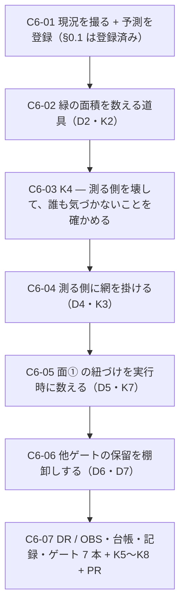

# 部品6 — 緑の面積を数える

> 🟥 **前提: [部品5](部品5_判定の保留と描かれていない状態.md) が done・[PR #19](https://github.com/yatami0/design/pull/19) マージ済み**（`380b896`）。
> 段取り上の位置づけ: [工場の段取り §3b](../工場の段取り.md) の**部品軸 6 本目**。
> 起点は [OBS-0022](../OBS/OBS-0022_他の機械ゲートにも保留の口があるか.md)（部品5 が範囲外にしたもの）と
> [OBS-0021](../OBS/OBS-0021_面1は部品が描かれたことを見ていない.md)（部品5 が見つけた 3 つ目の緑の形）。
> 実測の記録先: [実行記録.md](../実行記録.md) §部品6

★★ **この回も「部品を足す回」ではない。**部品4・部品5 と同じ**「緑の中身を割る」系の 3 本目**。

★★★ 🟥 **ただし今回は、割る対象が「1 つの緑」ではなく「緑という言葉そのもの」になる。**
着手前実測で **2 つの数字**が出た——

| 実測 | 数字 |
| --- | --- |
| 🟥 **`await expect` を 1 本も持たない story** | **130 中 110**（**85%**）。**出荷物の棚だけでも 115 中 88** |
| 🟥 **「測る側」（`tools/*.mjs` 7 本 1,512 行）に掛かっている型の網** | **0 枚**（`tsconfig.json` の `include` に無く、`checkJs` も無い） |

★★★ **前者は「バー 130/130 緑」の読み方を変える。**——**110 件について、バーが言っているのは
「axe が何も言わなかった」と「何かが画面に出ていた」だけ**（後者は [OBS-0021](../OBS/OBS-0021_面1は部品が描かれたことを見ていない.md) で
**別の部品でも満たせる**と分かっている）。
★★★ **後者は [DR-0094](../DR/DR-0094-the-bar-engine-ran-without-any-css.md)（バーの実行エンジンが CSS 無しで走っていた）と
[DR-0101](../DR/DR-0101-a-comment-satisfied-the-check-for-absence.md)（検査がコメントで通っていた）の 3 例目にあたる位置**——
**測る側は 2 度とも壊れていたのに、測る側を測る網はいまも 1 枚も無い。**

---

## 0. この回で答えを出す問い（観測項目）★最重要

| # | 問い | なぜ効くか（どの判断が変わるか） |
| --- | --- | --- |
| **Q1** | ★★★ **「バー 130/130 緑」は何を主張しているのか。緑が覆っている面積を数えられるか** | 🟥 **着手前実測: `play` を持つ story は 130 中 27（21%）／ `await expect` が 0 本の story は 110（85%）／ repo 全体の主張は 89 本**（§1.1）。★★ **バーの数字は「story 数」で書かれている**（[台帳 §5](../部品の完成バー_台帳.md)・handoff のベースライン表）が、**story 数は主張の量ではない**。🟥 **これは [DR-0097](../DR/DR-0097-an-exception-that-covered-the-whole-set-hid-the-rule.md)（例外が全量を覆って規則が働く場面が来なかった）と同型**——**分母の取り方で「効いている」ように見えている**。★★★ **面ごとに「掛かった story 数 / 対象 story 数」を出せば、[完成バー §1](../部品の完成バー.md) の実装列が初めて数字になる** |
| **Q2** | ★★★ 🟥 **測る側（`tools/*.mjs`）は誰が検査するのか** | 🟥 **着手前実測: 7 本 1,512 行が `typecheck` の射程外**（`tsconfig.json` の `include` は `src/**` / `*.config.ts` / `.storybook/**` のみ・`checkJs` 無し）。🟦 **`lint` は見ている**（7 本とも error 0 / warning 0）が、**`.mjs` は `disableTypeChecked` なので型情報を 1 つも使っていない**。🟥 **自動テストは repo 全体で 0 本**（`*.test.*` / `*.spec.*` が 1 ファイルも無い）。★★★ **この 1,512 行が、ベースライン表の数字（serious 148 ／ 色の組 9 ／ 保留 23 ／ 7/7）を全部作っている**——**黙って数え落としても、それを言う人が居ない**。🟥 **前例が 2 つある**（[DR-0094](../DR/DR-0094-the-bar-engine-ran-without-any-css.md) ／ [DR-0101](../DR/DR-0101-a-comment-satisfied-the-check-for-absence.md)）**＝ 測る側は既に 2 度壊れていた** |
| **Q3** | ★★ **他の 6 ゲートに「保留」の口はいくつあるか**（[OBS-0022](../OBS/OBS-0022_他の機械ゲートにも保留の口があるか.md) を閉じる） | 🟥 **着手前実測で 5 本の口が数字になった**（§1.2）——**`cspell` 辞書 90 語** ／ **`prettier` の対象 155 / 追跡 378（ignore 219）** ／ **`eslint` の対象 174・`eslint-disable` 1・warning 1** ／ **`tsc` の `skipLibCheck: true` ＋ `exactOptionalPropertyTypes: false`（借金・DR-0014）** ／ **`vite build` は型エラーを出しながら exit 0**（[DR-0082](../DR/DR-0082-vite-build-prints-type-errors-but-exits-zero.md)）。★★ **[DR-0100](../DR/DR-0100-pending-judgements-split-into-three-kinds.md) が a11y でやったこと（種類と理由を持たせ、未分類は落とす）を、他のゲートにも当てるかが論点** |
| **Q4** | ★★ **面① を「その部品が描かれた」まで言えるようにできるか**（[OBS-0021](../OBS/OBS-0021_面1は部品が描かれたことを見ていない.md) を閉じる） | 🟥 **着手前実測: `data-slot` は素材層 29/29 が持つ**が、**製品層・patterns の 18 ファイルは素材層を 1 つも import していない**（＝ 実行時にも `data-slot` を持たない見込み・🟥 **未計測**）。★★ **OBS-0021 §4 が「そこで破綻するかを数えていない」と書いた箇所がこれ**。🟥 **`meta.component` は 58 中 49 ファイルにしか無い**——**紐づけの材料はどれも全数を覆っていない** |
| **Q5** | 🟨 **射程の数字をベースライン表にどう載せるか** | 🟥 **載せ方を決めないと、この回の実測は「1 回測っただけ」で終わる**——**[DR-0099](../DR/DR-0099-the-blind-spot-list-must-be-machine-derived.md)（一覧は機械が引く）が否定した形**。★ **ただし載せすぎると表が読めなくなる**（handoff のベースライン表は既に 7 本 ＋ a11y 4 段）。**「増えたら気づける最小の数字」を選ぶ** |

> **Q1 と Q2 が本体。**前者は「緑の面積」、後者は「測る側の無検査」。
> **Q3 は OBS-0022 の棚卸し**、**Q4 は OBS-0021 の決着**、**Q5 は載せ方**。
> 🟥 **この回でも `/design-sync` は打たない**（同期軸は保留中）。**ただし出荷入口 4 本の整合は保つ**（K5）。
> 🟥 **この回では「面④ を 110 件に書く」ことはしない**（→ D3）。**数えることと返すことは別の仕事。**

### 0.1 赤テストの設計と**予測の登録**（🟥 実行前に書く・[DR-0076](../DR/DR-0076-capture-the-run-not-just-the-output.md) の様式）

| 検体 | 中身 | 🟥 **予測**（実行前に登録） | 外れたときの意味 |
| --- | --- | --- | --- |
| **K1** | **素材層 29 件の diff を数える** | 🟦 **0 行**（連続記録: 8 手＋工程0〜4＋部品2〜部品5） | 1 行でも動いたら**そこで止めて記録する** |
| **K2** | ★★★ **面の被覆を数える道具を赤テストで発火させる**（Q1・D2） | 🟥 **`play` を 1 本消したら被覆の数字が 1 減る**／**閾値を置いたなら赤になり、戻すと緑** | 🟥 **動かないなら「目盛りを書いて針を付けなかった」の 4 例目**（部品1 B1-06・部品3 K7・部品4 K3 で 3 回踏んだ） |
| **K3** | ★★★ **`tools/*.mjs` に型の網を掛け、既存の赤を数える**（Q2・D4） | 🟥 **0 件では終わらない**に賭ける（**1,512 行が一度も型検査を受けていない**）。🟨 **10〜40 件**を予測 | 🟦 **0 件なら「JSDoc 無しの素の .mjs でも型は通る」**＝ **網を掛ける価値が薄いことの実測**になり、D4 を B へ倒す根拠になる |
| **K4** | ★★★ 🟥 **`a11y-scan.mjs` に意図的な数え落としを入れて、誰かが気づくか**（Q2） | 🟥 **誰も気づかない**に賭ける（**`resultTypes` を 1 語変えるだけで保留 23 → 0 になり、ゲート 7 本は全部緑のまま**） | 🟦 **気づくなら、既に網が 1 枚ある**——**その網が何かを記録して D4 の前提にする** |
| **K5** | **出荷入口 4 本**（`src/index.ts` の到達可能性 ／ `.d.ts` ／ `publicDir` ／ story の `title`） | 🟦 **1 件も動かない**（**この回は部品を足さない**） | 🟥 `node tools/title-map-check.mjs` を回す（[DR-0091](../DR/DR-0091-claude-design-is-a-fourth-shipping-entrance.md)） |
| **K6** | **`package.json` の `dependencies` を before / after で diff** | 🟦 **0 増**（12 件のまま）。🟨 **`devDependencies` は D4 次第で +1 の可能性**（型定義） | `dependencies` が増えたら**この回の設計が範囲を超えている** |
| **K7** | 🟥 **面① を部品に紐づけたとき、既存 130 story のうち何件が落ちるか**（Q4・D5） | 🟥 **落ちる**に賭ける（**製品層 18 ファイルが `data-slot` を持たない見込み**）。🟨 **10〜30 件**を予測 | 🟦 **0 件なら、紐づけは既存を 1 件も壊さずに入る**——**その場合は D5 を A（機械で要求する）へ倒せる** |
| **K8** | 🟥 **予測していない箇所が 1 件以上出るか**（DR-0076 の様式・工程4 で 5 件・部品2 で 4 件・部品4 で 4 件・部品5 で 3 件） | 🟥 **出る**に賭ける | **0 件だったら、それ自体が初めて** |

---

## 1. 前提と着手前実測（2026-08-09・`main` = `380b896`）

### 1.1 ★★★ 🟥 緑の面積（Q1 の材料）

**手法**: 58 story ファイルを読み、`export const` 単位で `play` の有無と `await expect(` の本数を数えた。

| 母数 | story | `play` あり | 🟥 **`await expect` 0 本** |
| --- | --- | --- | --- |
| **全体** | **130** | **27（21%）** | 🟥 **110（85%）** |
| **出荷物の棚**（`★ Review` / `① Tokens` / `⑤ 題材` を除く） | **115** | **27** | 🟥 **88（77%）** |

**repo 全体の主張は `await expect` が 89 本**（うち `expectOpened` 16 ／ `expectFocusTrapped` 11 ／ `resolveLength` 29 ／ `resolveColor` 5）。
**helper を import している story ファイルは `measure` 13 ／ `opened` 6**（**58 中**）。

★★★ 🟥 **110 件に掛かっている検査は 2 つだけ**——

| 面 | 実装 | 110 件に対して何を言うか |
| --- | --- | --- |
| **①** | `preview.tsx` の `afterEach`（全 story 自動） | 🟥 **「canvas か portal に 0 でない大きさの要素が 1 つ以上ある」**——**どの部品かは見ていない**（[OBS-0021](../OBS/OBS-0021_面1は部品が描かれたことを見ていない.md)） |
| **②** | `a11y.test: 'error'` | 🟦 **axe の違反**（🟥 **ただし `color-contrast` と `region` は無効化済み**＝ **serious 148 件は落ちない**） |

🟨 **ファイル別に見ると、`play` が 0 本のファイルが 58 中 32。**
🟥 **その中に `Field`（5 story）・`Tokens`（5）・`AppShell`（4）・`Textarea`（3）・`RadioGroup`（3）・`Alert`（3）・`FormLayout`（3）が居る。**

### 1.2 ★★ ゲート 7 本の射程（Q3 の材料・[OBS-0022](../OBS/OBS-0022_他の機械ゲートにも保留の口があるか.md) の棚卸し）

**git 追跡ファイルは 378 件。**

| ゲート | 🟦 **見ているもの** | 🟥 **見ていないもの／保留の口** |
| --- | --- | --- |
| `typecheck` | **repo 内 166 ファイル**（`src/**` ＋ `*.config.ts` ＋ `.storybook/**`） | 🟥 **`tools/*.mjs` 7 本**（`checkJs` 無し）／ `eslint.config.mjs` ／ `.claude/trace.config.mjs`。🟥 **`skipLibCheck: true`**（→ **未決 #29 の `.d.ts` 26 件**）／ 🟥 **`exactOptionalPropertyTypes: false`**（借金・DR-0014） |
| `lint` | **174 ファイル**（error **50** / warning **1**） | 🟥 **`.mjs` は `disableTypeChecked`**（型情報を使わない）／ `dist` `storybook-static` `ds-bundle` `.ds-sync` `.design-sync/*` `.context` `artifacts` を ignore。🟨 **`eslint-disable` は 1 件**（`DataGrid.tsx:67`・理由つき） |
| `build` | `vite build`（dist **85** ／ `design.mjs` **92,605 B**） | 🟥 **型エラーを赤い字で出しながら exit 0**（[DR-0082](../DR/DR-0082-vite-build-prints-type-errors-but-exits-zero.md)）＝ **保留ですらなく黙殺** |
| `format:check` | 🟥 **155 / 378**（**41%**） | 🟥 **ignore 219 件**——`docs/**` の md **176**（DR 103 ／ OBS 25 ／ 手順 23 ほか）／ `src/components/ui` **29** ／ `artifacts` 10 ／ `src/hooks` `src/lib/utils.ts` ／ `public/mockServiceWorker.js` |
| `spell` | **356 ファイル / 0 件** | 🟥 **辞書 90 語**（`cspell.json` の `words`）＝ **「分からない」を「分かる」に人が書き換えた記録**。`ignorePaths` 5 |
| `build-storybook` | dist の生成 | 🟥 **story が実行時に落ちても exit 0**（[DR-0048](../DR/DR-0048-build-storybook-does-not-render.md)） |
| `test-storybook` | **130 / 130 緑** | 🟥 **§1.1 のとおり 110 件は主張 0 本**。🟨 `skip` / `todo` タグは**現在 0 件**（未確認 → C6-02 で数える） |

★★ 🟥 **`format:check` の 41% は他のどのゲートより低い**——**この repo の成果物は文書が主**（md 176 件）なのに、**その全部が整形ゲートの外**。
🟨 **これは [DR-0012 相当の意図的な除外](../../.prettierignore)（表の再整形で全行 diff になる）**なので、**「保留」ではあるが理由は書かれている。**

### 1.3 ★★★ 🟥 測る側には網が 1 枚も無い（Q2 の材料）

| ファイル | 行数 | typecheck | lint | 自動テスト | **この道具が作っている数字** |
| --- | --- | --- | --- | --- | --- |
| `tools/visual-probe.mjs` | 528 | 🟥 **外** | 🟦 型無しで通過 | 🟥 **無し** | 手5 の目視判定の検体 |
| `tools/a11y-scan.mjs` | 356 | 🟥 **外** | 🟦 同上 | 🟥 **無し** | ★★★ **critical 0 ／ serious 148 ／ 色の組 9 ／ 保留 23** |
| `tools/edit-probe.mjs` | 184 | 🟥 **外** | 🟦 同上 | 🟥 **無し** | 工程4 K1-b（Radix の値潰し） |
| `tools/hit-area-probe.mjs` | 147 | 🟥 **外** | 🟦 同上 | 🟥 **無し** | [DR-0049](../DR/DR-0049-hit-area-reaches-44px-only-at-default-size.md)（44px）／ 部品3 Q5 |
| `tools/opened-overlay-check.mjs` | 117 | 🟥 **外** | 🟦 同上 | 🟥 **無し** | ★★★ **7 / 7**（🟥 **ゲート 8 本目の候補**） |
| `tools/dead-class-scan.mjs` | 108 | 🟥 **外** | 🟦 同上 | 🟥 **無し** | [DR-0090](../DR/DR-0090-token-classes-were-silently-dropped-by-tailwind-merge.md) の再発検知 |
| `tools/title-map-check.mjs` | 72 | 🟥 **外** | 🟦 同上 | 🟥 **無し** | **4 本目の出荷入口**（[DR-0091](../DR/DR-0091-claude-design-is-a-fourth-shipping-entrance.md)） |
| **合計** | **1,512** | 🟥 **0 / 7** | 🟦 7 / 7（型無し） | 🟥 **0 / 7** | — |

🟥 **`*.test.*` / `*.spec.*` は repo に 1 ファイルも無い**（story の `play` が唯一の実行検査）。
★★ **既に 2 度壊れている**——[DR-0094](../DR/DR-0094-the-bar-engine-ran-without-any-css.md)（バーのエンジンが CSS 無し）と
[DR-0101](../DR/DR-0101-a-comment-satisfied-the-check-for-absence.md)（静的検査がコメントで通る）。**どちらも人が偶然見つけた。**

### 1.4 🟨 面① を部品に紐づける材料（Q4 の材料）

| 材料 | 被覆 |
| --- | --- |
| `data-slot`（素材層） | 🟦 **29 / 29 ファイル** |
| `data-slot`（製品層・patterns のソース上） | 🟥 **2 / 48 ファイル**（`Popover` / `DatePicker` のみ） |
| 🟥 **素材層を 1 つも import していない製品層・patterns** | 🟥 **18 ファイル**（`Box` `Stack` `Grid` `Inline` `Section` `Spacer` `Container` `Link` `DataGrid` `DescriptionList` `StatusPill` `Timeline` `PeriodSelect` ＋ `patterns` 5 件） |
| `meta.component` | 🟨 **49 / 58 story ファイル** |

🟥 **「素材層を import していない ＝ 実行時にも `data-slot` を持たない」は静的な見込みで、実測していない**
（`PeriodSelect` は製品層 `Select` を経由して素材層に届く可能性がある）。**C6-05 で実行時に数える。**

### 1.5 ゲートのベースライン（`main` = `380b896`・2026-08-09 実測）

| ゲート | 実測 |
| --- | --- |
| typecheck | 🟦 緑 |
| lint | 🟥 **error 50 / warning 1**（内訳は handoff の表・**自作分 0**・**tools 7 本は 0/0**） |
| build | 🟨 **未実測**（C6-01 で撮る。前回 dist **85** ／ `design.mjs` **92,605 B**） |
| format:check | 🟨 **未実測**（C6-01） |
| spell | 🟦 **356 ファイル / 0 件**（**表と一致**） |
| storybook（story） | 🟦 **58 ファイル / 130 件** |
| バー（`test-storybook`） | 🟨 **未実測**（C6-01。前回 **130 / 130 緑**） |
| a11y（出荷物の棚） | 🟨 **未実測**（C6-01。前回 critical 0 ／ serious 148 ／ 色の組 9 ／ 保留 23・未分類 0） |
| （ゲート外）`opened-overlay-check` | 🟨 **未実測**（C6-01。前回 **7 / 7**） |

🟨 **環境の注意（既知）**: 非対話シェルでは `mise` が効かず `node -v` が **22.16.0** で `cspell` が落ちる。
**`export PATH="$HOME/.local/share/mise/installs/node/24.18.1/bin:$PATH"` を先に打つ。**

---

## 2. 着手前に決めること（判断ポイント）

> 🟨 **D1〜D9 は推奨どおりの Claude 判断（事後承認待ち）。🟥 D10 だけユーザー判断**（**持ち越し 3 回目**）。
> 実行中に §2 に無い選択肢が出たら、**その場で決めずにここへ追記してから進む。**

| # | 論点 | 選択肢 | 決定 | 根拠 | 戻せるか |
| --- | --- | --- | --- | --- | --- |
| **D1** | ★ **この回で扱う範囲** | A: **Q1 だけ**（緑の面積） ／ B: **Q1 ＋ Q2**（測る側） ／ C: **B ＋ Q3**（他ゲートの棚卸し） ／ D: C ＋ Q4（面① の紐づけ） ／ E: D ＋ **面④ を 110 件に書く** | **D** | ★★★ **Q1 と Q2 は同じ 1 つのことの表裏**——**「緑」が覆っている面積の話**（Q1）と、**その面積を報告している道具自身が測られていない**話（Q2）。**分けると片方が「数えただけ」で終わる。**★★ **Q3 は着手前実測でほぼ数字になっている**（§1.2）ので**足しても安い**——**[OBS-0022](../OBS/OBS-0022_他の機械ゲートにも保留の口があるか.md) は部品4 から 2 回持ち越している**。★ **Q4 も入れる**——🟥 **[OBS-0021](../OBS/OBS-0021_面1は部品が描かれたことを見ていない.md) は「材料はあるが全数を覆っていない」で止まっており、数えれば閉じる**。🟥 **E は却下**——**110 件に `play` を書くのは、この回の問い（数える）とは別の仕事**で、**[部品1 D6=B](部品1_完成バーを機械で閉じる.md)（一括では返さず触るときに返す）と正面から食い違う** | 🟦 |
| **D2** | ★★★ **面の被覆をどこで数えるか**（Q1） | A: **文書に書く**（台帳に表を置く） ／ B: **`tools/coverage-scan.mjs`（仮）を作り、面ごとに「掛かった / 対象」を出す** ／ C: **B ＋ 閾値を置いて下回ったら落とす** ／ D: 数えない | **B** | 🟥 **A は 17 回踏んだ形**（文書だけで守る）＋ **[DR-0099](../DR/DR-0099-the-blind-spot-list-must-be-machine-derived.md) が否定した「目で数える」**。★★★ **C を採らない理由は 1 つ**——**閾値は「いま何%か」を知らないと置けない**。🟥 **いま置くと、置いた瞬間の 21% が正当化される**（**[DR-0100](../DR/DR-0100-pending-judgements-split-into-three-kinds.md) の未分類 0 は「0 が正しい」と言えたから置けた**）。★ **B で数字を出し、C は次回の判断に送る**——**送る条件を D9 で決める**。🟨 **`a11y-scan.mjs` と同じ作法**（**出荷物の棚 / それ以外**を分け、**理由を捨てない**） | 🟦 |
| **D3** | ★★ 🟥 **数えた結果、110 件に主張を足すか** | A: **この回で足す** ／ B: **足さない。数字だけ出す** ／ C: 一部（面④ の対象＝ union prop を持つ部品）だけ足す | **B** | 🟥 **A は範囲を超える**（D1 の E と同じ）。★★★ **B の根拠は [部品1 D6=B]**——**面③ の借金 33 件も「一括では返さず、その部品を触るときに返す」で運用している**。**同じものを面④・主張全般にも当てる。**🟥 **C は「union prop を持つ 21 部品」という部品1 B1-06 の母数を再利用できるが、既に 13 件は書いてある**——**残り 8 件を書くのは「触るときに返す」の範囲を勝手に広げること**。★ **代わりに「どの部品が何本主張を持つか」を台帳の列にする**（D8）＝ **触るときに返す運用が、返し忘れを見つけられるようになる** | 🟦 |
| **D4** | ★★★ **測る側（`tools/*.mjs`）に何の網を掛けるか**（Q2） | A: **`checkJs` ＋ `tsconfig` の `include` に足す**（型だけ） ／ B: **`.mjs` → `.ts` へ書き換える** ／ C: **道具に対する赤テストを固定する**（検体を repo に置き、実行を 1 コマンドにする） ／ D: **A ＋ C** ／ E: 何もしない（数えるだけ） | **D** | ★★★ 🟥 **A だけでは [DR-0101](../DR/DR-0101-a-comment-satisfied-the-check-for-absence.md) は防げない**——**「コメントを主張として数える」は型の問題ではない**。★★★ 🟥 **C だけでも足りない**——**[DR-0094](../DR/DR-0094-the-bar-engine-ran-without-any-css.md)（CSS が当たっていない）は型でも赤テストでもなく「実効値を測ったら全部素の HTML だった」で見つかった**が、**型の網は 1,512 行に一度も掛かっていないので、まず何件出るかを知る必要がある**（K3）。🟥 **B は却下**——**`tools/*.mjs` は `node tools/x.mjs` で直接叩けることが取り回しの中心**（`opened-overlay-check` は **0.1 秒**）で、**ビルド段を挟むとゲート 8 本目の話（D10）が重くなる**。★ **C の形は既にある**——**部品4 K3・部品5 K2 が毎回手で打っている両方向の赤テスト**を、**捨てずに repo へ置く**だけ。🟨 **`devDependencies` が +1 になる可能性がある**（K6 で見る） | 🟦 |
| **D5** | ★★ **面① を部品に紐づけるか**（Q4） | A: **機械で要求する**（story ごとに「この部品が描かれた」を主張させる） ／ B: **数えるだけ**（何件が紐づけ可能かを出し、OBS を閉じる） ／ C: **`data-slot` を持つ部品だけ自動で紐づけ、持たない部品は対象外＋理由** ／ D: 何もしない | 🟥 **C を推奨・実測後に確定**（K7） | ★★ **A は K7 が「10〜30 件落ちる」と予測している**——**落ちる中身が「部品の欠陥」ではなく「`data-slot` が無いだけ」なら、A は正しくない赤を 30 件点灯させる**（**[完成バー §3](../部品の完成バー.md) が `color-contrast` で避けたのと同じ形**）。🟥 **B は OBS を閉じるが、閉じ方が「測れませんでした」になる**。★★★ **C の形は [DR-0100](../DR/DR-0100-pending-judgements-split-into-three-kinds.md) と同じ**——**知っているものを畳み、知らないものは「対象外＋理由」で明示する**。🟥 **ただし「対象外」が 18 件（製品層の自作）だと、面① の紐づけは素材層のラッパーにしか効かない**——**それが許容できるかは実測を見てから**。🟨 **D5 は C6-05 の実測後に §2 へ追記して確定する** | 🟦 |
| **D6** | ★★ **他ゲートの「保留」をどこに置くか**（Q3） | A: **[OBS-0022](../OBS/OBS-0022_他の機械ゲートにも保留の口があるか.md) を実測で埋めて閉じ、DR に上げる** ／ B: **A ＋ 機械で数え続ける**（`coverage-scan` に足す） ／ C: 文書に書くだけ | **A** | 🟥 **B を採らない理由は「数え続ける価値が口ごとに違う」から**——**`cspell` の辞書 90 語は `git log` で増分が取れる**（**機械化の必要が薄い**）が、**`format:check` の 155/378 は `.prettierignore` を触るたびに動く**。★★ **全部を 1 つの道具に入れると、`a11y-scan` が保留に種類を持たせたときのような「読める数字」にならない**。★ **A で 7 本ぶんの表を作り、🟥 「次に機械化すべきはどれか」を DR の結論にする**——**判断の材料を作るのがこの回の仕事で、全部を機械化するのは別の回**。🟨 **例外が 1 つ**: **`test-storybook` の被覆は D2=B で機械化する**（**この回の本体だから**） | 🟦 |
| **D7** | 🟨 **`tsc` の 2 つの借金（`skipLibCheck` / `exactOptionalPropertyTypes`）をこの回で返すか** | A: **返す** ／ B: **数えて記録するだけ**（未決 #29 / DR-0014 に紐づける） ／ C: 触らない | **B** | 🟥 **A は範囲を超える**——**`exactOptionalPropertyTypes: true` に戻すと `dropdown-menu.tsx` が落ちる**（[DR-0014](../DR/DR-0014-exact-optional-property-types-incompatible.md)・**素材層 0 行の連続記録が切れる**）。★★ **B の中身は 2 つ**——① **`skipLibCheck: false` で何件出るか**（**未決 #29 は「26 件」と書いているが、部品3〜部品5 で `.d.ts` は増えている**） ② **`exactOptionalPropertyTypes: true` で何件出るか**（**手3 から一度も数え直していない**）。🟦 **どちらも設定を一時的に変えて `tsc` を打つだけ**（**戻す**）。★ **これは「借金の残高を読む」**——**[部品5](部品5_判定の保留と描かれていない状態.md) が保留 23 件でやったことと同じ** | 🟦 |
| **D8** | 🟨 **台帳に何の列を足すか**（Q5） | A: **足さない** ／ B: **部品ごとに「主張の本数」を足す** ／ C: **B ＋ 面ごとの被覆率を §5 に足す** | **C** | ★★ **B が要る理由は D3=B の運用が成り立つため**——**「触るときに返す」は、返し忘れが見えないと機能しない**（**面③ の借金 33 件は台帳に列があるから見える**）。★ **C の被覆率は handoff のベースライン表にも 1 行で載せる**（**「バー 130/130 緑」の隣に「主張を持つ story 27」**）。🟥 **1 行に収める**——**表が読めなくなると、[DR-0097](../DR/DR-0097-an-exception-that-covered-the-whole-set-hid-the-rule.md) の「規則が働く場面が来ない」を運用の側で作る** | 🟦 |
| **D9** | 🟨 **被覆に閾値を置く判断をいつするか**（D2=B の送り先） | A: **次の部品回** ／ B: **条件を書いて送る**（何が起きたら置くか） ／ C: 置かない | **B** | 🟥 **A は「回数で決める」形**で、[DR-0077](../DR/DR-0077-abolish-the-two-occurrence-rule.md) が廃止したもの。★★★ **条件はこう書く**——**「被覆率が 1 度でも下がったら置く」**。🟦 **理由: いまの 21% は借金だが、下がることは新しい借金**で、**前者は「触るときに返す」で扱い、後者は止める必要がある**。★ **これは `a11y-scan` の「新しい色の組 0」と同じ形**（**総量ではなく増分を見る**） | 🟦 |
| **D10** | 🟥 ★★ **`node tools/opened-overlay-check.mjs` をゲート 8 本目にするか**（**持ち越し 3 回目**） | A: **する** ／ B: しない ／ C: この回では決めない | 🟥 **ユーザー判断待ち** | 🟦 **材料は前回よりさらに強い**——① **赤テスト両方向済み** ② **所要 0.1 秒** ③ **現在 7/7 緑** ④ **部品5 で「コメントで通る」穴を塞いだ**（[DR-0101](../DR/DR-0101-a-comment-satisfied-the-check-for-absence.md)） ⑤ 🆕 **この回で D4=D の網（型 ＋ 固定した赤テスト）が同じ道具に掛かる**。🟥 **同時に「この検査が見ていないもの」も決める**——**`sidebar.tsx` は `Primitive.Portal` を書かないので一覧に載らない**（部品5 Q3 の ③）。🟥 **ユーザー判断に上げる理由は部品3 D7 と同じ**——**ゲートの本数は [CLAUDE.md](../../CLAUDE.md) の規約**で、**全工程・全セッションに効く** | 🟦 |

---

## 3. 成果物

- 🆕 **`tools/coverage-scan.mjs`（仮）**（D2=B）— **面ごとに「掛かった story / 対象 story」を出す**。**理由を捨てない**
- 🆕 **`tools/*.mjs` に型の網**（D4=D）— `tsconfig` の `include` ＋ `checkJs`（🟥 **別 tsconfig にするかは実測次第・§2 へ追記して決める**）
- 🆕 **道具に対する赤テストの固定**（D4=D）— **部品4 K3・部品5 K2 が手で打っていた両方向の検体を repo に置く**
- 🟥 **Q2 の実測**（K4 = `a11y-scan.mjs` に数え落としを入れて、ゲート 7 本が全部緑のままか）
- 🟥 **Q4 の実測**（実行時に `data-slot` を持つ部品を数える）→ **D5 をここで決める**
- 🟥 **DR 起票**: 「**緑は面積で読む。130/130 の 110 件は主張を 1 本も持たない**」（finding・Q1）
- 🟥 **DR 起票**: 「**測る側に網が無い**」（finding or decision・Q2。🟨 **[DR-0094](../DR/DR-0094-the-bar-engine-ran-without-any-css.md) / [DR-0101](../DR/DR-0101-a-comment-satisfied-the-check-for-absence.md) の系列**）
- 🟥 **[OBS-0022](../OBS/OBS-0022_他の機械ゲートにも保留の口があるか.md) を閉じる**（D6=A・**7 本ぶんの実測表 ＋「次に機械化すべきはどれか」**）
- 🟥 **[OBS-0021](../OBS/OBS-0021_面1は部品が描かれたことを見ていない.md) を閉じる**（D5・**§4 の「数えていない」を数える**）
- **[完成バー](../部品の完成バー.md) §1 の実装列 ／ [台帳](../部品の完成バー_台帳.md) の更新**（D8=C）
- **記録**: [実行記録.md](../実行記録.md) §部品6 ／ [handoff](../handoff.md)

## 4. 作業フロー

## 5. 手順

### C6-01 現況を撮る ＋ 予測を登録する

- **目的**: **予測を先に書く**（[DR-0076](../DR/DR-0076-capture-the-run-not-just-the-output.md) の様式）
- **実行**: §1.5 の未実測 5 本（build / format / バー / a11y / `opened-overlay-check`）＋ 素材層 29 件のハッシュ（K1）＋ `dependencies` の before（K6）
- **判断**: **なし**（§0.1 に予測を登録済み）
- **詰まったら**: 🟨 **`pnpm test-storybook` は setup に 60 秒かかる**（部品5 実測）。**先に走らせておく**

### C6-02 緑の面積を数える（D2=B・K2）

- **目的**: ★★★ **この回の芯。**「130/130 緑」を**面ごとの被覆**に割る
- **実行**:
  1. **面ごとに「対象 story / 掛かった story」を出す**——① は全 story 自動 ／ ② は `color-contrast` `region` を除いた実効 ／ ④ は `measure` を使う story ／ **`expectOpened` / `expectFocusTrapped` は個別**
  2. 🟥 **出荷物の棚とそれ以外を分ける**（`a11y-scan.mjs` と同じ作法）
  3. 🟥 **「主張 0 本の story」を一覧で出す**（**部品ごとに畳む**——**D8=B の列の材料**）
- **検証**: **K2 を両方向**（`play` を 1 本消す → 数字が動く → 戻す）
- **観測**: **Q1**
- **詰まったら**: 🟥 **`await expect` の本数を「主張の量」と読みすぎない**——**1 本で 3 つ主張する `play` もある**。**数えるのは「主張を持つ story 数」を主、本数を従にする**

### C6-03 K4 — 測る側を壊して、誰も気づかないことを確かめる

- **目的**: ★★★ **Q2 を主張ではなく実測にする**
- **実行**: `tools/a11y-scan.mjs` の `resultTypes` を 1 語変える（保留を数えなくする）→ **ゲート 7 本を全部打つ** → **戻す**
- **観測**: **Q2**。🟥 **緑のままなら「測る側は誰にも見られていない」が実測になる**
- **詰まったら**: 🟨 **`a11y-scan.mjs` はゲート 7 本に入っていない**（handoff の表では a11y は別枠）——**その事実自体が答えの一部なので、記録に残す**

### C6-04 測る側に網を掛ける（D4=D・K3）

- **実行**:
  1. **型**: `checkJs` を効かせて `tools/*.mjs` 7 本を `tsc` に通す。🟥 **何件出るかをまず数える**（K3）
  2. 🟥 **件数が多ければ、本体の `tsconfig.json` に混ぜず別の口にする**（**ベースライン 50 件に混ざると「新しい赤」が見えなくなる**）→ **§2 へ追記して決める**
  3. **赤テストの固定**: 部品4 K3 ／ 部品5 K2・K7 の検体を **repo に置き、1 コマンドで両方向を回せるようにする**
- **検証**: 🟥 **固定した赤テスト自体を両方向で確かめる**（**「目盛りを書いて針を付けない」の 4 例目を作らない**）
- **観測**: **Q2**
- **詰まったら**: 🟨 **`checkJs` は `node_modules` の型が無い箇所で大量に出る**——**`playwright` / `axe-core` の型が入っているかを先に見る**

### C6-05 面① の紐づけを実行時に数える（D5・K7）

- **実行**: 130 story を走らせ、**各 story で `data-slot` を持つ要素が 1 つ以上あるか**を数える。
  🟥 **`meta.component` / `title` の階層との対応も同時に取る**（**どれが 1 対 1 になるか**）
- **判断**: 🟥 **D5 をここで決める**（**§2 へ追記してから**）
- **観測**: **Q4**
- **詰まったら**: 🟥 **`data-slot` が在っても「その部品のもの」とは限らない**——`Sidebar/Mobile` は **`sheet-content` ではなく `sidebar` を名乗った**（部品5 Q3 の ③）。**名前の一致まで見るかを D5 で決める**

### C6-06 他ゲートの保留を棚卸しする（D6=A・D7=B）

- **実行**: §1.2 の 7 行を**実測で埋める**（🟥 **`skipLibCheck: false` / `exactOptionalPropertyTypes: true` の件数を取り、戻す**）
- **判断**: 🟥 **「次に機械化すべきはどれか」を 1 本選ぶ**（**選ばないと OBS が閉じない**）
- **観測**: **Q3**
- **詰まったら**: 🟨 **`cspell` の辞書 90 語は `git log -p cspell.json` で「いつ誰が足したか」が取れる**——**「判定を人が覆した回数」の時系列になる**

### C6-07 記録 ＋ ゲート ＋ PR

- **検証**: ゲート **7 本** ＋ a11y の再計測 ＋ `node tools/title-map-check.mjs`（K5）／ `dist/` の diff（K5）／
  `dependencies` の diff（K6）／ 🟥 **`opened-overlay-check` が 7/7 のまま**
- **実行**: **DR 2 本** ／ **OBS-0021・OBS-0022 を閉じる** ／ [完成バー](../部品の完成バー.md) §1 の実装列 ／
  [台帳](../部品の完成バー_台帳.md)（D8=C） ／ [実行記録](../実行記録.md) §部品6 ／ handoff ／ PR（🟥 **マージは人**）
- **観測**: 🟥 **K8（予測していない箇所）を数えて書く**

## 6. 完了条件

- [ ] §0 の Q1〜Q5 に答えが出ている（**答えは実行記録 §部品6 の締めの表**）
- [ ] §2 の D1〜D9 が決着し、根拠が書かれている（🟥 **D5 は実測してから**・**D10 はユーザー判断**）
- [ ] 赤テスト K1〜K8 を打った（🟥 **K2 と K4 は必ず両方向**）
- [ ] 🟥 **面ごとの被覆が機械で出る**（**文書に手で書いた表ではない**）
- [ ] 🟥 **`tools/*.mjs` 7 本に型の網が掛かり、既存の赤の件数が記録されている**（K3）
- [ ] 🟥 **手で打っていた赤テストが repo に固定され、両方向で回ることを確かめた**（D4=D）
- [ ] 🟥 **[OBS-0021](../OBS/OBS-0021_面1は部品が描かれたことを見ていない.md) と [OBS-0022](../OBS/OBS-0022_他の機械ゲートにも保留の口があるか.md) が閉じている**
- [ ] 🟥 **素材層 29 件の diff が 0 行**（K1）／ **`dependencies` 12 件のまま**（K6）
- [ ] 実行記録 §部品6 ／ handoff ／ 完成バー ／ 台帳 が更新されている
- [ ] コミット済み・PR を出した（🟥 **マージは人**・[DR-0068](../DR/DR-0068-merge-through-pull-requests.md)）

## 7. 出典

### 7.1 着手前実測（2026-08-09・`main` = `380b896`）

- **緑の面積**: 58 story ファイルを `export const` 単位で解析 → **130 story / `play` 27 / `await expect` 0 本が 110**。
  **出荷物の棚 115 / `play` 27 / 主張 0 本 88**。**repo 全体の `await expect` は 89 本**
- **helper の利用**: `from '../measure'` **13 ファイル** ／ `from '../opened'` **6 ファイル**（58 中）。
  `expectOpened` 16 ／ `expectFocusTrapped` 11 ／ `resolveLength` 29 ／ `resolveColor` 5
- **棚別の story 数**: ② 素材層 57 ／ ② 製品層・自作 38 ／ ③ Patterns 10 ／ ★ Review 8 ／ ② 製品層・ラッパー 6 ／ ① Tokens 5 ／ ④ Templates 4 ／ ⑤ 題材 2
- 🟥 **typecheck の射程**: `npx tsc --noEmit --listFiles` → **repo 内 166 ファイル**。
  **射程外の ts/tsx/mjs/js は 12 件**（`tools/*.mjs` **7** ／ `eslint.config.mjs` ／ `.claude/trace.config.mjs` ／ `public/mockServiceWorker.js` ／ `artifacts/h8/*.tsx` 2）
- 🟥 **`checkJs` は無い**（`allowJs: true` のみ）＝ **include に足しても型検査はされない**
- **lint の射程**: `eslint . -f json` → **174 ファイル・error 50 / warning 1**。**`tools/*.mjs` 7 本は 0 / 0**
- **prettier の射程**: `prettier.getFileInfo` を git 追跡 378 件に当てた → **対象 155 ／ ignore 219 ／ 非対応拡張子 4**。
  **ignore の内訳**: `docs/DR` 103 ／ `src/components/ui` 29 ／ `docs/OBS` 25 ／ `docs/手順` 23 ／ `artifacts` 10 ／ 単体 md 20 ほか
- **cspell**: `pnpm spell` → **356 ファイル / 0 件**。`cspell.json` の `words` **90 語** ／ `ignorePaths` 5
- **eslint-disable**: **1 件**（`src/components/DataDisplay/DataGrid.tsx:67`・理由コメントつき）／ `@ts-expect-error` **1 件**（`tools/a11y-scan.mjs:166`）
- 🟥 **自動テスト**: `*.test.*` / `*.spec.*` が **repo に 0 ファイル**
- **tools の行数**: `visual-probe` 528 ／ `a11y-scan` 356 ／ `edit-probe` 184 ／ `hit-area-probe` 147 ／ `opened-overlay-check` 117 ／ `dead-class-scan` 108 ／ `title-map-check` 72 ＝ **1,512**
- **`data-slot`**: 素材層 **29/29 ファイル** ／ 製品層・patterns のソース上 **2/48**（`Popover` / `DatePicker`）。
  🟥 **素材層を import していない製品層・patterns は 18 ファイル**（実行時の有無は未計測）
- **`meta.component`**: **49 / 58 story ファイル**

### 7.2 参照

- [OBS-0022](../OBS/OBS-0022_他の機械ゲートにも保留の口があるか.md)（**本回の起点 1**・部品4 → 部品5 と 2 回持ち越した）
- [OBS-0021](../OBS/OBS-0021_面1は部品が描かれたことを見ていない.md)（**本回の起点 2**・3 つ目の緑の形）
- [DR-0094](../DR/DR-0094-the-bar-engine-ran-without-any-css.md)（**測る側が壊れていた 1 例目**）／ [DR-0101](../DR/DR-0101-a-comment-satisfied-the-check-for-absence.md)（**2 例目**）
- [DR-0098](../DR/DR-0098-incomplete-was-counted-as-green.md)（保留を数える場所）／ [DR-0100](../DR/DR-0100-pending-judgements-split-into-three-kinds.md)（**種類を持たせ、未分類は落とす**＝ D2・D5 の形）
- [DR-0099](../DR/DR-0099-the-blind-spot-list-must-be-machine-derived.md)（**射程の外は機械で引く**＝ D2 が A を却下した根拠）
- [DR-0097](../DR/DR-0097-an-exception-that-covered-the-whole-set-hid-the-rule.md)（**例外が全量を覆うと規則が働かない**＝ Q1 の同型）
- [DR-0082](../DR/DR-0082-vite-build-prints-type-errors-but-exits-zero.md)／[DR-0048](../DR/DR-0048-build-storybook-does-not-render.md)（**exit 0 で黙殺する 2 本**＝ Q3）
- [DR-0014](../DR/DR-0014-exact-optional-property-types-incompatible.md)（`exactOptionalPropertyTypes` の借金＝ D7）／ [handoff 未決 #29](../handoff.md)（`.d.ts` 26 件）
- [DR-0077](../DR/DR-0077-abolish-the-two-occurrence-rule.md)（**回数は理由にならない**＝ D9 が A を却下した根拠）
- [部品の完成バー.md](../部品の完成バー.md) §1（面の一覧と実装列）／ [台帳](../部品の完成バー_台帳.md)
- [部品1](部品1_完成バーを機械で閉じる.md) D6=B（**一括では返さず触るときに返す**＝ D3 の根拠）／ D11=B（面① の判定）
- [部品5](部品5_判定の保留と描かれていない状態.md) D2=C（**未分類は落とす**）／ D11=A（**コメントを落としてから走査する**）
- [工場の段取り.md](../工場の段取り.md) §3b（部品軸）
