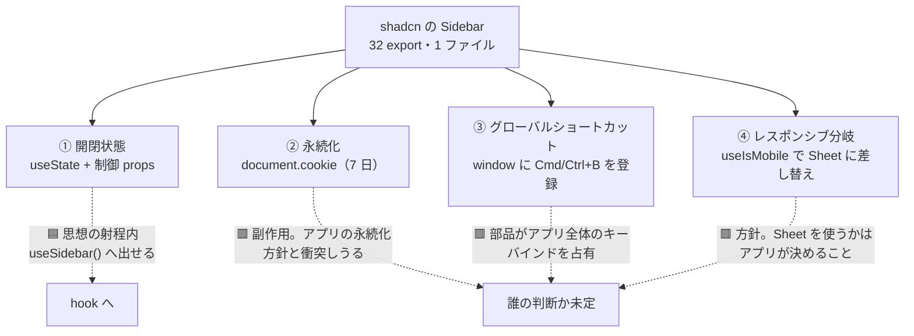
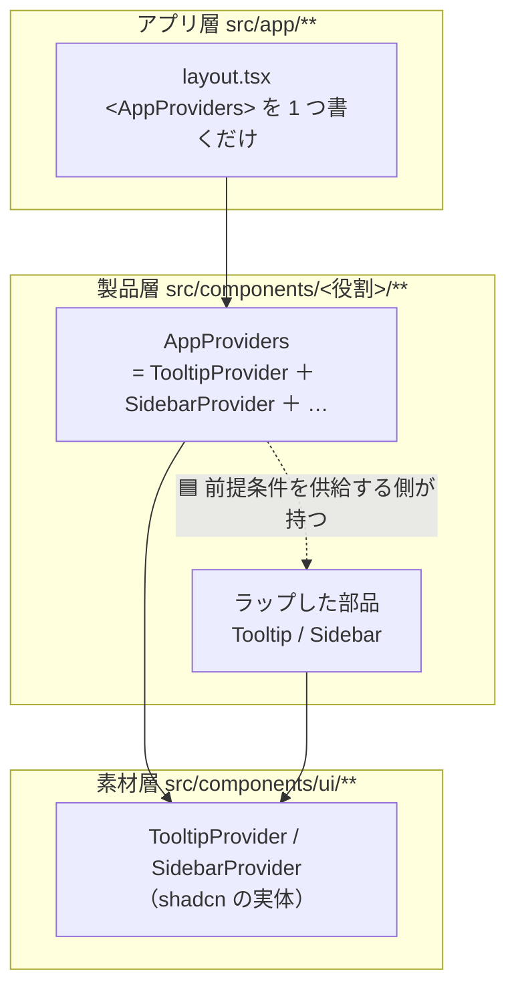

# 状態と Provider の置き場（調査2）

> 手3 の **D6 / D10** の前段。[手順書 §2.5](手順/手3_Components層と製品層の分離.md) の調査ブロック 2。
> **事実を集めて構造化するところまで。**設計判断はしない（判断は手順書 §2 へ戻す）。
> 🟨 図解（**使い捨て**）: [Sidebar は関心事を四つ束ねている](https://claude.ai/code/artifact/103393a4-3043-4d99-bd62-0c99b6f283ac)
> — 切り出す対象を選び替えて損得を見る分解器と、Provider 3 案のコード比較。**本文が正本。**

---

## 0. 答えを出す問い

ユーザーの発言（2026-07-26）:

> **D6（Sidebar の state）: 正直イメージがつかない。全体の設計からベストプラクティスを考えて行きたい。**
> **D10（Provider の置き場）: なんとなく A な気がしているが、なぜだかは言語化できない。**

**先に結論**:

| # | 分かったこと |
|---|---|
| 1 | 🟥 **D6 を動機づけていた「lint 赤の 6 割」は、state を切り出しても消えない。**Sidebar の赤 17 件のうち **11 件（65%）は任意値**で state と無関係（§1） |
| 2 | 🟥 **Sidebar は「状態」を 1 つ持っているのではなく、関心事を 4 つ束ねている。**思想の「状態は hook へ」が想定しているのはそのうち 1 つだけ（§2） |
| 3 | 🟦 **Sidebar の開閉は React の実務でいう "layout state" にあたり、Context を使うのが定石。**shadcn の実装は主流の作法から外れていない（§3） |
| 4 | 🟦 **D10=A の言語化: Provider は「部品」ではなく「部品が動くための前提条件」。**前提条件は、その部品を供給する層が面倒を見る（§4） |

---

## 1. 🟥 実測 — 赤 17 件の内訳は state 由来ではない

`./node_modules/.bin/eslint src/components/ui/sidebar.tsx`（2026-07-26）:

| ルール | 件数 | 該当行 | state 由来か |
|---|---|---|---|
| **`tailwindcss/no-arbitrary-value`** | **11** | — | 🟥 **無関係。**`calc(var(--sidebar-width)*-1)` 等のレイアウト計算 |
| `@typescript-eslint/restrict-template-expressions` | 3 | L85 ×2 / L592 | 🟨 L85 は **cookie 書き込み**＝ state 由来。L592 は幅の読み出し |
| `@typescript-eslint/no-confusing-void-expression` | 3 | L92 ×2 / L108 | 🟦 **state 由来**（`toggleSidebar` とキーボードハンドラ） |

**state を hook へ切り出して消えるのは、多く見積もって 6 件。11 件は残る。**

> 🟥 **[handoff.md](handoff.md) の未決 #2 は「lint 赤の 6 割」を動機に挙げていたが、これは誤読を招く。**
> 「6 割」は `sidebar.tsx` 17 ＋ `use-mobile.ts` 3 = 20 件が**全体 33 件に占める割合**の話であって、
> **その 20 件が state に起因するという意味ではない**。
> → **D6 を「lint を減らすため」に決める根拠は消えた。**残るのは思想の話だけになる。

---

## 2. 🟥 Sidebar は関心事を 4 つ束ねている

`src/components/ui/sidebar.tsx` の実測。**「状態を持っている」という一言で括ると判断を誤る。**

| # | 関心事 | 実装 | 思想の「状態は hook へ」の射程内か |
|---|---|---|---|
| 1 | **開閉状態** | `useState(defaultOpen)` ＋ 制御 props（`open` / `onOpenChange`）のパススルー | 🟦 **射程内。**これが「状態」 |
| 2 | **永続化** | `document.cookie` に 7 日間書く（`SIDEBAR_COOKIE_MAX_AGE`） | 🟥 **射程外。**状態ではなく**副作用** |
| 3 | **グローバルショートカット** | `window.addEventListener('keydown')` で **Cmd/Ctrl+B** を登録 | 🟥 **射程外。**アプリ全体のキーバインドを部品が勝手に占有している |
| 4 | **レスポンシブ分岐** | `useIsMobile()` で mobile 版（Sheet）に差し替え | 🟥 **射程外。**状態ではなく**方針** |

> **切り出すかどうかの問いは、実は 4 つある。**①だけを見て「切り出す／切り出さない」を決めると、②③④が付いてくる。
> 特に ③ は、**Redmine のチケット一覧で Cmd/Ctrl+B を別の用途に使いたくなったとき初めて表面化する**種類の衝突。

---

## 3. React 側の定石 — 「状態を外に出す」は無条件に善ではない

| 原則 | 中身 | Sidebar に当てると |
|---|---|---|
| **State colocation** | 状態は**使う場所のできるだけ近く**に置く。「念のため」上に持ち上げない。持ち上げるほど再レンダリングの範囲が広がる | 🟨 開閉は Sidebar 配下でしか使わない＝**近くに置くのが正しい** |
| **Lift state up（最小限）** | 持ち上げるのは**共通の親まで**。それ以上は上げない | 🟦 shadcn の `SidebarProvider` は「Sidebar 配下の共通の親」に置かれている＝定石どおり |
| **Context は "layout / global" 状態に使う** | テーマ・認証ユーザー・カート・**レイアウト状態**は Context が適切 | 🟦 **サイドバーの開閉はまさに layout state。**Context の使い方として外れていない |
| **Compound components** | 親が状態を持ち、子は Context 経由で受ける。中間コンポーネントに prop を通さない | 🟦 shadcn の Sidebar（32 export）はこの形そのもの |

> 🟦 **したがって「shadcn の Sidebar は思想に反している」という読みは、React の実務作法の側から見ると成り立たない。**
> 思想の「状態は role の外へ」は**分類の話**（役割 9 カテゴリに状態という軸を持ち込まない）であって、
> **実装上どこに状態を置くべきかの話ではない**。2 つは別の問題であり、Sidebar では**たまたま同じ場所を指していない**。

### 🟨 それでも切り出す理由があるとすれば

| 理由 | 成立するか |
|---|---|
| lint 赤を減らす | 🟥 **成立しない**（§1。減るのは最大 6/17） |
| 思想の一貫性（`useXxxModal` と揃える） | 🟨 成立する。ただし **[部品カタログ 表4](部品カタログ.md) の結論は「例外は Sidebar 1 つ」**で、他の Overlay 系はラッパー無しで思想が通っている |
| ②③④ をアプリの方針で差し替えられるようにする | 🟦 **成立する。**これが最も強い理由だが、**まだ差し替えたい要求は 1 度も出ていない**（2 回ルール） |
| 今回の題材で本当に要るか | 🟨 **未確認。**チケット一覧 1 画面（[DR-0002](DR/DR-0002-verify-three-layers-not-screens.md)）にサイドバーが要るかを先に問うべき |

---

## 4. Provider の置き場（D10 の言語化）

### Provider を要求する部品は 2 件（実測）

| 部品 | 要求するもの | 種類 |
|---|---|---|
| `tooltip.tsx` | `TooltipProvider` | 🟦 **設定の配布**（`delayDuration` 等）。状態を持たない |
| `sidebar.tsx` | `SidebarProvider` | 🟨 **状態の配布**（§2 の 4 つ） |

**この 2 つは種類が違う。**Tooltip の Provider は「設定を配る」だけで、Sidebar の Provider は「状態を持つ」。
[部品カタログ 表2 の指摘 3](部品カタログ.md)（`behaviorHook` では Provider を表せない）は、この差を捉えていなかった。

### ユーザーの直感 A（製品層に集約）の言語化

> **Provider は「部品」ではなく、「部品が動くための前提条件」である。**
> **前提条件は、その部品を供給する層が面倒を見るべきで、使う側に押し付けてはいけない。**

これが A を選ぶ理由の言語化になる。理由を 3 つに分けると:

| # | 理由 | 根拠 |
|---|---|---|
| 1 | **役割 9 カテゴリは「画面に出るもの」の分類**なので、Provider はどこにも属さない。属さないものを分類表に無理に入れると分類が壊れる | [部品カタログ 表2 の指摘 1](部品カタログ.md)（`Direction` が分類できなかったのと同じ理由） |
| 2 | **D1=(c) で製品層が Tooltip をラップすると決まっている。**ラップした部品が Provider 無しで壊れるなら、**それはラッパーが仕事を終えていない** | 手順書 §2 D1 |
| 3 | **アプリ層に Provider を並べさせると "Provider hell" になる。**React の定石は `<AppProviders>` 1 つに畳むこと | Provider composition パターン |

> 🟨 **急がなくてよい理由も 1 つある。**手2b で `preview.tsx` の decorator に**暫定の置き場が既にある**ので、
> Storybook 側は動いている。**アプリ層で画面を組むのは手4** なので、D10 は手4 まで持ち越しても実装は止まらない。

---

## 5. 🟦 思想への指摘（書き換えはしない。判断はユーザー）

[部品カタログ の指摘 1〜3](部品カタログ.md)・[調査3 の指摘 4](タッチターゲットとサイズ密度.md) に続く 5 件目。

5. **「状態は hook へ」は、状態と副作用を区別していない。**
   Sidebar が抱えていたのは状態 1 つ・副作用 2 つ・方針 1 つだった（§2）。
   「状態を role の外に出す」だけでは、**副作用（cookie 永続・グローバルキーバインド）の置き場が決まらない**。
   `stateful` フラグも同じで、**「状態を持つ」とだけ記録しても、何を持っているかが分からない**。
   → フラグを増やすなら `sideEffect` / `globalKeybinding` のような軸が要るかもしれないが、
   **必要性はまだ 1 度しか証明されていない**（2 回ルール）ので、本書は指摘に留める。

---

## 6. 出典

| 出典 | 取得 | 何を取ったか |
|---|---|---|
| `./node_modules/.bin/eslint src/components/ui/sidebar.tsx -f json` 実測 | 2026-07-26 | 赤 17 件の内訳（任意値 11 ／ 型系 6）と該当行 |
| `src/components/ui/sidebar.tsx` 実測 | 2026-07-26 | 4 つの関心事（開閉 / cookie / Cmd+B / mobile 分岐）と `SidebarContext` |
| `grep -l Provider src/components/ui/*.tsx` 実測 | 2026-07-26 | **Provider を要求する部品は 2 件**（tooltip / sidebar） |
| [State Colocation will make your React app faster（Kent C. Dodds）](https://kentcdodds.com/blog/state-colocation-will-make-your-react-app-faster) | 2026-07-26 | 状態は使う場所の近くに置く。持ち上げるほど再レンダリング範囲が広がる |
| [Colocation of State（Steve Kinney）](https://stevekinney.com/courses/react-performance/colocation-of-state) | 2026-07-26 | 「念のため上げる」をしない。**layout / global 状態は Context が適切** |
| [My React Context Best Practices](https://non-traditional.dev/my-react-context-best-practices-2e9288628ae7) | 2026-07-26 | Context の使いどころと compound components |
| [Provider Pattern（patterns.dev）](https://www.patterns.dev/vanilla/provider-pattern/) | 2026-07-26 | Provider パターンの定義 |
| [React Provider Composition: Exorcising Provider Hell](https://medium.com/@d3d.me/react-provider-composition-exorcising-provider-hell-d98cd3a78b29) | 2026-07-26 | Provider を 1 つに畳む合成パターン（D10=A の裏付け） |

> ⚠ **本書も 1 件、本 repo の記録を訂正することになった**（§1）。
> [handoff.md](handoff.md) 未決 #2 の「lint 赤の 6 割」は、**state を切り出せば減るという含みを持っていたが、実測では減らない**。
