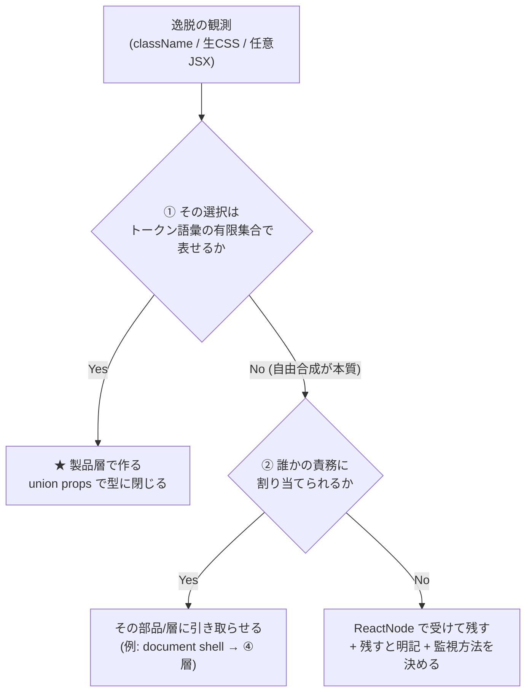

# 製品層の部品設計（手8c）

> 手8c の**設計**（D4=C の 2 本目）。調査は [二層構造の設計.md](二層構造の設計.md)（調査1）と[製品層の抽象化の軸.md](製品層の抽象化の軸.md)（調査2）。
> **この手では実装しない**（D6=B: props シグネチャまで）。次の手がこのまま実装に入れる形を目指す。
> 入力は 6 周ぶんの実測（[実行記録 §手8c H8C-01](実行記録.md)）と DS 8 本の調査。
> 🆕 **D9=B（2026-08-07・ユーザー指示）で確定範囲を広げた**——増分 4 件だけでなく、**全部品の API 方針表（§2.5）・語彙の全量突き合わせ（§7）・document shell の器の確定（§3.3）・合成方針の明文化（§8）**までがこの設計。**確定の判定はユーザー**（PR のマージが確定の印）。

---

## 1. 判定規則（Q1）— 「素材層のまま出す」と「製品層で作る」の境界

### 1.1 境界の原理

**境界は「見た目の管轄権」で決まる。**調査で headless 二層を持つ 4 本（Radix・Base UI・Ark・React Aria）が全てこの軸で切っていた（[二層構造の設計 §6](二層構造の設計.md)）:

- **素材層** = 見た目を決めない層（"unstyled … complete control over styling" — Radix）。`className` が開いているのは**この層の設計**であって欠陥ではない
- **製品層** = 見た目を決める層。**画面（と design agent）が見た目を選ぶ必要が生じた箇所を、トークン語彙の props として引き取る**

我々の製品層が引き取るべきものは、**利用側が `className` / 生 CSS / 任意 JSX で書かざるを得なかった「見た目の選択」**である。

### 1.2 判定手順（この順に問う。「ケースバイケース」を許さない形）

> 🆕 🟥 **2026-08-07: 段が 1 つ落ちた**（[DR-0077](DR/DR-0077-abolish-the-two-occurrence-rule.md)・ユーザー判断）。
> **旧①「同じ場所から 2 回以上出たか」は廃止。**回数は**記録する観測量**としては数え続けるが、
> **判断の条件にはしない。**🟦 **本節の分類結果（§2・§2.5・§6）は 1 件も変わらない**——
> 旧①が単独で結論を決めた行が無いため（DR-0077 §影響 2）。以下は**新しい 2 段**。



| # | 問い | Yes | No |
| --- | --- | --- | --- |
| ~~旧①~~ | ~~**同じ場所から 2 回以上出たか**~~ | 🆕 **廃止**（[DR-0077](DR/DR-0077-abolish-the-two-occurrence-rule.md)）。回数は**観測量として記録するだけ** | — |
| ① | **その選択はトークン語彙の有限集合で表せるか**（幅・書式・色調…） | ★ **製品層で作る。**union props で**型に閉じる**（[DR-0032](DR/DR-0032-layout-primitives-take-props-not-classname.md) の形。Polaris `Box` の `padding?: SpaceScale` と同型） | ② へ |
| ② | **誰かの責務に割り当てられるか**（例: document 全体に効くもの → 一番外の ④ 層） | その部品・層に引き取らせる | **ReactNode で受けて残す。**「残す」と明記し、**監視方法（grep できる形）**を決める |

> 🟥 **「まだ作らない」と決めるときは理由を書く**（CLAUDE.md）。**「1 回目だから」は理由にならない。**
> 使えるのは「語彙で表せない」「責務の持ち主が決まっていない」「見た目が変わる」など**中身の理由**だけ。

### 1.3 なぜこの規則か（調査からの根拠）

1. 🆕 ~~**① は 2 回ルール**（CLAUDE.md）そのもの。~~ → **廃止**（[DR-0077](DR/DR-0077-abolish-the-two-occurrence-rule.md)）。**素材層 15 件の予防的ラッパーを作らない結論は変わらない**——需要が 6 周で 0 回だからではなく、**引き取るべき「見た目の選択」がまだ 1 つも特定できていない**（① で語彙に落ちない・② で責務の持ち主が無い）ため。Polaris が「全部閉じる」を選べたのは自社 1 プロダクト（admin）に最適化できるからで、我々は**引き取る対象が言語化できた箇所から閉じる**
2. **② は「閉じた 2 本」の共通設計**——Spectrum は「**外に効く layout オプションだけ許可・内側は不許可**」（RFC 原文）、Polaris は「**トークン名の props だけ**」。どちらも**禁止ではなく、代替の語彙を型で与えている**（[DR-0063](DR/DR-0063-forbidding-without-an-alternative-fails.md) の機械化）。そして手8 の実測が同じ答えを出している——**props の形そのものが答え**（`width="md"` なら綴り事故も起きえない）
3. **②（旧③）の「残す」は Radix Themes・Spectrum の運用**——逃げ道をゼロにした DS は 8 本中 2 本だけで、その 2 本も**部品の外**（トークンで自作・UNSAFE_）に出口を用意している。出口の無い禁止は [DR-0069](DR/DR-0069-adding-prohibitions-to-the-header-degraded-the-output.md)（禁止だけ足すと別の場所が壊れる）を再演する

## 2. 作る部品の一覧（Q2）— 根拠 0 回のものは入っていない

| # | 部品・変更 | 足す根拠（実測回数） | 判定規則 | 種別 |
| --- | --- | --- | --- | --- |
| 1 | **`Select` ラッパー**——`SelectTrigger` に `width` prop | **6/6 周**（毎回同じ 2 箇所。r1 `w-48`→r3/r6 `w-field-md`→r4/r5 `class=` 事故） | ①Yes ②Yes（`w-field-sm/md/lg` の 3 語） | ② 製品層・ラッパー（素通し → 既定値ラッパーへ昇格） |
| 2 | **`DataGrid` の宣言的列オプション**——`columns` を `ColumnDef` 素通しから自前の `DataGridColumn` へ | **6/6 周**（語彙表の外に出た逸脱は全部ここ: `tabular-nums`・`font-emphasis`・cell 内 `text-table`） | ①Yes ②Yes（`kind` / `emphasis` の 2 オプション ＋ 基本 typography は部品の既定） | ② 製品層・自作の API 変更 |
| 3 | **`AppShell` に document shell 責務**——html/body reset 相当を ④ 層が持つ | **5/6 周**（`<style>` の `html, body { margin:0… }`。手順書 §1 の「4 回」は数え損ないで 5 回） | ①Yes ②No ③Yes（**「誰も持っていない」が原因**。自称 "page skeleton" の AppShell が引き取る） | ④ Templates の責務追加 |
| 4 | **`Link` 部品**（Navigation） | **4/6 周**（`a { color: var(--primary) }` の生 CSS） | ①Yes ②Yes（tone は semantic 色 1 語＋ external の有無） | ② 製品層・自作（新規） |
| 5 | **語彙表と tokens.css の突き合わせ**——`font-emphasis` を header 語彙表に載せる（か text-emphasis に一本化） | 実測 3 周（r1・r2・r6）＋ **我々自身が `AppShell` で使っている** | —（部品ではなく語彙の整備。[DR-0063](DR/DR-0063-forbidding-without-an-alternative-fails.md) の「語彙を足す」） | 語彙 |
| 6 | **conventions header の教え文の対更新 3 箇所** ① L53 `<SelectTrigger className="w-field-md">` → `width="md"` ② L86 「`columns`（TanStack `ColumnDef[]`）」→ `DataGridColumn[]` ③ 🆕 **document reset の保証を 1 文足す**（§3.3） | ① header L53 が**現行の書き方を教えている**（棚卸しの新発見 1）／ ② header が**依存の型名を名指ししている**（[DR-0072](DR/DR-0072-no-passthrough-of-dependency-types.md) に反する）／ ③ 5/6 周の `<style>` は**保証が書かれていない**ことへの反応 | —（#1〜#3 と**同一コミットで**変える。部品と散文の同時更新） | 散文 |

**作らないもの**: 素材層 15 件の予防的ラッパー（**0/6 周**・🆕 **理由は回数ではなく「引き取るべき見た目の選択が 1 つも特定できていない」こと**——[DR-0077](DR/DR-0077-abolish-the-two-occurrence-rule.md)）。`Box` の廃止（6 手連続 0 回で問題が起きていない・§4）。

## 2.5 全部品の API 方針表 — 判定規則を公開部品の全量に一巡させた（D9-①）

> `src/index.ts` の公開部品全 33 件。**逸脱の実測回数**は 6 周（[実行記録 §手8c H8C-01](実行記録.md)）から。
> 「素通し」= 上流 API のまま（`className` は上流どおり開いている）。「閉」= className/style を型から消してある。

| 部品 | 種別 | className | 逸脱実測 | 方針 |
| --- | --- | --- | --- | --- |
| `Select`（**`SelectTrigger` のみ**） | 再輸出 → **ラッパーへ昇格** | 開 → **閉**（`width` prop） | 🟥 **6/6 周** | ★ **今回の変更**（§3.1）。`Select`/`SelectContent`/`SelectItem` 等は素通しのまま |
| `DataGrid` | 自作 | 閉 | 🟥 **6/6 周**（cell 経由） | ★ **今回の変更**（§3.2・列オプション化） |
| `AppShell` | 自作（④） | 閉 | 🟥 **5/6 周**（document shell 欠け） | ★ **今回の変更**（§3.3・責務の名乗り。**props 不変・CSS 0 行**——器は配布 CSS の base レイヤ） |
| `Link` | **新規** | 閉 | 🟥 **4/6 周**（部品が無い） | ★ **今回の新設**（§3.4） |
| `Box` | 自作 | **開（唯一の逃げ道）** | 1/6 周（r2・`Card` 追加で 0 に） | 維持（§4。毎手 0 回を監視） |
| `Container` / `Grid` / `Inline` / `Section` / `Spacer` / `Stack` | 自作 Layout | 閉（[DR-0032](DR/DR-0032-layout-primitives-take-props-not-classname.md)） | 0 | 維持 |
| `StatusPill` | 自作 | 閉 | 0 | 維持。🟨 semantic 色（success/warning）の**唯一の出口**（§7） |
| `EmptyState` / `ListDetail` / `useListDetail` | ③ Patterns | 閉 | 0 | 維持 |
| `AppProviders` | Provider | —（部品ではない） | 0 | 維持（§3.3 の器の判断に関与） |
| `Button` | ラッパー | 開（上流のまま） | 0 | 維持（当たり判定 44px は既に製品層が持つ・[DR-0034](DR/DR-0034-touch-target-visual-32-hit-44.md)） |
| `Sidebar`（一式） | ラッパー | 開（上流のまま） | 0 | 維持 |
| `Badge` / `Empty` / `Skeleton` / `Table` / `Label` / `Separator` / `Card` / `Pagination` / `Dialog` / `DropdownMenu` / `Popover` / `Sheet` / `Tooltip` / `Checkbox` / `Input` | 再輸出 15 件 | 開（上流のまま） | **0** | **素通しのまま**（🆕 **引き取るべき見た目の選択が特定できた部品から**個別にラッパーへ昇格させる——`Select` が最初の 1 件。**回数は条件にしない**・[DR-0077](DR/DR-0077-abolish-the-two-occurrence-rule.md)） |

★ **この表が「設計の全量」**。今回動くのは 4 行（Select・DataGrid・AppShell・Link）で、**残り 29 件は「現状維持」を明示的に決めた**（未決ではない）。

## 3. props シグネチャ（D6=B）

各部品で **`className` を受けるかを明示**する（H8C-06 の要求）。

### 3.1 `Select` ラッパー（`src/components/Selection/Select.tsx` を素通し → ラッパーへ）

```ts
import { WIDTH_FIELD } from '@/components/Layout/tokens'; // 新設: field 幅の union

/** 幅の語彙。tokens.css の --container-field-* に対応（DR-0061）。 */
export const FIELD_WIDTH = {
  sm: 'w-field-sm',
  md: 'w-field-md',
  lg: 'w-field-lg',
} as const;
export type FieldWidth = keyof typeof FIELD_WIDTH;

export interface SelectTriggerProps
  extends Omit<React.ComponentProps<typeof UiSelectTrigger>, 'className'> {
  /** フィールドの幅。語彙は w-field-*。未指定は内容なり（上流の既定）。 */
  width?: FieldWidth;
}
// className: 🟥 受けない（Omit で型から消す）。幅以外の見た目の需要が 2 回出たら語彙を足す
```

- `Select` / `SelectContent` / `SelectItem` ほかは**素通しのまま**（逸脱の実測が無い）
- 🟨 上流（shadcn）の `SelectTrigger` は `className` を受ける。ラッパーで **Omit するのは我々の境界**であって上流の変更ではない（手3 D1=(c) の「既定値ラッパー」と同じ位置）

### 3.2 `DataGrid` の列オプション（`DataGridProps` の API 変更）

```ts
/** 列の定義。TanStack の ColumnDef は公開 API から消える（§5）。 */
export interface DataGridColumn<TData> {
  key: string;
  header: React.ReactNode;
  /** セルの中身。部品（StatusPill 等）の合成はここで行う。 */
  accessor: (row: TData) => React.ReactNode;
  /**
   * 列の種別。'numeric'（ID・件数・日時などの密データ）は部品側が
   * 等幅数字（tabular-nums）を当てる。呼び出し側は書式クラスを書かない。
   * @default 'text'
   */
  kind?: 'text' | 'numeric';
  /** 🟦 強調（題名・氏名など、行の主役の列）。部品側が強調書式を当てる。 */
  emphasis?: boolean;
}

export interface DataGridProps<TData> {
  data: TData[];
  columns: DataGridColumn<TData>[];   // ← ColumnDef<TData, TValue>[] を置き換え
  onRowSelect?: (row: TData) => void;
  empty?: React.ReactNode;
}
// className: 🟥 受けない（現行どおり）
// 内部で DataGridColumn → ColumnDef へ変換する（書式フラグは ColumnDef.meta に載せる
// —— meta は TanStack が「利用者定義の列情報の公式の置き場」として用意している口）。
// TanStack は実装詳細に戻る
```

**セル・ヘッダの基本 typography は列オプションではなく部品の既定にする**——
`DataGrid` が全セルに `text-table`、全ヘッダに `text-label` を当てる（tmp-admin §4.4 の一覧仕様の写し）。
r3/r6 で cell 内に書かれた `text-table` ×10 は「部品が既定を当てていない」ことへの反応なので、**既定にすれば列ごとの指定は不要**。

先例との突き合わせ（2026-08-07 の追加調査・[実行記録 §手8c D10](実行記録.md)）:

- 🟦 **「数値列を列オプションで宣言し、部品が書式を当てる」は先例 2 件**——MUI X `GridColDef.type: 'number'`（右寄せ＋`toLocaleString()`＋ソート・フィルタが束で当たる）／ Polaris DataTable `columnContentTypes: ['text','numeric']`（右寄せ）。**宣言と任意 render の併存**も MUI が解決順序まで明文化している
- 🟥 **boolean 宣言（`numeric?: boolean`）の先例は 5 件中 0 件**——enum が多数派。→ **初版の `numeric` を `kind: 'text' | 'numeric'` に変更した**（Polaris と同語彙・将来 `'date'` 等を足せる）
- 🟥 **`size`（列ごとの typography 指定）の先例も 0 件**——どの DS の列 props も寸法のみ。→ **初版の `size` オプションは削除し、部品の既定に置き換えた**（上記）
- 🟨 `emphasis` の直接の先例は無い（最接近は TanStack `meta` ＝利用者定義フラグの公式置き場——まさに実装で使う口）。**我々の実測（強調書式の逸脱 4 周）に基づく独自オプション**として持つ
- 🟨 先例（MUI `align:'right'`）と違い**寄せは自動で当てない**——6 周の逸脱に寄せは 1 件も無く、tmp-admin §4.4 にも規定が無い。足すなら実測が出てから（🆕 根拠は実測の中身。回数は条件にしない）
- 🟨 MUI / TanStack は「ソート・フィルタ用の生値」と「表示」を分ける（`valueGetter` / `accessorFn`）。我々の `accessor` は表示専用の一本——**現行 DataGrid はソート UI を持たないので生値の口は作らない**。ソートの需要が出たら `accessorFn` 相当を足す

- 🟥 **手4 の実装コメント「密データは呼び出し側が等幅・tabular-nums で描く」を撤回する設計**——書式の管轄を部品側へ移す。面③の逸脱（6/6 周）はこの押し出しの帰結だった。🟨 tabular-nums の自動適用は先例に無いが、我々の逸脱実測（6 周）が根拠
- 🟨 `accessor` は ReactNode を返す口として**残る**（§4 の逃げ道 3）。残す理由: セルには `StatusPill` 等の**部品の合成**が要り、これは語彙の有限集合で表せない（規則①No）。**className の文字列はここを通らない**（書式は kind/emphasis と部品既定が引き取る）。className を列に開けるか閉じるかは DS でも割れており（開: MUI・Carbon・Polaris IndexTable ／ **閉: Spectrum・Polaris DataTable**）、**閉じる側も確立された立場**
- 🟦 副産物: 生成物の `React.createElement(StatusPill, {tone}, children)` 型不整合（[未決 #28](handoff.md)）は、**列オプション化で cell 関数自体が生成物から消える**方向に解消する見込み（検算 §6.2）

### 3.3 `AppShell` の document shell（責務の追加）

```ts
export interface AppShellProps {
  brand: React.ReactNode;
  nav: NavItem[];
  children: React.ReactNode;
  // 変更なし。責務の追加は props ではなく「保証の名乗り」:
  //   - document reset（html/body の margin/padding）は配布 CSS の @layer base が保証する
  //   - AppShell の外に <style> で reset を書く必要は無い
}
// className: 🟥 受けない（現行どおり）
```

- 🟥 **props は変わらない。変わるのは「保証」**——「AppShell の外に document reset を書く必要は無い」と .d.ts コメントと header で宣言する。5/6 周の `<style>` reset は「誰も保証していないように見える」ことへの正しい反応だった

#### 器の確定（D9-③・🆕 2026-08-07）

**先例調査 D10-(i)**（一次情報・取得日 2026-08-07）:

| DS | 器 | 出典 |
| --- | --- | --- |
| **MUI** | **木の中の部品**——`<CssBaseline />` を root に置く（"kickstart an elegant, consistent, and simple baseline"）。html の `box-sizing`・body の margin 除去・背景色・typography を当てる。局所版 `<ScopedCssBaseline>` も持つ | <https://mui.com/material-ui/react-css-baseline/> |
| **Chakra v3** | **system 設定**——`createSystem(defaultConfig, { preflight: false })` で切る（v2 の `resetCss` prop を置き換えた）。既定 ON で Provider が注入 | <https://chakra-ui.com/docs/get-started/migration> |
| **Tailwind v4** | **CSS の base レイヤ**——`@import "tailwindcss/preflight.css" layer(base)`。`@import "tailwindcss"` に含まれる。拡張は `@layer base { … }`、外すのは import を省く | <https://tailwindcss.com/docs/preflight> |
| **React Spectrum** | **root の Provider が必須**（"A Provider must be the root component of your application"）。ただし配るのは**テーマ変数の CSS module** であって document reset ではない——html/body への言及は無い | <https://react-spectrum.adobe.com/react-spectrum/Provider.html> |

🟥 **調査中に前提が 1 つ崩れた。**`node_modules/tailwindcss/index.css` を読むと、**Preflight は `@import 'tailwindcss'` の時点で `@layer base` に展開済み**で、
`*, ::after, ::before, ::backdrop, ::file-selector-button { box-sizing: border-box; margin: 0; padding: 0; border: 0 solid }` が入っている（実測 2026-08-07）。
**`*` は html と body にも当たる**ので、**agent が 5 周書いていた `html,body{margin:0;padding:0}` は、我々の CSS が届いている限り既に効いている。**
→ **欠けていたのは reset そのものではなく「保証されているという宣言」**だった可能性が高い（面④a の性格が変わる）。

| # | 器の選択肢 | 判定 |
| --- | --- | --- |
| **A** | **配布 CSS の `@layer base`**（現状＝ Preflight ＋ `globals.css` L161-171 の `body { bg-background text-foreground }`）。**足す CSS は無く、宣言だけ足す** | ✅ **採用。**Tailwind・Chakra と同型で、**我々のスタックでは既にこの器が動いている**。`_ds_bundle.css` は Storybook のコンパイル済み CSS から採取されるので、同じ経路で境界を越える |
| **B** | `AppProviders` が `<style>` を注入する（MUI `CssBaseline` 型） | 🟥 **不採用。**CSS-in-JS を持たないスタックで注入経路を新設することになり、**配布 CSS と二重管理**になる。「agent に書かせない `<style>` を我々が書く」形も筋が悪い |
| **C** | `AppShell` が `<style>` を注入する | 🟥 **不採用。**AppShell は 1 画面に複数置ける部品で、document への副作用を持つべきではない（B より悪い） |

★ **確定**: **器は A（配布 CSS の base レイヤ）。AppShell は CSS を持たず、「保証の所在」だけを名乗る。**
実装で足すのは **① `AppShell.d.ts` のコメント ② conventions header の 1 文**（一覧 #6-③）で、**CSS は 1 行も足さない**。

- 🟨 `min-height: 100%`（r1 だけが書いた）は**足さない**——`SidebarProvider` が `min-h-svh` を持っており（`ui/sidebar.tsx` L140）viewport 基準なので親の高さに依存しない。🆕 **理由は回数ではなく「既に満たされているので足す必要が無い」**（1/6 周は観測量として記録するだけ）
- 🟥 **この確定には未検証の前提が 1 つある**——「`_ds_bundle.css` に Preflight が載っている」は**まだ grep していない**（`.design-sync/` の生成物は gitignore で手元に残っていない）。
  **7 周目の再同期の直後に赤テストを打つ**: `_ds_bundle.css` に `margin:0` を含む `*` セレクタ規則があるか。
  🟦 **載っていれば**上記のとおり宣言だけで足りる。🟥 **載っていなければ**「配布 CSS が document に効かない」＝器 A が境界を越えていないことになり、**B へ倒す**（そのときは AppProviders が器）。
  **どちらでも設計の言い分が変わるので、実装より先にこの 1 本を打つ。**

### 3.4 `Link`（`src/components/Navigation/Link.tsx`・新規）

```ts
export interface LinkProps
  extends Omit<React.ComponentProps<'a'>, 'className' | 'style'> {
  href: string;
  /** 色調。既定 'primary'（a { color: var(--primary) } の代替）。 */
  tone?: 'primary' | 'muted';
  /** 外部リンク。target=_blank + rel を部品側が付ける。 */
  external?: boolean;
  children: React.ReactNode;
}
// className: 🟥 受けない（NoStyleProps と同じ Omit 型）
```

- hover の下線・visited の扱いなどの**見た目は部品が決める**（4/6 周の `<style>` が書いていたもの）
- `src/index.ts` へ export を足す（`Link` が無いことが面④b の原因）
- 🆕 **面④b の根本原因が確定した**（D10-(i) の副産物・2026-08-07）——Tailwind Preflight は
  `a { color: inherit; text-decoration: inherit }` で **リンクの見た目を意図的に剥がす**（"Reset links to optimize for opt-in styling instead of opt-out"・`node_modules/tailwindcss/preflight.css` 実測）。
  つまり **`a{color:var(--primary)}` は「誰も足していない見た目を agent が足し直していた」**のであって、面④a（既に効いている reset を書き足していた）とは**性格が逆**。
  🟥 **同じ `<style>` の 2 行が、正反対の原因から出ていた。**「`<style>` が出た」だけで一括りにすると読み違える

## 4. 逃げ道の扱い（Q3）

| 逃げ道 | 扱い | 監視方法 |
| --- | --- | --- |
| **`Box` の `className`** | 🟦 **残す**（設計上の唯一の名指しの逃げ道・[DR-0032](DR/DR-0032-layout-primitives-take-props-not-classname.md)）。Spectrum の `UNSAFE_` と同じ「**名前が破りを宣言する**」役割を Box という部品名が担う | 手3〜手8 で **6 手連続 0 回**。毎手の完了時に `Box` 使用箇所を数える（既存の未決 #21） |
| **素材層 16 件の `className`（再輸出の素通し）** | 🟦 **開いたまま**（上流の設計。閉じるのは #1 のように**引き取るべき見た目の選択が特定できた部品だけ**） | 生成物の `class-name=` / `class=` を周ごとに grep（H8C-01 の形） |
| **`DataGrid.accessor` の ReactNode** | 🟨 **残す**（部品合成に必要・規則①No）。ただし**書式の語彙（`kind` / `emphasis`）と部品既定を対で与える**ので、className がここを通る動機は消える | 生成物の cell 相当部の `tabular-nums` 等**書式クラスの出現数**（0 が期待値） |
| **`<style>` への生 CSS** | 🟥 **設計では塞げない**（DSL 側の口）。#3・#4 で**書く動機を消す**のが本設計——④a は**保証の宣言**で、④b は**部品**で消す（原因が逆・§3.4）。禁止文は足さない（[DR-0069](DR/DR-0069-adding-prohibitions-to-the-header-degraded-the-output.md)） | `<style` タグの出現数（0 が期待値） |

★ **Q3 の答え**: 「逃げ道を持たない製品層」は**成立する**（Polaris・Spectrum が 7 年以上運用）。ただし両者とも**部品の外に出口**（トークンで自作・UNSAFE_・style props 許可リスト）を持つ。**逃げ道はゼロにするものではなく、(a) 数を絞り (b) 名指しで目立たせ (c) 代替語彙と対にする**——我々の Box + 語彙 props はこの 3 条件を既に満たしており、**維持でよい**。

## 5. 依存の型の扱い（Q6）

**規則: 依存パッケージの型を公開 API に素通ししない。Omit で口を選別し、自層の名前で出し直す。**

- 調査の裏づけ: 素通しは shadcn だけで、**コード所有モデル（利用者が編集できる）とセット**で成立している。パッケージ境界を保つ DS は全て選別か出し直し——MUI（`export type { … } from '@mui/base/…'`）・Ark/Chakra（**Omit＋prefix 改名**して 3 層貫通）・Spectrum（`extends Omit<AriaButtonProps, 'onClick'>, StyleProps`）・Primer（"keeping the exported types close to what we author"）・Polaris（再輸出しない）
- 我々は **bundle 配布（パッケージ境界型）なのに素通し**をしていた——`ColumnDef` と一緒に `cell` の任意 JSX の口が公開され、6 周ぶんの語彙外逸脱が全部そこから出た
- 適用: §3.2 の `DataGridColumn`（TanStack は実装詳細へ戻る）。`ListDetailState` 等の自前型は現状維持
- 🟨 副作用の見込み: 受け手は `.d.t` から lint を自動生成する（[DR-0059](DR/DR-0059-receiver-generates-its-own-adherence-lint.md)）。**依存の型が .d.ts から消えると、受け手の型抽出（未 import の `ColumnDef` で 5 件エラー・[未決 #29](handoff.md)）も軽くなる方向**

## 6. 検算（Q5・H8C-07）— 6 周ぶんの逸脱を設計に当てる

### 6.1 全逸脱の対応表

| 面 | 実測（6 周） | 書き換え後の形（実際に書いた） | 対応する設計 |
| --- | --- | --- | --- |
| ① `class-name="w-48"`（r1）×2 | `<SelectTrigger width="md">`（r1 当時は語彙も無かった。現在は語彙＋prop の両方がある） | §3.1 |
| ① `class-name="w-field-md"`（r3・r6）×2 | `<SelectTrigger width="md">` | §3.1 |
| ① `class="w-field-md"`（r4・r5・DSL 事故）×2 | 同上。**`width` はハイフン無し属性なので kebab→camel 変換の罠（`collectProps` の分岐）自体を通らない**——事故の面ごと消える | §3.1 |
| ② `Box class-name="bg-card rounded-md border"`（r2）×1 | `<Card>`（🟦 **手7 で解決済み**——「部品を足すと閉じる」の実証。設計変更不要） | —（判定規則の先行実証） |
| ③ `tabular-nums`（r1/r2/r3/r6 各 2） | `{ key: 'id', kind: 'numeric' }`・`{ key: 'updatedAt', kind: 'numeric' }` | §3.2 |
| ③ `font-emphasis`（r1×1・r2×2・r6×1） | `{ key: 'subject', emphasis: true }` | §3.2 ＋ 語彙表整備（#5） |
| ③ cell 内 `text-table` / `text-label` / `text-emphasis` | **書かない**（`DataGrid` がセル・ヘッダの基本 typography を既定で当てる） | §3.2 |
| ④a `html, body { margin:0… }`（5 周） | 書かない（**配布 CSS の base レイヤが保証**すると header で宣言。CSS は足さない） | §3.3 |
| ④b `a { color: var(--primary) }`（4 周） | `<Link href={…}>` | §3.4 |

**全件が設計のどこかに対応づいた。**「残す」と明記したのは `DataGrid.accessor` の ReactNode（§4）と、素材層 16 件の `className`（§4）の 2 つ。

### 6.2 対応づけの限界（🟥 断定しないこと）

1. **机上で消えても実際に消えるかは次の手**（実装 → 再同期 → 7 周目）。とくに「design agent が `width` prop を選ぶか」は [DR-0063](DR/DR-0063-forbidding-without-an-alternative-fails.md)（語彙を足したら使われた）からの**類推**であって実測ではない
2. `kind`/`emphasis` の語彙で design agent の**表現意図を全部受けられるかは未知**——受けられない意図が出たら、それは §1.2 の判定にかける新しい観測として次の周に数える
3. ✅ ~~AppShell の document reset をどの器で届けるか~~ → **確定した**（§3.3・器は配布 CSS の base レイヤ）。🟥 **ただし「`_ds_bundle.css` に Preflight が載っている」は未検証**——実装前に赤テストを 1 本打つ（§3.3 末尾）。**外れたら器は B（AppProviders）へ倒れる**

## 7. 語彙の全量突き合わせ（D9-②）— tokens.css 32 変数 vs conventions header 語彙表

> header は「They are the **complete** vocabulary」と宣言しているが、tokens.css との全量突き合わせは初めて（2026-08-07 実施。`grep -oE '^\s*--[a-z-]+' src/app/tokens.css` の 32 定義を 1 件ずつ判定）。

| 判定 | 変数 | 扱い |
| --- | --- | --- |
| 🟦 **宣言済み（19）** | `--spacing-inset-*`(4) / `--spacing-stack-*`(3) / `--spacing-inline-*`(2) / `--text-*`(5) / `--container-content`・`--container-wide`(2) / `--container-field-*`(3) | 一致。変更なし |
| 🟥 **宣言漏れ（1）** | `--font-weight-emphasis`（→ utility `font-emphasis`） | ★ **語彙表 type 行に足す**（一覧 #5。実測 3 周＋我々自身が AppShell で使用）。🟨 実装時の代替案: `text-emphasis` に font-weight を含めて**utility 1 本に畳む**手もある——次の手の実装判断 |
| 🟨 **方針を決めた（6）** | `--color-success` / `--color-warning` / `--color-fill-{success,warning,danger,neutral}` | **直接使う語彙としては宣言しない。`StatusPill` 経由でのみ使う**と header に明記する（禁止ではなく出口の名指し——[DR-0063](DR/DR-0063-forbidding-without-an-alternative-fails.md)）。直接使う実測は 6 周で 0 回 |
| 🟦 **内部配線・宣言対象外（6）** | `--card-spacing` / `--spacing-row` / `--spacing-dot` / `--spacing-gutter` / `--spacing-hit-expand` / `--spacing-touch-min` | 部品の内部が参照する接続点（[DR-0036](DR/DR-0036-card-spacing-points-to-semantic.md) ほか）。利用側の語彙ではない——**「宣言対象外」であることをこの表が正本として持つ** |

🟥 **再発防止の含意**: 「語彙を CSS に足したら header の語彙表も同時に更新する」——`--container-field-*`（手7・DR-0061）は同時更新されたが、`--font-weight-emphasis` は漏れた。**tokens.css と header は同一コミットで動かす**（一覧 #6 と同じ「部品と散文の同時更新」規律）。

## 8. 合成方針の明文化（D9-④）— 我々の製品層は「単一部品 ＋ union props」を正とする

[指摘 12](共通コンポーネント思想への指摘.md)（思想は合成の規則を持たない）の裏返しとして、**我々の合成規則をここに固定する**:

1. **製品層の自作部品は「閉じた単一部品 ＋ union props」**——Spectrum の上層・Polaris と同じ形（[製品層の抽象化の軸 §2](製品層の抽象化の軸.md)）。compound を新設しない
2. **素材層由来の compound（`Card`+`CardHeader`…・`Dialog` 一式など）はそのまま再輸出する**——合成の開閉は層の性質（headless 側は開・製品側は閉）であり、上流の compound を畳み直すことはしない（Chakra が Ark の parts を 1:1 で包み直すのと同じ判断）
3. **`asChild` / render prop は導入しない**——需要の実測 0 回。🆕 **需要が出たら**§1.2 の手順で判定する（**回数は条件にしない**）
4. **ReactNode を受ける口は「部品合成の口」として明示し、書式の語彙を対で与える**——`DataGrid.accessor`（§3.2）・`empty`・`EmptyState` の slot が該当。**className 文字列はこの口を通さない**のが規約（監視は §4）
5. **役割 9 カテゴリは「探す軸」として維持する**（ディレクトリ・story 階層・`group`）。**「作るか」の判定には使わない**——それは判定規則 §1 の仕事

## 9. ADR 昇格の判定（起案はしない・D4=C）

- §1 の判定規則と §5 の型規則は「一度決めると戻しにくい・外から見える構造に効く」——🔺 **昇格候補**。ただし本書は study であり、**先に DR で決定を 1 本ずつ切り出す**（[未決 #20](handoff.md) の「finding 由来は決定を書く工程が先」と同じ扱いを避けるため、DR は decision として書く）
