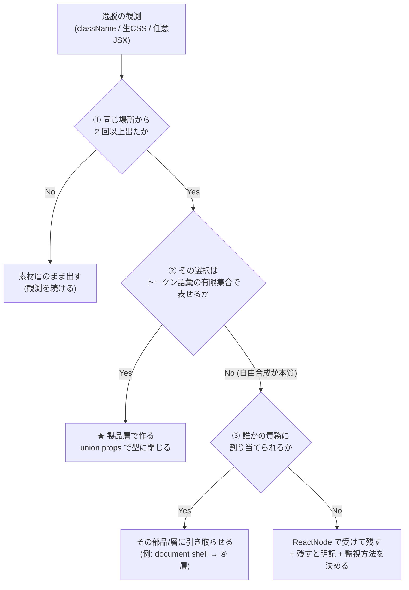

# 製品層の部品設計（手8c）

> 手8c の**設計**（D4=C の 2 本目）。調査は [二層構造の設計.md](二層構造の設計.md)（調査1）と[製品層の抽象化の軸.md](製品層の抽象化の軸.md)（調査2）。
> **この手では実装しない**（D6=B: props シグネチャまで）。次の手がこのまま実装に入れる形を目指す。
> 入力は 6 周ぶんの実測（[実行記録 §手8c H8C-01](実行記録.md)）と DS 8 本の調査。

---

## 1. 判定規則（Q1）— 「素材層のまま出す」と「製品層で作る」の境界

### 1.1 境界の原理

**境界は「見た目の管轄権」で決まる。**調査で headless 二層を持つ 4 本（Radix・Base UI・Ark・React Aria）が全てこの軸で切っていた（[二層構造の設計 §6](二層構造の設計.md)）:

- **素材層** = 見た目を決めない層（"unstyled … complete control over styling" — Radix）。`className` が開いているのは**この層の設計**であって欠陥ではない
- **製品層** = 見た目を決める層。**画面（と design agent）が見た目を選ぶ必要が生じた箇所を、トークン語彙の props として引き取る**

我々の製品層が引き取るべきものは、**利用側が `className` / 生 CSS / 任意 JSX で書かざるを得なかった「見た目の選択」**である。

### 1.2 判定手順（この順に問う。「ケースバイケース」を許さない形）



| # | 問い | Yes | No |
| --- | --- | --- | --- |
| ① | **同じ場所から 2 回以上出たか**（周をまたいで） | ② へ | **作らない**（素材層のまま。2 回ルール） |
| ② | **その選択はトークン語彙の有限集合で表せるか**（幅・書式・色調…） | ★ **製品層で作る。**union props で**型に閉じる**（[DR-0032](DR/DR-0032-layout-primitives-take-props-not-classname.md) の形。Polaris `Box` の `padding?: SpaceScale` と同型） | ③ へ |
| ③ | **誰かの責務に割り当てられるか**（例: document 全体に効くもの → 一番外の ④ 層） | その部品・層に引き取らせる | **ReactNode で受けて残す。**「残す」と明記し、**監視方法（grep できる形）**を決める |

### 1.3 なぜこの規則か（調査からの根拠）

1. **① は 2 回ルール**（CLAUDE.md）そのもの。素材層 15 件のラッパー需要は 6 周で 0 回——**予防的ラッパーは作らない**。Polaris が「全部閉じる」を選べたのは自社 1 プロダクト（admin）に最適化できるからで、我々は**必要が証明された箇所だけ閉じる**
2. **② は「閉じた 2 本」の共通設計**——Spectrum は「**外に効く layout オプションだけ許可・内側は不許可**」（RFC 原文）、Polaris は「**トークン名の props だけ**」。どちらも**禁止ではなく、代替の語彙を型で与えている**（[DR-0063](DR/DR-0063-forbidding-without-an-alternative-fails.md) の機械化）。そして手8 の実測が同じ答えを出している——**props の形そのものが答え**（`width="md"` なら綴り事故も起きえない）
3. **③ の「残す」は Radix Themes・Spectrum の運用**——逃げ道をゼロにした DS は 8 本中 2 本だけで、その 2 本も**部品の外**（トークンで自作・UNSAFE_）に出口を用意している。出口の無い禁止は [DR-0069](DR/DR-0069-adding-prohibitions-to-the-header-degraded-the-output.md)（禁止だけ足すと別の場所が壊れる）を再演する

## 2. 作る部品の一覧（Q2）— 根拠 0 回のものは入っていない

| # | 部品・変更 | 足す根拠（実測回数） | 判定規則 | 種別 |
| --- | --- | --- | --- | --- |
| 1 | **`Select` ラッパー**——`SelectTrigger` に `width` prop | **6/6 周**（毎回同じ 2 箇所。r1 `w-48`→r3/r6 `w-field-md`→r4/r5 `class=` 事故） | ①Yes ②Yes（`w-field-sm/md/lg` の 3 語） | ② 製品層・ラッパー（素通し → 既定値ラッパーへ昇格） |
| 2 | **`DataGrid` の宣言的列オプション**——`columns` を `ColumnDef` 素通しから自前の `DataGridColumn` へ | **6/6 周**（語彙表の外に出た逸脱は全部ここ: `tabular-nums`・`font-emphasis`・cell 内 `text-table`） | ①Yes ②Yes（numeric / emphasis / size の 3 オプション） | ② 製品層・自作の API 変更 |
| 3 | **`AppShell` に document shell 責務**——html/body reset 相当を ④ 層が持つ | **5/6 周**（`<style>` の `html, body { margin:0… }`。手順書 §1 の「4 回」は数え損ないで 5 回） | ①Yes ②No ③Yes（**「誰も持っていない」が原因**。自称 "page skeleton" の AppShell が引き取る） | ④ Templates の責務追加 |
| 4 | **`Link` 部品**（Navigation） | **4/6 周**（`a { color: var(--primary) }` の生 CSS） | ①Yes ②Yes（tone は semantic 色 1 語＋ external の有無） | ② 製品層・自作（新規） |
| 5 | **語彙表と tokens.css の突き合わせ**——`font-emphasis` を header 語彙表に載せる（か text-emphasis に一本化） | 実測 3 周（r1・r2・r6）＋ **我々自身が `AppShell` で使っている** | —（部品ではなく語彙の整備。[DR-0063](DR/DR-0063-forbidding-without-an-alternative-fails.md) の「語彙を足す」） | 語彙 |
| 6 | **conventions header の教え文の対更新**——`<SelectTrigger className="w-field-md">` の例示を `width="md"` へ | header L53 が**現行の書き方を教えている**（棚卸しの新発見 1） | —（#1 と**同一コミットで**変える。部品と散文の同時更新） | 散文 |

**作らないもの**: 素材層 15 件の予防的ラッパー（**0/6 周**・規則①で棄却）。`Box` の廃止（6 手連続 0 回で問題が起きていない・§4）。

## 3. props シグネチャ（D6=B）

各部品で **`className` を受けるかを明示**する（H8C-06 の要求）。

### 3.1 `Select` ラッパー（`src/components/Selection/Select.tsx` を素通し → ラッパーへ）

```ts
import { WIDTH_FIELD } from '@/components/Layout/tokens'; // 新設: field 幅の union

/** 幅の語彙。tokens.css の --container-field-* に対応（DR-0061）。 */
export const FIELD_WIDTH = {
  sm: 'w-field-sm',
  md: 'w-field-md',
  lg: 'w-field-lg',
} as const;
export type FieldWidth = keyof typeof FIELD_WIDTH;

export interface SelectTriggerProps
  extends Omit<React.ComponentProps<typeof UiSelectTrigger>, 'className'> {
  /** フィールドの幅。語彙は w-field-*。未指定は内容なり（上流の既定）。 */
  width?: FieldWidth;
}
// className: 🟥 受けない（Omit で型から消す）。幅以外の見た目の需要が 2 回出たら語彙を足す
```

- `Select` / `SelectContent` / `SelectItem` ほかは**素通しのまま**（逸脱の実測が無い）
- 🟨 上流（shadcn）の `SelectTrigger` は `className` を受ける。ラッパーで **Omit するのは我々の境界**であって上流の変更ではない（手3 D1=(c) の「既定値ラッパー」と同じ位置）

### 3.2 `DataGrid` の列オプション（`DataGridProps` の API 変更）

```ts
/** 列の定義。TanStack の ColumnDef は公開 API から消える（§5）。 */
export interface DataGridColumn<TData> {
  key: string;
  header: React.ReactNode;
  /** セルの中身。部品（StatusPill 等）の合成はここで行う。 */
  accessor: (row: TData) => React.ReactNode;
  /** 🟦 数値・ID・日時の列。部品側が等幅 + tabular-nums を当てる（呼び出し側は書かない）。 */
  numeric?: boolean;
  /** 🟦 強調（氏名・題名など）。部品側が text-emphasis / font-emphasis を当てる。 */
  emphasis?: boolean;
  /** 文字サイズの語彙。既定は 'table'。 */
  size?: 'table' | 'label';
}

export interface DataGridProps<TData> {
  data: TData[];
  columns: DataGridColumn<TData>[];   // ← ColumnDef<TData, TValue>[] を置き換え
  onRowSelect?: (row: TData) => void;
  empty?: React.ReactNode;
}
// className: 🟥 受けない（現行どおり）
// 内部で DataGridColumn → ColumnDef へ変換する。TanStack は実装詳細に戻る
```

- 🟥 **手4 の実装コメント「密データは呼び出し側が等幅・tabular-nums で描く」を撤回する設計**——書式の管轄を部品側へ移す。面③の逸脱（6/6 周）はこの押し出しの帰結だった
- 🟨 `accessor` は ReactNode を返す口として**残る**（§4 の逃げ道 3）。残す理由: セルには `StatusPill` 等の**部品の合成**が要り、これは語彙の有限集合で表せない（規則②No）。**className の文字列はここを通らない**（書式は numeric/emphasis/size が引き取る）
- 🟦 副産物: 生成物の `React.createElement(StatusPill, {tone}, children)` 型不整合（[未決 #28](handoff.md)）は、**列オプション化で cell 関数自体が生成物から消える**方向に解消する見込み（検算 §6.2）

### 3.3 `AppShell` の document shell（責務の追加）

```ts
export interface AppShellProps {
  brand: React.ReactNode;
  nav: NavItem[];
  children: React.ReactNode;
  // 変更なし。責務の追加は props ではなく実装（+ 説明文）:
  //   - document reset（html/body の margin 0・min-height）を AppShell が保証する
  //   - 実装位置は次の手の判断（globals.css の @layer base か、AppShell の style 注入か）
}
// className: 🟥 受けない（現行どおり）
```

- 🟥 **props は変わらない。変わるのは「保証」**——「AppShell の外に document reset を書く必要は無い」と .d.ts コメントと header で宣言する。5/6 周の `<style>` reset は「誰も保証していない」ことへの正しい反応だった
- 🟨 Storybook / design agent 環境では `globals.css` が届かない場合がある——**どの器で届けるかは次の手の実装判断**（ここでは「AppShell の責務である」ことだけ決める）

### 3.4 `Link`（`src/components/Navigation/Link.tsx`・新規）

```ts
export interface LinkProps
  extends Omit<React.ComponentProps<'a'>, 'className' | 'style'> {
  href: string;
  /** 色調。既定 'primary'（a { color: var(--primary) } の代替）。 */
  tone?: 'primary' | 'muted';
  /** 外部リンク。target=_blank + rel を部品側が付ける。 */
  external?: boolean;
  children: React.ReactNode;
}
// className: 🟥 受けない（NoStyleProps と同じ Omit 型）
```

- hover の下線・visited の扱いなどの**見た目は部品が決める**（4/6 周の `<style>` が書いていたもの）
- `src/index.ts` へ export を足す（`Link` が無いことが面④b の原因）

## 4. 逃げ道の扱い（Q3）

| 逃げ道 | 扱い | 監視方法 |
| --- | --- | --- |
| **`Box` の `className`** | 🟦 **残す**（設計上の唯一の名指しの逃げ道・[DR-0032](DR/DR-0032-layout-primitives-take-props-not-classname.md)）。Spectrum の `UNSAFE_` と同じ「**名前が破りを宣言する**」役割を Box という部品名が担う | 手3〜手8 で **6 手連続 0 回**。毎手の完了時に `Box` 使用箇所を数える（既存の未決 #21） |
| **素材層 16 件の `className`（再輸出の素通し）** | 🟦 **開いたまま**（上流の設計。閉じるのは #1 のように**需要が 2 回証明された部品だけ**） | 生成物の `class-name=` / `class=` を周ごとに grep（H8C-01 の形） |
| **`DataGrid.accessor` の ReactNode** | 🟨 **残す**（部品合成に必要・規則②No）。ただし**書式の語彙（numeric/emphasis/size）を対で与える**ので、className がここを通る動機は消える | 生成物の cell 相当部の `tabular-nums` 等**書式クラスの出現数**（0 が期待値） |
| **`<style>` への生 CSS** | 🟥 **設計では塞げない**（DSL 側の口）。#3・#4 で**書く動機を消す**のが本設計。禁止文は足さない（[DR-0069](DR/DR-0069-adding-prohibitions-to-the-header-degraded-the-output.md)） | `<style` タグの出現数（0 が期待値） |

★ **Q3 の答え**: 「逃げ道を持たない製品層」は**成立する**（Polaris・Spectrum が 7 年以上運用）。ただし両者とも**部品の外に出口**（トークンで自作・UNSAFE_・style props 許可リスト）を持つ。**逃げ道はゼロにするものではなく、(a) 数を絞り (b) 名指しで目立たせ (c) 代替語彙と対にする**——我々の Box + 語彙 props はこの 3 条件を既に満たしており、**維持でよい**。

## 5. 依存の型の扱い（Q6）

**規則: 依存パッケージの型を公開 API に素通ししない。Omit で口を選別し、自層の名前で出し直す。**

- 調査の裏づけ: 素通しは shadcn だけで、**コード所有モデル（利用者が編集できる）とセット**で成立している。パッケージ境界を保つ DS は全て選別か出し直し——MUI（`export type { … } from '@mui/base/…'`）・Ark/Chakra（**Omit＋prefix 改名**して 3 層貫通）・Spectrum（`extends Omit<AriaButtonProps, 'onClick'>, StyleProps`）・Primer（"keeping the exported types close to what we author"）・Polaris（再輸出しない）
- 我々は **bundle 配布（パッケージ境界型）なのに素通し**をしていた——`ColumnDef` と一緒に `cell` の任意 JSX の口が公開され、6 周ぶんの語彙外逸脱が全部そこから出た
- 適用: §3.2 の `DataGridColumn`（TanStack は実装詳細へ戻る）。`ListDetailState` 等の自前型は現状維持
- 🟨 副作用の見込み: 受け手は `.d.t` から lint を自動生成する（[DR-0059](DR/DR-0059-receiver-generates-its-own-adherence-lint.md)）。**依存の型が .d.ts から消えると、受け手の型抽出（未 import の `ColumnDef` で 5 件エラー・[未決 #29](handoff.md)）も軽くなる方向**

## 6. 検算（Q5・H8C-07）— 6 周ぶんの逸脱を設計に当てる

### 6.1 全逸脱の対応表

| 面 | 実測（6 周） | 書き換え後の形（実際に書いた） | 対応する設計 |
| --- | --- | --- | --- |
| ① `class-name="w-48"`（r1）×2 | `<SelectTrigger width="md">`（r1 当時は語彙も無かった。現在は語彙＋prop の両方がある） | §3.1 |
| ① `class-name="w-field-md"`（r3・r6）×2 | `<SelectTrigger width="md">` | §3.1 |
| ① `class="w-field-md"`（r4・r5・DSL 事故）×2 | 同上。**`width` はハイフン無し属性なので kebab→camel 変換の罠（`collectProps` の分岐）自体を通らない**——事故の面ごと消える | §3.1 |
| ② `Box class-name="bg-card rounded-md border"`（r2）×1 | `<Card>`（🟦 **手7 で解決済み**——「部品を足すと閉じる」の実証。設計変更不要） | —（規則①の先行実証） |
| ③ `tabular-nums`（r1/r2/r3/r6 各 2） | `{ key: 'id', numeric: true }`・`{ key: 'updatedAt', numeric: true }` | §3.2 |
| ③ `font-emphasis`（r1×1・r2×2・r6×1） | `{ key: 'subject', emphasis: true }` | §3.2 ＋ 語彙表整備（#5） |
| ③ cell 内 `text-table` / `text-label` / `text-emphasis` | `size: 'table' / 'label'`・`emphasis: true` | §3.2 |
| ④a `html, body { margin:0… }`（5 周） | 書かない（AppShell が保証すると header で宣言） | §3.3 |
| ④b `a { color: var(--primary) }`（4 周） | `<Link href={…}>` | §3.4 |

**全件が設計のどこかに対応づいた。**「残す」と明記したのは `DataGrid.accessor` の ReactNode（§4）と、素材層 16 件の `className`（§4）の 2 つ。

### 6.2 対応づけの限界（🟥 断定しないこと）

1. **机上で消えても実際に消えるかは次の手**（実装 → 再同期 → 7 周目）。とくに「design agent が `width` prop を選ぶか」は [DR-0063](DR/DR-0063-forbidding-without-an-alternative-fails.md)（語彙を足したら使われた）からの**類推**であって実測ではない
2. `numeric`/`emphasis` の語彙で design agent の**表現意図を全部受けられるかは未知**——受けられない意図が出たら、それは §1.2 の規則①（新しい観測）として次の周に数える
3. AppShell の document reset を**どの器で届けるか**は実装判断が残る（§3.3）

## 7. ADR 昇格の判定（起案はしない・D4=C）

- §1 の判定規則と §5 の型規則は「一度決めると戻しにくい・外から見える構造に効く」——🔺 **昇格候補**。ただし本書は study であり、**先に DR で決定を 1 本ずつ切り出す**（[未決 #20](handoff.md) の「finding 由来は決定を書く工程が先」と同じ扱いを避けるため、DR は decision として書く）
